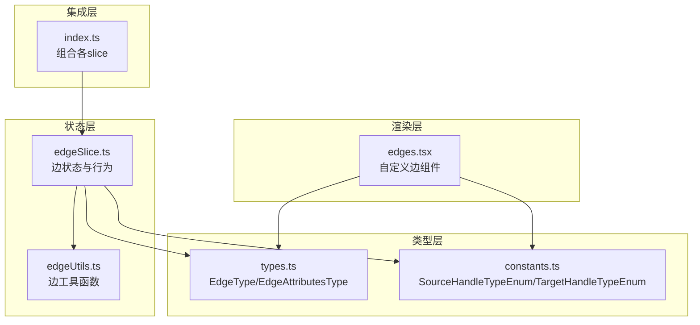
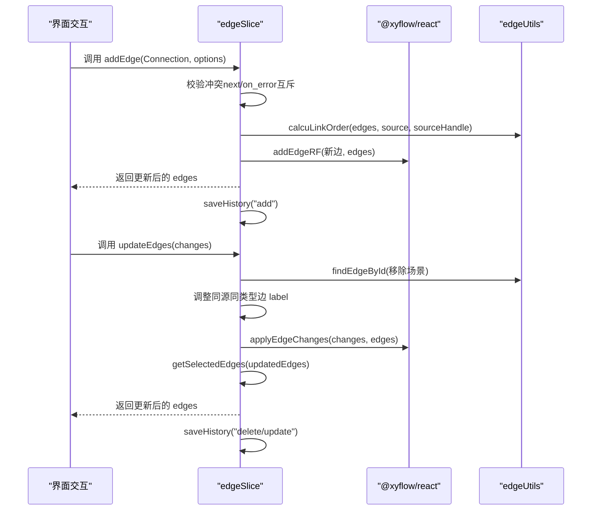
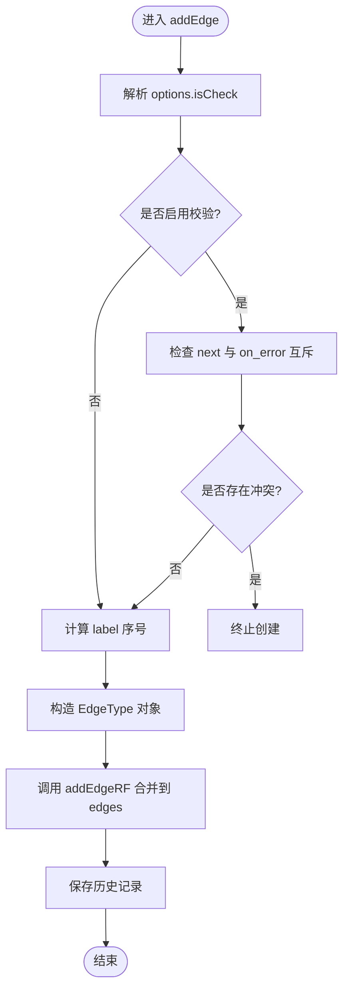
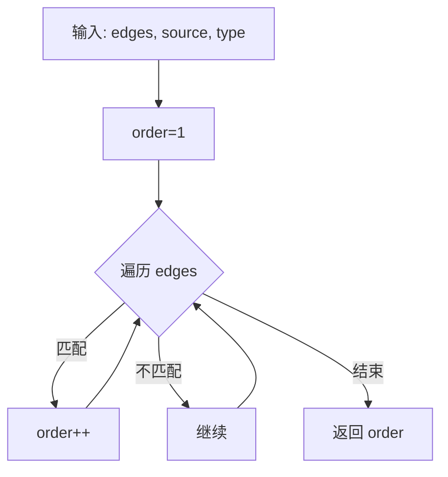
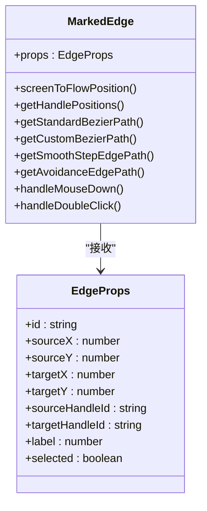
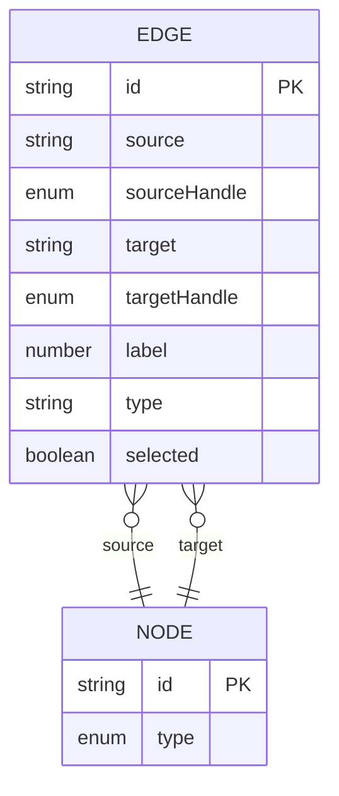
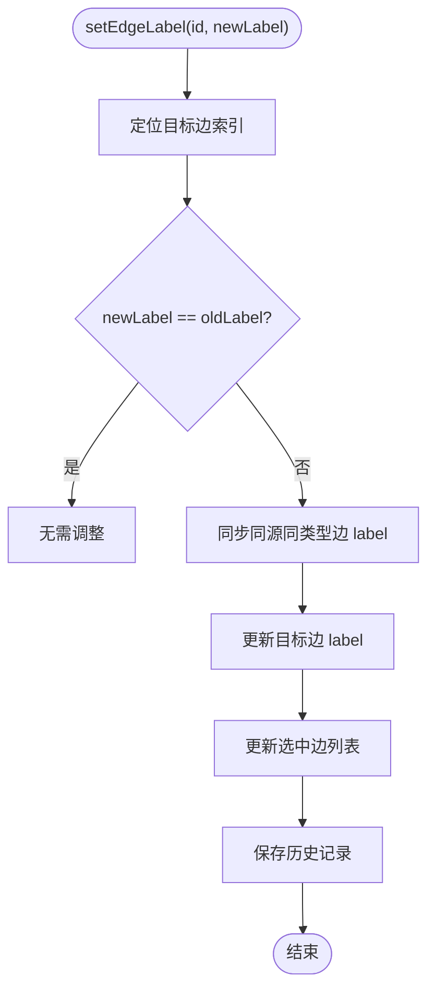
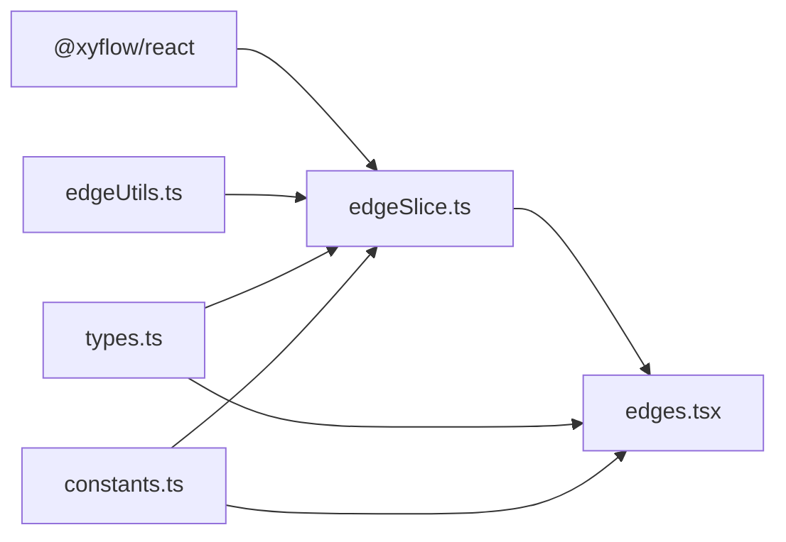

# 连线状态管理（edgeSlice）

<cite>
**本文档引用的文件**
- [edgeSlice.ts](file://src/stores/flow/slices/edgeSlice.ts)
- [edgeUtils.ts](file://src/stores/flow/utils/edgeUtils.ts)
- [edges.tsx](file://src/components/flow/edges.tsx)
- [types.ts](file://src/stores/flow/types.ts)
- [index.ts](file://src/stores/flow/index.ts)
- [constants.ts](file://src/components/flow/nodes/constants.ts)
</cite>

## 目录
1. [简介](#简介)
2. [项目结构](#项目结构)
3. [核心组件](#核心组件)
4. [架构总览](#架构总览)
5. [详细组件分析](#详细组件分析)
6. [依赖分析](#依赖分析)
7. [性能考虑](#性能考虑)
8. [故障排查指南](#故障排查指南)
9. [结论](#结论)
10. [附录](#附录)

## 简介
本文件围绕连线状态管理（edgeSlice）进行系统化技术说明，重点解释以下方面：
- 如何通过 edgeSlice 管理节点间的连接关系
- 连线的创建、修改、删除操作流程与规则
- 连线类型系统与连接规则验证
- 连线排序与层级管理机制
- 连线状态扩展与自定义连线类型的实现指导
- 性能优化与复杂连接关系处理技巧

## 项目结构
连线状态管理位于前端状态层（Zustand）与渲染层（React Flow）之间，采用“slice + 自定义工具函数 + 自定义边组件”的分层设计：
- 状态层：edgeSlice 定义边的状态与行为接口
- 工具层：edgeUtils 提供查找、筛选、排序等通用能力
- 渲染层：edges.tsx 实现自定义边类型与路径计算
- 类型层：types.ts 定义 EdgeType、EdgeAttributesType 等核心类型
- 集成层：index.ts 组合各 slice；constants.ts 定义句柄类型枚举

**图表来源**
- [edgeSlice.ts:1-238](file://src/stores/flow/slices/edgeSlice.ts#L1-L238)
- [edgeUtils.ts:1-32](file://src/stores/flow/utils/edgeUtils.ts#L1-L32)
- [edges.tsx:1-676](file://src/components/flow/edges.tsx#L1-L676)
- [types.ts:29-40](file://src/stores/flow/types.ts#L29-L40)
- [constants.ts:2-11](file://src/components/flow/nodes/constants.ts#L2-L11)
- [index.ts:18-28](file://src/stores/flow/index.ts#L18-L28)

**章节来源**
- [edgeSlice.ts:16-238](file://src/stores/flow/slices/edgeSlice.ts#L16-L238)
- [edgeUtils.ts:1-32](file://src/stores/flow/utils/edgeUtils.ts#L1-L32)
- [edges.tsx:1-676](file://src/components/flow/edges.tsx#L1-L676)
- [types.ts:29-40](file://src/stores/flow/types.ts#L29-L40)
- [constants.ts:2-11](file://src/components/flow/nodes/constants.ts#L2-L11)
- [index.ts:18-28](file://src/stores/flow/index.ts#L18-L28)

## 核心组件
- 边类型与属性
  - EdgeType：包含 id、source、sourceHandle、target、targetHandle、label、type、selected、attributes 等字段
  - EdgeAttributesType：支持 jump_back、anchor 等扩展属性
- 边工具函数
  - findEdgeById：按 id 查找边
  - getSelectedEdges：筛选选中边
  - calcuLinkOrder：计算同源同类型边的排序序号
- 自定义边组件
  - MarkedEdge：基于贝塞尔/直角/避让路径绘制，支持控制点拖拽与标签渲染
  - edgeTypes：注册自定义边类型 marked

**章节来源**
- [types.ts:29-40](file://src/stores/flow/types.ts#L29-L40)
- [types.ts:24-27](file://src/stores/flow/types.ts#L24-L27)
- [edgeUtils.ts:4-31](file://src/stores/flow/utils/edgeUtils.ts#L4-L31)
- [edges.tsx:311-676](file://src/components/flow/edges.tsx#L311-L676)

## 架构总览
edgeSlice 作为 Zustand slice，负责：
- 维护 edges 数组与控制点重置键
- 提供 updateEdges、setEdgeData、setEdgeLabel、addEdge、setEdges、resetEdgeControls 等方法
- 在变更前后维护 label 序列一致性，并触发选中边更新与历史记录保存

**图表来源**
- [edgeSlice.ts:166-222](file://src/stores/flow/slices/edgeSlice.ts#L166-L222)
- [edgeSlice.ts:26-66](file://src/stores/flow/slices/edgeSlice.ts#L26-L66)
- [edgeUtils.ts:18-31](file://src/stores/flow/utils/edgeUtils.ts#L18-L31)

**章节来源**
- [edgeSlice.ts:16-238](file://src/stores/flow/slices/edgeSlice.ts#L16-L238)

## 详细组件分析

### 边状态与行为（edgeSlice）
- 初始化状态
  - edges：空数组
  - edgeControlResetKey：控制点重置键
  - edgeControlResetTargetIds：可选的目标边 id 列表
- 关键方法
  - updateEdges(changes)：应用边变更，维护 label 序列，更新选中边并保存历史
  - setEdgeData(id, key, value)：更新边 attributes，支持 undefined/false 表示删除属性
  - setEdgeLabel(id, newLabel)：调整同源同类型边的 label 序列，保持唯一性
  - addEdge(co, options)：创建新边，执行 next/on_error 互斥校验，计算 label 并调用 addEdgeRF
  - setEdges(edges)：批量替换边列表
  - resetEdgeControls(targetEdgeIds?)：触发控制点重置

**图表来源**
- [edgeSlice.ts:166-222](file://src/stores/flow/slices/edgeSlice.ts#L166-L222)

**章节来源**
- [edgeSlice.ts:20-238](file://src/stores/flow/slices/edgeSlice.ts#L20-L238)

### 边工具函数（edgeUtils）
- findEdgeById：在边数组中按 id 查找
- getSelectedEdges：过滤 selected=true 的边
- calcuLinkOrder：统计同源同类型边数量并返回 label 序号

**图表来源**
- [edgeUtils.ts:18-31](file://src/stores/flow/utils/edgeUtils.ts#L18-L31)

**章节来源**
- [edgeUtils.ts:1-32](file://src/stores/flow/utils/edgeUtils.ts#L1-L32)

### 自定义边组件（edges.tsx）
- MarkedEdge：实现三种路径模式
  - 贝塞尔：支持控制点拖拽与双击重置
  - 直角阶梯：基于 getSmoothStepPath
  - 避让：基于 calculateAvoidancePath，处理平行边与节点避让
- 样式与交互
  - 根据 sourceHandleId/targetHandleId 设置不同样式类
  - 支持焦点透明度与路径模式下的关联高亮
  - 控制点样式与拖拽状态联动

**图表来源**
- [edges.tsx:311-676](file://src/components/flow/edges.tsx#L311-L676)

**章节来源**
- [edges.tsx:1-676](file://src/components/flow/edges.tsx#L1-L676)

### 类型系统与连接规则
- EdgeType 字段
  - id、source、sourceHandle、target、targetHandle、label、type、selected、attributes
- EdgeAttributesType
  - jump_back：跳转回退标记
  - anchor：锚点标记
- 句柄类型
  - SourceHandleTypeEnum：Next、Error
  - TargetHandleTypeEnum：Target、JumpBack
- 连接规则
  - next 与 on_error 不能同时指向同一目标节点（互斥校验）

**图表来源**
- [types.ts:29-40](file://src/stores/flow/types.ts#L29-L40)
- [constants.ts:2-11](file://src/components/flow/nodes/constants.ts#L2-L11)

**章节来源**
- [types.ts:29-40](file://src/stores/flow/types.ts#L29-L40)
- [constants.ts:2-11](file://src/components/flow/nodes/constants.ts#L2-L11)
- [edgeSlice.ts:175-197](file://src/stores/flow/slices/edgeSlice.ts#L175-L197)

### 排序与层级管理
- 同源同类型边的 label 序列
  - 新增边：通过 calcuLinkOrder 计算 label
  - 删除边：更新后续边 label，避免断层
  - 移动边：setEdgeLabel 调整目标边 label，并同步其他边的 label

**图表来源**
- [edgeSlice.ts:113-163](file://src/stores/flow/slices/edgeSlice.ts#L113-L163)
- [edgeUtils.ts:18-31](file://src/stores/flow/utils/edgeUtils.ts#L18-L31)

**章节来源**
- [edgeSlice.ts:113-163](file://src/stores/flow/slices/edgeSlice.ts#L113-L163)
- [edgeUtils.ts:18-31](file://src/stores/flow/utils/edgeUtils.ts#L18-L31)

### 扩展与自定义
- 自定义边类型
  - 在 edgeTypes 中注册新的边组件（如 marked）
  - 在 edges.tsx 中实现路径计算与交互逻辑
- 属性扩展
  - 通过 EdgeAttributesType 扩展 attributes 字段，支持 jump_back、anchor 等
  - setEdgeData 动态更新属性，支持删除属性（undefined/false）
- 连接规则扩展
  - 在 addEdge 的校验逻辑中增加新的互斥或约束条件

**章节来源**
- [edges.tsx:673-676](file://src/components/flow/edges.tsx#L673-L676)
- [types.ts:24-27](file://src/stores/flow/types.ts#L24-L27)
- [edgeSlice.ts:69-110](file://src/stores/flow/slices/edgeSlice.ts#L69-L110)

## 依赖分析
- 组件耦合
  - edgeSlice 依赖 @xyflow/react 的 addEdgeRF、applyEdgeChanges
  - edgeSlice 依赖 edgeUtils 的工具函数
  - edges.tsx 依赖 React Flow 的 EdgeProps、BaseEdge、getSmoothStepPath 等
- 外部依赖
  - @xyflow/react：提供边变更应用、连接升级等能力
  - zustand：提供状态存储与派发
- 潜在循环依赖
  - 无直接循环依赖；edgeSlice 与 edges.tsx 通过类型与工具函数间接协作

**图表来源**
- [edgeSlice.ts:1-14](file://src/stores/flow/slices/edgeSlice.ts#L1-L14)
- [edges.tsx:1-26](file://src/components/flow/edges.tsx#L1-L26)
- [types.ts:1-16](file://src/stores/flow/types.ts#L1-L16)
- [constants.ts:1-25](file://src/components/flow/nodes/constants.ts#L1-L25)

**章节来源**
- [edgeSlice.ts:1-14](file://src/stores/flow/slices/edgeSlice.ts#L1-L14)
- [edges.tsx:1-26](file://src/components/flow/edges.tsx#L1-L26)

## 性能考虑
- 路径计算优化
  - 避让模式仅在 edgePathMode 为 "avoid" 时启用，减少不必要的计算
  - 控制点拖拽仅在贝塞尔模式下启用，避免无效 DOM 操作
- 状态更新最小化
  - updateEdges 使用 applyEdgeChanges 一次性应用变更，减少多次重渲染
  - setEdgeLabel 仅对受影响的同源同类型边进行 label 同步
- 选择与聚焦
  - 通过 focusOpacity 与路径模式减少无关元素的渲染开销
- 复杂连接关系
  - 并行边（同源同目标）通过 calculateAvoidancePath 与索引计算，避免视觉重叠

[本节为通用性能建议，不直接分析具体文件]

## 故障排查指南
- 连线无法创建
  - 检查 next 与 on_error 是否互斥冲突
  - 确认 sourceHandle/targetHandle 类型正确
- 连线顺序异常
  - 调用 setEdgeLabel 后检查同源同类型边 label 是否正确同步
- 控制点不响应
  - 确认 edgePathMode 为 "bezier" 且 showEdgeControlPoint 为 true
  - 检查 resetEdgeControls 是否被调用导致重置
- 标签不显示
  - 确认 showEdgeLabel 为 true 且边的 label 存在

**章节来源**
- [edgeSlice.ts:175-197](file://src/stores/flow/slices/edgeSlice.ts#L175-L197)
- [edgeSlice.ts:113-163](file://src/stores/flow/slices/edgeSlice.ts#L113-L163)
- [edges.tsx:372-388](file://src/components/flow/edges.tsx#L372-L388)
- [edges.tsx:618-622](file://src/components/flow/edges.tsx#L618-L622)

## 结论
edgeSlice 通过明确的类型定义、严格的连接规则与高效的工具函数，实现了对连线状态的精细化管理。配合自定义边组件与路径策略，既能满足常规连线需求，又具备扩展与优化空间。遵循本文档的实践建议，可在复杂工作流场景中保持良好的性能与可维护性。

## 附录
- 相关类型与常量
  - EdgeType、EdgeAttributesType、SourceHandleTypeEnum、TargetHandleTypeEnum
- 相关工具函数
  - findEdgeById、getSelectedEdges、calcuLinkOrder
- 相关组件
  - MarkedEdge、edgeTypes

**章节来源**
- [types.ts:29-40](file://src/stores/flow/types.ts#L29-L40)
- [types.ts:24-27](file://src/stores/flow/types.ts#L24-L27)
- [constants.ts:2-11](file://src/components/flow/nodes/constants.ts#L2-L11)
- [edgeUtils.ts:4-31](file://src/stores/flow/utils/edgeUtils.ts#L4-L31)
- [edges.tsx:673-676](file://src/components/flow/edges.tsx#L673-L676)