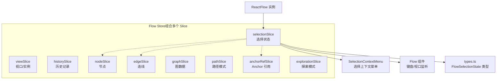
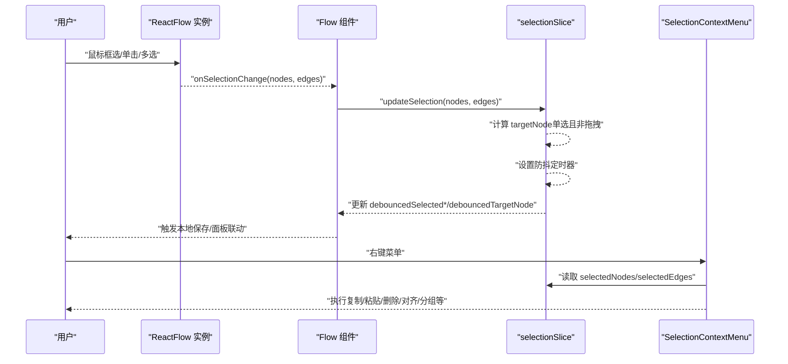
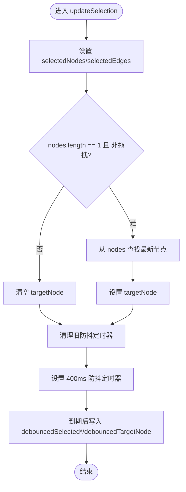
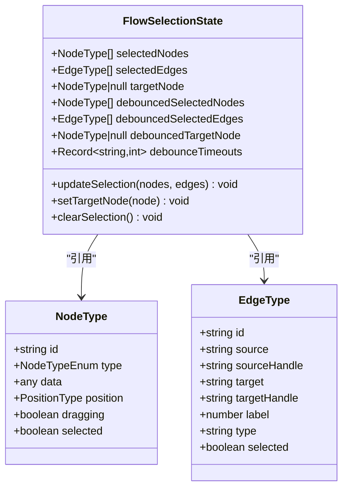

# 选择状态管理（selectionSlice）

<cite>
**本文档引用的文件**
- [selectionSlice.ts](file://src/stores/flow/slices/selectionSlice.ts)
- [index.ts](file://src/stores/flow/index.ts)
- [types.ts](file://src/stores/flow/types.ts)
- [Flow.tsx](file://src/components/Flow.tsx)
- [SelectionContextMenu.tsx](file://src/components/flow/components/SelectionContextMenu.tsx)
- [selectionContextMenu.tsx](file://src/components/flow/selectionContextMenu.tsx)
- [nodeContextMenu.tsx](file://src/components/flow/nodes/nodeContextMenu.tsx)
- [constants.ts](file://src/components/flow/nodes/constants.ts)
</cite>

## 目录
1. [简介](#简介)
2. [项目结构](#项目结构)
3. [核心组件](#核心组件)
4. [架构总览](#架构总览)
5. [详细组件分析](#详细组件分析)
6. [依赖关系分析](#依赖关系分析)
7. [性能考量](#性能考量)
8. [故障排查指南](#故障排查指南)
9. [结论](#结论)
10. [附录](#附录)

## 简介
本文件系统性阐述选择状态管理（selectionSlice）在工作流画布中的设计与实现，重点覆盖以下方面：
- selectionSlice 如何管理当前选中的节点与连线状态
- 单选、多选、框选等选择模式的实现与交互
- 选择状态与节点/连线数据的同步机制
- 选择事件的处理流程与回调机制
- 选择状态扩展与自定义选择行为的实现指导
- 选择性能优化与批量操作技巧

## 项目结构
选择状态管理位于“flow”域的 Zustand store 中，由多个 slice 组合而成。selectionSlice 负责维护选中节点、选中连线、目标节点以及带防抖的“最终稳定”选择状态，并与上下文菜单、键盘快捷键、画布实例等模块协同。

图表来源
- [index.ts:18-28](file://src/stores/flow/index.ts#L18-L28)
- [selectionSlice.ts:13-18](file://src/stores/flow/slices/selectionSlice.ts#L13-L18)
- [types.ts:249-261](file://src/stores/flow/types.ts#L249-L261)

章节来源
- [index.ts:18-28](file://src/stores/flow/index.ts#L18-L28)
- [types.ts:249-261](file://src/stores/flow/types.ts#L249-L261)

## 核心组件
- selectionSlice：提供选择状态的增删改查、目标节点设置、清空选择、带防抖的稳定选择状态等能力。
- Flow 组件：注册 ReactFlow 实例、监听视口变化、处理键盘快捷键、触发 selectionSlice 的更新。
- SelectionContextMenu：基于当前选择状态动态渲染菜单项，调用 selectionSlice 或其他 slice 的操作。
- selectionContextMenu.tsx：定义菜单项配置、可见性/禁用逻辑、点击回调（复制、粘贴、删除、对齐、分组等）。
- types.ts：定义 FlowSelectionState、NodeType、EdgeType 等类型，确保选择状态的数据结构一致。

章节来源
- [selectionSlice.ts:13-112](file://src/stores/flow/slices/selectionSlice.ts#L13-L112)
- [Flow.tsx:79-134](file://src/components/Flow.tsx#L79-L134)
- [SelectionContextMenu.tsx:50-159](file://src/components/flow/components/SelectionContextMenu.tsx#L50-L159)
- [selectionContextMenu.tsx:10-505](file://src/components/flow/selectionContextMenu.tsx#L10-L505)
- [types.ts:249-261](file://src/stores/flow/types.ts#L249-L261)

## 架构总览
选择状态管理采用“状态切片 + 类型约束 + 上下文菜单”的分层架构：
- 状态切片：selectionSlice 维护 selectedNodes、selectedEdges、targetNode、debounced* 系列稳定状态
- 类型约束：types.ts 明确定义节点/连线数据结构与选择状态接口，保证跨模块一致性
- 事件与回调：Flow 组件通过 ReactFlow 回调与快捷键触发 selectionSlice 更新；SelectionContextMenu 将用户操作映射为具体业务动作
- 同步与持久化：debounced* 状态用于降低频繁更新带来的渲染压力，并作为持久化与外部通知的稳定来源

图表来源
- [Flow.tsx:79-134](file://src/components/Flow.tsx#L79-L134)
- [selectionSlice.ts:29-76](file://src/stores/flow/slices/selectionSlice.ts#L29-L76)
- [SelectionContextMenu.tsx:50-159](file://src/components/flow/components/SelectionContextMenu.tsx#L50-L159)

## 详细组件分析

### selectionSlice：选择状态核心
- 状态字段
  - selectedNodes/selectedEdges：当前选中集合
  - targetNode：当且仅当单选且非拖拽时有效，用于“目标节点”场景（如锚点高亮）
  - debouncedSelected*/debouncedTargetNode：带 400ms 防抖的稳定版本，用于减少频繁渲染与持久化
  - debounceTimeouts：按需的额外防抖计时器（当前实现主要使用全局定时器）
- 关键方法
  - updateSelection(nodes, edges)：更新当前选择，计算 targetNode，启动防抖定时器，写入稳定状态；单选 Anchor 节点时触发高亮引用节点
  - setTargetNode(node)：单独设置目标节点，同样带防抖
  - clearSelection()：清空所有选择与防抖状态
- 同步机制
  - 防抖策略：每次更新选择时清理旧定时器，设置新定时器，到期后将当前最新状态写入 debounced* 字段
  - 目标节点规则：只有在 nodes.length === 1 且节点非拖拽时才更新 targetNode；否则清空
  - Anchor 特例：单选 Anchor 节点时，通过 setSelectedAnchorName 将引用该 anchor 的节点高亮

图表来源
- [selectionSlice.ts:29-76](file://src/stores/flow/slices/selectionSlice.ts#L29-L76)
- [selectionSlice.ts:56-63](file://src/stores/flow/slices/selectionSlice.ts#L56-L63)

章节来源
- [selectionSlice.ts:13-112](file://src/stores/flow/slices/selectionSlice.ts#L13-L112)

### Flow 组件：选择事件接入与快捷键
- 注册 ReactFlow 实例，以便后续调用 deleteElements 等方法
- 监听键盘快捷键（复制/粘贴），结合 clipboardStore 与 flow.store 的 paste 方法
- 监听视口变化，保存视口到文件配置
- 通过 useDebounceEffect 监听 debouncedSelected*/debouncedTargetNode 的变化，触发本地保存

章节来源
- [Flow.tsx:79-134](file://src/components/Flow.tsx#L79-L134)
- [Flow.tsx:164-189](file://src/components/Flow.tsx#L164-L189)

### SelectionContextMenu：菜单配置与回调
- 动态生成菜单项，依据当前选择状态决定可见性与禁用态
- 常见操作包括：复制、创建副本、部分导出、对齐、间距调整、自动布局、还原连线路径、分组/解组、删除
- 通过 selectionContextMenu.tsx 的工具函数筛选“与选中节点相关的边”，确保操作范围正确

章节来源
- [SelectionContextMenu.tsx:50-159](file://src/components/flow/components/SelectionContextMenu.tsx#L50-L159)
- [selectionContextMenu.tsx:322-505](file://src/components/flow/selectionContextMenu.tsx#L322-L505)

### 选择模式与框选
- 选择模式由底层 ReactFlow 的 SelectionMode 控制：全包含（Full）或部分重叠（Partial）
- 在本项目中，SelectionContextMenu 的“相关边”计算逻辑会根据选中节点集合过滤/扩展边集，从而实现“框选即关联”的体验

章节来源
- [selectionContextMenu.tsx:52-98](file://src/components/flow/selectionContextMenu.tsx#L52-L98)

### 选择状态与节点/连线数据的同步
- selectionSlice 仅维护节点/连线的引用集合（id 对应的实体来自 nodes/edges），避免深拷贝带来的性能问题
- 当节点被拖拽时，targetNode 的更新受“非拖拽”条件限制，防止拖动过程中的频繁切换
- Anchor 节点单选时，通过 setSelectedAnchorName 触发引用节点高亮，体现“锚点驱动”的可视化反馈

章节来源
- [selectionSlice.ts:37-48](file://src/stores/flow/slices/selectionSlice.ts#L37-L48)
- [selectionSlice.ts:68-75](file://src/stores/flow/slices/selectionSlice.ts#L68-L75)

### 选择事件处理流程与回调机制
- ReactFlow onSelectionChange → Flow 组件 → selectionSlice.updateSelection → 写入稳定状态 → 触发本地保存
- 右键菜单项 onClick → selectionContextMenu.tsx 的处理函数 → 调用 flow.store 的 paste/delete/align/group 等方法

章节来源
- [Flow.tsx:79-134](file://src/components/Flow.tsx#L79-L134)
- [selectionContextMenu.tsx:129-197](file://src/components/flow/selectionContextMenu.tsx#L129-L197)

### 扩展与自定义选择行为
- 新增选择模式：在 Flow 组件中配置 ReactFlow 的 SelectionMode，并在 selectionContextMenu.tsx 中扩展“相关边”筛选逻辑
- 自定义目标节点语义：在 selectionSlice 中扩展 targetNode 的判定条件（例如允许拖拽时的目标节点）
- 扩展菜单项：在 selectionContextMenu.tsx 的配置数组中新增条目，定义 visible/disabled/onClick 等属性
- 批量操作：利用 selectionContextMenu.tsx 的工具函数（如 getSelectionConnectedEdges/getSelectionRelatedEdges）限定操作范围，避免误删或误改

章节来源
- [selectionContextMenu.tsx:52-98](file://src/components/flow/selectionContextMenu.tsx#L52-L98)
- [selectionContextMenu.tsx:322-505](file://src/components/flow/selectionContextMenu.tsx#L322-L505)

## 依赖关系分析
- selectionSlice 依赖：
  - FlowStore 接口（FlowSelectionState）以确保类型安全
  - NodeTypeEnum（锚点类型）用于 Anchor 单选的特殊处理
  - useFlowStore 的 setSelectedAnchorName 以高亮引用节点
- Flow 组件依赖：
  - selectionSlice 的 updateSelection/setTargetNode/clearSelection
  - SelectionContextMenu 的配置与渲染
- SelectionContextMenu 依赖：
  - selectionSlice 的 selectedNodes/selectedEdges
  - selectionContextMenu.tsx 的工具函数与业务动作

图表来源
- [types.ts:249-261](file://src/stores/flow/types.ts#L249-L261)
- [types.ts:29-40](file://src/stores/flow/types.ts#L29-L40)
- [types.ts:157-235](file://src/stores/flow/types.ts#L157-L235)

章节来源
- [types.ts:249-261](file://src/stores/flow/types.ts#L249-L261)
- [constants.ts:14-20](file://src/components/flow/nodes/constants.ts#L14-L20)

## 性能考量
- 防抖策略
  - selectionSlice 使用 400ms 防抖，将高频选择变化收敛为稳定状态，减少渲染与持久化压力
  - Flow 组件使用 useDebounceEffect 监听 debounced* 状态变化，进一步降低本地保存频率
- 数据结构优化
  - 选择状态仅保存节点/连线引用，避免深拷贝带来的内存与时间开销
- 事件节流
  - 防抖定时器在每次更新前清理旧任务，避免累积延迟
- 批量操作建议
  - 对大量节点/连线进行统一操作时，优先使用 selectionContextMenu.tsx 的“相关边”筛选，缩小操作范围
  - 在需要撤销/重做的场景，配合 historySlice 使用，避免一次性大范围变更导致历史栈膨胀

章节来源
- [selectionSlice.ts:50-63](file://src/stores/flow/slices/selectionSlice.ts#L50-L63)
- [Flow.tsx:173-186](file://src/components/Flow.tsx#L173-L186)

## 故障排查指南
- 选择状态不同步
  - 确认 ReactFlow 的 onSelectionChange 是否正确调用 selectionSlice.updateSelection
  - 检查 Flow 组件是否正确注册实例与监听视口变化
- 目标节点未更新
  - 检查节点是否处于 dragging 状态；仅在非拖拽时才会更新 targetNode
  - 确认 selectedNodes 长度是否为 1
- 锚点高亮异常
  - 确认单选的是 Anchor 节点，且 setSelectedAnchorName 已被调用
- 右键菜单不可用
  - 检查 SelectionContextMenu 的 visible/disabled 条件是否满足当前选择状态
  - 确认 selectionContextMenu.tsx 的工具函数返回了正确的相关边集合

章节来源
- [selectionSlice.ts:37-48](file://src/stores/flow/slices/selectionSlice.ts#L37-L48)
- [selectionContextMenu.tsx:100-138](file://src/components/flow/selectionContextMenu.tsx#L100-L138)
- [SelectionContextMenu.tsx:61-133](file://src/components/flow/components/SelectionContextMenu.tsx#L61-L133)

## 结论
selectionSlice 通过“稳定状态 + 防抖 + 类型约束 + 上下文菜单”的组合，实现了高效、可控、可扩展的选择状态管理。其设计兼顾了用户体验（即时反馈 vs 稳定输出）、性能（低频持久化 vs 高频交互）与可维护性（清晰的职责边界）。在此基础上，可以安全地扩展更多选择模式与自定义行为，同时保持整体系统的稳定性。

## 附录
- 相关类型定义参考：FlowSelectionState、NodeType、EdgeType
- 节点类型枚举：NodeTypeEnum（用于区分 Anchor/Group/Sticker/Pipeline/External）

章节来源
- [types.ts:249-261](file://src/stores/flow/types.ts#L249-L261)
- [constants.ts:14-20](file://src/components/flow/nodes/constants.ts#L14-L20)