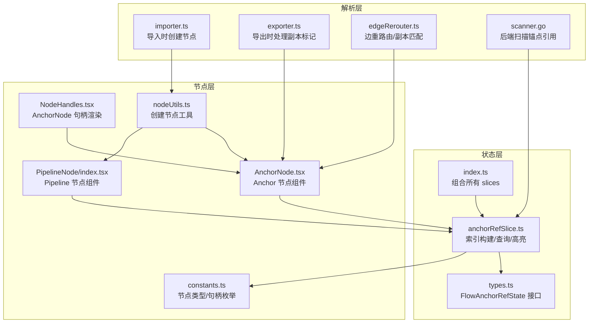
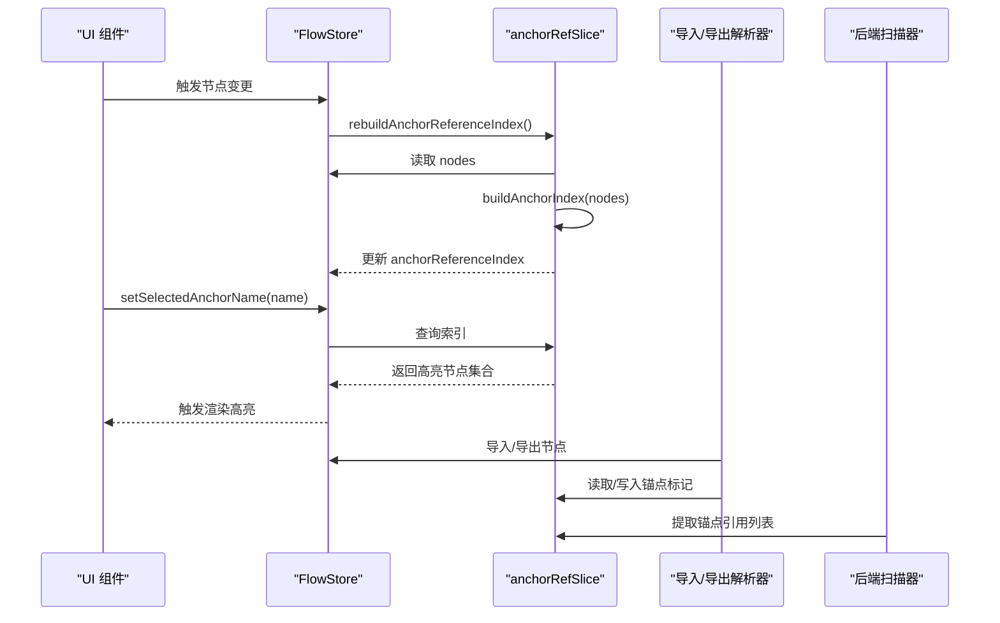
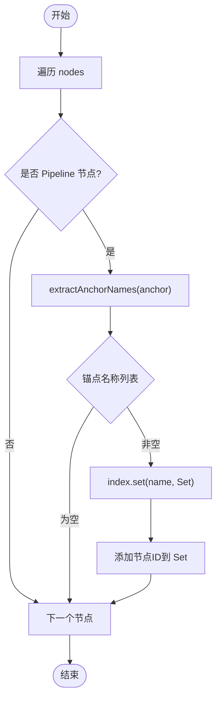
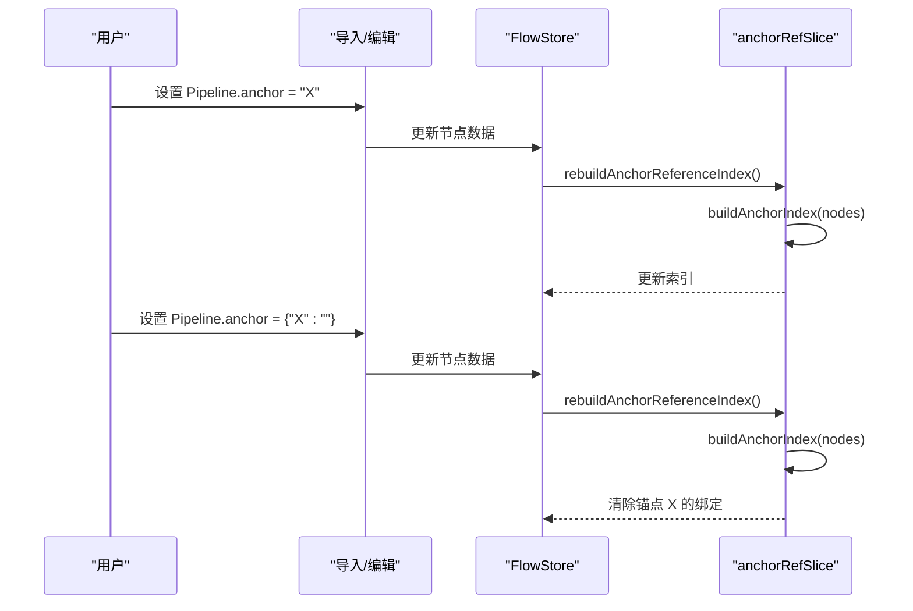
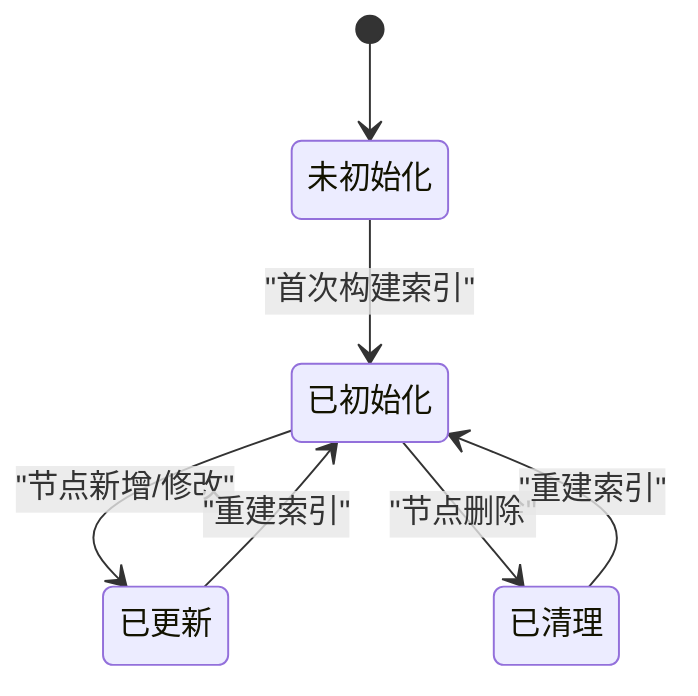
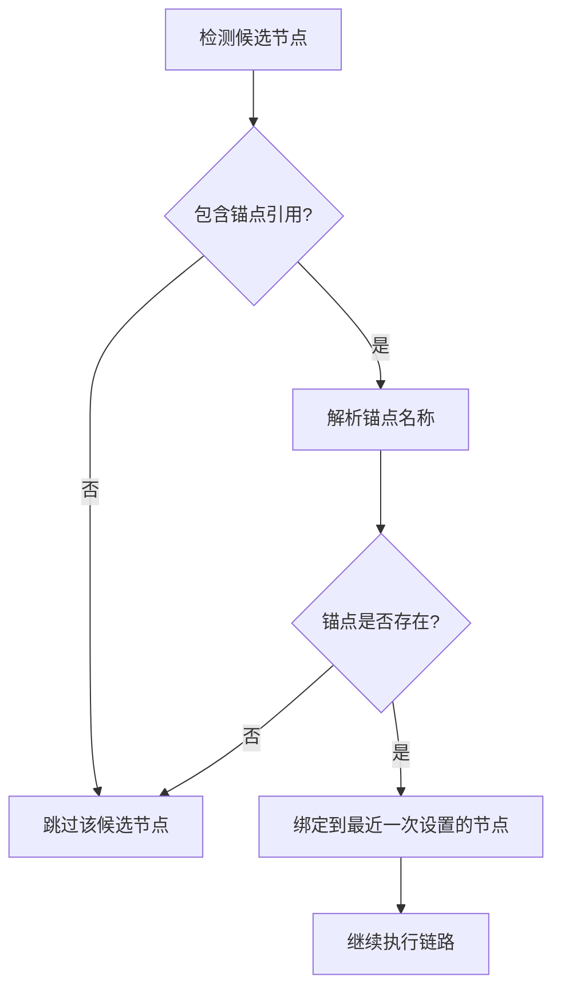
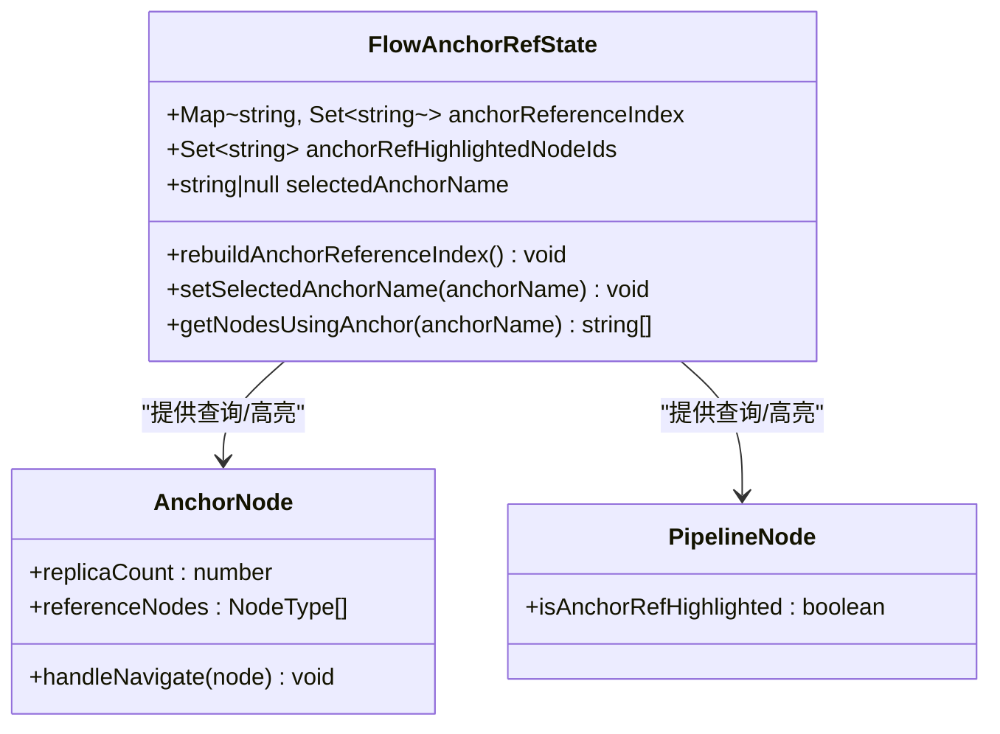
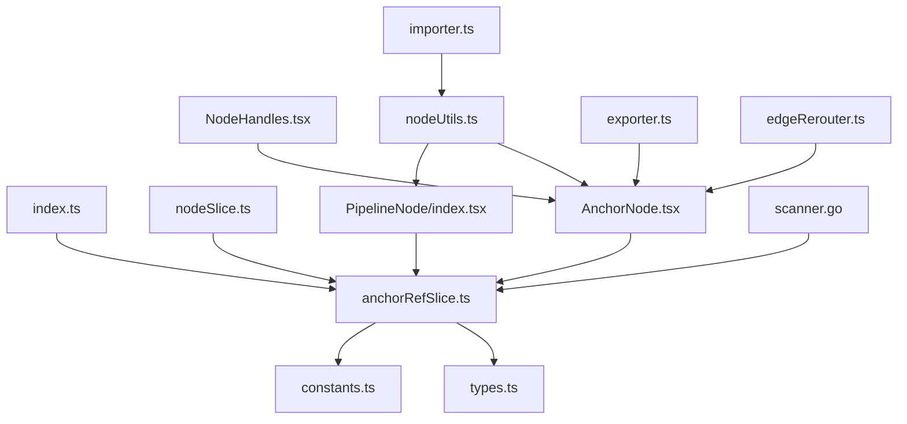

# 锚点引用状态管理 (anchorRefSlice)

<cite>
**本文档引用的文件**
- [anchorRefSlice.ts](file://src/stores/flow/slices/anchorRefSlice.ts)
- [types.ts](file://src/stores/flow/types.ts)
- [index.ts](file://src/stores/flow/index.ts)
- [nodeSlice.ts](file://src/stores/flow/slices/nodeSlice.ts)
- [constants.ts](file://src/components/flow/nodes/constants.ts)
- [NodeHandles.tsx](file://src/components/flow/nodes/components/NodeHandles.tsx)
- [AnchorNode.tsx](file://src/components/flow/nodes/AnchorNode.tsx)
- [PipelineNode/index.tsx](file://src/components/flow/nodes/PipelineNode/index.tsx)
- [nodeUtils.ts](file://src/stores/flow/utils/nodeUtils.ts)
- [importer.ts](file://src/core/parser/importer.ts)
- [exporter.ts](file://src/core/parser/exporter.ts)
- [edgeRerouter.ts](file://src/core/parser/edgeRerouter.ts)
- [scanner.go](file://LocalBridge/internal/service/file/scanner.go)
- [3.1-PipelineProtocol.md](file://dev/instructions/maafw-guide/3.1-PipelineProtocol.md)
</cite>

## 目录
1. [简介](#简介)
2. [项目结构](#项目结构)
3. [核心组件](#核心组件)
4. [架构总览](#架构总览)
5. [详细组件分析](#详细组件分析)
6. [依赖关系分析](#依赖关系分析)
7. [性能考虑](#性能考虑)
8. [故障排除指南](#故障排除指南)
9. [结论](#结论)
10. [附录](#附录)

## 简介
本文件聚焦于锚点引用状态管理（anchorRefSlice），系统性阐述其如何管理锚点引用关系，包括锚点的创建、绑定与解绑过程，生命周期管理与清理机制，冲突检测与解决策略，以及状态扩展与自定义锚点行为的实现指导。同时提供性能优化建议与大规模锚点场景下的管理技巧。

## 项目结构
anchorRefSlice 位于 Flow 状态管理的 slice 层，负责维护“锚点名称 → 使用该锚点的节点 ID 集合”的索引，并提供高亮、查询等能力。其与节点类型、节点组件、解析导出、以及全局 FlowStore 紧密协作。

**图表来源**
- [anchorRefSlice.ts:1-101](file://src/stores/flow/slices/anchorRefSlice.ts#L1-L101)
- [types.ts:355-369](file://src/stores/flow/types.ts#L355-L369)
- [index.ts:18-28](file://src/stores/flow/index.ts#L18-L28)
- [constants.ts:1-47](file://src/components/flow/nodes/constants.ts#L1-L47)
- [NodeHandles.tsx:223-276](file://src/components/flow/nodes/components/NodeHandles.tsx#L223-L276)
- [AnchorNode.tsx:120-370](file://src/components/flow/nodes/AnchorNode.tsx#L120-L370)
- [PipelineNode/index.tsx:126-155](file://src/components/flow/nodes/PipelineNode/index.tsx#L126-L155)
- [nodeUtils.ts:90-118](file://src/stores/flow/utils/nodeUtils.ts#L90-L118)
- [importer.ts:366-451](file://src/core/parser/importer.ts#L366-L451)
- [exporter.ts:100-136](file://src/core/parser/exporter.ts#L100-L136)
- [edgeRerouter.ts:37-88](file://src/core/parser/edgeRerouter.ts#L37-L88)
- [scanner.go:256-300](file://LocalBridge/internal/service/file/scanner.go#L256-L300)

**章节来源**
- [anchorRefSlice.ts:1-101](file://src/stores/flow/slices/anchorRefSlice.ts#L1-L101)
- [types.ts:355-369](file://src/stores/flow/types.ts#L355-L369)
- [index.ts:18-28](file://src/stores/flow/index.ts#L18-L28)

## 核心组件
- 索引构建函数：从节点数据中提取锚点名称，构建“锚点名称 → Set(节点ID)”映射，仅处理 Pipeline 节点。
- 状态接口：定义 anchorReferenceIndex、anchorRefHighlightedNodeIds、selectedAnchorName 以及相关操作方法。
- Slice 实现：提供重建索引、设置选中锚点、查询使用某锚点的节点列表等能力。
- 生命周期联动：节点增删改时触发索引重建，确保引用关系一致性。

关键职责与复杂度：
- 索引构建：遍历节点 O(N)，对每个节点提取锚点名称 O(K)（K 为锚点数量），整体 O(N·K)。
- 查询：Map 查找 O(1)，返回 Set 转数组 O(M)（M 为引用节点数）。
- 高亮：基于选中锚点名称直接映射到 Set，O(1) 初始化。

**章节来源**
- [anchorRefSlice.ts:12-55](file://src/stores/flow/slices/anchorRefSlice.ts#L12-L55)
- [types.ts:355-369](file://src/stores/flow/types.ts#L355-L369)
- [nodeSlice.ts:118-136](file://src/stores/flow/slices/nodeSlice.ts#L118-L136)

## 架构总览
anchorRefSlice 通过以下路径与系统交互：
- 数据来源：FlowStore.nodes（Pipeline 节点）
- 索引更新：节点变更时调用 rebuildAnchorReferenceIndex
- UI 驱动：AnchorNode/PipelineNode 组件根据高亮集合渲染视觉反馈
- 导入导出：解析器在导入/导出时处理副本与锚点标记
- 后端扫描：Go 侧扫描器提取锚点引用列表

**图表来源**
- [anchorRefSlice.ts:69-100](file://src/stores/flow/slices/anchorRefSlice.ts#L69-L100)
- [nodeSlice.ts:118-136](file://src/stores/flow/slices/nodeSlice.ts#L118-L136)
- [importer.ts:366-451](file://src/core/parser/importer.ts#L366-L451)
- [exporter.ts:100-136](file://src/core/parser/exporter.ts#L100-L136)
- [scanner.go:256-300](file://LocalBridge/internal/service/file/scanner.go#L256-L300)

## 详细组件分析

### 索引构建与锚点提取
- 支持的锚点格式：
  - 字符串："MyAnchor"
  - 字符串数组：["A", "B"]
  - 对象：{"A": "TargetNode", "B": ""}（空字符串表示清除此锚点）
- 仅处理 Pipeline 节点，忽略其他类型节点。
- 从 node.data.others.anchor 提取锚点值，过滤空白与无效项。

**图表来源**
- [anchorRefSlice.ts:36-55](file://src/stores/flow/slices/anchorRefSlice.ts#L36-L55)

**章节来源**
- [anchorRefSlice.ts:12-55](file://src/stores/flow/slices/anchorRefSlice.ts#L12-L55)

### 锚点创建、绑定与解绑
- 创建：通过 nodeUtils.createAnchorNode 或导入解析器创建 Anchor 节点；Pipeline 节点通过 others.anchor 设置锚点。
- 绑定：当 Pipeline 节点的 anchor 字段存在时，索引会记录该节点对该锚点的“最后绑定”。
- 解绑：通过对象形式将锚点映射至空字符串（""）来清除该锚点；或删除节点导致索引失效。

**图表来源**
- [nodeUtils.ts:90-118](file://src/stores/flow/utils/nodeUtils.ts#L90-L118)
- [importer.ts:366-451](file://src/core/parser/importer.ts#L366-L451)
- [anchorRefSlice.ts:69-73](file://src/stores/flow/slices/anchorRefSlice.ts#L69-L73)

**章节来源**
- [nodeUtils.ts:90-118](file://src/stores/flow/utils/nodeUtils.ts#L90-L118)
- [importer.ts:366-451](file://src/core/parser/importer.ts#L366-L451)
- [3.1-PipelineProtocol.md:1427-1511](file://dev/instructions/maafw-guide/3.1-PipelineProtocol.md#L1427-L1511)

### 锚点引用生命周期管理与清理
- 增删改节点：节点删除后自动重建索引，确保引用关系一致性。
- 移动节点：仅保存历史记录，不重建索引（避免不必要的计算）。
- 副本节点：External/Anchor 节点支持视觉副本，导出时通过 extra_positions 标记；边重路由时按距离选择最佳副本目标。

**图表来源**
- [nodeSlice.ts:118-136](file://src/stores/flow/slices/nodeSlice.ts#L118-L136)
- [edgeRerouter.ts:37-88](file://src/core/parser/edgeRerouter.ts#L37-L88)
- [exporter.ts:100-136](file://src/core/parser/exporter.ts#L100-L136)

**章节来源**
- [nodeSlice.ts:118-136](file://src/stores/flow/slices/nodeSlice.ts#L118-L136)
- [edgeRerouter.ts:37-88](file://src/core/parser/edgeRerouter.ts#L37-L88)
- [exporter.ts:100-136](file://src/core/parser/exporter.ts#L100-L136)

### 锚点冲突检测与解决策略
- 冲突来源：
  - 多个节点同时设置同一锚点名称（逻辑覆盖，保留最后一次设置）。
  - 清除锚点后，后续候选节点可能跳过。
- 解决策略：
  - 在 UI 中高亮显示引用该锚点的所有节点，便于用户识别冲突。
  - 通过 setSelectedAnchorName 选择锚点名称，自动计算高亮集合。
  - 导入导出时保持锚点语义一致，避免跨文件冲突。

**图表来源**
- [anchorRefSlice.ts:75-92](file://src/stores/flow/slices/anchorRefSlice.ts#L75-L92)
- [3.1-PipelineProtocol.md:1427-1511](file://dev/instructions/maafw-guide/3.1-PipelineProtocol.md#L1427-L1511)

**章节来源**
- [anchorRefSlice.ts:75-92](file://src/stores/flow/slices/anchorRefSlice.ts#L75-L92)
- [3.1-PipelineProtocol.md:1427-1511](file://dev/instructions/maafw-guide/3.1-PipelineProtocol.md#L1427-L1511)

### 锚点状态扩展与自定义行为
- 自定义锚点行为：
  - 通过对象形式设置多个锚点，或使用空字符串清空锚点。
  - 将锚点映射到特定目标节点，实现动态跳转。
- UI 扩展：
  - AnchorNode 组件展示引用该锚点的节点列表，支持导航到目标节点。
  - PipelineNode 组件根据高亮集合调整视觉样式。

**图表来源**
- [types.ts:355-369](file://src/stores/flow/types.ts#L355-L369)
- [AnchorNode.tsx:120-370](file://src/components/flow/nodes/AnchorNode.tsx#L120-L370)
- [PipelineNode/index.tsx:126-155](file://src/components/flow/nodes/PipelineNode/index.tsx#L126-L155)

**章节来源**
- [types.ts:355-369](file://src/stores/flow/types.ts#L355-L369)
- [AnchorNode.tsx:120-370](file://src/components/flow/nodes/AnchorNode.tsx#L120-L370)
- [PipelineNode/index.tsx:126-155](file://src/components/flow/nodes/PipelineNode/index.tsx#L126-L155)

## 依赖关系分析
anchorRefSlice 与其他模块的耦合关系如下：

**图表来源**
- [anchorRefSlice.ts:1-101](file://src/stores/flow/slices/anchorRefSlice.ts#L1-L101)
- [types.ts:355-369](file://src/stores/flow/types.ts#L355-L369)
- [index.ts:18-28](file://src/stores/flow/index.ts#L18-L28)
- [nodeSlice.ts:118-136](file://src/stores/flow/slices/nodeSlice.ts#L118-L136)
- [constants.ts:1-47](file://src/components/flow/nodes/constants.ts#L1-L47)
- [NodeHandles.tsx:223-276](file://src/components/flow/nodes/components/NodeHandles.tsx#L223-L276)
- [AnchorNode.tsx:120-370](file://src/components/flow/nodes/AnchorNode.tsx#L120-L370)
- [PipelineNode/index.tsx:126-155](file://src/components/flow/nodes/PipelineNode/index.tsx#L126-L155)
- [nodeUtils.ts:90-118](file://src/stores/flow/utils/nodeUtils.ts#L90-L118)
- [importer.ts:366-451](file://src/core/parser/importer.ts#L366-L451)
- [exporter.ts:100-136](file://src/core/parser/exporter.ts#L100-L136)
- [edgeRerouter.ts:37-88](file://src/core/parser/edgeRerouter.ts#L37-L88)
- [scanner.go:256-300](file://LocalBridge/internal/service/file/scanner.go#L256-L300)

**章节来源**
- [index.ts:18-28](file://src/stores/flow/index.ts#L18-L28)
- [nodeSlice.ts:118-136](file://src/stores/flow/slices/nodeSlice.ts#L118-L136)

## 性能考虑
- 索引重建成本控制：
  - 仅在节点删除时重建索引；移动/拖拽时不重建，减少频繁计算。
  - 索引构建为 O(N·K)，可通过批量操作后一次性重建降低开销。
- 查询与高亮：
  - Map/Set 查询为 O(1)，高亮集合按需计算，避免全量渲染。
- 大规模锚点管理：
  - 合理拆分工作区，限制单次操作涉及的节点数量。
  - 使用副本节点时，导出/导入尽量合并标记，减少冗余数据。
- UI 更新优化：
  - AnchorNode/PipelineNode 使用 memo 与浅比较，避免不必要重渲染。
  - 句柄更新使用 useUpdateNodeInternals 并延迟刷新，提升交互流畅度。

**章节来源**
- [nodeSlice.ts:118-136](file://src/stores/flow/slices/nodeSlice.ts#L118-L136)
- [NodeHandles.tsx:223-276](file://src/components/flow/nodes/components/NodeHandles.tsx#L223-L276)
- [AnchorNode.tsx:351-370](file://src/components/flow/nodes/AnchorNode.tsx#L351-L370)

## 故障排除指南
- 现象：锚点高亮不生效
  - 检查 selectedAnchorName 是否正确设置，确认索引中存在该锚点。
  - 确认节点类型为 Pipeline，且 others.anchor 字段格式正确。
- 现象：引用列表为空
  - 检查锚点名称大小写与空白字符，确保 trim 后有效。
  - 确认节点删除/移动后已重建索引。
- 现象：导出后锚点行为异常
  - 检查导出时 extra_positions 与锚点标记是否正确。
  - 确认副本节点的目标 ID 是否与最佳副本匹配。
- 现象：后端扫描未识别锚点
  - 确认锚点字段位置与解析器一致（前端在 others 中，后端在节点顶层）。

**章节来源**
- [anchorRefSlice.ts:75-92](file://src/stores/flow/slices/anchorRefSlice.ts#L75-L92)
- [exporter.ts:100-136](file://src/core/parser/exporter.ts#L100-L136)
- [edgeRerouter.ts:37-88](file://src/core/parser/edgeRerouter.ts#L37-L88)
- [scanner.go:256-300](file://LocalBridge/internal/service/file/scanner.go#L256-L300)

## 结论
anchorRefSlice 通过简洁高效的索引结构与完善的生命周期联动，实现了锚点引用关系的可靠管理。配合 UI 组件的高亮与导航能力，以及解析导出层的语义一致性保障，能够在复杂工作流中稳定地支持动态跳转与多节点协作。遵循本文的优化与排错建议，可进一步提升大规模场景下的性能与稳定性。

## 附录
- 相关协议与规范参考：锚点语义与用例说明
- 关键实现路径参考：
  - 索引构建与查询：[anchorRefSlice.ts:12-100](file://src/stores/flow/slices/anchorRefSlice.ts#L12-L100)
  - 状态接口定义：[types.ts:355-369](file://src/stores/flow/types.ts#L355-L369)
  - 组合与导出：[index.ts:18-28](file://src/stores/flow/index.ts#L18-L28)
  - 节点生命周期联动：[nodeSlice.ts:118-136](file://src/stores/flow/slices/nodeSlice.ts#L118-L136)
  - 节点类型与句柄：[constants.ts:1-47](file://src/components/flow/nodes/constants.ts#L1-L47)
  - 句柄渲染与更新：[NodeHandles.tsx:223-276](file://src/components/flow/nodes/components/NodeHandles.tsx#L223-L276)
  - Anchor 节点组件：[AnchorNode.tsx:120-370](file://src/components/flow/nodes/AnchorNode.tsx#L120-L370)
  - Pipeline 节点组件：[PipelineNode/index.tsx:126-155](file://src/components/flow/nodes/PipelineNode/index.tsx#L126-L155)
  - 节点创建工具：[nodeUtils.ts:90-118](file://src/stores/flow/utils/nodeUtils.ts#L90-L118)
  - 导入/导出解析：[importer.ts:366-451](file://src/core/parser/importer.ts#L366-L451)、[exporter.ts:100-136](file://src/core/parser/exporter.ts#L100-L136)
  - 边重路由与副本匹配：[edgeRerouter.ts:37-88](file://src/core/parser/edgeRerouter.ts#L37-L88)
  - 后端扫描锚点：[scanner.go:256-300](file://LocalBridge/internal/service/file/scanner.go#L256-L300)
  - 协议与用例说明：[3.1-PipelineProtocol.md:1427-1511](file://dev/instructions/maafw-guide/3.1-PipelineProtocol.md#L1427-L1511)