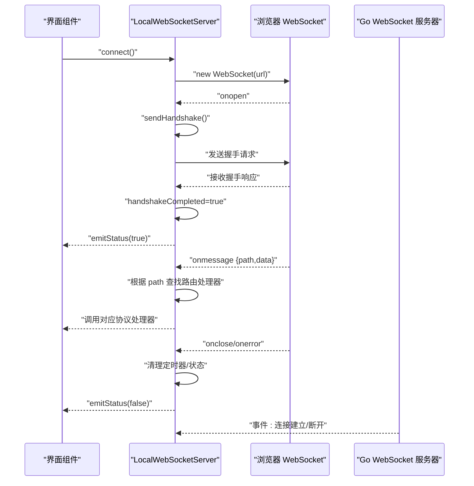
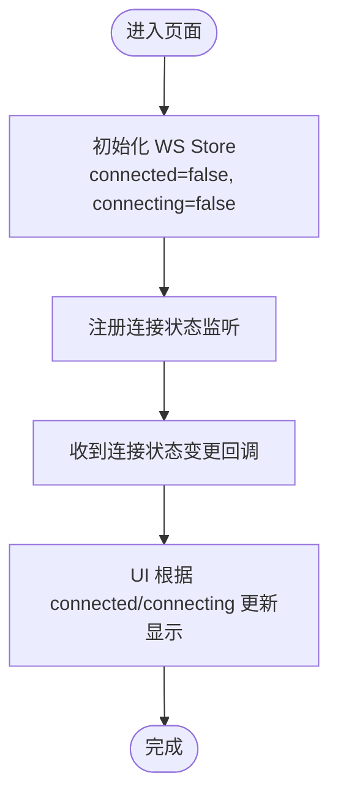
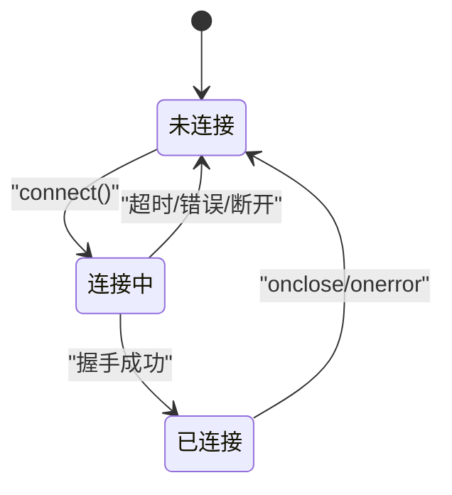
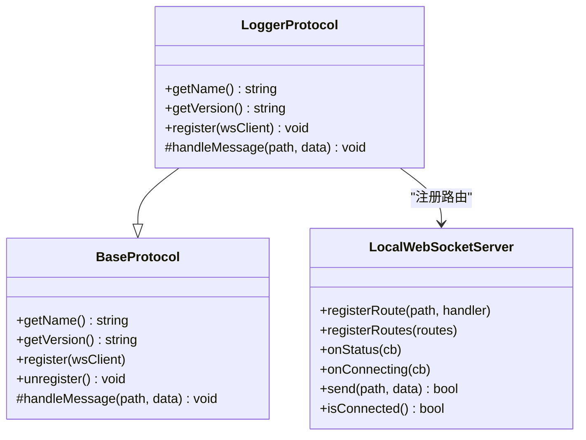
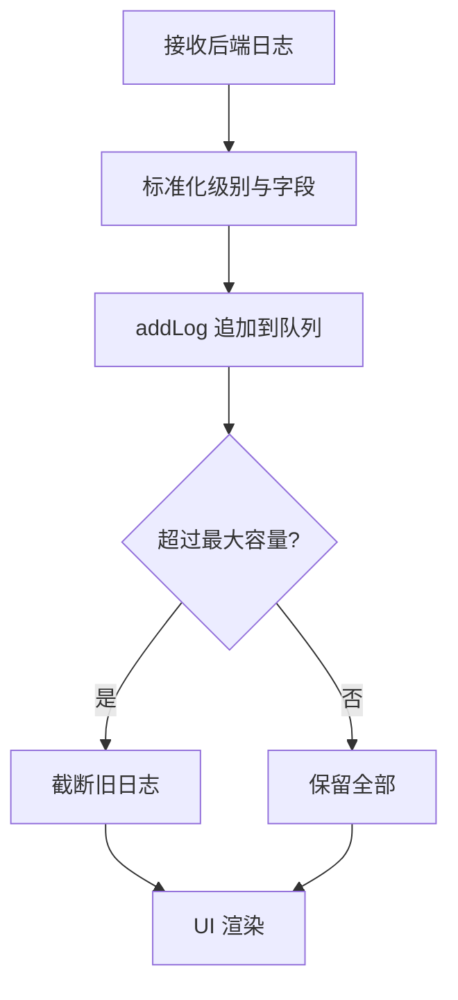
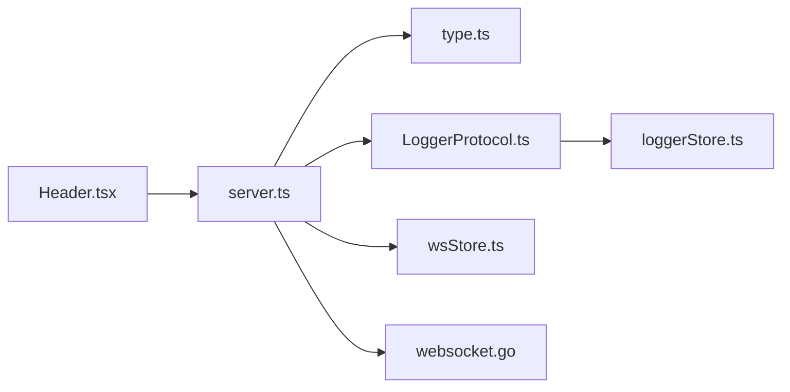

# WebSocket 状态管理

<cite>
**本文引用的文件**
- [wsStore.ts](file://src/stores/wsStore.ts)
- [server.ts](file://src/services/server.ts)
- [type.ts](file://src/services/type.ts)
- [loggerStore.ts](file://src/stores/loggerStore.ts)
- [LoggerProtocol.ts](file://src/services/protocols/LoggerProtocol.ts)
- [BaseProtocol.ts](file://src/services/protocols/BaseProtocol.ts)
- [websocket.go](file://LocalBridge/internal/server/websocket.go)
- [Header.tsx](file://src/components/Header.tsx)
- [configStore.ts](file://src/stores/configStore.ts)
- [registerProtocolListeners.ts](file://src/features/debug/registerProtocolListeners.ts)
</cite>

## 目录
1. [简介](#简介)
2. [项目结构](#项目结构)
3. [核心组件](#核心组件)
4. [架构总览](#架构总览)
5. [详细组件分析](#详细组件分析)
6. [依赖关系分析](#依赖关系分析)
7. [性能考虑](#性能考虑)
8. [故障排查指南](#故障排查指南)
9. [结论](#结论)
10. [附录](#附录)

## 简介
本文件围绕前端 WebSocket 状态管理进行系统性技术说明，重点覆盖以下方面：
- WS Store 在实时通信中的职责与状态模型
- 连接状态的跟踪与维护：连接中、已连接、握手完成等
- 消息路由与事件处理的状态管理
- 连接重试与错误恢复的状态逻辑
- 日志状态的收集与管理机制
- WebSocket 状态扩展与自定义连接的实现指导
- 连接监控与性能优化策略

## 项目结构
前端 WebSocket 相关代码主要分布在以下位置：
- 状态层：Zustand Store（连接状态、日志状态）
- 服务层：WebSocket 客户端封装、协议路由注册
- 协议层：协议基类与具体协议（如日志协议）
- 后端：Go 语言 WebSocket 服务器（升级、广播、事件发布）

```mermaid
graph TB
subgraph "前端"
UI["界面组件<br/>Header.tsx"]
WSStore["WS Store<br/>wsStore.ts"]
LoggerStore["日志 Store<br/>loggerStore.ts"]
Server["WebSocket 客户端<br/>server.ts"]
Protocols["协议模块<br/>LoggerProtocol.ts / BaseProtocol.ts"]
end
subgraph "后端"
GoServer["Go WebSocket 服务器<br/>websocket.go"]
end
UI --> WSStore
UI --> Server
Server --> Protocols
Protocols --> LoggerStore
Server <- --> GoServer
```

图表来源
- [Header.tsx:257-306](file://src/components/Header.tsx#L257-L306)
- [wsStore.ts:1-24](file://src/stores/wsStore.ts#L1-L24)
- [loggerStore.ts:1-46](file://src/stores/loggerStore.ts#L1-L46)
- [server.ts:22-343](file://src/services/server.ts#L22-L343)
- [LoggerProtocol.ts:16-57](file://src/services/protocols/LoggerProtocol.ts#L16-L57)
- [BaseProtocol.ts:7-39](file://src/services/protocols/BaseProtocol.ts#L7-L39)
- [websocket.go:36-178](file://LocalBridge/internal/server/websocket.go#L36-L178)

章节来源
- [wsStore.ts:1-24](file://src/stores/wsStore.ts#L1-L24)
- [server.ts:22-343](file://src/services/server.ts#L22-L343)
- [loggerStore.ts:1-46](file://src/stores/loggerStore.ts#L1-L46)
- [LoggerProtocol.ts:16-57](file://src/services/protocols/LoggerProtocol.ts#L16-L57)
- [BaseProtocol.ts:7-39](file://src/services/protocols/BaseProtocol.ts#L7-L39)
- [websocket.go:36-178](file://LocalBridge/internal/server/websocket.go#L36-L178)

## 核心组件
- WS Store：提供连接状态与“连接中”状态的轻量存储，便于 UI 展示与交互反馈。
- WebSocket 客户端（LocalWebSocketServer）：封装连接生命周期、握手、消息路由、错误处理与状态通知。
- 协议系统：通过 BaseProtocol 抽象统一协议注册与消息分发；LoggerProtocol 将后端日志推送到 loggerStore。
- 日志 Store：集中管理日志列表、展开状态与最大容量，支持追加、清理与滚动截断。

章节来源
- [wsStore.ts:7-23](file://src/stores/wsStore.ts#L7-L23)
- [server.ts:22-343](file://src/services/server.ts#L22-L343)
- [BaseProtocol.ts:7-39](file://src/services/protocols/BaseProtocol.ts#L7-L39)
- [LoggerProtocol.ts:16-57](file://src/services/protocols/LoggerProtocol.ts#L16-L57)
- [loggerStore.ts:11-45](file://src/stores/loggerStore.ts#L11-L45)

## 架构总览
前端通过 LocalWebSocketServer 与后端建立 WebSocket 连接，并在 onopen 时发送版本握手请求。握手成功后才认为连接有效；否则根据版本不匹配提示用户更新。消息到达时按 path 分发到已注册的路由处理器；onclose/onerror 会清理状态并发出通知。



图表来源
- [server.ts:109-270](file://src/services/server.ts#L109-L270)
- [server.ts:272-313](file://src/services/server.ts#L272-L313)
- [websocket.go:145-161](file://LocalBridge/internal/server/websocket.go#L145-L161)

## 详细组件分析

### WS Store：连接状态存储
- 状态键
  - connected：是否已连接且握手完成
  - connecting：是否处于连接中
- 行为
  - setConnected/setConnecting：更新状态
- 使用场景
  - UI 根据状态切换连接指示与按钮禁用态
  - Header 中通过定期轮询与回调同步连接状态



图表来源
- [wsStore.ts:18-23](file://src/stores/wsStore.ts#L18-L23)
- [Header.tsx:266-287](file://src/components/Header.tsx#L266-L287)

章节来源
- [wsStore.ts:7-23](file://src/stores/wsStore.ts#L7-L23)
- [Header.tsx:266-287](file://src/components/Header.tsx#L266-L287)

### WebSocket 客户端：连接生命周期与状态机
- 关键状态
  - isConnecting：防止重复连接
  - handshakeCompleted：握手完成标志
  - connectTimeout：连接超时控制
- 生命周期事件
  - onopen：发送握手请求
  - onmessage：解析消息并按 path 分发
  - onerror/onclose：清理并通知 UI
- 状态通知
  - emitStatus/emitConnecting：向订阅者广播连接状态变化
- 连接判定
  - isConnected：要求 readyState=OPEN 且握手完成



图表来源
- [server.ts:109-270](file://src/services/server.ts#L109-L270)
- [server.ts:307-318](file://src/services/server.ts#L307-L318)

章节来源
- [server.ts:22-343](file://src/services/server.ts#L22-L343)
- [type.ts:1-27](file://src/services/type.ts#L1-L27)

### 协议系统：消息路由与事件处理
- BaseProtocol
  - 规范协议名称、版本、注册与消息入口
- LoggerProtocol
  - 注册 /lte/logger 路由
  - 校验日志级别与结构
  - 写入 loggerStore，触发 UI 列表更新
- 其他协议
  - FileProtocol、MFWProtocol、ErrorProtocol、ConfigProtocol、DebugProtocolClient、ResourceProtocol、AIProtocol 等均以相同模式注册



图表来源
- [BaseProtocol.ts:7-39](file://src/services/protocols/BaseProtocol.ts#L7-L39)
- [LoggerProtocol.ts:16-57](file://src/services/protocols/LoggerProtocol.ts#L16-L57)
- [server.ts:97-106](file://src/services/server.ts#L97-L106)

章节来源
- [BaseProtocol.ts:7-39](file://src/services/protocols/BaseProtocol.ts#L7-L39)
- [LoggerProtocol.ts:16-57](file://src/services/protocols/LoggerProtocol.ts#L16-L57)
- [server.ts:97-106](file://src/services/server.ts#L97-L106)

### 日志状态：收集与管理
- 数据结构
  - LogEntry：包含 level/module/message/timestamp/id
  - LoggerState：logs、expanded、maxLogs、增删改操作
- 行为
  - addLog：追加新日志并限制最大数量（滚动截断）
  - clearLogs：清空日志
  - toggleExpanded/setExpanded：控制面板展开状态
- 来源
  - LoggerProtocol 将后端推送的日志标准化后写入 Store



图表来源
- [LoggerProtocol.ts:32-56](file://src/services/protocols/LoggerProtocol.ts#L32-L56)
- [loggerStore.ts:26-38](file://src/stores/loggerStore.ts#L26-L38)

章节来源
- [loggerStore.ts:11-45](file://src/stores/loggerStore.ts#L11-L45)
- [LoggerProtocol.ts:16-57](file://src/services/protocols/LoggerProtocol.ts#L16-L57)

### 连接监控与 UI 集成
- Header 中通过 localServer.onStatus 订阅连接状态变化
- 定时器每秒检查一次连接状态，确保 UI 与实际一致
- 支持端口动态切换与自动连接开关

章节来源
- [Header.tsx:266-287](file://src/components/Header.tsx#L266-L287)
- [configStore.ts:134-136](file://src/stores/configStore.ts#L134-L136)

### 错误恢复与重试策略
- 连接超时：设置固定超时时间，超时未打开则关闭连接、清理状态并提示
- 握手失败：若版本不匹配，提示并主动断开
- 连接断开：onclose 清理状态并通知 UI
- 重复连接防护：isConnecting 防止并发 connect

章节来源
- [server.ts:131-163](file://src/services/server.ts#L131-L163)
- [server.ts:42-66](file://src/services/server.ts#L42-L66)
- [server.ts:216-223](file://src/services/server.ts#L216-L223)
- [server.ts:116-120](file://src/services/server.ts#L116-L120)

### 自定义协议与扩展
- 新建协议类继承 BaseProtocol，实现 getName/getVersion/register/handleMessage
- 在 initializeWebSocket 中注册协议实例
- 通过 server.registerRoute 或协议内部 registerRoute 注册路由
- 可参考 LoggerProtocol 的实现模式

章节来源
- [BaseProtocol.ts:7-39](file://src/services/protocols/BaseProtocol.ts#L7-L39)
- [server.ts:361-387](file://src/services/server.ts#L361-L387)
- [LoggerProtocol.ts:25-30](file://src/services/protocols/LoggerProtocol.ts#L25-L30)

## 依赖关系分析
- 前端
  - Header 依赖 LocalWebSocketServer 的状态回调
  - LoggerProtocol 依赖 LocalWebSocketServer 的路由注册能力
  - WS Store 与 UI 组件解耦，仅通过状态暴露 setConnected/setConnecting
- 后端
  - Go 服务器负责连接升级、读写泵与事件发布
  - 与前端约定握手路由与消息结构



图表来源
- [Header.tsx:266-287](file://src/components/Header.tsx#L266-L287)
- [server.ts:22-343](file://src/services/server.ts#L22-L343)
- [type.ts:1-27](file://src/services/type.ts#L1-L27)
- [LoggerProtocol.ts:16-57](file://src/services/protocols/LoggerProtocol.ts#L16-L57)
- [loggerStore.ts:11-45](file://src/stores/loggerStore.ts#L11-L45)
- [wsStore.ts:7-23](file://src/stores/wsStore.ts#L7-L23)
- [websocket.go:36-178](file://LocalBridge/internal/server/websocket.go#L36-L178)

章节来源
- [Header.tsx:266-287](file://src/components/Header.tsx#L266-L287)
- [server.ts:22-343](file://src/services/server.ts#L22-L343)
- [LoggerProtocol.ts:16-57](file://src/services/protocols/LoggerProtocol.ts#L16-L57)
- [loggerStore.ts:11-45](file://src/stores/loggerStore.ts#L11-L45)
- [wsStore.ts:7-23](file://src/stores/wsStore.ts#L7-L23)
- [websocket.go:36-178](file://LocalBridge/internal/server/websocket.go#L36-L178)

## 性能考虑
- 连接超时与重连
  - 固定超时时间避免长时间阻塞 UI
  - 避免重复连接（isConnecting）
- 消息处理
  - onmessage 解析失败时记录错误但不中断后续处理
- 日志队列
  - 限制最大日志条数，超出时截断尾部，降低内存占用
- UI 轮询
  - 定时器周期性检查连接状态，建议在组件卸载时清理

章节来源
- [server.ts:131-163](file://src/services/server.ts#L131-L163)
- [server.ts:181-183](file://src/services/server.ts#L181-L183)
- [loggerStore.ts:33-37](file://src/stores/loggerStore.ts#L33-L37)
- [Header.tsx:280-286](file://src/components/Header.tsx#L280-L286)

## 故障排查指南
- 连接超时
  - 现象：弹窗提示“连接超时”，随后断开
  - 排查：确认本地服务已启动、端口正确、网络可达
- 协议版本不匹配
  - 现象：握手失败并提示版本差异
  - 排查：升级前端或后端至兼容版本
- 连接断开
  - 现象：onclose 触发，状态变为未连接
  - 排查：检查后端日志、网络波动、防火墙
- 日志不显示
  - 现象：日志面板为空
  - 排查：确认 LoggerProtocol 已注册、后端确有日志推送、级别过滤

章节来源
- [server.ts:135-162](file://src/services/server.ts#L135-L162)
- [server.ts:52-65](file://src/services/server.ts#L52-L65)
- [server.ts:216-223](file://src/services/server.ts#L216-L223)
- [LoggerProtocol.ts:32-56](file://src/services/protocols/LoggerProtocol.ts#L32-L56)

## 结论
该 WebSocket 状态管理体系以轻量 Store 与强健的客户端封装为核心，结合协议路由与日志 Store，实现了清晰的状态流转与可观测性。通过握手完成标志、超时控制与错误回调，系统具备良好的容错与恢复能力。建议在扩展新协议时遵循 BaseProtocol 模式，并在 UI 层保持对连接状态的及时感知与展示。

## 附录
- 端口与自动连接
  - 默认端口与自动连接开关来自配置 Store
- 调试协议监听
  - 通过 registerProtocolListeners 将调试事件写入多个调试 Store，便于联调与诊断

章节来源
- [configStore.ts:134-136](file://src/stores/configStore.ts#L134-L136)
- [registerProtocolListeners.ts:15-154](file://src/features/debug/registerProtocolListeners.ts#L15-L154)