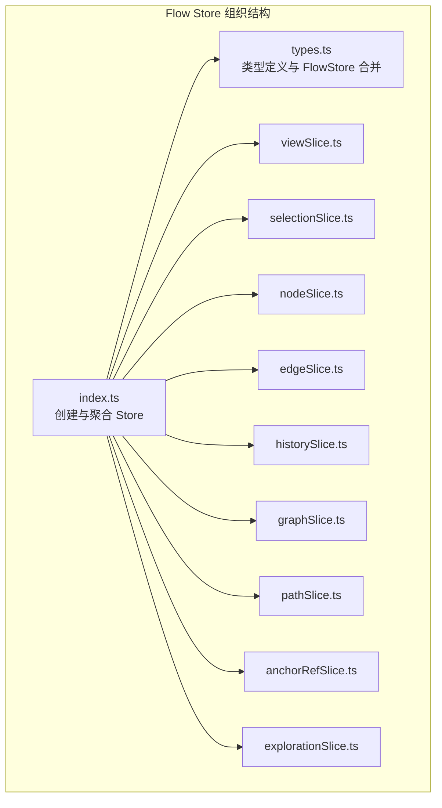
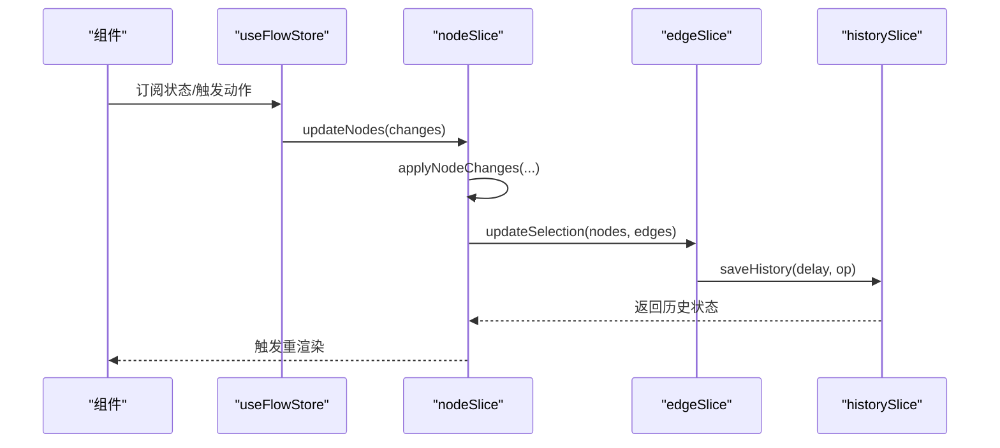
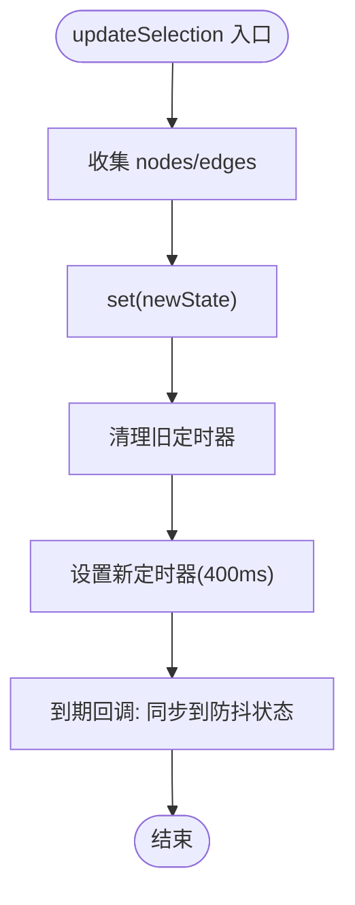
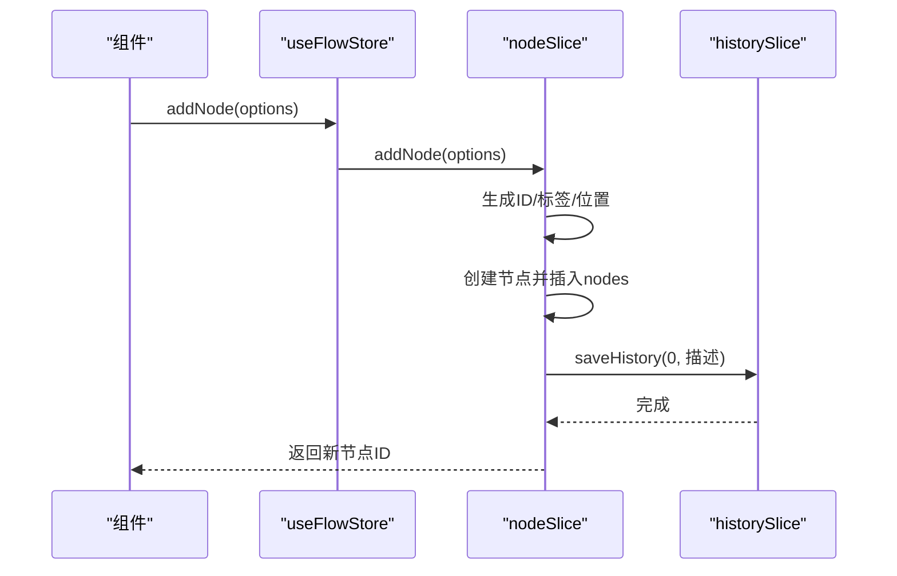
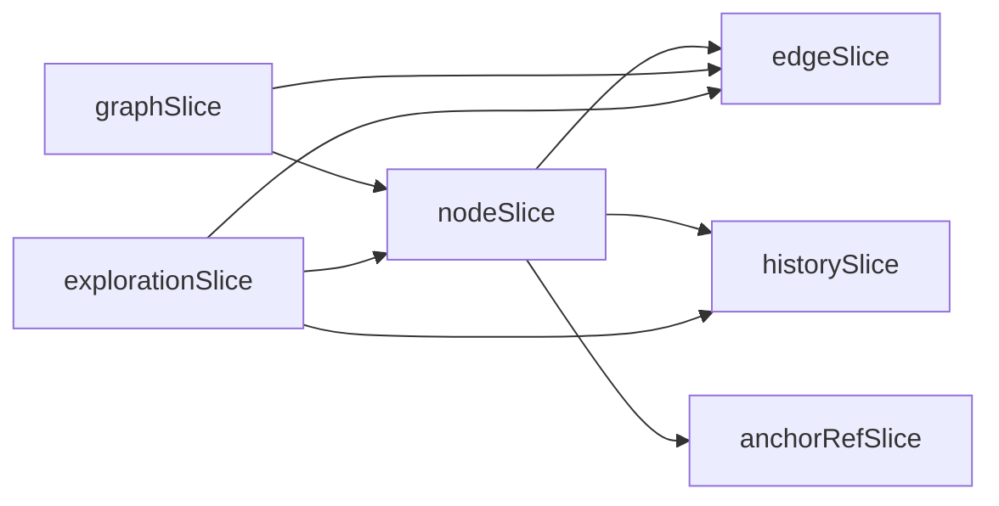

# Zustand 架构设计

<cite>
**本文档引用的文件**
- [src/stores/flow/index.ts](file://src/stores/flow/index.ts)
- [src/stores/flow/types.ts](file://src/stores/flow/types.ts)
- [src/stores/flow/slices/viewSlice.ts](file://src/stores/flow/slices/viewSlice.ts)
- [src/stores/flow/slices/selectionSlice.ts](file://src/stores/flow/slices/selectionSlice.ts)
- [src/stores/flow/slices/nodeSlice.ts](file://src/stores/flow/slices/nodeSlice.ts)
- [src/stores/flow/slices/edgeSlice.ts](file://src/stores/flow/slices/edgeSlice.ts)
- [src/stores/flow/slices/historySlice.ts](file://src/stores/flow/slices/historySlice.ts)
- [src/stores/flow/slices/graphSlice.ts](file://src/stores/flow/slices/graphSlice.ts)
- [src/stores/flow/slices/pathSlice.ts](file://src/stores/flow/slices/pathSlice.ts)
- [src/stores/flow/slices/anchorRefSlice.ts](file://src/stores/flow/slices/anchorRefSlice.ts)
- [src/stores/flow/slices/explorationSlice.ts](file://src/stores/flow/slices/explorationSlice.ts)
</cite>

## 目录
1. [简介](#简介)
2. [项目结构](#项目结构)
3. [核心组件](#核心组件)
4. [架构总览](#架构总览)
5. [详细组件分析](#详细组件分析)
6. [依赖关系分析](#依赖关系分析)
7. [性能考虑](#性能考虑)
8. [故障排查指南](#故障排查指南)
9. [结论](#结论)

## 简介
本文件系统性梳理项目中基于 Zustand 的状态管理架构，重点阐释以下方面：
- 设计理念与架构模式：以 slice 模式组织 Store，强调单一职责与可组合性。
- create 函数与 Store 组合策略：通过 create(...) 聚合多个 StateCreator，形成统一的 FlowStore。
- slice 模式的设计思想与实现原理：每个 slice 独立维护状态与动作，通过 set/get 访问上下文状态。
- 状态 Store 的创建、组合与管理机制：集中导出 useFlowStore，并提供工具函数与类型声明。
- 状态订阅与响应式更新：结合 React 组件订阅与 shallow 选择器减少不必要渲染。
- Store 扩展与自定义：如何新增 slice 与接入外部依赖。
- 性能优化策略与最佳实践：包括浅比较、选择器、节流/防抖、快照序列化等。

## 项目结构
Zustand 状态管理位于 src/stores/flow 目录，采用“主入口聚合 + 多 slice 组合”的组织方式：
- 主入口：index.ts 负责创建 Store 并聚合各 slice。
- 类型定义：types.ts 定义节点、边、参数类型以及各 slice 的状态接口与合并后的 FlowStore 类型。
- Slice 层：按功能拆分为 view、selection、node、edge、history、graph、path、anchorRef、exploration 等。

**图表来源**
- [src/stores/flow/index.ts:1-28](file://src/stores/flow/index.ts#L1-L28)
- [src/stores/flow/types.ts:429-439](file://src/stores/flow/types.ts#L429-L439)

**章节来源**
- [src/stores/flow/index.ts:1-28](file://src/stores/flow/index.ts#L1-L28)
- [src/stores/flow/types.ts:1-439](file://src/stores/flow/types.ts#L1-L439)

## 核心组件
- Store 创建与组合
  - 使用 create<FlowStore>()((...a) => ({ ...sliceCreators(...a) })) 的模式，将多个 StateCreator 组合为单一 Store。
  - 通过集中导出 useFlowStore，统一暴露状态与动作。
- 类型体系
  - FlowStore 由各 slice 的状态接口合并而成，确保类型安全与可维护性。
  - 节点、边、参数等复杂类型在 types.ts 中集中定义，便于复用与约束。
- 工具函数与辅助导出
  - 导出节点/边工具函数、坐标转换工具、视口适配等，供业务逻辑调用。

**章节来源**
- [src/stores/flow/index.ts:1-28](file://src/stores/flow/index.ts#L1-L28)
- [src/stores/flow/types.ts:429-439](file://src/stores/flow/types.ts#L429-L439)

## 架构总览
Zustand 在本项目中的架构遵循“slice 模式 + 组合 Store”的设计：
- slice 独立：每个 slice 专注自身领域（如节点、边、历史、图操作等），通过 StateCreator 定义状态与动作。
- 上下文访问：slice 内部通过 set(get()) 访问全局状态与其它 slice 的动作，实现跨域协作。
- 统一入口：index.ts 聚合所有 slice，形成 FlowStore；组件通过 useFlowStore 订阅所需状态片段。

**图表来源**
- [src/stores/flow/index.ts:18-28](file://src/stores/flow/index.ts#L18-L28)
- [src/stores/flow/slices/nodeSlice.ts:45-136](file://src/stores/flow/slices/nodeSlice.ts#L45-L136)
- [src/stores/flow/slices/edgeSlice.ts:26-66](file://src/stores/flow/slices/edgeSlice.ts#L26-L66)
- [src/stores/flow/slices/historySlice.ts:54-122](file://src/stores/flow/slices/historySlice.ts#L54-L122)

## 详细组件分析

### 视口与画布尺寸管理（viewSlice）
- 职责：维护 ReactFlow 实例、视口状态与画布尺寸。
- 关键动作：
  - updateInstance(instance)：更新实例引用。
  - updateViewport(viewport)：更新视口。
  - updateSize(width, height)：更新画布尺寸。
- 设计要点：状态最小化，动作幂等，避免不必要的重渲染。

**章节来源**
- [src/stores/flow/slices/viewSlice.ts:1-27](file://src/stores/flow/slices/viewSlice.ts#L1-L27)

### 选择与防抖（selectionSlice）
- 职责：管理选中节点/边、目标节点与防抖选择状态。
- 关键动作：
  - updateSelection(nodes, edges)：更新选择并启动防抖定时器，延迟同步到 debounced* 状态。
  - setTargetNode(node)：设置目标节点并防抖更新。
  - clearSelection()：清空选择并清理定时器。
- 设计要点：使用全局防抖定时器，避免高频更新导致的性能问题；根据拖拽状态智能更新目标节点。

**图表来源**
- [src/stores/flow/slices/selectionSlice.ts:29-76](file://src/stores/flow/slices/selectionSlice.ts#L29-L76)

**章节来源**
- [src/stores/flow/slices/selectionSlice.ts:1-112](file://src/stores/flow/slices/selectionSlice.ts#L1-L112)

### 节点管理（nodeSlice）
- 职责：节点增删改、分组/解组、批量更新、位置与顺序管理。
- 关键动作：
  - updateNodes(changes)：应用节点变更，处理 Group 子节点脱离、清理选中状态、保存历史。
  - addNode(options)：生成唯一 ID 与标签，创建节点，按需连接，分配顺序号，聚焦视图。
  - setNodeData(id, type, key, value)：深拷贝节点，更新识别/动作/其他字段，重建锚点索引。
  - batchSetNodeData(id, updates)：批量更新，保持一致性。
  - groupSelectedNodes()/ungroupNodes()/attach/detach：分组操作与父子关系维护。
- 设计要点：严格的数据拷贝与不可变更新；对 Group 节点顺序与父子关系进行一致性保证；与历史记录联动。

**图表来源**
- [src/stores/flow/slices/nodeSlice.ts:139-308](file://src/stores/flow/slices/nodeSlice.ts#L139-L308)
- [src/stores/flow/slices/historySlice.ts:54-122](file://src/stores/flow/slices/historySlice.ts#L54-L122)

**章节来源**
- [src/stores/flow/slices/nodeSlice.ts:1-718](file://src/stores/flow/slices/nodeSlice.ts#L1-L718)

### 边管理（edgeSlice）
- 职责：边的增删改、顺序调整、冲突检测与选择同步。
- 关键动作：
  - updateEdges(changes)：应用边变更，修正 label 顺序，同步选择状态，保存历史。
  - setEdgeData(id, key, value)：动态增删属性，同步选择状态，保存历史。
  - setEdgeLabel(id, newLabel)：调整同源同类型边的 label，保持顺序连续。
  - addEdge(co, options)：冲突检测（如 Next 与 on_error 互斥），计算链接次序，插入边。
  - resetEdgeControls(targetEdgeIds?)：重置控制点。
- 设计要点：严格的顺序维护与冲突检测；与节点选择联动；历史记录粒度控制。

**章节来源**
- [src/stores/flow/slices/edgeSlice.ts:1-238](file://src/stores/flow/slices/edgeSlice.ts#L1-L238)

### 历史记录（historySlice）
- 职责：提供撤销/重做能力，限制历史栈大小，差异检测与快照序列化。
- 关键动作：
  - saveHistory(delay, opDescriptor)：防抖保存，差异检测，写入操作日志，限制栈长度。
  - undo()/redo()：恢复到指定快照，调用 replace 更新图数据。
  - initHistory(nodes, edges)/clearHistory()：初始化与清空。
  - getHistoryState()：查询可撤销/可重做状态。
- 设计要点：结构化克隆降级策略；序列化剔除 UI 状态；与操作日志集成。

**章节来源**
- [src/stores/flow/slices/historySlice.ts:1-244](file://src/stores/flow/slices/historySlice.ts#L1-L244)

### 图数据与粘贴（graphSlice）
- 职责：替换整幅图、批量粘贴、节点位移调整、粘贴计数器管理。
- 关键动作：
  - replace(nodes, edges, options)：确保 Group 顺序正确，清空选择，可选聚焦视图，重建锚点索引。
  - paste(nodes, edges, position?)：克隆节点/边，生成新 ID 与标签，处理父子关系映射，自动加入现有组，更新选择并聚焦。
  - resetPasteCounter()/shiftNodes(direction, delta, targetNodeIds?)：粘贴计数器与节点间距调整。
- 设计要点：粘贴过程中的父子关系与绝对/相对坐标转换；自动组归属检测。

**章节来源**
- [src/stores/flow/slices/graphSlice.ts:1-310](file://src/stores/flow/slices/graphSlice.ts#L1-L310)

### 路径模式（pathSlice）
- 职责：基于 DFS 查找从起点到终点的所有可达路径，收集途经节点与边。
- 关键动作：
  - setPathMode(enabled)/setPathStartNode(nodeId)/setPathEndNode(nodeId)：切换模式与设置端点。
  - calculatePath()：构建邻接表，DFS 遍历，收集节点与边集合。
  - clearPath()：清空路径。
- 设计要点：邻接表 + DFS，避免环路；路径集合去重。

**章节来源**
- [src/stores/flow/slices/pathSlice.ts:1-159](file://src/stores/flow/slices/pathSlice.ts#L1-L159)

### 锚点引用索引（anchorRefSlice）
- 职责：从节点 others.anchor 字段提取锚点名称，建立“锚点 -> 使用该锚点的节点 ID 集合”索引，支持高亮与查询。
- 关键动作：
  - rebuildAnchorReferenceIndex()：扫描节点，构建索引。
  - setSelectedAnchorName(anchorName)：设置选中的锚点并高亮对应节点。
  - getNodesUsingAnchor(anchorName)：查询使用指定锚点的节点 ID 列表。
- 设计要点：支持字符串/数组/对象三种锚点字段格式；索引增量更新。

**章节来源**
- [src/stores/flow/slices/anchorRefSlice.ts:1-101](file://src/stores/flow/slices/anchorRefSlice.ts#L1-L101)

### 探索模式（explorationSlice）
- 职责：AI 驱动的探索流程，包括预测、审核、执行、确认、下一步、重新生成与完成。
- 关键动作：
  - start(goal, startNodeId?)/execute()/confirm()/nextStep()/regenerate()/complete()/abort(saveConfirmed)/
  - 内部方法：_setStatus/_setError/_setProgress/_setGhostNodeId。
- 设计要点：状态机驱动（idle/predicting/reviewing/executing/confirmed/completed）；与 AI 预测与执行模块集成；节点数据校验与修复。

**章节来源**
- [src/stores/flow/slices/explorationSlice.ts:1-344](file://src/stores/flow/slices/explorationSlice.ts#L1-L344)

## 依赖关系分析
- 组件耦合与协作
  - nodeSlice 与 edgeSlice：在节点/边变更后同步更新选择状态，确保 UI 一致。
  - nodeSlice 与 historySlice：所有节点/边/组操作均触发 saveHistory，形成完整变更轨迹。
  - graphSlice 与 nodeSlice/edgeSlice：粘贴与替换过程中依赖节点/边工具函数与坐标转换。
  - anchorRefSlice 与 nodeSlice：节点列表变化时重建锚点索引，支持锚点高亮。
  - explorationSlice 与其他 slice：预测与执行依赖节点/边状态与 AI 工具。
- 外部依赖
  - @xyflow/react：提供节点/边变更应用、连接工具与视口适配。
  - lodash：深拷贝（cloneDeep）用于粘贴与历史快照。
  - 本地工具模块：坐标转换、节点/边工具、视口适配等。

**图表来源**
- [src/stores/flow/slices/nodeSlice.ts:80-136](file://src/stores/flow/slices/nodeSlice.ts#L80-L136)
- [src/stores/flow/slices/edgeSlice.ts:50-66](file://src/stores/flow/slices/edgeSlice.ts#L50-L66)
- [src/stores/flow/slices/graphSlice.ts:35-62](file://src/stores/flow/slices/graphSlice.ts#L35-L62)
- [src/stores/flow/slices/anchorRefSlice.ts:69-73](file://src/stores/flow/slices/anchorRefSlice.ts#L69-L73)
- [src/stores/flow/slices/explorationSlice.ts:44-118](file://src/stores/flow/slices/explorationSlice.ts#L44-L118)

**章节来源**
- [src/stores/flow/index.ts:1-16](file://src/stores/flow/index.ts#L1-L16)

## 性能考虑
- 浅比较与选择器
  - 使用 shallow 选择器与 selector 精准订阅状态片段，避免无关状态变更引发的重渲染。
  - 在大型 Store 中，优先使用选择器只订阅必要的字段。
- 防抖与节流
  - selectionSlice 使用 400ms 防抖，降低高频选择事件的渲染压力。
  - historySlice 使用 saveTimeout 防抖保存，避免频繁快照写入。
- 快照序列化与克隆
  - serializeState 剔除 UI 状态，减少快照体积；fastClone 提供结构化克隆降级策略。
- 不可变更新与深拷贝
  - setNodeData/batchSetNodeData 采用深拷贝策略，确保状态不可变与副作用可控。
  - graphSlice 粘贴时使用 cloneDeep 与 ensureGroupNodeOrder，保证数据一致性。
- 选择器与订阅范围
  - 建议组件内部使用 selector + shallow，仅订阅需要的字段，减少渲染次数。

[本节为通用性能建议，无需特定文件引用]

## 故障排查指南
- 历史记录异常
  - 症状：撤销/重做无效或卡顿。
  - 排查：确认 saveHistory 是否被频繁调用；检查差异检测逻辑与快照序列化；核对历史栈上限与索引边界。
  - 参考
    - [src/stores/flow/slices/historySlice.ts:54-122](file://src/stores/flow/slices/historySlice.ts#L54-L122)
- 选择状态不同步
  - 症状：节点/边选择状态与 UI 不一致。
  - 排查：检查 edgeSlice/nodeSlice 在变更后是否调用 updateSelection；确认 selectionSlice 的防抖定时器是否被清理。
  - 参考
    - [src/stores/flow/slices/edgeSlice.ts:50-66](file://src/stores/flow/slices/edgeSlice.ts#L50-L66)
    - [src/stores/flow/slices/nodeSlice.ts:80-136](file://src/stores/flow/slices/nodeSlice.ts#L80-L136)
    - [src/stores/flow/slices/selectionSlice.ts:29-76](file://src/stores/flow/slices/selectionSlice.ts#L29-L76)
- 锚点高亮失效
  - 症状：切换锚点后无高亮。
  - 排查：确认 rebuildAnchorReferenceIndex 是否在节点列表变化时调用；selectedAnchorName 是否正确设置。
  - 参考
    - [src/stores/flow/slices/anchorRefSlice.ts:69-92](file://src/stores/flow/slices/anchorRefSlice.ts#L69-L92)
- 探索模式异常
  - 症状：AI 预测失败或执行无响应。
  - 排查：检查设备连接状态与 AI 配置；确认节点数据验证与修复逻辑；核对状态机流转。
  - 参考
    - [src/stores/flow/slices/explorationSlice.ts:44-118](file://src/stores/flow/slices/explorationSlice.ts#L44-L118)

**章节来源**
- [src/stores/flow/slices/historySlice.ts:54-122](file://src/stores/flow/slices/historySlice.ts#L54-L122)
- [src/stores/flow/slices/selectionSlice.ts:29-76](file://src/stores/flow/slices/selectionSlice.ts#L29-L76)
- [src/stores/flow/slices/anchorRefSlice.ts:69-92](file://src/stores/flow/slices/anchorRefSlice.ts#L69-L92)
- [src/stores/flow/slices/explorationSlice.ts:44-118](file://src/stores/flow/slices/explorationSlice.ts#L44-L118)

## 结论
本项目采用 Zustand 的 slice 模式实现了高度模块化的状态管理：
- 通过 create(...) 聚合多 slice，形成统一的 FlowStore，既保证了类型安全，又提升了可维护性。
- slice 间通过 set/get 协作，边界清晰，职责明确，便于扩展与测试。
- 结合浅比较选择器、防抖、差异检测与快照序列化等策略，在复杂图形编辑场景下兼顾了性能与可靠性。
- 建议在新增功能时遵循现有模式：定义 StateCreator、在 index.ts 中聚合、在 types.ts 中完善类型，并配套单元测试与性能评估。