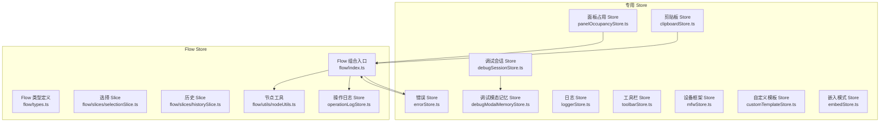
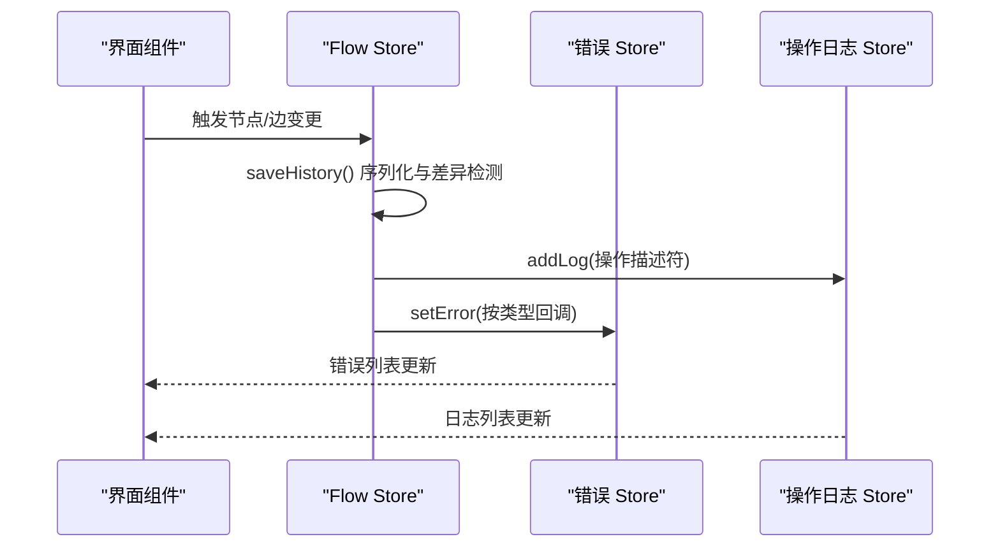
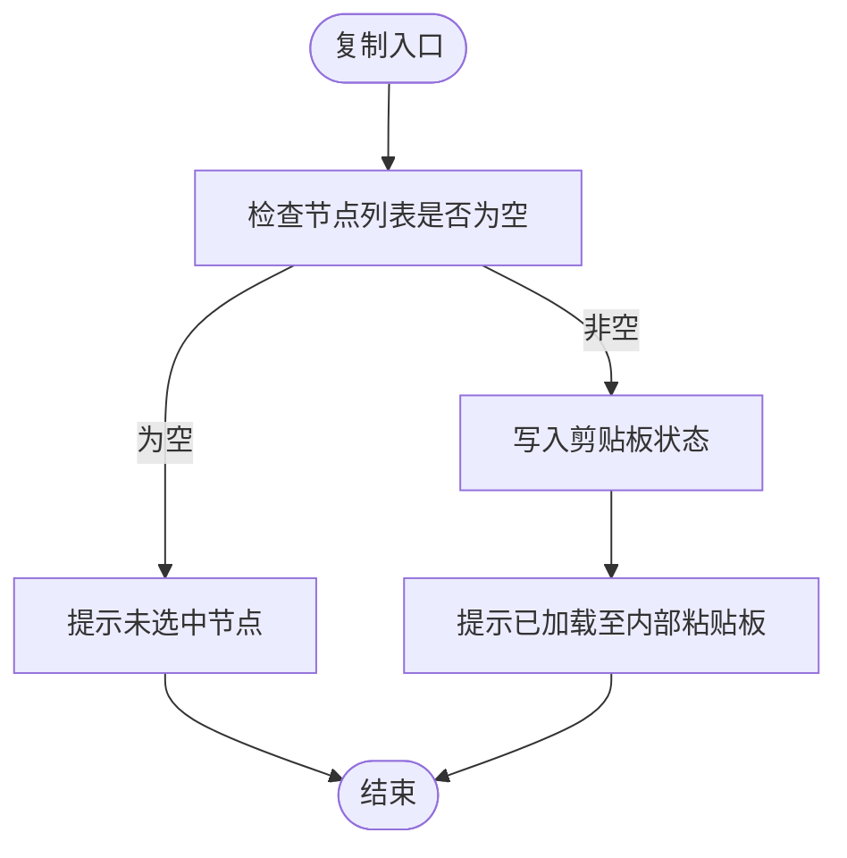
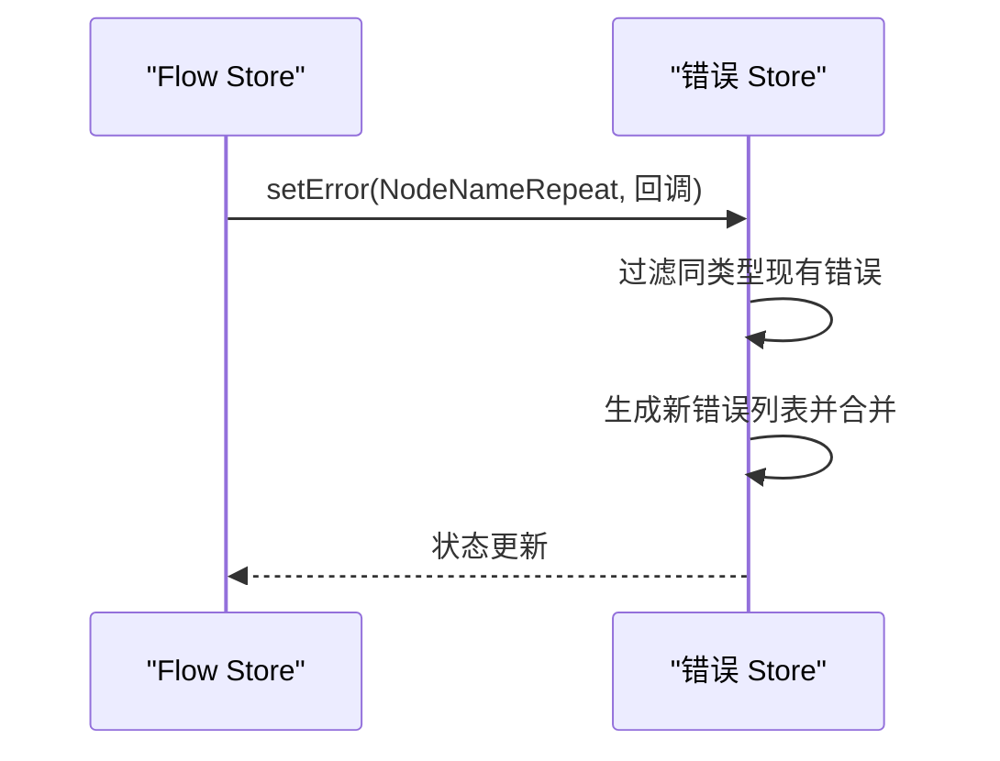
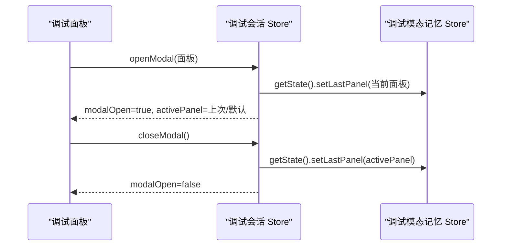
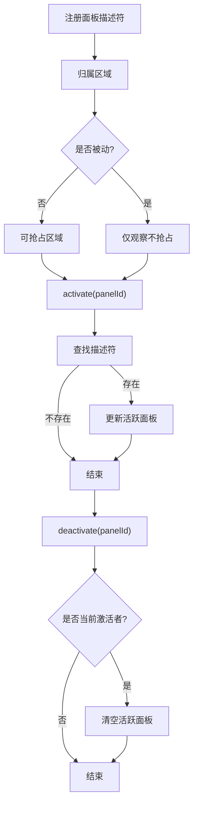
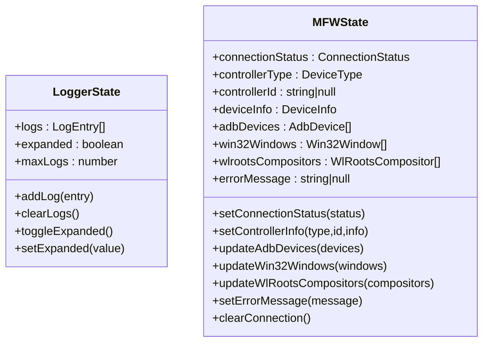
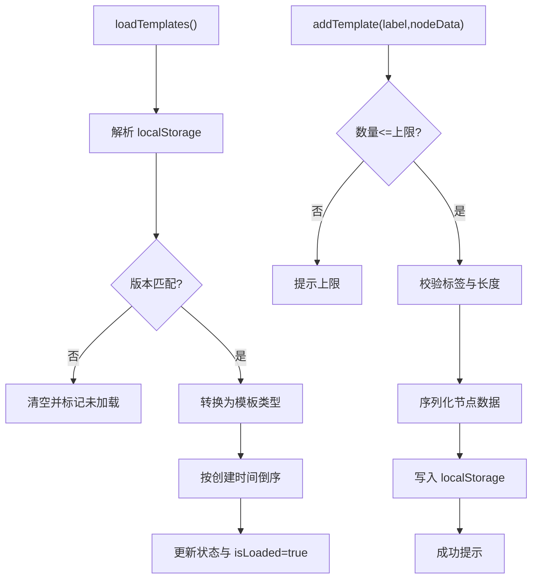
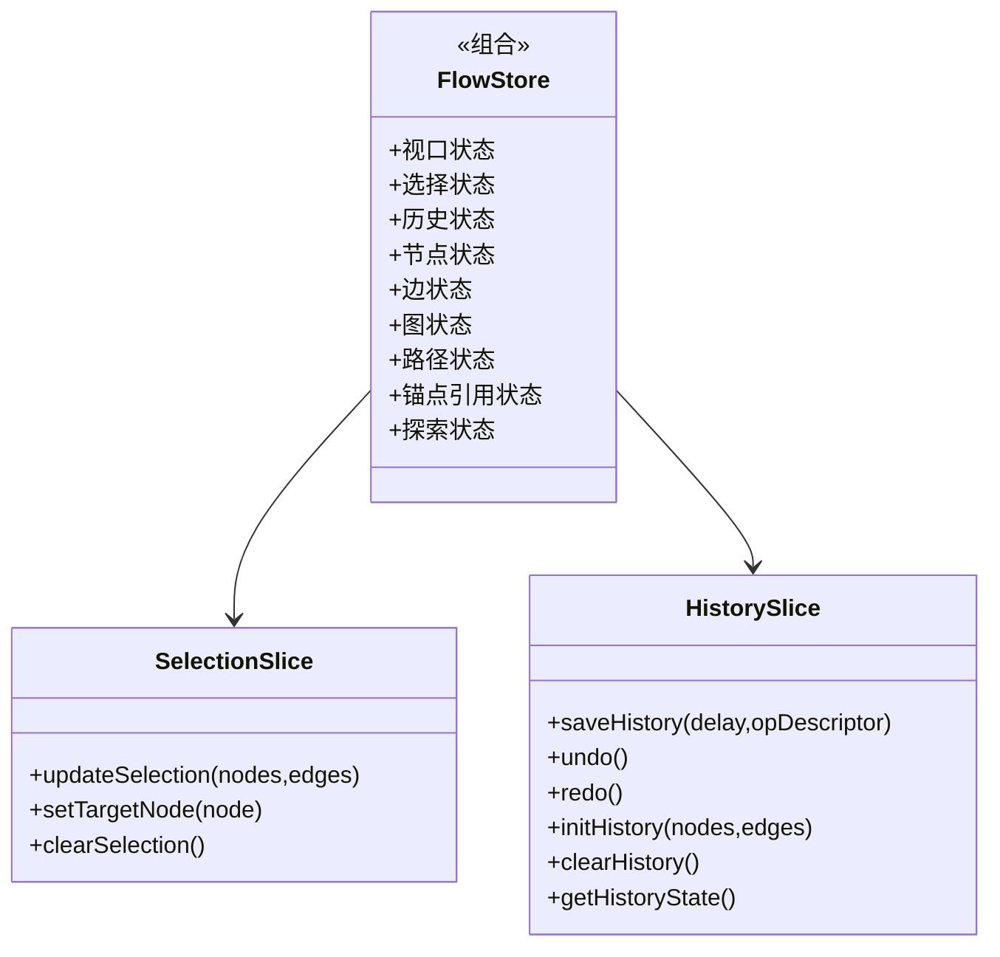
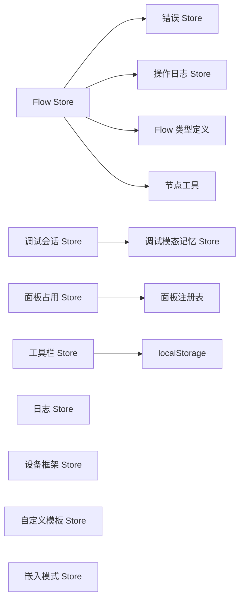

# 专用状态管理

<cite>
**本文档引用的文件**
- [clipboardStore.ts](file://src/stores/clipboardStore.ts)
- [errorStore.ts](file://src/stores/errorStore.ts)
- [panelOccupancyStore.ts](file://src/stores/panelOccupancyStore.ts)
- [debugSessionStore.ts](file://src/stores/debugSessionStore.ts)
- [debugModalMemoryStore.ts](file://src/stores/debugModalMemoryStore.ts)
- [loggerStore.ts](file://src/stores/loggerStore.ts)
- [toolbarStore.ts](file://src/stores/toolbarStore.ts)
- [mfwStore.ts](file://src/stores/mfwStore.ts)
- [customTemplateStore.ts](file://src/stores/customTemplateStore.ts)
- [embedStore.ts](file://src/stores/embedStore.ts)
- [flow/index.ts](file://src/stores/flow/index.ts)
- [flow/types.ts](file://src/stores/flow/types.ts)
- [flow/slices/selectionSlice.ts](file://src/stores/flow/slices/selectionSlice.ts)
- [flow/slices/historySlice.ts](file://src/stores/flow/slices/historySlice.ts)
- [flow/utils/nodeUtils.ts](file://src/stores/flow/utils/nodeUtils.ts)
- [operationLogStore.ts](file://src/stores/operationLogStore.ts)
</cite>

## 目录
1. [简介](#简介)
2. [项目结构](#项目结构)
3. [核心组件](#核心组件)
4. [架构总览](#架构总览)
5. [详细组件分析](#详细组件分析)
6. [依赖分析](#依赖分析)
7. [性能考量](#性能考量)
8. [故障排查指南](#故障排查指南)
9. [结论](#结论)
10. [附录](#附录)

## 简介
本文件聚焦于“专用状态管理”的设计与实现，系统性梳理并深入解析以下专用 Store 的职责边界、数据结构、处理逻辑与交互关系：
- 剪贴板状态管理：节点与边的复制/粘贴与内容校验
- 错误状态收集、分类与展示：统一错误源与可视化联动
- 调试相关状态：会话、能力、资源健康、模态记忆等
- 面板占用状态与工具状态：互斥抢占、被动面板与默认工具行为
- 面板占用状态与工具状态：互斥抢占、被动面板与默认工具行为
- 其他专用 Store：设备框架、日志、嵌入模式、自定义模板等
- 通用 Flow Store：节点/边/历史/选择等复合状态的组合与协作
- 扩展与自定义：最佳实践与跨 Store 通信建议

## 项目结构
专用状态管理主要位于前端 src/stores 目录，采用“按功能域划分”的组织方式，并以 Zustand 的“slice 模式”实现模块化状态与动作。Flow Store 作为复合 Store，通过组合多个 slice 实现复杂业务状态的解耦。

图表来源
- [flow/index.ts:1-124](file://src/stores/flow/index.ts#L1-L124)
- [flow/types.ts:1-439](file://src/stores/flow/types.ts#L1-L439)
- [flow/slices/selectionSlice.ts:1-112](file://src/stores/flow/slices/selectionSlice.ts#L1-L112)
- [flow/slices/historySlice.ts:1-244](file://src/stores/flow/slices/historySlice.ts#L1-L244)
- [flow/utils/nodeUtils.ts:1-339](file://src/stores/flow/utils/nodeUtils.ts#L1-L339)
- [operationLogStore.ts:1-52](file://src/stores/operationLogStore.ts#L1-L52)

章节来源
- [flow/index.ts:1-124](file://src/stores/flow/index.ts#L1-L124)
- [flow/types.ts:1-439](file://src/stores/flow/types.ts#L1-L439)

## 核心组件
- 剪贴板 Store：提供复制/粘贴/内容检测能力，保障编辑器内节点与边的批量操作一致性
- 错误 Store：集中管理错误类型与消息，支持按类型过滤与增量更新
- 面板占用 Store：声明式面板注册与互斥抢占，区分主动/被动面板与不同反应形态
- 调试会话 Store：调试模态、节点选择、会话快照、运行状态、能力与资源健康状态机
- 调试模态记忆 Store：持久化调试面板偏好、运行模式、过滤器与细节模式
- 日志 Store：统一日志条目结构与容量控制，支持展开/收起与清空
- 工具栏 Store：默认导入/导出动作持久化与校验
- 设备框架 Store：设备类型、连接状态、设备列表与错误信息
- 自定义模板 Store：模板的增删改查、导入导出、版本迁移与本地存储
- 嵌入模式 Store：嵌入能力与 UI 配置、就绪状态与当前文件名
- Flow Store：节点/边/历史/选择/路径/锚点引用/探索等复合状态的组合与协作

章节来源
- [clipboardStore.ts:1-51](file://src/stores/clipboardStore.ts#L1-L51)
- [errorStore.ts:1-39](file://src/stores/errorStore.ts#L1-L39)
- [panelOccupancyStore.ts:1-136](file://src/stores/panelOccupancyStore.ts#L1-L136)
- [debugSessionStore.ts:1-260](file://src/stores/debugSessionStore.ts#L1-L260)
- [debugModalMemoryStore.ts:1-308](file://src/stores/debugModalMemoryStore.ts#L1-L308)
- [loggerStore.ts:1-46](file://src/stores/loggerStore.ts#L1-L46)
- [toolbarStore.ts:1-95](file://src/stores/toolbarStore.ts#L1-L95)
- [mfwStore.ts:1-195](file://src/stores/mfwStore.ts#L1-L195)
- [customTemplateStore.ts:1-327](file://src/stores/customTemplateStore.ts#L1-L327)
- [embedStore.ts:1-60](file://src/stores/embedStore.ts#L1-L60)

## 架构总览
专用 Store 与 Flow Store 的关系如下：Flow Store 作为复合状态容器，聚合多个 slice；同时，Flow Store 在运行期会与错误、操作日志等专用 Store 进行交互，形成“状态隔离 + 跨 Store 协作”的架构。

图表来源
- [flow/index.ts:84-104](file://src/stores/flow/index.ts#L84-L104)
- [flow/slices/historySlice.ts:54-86](file://src/stores/flow/slices/historySlice.ts#L54-L86)
- [operationLogStore.ts:32-51](file://src/stores/operationLogStore.ts#L32-L51)
- [errorStore.ts:24-38](file://src/stores/errorStore.ts#L24-L38)

章节来源
- [flow/index.ts:84-104](file://src/stores/flow/index.ts#L84-L104)
- [flow/slices/historySlice.ts:54-86](file://src/stores/flow/slices/historySlice.ts#L54-L86)
- [operationLogStore.ts:32-51](file://src/stores/operationLogStore.ts#L32-L51)
- [errorStore.ts:24-38](file://src/stores/errorStore.ts#L24-L38)

## 详细组件分析

### 剪贴板状态管理
- 设计目的：在编辑器内实现节点与边的复制/粘贴，避免外部系统剪贴板依赖，保证操作一致性与可回放性
- 关键接口
  - 复制：接收节点与边列表，写入内部状态并反馈消息
  - 粘贴：返回当前剪贴板内容，若为空则提示无内容
  - 内容检测：判断是否已有内容
- 数据结构：内部维护节点与边数组，类型来自 Flow 类型定义
- 错误处理：对空输入进行提示，确保 UI 反馈及时

图表来源
- [clipboardStore.ts:18-30](file://src/stores/clipboardStore.ts#L18-L30)

章节来源
- [clipboardStore.ts:1-51](file://src/stores/clipboardStore.ts#L1-L51)
- [flow/types.ts:29-439](file://src/stores/flow/types.ts#L29-L439)

### 错误状态的收集、分类与展示
- 设计目的：统一错误来源，支持按类型过滤与增量更新，便于 UI 展示与定位问题
- 关键接口
  - 按类型查询：根据枚举类型筛选错误
  - 设置错误：接收类型与回调，基于现有错误进行过滤与合并
- 数据结构：错误类型枚举 + 错误条目（类型、消息、可选点击回调等）
- 与 Flow Store 的集成：Flow Store 在节点名重复等场景调用错误 Store，实现“状态驱动的错误可视化”

图表来源
- [flow/index.ts:96-101](file://src/stores/flow/index.ts#L96-L101)
- [errorStore.ts:26-37](file://src/stores/errorStore.ts#L26-L37)

章节来源
- [errorStore.ts:1-39](file://src/stores/errorStore.ts#L1-L39)
- [flow/index.ts:84-104](file://src/stores/flow/index.ts#L84-L104)

### 调试相关状态的组织与管理
- 调试会话 Store：管理调试模态开关、活动面板、节点选择、会话快照、运行状态、协议错误、能力状态与资源健康状态机
- 调试模态记忆 Store：持久化调试偏好（面板、运行模式、过滤器、细节模式等），读写 localStorage
- 关键交互：打开/关闭模态时读写记忆 Store；资源健康/预检结果按请求 ID 对齐，错误优先级提取

图表来源
- [debugSessionStore.ts:94-107](file://src/stores/debugSessionStore.ts#L94-L107)
- [debugModalMemoryStore.ts:247-250](file://src/stores/debugModalMemoryStore.ts#L247-L250)

章节来源
- [debugSessionStore.ts:1-260](file://src/stores/debugSessionStore.ts#L1-L260)
- [debugModalMemoryStore.ts:1-308](file://src/stores/debugModalMemoryStore.ts#L1-L308)

### 面板占用状态与工具状态
- 面板占用 Store：声明式注册面板（区域、反应形态、是否被动），提供抢占与释放逻辑
  - 主动面板：可抢占区域
  - 被动面板：仅观察，不可抢占
  - 反应形态：关闭、隐藏、偏移
- 工具栏 Store：默认导入/导出动作持久化与校验，确保用户偏好跨会话保持

图表来源
- [panelOccupancyStore.ts:38-45](file://src/stores/panelOccupancyStore.ts#L38-L45)
- [panelOccupancyStore.ts:105-134](file://src/stores/panelOccupancyStore.ts#L105-L134)

章节来源
- [panelOccupancyStore.ts:1-136](file://src/stores/panelOccupancyStore.ts#L1-L136)
- [toolbarStore.ts:1-95](file://src/stores/toolbarStore.ts#L1-L95)

### 日志与设备框架状态
- 日志 Store：统一日志条目结构（级别、模块、消息、时间戳），支持最大容量与展开/收起
- 设备框架 Store：设备类型、连接状态、设备列表与错误信息，提供更新与清理动作

图表来源
- [loggerStore.ts:11-45](file://src/stores/loggerStore.ts#L11-L45)
- [mfwStore.ts:100-194](file://src/stores/mfwStore.ts#L100-L194)

章节来源
- [loggerStore.ts:1-46](file://src/stores/loggerStore.ts#L1-L46)
- [mfwStore.ts:1-195](file://src/stores/mfwStore.ts#L1-L195)

### 自定义模板与嵌入模式状态
- 自定义模板 Store：模板增删改查、导入导出、版本迁移、本地存储与数量限制
- 嵌入模式 Store：能力与 UI 配置、就绪状态、当前文件名、能力许可与面板隐藏判定

图表来源
- [customTemplateStore.ts:50-94](file://src/stores/customTemplateStore.ts#L50-L94)
- [customTemplateStore.ts:96-170](file://src/stores/customTemplateStore.ts#L96-L170)

章节来源
- [customTemplateStore.ts:1-327](file://src/stores/customTemplateStore.ts#L1-L327)
- [embedStore.ts:1-60](file://src/stores/embedStore.ts#L1-L60)

### Flow Store：复合状态与协作
- 组合模式：通过多个 slice（视口、选择、历史、节点、边、图、路径、锚点引用、探索）组合而成
- 与错误/日志协作：在节点名重复等场景触发错误 Store；在历史保存时写入操作日志
- 节点工具：提供节点创建、查找、位置计算、重复标签检测等工具函数

图表来源
- [flow/index.ts:18-28](file://src/stores/flow/index.ts#L18-L28)
- [flow/slices/selectionSlice.ts:13-111](file://src/stores/flow/slices/selectionSlice.ts#L13-L111)
- [flow/slices/historySlice.ts:41-243](file://src/stores/flow/slices/historySlice.ts#L41-L243)

章节来源
- [flow/index.ts:1-124](file://src/stores/flow/index.ts#L1-L124)
- [flow/slices/selectionSlice.ts:1-112](file://src/stores/flow/slices/selectionSlice.ts#L1-L112)
- [flow/slices/historySlice.ts:1-244](file://src/stores/flow/slices/historySlice.ts#L1-L244)
- [flow/utils/nodeUtils.ts:228-279](file://src/stores/flow/utils/nodeUtils.ts#L228-L279)

## 依赖分析
- Flow Store 依赖
  - 错误 Store：用于节点名重复等错误的集中展示
  - 操作日志 Store：在历史保存时写入操作日志
  - Flow 类型定义：统一节点/边/参数等类型
  - 节点工具：重复标签检测等
- 调试 Store 依赖
  - 调试模态记忆 Store：持久化调试偏好
  - 资源健康辅助函数：错误诊断提取
- 面板占用 Store 依赖
  - 面板注册表：声明式注册与查询
- 工具栏 Store 依赖
  - localStorage：默认动作持久化
- 其他 Store 依赖
  - 日志 Store：统一日志输出
  - 设备框架 Store：设备状态与错误
  - 自定义模板 Store：模板持久化
  - 嵌入模式 Store：能力与 UI 配置

图表来源
- [flow/index.ts:13-14](file://src/stores/flow/index.ts#L13-L14)
- [debugSessionStore.ts:14-13](file://src/stores/debugSessionStore.ts#L14-L13)
- [panelOccupancyStore.ts:32-45](file://src/stores/panelOccupancyStore.ts#L32-L45)
- [toolbarStore.ts:39-53](file://src/stores/toolbarStore.ts#L39-L53)

章节来源
- [flow/index.ts:13-14](file://src/stores/flow/index.ts#L13-L14)
- [debugSessionStore.ts:14-13](file://src/stores/debugSessionStore.ts#L14-L13)
- [panelOccupancyStore.ts:32-45](file://src/stores/panelOccupancyStore.ts#L32-L45)
- [toolbarStore.ts:39-53](file://src/stores/toolbarStore.ts#L39-L53)

## 性能考量
- 历史记录优化：差异检测与序列化裁剪，避免冗余快照；限制历史栈大小，减少内存占用
- 防抖与批处理：选择状态更新采用防抖，降低频繁渲染成本
- 结构化克隆降级：在不支持结构化克隆时回退到 JSON 克隆，兼顾兼容性
- 日志与操作日志容量控制：固定最大条目数，滚动截断，避免无限增长
- 调试状态按请求 ID 对齐：仅处理匹配请求的结果，避免过期状态污染

## 故障排查指南
- 剪贴板无内容
  - 现象：粘贴时报“粘贴板中无已复制节点”
  - 排查：确认复制时节点列表非空；检查复制动作是否执行
  - 参考
    - [clipboardStore.ts:33-43](file://src/stores/clipboardStore.ts#L33-L43)
- 节点名重复告警
  - 现象：错误面板出现重复标签
  - 排查：检查 Flow Store 的重复标签检测逻辑；确认导出配置前缀是否影响标签
  - 参考
    - [flow/index.ts:84-104](file://src/stores/flow/index.ts#L84-L104)
    - [flow/utils/nodeUtils.ts:228-279](file://src/stores/flow/utils/nodeUtils.ts#L228-L279)
- 调试资源健康/预检异常
  - 现象：资源状态停留在 error 或 idle
  - 排查：核对请求 ID 是否匹配；查看首个错误消息；确认资源路径
  - 参考
    - [debugSessionStore.ts:166-204](file://src/stores/debugSessionStore.ts#L166-L204)
    - [debugSessionStore.ts:222-247](file://src/stores/debugSessionStore.ts#L222-L247)
- 面板无法抢占
  - 现象：主动面板无法打开
  - 排查：确认面板是否被动；确认区域是否已被其他面板占用
  - 参考
    - [panelOccupancyStore.ts:105-116](file://src/stores/panelOccupancyStore.ts#L105-L116)
- 工具栏默认动作无效
  - 现象：刷新后默认动作恢复为默认值
  - 排查：检查 localStorage 中对应键值；确认动作类型是否有效
  - 参考
    - [toolbarStore.ts:39-79](file://src/stores/toolbarStore.ts#L39-L79)
- 自定义模板导入失败
  - 现象：导入后为空或报错
  - 排查：检查模板格式与版本；查看控制台警告；必要时清空损坏数据
  - 参考
    - [customTemplateStore.ts:283-324](file://src/stores/customTemplateStore.ts#L283-L324)

章节来源
- [clipboardStore.ts:33-43](file://src/stores/clipboardStore.ts#L33-L43)
- [flow/index.ts:84-104](file://src/stores/flow/index.ts#L84-L104)
- [flow/utils/nodeUtils.ts:228-279](file://src/stores/flow/utils/nodeUtils.ts#L228-L279)
- [debugSessionStore.ts:166-204](file://src/stores/debugSessionStore.ts#L166-L204)
- [debugSessionStore.ts:222-247](file://src/stores/debugSessionStore.ts#L222-L247)
- [panelOccupancyStore.ts:105-116](file://src/stores/panelOccupancyStore.ts#L105-L116)
- [toolbarStore.ts:39-79](file://src/stores/toolbarStore.ts#L39-L79)
- [customTemplateStore.ts:283-324](file://src/stores/customTemplateStore.ts#L283-L324)

## 结论
本项目通过专用 Store 将不同领域的状态进行清晰隔离，并以 Flow Store 为核心实现多状态的组合与协同。剪贴板、错误、调试、面板占用、工具栏、日志、设备框架、模板与嵌入模式等 Store 各司其职，配合防抖、差异检测、容量控制与持久化策略，在保证性能的同时提升了可用性与可维护性。跨 Store 通信遵循最小耦合原则，通过事件/动作与类型约束实现稳定协作。

## 附录
- 最佳实践
  - 状态隔离：每个 Store 聚焦单一领域，避免状态交叉污染
  - 动作幂等：setState 回调中尽量使用不可变更新，减少副作用
  - 防抖与节流：高频交互（如选择、缩放）使用防抖，避免过度渲染
  - 容量控制：日志、历史、模板等使用固定上限，定期截断
  - 持久化：仅持久化必要的用户偏好，注意版本迁移与异常兜底
  - 类型安全：统一使用 Flow 类型定义，减少运行期错误
- 扩展与自定义
  - 新增 Store：参考现有 Store 的 create 模式与动作命名，提供 clear/reset 方法
  - 跨 Store 通信：通过调用其他 Store 的静态方法或动作，避免直接修改对方状态
  - 与 Flow Store 协作：在合适时机调用错误/日志 Store，保持 UI 与状态同步