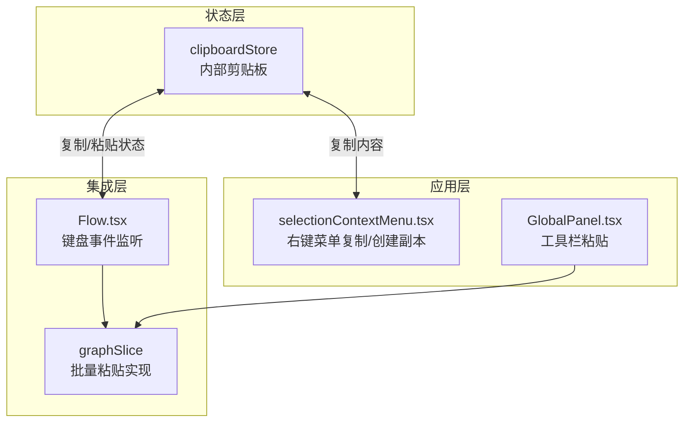
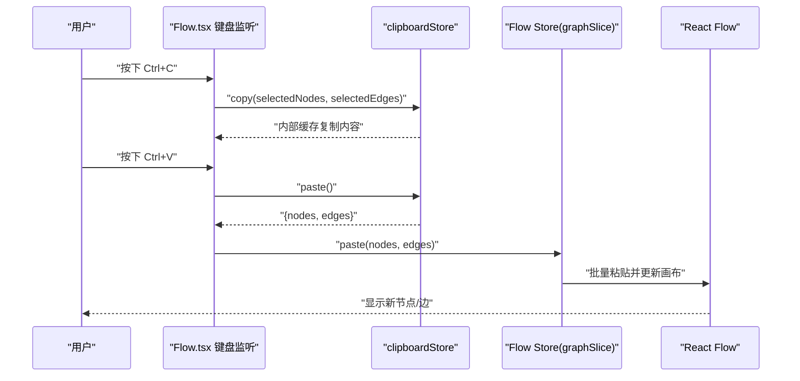
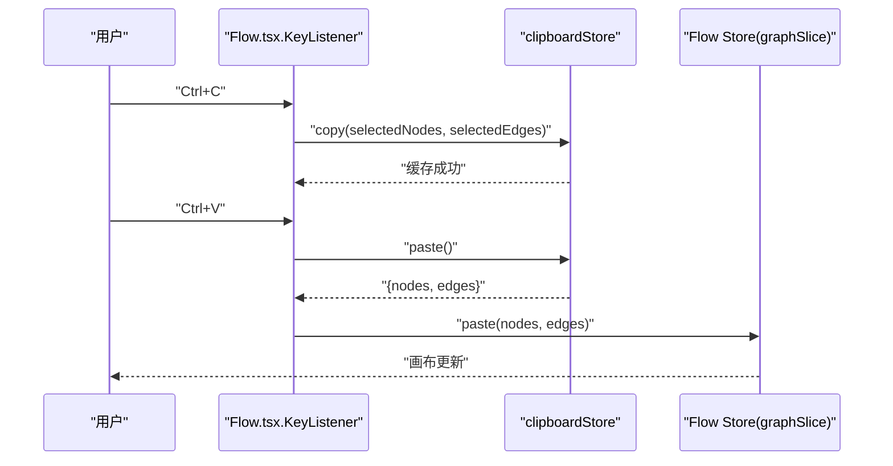
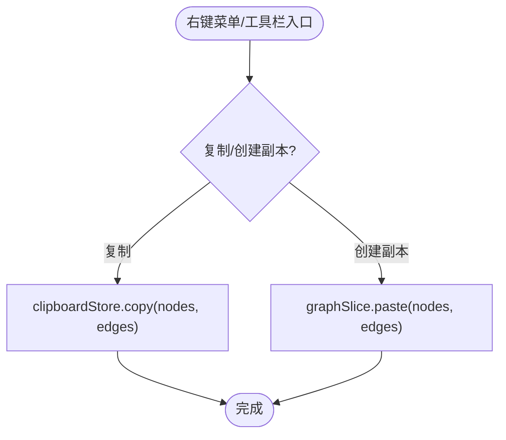
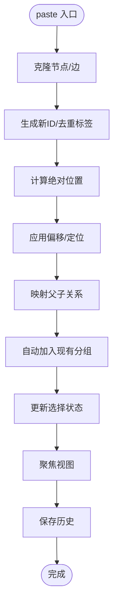
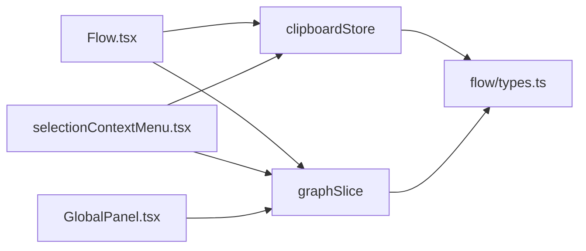

# 剪贴板状态管理

<cite>
**本文档引用的文件**
- [clipboardStore.ts](file://src/stores/clipboardStore.ts)
- [Flow.tsx](file://src/components/Flow.tsx)
- [types.ts](file://src/stores/flow/types.ts)
- [graphSlice.ts](file://src/stores/flow/slices/graphSlice.ts)
- [selectionContextMenu.tsx](file://src/components/flow/selectionContextMenu.tsx)
- [GlobalPanel.tsx](file://src/components/panels/tools/GlobalPanel.tsx)
- [clipboard.ts](file://src/utils/ui/clipboard.ts)
</cite>

## 目录
1. [简介](#简介)
2. [项目结构](#项目结构)
3. [核心组件](#核心组件)
4. [架构总览](#架构总览)
5. [详细组件分析](#详细组件分析)
6. [依赖关系分析](#依赖关系分析)
7. [性能考虑](#性能考虑)
8. [故障排除指南](#故障排除指南)
9. [结论](#结论)
10. [附录](#附录)

## 简介
本文件系统化阐述剪贴板状态管理的设计与实现，重点覆盖以下方面：
- clipboardStore 的设计目的与职责边界
- 节点与边的复制、粘贴实现机制
- 剪贴板状态的数据结构与操作方法
- 与 React Flow 组件的集成方式
- 使用示例与最佳实践
- 错误处理与用户体验优化策略

## 项目结构
剪贴板功能涉及三个层面：
- 状态层：clipboardStore（Zustand 状态管理）
- 集成层：Flow.tsx（键盘事件监听与粘贴触发）
- 应用层：selectionContextMenu.tsx（右键菜单复制/创建副本）、GlobalPanel.tsx（工具栏粘贴）



图表来源
- [clipboardStore.ts:1-51](file://src/stores/clipboardStore.ts#L1-L51)
- [Flow.tsx:53-135](file://src/components/Flow.tsx#L53-L135)
- [graphSlice.ts:64-249](file://src/stores/flow/slices/graphSlice.ts#L64-L249)
- [selectionContextMenu.tsx:129-152](file://src/components/flow/selectionContextMenu.tsx#L129-L152)
- [GlobalPanel.tsx:160-163](file://src/components/panels/tools/GlobalPanel.tsx#L160-L163)

章节来源
- [clipboardStore.ts:1-51](file://src/stores/clipboardStore.ts#L1-L51)
- [Flow.tsx:53-135](file://src/components/Flow.tsx#L53-L135)
- [graphSlice.ts:64-249](file://src/stores/flow/slices/graphSlice.ts#L64-L249)
- [selectionContextMenu.tsx:129-152](file://src/components/flow/selectionContextMenu.tsx#L129-L152)
- [GlobalPanel.tsx:160-163](file://src/components/panels/tools/GlobalPanel.tsx#L160-L163)

## 核心组件
- clipboardStore：提供内部剪贴板，支持复制节点与边、粘贴、检查内容存在性
- Flow.tsx：负责键盘事件监听（Ctrl+C/Ctrl+V），触发复制与粘贴
- graphSlice：提供 paste/replace/shiftNodes 等画布级操作，是粘贴功能的核心执行者
- selectionContextMenu.tsx：提供右键菜单“复制”“创建副本”，并与 clipboardStore 集成
- GlobalPanel.tsx：提供工具栏“粘贴”入口，调用 Flow Store 的 paste

章节来源
- [clipboardStore.ts:5-50](file://src/stores/clipboardStore.ts#L5-L50)
- [Flow.tsx:53-135](file://src/components/Flow.tsx#L53-L135)
- [graphSlice.ts:64-249](file://src/stores/flow/slices/graphSlice.ts#L64-L249)
- [selectionContextMenu.tsx:129-152](file://src/components/flow/selectionContextMenu.tsx#L129-L152)
- [GlobalPanel.tsx:160-163](file://src/components/panels/tools/GlobalPanel.tsx#L160-L163)

## 架构总览
剪贴板状态管理采用“内部剪贴板 + React Flow 集成”的双层设计：
- 内部剪贴板：clipboardStore 仅缓存复制的节点与边，不直接写入系统剪贴板
- React Flow 集成：Flow.tsx 监听 Ctrl+C/V，调用 clipboardStore.copy/paste，并将结果交给 graphSlice.paste 执行粘贴
- 右键菜单与工具栏：selectionContextMenu.tsx 和 GlobalPanel.tsx 作为入口，统一走 clipboardStore + graphSlice 流程



图表来源
- [Flow.tsx:102-131](file://src/components/Flow.tsx#L102-L131)
- [clipboardStore.ts:17-44](file://src/stores/clipboardStore.ts#L17-L44)
- [graphSlice.ts:64-249](file://src/stores/flow/slices/graphSlice.ts#L64-L249)

## 详细组件分析

### clipboardStore 设计与实现
- 数据结构
  - clipboardNodes：复制的节点数组
  - clipboardEdges：复制的边数组
- 方法
  - copy(nodes?, edges?)：校验输入，设置内部剪贴板，提示成功
  - paste()：返回内部剪贴板内容；若为空则提示错误
  - hasContent()：判断内部剪贴板是否有内容
- 设计要点
  - 仅维护内部状态，避免与系统剪贴板耦合
  - 通过 message 提示反馈，提升可用性
  - 与 Flow Store 的 paste 接口解耦，便于扩展

```mermaid
classDiagram
class ClipboardState {
+NodeType[] clipboardNodes
+EdgeType[] clipboardEdges
+copy(nodes?, edges?) void
+paste() {nodes, edges}|null
+hasContent() bool
}
```

图表来源
- [clipboardStore.ts:5-50](file://src/stores/clipboardStore.ts#L5-L50)

章节来源
- [clipboardStore.ts:1-51](file://src/stores/clipboardStore.ts#L1-L51)

### 与 React Flow 的集成（Flow.tsx）
- 键盘事件监听
  - Ctrl+C：当允许复制、有选中节点且未聚焦文本编辑器时，调用 clipboardStore.copy
  - Ctrl+V：当允许复制、内部剪贴板有内容且未聚焦文本编辑器时，调用 clipboardStore.paste 并将结果传给 Flow Store.graphSlice.paste
- 文本编辑器焦点检测
  - 避免在输入框、编辑器中触发复制/粘贴
- 嵌入模式权限控制
  - 通过 useEmbedMode 控制 allowCopy，限制只读场景下的复制能力



图表来源
- [Flow.tsx:53-135](file://src/components/Flow.tsx#L53-L135)
- [clipboardStore.ts:17-44](file://src/stores/clipboardStore.ts#L17-L44)
- [graphSlice.ts:64-249](file://src/stores/flow/slices/graphSlice.ts#L64-L249)

章节来源
- [Flow.tsx:53-135](file://src/components/Flow.tsx#L53-L135)

### 右键菜单与工具栏入口
- selectionContextMenu.tsx
  - “复制”：调用 clipboardStore.copy
  - “创建副本”：调用 Flow Store.graphSlice.paste，无需外部剪贴板
- GlobalPanel.tsx
  - “粘贴”：调用 Flow Store.graphSlice.paste，基于 clipboardStore 的内容



图表来源
- [selectionContextMenu.tsx:129-152](file://src/components/flow/selectionContextMenu.tsx#L129-L152)
- [GlobalPanel.tsx:160-163](file://src/components/panels/tools/GlobalPanel.tsx#L160-L163)

章节来源
- [selectionContextMenu.tsx:129-152](file://src/components/flow/selectionContextMenu.tsx#L129-L152)
- [GlobalPanel.tsx:160-163](file://src/components/panels/tools/GlobalPanel.tsx#L160-L163)

### 粘贴实现细节（graphSlice）
- paste(nodes, edges, position?)
  - 克隆节点/边，生成新 ID，处理标签去重
  - 计算源绝对位置，按偏移或默认偏移进行粘贴
  - 处理父子关系映射与自动分组归属
  - 更新选择状态并聚焦视图
  - 保存历史记录
- replace(nodes, edges, options)
  - 替换整幅画布，清空选择并可选聚焦视图
- shiftNodes(direction, delta, targetNodeIds?)
  - 对选中节点进行间距调整，辅助布局



图表来源
- [graphSlice.ts:64-249](file://src/stores/flow/slices/graphSlice.ts#L64-L249)

章节来源
- [graphSlice.ts:64-249](file://src/stores/flow/slices/graphSlice.ts#L64-L249)

### 数据结构与类型
- NodeType/EdgeType：来自 flow/types.ts，定义节点与边的结构
- FlowStore：组合多个 slice，包括 view、selection、history、node、edge、graph、path、anchorRef、exploration

章节来源
- [types.ts:29-236](file://src/stores/flow/types.ts#L29-L236)
- [types.ts:429-439](file://src/stores/flow/types.ts#L429-L439)

## 依赖关系分析
- clipboardStore 依赖 Flow Store 的 NodeType/EdgeType 类型
- Flow.tsx 依赖 clipboardStore 与 Flow Store(graphSlice)
- selectionContextMenu.tsx 依赖 clipboardStore 与 Flow Store(graphSlice)
- GlobalPanel.tsx 依赖 Flow Store(graphSlice)
- graphSlice 依赖坐标工具与分组工具，确保粘贴后节点顺序与相对位置正确



图表来源
- [clipboardStore.ts:1-51](file://src/stores/clipboardStore.ts#L1-L51)
- [Flow.tsx:30-32](file://src/components/Flow.tsx#L30-L32)
- [selectionContextMenu.tsx:5-7](file://src/components/flow/selectionContextMenu.tsx#L5-L7)
- [GlobalPanel.tsx:198-200](file://src/components/panels/tools/GlobalPanel.tsx#L198-L200)
- [graphSlice.ts:1-13](file://src/stores/flow/slices/graphSlice.ts#L1-L13)

章节来源
- [clipboardStore.ts:1-51](file://src/stores/clipboardStore.ts#L1-L51)
- [Flow.tsx:30-32](file://src/components/Flow.tsx#L30-L32)
- [selectionContextMenu.tsx:5-7](file://src/components/flow/selectionContextMenu.tsx#L5-L7)
- [GlobalPanel.tsx:198-200](file://src/components/panels/tools/GlobalPanel.tsx#L198-L200)
- [graphSlice.ts:1-13](file://src/stores/flow/slices/graphSlice.ts#L1-L13)

## 性能考虑
- 克隆与去重
  - paste 对节点进行深拷贝，避免共享引用导致的副作用
  - 标签名去重使用 Set，时间复杂度 O(n)，适合中等规模复制
- 绝对位置与偏移
  - 通过 getNodeAbsolutePosition 计算最小左上角作为基准，再统一偏移，保证粘贴后整体布局合理
- 历史记录
  - 粘贴后保存历史，支持撤销/重做，但会增加内存占用；可通过 skipHistory 控制
- 选择状态
  - 粘贴时取消原有选择，避免多余渲染；完成后更新选择状态

[本节为通用性能讨论，不直接分析具体文件]

## 故障排除指南
- 复制无效
  - 检查是否选中节点；未选中会提示错误
  - 检查是否处于嵌入模式且不允许复制
  - 检查是否聚焦于文本编辑器（键盘事件会被忽略）
- 粘贴无效
  - 检查内部剪贴板是否为空
  - 检查是否聚焦于文本编辑器
  - 检查嵌入模式权限
- 标签名冲突
  - 粘贴时会自动生成带副本序号的新标签；如仍冲突，请手动修改标签
- 分组归属异常
  - 粘贴后会尝试将节点加入现有分组；如不希望加入，请在粘贴后手动移出

章节来源
- [clipboardStore.ts:18-30](file://src/stores/clipboardStore.ts#L18-L30)
- [clipboardStore.ts:32-44](file://src/stores/clipboardStore.ts#L32-L44)
- [Flow.tsx:104-131](file://src/components/Flow.tsx#L104-L131)
- [graphSlice.ts:108-131](file://src/stores/flow/slices/graphSlice.ts#L108-L131)

## 结论
clipboardStore 以轻量的状态管理实现了内部剪贴板，配合 Flow Store 的 graphSlice 实现了可靠的复制/粘贴体验。其设计遵循“内部缓存 + React Flow 集成”的思路，既避免了系统剪贴板的复杂性，又提供了良好的用户体验与可扩展性。通过右键菜单与工具栏入口，用户可以在多种场景下高效地复制与粘贴节点与边。

[本节为总结性内容，不直接分析具体文件]

## 附录

### 使用示例与最佳实践
- 快捷键
  - Ctrl+C：复制选中节点与关联边
  - Ctrl+V：粘贴到画布（默认偏移）
- 右键菜单
  - 复制：仅复制选中节点与边
  - 创建副本：直接在画布上创建副本，无需外部剪贴板
- 工具栏
  - 粘贴：从内部剪贴板粘贴
- 最佳实践
  - 复制前先选中需要的节点与边，确保关联边也被复制
  - 粘贴后使用“还原连线路径”“局部自动布局”等工具优化布局
  - 在嵌入模式下注意权限限制，必要时请求相应能力

章节来源
- [Flow.tsx:102-131](file://src/components/Flow.tsx#L102-L131)
- [selectionContextMenu.tsx:129-152](file://src/components/flow/selectionContextMenu.tsx#L129-L152)
- [GlobalPanel.tsx:160-163](file://src/components/panels/tools/GlobalPanel.tsx#L160-L163)

### 与系统剪贴板的关系
- 本实现使用内部剪贴板，不直接写入系统剪贴板
- 如需与系统剪贴板交互，可参考 utils/ui/clipboard.ts 的 ClipboardHelper（用于 JSON/文本的读写）

章节来源
- [clipboard.ts:1-63](file://src/utils/ui/clipboard.ts#L1-L63)