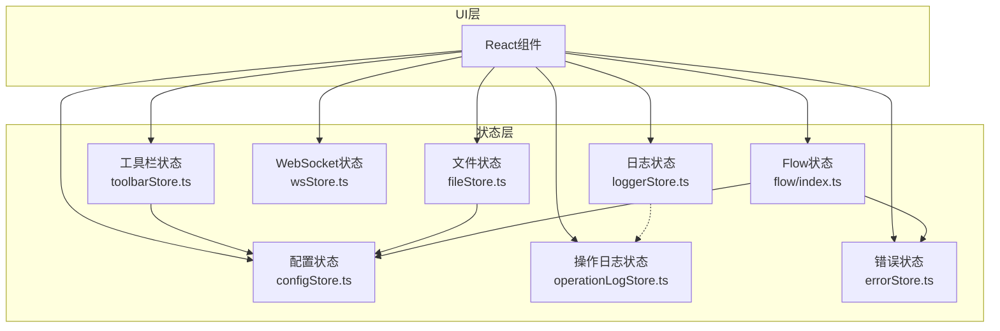
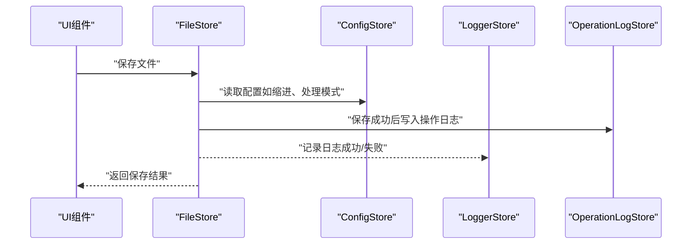
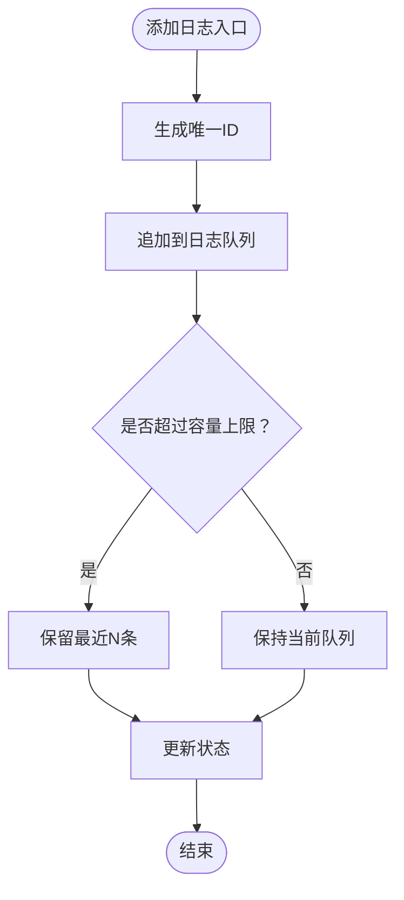
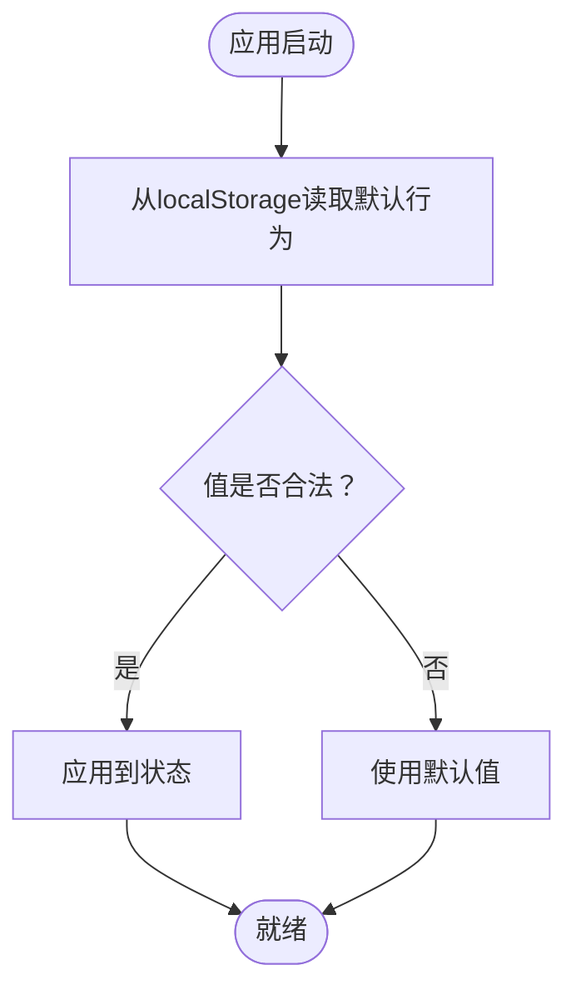
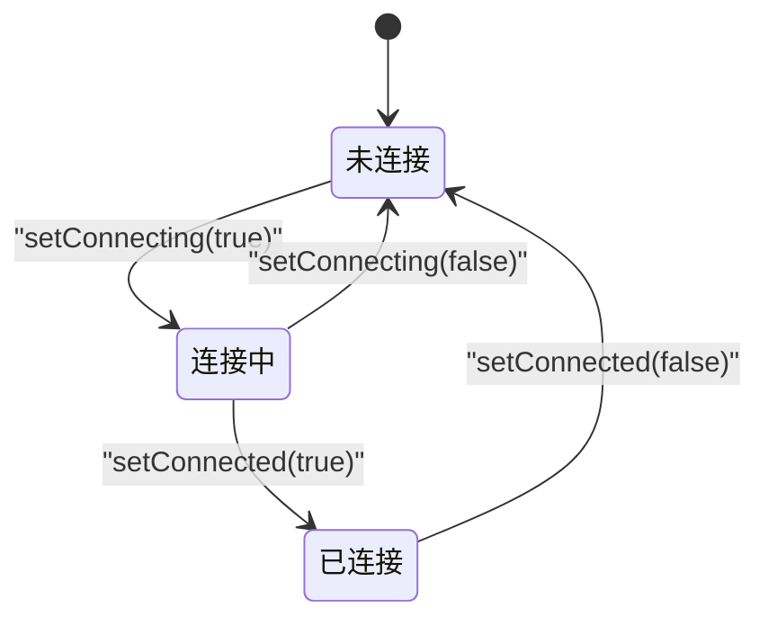
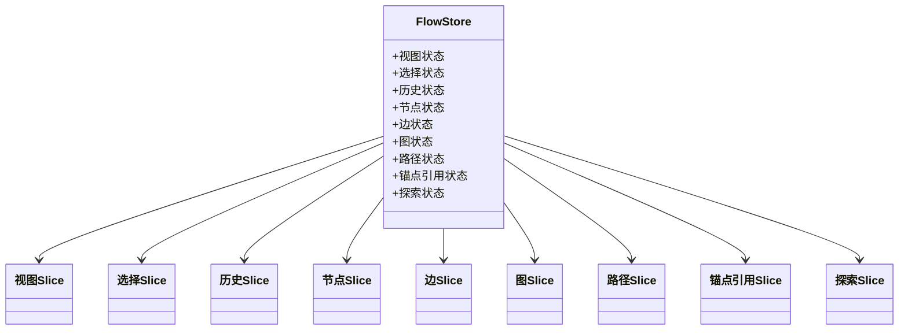
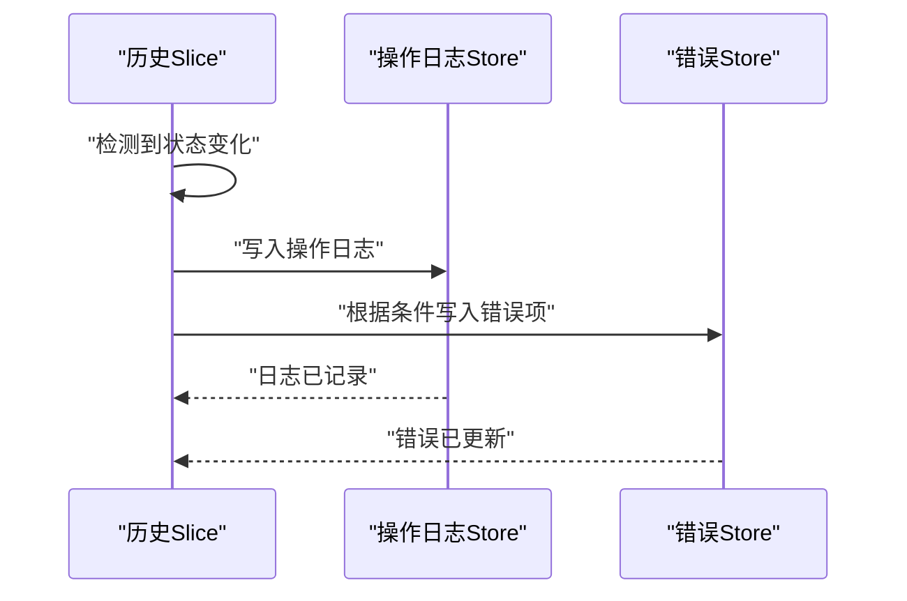
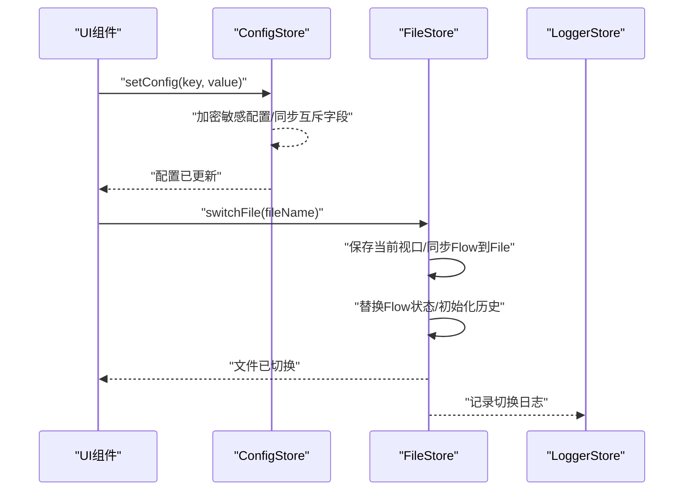
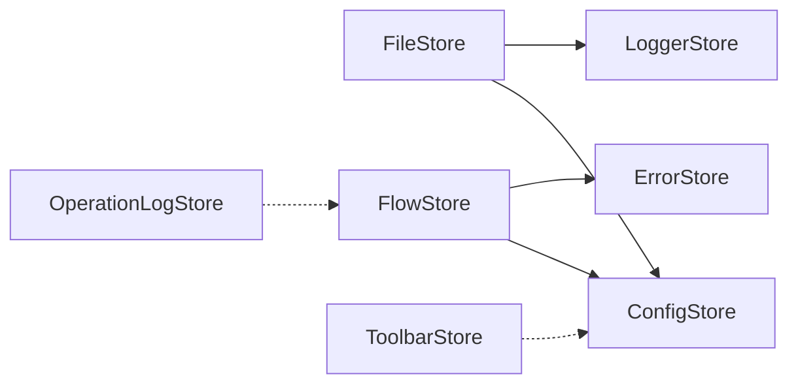

# 工具状态管理

<cite>
**本文档引用的文件**
- [loggerStore.ts](file://src/stores/loggerStore.ts)
- [toolbarStore.ts](file://src/stores/toolbarStore.ts)
- [wsStore.ts](file://src/stores/wsStore.ts)
- [flow/index.ts](file://src/stores/flow/index.ts)
- [flow/types.ts](file://src/stores/flow/types.ts)
- [flow/slices/viewSlice.ts](file://src/stores/flow/slices/viewSlice.ts)
- [flow/slices/selectionSlice.ts](file://src/stores/flow/slices/selectionSlice.ts)
- [flow/slices/historySlice.ts](file://src/stores/flow/slices/historySlice.ts)
- [operationLogStore.ts](file://src/stores/operationLogStore.ts)
- [errorStore.ts](file://src/stores/errorStore.ts)
- [configStore.ts](file://src/stores/configStore.ts)
- [fileStore.ts](file://src/stores/fileStore.ts)
</cite>

## 目录
1. [简介](#简介)
2. [项目结构](#项目结构)
3. [核心组件](#核心组件)
4. [架构总览](#架构总览)
5. [详细组件分析](#详细组件分析)
6. [依赖关系分析](#依赖关系分析)
7. [性能考量](#性能考量)
8. [故障排查指南](#故障排查指南)
9. [结论](#结论)
10. [附录](#附录)

## 简介
本文件系统性梳理工具状态管理的技术实现，聚焦以下方面：
- 各类工具Store的设计目的与实现机制
- 日志状态、工具栏状态与WebSocket状态的管理方式
- 工具状态与用户界面的交互逻辑
- 状态同步与事件传播机制
- 配置与自定义选项
- 状态持久化与性能优化策略

## 项目结构
本项目的前端状态管理主要基于 Zustand，采用“单一状态源 + slice 组合”的组织方式：
- 工具状态集中于 src/stores 目录
- 流式编辑器状态（FlowStore）通过多个 slice 组合而成
- 日志、工具栏、WebSocket 等工具状态相对独立
- 配置与文件状态作为横切关注点，贯穿多模块

图表来源
- [loggerStore.ts:1-46](file://src/stores/loggerStore.ts#L1-L46)
- [toolbarStore.ts:1-95](file://src/stores/toolbarStore.ts#L1-L95)
- [wsStore.ts:1-24](file://src/stores/wsStore.ts#L1-L24)
- [fileStore.ts:1-800](file://src/stores/fileStore.ts#L1-L800)
- [configStore.ts:1-440](file://src/stores/configStore.ts#L1-L440)
- [operationLogStore.ts:1-52](file://src/stores/operationLogStore.ts#L1-L52)
- [errorStore.ts:1-39](file://src/stores/errorStore.ts#L1-L39)
- [flow/index.ts:1-124](file://src/stores/flow/index.ts#L1-L124)

章节来源
- [flow/index.ts:1-124](file://src/stores/flow/index.ts#L1-L124)
- [flow/types.ts:1-439](file://src/stores/flow/types.ts#L1-L439)

## 核心组件
- 日志状态（LoggerStore）：维护日志列表、展开状态与容量上限，支持添加、清空、展开切换等操作。
- 工具栏状态（ToolbarStore）：管理默认导入/导出行为，并持久化到 localStorage，提供校验与恢复逻辑。
- WebSocket 状态（WSStore）：管理连接与连接中状态，提供设置接口。
- Flow 状态（FlowStore）：组合视图、选择、历史、节点、边、图、路径、锚点引用与探索等 slice，统一管理流程图状态。
- 操作日志（OperationLogStore）：记录操作日志，支持容量限制与时间戳管理。
- 错误状态（ErrorStore）：集中管理错误项，按类型过滤与更新。
- 配置状态（ConfigStore）：集中管理应用配置与状态，支持默认值、迁移、加解密与持久化。
- 文件状态（FileStore）：管理多文件、当前文件、视口、节点顺序等，负责与本地服务交互与持久化。

章节来源
- [loggerStore.ts:1-46](file://src/stores/loggerStore.ts#L1-L46)
- [toolbarStore.ts:1-95](file://src/stores/toolbarStore.ts#L1-L95)
- [wsStore.ts:1-24](file://src/stores/wsStore.ts#L1-L24)
- [flow/index.ts:1-124](file://src/stores/flow/index.ts#L1-L124)
- [operationLogStore.ts:1-52](file://src/stores/operationLogStore.ts#L1-L52)
- [errorStore.ts:1-39](file://src/stores/errorStore.ts#L1-L39)
- [configStore.ts:1-440](file://src/stores/configStore.ts#L1-L440)
- [fileStore.ts:1-800](file://src/stores/fileStore.ts#L1-L800)

## 架构总览
工具状态管理遵循“单一事实源 + 局部更新 + 事件联动”的设计原则：
- 单一事实源：每个 Store 作为独立的事实源，避免跨 Store 的直接耦合。
- 局部更新：通过 slice 或局部 set 函数进行细粒度状态更新。
- 事件联动：通过回调、副作用与跨 Store 查询实现状态同步与事件传播。

图表来源
- [fileStore.ts:663-800](file://src/stores/fileStore.ts#L663-L800)
- [operationLogStore.ts:32-52](file://src/stores/operationLogStore.ts#L32-L52)
- [configStore.ts:270-413](file://src/stores/configStore.ts#L270-L413)
- [loggerStore.ts:21-46](file://src/stores/loggerStore.ts#L21-L46)

## 详细组件分析

### 日志状态（LoggerStore）
- 设计目的：统一管理日志条目，控制最大容量，支持展开/收起，便于调试与问题定位。
- 关键能力：
  - 添加日志：自动生成唯一 id，追加到队列尾部，超过容量上限时保留最近 N 条。
  - 清空日志：一键清空。
  - 展开/收起：控制日志面板的展示状态。
- 性能特征：基于数组尾部追加与切片，时间复杂度 O(n)（n 为新增条目数），容量上限控制内存占用。

图表来源
- [loggerStore.ts:26-45](file://src/stores/loggerStore.ts#L26-L45)

章节来源
- [loggerStore.ts:1-46](file://src/stores/loggerStore.ts#L1-L46)

### 工具栏状态（ToolbarStore）
- 设计目的：管理默认导入/导出行为，提供类型安全与持久化，提升用户效率。
- 关键能力：
  - 默认导入/导出行为：枚举类型约束，确保行为合法。
  - 持久化：从 localStorage 读取默认行为，支持更新并落盘。
  - 校验：对存储值进行合法性检查，非法值回退到默认值。
- 交互逻辑：用户更改默认行为后，立即更新状态并持久化；应用启动时从本地恢复。

图表来源
- [toolbarStore.ts:38-94](file://src/stores/toolbarStore.ts#L38-L94)

章节来源
- [toolbarStore.ts:1-95](file://src/stores/toolbarStore.ts#L1-L95)

### WebSocket 状态（WSStore）
- 设计目的：统一管理 WebSocket 的连接状态，为 UI 与服务交互提供一致的状态入口。
- 关键能力：
  - 连接状态：connected 表示已连接，connecting 表示连接中。
  - 设置接口：分别设置连接与连接中状态。
- 适用场景：与本地服务建立连接时，UI 根据状态切换加载态、错误态或可用态。

图表来源
- [wsStore.ts:7-23](file://src/stores/wsStore.ts#L7-L23)

章节来源
- [wsStore.ts:1-24](file://src/stores/wsStore.ts#L1-L24)

### Flow 状态（FlowStore）与各 Slice
- 设计目的：将复杂的流程图状态拆分为多个 slice，降低耦合、提升可维护性。
- 主要 slice：
  - 视图（viewSlice）：ReactFlow 实例、视口、画布尺寸。
  - 选择（selectionSlice）：节点/边选择、目标节点、防抖延迟更新。
  - 历史（historySlice）：历史栈、撤销/重做、快照序列化与差异检测。
  - 节点/边（nodeSlice/edgeSlice）：节点增删改、边增删改、标签与属性更新。
  - 图（graphSlice）：整体替换、粘贴、位移与计数器。
  - 路径（pathSlice）：路径模式、起止节点、路径计算与清理。
  - 锚点引用（anchorRefSlice）：锚点名称到节点的索引、高亮与查询。
  - 探索（explorationSlice）：AI 探索状态机（预测/审核/执行/完成）。
- 状态同步：
  - 选择 slice 在更新选择时触发防抖，避免频繁渲染。
  - 历史 slice 在保存历史时进行快照序列化与差异检测，仅在有变化时写入。
  - 探索 slice 通过内部状态机推进流程，暴露对外操作方法。

图表来源
- [flow/index.ts:18-28](file://src/stores/flow/index.ts#L18-L28)
- [flow/types.ts:239-439](file://src/stores/flow/types.ts#L239-L439)

章节来源
- [flow/index.ts:1-124](file://src/stores/flow/index.ts#L1-L124)
- [flow/types.ts:1-439](file://src/stores/flow/types.ts#L1-L439)
- [flow/slices/viewSlice.ts:1-28](file://src/stores/flow/slices/viewSlice.ts#L1-L28)
- [flow/slices/selectionSlice.ts:1-112](file://src/stores/flow/slices/selectionSlice.ts#L1-L112)
- [flow/slices/historySlice.ts:1-244](file://src/stores/flow/slices/historySlice.ts#L1-L244)

### 操作日志与错误状态
- 操作日志（OperationLogStore）：记录节点/边/图/分组等操作，支持分类、动作、描述与目标 ID，容量上限控制。
- 错误状态（ErrorStore）：集中管理错误项，按类型过滤与更新，供 UI 展示与提示。

图表来源
- [flow/slices/historySlice.ts:78-86](file://src/stores/flow/slices/historySlice.ts#L78-L86)
- [errorStore.ts:13-38](file://src/stores/errorStore.ts#L13-L38)
- [operationLogStore.ts:32-52](file://src/stores/operationLogStore.ts#L32-L52)

章节来源
- [operationLogStore.ts:1-52](file://src/stores/operationLogStore.ts#L1-L52)
- [errorStore.ts:1-39](file://src/stores/errorStore.ts#L1-L39)

### 配置状态与文件状态
- 配置状态（ConfigStore）：
  - 默认值与迁移：提供默认配置与向后兼容逻辑（如 isExportConfig 与 configHandlingMode 的互斥同步）。
  - 加密存储：敏感配置（如 API Key）加密后存储，支持批量替换与标记已配置项。
  - 持久化：通过 localStorage 缓存配置与已配置键集合。
- 文件状态（FileStore）：
  - 多文件管理：文件列表、当前文件、切换、增删、拖拽排序。
  - 与 FlowStore 同步：将 FlowStore 的节点/边同步到 FileStore，反之亦然。
  - 与本地服务交互：保存/打开文件、跨文件搜索、视口恢复等。

图表来源
- [configStore.ts:270-413](file://src/stores/configStore.ts#L270-L413)
- [fileStore.ts:430-496](file://src/stores/fileStore.ts#L430-L496)
- [loggerStore.ts:21-46](file://src/stores/loggerStore.ts#L21-L46)

章节来源
- [configStore.ts:1-440](file://src/stores/configStore.ts#L1-L440)
- [fileStore.ts:1-800](file://src/stores/fileStore.ts#L1-L800)

## 依赖关系分析
- FlowStore 依赖 ConfigStore、FileStore 与 ErrorStore，用于节点标签重复检测、视口恢复与错误提示。
- FileStore 依赖 ConfigStore 与 LoggerStore，用于保存前的配置读取与日志记录。
- LoggerStore 与 OperationLogStore 之间无直接依赖，但通过业务流程产生关联（历史保存时写入操作日志）。
- ToolbarStore 与 ConfigStore 解耦，通过 UI 层调用，避免直接耦合。

图表来源
- [flow/index.ts:13-15](file://src/stores/flow/index.ts#L13-L15)
- [fileStore.ts:8-22](file://src/stores/fileStore.ts#L8-L22)
- [operationLogStore.ts:32-52](file://src/stores/operationLogStore.ts#L32-L52)
- [toolbarStore.ts:38-94](file://src/stores/toolbarStore.ts#L38-L94)

章节来源
- [flow/index.ts:1-124](file://src/stores/flow/index.ts#L1-L124)
- [fileStore.ts:1-800](file://src/stores/fileStore.ts#L1-L800)

## 性能考量
- 状态更新粒度：
  - 使用局部 set 函数，避免不必要的全局重渲染。
  - 历史保存采用防抖与差异检测，减少无效写入。
- 数据结构选择：
  - 日志与操作日志采用数组尾部追加与切片，容量上限控制内存。
  - FlowStore 的历史栈限制为固定上限，防止无限增长。
- 序列化与克隆：
  - 历史保存使用结构化克隆降级到 JSON 克隆，保证兼容性。
- UI 交互优化：
  - 选择状态采用防抖延迟更新，降低高频变更带来的渲染压力。
- 存储与持久化：
  - 配置与文件状态通过 localStorage 缓存，减少启动时的初始化成本。
  - 本地存储空间不足时进行错误提示与降级处理。

章节来源
- [flow/slices/historySlice.ts:8-39](file://src/stores/flow/slices/historySlice.ts#L8-L39)
- [flow/slices/selectionSlice.ts:10-112](file://src/stores/flow/slices/selectionSlice.ts#L10-L112)
- [loggerStore.ts:26-45](file://src/stores/loggerStore.ts#L26-L45)
- [configStore.ts:415-440](file://src/stores/configStore.ts#L415-L440)
- [fileStore.ts:234-273](file://src/stores/fileStore.ts#L234-L273)

## 故障排查指南
- 保存失败（重复节点名）：
  - 现象：保存文件时报错，提示存在重复节点名。
  - 原因：节点标签重复导致校验失败。
  - 处理：修改重复标签后重试。
- 本地存储空间不足：
  - 现象：保存失败并弹出错误通知。
  - 原因：localStorage 配额超限。
  - 处理：清理浏览器缓存或减少文件数量。
- WebSocket 未连接：
  - 现象：保存/打开文件失败。
  - 原因：本地服务未连接。
  - 处理：检查本地服务连接状态并重连。
- 工具栏默认行为异常：
  - 现象：默认导入/导出行为不符合预期。
  - 原因：localStorage 中存储值非法。
  - 处理：清除对应键或手动调整默认行为。

章节来源
- [fileStore.ts:688-699](file://src/stores/fileStore.ts#L688-L699)
- [fileStore.ts:260-272](file://src/stores/fileStore.ts#L260-L272)
- [toolbarStore.ts:38-94](file://src/stores/toolbarStore.ts#L38-L94)

## 结论
本项目通过 Zustand 将工具状态模块化、组件化，实现了清晰的职责划分与高效的更新路径。日志、工具栏、WebSocket 等工具状态独立管理，Flow 状态通过 slice 组合实现高内聚低耦合，配合配置与文件状态的持久化策略，满足了复杂流程编辑场景下的状态一致性与用户体验需求。

## 附录
- 配置与自定义选项
  - 配置项分类与默认值：参见配置状态的默认值与分类映射。
  - 自定义行为：通过 setConfig 与 replaceConfig 进行单项或批量更新。
  - 已配置追踪：用于标识用户已显式配置的键集合。
- 状态持久化
  - 配置缓存：localStorage 缓存配置与已配置键集合。
  - 文件缓存：localStorage 缓存多文件与视口信息。
  - 操作日志与日志缓存：容量上限控制，避免无限增长。
- 事件传播机制
  - 历史保存时写入操作日志与错误项，形成跨 Store 的事件链路。
  - UI 通过 Store API 触发状态更新，Store 内部通过 set 与回调实现联动。

章节来源
- [configStore.ts:118-177](file://src/stores/configStore.ts#L118-L177)
- [configStore.ts:415-440](file://src/stores/configStore.ts#L415-L440)
- [fileStore.ts:234-273](file://src/stores/fileStore.ts#L234-L273)
- [operationLogStore.ts:32-52](file://src/stores/operationLogStore.ts#L32-L52)
- [loggerStore.ts:21-46](file://src/stores/loggerStore.ts#L21-L46)