# 调试状态管理

<cite>
**本文档引用的文件**
- [debugSessionStore.ts](file://src/stores/debugSessionStore.ts)
- [debugTraceStore.ts](file://src/stores/debugTraceStore.ts)
- [debugAiSummaryStore.ts](file://src/stores/debugAiSummaryStore.ts)
- [debugArtifactStore.ts](file://src/stores/debugArtifactStore.ts)
- [debugDiagnosticsStore.ts](file://src/stores/debugDiagnosticsStore.ts)
- [debugOverlayStore.ts](file://src/stores/debugOverlayStore.ts)
- [debugModalMemoryStore.ts](file://src/stores/debugModalMemoryStore.ts)
- [debugRunProfileStore.ts](file://src/stores/debugRunProfileStore.ts)
- [debugOverrideStore.ts](file://src/stores/debugOverrideStore.ts)
- [types.ts](file://src/features/debug/types.ts)
</cite>

## 目录
1. [引言](#引言)
2. [项目结构](#项目结构)
3. [核心组件](#核心组件)
4. [架构总览](#架构总览)
5. [详细组件分析](#详细组件分析)
6. [依赖关系分析](#依赖关系分析)
7. [性能考量](#性能考量)
8. [故障排查指南](#故障排查指南)
9. [结论](#结论)
10. [附录](#附录)

## 引言
本文件系统性梳理调试状态管理的技术实现，围绕调试会话、跟踪、AI摘要、工件、诊断、覆盖、运行配置与覆盖草稿等状态进行深入解析。重点阐述以下方面：
- 各类调试Store的设计目的与职责边界
- 状态的数据结构、生命周期与更新机制
- 调试会话与跟踪状态的生命周期管理
- 与本地服务（本地桥接）的交互与同步机制
- 调试状态的查询与过滤能力
- 调试数据的持久化与清理策略

## 项目结构
调试状态管理主要分布在前端状态层（Zustand Store）与类型定义层（features/debug/types）。核心文件组织如下：
- stores：调试相关状态存储（会话、跟踪、AI摘要、工件、诊断、覆盖、覆盖草稿、运行配置、模态记忆）
- features/debug/types：调试协议、事件、资源健康、运行模式、覆盖策略等类型定义

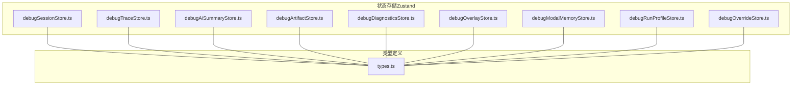

图表来源
- [debugSessionStore.ts:1-260](file://src/stores/debugSessionStore.ts#L1-L260)
- [debugTraceStore.ts:1-451](file://src/stores/debugTraceStore.ts#L1-L451)
- [debugAiSummaryStore.ts:1-101](file://src/stores/debugAiSummaryStore.ts#L1-L101)
- [debugArtifactStore.ts:1-115](file://src/stores/debugArtifactStore.ts#L1-L115)
- [debugDiagnosticsStore.ts:1-50](file://src/stores/debugDiagnosticsStore.ts#L1-L50)
- [debugOverlayStore.ts:1-112](file://src/stores/debugOverlayStore.ts#L1-L112)
- [debugModalMemoryStore.ts:1-308](file://src/stores/debugModalMemoryStore.ts#L1-L308)
- [debugRunProfileStore.ts:1-657](file://src/stores/debugRunProfileStore.ts#L1-L657)
- [debugOverrideStore.ts:1-41](file://src/stores/debugOverrideStore.ts#L1-L41)
- [types.ts:1-481](file://src/features/debug/types.ts#L1-L481)

章节来源
- [debugSessionStore.ts:1-260](file://src/stores/debugSessionStore.ts#L1-L260)
- [debugTraceStore.ts:1-451](file://src/stores/debugTraceStore.ts#L1-L451)
- [debugAiSummaryStore.ts:1-101](file://src/stores/debugAiSummaryStore.ts#L1-L101)
- [debugArtifactStore.ts:1-115](file://src/stores/debugArtifactStore.ts#L1-L115)
- [debugDiagnosticsStore.ts:1-50](file://src/stores/debugDiagnosticsStore.ts#L1-L50)
- [debugOverlayStore.ts:1-112](file://src/stores/debugOverlayStore.ts#L1-L112)
- [debugModalMemoryStore.ts:1-308](file://src/stores/debugModalMemoryStore.ts#L1-L308)
- [debugRunProfileStore.ts:1-657](file://src/stores/debugRunProfileStore.ts#L1-L657)
- [debugOverrideStore.ts:1-41](file://src/stores/debugOverrideStore.ts#L1-L41)
- [types.ts:1-481](file://src/features/debug/types.ts#L1-L481)

## 核心组件
本节对各调试Store进行要点归纳，说明其设计目标、关键状态与操作。

- 调试会话状态（debugSessionStore）
  - 设计目的：承载调试模态的全局状态，包括会话快照、运行状态、能力清单、资源预检与健康检查状态、协议错误等
  - 关键状态：模态开关、活动面板、选中的节点、会话与运行快照、代理测试结果、能力状态、资源预检/健康状态
  - 关键操作：打开/关闭模态、切换面板、选择节点、设置会话/运行状态、记录协议错误、更新能力清单、资源预检/健康检查结果
  - 生命周期：随调试运行启动而建立，结束或清理时重置；支持按会话ID清理

- 调试跟踪状态（debugTraceStore）
  - 设计目的：维护调试事件流，构建展示会话、事件排序与索引、性能汇总、回放状态，并提供筛选与聚焦能力
  - 关键状态：事件列表、展示事件、事件索引、展示会话、选中的展示会话、摘要与实时/回放摘要、性能汇总
  - 关键操作：追加事件、应用快照、设置回放状态、停止回放、设置性能汇总、选择/全选/最新展示会话、重置跟踪
  - 生命周期：增量追加事件并重建视图；支持按会话维度重置；回放状态与选中会话联动

- AI摘要状态（debugAiSummaryStore）
  - 设计目的：管理AI生成摘要的状态机与报告内容，支持按运行或节点生成，自动请求标记与重置
  - 关键状态：状态机（空闲/生成中/就绪/错误）、活动报告、错误信息、自动请求的目标ID集合
  - 关键操作：进入生成态、设置报告、设置错误、标记自动请求、重置
  - 生命周期：生成完成后可继续生成新的摘要；重置后回到空闲态

- 工件状态（debugArtifactStore）
  - 设计目的：管理调试过程中产生的工件（如截图、动作详情），支持加载、就绪、错误状态与按会话清理
  - 关键状态：工件映射、选中的工件ID
  - 关键操作：插入/更新引用、设置加载/就绪/错误、设置载荷、选择工件、按会话重置
  - 生命周期：按会话维度清理，避免跨会话污染

- 诊断状态（debugDiagnosticsStore）
  - 设计目的：收集与展示调试诊断事件，支持预检诊断与事件驱动的追加
  - 关键状态：诊断数组
  - 关键操作：设置预检诊断、从事件追加诊断、清空诊断
  - 生命周期：按需清空或在新会话开始时重置

- 覆盖状态（debugOverlayStore）
  - 设计目的：为可视化执行路径与节点/边状态提供叠加层，支持从跟踪摘要与节点执行覆盖应用
  - 关键状态：当前节点、识别中/已访问/成功/失败节点集合、已执行/候选边集合、选中的执行记录/尝试、高亮失败节点
  - 关键操作：从跟踪摘要/回放摘要应用、从节点执行覆盖应用、清除覆盖
  - 生命周期：随跟踪/执行覆盖更新，必要时清除

- 模态记忆状态（debugModalMemoryStore）
  - 设计目的：持久化调试模态的用户偏好（上次面板、运行模式、自动行为、节点执行过滤与细节模式等），使用localStorage
  - 关键状态：上次面板、上次运行模式、入口节点、自动行为开关、节点执行过滤、归属/详情模式
  - 关键操作：设置并写入localStorage、读取默认值、规范化输入
  - 生命周期：页面刷新后仅保留“上次面板”为默认值，其余持久化

- 运行配置状态（debugRunProfileStore）
  - 设计目的：管理调试运行配置集与当前激活配置，支持创建/删除/更新、构建运行请求、资源路径归一化、控制器类型解析
  - 关键状态：配置集、激活配置ID、当前配置与工件策略
  - 关键操作：设置/更新配置、设置入口/资源/代理、设置工件策略、构建运行请求、读写localStorage（含多版本迁移）
  - 生命周期：初始化时读取并规范化；变更时写回；支持多版本快照迁移

- 覆盖草稿状态（debugOverrideStore）
  - 设计目：持久化调试覆盖草稿，便于在调试中临时修改管道配置
  - 关键状态：草稿字符串
  - 关键操作：设置草稿、重置草稿
  - 生命周期：读写localStorage；默认草稿来自常量

章节来源
- [debugSessionStore.ts:36-80](file://src/stores/debugSessionStore.ts#L36-L80)
- [debugTraceStore.ts:27-53](file://src/stores/debugTraceStore.ts#L27-L53)
- [debugAiSummaryStore.ts:29-39](file://src/stores/debugAiSummaryStore.ts#L29-L39)
- [debugArtifactStore.ts:16-25](file://src/stores/debugArtifactStore.ts#L16-L25)
- [debugDiagnosticsStore.ts:4-9](file://src/stores/debugDiagnosticsStore.ts#L4-L9)
- [debugOverlayStore.ts:5-27](file://src/stores/debugOverlayStore.ts#L5-L27)
- [debugModalMemoryStore.ts:18-51](file://src/stores/debugModalMemoryStore.ts#L18-L51)
- [debugRunProfileStore.ts:59-78](file://src/stores/debugRunProfileStore.ts#L59-L78)
- [debugOverrideStore.ts:6-10](file://src/stores/debugOverrideStore.ts#L6-L10)

## 架构总览
调试状态管理采用分层架构：
- 类型层：统一定义调试事件、会话、运行模式、资源健康、诊断、工件、覆盖等协议与数据模型
- 状态层：以Zustand Store封装各调试域的状态与行为，提供原子化的状态更新函数
- 视图层：组件通过订阅Store状态渲染UI，触发对应操作
- 本地服务集成：运行配置Store负责将当前状态转换为运行请求，交由本地桥接服务执行

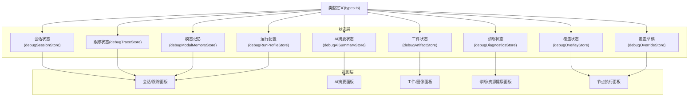

图表来源
- [types.ts:1-481](file://src/features/debug/types.ts#L1-L481)
- [debugSessionStore.ts:1-260](file://src/stores/debugSessionStore.ts#L1-L260)
- [debugTraceStore.ts:1-451](file://src/stores/debugTraceStore.ts#L1-L451)
- [debugAiSummaryStore.ts:1-101](file://src/stores/debugAiSummaryStore.ts#L1-L101)
- [debugArtifactStore.ts:1-115](file://src/stores/debugArtifactStore.ts#L1-L115)
- [debugDiagnosticsStore.ts:1-50](file://src/stores/debugDiagnosticsStore.ts#L1-L50)
- [debugOverlayStore.ts:1-112](file://src/stores/debugOverlayStore.ts#L1-L112)
- [debugModalMemoryStore.ts:1-308](file://src/stores/debugModalMemoryStore.ts#L1-L308)
- [debugRunProfileStore.ts:1-657](file://src/stores/debugRunProfileStore.ts#L1-L657)
- [debugOverrideStore.ts:1-41](file://src/stores/debugOverrideStore.ts#L1-L41)

## 详细组件分析

### 调试会话状态（debugSessionStore）
- 设计要点
  - 将调试模态的全局状态集中管理，包括会话快照、运行状态、能力清单、资源健康与预检状态、协议错误等
  - 提供打开/关闭模态、切换面板、选择节点、设置会话/运行状态、能力与资源状态更新、错误处理等操作
- 生命周期
  - 打开模态时根据记忆面板或默认面板决定初始活动面板；关闭模态时将当前面板写入记忆
  - 清理会话时可按会话ID清理，同时重置运行状态与代理测试结果
- 错误处理
  - 记录最近一次协议错误，提供清理接口

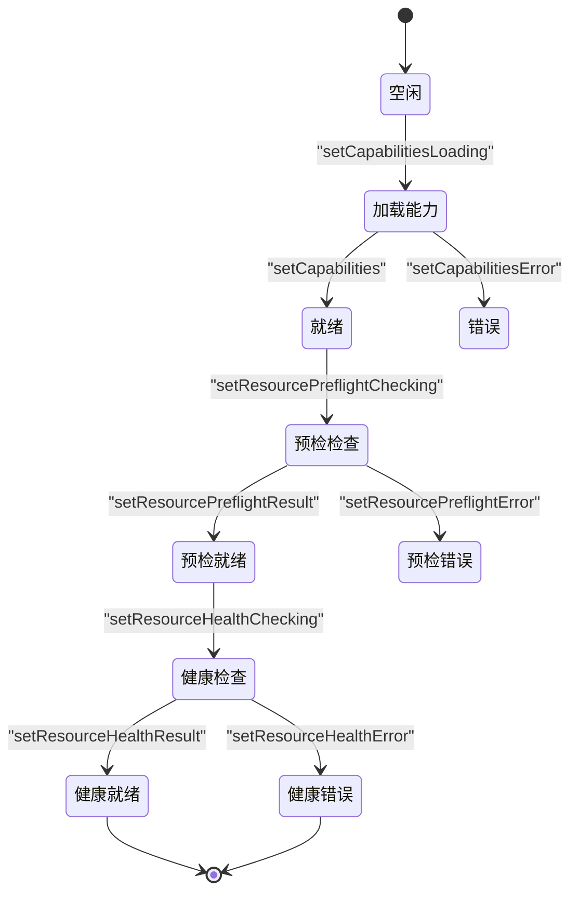

图表来源
- [debugSessionStore.ts:46-80](file://src/stores/debugSessionStore.ts#L46-L80)
- [debugSessionStore.ts:147-254](file://src/stores/debugSessionStore.ts#L147-L254)

章节来源
- [debugSessionStore.ts:36-80](file://src/stores/debugSessionStore.ts#L36-L80)
- [debugSessionStore.ts:94-124](file://src/stores/debugSessionStore.ts#L94-L124)
- [debugSessionStore.ts:166-254](file://src/stores/debugSessionStore.ts#L166-L254)

### 调试跟踪状态（debugTraceStore）
- 设计要点
  - 维护事件列表与索引，按时间戳、会话ID、运行ID与序列号排序
  - 构建展示会话（按会话维度聚合起止时间、状态、事件数等），支持选择/全选/最新聚焦
  - 支持实时摘要与回放摘要（基于游标序列与运行ID），并提供性能汇总选择
- 生命周期
  - 追加事件时去重并重建视图；应用快照时可按会话/运行维度合并
  - 回放状态可动态开启/停止，影响摘要计算
  - 重置跟踪时可按会话维度清理事件与性能汇总
- 查询与过滤
  - 展示会话按完成时间倒序与最后序列号倒序排序
  - 选择特定会话ID集合后，展示事件与性能汇总随之筛选

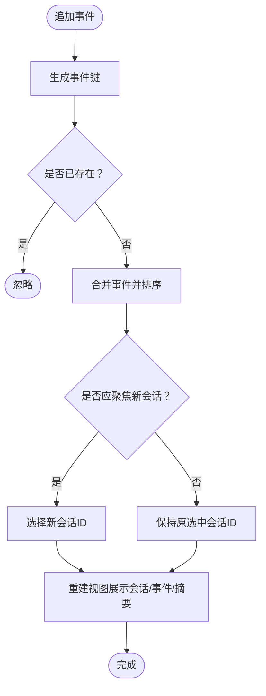

图表来源
- [debugTraceStore.ts:281-307](file://src/stores/debugTraceStore.ts#L281-L307)
- [debugTraceStore.ts:123-161](file://src/stores/debugTraceStore.ts#L123-L161)
- [debugTraceStore.ts:211-268](file://src/stores/debugTraceStore.ts#L211-L268)

章节来源
- [debugTraceStore.ts:27-53](file://src/stores/debugTraceStore.ts#L27-L53)
- [debugTraceStore.ts:281-307](file://src/stores/debugTraceStore.ts#L281-L307)
- [debugTraceStore.ts:310-336](file://src/stores/debugTraceStore.ts#L310-L336)
- [debugTraceStore.ts:338-365](file://src/stores/debugTraceStore.ts#L338-L365)
- [debugTraceStore.ts:367-382](file://src/stores/debugTraceStore.ts#L367-L382)
- [debugTraceStore.ts:384-416](file://src/stores/debugTraceStore.ts#L384-L416)
- [debugTraceStore.ts:418-449](file://src/stores/debugTraceStore.ts#L418-L449)

### AI摘要状态（debugAiSummaryStore）
- 设计要点
  - 状态机驱动：空闲 → 生成中 → 就绪/错误
  - 支持按运行或节点生成摘要，自动请求标记用于避免重复触发
- 生命周期
  - 生成中时创建占位报告，完成后替换为正式报告；错误时停留在错误态
  - 重置后回到空闲态，清空错误与自动请求标记

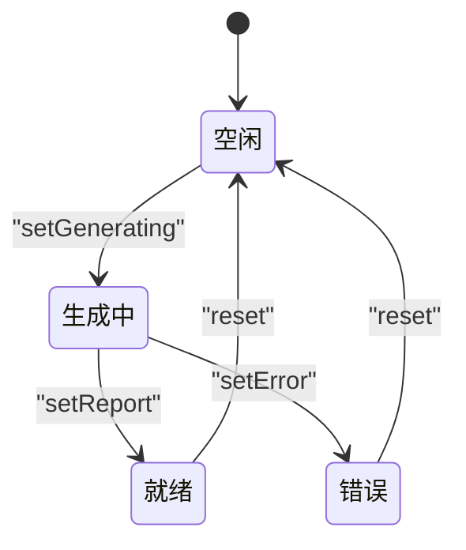

图表来源
- [debugAiSummaryStore.ts:29-39](file://src/stores/debugAiSummaryStore.ts#L29-L39)
- [debugAiSummaryStore.ts:56-84](file://src/stores/debugAiSummaryStore.ts#L56-L84)
- [debugAiSummaryStore.ts:93-99](file://src/stores/debugAiSummaryStore.ts#L93-L99)

章节来源
- [debugAiSummaryStore.ts:29-39](file://src/stores/debugAiSummaryStore.ts#L29-L39)
- [debugAiSummaryStore.ts:56-84](file://src/stores/debugAiSummaryStore.ts#L56-L84)
- [debugAiSummaryStore.ts:86-99](file://src/stores/debugAiSummaryStore.ts#L86-L99)

### 工件状态（debugArtifactStore）
- 设计要点
  - 工件条目包含引用、状态（空闲/加载/就绪/错误）与载荷
  - 支持按会话维度重置，避免跨会话干扰
- 生命周期
  - 插入引用时合并旧状态；设置载荷时转为就绪；设置错误时转为错误
  - 重置时可按会话过滤或清空全部

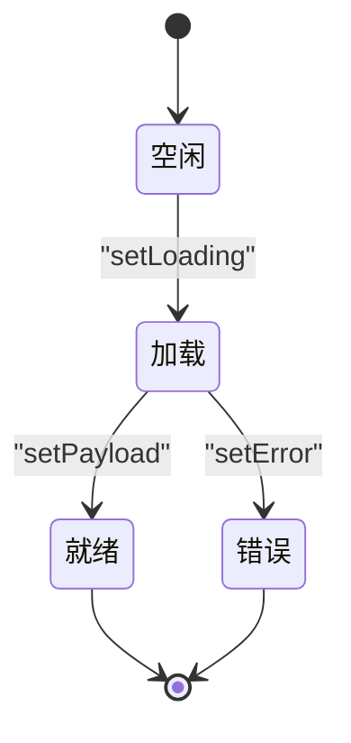

图表来源
- [debugArtifactStore.ts:16-25](file://src/stores/debugArtifactStore.ts#L16-L25)
- [debugArtifactStore.ts:46-88](file://src/stores/debugArtifactStore.ts#L46-L88)
- [debugArtifactStore.ts:92-113](file://src/stores/debugArtifactStore.ts#L92-L113)

章节来源
- [debugArtifactStore.ts:16-25](file://src/stores/debugArtifactStore.ts#L16-L25)
- [debugArtifactStore.ts:30-44](file://src/stores/debugArtifactStore.ts#L30-L44)
- [debugArtifactStore.ts:62-72](file://src/stores/debugArtifactStore.ts#L62-L72)
- [debugArtifactStore.ts:74-88](file://src/stores/debugArtifactStore.ts#L74-L88)
- [debugArtifactStore.ts:92-113](file://src/stores/debugArtifactStore.ts#L92-L113)

### 诊断状态（debugDiagnosticsStore）
- 设计要点
  - 将调试事件转换为标准化诊断项（含严重级别、代码、消息、文件/节点/字段路径等）
  - 支持预检诊断与事件驱动追加
- 生命周期
  - 可清空诊断列表，便于在新会话开始时重置

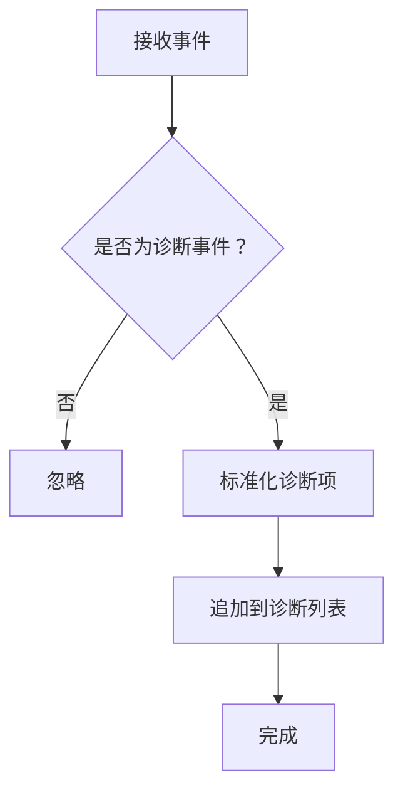

图表来源
- [debugDiagnosticsStore.ts:11-33](file://src/stores/debugDiagnosticsStore.ts#L11-L33)
- [debugDiagnosticsStore.ts:40-46](file://src/stores/debugDiagnosticsStore.ts#L40-L46)

章节来源
- [debugDiagnosticsStore.ts:4-9](file://src/stores/debugDiagnosticsStore.ts#L4-L9)
- [debugDiagnosticsStore.ts:11-33](file://src/stores/debugDiagnosticsStore.ts#L11-L33)
- [debugDiagnosticsStore.ts:40-46](file://src/stores/debugDiagnosticsStore.ts#L40-L46)

### 覆盖状态（debugOverlayStore）
- 设计要点
  - 从跟踪摘要/回放摘要应用当前节点、识别中/访问/成功/失败节点集合、执行/候选边集合
  - 从节点执行覆盖应用选中记录/尝试、执行路径与高亮失败节点
- 生命周期
  - 应用新覆盖时更新集合；清除覆盖时清空所有集合

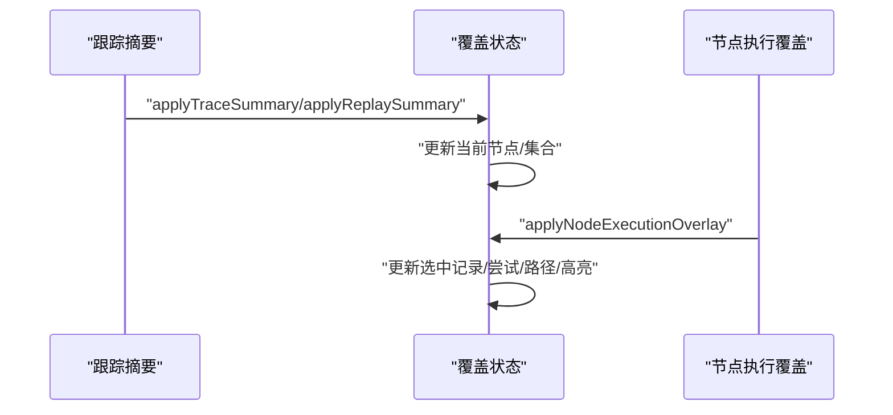

图表来源
- [debugOverlayStore.ts:42-62](file://src/stores/debugOverlayStore.ts#L42-L62)
- [debugOverlayStore.ts:64-77](file://src/stores/debugOverlayStore.ts#L64-L77)
- [debugOverlayStore.ts:79-110](file://src/stores/debugOverlayStore.ts#L79-L110)

章节来源
- [debugOverlayStore.ts:5-27](file://src/stores/debugOverlayStore.ts#L5-L27)
- [debugOverlayStore.ts:42-62](file://src/stores/debugOverlayStore.ts#L42-L62)
- [debugOverlayStore.ts:64-77](file://src/stores/debugOverlayStore.ts#L64-L77)
- [debugOverlayStore.ts:79-110](file://src/stores/debugOverlayStore.ts#L79-L110)

### 模态记忆状态（debugModalMemoryStore）
- 设计要点
  - 使用localStorage持久化调试模态偏好，包含上次面板、运行模式、自动行为、节点执行过滤与细节模式
  - 读取时进行规范化与默认值填充；写入时仅持久化非页面生命周期的字段
- 生命周期
  - 页面刷新后“上次面板”恢复默认，其余偏好从localStorage恢复

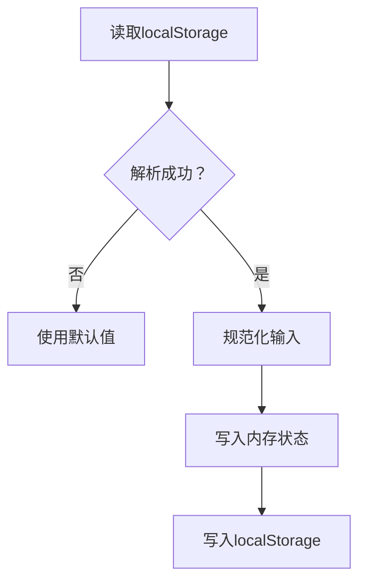

图表来源
- [debugModalMemoryStore.ts:185-222](file://src/stores/debugModalMemoryStore.ts#L185-L222)
- [debugModalMemoryStore.ts:243-307](file://src/stores/debugModalMemoryStore.ts#L243-L307)

章节来源
- [debugModalMemoryStore.ts:18-51](file://src/stores/debugModalMemoryStore.ts#L18-L51)
- [debugModalMemoryStore.ts:185-222](file://src/stores/debugModalMemoryStore.ts#L185-L222)
- [debugModalMemoryStore.ts:243-307](file://src/stores/debugModalMemoryStore.ts#L243-L307)

### 运行配置状态（debugRunProfileStore）
- 设计要点
  - 管理调试配置集与当前激活配置，支持创建/删除/更新
  - 构建运行请求时，结合资源快照、入口节点、控制器类型与输入参数进行归一化
  - 支持多版本快照迁移与控制器选项清理（去除内部ID）
- 生命周期
  - 初始化读取快照并规范化；变更时写回localStorage；构建请求时进行参数校验与归一化

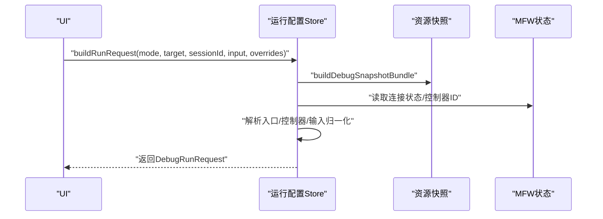

图表来源
- [debugRunProfileStore.ts:350-425](file://src/stores/debugRunProfileStore.ts#L350-L425)
- [debugRunProfileStore.ts:119-158](file://src/stores/debugRunProfileStore.ts#L119-L158)
- [debugRunProfileStore.ts:205-428](file://src/stores/debugRunProfileStore.ts#L205-L428)

章节来源
- [debugRunProfileStore.ts:59-78](file://src/stores/debugRunProfileStore.ts#L59-L78)
- [debugRunProfileStore.ts:350-425](file://src/stores/debugRunProfileStore.ts#L350-L425)
- [debugRunProfileStore.ts:119-158](file://src/stores/debugRunProfileStore.ts#L119-L158)
- [debugRunProfileStore.ts:205-428](file://src/stores/debugRunProfileStore.ts#L205-L428)

### 覆盖草稿状态（debugOverrideStore）
- 设计要点
  - 持久化调试覆盖草稿，便于在调试中临时修改管道配置
  - 默认草稿来自常量；支持重置为默认草稿
- 生命周期
  - 读取时若异常则返回默认草稿；写入时捕获异常并告警

章节来源
- [debugOverrideStore.ts:6-10](file://src/stores/debugOverrideStore.ts#L6-L10)
- [debugOverrideStore.ts:30-40](file://src/stores/debugOverrideStore.ts#L30-L40)

## 依赖关系分析
- 类型依赖
  - 所有Store均依赖features/debug/types中的类型定义，确保事件、会话、运行模式、资源健康、诊断、工件、覆盖等数据结构一致
- 内部耦合
  - debugSessionStore与debugModalMemoryStore协作：打开/关闭模态时读写记忆面板
  - debugTraceStore与debugOverlayStore协作：从跟踪摘要应用覆盖
  - debugRunProfileStore与MFW状态协作：解析控制器类型与连接状态
- 外部依赖
  - localStorage用于持久化调试偏好与配置快照
  - 本地桥接服务（LocalBridge）通过运行请求发起调试任务

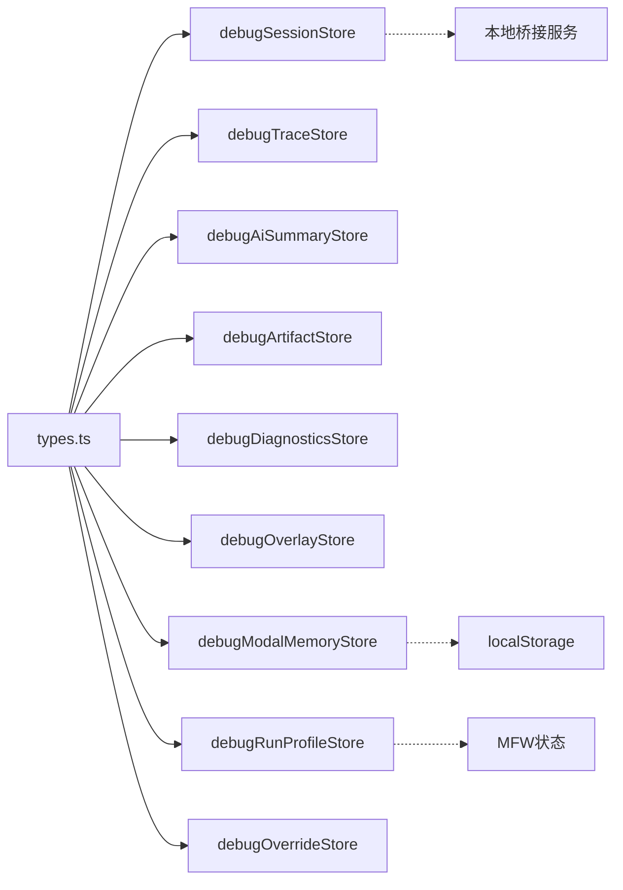

图表来源
- [types.ts:1-481](file://src/features/debug/types.ts#L1-L481)
- [debugSessionStore.ts:1-260](file://src/stores/debugSessionStore.ts#L1-L260)
- [debugTraceStore.ts:1-451](file://src/stores/debugTraceStore.ts#L1-L451)
- [debugAiSummaryStore.ts:1-101](file://src/stores/debugAiSummaryStore.ts#L1-L101)
- [debugArtifactStore.ts:1-115](file://src/stores/debugArtifactStore.ts#L1-L115)
- [debugDiagnosticsStore.ts:1-50](file://src/stores/debugDiagnosticsStore.ts#L1-L50)
- [debugOverlayStore.ts:1-112](file://src/stores/debugOverlayStore.ts#L1-L112)
- [debugModalMemoryStore.ts:1-308](file://src/stores/debugModalMemoryStore.ts#L1-L308)
- [debugRunProfileStore.ts:1-657](file://src/stores/debugRunProfileStore.ts#L1-L657)
- [debugOverrideStore.ts:1-41](file://src/stores/debugOverrideStore.ts#L1-L41)

章节来源
- [types.ts:1-481](file://src/features/debug/types.ts#L1-L481)
- [debugRunProfileStore.ts:188-203](file://src/stores/debugRunProfileStore.ts#L188-L203)
- [debugModalMemoryStore.ts:185-222](file://src/stores/debugModalMemoryStore.ts#L185-L222)

## 性能考量
- 事件排序与索引
  - 跟踪状态对事件进行多维排序（时间戳、会话ID、运行ID、序列号），并在追加时建立索引，降低查询成本
- 视图重建优化
  - 通过一次性重建视图（展示会话、展示事件、摘要、性能汇总）减少多次重绘
- 去重与过滤
  - 追加事件前检查事件键，避免重复；按会话ID集合筛选展示事件，提升渲染效率
- 状态粒度
  - 将不同域的状态拆分为独立Store，避免无关状态变更引发的重渲染

## 故障排查指南
- 协议错误
  - 会话状态提供协议错误记录与清理接口，便于定位与恢复
- 资源健康/预检
  - 预检与健康检查状态机提供错误信息与首条诊断消息，辅助快速定位问题
- 诊断事件
  - 诊断状态支持从事件提取标准化诊断项，便于统一展示与过滤
- 工件加载
  - 工件状态提供错误标记，结合会话维度重置，避免跨会话干扰
- 运行配置
  - 构建运行请求时进行参数归一化与校验，异常时抛出明确错误提示

章节来源
- [debugSessionStore.ts:143-145](file://src/stores/debugSessionStore.ts#L143-L145)
- [debugSessionStore.ts:196-204](file://src/stores/debugSessionStore.ts#L196-L204)
- [debugDiagnosticsStore.ts:40-46](file://src/stores/debugDiagnosticsStore.ts#L40-L46)
- [debugArtifactStore.ts:74-88](file://src/stores/debugArtifactStore.ts#L74-L88)
- [debugRunProfileStore.ts:361-363](file://src/stores/debugRunProfileStore.ts#L361-L363)

## 结论
调试状态管理通过分层的Zustand Store实现了对会话、跟踪、AI摘要、工件、诊断、覆盖、运行配置与覆盖草稿的精细化控制。类型层确保了数据一致性，状态层提供了清晰的生命周期与操作接口，配合localStorage的持久化策略与多版本快照迁移，满足了调试场景下的复杂需求。未来可在以下方向持续优化：
- 对大型事件流进一步引入分页/滚动窗口策略
- 在覆盖草稿层面增加版本对比与差异高亮
- 增强错误边界与可观测性（埋点/日志）

## 附录
- 调试协议与数据模型参考：[types.ts:1-481](file://src/features/debug/types.ts#L1-L481)
- 会话状态：[debugSessionStore.ts:1-260](file://src/stores/debugSessionStore.ts#L1-L260)
- 跟踪状态：[debugTraceStore.ts:1-451](file://src/stores/debugTraceStore.ts#L1-L451)
- AI摘要状态：[debugAiSummaryStore.ts:1-101](file://src/stores/debugAiSummaryStore.ts#L1-L101)
- 工件状态：[debugArtifactStore.ts:1-115](file://src/stores/debugArtifactStore.ts#L1-L115)
- 诊断状态：[debugDiagnosticsStore.ts:1-50](file://src/stores/debugDiagnosticsStore.ts#L1-L50)
- 覆盖状态：[debugOverlayStore.ts:1-112](file://src/stores/debugOverlayStore.ts#L1-L112)
- 模态记忆状态：[debugModalMemoryStore.ts:1-308](file://src/stores/debugModalMemoryStore.ts#L1-L308)
- 运行配置状态：[debugRunProfileStore.ts:1-657](file://src/stores/debugRunProfileStore.ts#L1-L657)
- 覆盖草稿状态：[debugOverrideStore.ts:1-41](file://src/stores/debugOverrideStore.ts#L1-L41)