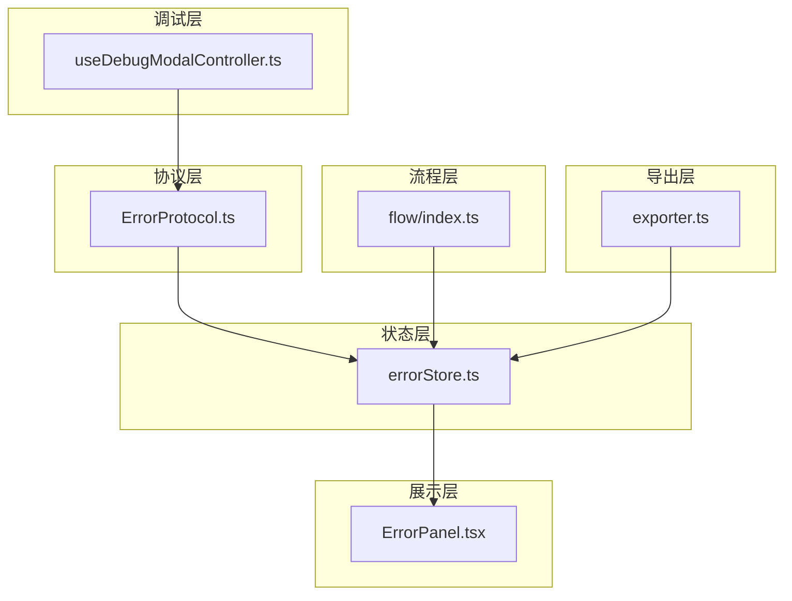
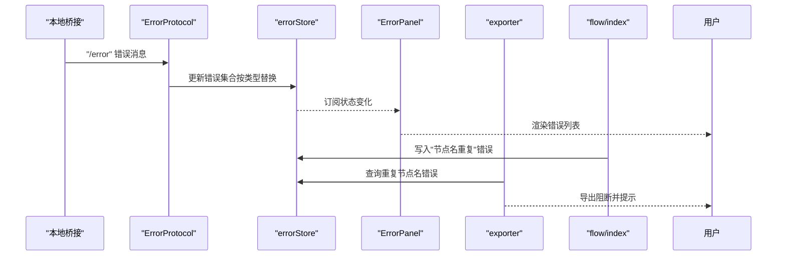
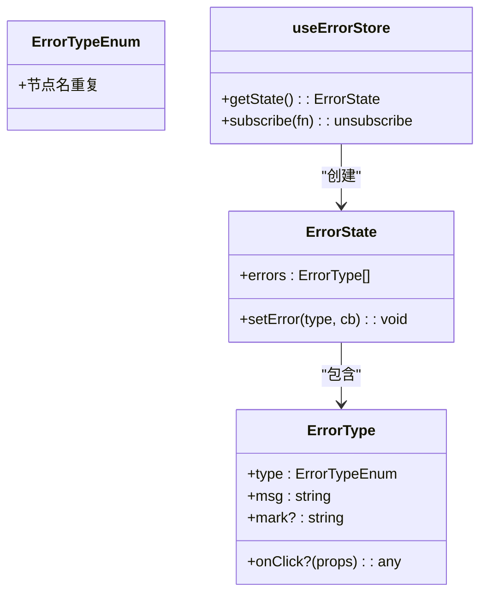
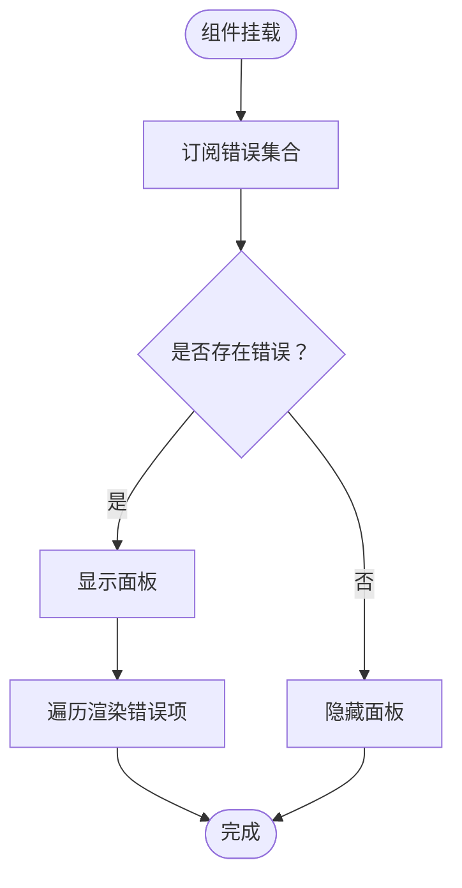
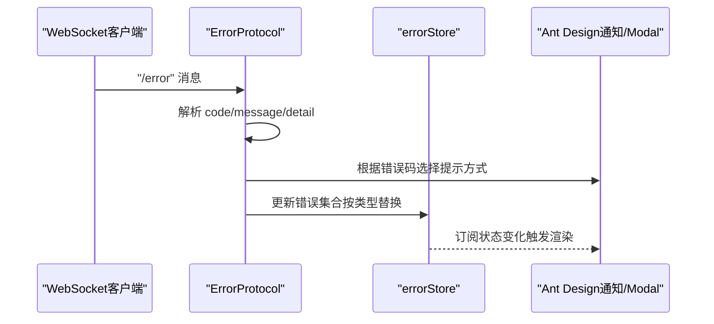
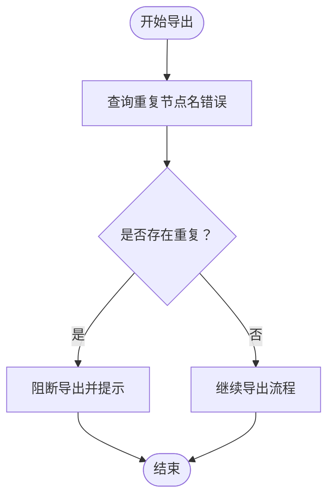
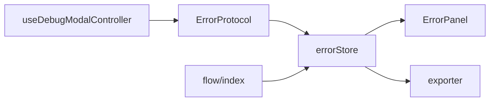

# 错误状态管理

<cite>
**本文档引用的文件**
- [errorStore.ts](file://src/stores/errorStore.ts)
- [ErrorPanel.tsx](file://src/components/panels/main/ErrorPanel.tsx)
- [ErrorProtocol.ts](file://src/services/protocols/ErrorProtocol.ts)
- [exporter.ts](file://src/core/parser/exporter.ts)
- [index.ts](file://src/stores/flow/index.ts)
- [useDebugModalController.ts](file://src/features/debug/hooks/useDebugModalController.ts)
</cite>

## 目录
1. [简介](#简介)
2. [项目结构](#项目结构)
3. [核心组件](#核心组件)
4. [架构总览](#架构总览)
5. [详细组件分析](#详细组件分析)
6. [依赖关系分析](#依赖关系分析)
7. [性能考量](#性能考量)
8. [故障排除指南](#故障排除指南)
9. [结论](#结论)

## 简介
本文件系统性阐述本项目的错误状态管理体系，重点围绕 errorStore 的设计目的、错误状态收集机制、错误分类与展示逻辑、数据结构与管理策略、与全局错误处理系统的集成方式、订阅与响应模式，以及错误恢复与重试机制的实现指导。通过多处关键文件的协同工作，系统实现了从底层协议错误到前端展示与用户交互的完整闭环。

## 项目结构
错误状态管理涉及以下关键模块：
- 状态层：errorStore 提供错误集合的状态管理与更新接口
- 展示层：ErrorPanel 订阅错误状态并渲染错误列表
- 协议层：ErrorProtocol 接收来自本地桥接的错误消息并进行统一处理
- 导出层：exporter 在导出流程中检查并阻断重复节点名等错误
- 流程层：flow store 在节点校验阶段写入错误类型
- 调试层：调试控制器在运行前清理协议错误并进行前置诊断

图表来源
- [errorStore.ts:1-39](file://src/stores/errorStore.ts#L1-L39)
- [ErrorPanel.tsx:1-38](file://src/components/panels/main/ErrorPanel.tsx#L1-L38)
- [ErrorProtocol.ts:1-121](file://src/services/protocols/ErrorProtocol.ts#L1-L121)
- [exporter.ts:1-320](file://src/core/parser/exporter.ts#L1-L320)
- [index.ts:1-200](file://src/stores/flow/index.ts#L1-L200)
- [useDebugModalController.ts:1-847](file://src/features/debug/hooks/useDebugModalController.ts#L1-L847)

章节来源
- [errorStore.ts:1-39](file://src/stores/errorStore.ts#L1-L39)
- [ErrorPanel.tsx:1-38](file://src/components/panels/main/ErrorPanel.tsx#L1-L38)
- [ErrorProtocol.ts:1-121](file://src/services/protocols/ErrorProtocol.ts#L1-L121)
- [exporter.ts:1-320](file://src/core/parser/exporter.ts#L1-L320)
- [index.ts:1-200](file://src/stores/flow/index.ts#L1-L200)
- [useDebugModalController.ts:1-847](file://src/features/debug/hooks/useDebugModalController.ts#L1-L847)

## 核心组件
- 错误存储（errorStore）
  - 定义错误类型枚举与错误条目结构
  - 提供按类型过滤与批量更新的 setState 函数
  - 支持通过回调函数精确替换某一类错误，保证去重与合并
- 错误面板（ErrorPanel）
  - 订阅错误集合，动态显示错误列表
  - 通过样式类控制面板显隐
- 错误协议处理器（ErrorProtocol）
  - 注册 /error 路由，接收来自本地桥接的错误消息
  - 根据错误码映射提示文案，对特定错误弹出 Modal
  - 对控制器相关错误自动清理连接状态
- 导出器（exporter）
  - 在导出前检查重复节点名错误，若有则阻断导出并提示
- 流程存储（flow store）
  - 在节点校验阶段写入“节点名重复”错误类型
- 调试控制器（useDebugModalController）
  - 运行前清理协议错误，进行前置诊断与错误上报

章节来源
- [errorStore.ts:1-39](file://src/stores/errorStore.ts#L1-L39)
- [ErrorPanel.tsx:1-38](file://src/components/panels/main/ErrorPanel.tsx#L1-L38)
- [ErrorProtocol.ts:1-121](file://src/services/protocols/ErrorProtocol.ts#L1-L121)
- [exporter.ts:1-320](file://src/core/parser/exporter.ts#L1-L320)
- [index.ts:1-200](file://src/stores/flow/index.ts#L1-L200)
- [useDebugModalController.ts:1-847](file://src/features/debug/hooks/useDebugModalController.ts#L1-L847)

## 架构总览
错误状态管理采用“协议接收—状态聚合—UI 展示—业务阻断”的分层架构。协议层负责标准化错误消息；状态层负责聚合与去重；展示层负责用户可见反馈；业务层在关键路径（如导出）进行阻断与提示。

图表来源
- [ErrorProtocol.ts:20-79](file://src/services/protocols/ErrorProtocol.ts#L20-L79)
- [errorStore.ts:24-38](file://src/stores/errorStore.ts#L24-L38)
- [ErrorPanel.tsx:8-35](file://src/components/panels/main/ErrorPanel.tsx#L8-L35)
- [exporter.ts:44-57](file://src/core/parser/exporter.ts#L44-L57)
- [index.ts:90-100](file://src/stores/flow/index.ts#L90-L100)

## 详细组件分析

### 错误存储（errorStore）设计与实现
- 设计目的
  - 提供集中化的错误集合管理，支持按错误类型进行原子化更新
  - 通过回调函数实现“先过滤旧值、再计算新值、最后合并”的幂等更新
- 数据结构
  - 错误类型枚举：用于标识错误类别（如“节点名重复”）
  - 错误条目结构：包含类型、消息、可选标记与点击回调
- 管理策略
  - 按类型过滤：findErrorsByType 提供基于类型的筛选能力
  - 批量更新：setError 接受类型与回调，内部完成去重与合并
- 复杂度
  - 过滤与合并均为线性复杂度 O(n)，适合小规模错误集合场景

图表来源
- [errorStore.ts:3-11](file://src/stores/errorStore.ts#L3-L11)
- [errorStore.ts:17-23](file://src/stores/errorStore.ts#L17-L23)
- [errorStore.ts:24-38](file://src/stores/errorStore.ts#L24-L38)

章节来源
- [errorStore.ts:1-39](file://src/stores/errorStore.ts#L1-L39)

### 错误面板（ErrorPanel）展示逻辑
- 订阅与渲染
  - 订阅错误集合，根据数量决定面板显隐
  - 逐项渲染错误，包含序号、类型与消息
- 用户体验
  - 通过样式类切换控制面板显示，避免空面板占用空间
  - 错误列表以简洁文本呈现，便于快速定位问题

图表来源
- [ErrorPanel.tsx:8-35](file://src/components/panels/main/ErrorPanel.tsx#L8-L35)

章节来源
- [ErrorPanel.tsx:1-38](file://src/components/panels/main/ErrorPanel.tsx#L1-L38)

### 错误协议处理器（ErrorProtocol）集成与分类
- 路由注册
  - 注册 /error 路由，接收来自本地桥接的错误消息
- 错误分类与展示
  - 文件相关错误、MFW 相关错误等按错误码映射提示文案
  - 对 OCR 资源加载失败等特定错误弹出 Modal，增强可读性
- 系统联动
  - 对控制器相关错误自动清理连接状态，避免后续操作误导
- 与全局错误处理的衔接
  - 通过统一的错误消息格式，确保前端 UI 与业务层能一致消费

图表来源
- [ErrorProtocol.ts:20-79](file://src/services/protocols/ErrorProtocol.ts#L20-L79)
- [errorStore.ts:24-38](file://src/stores/errorStore.ts#L24-L38)

章节来源
- [ErrorProtocol.ts:1-121](file://src/services/protocols/ErrorProtocol.ts#L1-L121)

### 导出流程中的错误阻断（exporter）
- 业务阻断点
  - 在导出前查询“节点名重复”错误集合，若存在则阻断导出并提示
- 与状态层协作
  - 通过 findErrorsByType 获取当前重复节点名列表，形成用户可读的提示
- 用户引导
  - 提示用户修改重复节点名后再试，避免导出无效或歧义

图表来源
- [exporter.ts:44-57](file://src/core/parser/exporter.ts#L44-L57)
- [errorStore.ts:13-15](file://src/stores/errorStore.ts#L13-L15)

章节来源
- [exporter.ts:1-320](file://src/core/parser/exporter.ts#L1-L320)

### 流程层的错误写入（flow store）
- 节点校验阶段
  - 在节点标签唯一性校验失败时，调用 errorStore 写入“节点名重复”错误
- 与导出器的配合
  - 为导出阻断提供数据基础，确保业务一致性

章节来源
- [index.ts:90-100](file://src/stores/flow/index.ts#L90-L100)

### 调试控制器的错误清理与前置诊断（useDebugModalController）
- 运行前清理
  - 启动调试前主动清理协议错误，避免历史错误干扰
- 前置诊断
  - 对覆盖参数解析错误、调试前置条件不满足等情况进行诊断与提示
- 与协议层联动
  - 通过 setProtocolError 写入协议错误，便于 ErrorProtocol 统一处理

章节来源
- [useDebugModalController.ts:336-352](file://src/features/debug/hooks/useDebugModalController.ts#L336-L352)
- [useDebugModalController.ts:378-387](file://src/features/debug/hooks/useDebugModalController.ts#L378-L387)

## 依赖关系分析
- 组件耦合
  - ErrorPanel 仅依赖 errorStore 的订阅能力，低耦合高内聚
  - ErrorProtocol 依赖 mfwStore 进行控制器状态清理，耦合于设备连接状态
  - exporter 依赖 errorStore 的类型过滤能力，耦合于业务导出流程
- 依赖链
  - 协议层 → 状态层 → 展示层
  - 流程层 → 状态层 → 导出层
  - 调试层 → 协议层（通过 setProtocolError）

图表来源
- [ErrorProtocol.ts:1-121](file://src/services/protocols/ErrorProtocol.ts#L1-L121)
- [errorStore.ts:1-39](file://src/stores/errorStore.ts#L1-L39)
- [ErrorPanel.tsx:1-38](file://src/components/panels/main/ErrorPanel.tsx#L1-L38)
- [exporter.ts:1-320](file://src/core/parser/exporter.ts#L1-L320)
- [index.ts:1-200](file://src/stores/flow/index.ts#L1-L200)
- [useDebugModalController.ts:1-847](file://src/features/debug/hooks/useDebugModalController.ts#L1-L847)

## 性能考量
- 状态更新复杂度
  - errorStore 的过滤与合并为 O(n)，适用于中小规模错误集合
- 渲染开销
  - ErrorPanel 仅在错误数量变化时更新，避免不必要的重渲染
- I/O 与网络
  - ErrorProtocol 的 Modal/通知弹窗为 UI 层面的即时反馈，不影响核心状态更新性能
- 建议
  - 当错误数量增长时，可考虑分页或分组展示，减少 DOM 节点数量
  - 对高频错误（如重复节点名）可在前端做去抖或合并提示

## 故障排除指南
- 常见问题与定位
  - 导出被阻断：检查“节点名重复”错误集合，确认重复项并修改
  - 控制器错误导致连接异常：关注 ErrorProtocol 中的控制器相关错误码，确认连接状态清理是否生效
  - OCR 资源加载失败：查看 Modal 中的原因、资源目录与排查建议
- 调试步骤
  - 在调试启动前调用清理协议错误的方法，确保历史错误不干扰
  - 对覆盖参数解析错误，查看调试前置诊断结果并修正
- 相关实现参考
  - 错误清理与诊断：参见调试控制器中的清理与诊断逻辑
  - 错误阻断与提示：参见导出器中的阻断与提示逻辑

章节来源
- [useDebugModalController.ts:336-352](file://src/features/debug/hooks/useDebugModalController.ts#L336-L352)
- [useDebugModalController.ts:378-387](file://src/features/debug/hooks/useDebugModalController.ts#L378-L387)
- [exporter.ts:44-57](file://src/core/parser/exporter.ts#L44-L57)
- [ErrorProtocol.ts:55-79](file://src/services/protocols/ErrorProtocol.ts#L55-L79)

## 结论
本项目的错误状态管理以 errorStore 为核心，结合协议层的统一处理、展示层的直观反馈、业务层的阻断与调试层的清理诊断，形成了清晰、可扩展且用户友好的错误处理闭环。通过类型化错误与回调式更新，系统在保证一致性的同时具备良好的可维护性。未来可在大规模错误集合与高频错误场景下引入更精细的展示与性能优化策略。