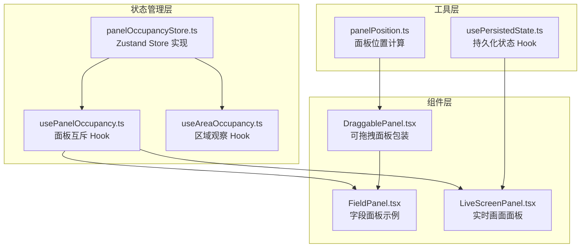
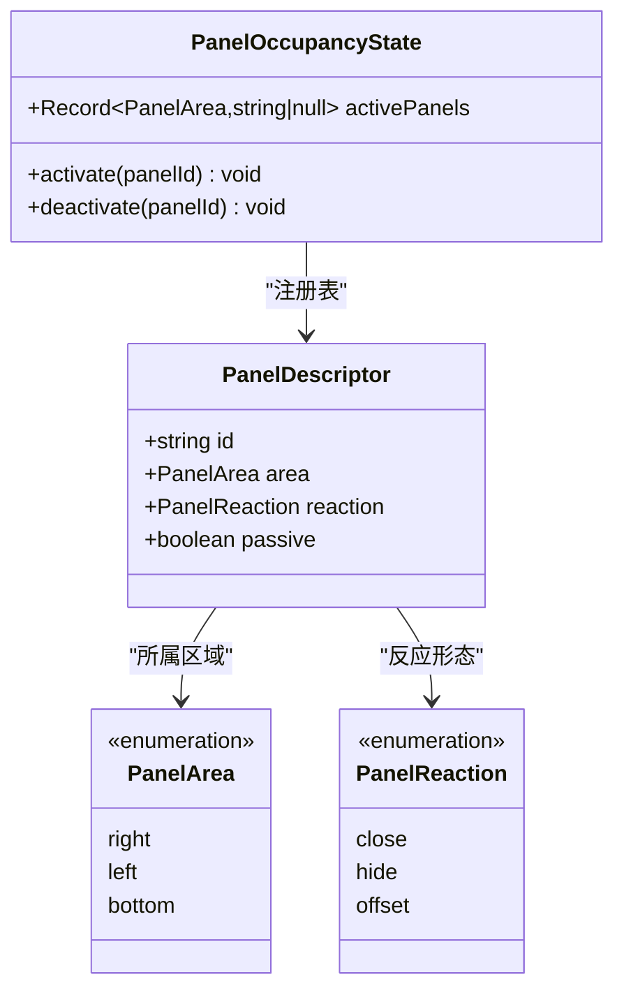
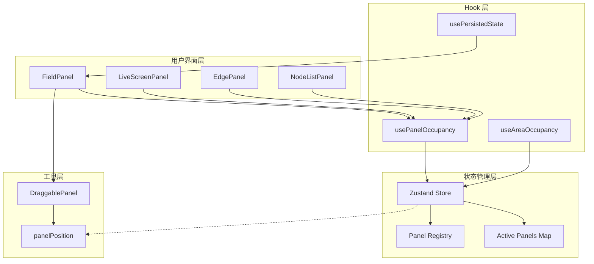
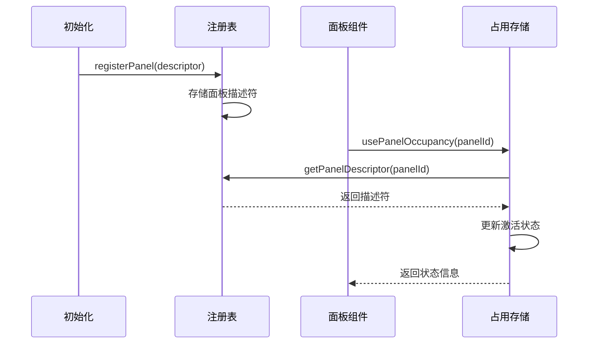
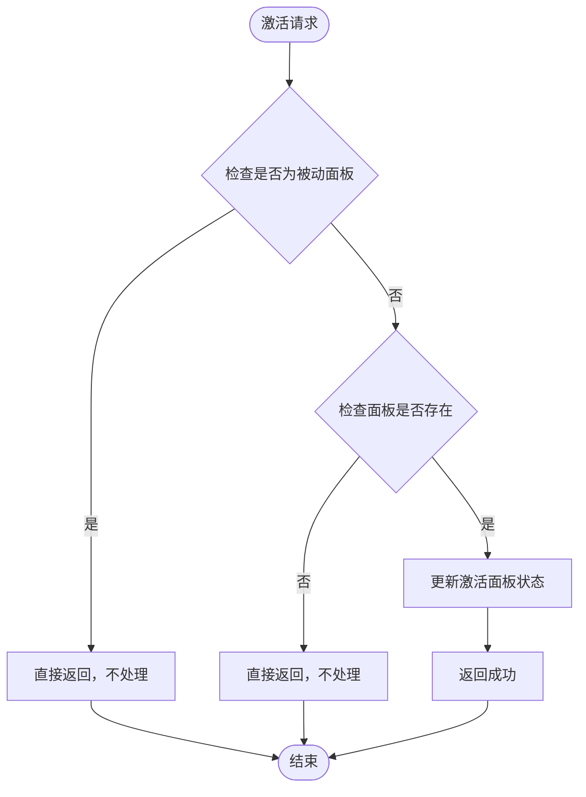
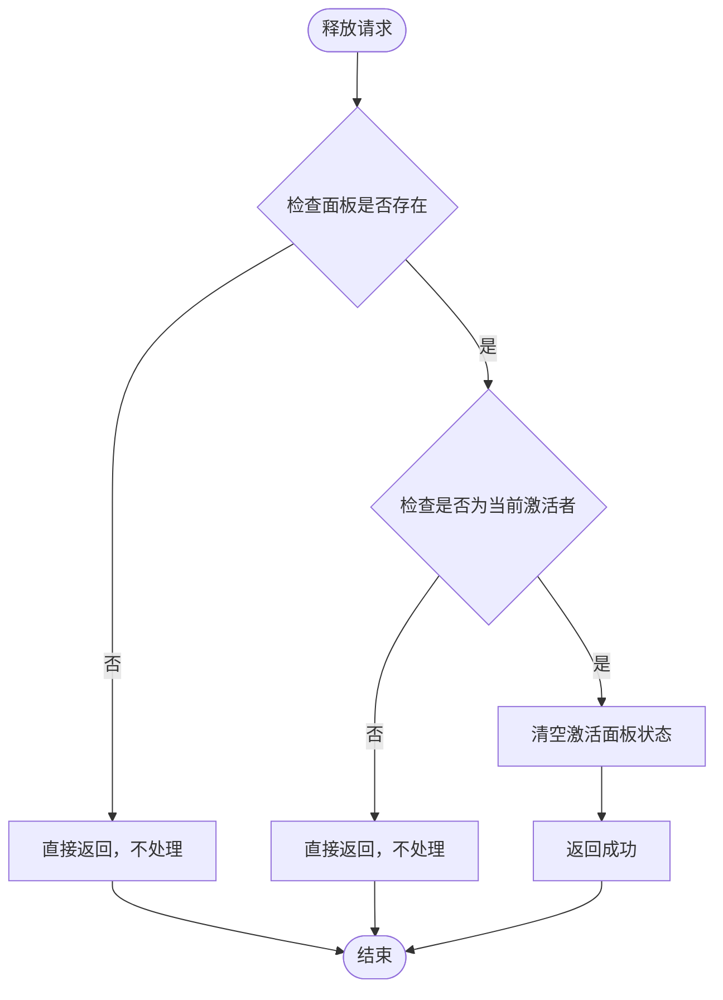
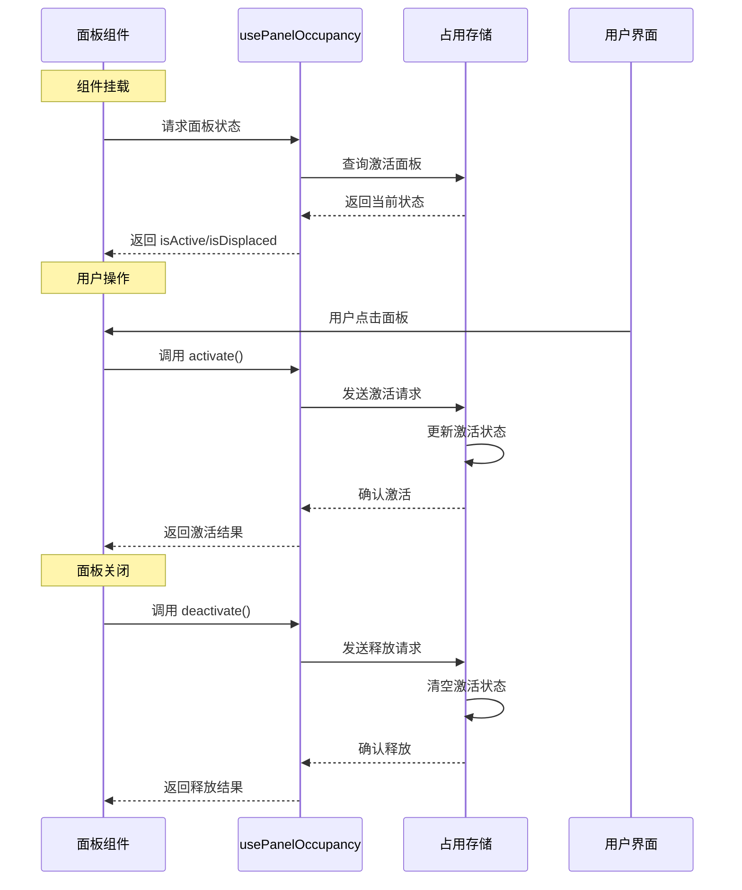
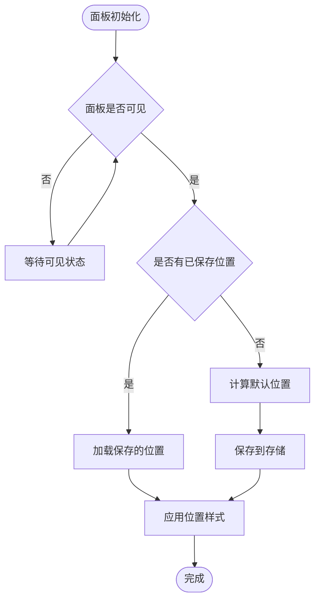
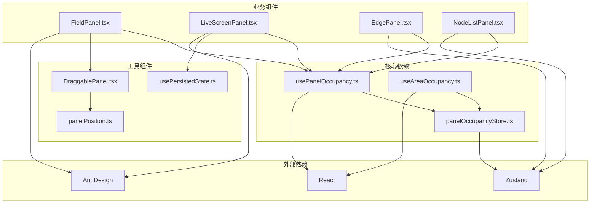

# 面板占用状态管理

<cite>
**本文档引用的文件**
- [panelOccupancyStore.ts](file://src/stores/panelOccupancyStore.ts)
- [usePanelOccupancy.ts](file://src/hooks/usePanelOccupancy.ts)
- [useAreaOccupancy.ts](file://src/hooks/useAreaOccupancy.ts)
- [DraggablePanel.tsx](file://src/components/panels/common/DraggablePanel.tsx)
- [FieldPanel.tsx](file://src/components/panels/main/FieldPanel.tsx)
- [LiveScreenPanel.tsx](file://src/components/panels/main/LiveScreenPanel.tsx)
- [panelPosition.ts](file://src/utils/ui/panelPosition.ts)
- [usePersistedState.ts](file://src/hooks/usePersistedState.ts)
</cite>

## 目录
1. [简介](#简介)
2. [项目结构](#项目结构)
3. [核心组件](#核心组件)
4. [架构总览](#架构总览)
5. [详细组件分析](#详细组件分析)
6. [依赖关系分析](#依赖关系分析)
7. [性能考虑](#性能考虑)
8. [故障排除指南](#故障排除指南)
9. [结论](#结论)

## 简介

面板占用状态管理系统是 MAA Pipeline Editor 中负责管理界面面板布局和互斥状态的核心子系统。该系统通过声明式的面板注册机制，实现了对右侧、左侧和底部三个区域的面板占用控制，确保同一区域内同一时刻只有一个面板处于激活状态。

系统采用 React Hooks + Zustand 的组合架构，提供了完整的面板生命周期管理、状态同步和用户交互响应能力。通过被动面板和主动面板的区分，系统能够智能处理面板间的冲突和协作，为用户提供流畅的多面板工作体验。

## 项目结构

面板占用状态管理相关的代码主要分布在以下目录结构中：

**图表来源**
- [panelOccupancyStore.ts:1-136](file://src/stores/panelOccupancyStore.ts#L1-L136)
- [usePanelOccupancy.ts:1-61](file://src/hooks/usePanelOccupancy.ts#L1-L61)
- [DraggablePanel.tsx:1-178](file://src/components/panels/common/DraggablePanel.tsx#L1-L178)

**章节来源**
- [panelOccupancyStore.ts:1-136](file://src/stores/panelOccupancyStore.ts#L1-L136)
- [usePanelOccupancy.ts:1-61](file://src/hooks/usePanelOccupancy.ts#L1-L61)

## 核心组件

### 面板占用存储 (PanelOccupancyStore)

面板占用存储是整个系统的核心状态管理器，基于 Zustand 实现，负责维护各区域的激活面板状态和提供相应的操作接口。

#### 数据结构设计

系统使用 Map 结构维护面板注册表，确保每个面板都有唯一的描述符信息：

**图表来源**
- [panelOccupancyStore.ts:12-28](file://src/stores/panelOccupancyStore.ts#L12-L28)
- [panelOccupancyStore.ts:87-96](file://src/stores/panelOccupancyStore.ts#L87-L96)

#### 初始化注册机制

系统在启动时预先注册所有面板，分为主动面板和被动面板两类：

| 区域 | 主动面板 | 被动面板 | 反应形态 |
|------|----------|----------|----------|
| right | json, field, edge, nodeList | liveScreen, recognition, explorationFAB | close, hide, offset |

**章节来源**
- [panelOccupancyStore.ts:47-84](file://src/stores/panelOccupancyStore.ts#L47-L84)

### 面板互斥 Hook (usePanelOccupancy)

usePanelOccupancy 是面板组件与占用系统交互的主要接口，提供了面板激活状态的查询和控制能力。

#### 核心功能

1. **激活状态判断**: 通过比较当前面板ID与区域激活面板ID决定 isActive 状态
2. **冲突检测**: 对于被动面板，只要区域有激活者就视为被排挤
3. **操作接口**: 提供 activate 和 deactivate 两个核心操作方法

**章节来源**
- [usePanelOccupancy.ts:16-60](file://src/hooks/usePanelOccupancy.ts#L16-L60)

### 区域观察 Hook (useAreaOccupancy)

useAreaOccupancy 为布局组件提供区域级别的状态观察，无需面板参与即可获取区域占用信息。

**章节来源**
- [useAreaOccupancy.ts:12-29](file://src/hooks/useAreaOccupancy.ts#L12-L29)

## 架构总览

面板占用状态管理系统的整体架构采用分层设计，确保了良好的模块化和可扩展性：

**图表来源**
- [FieldPanel.tsx:109-128](file://src/components/panels/main/FieldPanel.tsx#L109-L128)
- [LiveScreenPanel.tsx:19](file://src/components/panels/main/LiveScreenPanel.tsx#L19)
- [panelOccupancyStore.ts:98-135](file://src/stores/panelOccupancyStore.ts#L98-L135)

## 详细组件分析

### 面板注册与描述符系统

面板注册系统采用声明式设计，每个面板在初始化时向注册表注册其元数据：

#### 注册流程时序

**图表来源**
- [panelOccupancyStore.ts:38-45](file://src/stores/panelOccupancyStore.ts#L38-L45)
- [usePanelOccupancy.ts:28-34](file://src/hooks/usePanelOccupancy.ts#L28-L34)

#### 描述符属性详解

| 属性 | 类型 | 说明 | 示例 |
|------|------|------|------|
| id | string | 面板唯一标识符 | "field" |
| area | PanelArea | 所属区域 | "right" |
| reaction | PanelReaction | 被排挤时的反应形态 | "close" |
| passive | boolean | 是否为被动面板 | false |

**章节来源**
- [panelOccupancyStore.ts:18-28](file://src/stores/panelOccupancyStore.ts#L18-L28)

### 面板激活与释放机制

激活和释放机制是面板占用系统的核心逻辑，确保区域内的互斥性：

#### 激活流程

**图表来源**
- [panelOccupancyStore.ts:105-116](file://src/stores/panelOccupancyStore.ts#L105-L116)

#### 释放流程

**图表来源**
- [panelOccupancyStore.ts:118-134](file://src/stores/panelOccupancyStore.ts#L118-L134)

### 被动面板反应机制

被动面板是面板占用系统的重要组成部分，它们不主动抢占区域，而是根据区域状态做出相应反应：

#### 反应形态对比

| 反应形态 | 行为描述 | 典型面板 | 影响范围 |
|----------|----------|----------|----------|
| close | 完全关闭面板 | liveScreen | 整个面板消失 |
| hide | 隐藏面板但保留状态 | recognition | 面板不可见 |
| offset | 偏移面板位置 | explorationFAB | 面板位置调整 |

**章节来源**
- [panelOccupancyStore.ts:15-16](file://src/stores/panelOccupancyStore.ts#L15-L16)

### 面板生命周期管理

面板组件通过 usePanelOccupancy Hook 实现与占用系统的双向绑定：

#### 生命周期时序

**图表来源**
- [FieldPanel.tsx:120-128](file://src/components/panels/main/FieldPanel.tsx#L120-L128)
- [usePanelOccupancy.ts:48-54](file://src/hooks/usePanelOccupancy.ts#L48-L54)

**章节来源**
- [FieldPanel.tsx:109-144](file://src/components/panels/main/FieldPanel.tsx#L109-L144)

### 面板位置管理

可拖拽面板系统提供了灵活的位置管理机制，结合面板占用状态实现智能布局：

#### 位置计算流程

**图表来源**
- [DraggablePanel.tsx:74-81](file://src/components/panels/common/DraggablePanel.tsx#L74-L81)
- [DraggablePanel.tsx:149-159](file://src/components/panels/common/DraggablePanel.tsx#L149-L159)

**章节来源**
- [DraggablePanel.tsx:19-22](file://src/components/panels/common/DraggablePanel.tsx#L19-L22)

## 依赖关系分析

面板占用状态管理系统与其他组件的依赖关系如下：

**图表来源**
- [panelOccupancyStore.ts:1](file://src/stores/panelOccupancyStore.ts#L1)
- [usePanelOccupancy.ts:1-6](file://src/hooks/usePanelOccupancy.ts#L1-L6)

### 组件耦合度分析

系统采用了松耦合的设计原则：

1. **低耦合**: 面板组件只依赖 Hook 接口，不直接操作存储
2. **高内聚**: 存储层集中处理状态逻辑，避免分散的状态管理
3. **清晰边界**: 每个模块职责明确，便于测试和维护

**章节来源**
- [panelOccupancyStore.ts:98-135](file://src/stores/panelOccupancyStore.ts#L98-L135)

## 性能考虑

面板占用状态管理系统在性能方面采用了多项优化策略：

### 状态更新优化

1. **局部状态更新**: 使用 Zustand 的原子状态更新，避免不必要的重渲染
2. **记忆化计算**: Hook 层使用 useMemo 优化计算结果缓存
3. **条件渲染**: 被动面板根据区域状态动态显示/隐藏

### 内存管理

1. **注册表复用**: 面板描述符在应用启动时一次性注册，避免运行时重复创建
2. **事件清理**: 组件卸载时自动清理事件监听器和定时器
3. **存储隔离**: 每个面板拥有独立的存储实例，避免全局状态污染

### 渲染性能

1. **批量更新**: 状态变更采用批处理机制，减少渲染次数
2. **懒加载**: 面板内容按需加载，提升初始渲染速度
3. **虚拟滚动**: 大列表采用虚拟滚动技术，优化内存使用

## 故障排除指南

### 常见问题及解决方案

#### 面板无法激活

**问题现象**: 点击面板无响应，isActive 状态始终为 false

**可能原因**:
1. 面板未正确注册到系统
2. 面板描述符配置错误
3. 区域已被其他面板激活

**排查步骤**:
1. 检查面板是否在初始化时注册
2. 验证面板描述符的 area 和 reaction 配置
3. 查看对应区域的激活面板状态

**章节来源**
- [usePanelOccupancy.ts:30-32](file://src/hooks/usePanelOccupancy.ts#L30-L32)

#### 被动面板不显示

**问题现象**: 被动面板在区域有激活者时不显示

**预期行为**: 被动面板应根据 reaction 配置执行相应动作

**检查要点**:
1. 验证被动面板的 passive 标志
2. 确认 reaction 配置符合预期
3. 检查区域激活状态变化

**章节来源**
- [panelOccupancyStore.ts:42-45](file://src/stores/panelOccupancyStore.ts#L42-L45)

#### 面板位置异常

**问题现象**: 面板拖拽后位置不正确或超出边界

**解决方案**:
1. 检查面板容器的定位属性
2. 验证边界计算逻辑
3. 确认视口状态同步

**章节来源**
- [DraggablePanel.tsx:113-127](file://src/components/panels/common/DraggablePanel.tsx#L113-L127)

### 调试技巧

1. **状态监控**: 使用浏览器开发者工具查看 Zustand 状态变化
2. **日志追踪**: 在关键路径添加日志输出
3. **单元测试**: 为核心逻辑编写测试用例
4. **性能分析**: 使用 React Profiler 分析渲染性能

## 结论

面板占用状态管理系统通过精心设计的架构和实现，成功解决了复杂界面环境中多面板协调的问题。系统的主要优势包括：

1. **清晰的职责分离**: 状态管理、业务逻辑和 UI 层相互独立
2. **灵活的配置机制**: 支持不同类型的面板和反应形态
3. **良好的扩展性**: 新面板类型可通过简单配置集成
4. **优秀的用户体验**: 平滑的状态切换和智能的冲突处理

该系统为 MAA Pipeline Editor 提供了稳定可靠的面板布局基础，为后续的功能扩展奠定了坚实的技术基础。通过持续的优化和改进，系统将继续为用户提供更好的开发体验。