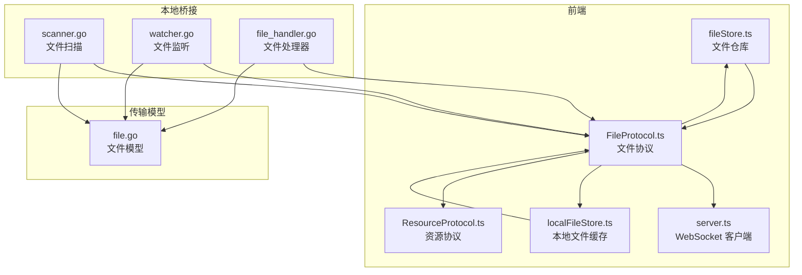
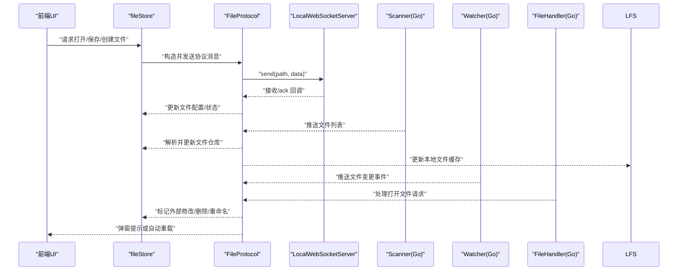
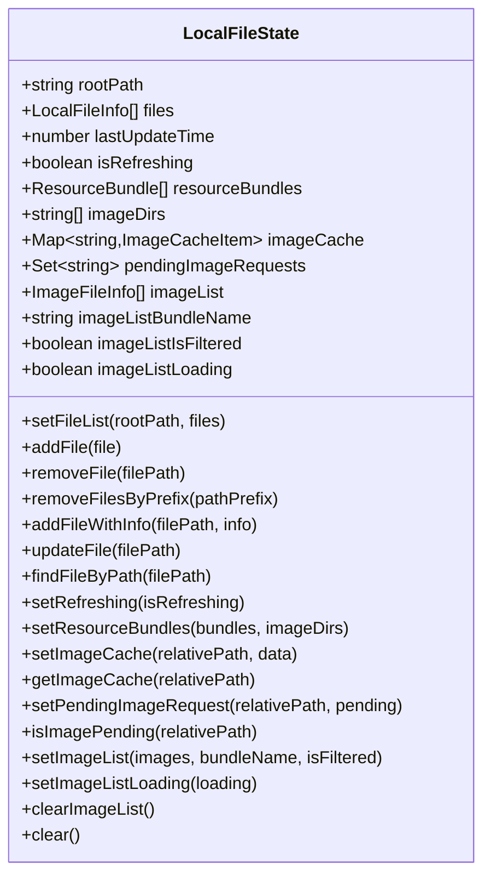
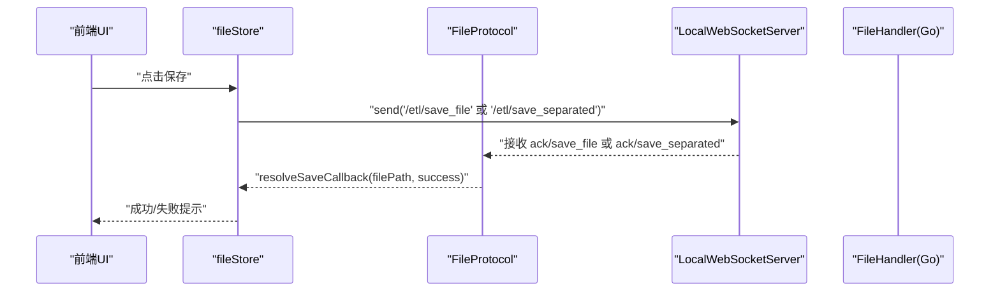
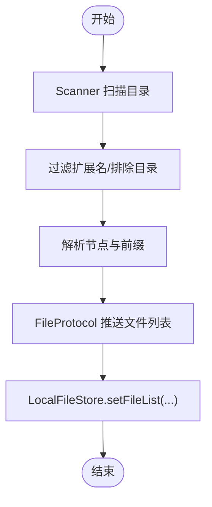
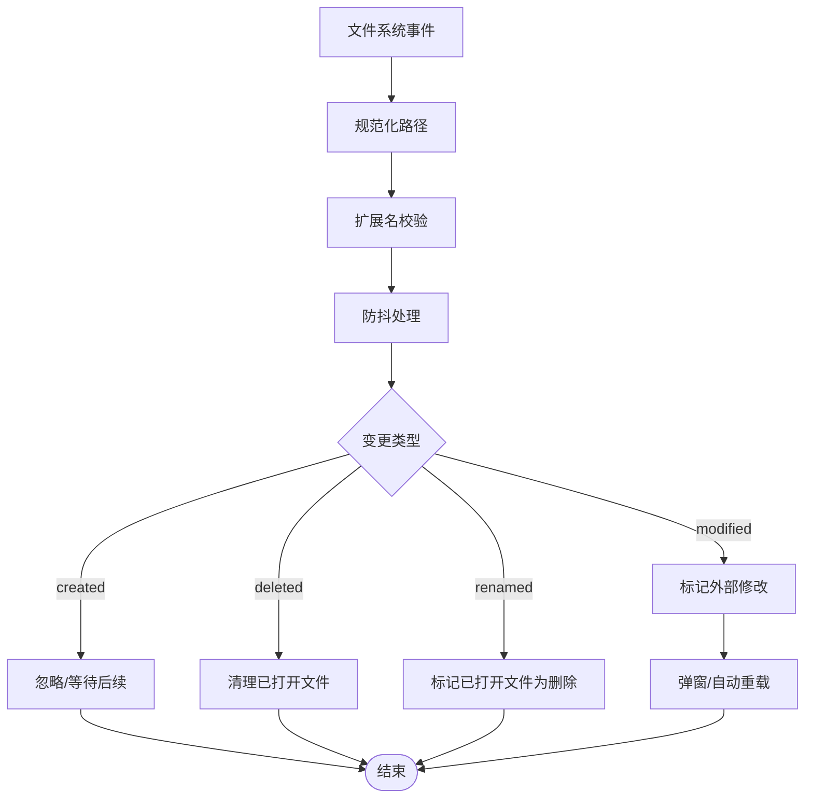
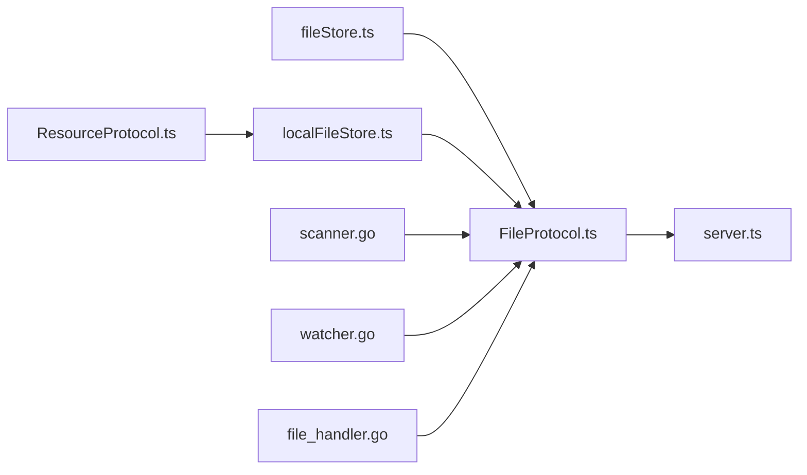

# 文件状态管理

<cite>
**本文档引用的文件**
- [localFileStore.ts](file://src/stores/localFileStore.ts)
- [fileStore.ts](file://src/stores/fileStore.ts)
- [FileProtocol.ts](file://src/services/protocols/FileProtocol.ts)
- [server.ts](file://src/services/server.ts)
- [scanner.go](file://LocalBridge/internal/service/file/scanner.go)
- [watcher.go](file://LocalBridge/internal/service/file/watcher.go)
- [file.go](file://LocalBridge/pkg/models/file.go)
- [folderFilter.ts](file://src/utils/file/folderFilter.ts)
- [ResourceProtocol.ts](file://src/services/protocols/ResourceProtocol.ts)
- [crossFileService.ts](file://src/services/crossFileService.ts)
- [file_handler.go](file://LocalBridge/internal/protocol/file/file_handler.go)
</cite>

## 更新摘要
**变更内容**
- 更新了文件名提取机制的实现细节，从 LocalBridge 系统打开文件时自动提取真实文件名而非使用占位符
- 补充了文件名提取的前后端协作机制说明
- 增强了文件状态跟踪与同步的准确性描述

## 目录
1. [引言](#引言)
2. [项目结构](#项目结构)
3. [核心组件](#核心组件)
4. [架构总览](#架构总览)
5. [详细组件分析](#详细组件分析)
6. [依赖分析](#依赖分析)
7. [性能考虑](#性能考虑)
8. [故障排查指南](#故障排查指南)
9. [结论](#结论)
10. [附录](#附录)

## 引言
本文件围绕"文件状态管理"展开，重点解释 File Store 与 LocalFileStore 的设计目的与状态结构，梳理文件列表的存储与管理机制，阐述当前文件状态的跟踪与同步策略，说明文件操作的事务性与一致性保障，介绍文件监控与热重载的实现机制，并提供文件状态扩展与自定义文件类型的实践指导，最后给出文件缓存与性能优化策略。

## 项目结构
文件状态管理涉及三层：
- 前端状态层：负责 UI 层面的文件与节点状态管理，以及与后端协议交互。
- 本地桥接层：负责扫描、监听与文件系统事件处理。
- 传输模型层：定义前后端传递的文件与资源数据结构。

**图表来源**
- [fileStore.ts:1-942](file://src/stores/fileStore.ts#L1-L942)
- [localFileStore.ts:1-339](file://src/stores/localFileStore.ts#L1-L339)
- [FileProtocol.ts:1-581](file://src/services/protocols/FileProtocol.ts#L1-L581)
- [server.ts:1-388](file://src/services/server.ts#L1-L388)
- [scanner.go:1-301](file://LocalBridge/internal/service/file/scanner.go#L1-L301)
- [watcher.go:1-261](file://LocalBridge/internal/service/file/watcher.go#L1-L261)
- [file_handler.go:1-358](file://LocalBridge/internal/protocol/file/file_handler.go#L1-L358)
- [file.go:1-30](file://LocalBridge/pkg/models/file.go#L1-L30)

**章节来源**
- [fileStore.ts:1-942](file://src/stores/fileStore.ts#L1-L942)
- [localFileStore.ts:1-339](file://src/stores/localFileStore.ts#L1-L339)
- [FileProtocol.ts:1-581](file://src/services/protocols/FileProtocol.ts#L1-L581)
- [server.ts:1-388](file://src/services/server.ts#L1-L388)
- [scanner.go:1-301](file://LocalBridge/internal/service/file/scanner.go#L1-L301)
- [watcher.go:1-261](file://LocalBridge/internal/service/file/watcher.go#L1-L261)
- [file_handler.go:1-358](file://LocalBridge/internal/protocol/file/file_handler.go#L1-L358)
- [file.go:1-30](file://LocalBridge/pkg/models/file.go#L1-L30)

## 核心组件
- LocalFileStore：前端本地文件缓存，承载从 LocalBridge 推送的文件列表与资源包信息，不进行 localStorage 持久化，始终从后端实时获取。
- FileStore：前端文件仓库，管理当前打开的文件集合、文件配置、节点与边的状态，负责与后端协议交互以执行打开、保存、创建等操作。
- FileProtocol：文件协议处理器，注册并处理文件列表、文件内容、文件变更、保存确认等消息，协调前端状态与后端行为。
- LocalWebSocketServer：前端 WebSocket 客户端，负责与本地服务建立连接、握手校验、消息路由与状态通知。
- Scanner：Go 侧文件扫描器，递归扫描目录，过滤扩展名，解析节点与前缀，生成文件信息。
- Watcher：Go 侧文件监听器，基于 fsnotify 监听文件系统事件，支持防抖与目录递增监听。
- ResourceProtocol：资源协议处理器，负责图片资源的拉取、缓存与批量推送。
- folderFilter 工具：提供基于文件夹路径的过滤能力，便于筛选本地文件列表。

**章节来源**
- [localFileStore.ts:58-123](file://src/stores/localFileStore.ts#L58-L123)
- [fileStore.ts:346-375](file://src/stores/fileStore.ts#L346-L375)
- [FileProtocol.ts:16-68](file://src/services/protocols/FileProtocol.ts#L16-L68)
- [server.ts:22-343](file://src/services/server.ts#L22-L343)
- [scanner.go:20-48](file://LocalBridge/internal/service/file/scanner.go#L20-L48)
- [watcher.go:34-41](file://LocalBridge/internal/service/file/watcher.go#L34-L41)
- [ResourceProtocol.ts:95-143](file://src/services/protocols/ResourceProtocol.ts#L95-L143)
- [folderFilter.ts:1-45](file://src/utils/file/folderFilter.ts#L1-L45)

## 架构总览
文件状态管理采用"前端状态 + 本地桥接 + 协议驱动"的分层架构：
- 前端通过 WebSocket 与本地服务通信，协议负责消息路由与状态同步。
- LocalBridge 承担文件扫描与监听职责，将文件元数据与系统事件推送到前端。
- 前端状态层维护文件列表、打开文件、节点/边状态与资源缓存，确保 UI 与后端保持一致。

**图表来源**
- [FileProtocol.ts:44-67](file://src/services/protocols/FileProtocol.ts#L44-L67)
- [server.ts:290-304](file://src/services/server.ts#L290-L304)
- [scanner.go:58-147](file://LocalBridge/internal/service/file/scanner.go#L58-L147)
- [watcher.go:94-191](file://LocalBridge/internal/service/file/watcher.go#L94-L191)
- [file_handler.go:66-137](file://LocalBridge/internal/protocol/file/file_handler.go#L66-L137)
- [fileStore.ts:573-661](file://src/stores/fileStore.ts#L573-L661)
- [localFileStore.ts:148-156](file://src/stores/localFileStore.ts#L148-L156)

## 详细组件分析

### LocalFileStore 设计与状态结构
- 设计目的：作为前端本地文件缓存，承载来自 LocalBridge 的文件列表与资源包信息，避免与后端耦合，提升 UI 响应速度与稳定性。
- 关键状态：
  - rootPath、files、lastUpdateTime、isRefreshing：根目录、文件列表、最后更新时间、刷新状态。
  - resourceBundles、imageDirs：资源包与 image 目录集合。
  - imageCache、pendingImageRequests：图片缓存与正在请求的图片集合。
  - imageList、imageListBundleName、imageListIsFiltered、imageListLoading：图片列表及其过滤与加载状态。
- 核心方法：
  - setFileList、addFile、removeFile、removeFilesByPrefix、addFileWithInfo、updateFile、findFileByPath、setRefreshing。
  - setResourceBundles、setImageCache、getImageCache、setPendingImageRequest、isImagePending、setImageList、setImageListLoading、clearImageList、clear。

**图表来源**
- [localFileStore.ts:58-123](file://src/stores/localFileStore.ts#L58-L123)

**章节来源**
- [localFileStore.ts:58-339](file://src/stores/localFileStore.ts#L58-L339)

### FileStore 文件仓库与事务性
- 文件仓库职责：维护 files 数组与 currentFile，提供文件名切换、拖拽排序、本地存储、打开/保存/创建文件等能力。
- 事务性与一致性：
  - 打开文件：解析内容、合并配置、同步到 flowStore 并更新 fileStore，确保 UI 与状态一致。
  - 保存文件：根据配置模式（合并/分离）生成字符串，发送保存请求并等待 ACK，超时或失败时回滚提示。
  - 创建文件：请求后端创建，成功后更新当前文件路径与配置时间戳。
  - 外部修改检测：当文件被外部修改且已打开，标记 isModifiedExternally 并弹窗提示或自动重载。
- 节点顺序与视口：维护节点顺序映射与 savedViewport，确保切换文件时恢复视图。

**更新** 文件名提取机制改进：从 LocalBridge 系统打开文件时，FileStore 会从文件路径中自动提取真实文件名（去除 .json/.jsonc 扩展名），替代之前的占位符处理方式，确保文件显示名称与实际文件名一致。

**图表来源**
- [fileStore.ts:663-800](file://src/stores/fileStore.ts#L663-L800)
- [FileProtocol.ts:237-289](file://src/services/protocols/FileProtocol.ts#L237-L289)
- [server.ts:290-304](file://src/services/server.ts#L290-L304)
- [file_handler.go:66-137](file://LocalBridge/internal/protocol/file/file_handler.go#L66-L137)

**章节来源**
- [fileStore.ts:346-571](file://src/stores/fileStore.ts#L346-L571)
- [fileStore.ts:573-661](file://src/stores/fileStore.ts#L573-L661)
- [fileStore.ts:663-800](file://src/stores/fileStore.ts#L663-L800)
- [FileProtocol.ts:237-332](file://src/services/protocols/FileProtocol.ts#L237-L332)

### 文件列表存储与管理机制
- 来源与格式：Scanner 递归扫描目录，过滤扩展名，解析节点与前缀，输出 File 列表；FileProtocol 接收后转换为 LocalFileInfo[] 并写入 LocalFileStore。
- 增量与全量：支持全量 setFileList 与增量 add/remove，removeFilesByPrefix 用于目录删除场景。
- 资源包与图片：LocalFileStore 维护 resourceBundles 与 imageDirs，配合 ResourceProtocol 实现图片缓存与批量推送。

**图表来源**
- [scanner.go:58-147](file://LocalBridge/internal/service/file/scanner.go#L58-L147)
- [FileProtocol.ts:78-103](file://src/services/protocols/FileProtocol.ts#L78-L103)
- [localFileStore.ts:148-156](file://src/stores/localFileStore.ts#L148-L156)

**章节来源**
- [scanner.go:20-48](file://LocalBridge/internal/service/file/scanner.go#L20-L48)
- [scanner.go:58-147](file://LocalBridge/internal/service/file/scanner.go#L58-L147)
- [file.go:10-29](file://LocalBridge/pkg/models/file.go#L10-L29)
- [FileProtocol.ts:78-103](file://src/services/protocols/FileProtocol.ts#L78-L103)
- [localFileStore.ts:148-156](file://src/stores/localFileStore.ts#L148-L156)

### 文件监控与热重载
- 监控实现：Watcher 基于 fsnotify 递归监听目录，新增目录自动加入监听；事件通过防抖器聚合，避免频繁触发。
- 变更处理：FileProtocol 根据变更类型（创建/修改/删除/重命名）更新 LocalFileStore 与 fileStore，对外部修改的文件弹窗提示或自动重载。
- 自动重载：用户可开启自动重载，FileProtocol 在检测到外部修改时直接请求重新加载当前文件或首个变更文件。

**图表来源**
- [watcher.go:113-191](file://LocalBridge/internal/service/file/watcher.go#L113-L191)
- [FileProtocol.ts:147-231](file://src/services/protocols/FileProtocol.ts#L147-L231)

**章节来源**
- [watcher.go:62-92](file://LocalBridge/internal/service/file/watcher.go#L62-L92)
- [watcher.go:113-191](file://LocalBridge/internal/service/file/watcher.go#L113-L191)
- [FileProtocol.ts:147-231](file://src/services/protocols/FileProtocol.ts#L147-L231)
- [FileProtocol.ts:408-431](file://src/services/protocols/FileProtocol.ts#L408-L431)
- [FileProtocol.ts:436-511](file://src/services/protocols/FileProtocol.ts#L436-L511)

### 文件状态跟踪与同步
- 跟踪维度：文件路径、文件名、相对路径、节点列表、前缀、最后修改时间、打开状态、外部修改标记、保存视图等。
- 同步策略：
  - 文件列表：全量替换 setFileList，确保与后端扫描结果一致。
  - 文件内容：openFileFromLocal 解析并合并配置，同步到 flowStore 与 fileStore。
  - 保存确认：waitForSaveAck 使用超时与回调队列，保证保存事务的最终一致性。
  - 外部修改：通过 file_changed 事件与 isModifiedExternally 标记，结合用户选择自动重载。
- **更新** 文件名提取：从 LocalBridge 系统打开文件时，FileStore 会从文件路径中自动提取真实文件名（去除 .json/.jsonc 扩展名），确保文件显示名称与实际文件名一致，替代之前的占位符处理方式。

**章节来源**
- [localFileStore.ts:148-156](file://src/stores/localFileStore.ts#L148-L156)
- [fileStore.ts:573-661](file://src/stores/fileStore.ts#L573-L661)
- [fileStore.ts:587-592](file://src/stores/fileStore.ts#L587-L592)
- [FileProtocol.ts:237-289](file://src/services/protocols/FileProtocol.ts#L237-L289)
- [FileProtocol.ts:414-431](file://src/services/protocols/FileProtocol.ts#L414-L431)

### 文件缓存与性能优化
- 图片缓存：ResourceProtocol 接收图片数据，填充 ImageCacheItem 并写入 LocalFileStore.imageCache；模板预览组件按需渲染，避免重复请求。
- 防抖与批处理：Watcher 使用防抖器降低事件风暴；FileProtocol 在保存时等待 ACK，避免并发写入冲突。
- 本地存储：fileStore.localSave 将文件状态序列化到 localStorage，注意配额限制与错误提示。
- 过滤与懒加载：folderFilter 提供基于文件夹路径的过滤，减少 UI 渲染压力；图片请求 pending 状态避免重复并发。

**章节来源**
- [ResourceProtocol.ts:95-143](file://src/services/protocols/ResourceProtocol.ts#L95-L143)
- [localFileStore.ts:259-294](file://src/stores/localFileStore.ts#L259-L294)
- [fileStore.ts:234-273](file://src/stores/fileStore.ts#L234-L273)
- [folderFilter.ts:23-45](file://src/utils/file/folderFilter.ts#L23-L45)
- [watcher.go:204-235](file://LocalBridge/internal/service/file/watcher.go#L204-L235)

### 文件状态扩展与自定义文件类型
- 扩展扫描范围：在 Scanner 中调整 extensions 与 exclude 列表，控制扫描的文件类型与排除目录。
- 扩展节点解析：在 Scanner 的 parseFileNodes 中扩展对节点与锚点的提取逻辑，以适配自定义文件结构。
- 扩展协议处理：在 FileProtocol 中增加新的路由与处理函数，以支持自定义文件类型的消息协议。
- 扩展 UI 适配：在 fileStore 中扩展打开/保存逻辑，确保自定义文件类型能正确解析与序列化。

**章节来源**
- [scanner.go:159-174](file://LocalBridge/internal/service/file/scanner.go#L159-L174)
- [scanner.go:212-254](file://LocalBridge/internal/service/file/scanner.go#L212-L254)
- [FileProtocol.ts:44-67](file://src/services/protocols/FileProtocol.ts#L44-L67)

## 依赖分析
- 组件耦合：
  - fileStore 依赖 FileProtocol 与 server.ts，负责文件操作与状态同步。
  - LocalFileStore 仅依赖 FileProtocol，不持久化，确保与后端一致。
  - Scanner/Watcher 与 FileProtocol 通过消息路由解耦，遵循单一职责。
- 外部依赖：
  - WebSocket 用于前后端通信，server.ts 提供连接管理与路由注册。
  - fsnotify 用于文件系统事件监听，Watcher 封装事件处理与防抖。

**图表来源**
- [fileStore.ts:1-25](file://src/stores/fileStore.ts#L1-L25)
- [localFileStore.ts:1-10](file://src/stores/localFileStore.ts#L1-L10)
- [FileProtocol.ts:1-11](file://src/services/protocols/FileProtocol.ts#L1-L11)
- [server.ts:1-18](file://src/services/server.ts#L1-L18)
- [scanner.go:1-12](file://LocalBridge/internal/service/file/scanner.go#L1-L12)
- [watcher.go:1-11](file://LocalBridge/internal/service/file/watcher.go#L1-L11)
- [file_handler.go:1-11](file://LocalBridge/internal/protocol/file/file_handler.go#L1-L11)
- [ResourceProtocol.ts:1-17](file://src/services/protocols/ResourceProtocol.ts#L1-L17)

**章节来源**
- [fileStore.ts:1-25](file://src/stores/fileStore.ts#L1-L25)
- [localFileStore.ts:1-10](file://src/stores/localFileStore.ts#L1-L10)
- [FileProtocol.ts:1-11](file://src/services/protocols/FileProtocol.ts#L1-L11)
- [server.ts:1-18](file://src/services/server.ts#L1-L18)
- [scanner.go:1-12](file://LocalBridge/internal/service/file/scanner.go#L1-L12)
- [watcher.go:1-11](file://LocalBridge/internal/service/file/watcher.go#L1-L11)
- [file_handler.go:1-11](file://LocalBridge/internal/protocol/file/file_handler.go#L1-L11)
- [ResourceProtocol.ts:1-17](file://src/services/protocols/ResourceProtocol.ts#L1-L17)

## 性能考虑
- 扫描与监听：
  - Scanner 支持 maxDepth 与 maxFiles 限制，防止大规模目录导致性能问题。
  - Watcher 使用防抖器，降低高频写入事件对 UI 的影响。
- 状态更新：
  - LocalFileStore 使用不可变更新与最小化 set，减少不必要的重渲染。
  - FileStore 在保存前进行节点名重复校验，避免无效写入。
- 缓存与懒加载：
  - 图片缓存与 pending 状态避免重复请求与竞态。
  - 模板预览按需渲染，控制图片尺寸与最小尺寸，提升渲染效率。

## 故障排查指南
- 连接问题：
  - 检查 server.ts 的连接状态与握手版本，确认协议版本匹配。
  - 若连接超时或失败，查看通知与日志，确认本地服务是否启动。
- 文件列表异常：
  - 确认 Scanner 的扩展名过滤与排除规则是否符合预期。
  - 检查 FileProtocol.handleFileList 的参数与返回值。
- 外部修改未生效：
  - 确认 Watcher 是否正常监听目录，防抖是否过长。
  - 检查 FileProtocol.handleFileChanged 的变更类型与路径。
- 保存失败：
  - 等待 waitForSaveAck 超时或 ACK 返回失败，查看控制台日志与消息提示。
  - 检查 fileStore.saveFlow 与 saveFileToLocal 的前置条件（如节点名重复）。
- **更新** 文件名显示异常：
  - 检查 FileStore.openFileFromLocal 中的文件名提取逻辑，确认路径解析是否正确。
  - 确认 LocalBridge 的 file_handler 是否正确处理文件路径并移除扩展名。

**章节来源**
- [server.ts:108-255](file://src/services/server.ts#L108-L255)
- [scanner.go:58-147](file://LocalBridge/internal/service/file/scanner.go#L58-L147)
- [watcher.go:113-191](file://LocalBridge/internal/service/file/watcher.go#L113-L191)
- [FileProtocol.ts:237-289](file://src/services/protocols/FileProtocol.ts#L237-L289)
- [fileStore.ts:688-699](file://src/stores/fileStore.ts#L688-L699)
- [fileStore.ts:587-592](file://src/stores/fileStore.ts#L587-L592)

## 结论
本文档系统梳理了文件状态管理的架构与实现细节，明确了 LocalFileStore 与 FileStore 的职责边界，解释了文件列表的存储与管理机制、文件监控与热重载流程、事务性与一致性保障策略，并提供了扩展与优化建议。通过 Scanner/Watcher 与协议层的协同，前端实现了高效、稳定的文件状态管理能力。最新的文件名提取改进进一步提升了用户体验，确保文件显示名称与实际文件名保持一致。

## 附录
- 相关工具与接口：
  - folderFilter：基于文件夹路径的过滤工具，便于筛选本地文件列表。
  - crossFileService：跨文件导航与等待加载的辅助服务，确保文件切换与节点加载的稳定性。

**章节来源**
- [folderFilter.ts:1-45](file://src/utils/file/folderFilter.ts#L1-L45)
- [crossFileService.ts:463-504](file://src/services/crossFileService.ts#L463-L504)