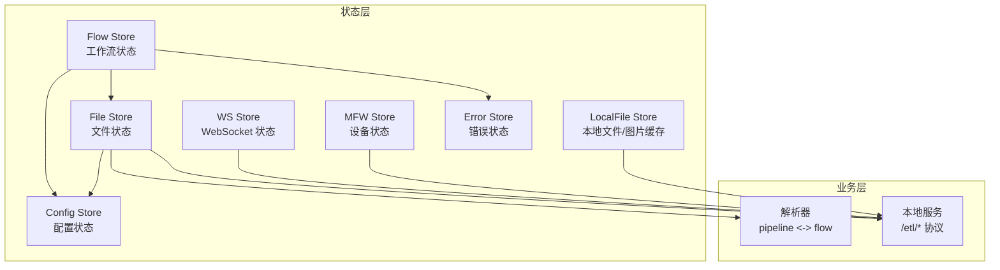
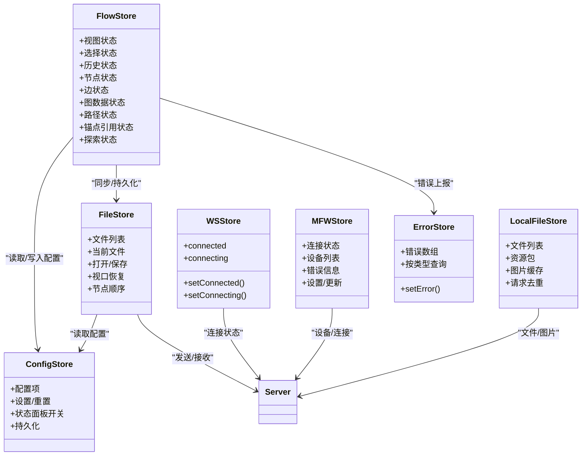
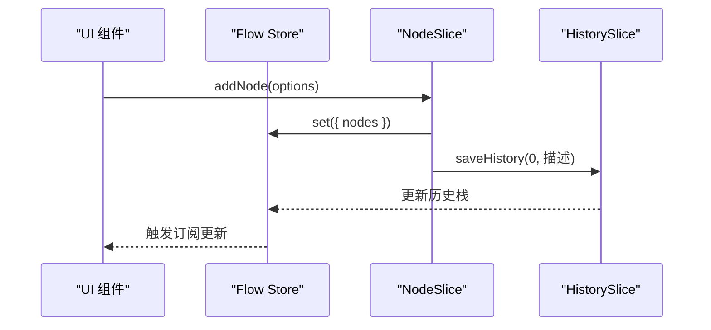
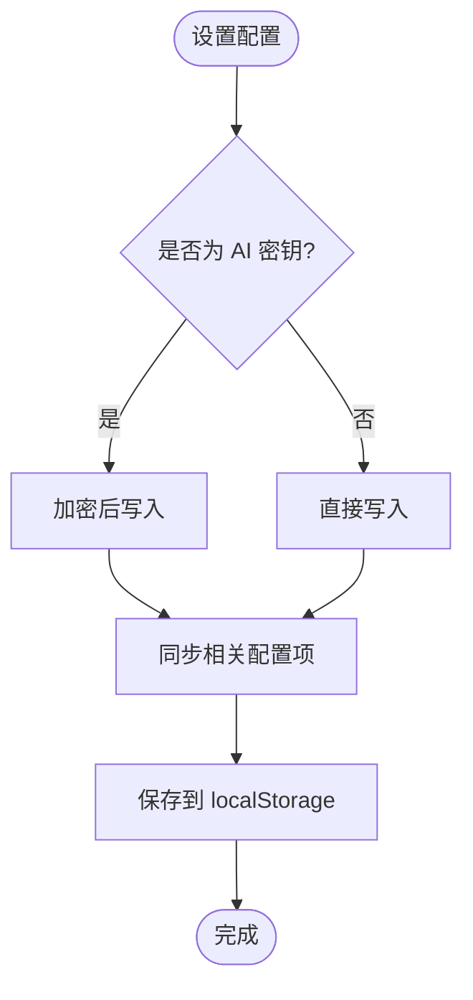
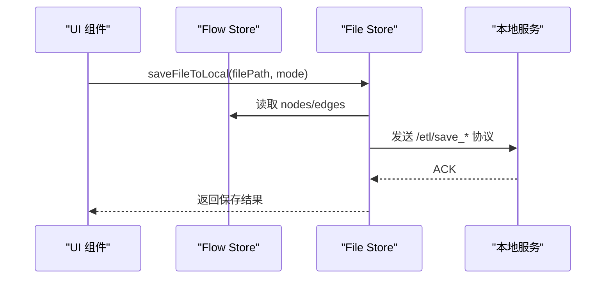
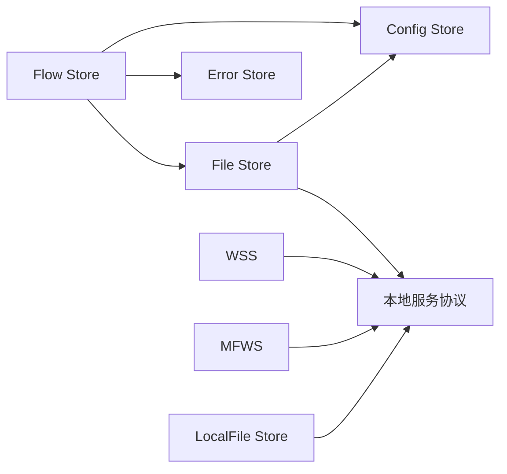

# 状态管理系统

<cite>
**本文档引用的文件**
- [src/stores/flow/index.ts](file://src/stores/flow/index.ts)
- [src/stores/flow/types.ts](file://src/stores/flow/types.ts)
- [src/stores/flow/slices/viewSlice.ts](file://src/stores/flow/slices/viewSlice.ts)
- [src/stores/flow/slices/selectionSlice.ts](file://src/stores/flow/slices/selectionSlice.ts)
- [src/stores/flow/slices/historySlice.ts](file://src/stores/flow/slices/historySlice.ts)
- [src/stores/flow/slices/nodeSlice.ts](file://src/stores/flow/slices/nodeSlice.ts)
- [src/stores/flow/slices/edgeSlice.ts](file://src/stores/flow/slices/edgeSlice.ts)
- [src/stores/flow/slices/graphSlice.ts](file://src/stores/flow/slices/graphSlice.ts)
- [src/stores/flow/slices/pathSlice.ts](file://src/stores/flow/slices/pathSlice.ts)
- [src/stores/configStore.ts](file://src/stores/configStore.ts)
- [src/stores/fileStore.ts](file://src/stores/fileStore.ts)
- [src/stores/wsStore.ts](file://src/stores/wsStore.ts)
- [src/stores/mfwStore.ts](file://src/stores/mfwStore.ts)
- [src/stores/errorStore.ts](file://src/stores/errorStore.ts)
- [src/stores/localFileStore.ts](file://src/stores/localFileStore.ts)
</cite>

## 目录
1. [简介](#简介)
2. [项目结构](#项目结构)
3. [核心组件](#核心组件)
4. [架构总览](#架构总览)
5. [详细组件分析](#详细组件分析)
6. [依赖关系分析](#依赖关系分析)
7. [性能考虑](#性能考虑)
8. [故障排查指南](#故障排查指南)
9. [结论](#结论)
10. [附录](#附录)

## 简介
本项目采用 Zustand 作为前端状态管理核心，围绕“工作流编辑器”场景构建了完整的状态体系。系统通过 Store 抽象出 Flow Store（工作流）、Config Store（配置）、File Store（文件与持久化）、WS Store（WebSocket 连接状态）、MFW Store（设备与连接状态）等模块，并以 Slice 为单位组合形成大型 Store，实现细粒度的状态更新与订阅。

Zustand 的优势在于其极简 API、自然的订阅模型以及对 TypeScript 的良好支持，使得状态逻辑与 UI 层解耦清晰，便于维护与扩展。

## 项目结构
状态管理相关代码主要位于 src/stores 目录，按功能划分为：
- flow：工作流编辑器状态，包含视图、选择、历史、节点、边、图数据、路径、锚点引用、探索模式等 Slice
- config：全局配置与持久化
- file：文件仓库与本地/远程保存
- ws：WebSocket 连接状态
- mfw：设备与连接状态
- localFile：本地文件与图片缓存
- error：错误聚合与展示
- 其他：剪贴板、面板占用、工具类 Store 等

图表来源
- [src/stores/flow/index.ts:18-28](file://src/stores/flow/index.ts#L18-L28)
- [src/stores/configStore.ts:270-413](file://src/stores/configStore.ts#L270-L413)
- [src/stores/fileStore.ts:376-571](file://src/stores/fileStore.ts#L376-L571)
- [src/stores/wsStore.ts:18-23](file://src/stores/wsStore.ts#L18-L23)
- [src/stores/mfwStore.ts:132-194](file://src/stores/mfwStore.ts#L132-L194)
- [src/stores/localFileStore.ts:130-338](file://src/stores/localFileStore.ts#L130-L338)

章节来源
- [src/stores/flow/index.ts:1-124](file://src/stores/flow/index.ts#L1-L124)
- [src/stores/configStore.ts:1-440](file://src/stores/configStore.ts#L1-L440)
- [src/stores/fileStore.ts:1-933](file://src/stores/fileStore.ts#L1-L933)
- [src/stores/wsStore.ts:1-24](file://src/stores/wsStore.ts#L1-L24)
- [src/stores/mfwStore.ts:1-195](file://src/stores/mfwStore.ts#L1-L195)
- [src/stores/localFileStore.ts:1-339](file://src/stores/localFileStore.ts#L1-L339)

## 核心组件
- Flow Store：以 Slice 组合的工作流状态，涵盖视图、选择、历史、节点、边、图数据、路径、锚点引用、探索模式等，统一对外暴露类型与工具函数
- Config Store：集中管理 UI 行为、导出策略、网络端口、AI 配置等，支持加密存储敏感字段、分类映射与默认值
- File Store：文件仓库、本地/远程保存、视口恢复、节点顺序管理、与解析器协作
- WS Store：WebSocket 连接状态机，用于 UI 层反馈连接状态
- MFW Store：设备发现与连接状态，提供设备列表与错误信息
- LocalFile Store：本地文件与图片缓存，支持增量更新与图片请求去重
- Error Store：错误聚合与按类型查询

章节来源
- [src/stores/flow/types.ts:429-439](file://src/stores/flow/types.ts#L429-L439)
- [src/stores/configStore.ts:179-268](file://src/stores/configStore.ts#L179-L268)
- [src/stores/fileStore.ts:346-375](file://src/stores/fileStore.ts#L346-L375)
- [src/stores/wsStore.ts:7-16](file://src/stores/wsStore.ts#L7-L16)
- [src/stores/mfwStore.ts:100-127](file://src/stores/mfwStore.ts#L100-L127)
- [src/stores/localFileStore.ts:61-123](file://src/stores/localFileStore.ts#L61-L123)
- [src/stores/errorStore.ts:17-23](file://src/stores/errorStore.ts#L17-L23)

## 架构总览
Zustand Store 通过 create(...) 构造，内部以多个 Slice 组合而成，每个 Slice 负责特定领域状态与行为。Flow Store 是最大的聚合 Store，其他 Store 相对独立但通过工具函数相互调用（如 Flow Store 调用 Config Store、File Store 进行持久化）。

图表来源
- [src/stores/flow/index.ts:18-28](file://src/stores/flow/index.ts#L18-L28)
- [src/stores/configStore.ts:270-413](file://src/stores/configStore.ts#L270-L413)
- [src/stores/fileStore.ts:376-571](file://src/stores/fileStore.ts#L376-L571)
- [src/stores/wsStore.ts:18-23](file://src/stores/wsStore.ts#L18-L23)
- [src/stores/mfwStore.ts:132-194](file://src/stores/mfwStore.ts#L132-L194)
- [src/stores/localFileStore.ts:130-338](file://src/stores/localFileStore.ts#L130-L338)
- [src/stores/errorStore.ts:24-38](file://src/stores/errorStore.ts#L24-L38)

## 详细组件分析

### Flow Store：工作流状态
- 组合方式：通过 create(...) 将 view、selection、history、node、edge、graph、path、anchorRef、exploration 等 Slice 合并为单一 Store
- 关键能力：
  - 视图：实例、视口、画布尺寸
  - 选择：节点/边选择、目标节点、防抖选择
  - 历史：快照序列、撤销/重做、初始化与清理
  - 节点：增删改、分组/解组、顺序分配、参数校验
  - 边：增删改、顺序调整、冲突检测
  - 图数据：替换、粘贴、位移、聚焦
  - 路径：起点/终点、DFS 遍历、可达路径收集
  - 锚点引用：索引重建、高亮、引用查询
  - 探索：状态机、进度、执行/确认/下一步
- 工具函数：节点名重复检查、next 节点查询、坐标转换、视口适配

图表来源
- [src/stores/flow/slices/nodeSlice.ts:139-308](file://src/stores/flow/slices/nodeSlice.ts#L139-L308)
- [src/stores/flow/slices/historySlice.ts:54-122](file://src/stores/flow/slices/historySlice.ts#L54-L122)

章节来源
- [src/stores/flow/index.ts:18-28](file://src/stores/flow/index.ts#L18-L28)
- [src/stores/flow/types.ts:239-439](file://src/stores/flow/types.ts#L239-L439)
- [src/stores/flow/slices/viewSlice.ts:5-27](file://src/stores/flow/slices/viewSlice.ts#L5-L27)
- [src/stores/flow/slices/selectionSlice.ts:13-111](file://src/stores/flow/slices/selectionSlice.ts#L13-L111)
- [src/stores/flow/slices/historySlice.ts:41-243](file://src/stores/flow/slices/historySlice.ts#L41-L243)
- [src/stores/flow/slices/nodeSlice.ts:36-717](file://src/stores/flow/slices/nodeSlice.ts#L36-L717)
- [src/stores/flow/slices/edgeSlice.ts:16-237](file://src/stores/flow/slices/edgeSlice.ts#L16-L237)
- [src/stores/flow/slices/graphSlice.ts:15-309](file://src/stores/flow/slices/graphSlice.ts#L15-L309)
- [src/stores/flow/slices/pathSlice.ts:89-158](file://src/stores/flow/slices/pathSlice.ts#L89-L158)

### Config Store：配置与持久化
- 配置分类与映射：导出、节点、连接、画布、组件、本地服务、AI、管理等
- 默认值与重置：提供只读默认配置，支持逐项重置与全部重置
- 加密存储：AI 密钥加密存储，导入时自动迁移明文为加密格式
- 已配置追踪：记录用户显式设置过的键，支持批量导入时标记
- 状态面板：控制右侧面板显示、宽度等 UI 状态
- 持久化：localStorage 缓存配置与已配置键，应用启动时恢复

图表来源
- [src/stores/configStore.ts:270-413](file://src/stores/configStore.ts#L270-L413)
- [src/stores/configStore.ts:415-439](file://src/stores/configStore.ts#L415-L439)

章节来源
- [src/stores/configStore.ts:1-440](file://src/stores/configStore.ts#L1-L440)

### File Store：文件仓库与持久化
- 文件仓库：files 数组 + currentFile，支持切换、增删、拖拽排序
- 本地持久化：localStorage 缓存所有文件与视口，应用启动时恢复
- 与 Flow Store 同步：保存时将 Flow Store 的 nodes/edges 同步到 File Store
- 与本地服务交互：通过本地 WebSocket 发送 /etl/* 协议进行打开/保存/分离保存
- 节点顺序：基于 nodeOrderMap 与 nextOrderNumber 维护节点顺序
- 视口恢复：切换文件时保存当前视口，打开文件时恢复视口

图表来源
- [src/stores/fileStore.ts:664-800](file://src/stores/fileStore.ts#L664-L800)
- [src/stores/fileStore.ts:92-130](file://src/stores/fileStore.ts#L92-L130)

章节来源
- [src/stores/fileStore.ts:1-933](file://src/stores/fileStore.ts#L1-L933)

### WS Store：WebSocket 连接状态
- 状态：connected、connecting
- 方法：setConnected、setConnecting
- 用途：驱动 UI 层连接状态反馈，配合本地服务协议使用

章节来源
- [src/stores/wsStore.ts:1-24](file://src/stores/wsStore.ts#L1-L24)

### MFW Store：设备与连接状态
- 连接状态：disconnected/connecting/connected/failed
- 设备类型：adb/win32/wlroots/playcover/macos/gamepad
- 设备列表：adbDevices、win32Windows、wlrootsCompositors
- 操作：设置连接状态、控制器信息、设备列表更新、错误信息、清理连接

章节来源
- [src/stores/mfwStore.ts:1-195](file://src/stores/mfwStore.ts#L1-L195)

### LocalFile Store：本地文件与图片缓存
- 文件列表：全量/增量更新、按前缀批量删除、根据路径查找
- 资源包：资源包列表与 image 目录集合
- 图片缓存：Map 存储 base64、MIME、尺寸、所属资源包、时间戳
- 请求去重：pendingImageRequests 集合避免重复请求
- 图片列表：当前资源包下的图片列表、过滤状态、加载状态

章节来源
- [src/stores/localFileStore.ts:1-339](file://src/stores/localFileStore.ts#L1-L339)

### Error Store：错误聚合
- 错误类型：节点名重复等
- 查询：按类型筛选错误
- 设置：setError(cb) 支持基于当前错误集合生成新错误列表

章节来源
- [src/stores/errorStore.ts:1-39](file://src/stores/errorStore.ts#L1-L39)

## 依赖关系分析
- Flow Store 依赖 Config Store（读取默认方向、导出配置）、File Store（同步/持久化）、Error Store（错误上报）
- File Store 依赖 Config Store（读取导出策略、JSON 缩进）、Flow Store（保存时同步 nodes/edges）、本地服务协议
- LocalFile Store 与 MFW Store、WS Store 通过本地服务协议交互
- Config Store 与 File Store 之间存在双向依赖（配置影响文件保存策略，文件保存依赖配置）

图表来源
- [src/stores/flow/index.ts:13-15](file://src/stores/flow/index.ts#L13-L15)
- [src/stores/fileStore.ts:8-12](file://src/stores/fileStore.ts#L8-L12)
- [src/stores/configStore.ts:270-413](file://src/stores/configStore.ts#L270-L413)
- [src/stores/wsStore.ts:18-23](file://src/stores/wsStore.ts#L18-L23)
- [src/stores/mfwStore.ts:132-194](file://src/stores/mfwStore.ts#L132-L194)
- [src/stores/localFileStore.ts:130-338](file://src/stores/localFileStore.ts#L130-L338)

章节来源
- [src/stores/flow/index.ts:1-124](file://src/stores/flow/index.ts#L1-L124)
- [src/stores/fileStore.ts:1-933](file://src/stores/fileStore.ts#L1-L933)
- [src/stores/configStore.ts:1-440](file://src/stores/configStore.ts#L1-L440)

## 性能考虑
- 历史记录优化：History Slice 使用快照序列化与差异检测，避免冗余快照；撤销/重做时克隆节点/边并清空选中状态，确保 UI 一致性
- 节点/边更新：applyNodeChanges/applyEdgeChanges 由 React Flow 提供，减少不必要的渲染
- 防抖选择：Selection Slice 对选择事件进行防抖，降低频繁更新带来的开销
- 图片缓存：LocalFile Store 使用 Map 缓存 base64，结合 pendingImageRequests 去重请求
- 结构化克隆降级：History Slice 在支持结构化克隆时优先使用，否则回退到 JSON 方案
- 视口适配：fitFlowView 仅在必要时触发，避免过度重绘

## 故障排查指南
- 节点名重复：Flow Store 调用 checkRepeatNodeLabelList 并通过 Error Store 设置错误类型，保存前会检测重复节点名并阻断保存
- 本地存储配额：File Store 在本地保存失败时检测 QuotaExceededError 并弹出通知
- WebSocket 连接：WS Store 提供连接状态，配合本地服务协议使用；MFW Store 提供设备连接状态与错误信息
- 图片加载异常：LocalFile Store 提供 pendingImageRequests 去重与缓存，避免重复请求与内存膨胀

章节来源
- [src/stores/flow/index.ts:84-104](file://src/stores/flow/index.ts#L84-L104)
- [src/stores/fileStore.ts:256-272](file://src/stores/fileStore.ts#L256-L272)
- [src/stores/wsStore.ts:18-23](file://src/stores/wsStore.ts#L18-L23)
- [src/stores/mfwStore.ts:132-194](file://src/stores/mfwStore.ts#L132-L194)
- [src/stores/localFileStore.ts:278-294](file://src/stores/localFileStore.ts#L278-L294)

## 结论
本项目以 Zustand 为核心，通过 Slice 组合实现了清晰的职责划分与良好的扩展性。Flow Store 负责工作流编辑的核心状态，Config Store 提供统一配置与持久化，File Store 实现文件仓库与本地/远程保存，WS/MFW/LocalFile Store 分别覆盖连接、设备与本地资源管理。整体架构具备良好的模块化、可维护性与可扩展性，适合在复杂工作流编辑场景中持续演进。

## 附录

### 状态同步机制与数据流
- Flow Store 与 File Store：保存时将 Flow Store 的 nodes/edges 同步到 File Store，切换文件时恢复视口与历史
- Config Store 与 File Store：保存时同步配置到 localStorage，启动时恢复配置与已配置键
- 本地服务协议：File Store 通过本地 WebSocket 发送 /etl/* 协议进行打开/保存/分离保存

章节来源
- [src/stores/flow/index.ts:92-130](file://src/stores/flow/index.ts#L92-L130)
- [src/stores/fileStore.ts:234-273](file://src/stores/fileStore.ts#L234-L273)
- [src/stores/configStore.ts:415-439](file://src/stores/configStore.ts#L415-L439)

### 状态订阅与响应式更新
- Zustand 原生订阅：Store 内部 setState 触发订阅者回调，UI 组件通过 hooks 订阅所需状态片段
- 防抖与延迟：Selection Slice 与 History Slice 使用定时器进行防抖与延迟保存，提升交互体验

章节来源
- [src/stores/flow/slices/selectionSlice.ts:13-111](file://src/stores/flow/slices/selectionSlice.ts#L13-L111)
- [src/stores/flow/slices/historySlice.ts:54-122](file://src/stores/flow/slices/historySlice.ts#L54-L122)

### 状态扩展与自定义 Store 实现指导
- 新增 Store：参考现有 Store 的 create(...) 模式，定义状态接口与操作方法
- Slice 设计：将复杂状态拆分为多个 Slice，每个 Slice 职责单一，通过主 Store 组合
- 订阅与副作用：在 Slice 内部处理与 UI 或服务的交互，避免在组件中直接操作 Store
- 类型安全：为 Store 定义明确的类型接口，确保类型推导与 IDE 支持

章节来源
- [src/stores/flow/types.ts:429-439](file://src/stores/flow/types.ts#L429-L439)
- [src/stores/configStore.ts:270-413](file://src/stores/configStore.ts#L270-L413)
- [src/stores/fileStore.ts:376-571](file://src/stores/fileStore.ts#L376-L571)