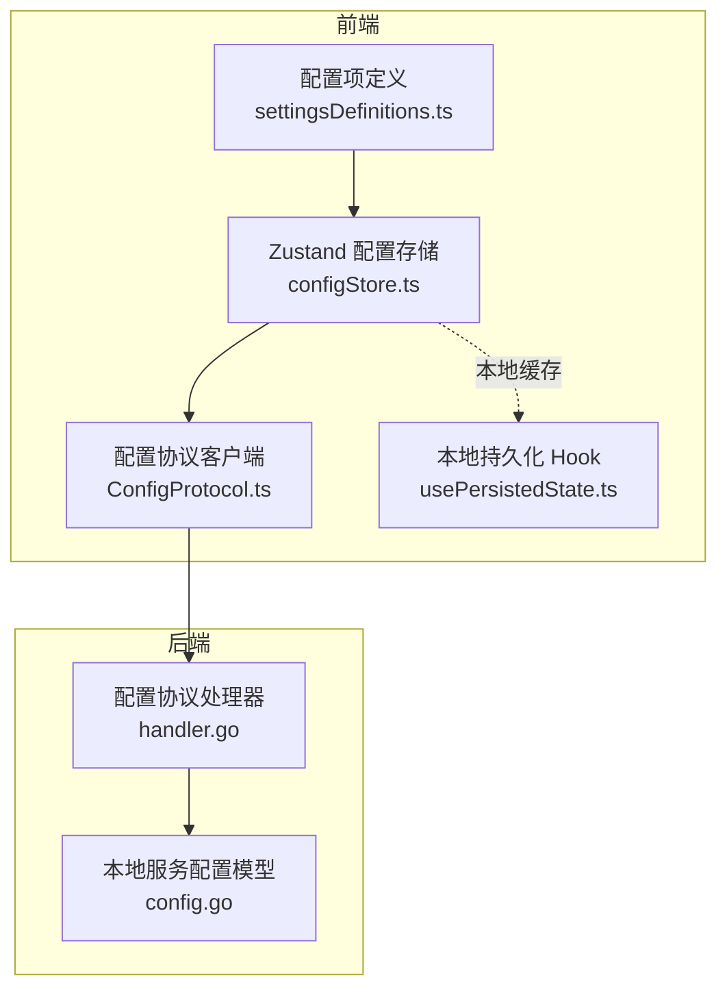
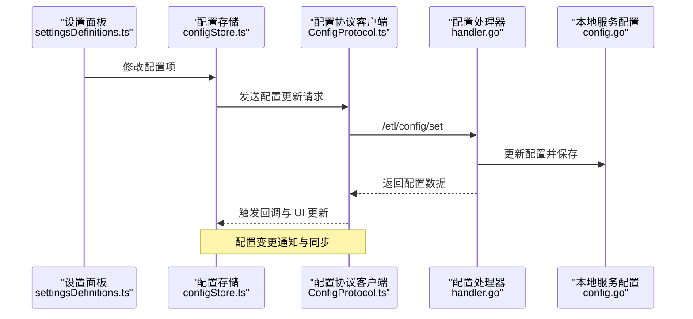
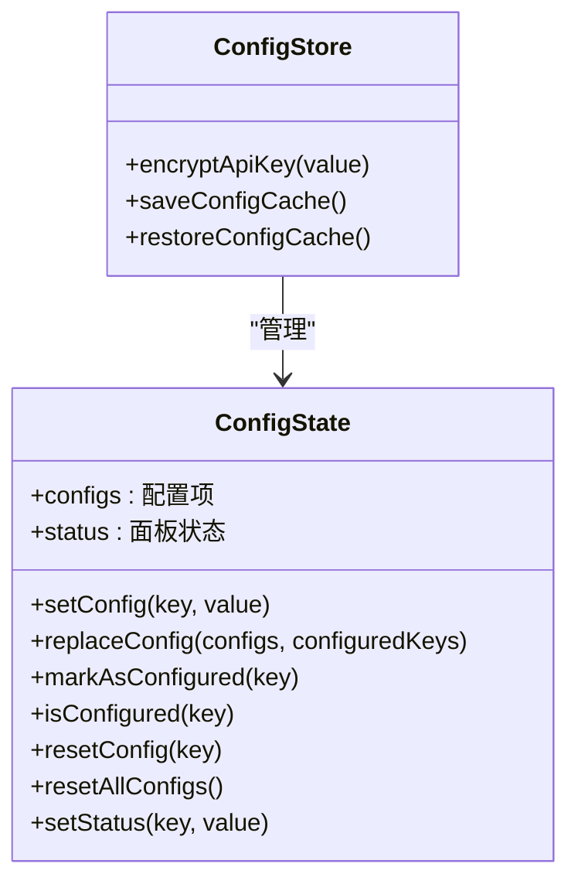
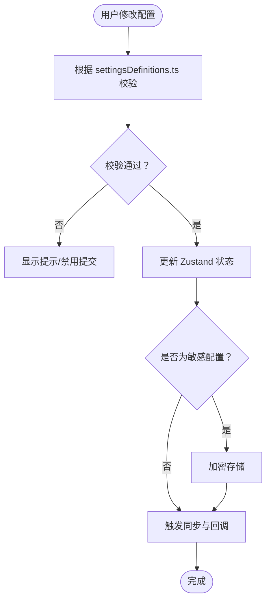
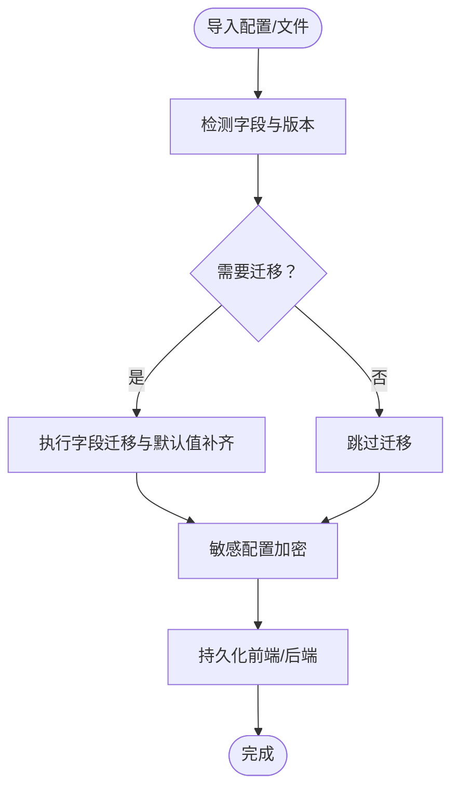
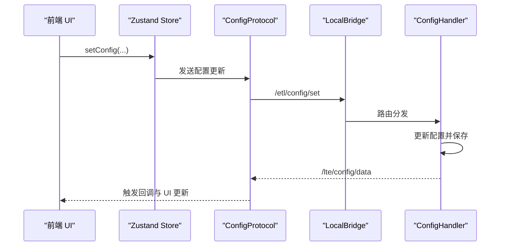
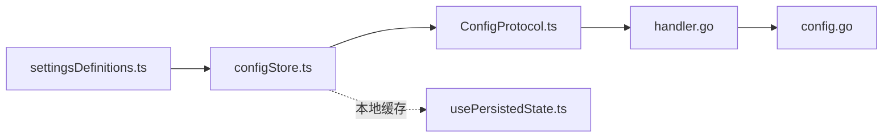

# 配置状态管理

<cite>
**本文档引用的文件**
- [configStore.ts](file://src/stores/configStore.ts)
- [settingsDefinitions.ts](file://src/components/panels/settings/settingsDefinitions.ts)
- [ConfigProtocol.ts](file://src/services/protocols/ConfigProtocol.ts)
- [handler.go](file://LocalBridge/internal/protocol/config/handler.go)
- [config.go](file://LocalBridge/internal/config/config.go)
- [usePersistedState.ts](file://src/hooks/usePersistedState.ts)
- [versionDetector.ts](file://src/core/parser/versionDetector.ts)
- [importer.ts](file://src/core/parser/importer.ts)
- [BackendConfigModal.tsx](file://src/components/modals/BackendConfigModal.tsx)
</cite>

## 目录
1. [简介](#简介)
2. [项目结构](#项目结构)
3. [核心组件](#核心组件)
4. [架构总览](#架构总览)
5. [详细组件分析](#详细组件分析)
6. [依赖分析](#依赖分析)
7. [性能考量](#性能考量)
8. [故障排查指南](#故障排查指南)
9. [结论](#结论)
10. [附录](#附录)

## 简介
本文件系统性阐述本项目的配置状态管理体系，涵盖前端 Zustand 配置存储、后端本地服务配置、配置项定义与验证、持久化与迁移、以及配置变更的通知与同步机制。重点说明：
- Config Store 的设计目的与状态结构
- 应用配置的存储与管理机制
- 用户偏好设置的持久化策略
- 配置项的定义与验证规则
- 配置变更的通知与同步机制
- 配置扩展与新增配置项的实现指导
- 配置迁移与版本兼容性的处理方法

## 项目结构
本项目在前端采用 Zustand 管理应用配置状态，在后端通过 LocalBridge 提供本地服务配置能力，并通过 WebSocket 协议实现前后端配置数据的双向同步。

**图表来源**
- [configStore.ts:1-440](file://src/stores/configStore.ts#L1-L440)
- [settingsDefinitions.ts:1-708](file://src/components/panels/settings/settingsDefinitions.ts#L1-L708)
- [ConfigProtocol.ts:72-122](file://src/services/protocols/ConfigProtocol.ts#L72-L122)
- [handler.go:1-150](file://LocalBridge/internal/protocol/config/handler.go#L1-L150)
- [config.go:1-339](file://LocalBridge/internal/config/config.go#L1-L339)
- [usePersistedState.ts:1-36](file://src/hooks/usePersistedState.ts#L1-L36)

**章节来源**
- [configStore.ts:1-440](file://src/stores/configStore.ts#L1-L440)
- [settingsDefinitions.ts:1-708](file://src/components/panels/settings/settingsDefinitions.ts#L1-L708)
- [ConfigProtocol.ts:72-122](file://src/services/protocols/ConfigProtocol.ts#L72-L122)
- [handler.go:1-150](file://LocalBridge/internal/protocol/config/handler.go#L1-L150)
- [config.go:1-339](file://LocalBridge/internal/config/config.go#L1-L339)
- [usePersistedState.ts:1-36](file://src/hooks/usePersistedState.ts#L1-L36)

## 核心组件
- 前端配置存储（Zustand）
  - 提供配置项的增删改查、默认值管理、已配置追踪、批量替换与迁移逻辑
  - 支持敏感配置（如 AI API Key）的加密存储
  - 提供本地缓存与恢复能力
- 配置项定义（settingsDefinitions.ts）
  - 以声明式方式定义配置项的分类、UI 控件类型、校验与提示信息
  - 支持动态占位、动态提示、可见性条件、排序权重等
- 配置协议（ConfigProtocol.ts）
  - 封装与后端配置协议交互，统一处理配置数据推送与重载响应
  - 通过回调通知订阅者配置变更
- 后端配置模型（config.go）
  - 定义服务器、文件、日志、MaaFramework 等配置结构
  - 提供加载、保存、路径规范化、安全检查等功能
- 配置协议处理器（handler.go）
  - 处理前端发送的配置获取、设置、重载请求
  - 将更新后的配置通过消息推送回前端
- 本地持久化 Hook（usePersistedState.ts）
  - 基于 localStorage 的轻量持久化工具，用于简单状态的本地缓存

**章节来源**
- [configStore.ts:178-413](file://src/stores/configStore.ts#L178-L413)
- [settingsDefinitions.ts:16-64](file://src/components/panels/settings/settingsDefinitions.ts#L16-L64)
- [ConfigProtocol.ts:72-122](file://src/services/protocols/ConfigProtocol.ts#L72-L122)
- [config.go:43-48](file://LocalBridge/internal/config/config.go#L43-L48)
- [handler.go:25-47](file://LocalBridge/internal/protocol/config/handler.go#L25-L47)
- [usePersistedState.ts:1-36](file://src/hooks/usePersistedState.ts#L1-L36)

## 架构总览
前端 Zustand 配置存储与后端 LocalBridge 配置系统通过 WebSocket 协议进行双向通信。前端负责 UI 展示与用户交互，后端负责配置持久化与系统级配置管理。

**图表来源**
- [settingsDefinitions.ts:97-691](file://src/components/panels/settings/settingsDefinitions.ts#L97-L691)
- [configStore.ts:270-413](file://src/stores/configStore.ts#L270-L413)
- [ConfigProtocol.ts:72-122](file://src/services/protocols/ConfigProtocol.ts#L72-L122)
- [handler.go:70-150](file://LocalBridge/internal/protocol/config/handler.go#L70-L150)
- [config.go:195-212](file://LocalBridge/internal/config/config.go#L195-L212)

## 详细组件分析

### 前端配置存储（Zustand）设计与状态结构
- 状态结构
  - configs：包含所有配置项及其默认值
  - setConfig / replaceConfig：配置项更新与批量替换
  - configuredKeys：已配置追踪集合
  - resetConfig / resetAllConfigs：单个与全部重置
  - status：面板状态等运行时状态
- 关键机制
  - 敏感配置加密：AI API Key 在设置时进行加密存储
  - 配置联动：configHandlingMode 与 isExportConfig 的双向同步
  - 迁移逻辑：从旧字段（如 isExportConfig）迁移到新字段（configHandlingMode）
  - 本地缓存：saveConfigCache / restoreConfigCache 通过 localStorage 持久化

**图表来源**
- [configStore.ts:178-413](file://src/stores/configStore.ts#L178-L413)

**章节来源**
- [configStore.ts:178-413](file://src/stores/configStore.ts#L178-L413)
- [configStore.ts:415-440](file://src/stores/configStore.ts#L415-L440)

### 配置项定义与验证规则
- 配置项声明式定义
  - key：配置项键名（支持虚拟键）
  - category：所属分类（导出、节点、连接、画布、组件、本地服务、AI、管理）
  - label / tipTitle / tipContent：UI 文案与提示
  - type：控件类型（开关、下拉、数字输入、密码、滑块、按钮、自定义）
  - options / min/max/step/addonAfter：控件参数
  - dynamicPlaceholder / dynamicTipContent：动态文案
  - visible：条件显隐
  - order：排序权重
  - customRender：自定义渲染标识
- 验证与提示
  - 通过 settingsDefinitions.ts 提供的元数据驱动 UI 校验与提示
  - 部分配置项支持“守卫”机制（如导出配置），在首次设置时弹出确认提示

**图表来源**
- [settingsDefinitions.ts:16-64](file://src/components/panels/settings/settingsDefinitions.ts#L16-L64)
- [configStore.ts:270-311](file://src/stores/configStore.ts#L270-L311)

**章节来源**
- [settingsDefinitions.ts:97-691](file://src/components/panels/settings/settingsDefinitions.ts#L97-L691)
- [configStore.ts:270-311](file://src/stores/configStore.ts#L270-L311)

### 配置持久化与迁移策略
- 前端持久化
  - 本地缓存：通过 saveConfigCache / restoreConfigCache 将 configs 与 configuredKeys 写入/读取 localStorage
  - 适用场景：UI 偏好、临时状态等
- 后端持久化
  - 本地服务配置通过 config.go 的 Save 方法写入配置文件
  - 支持路径规范化、相对路径转绝对路径、安全检查（高风险目录、驱动器根目录等）
- 迁移与版本兼容
  - replaceConfig 中处理字段迁移：从 isExportConfig 迁移到 configHandlingMode，并同步 isExportConfig
  - 导入明文 AI API Key 自动加密
  - Pipeline 导入时的字段迁移（如 interrupt -> JumpBack 前缀与 jump_back 属性）

**图表来源**
- [configStore.ts:312-366](file://src/stores/configStore.ts#L312-L366)
- [config.go:195-212](file://LocalBridge/internal/config/config.go#L195-L212)
- [importer.ts:46-245](file://src/core/parser/importer.ts#L46-L245)

**章节来源**
- [configStore.ts:312-366](file://src/stores/configStore.ts#L312-L366)
- [config.go:195-212](file://LocalBridge/internal/config/config.go#L195-L212)
- [importer.ts:46-245](file://src/core/parser/importer.ts#L46-L245)

### 配置变更的通知与同步机制
- 前端
  - ConfigProtocol.ts 统一处理配置数据推送与重载响应，触发回调通知订阅者
  - UI 通过 settingsDefinitions.ts 的定义驱动配置项渲染与校验
- 后端
  - handler.go 处理 /etl/config/set 请求，更新配置并保存
  - 通过 /lte/config/data 推送更新后的配置给前端
  - 支持 /etl/config/reload 触发重载事件
- 本地服务配置面板
  - BackendConfigModal.tsx 监听配置数据推送，自动触发重载并提示用户

**图表来源**
- [ConfigProtocol.ts:72-122](file://src/services/protocols/ConfigProtocol.ts#L72-L122)
- [handler.go:70-150](file://LocalBridge/internal/protocol/config/handler.go#L70-L150)
- [BackendConfigModal.tsx:60-133](file://src/components/modals/BackendConfigModal.tsx#L60-L133)

**章节来源**
- [ConfigProtocol.ts:72-122](file://src/services/protocols/ConfigProtocol.ts#L72-L122)
- [handler.go:70-150](file://LocalBridge/internal/protocol/config/handler.go#L70-L150)
- [BackendConfigModal.tsx:60-133](file://src/components/modals/BackendConfigModal.tsx#L60-L133)

### 配置扩展与新增配置项的实现指导
- 新增配置项步骤
  - 在 configStore.ts 的 defaultConfigs 中添加默认值
  - 在 configCategoryMap 中映射配置项分类
  - 在 settingsDefinitions.ts 中添加配置项定义（key、category、label、type、options 等）
  - 如涉及敏感配置，确保在 setConfig 中进行加密处理
  - 如需联动字段，补充 setConfig 或 replaceConfig 中的同步逻辑
- UI 渲染与校验
  - 通过 settingsDefinitions.ts 的元数据驱动 UI 控件渲染与校验
  - 使用 dynamicPlaceholder / dynamicTipContent 实现动态文案
  - 使用 visible 控制条件显隐
- 后端扩展
  - 在 config.go 中扩展 Config 结构体与默认值
  - 在 handler.go 中处理新的配置字段更新
  - 在 Save 方法中序列化新字段

**章节来源**
- [configStore.ts:118-176](file://src/stores/configStore.ts#L118-L176)
- [configStore.ts:34-82](file://src/stores/configStore.ts#L34-L82)
- [settingsDefinitions.ts:16-64](file://src/components/panels/settings/settingsDefinitions.ts#L16-L64)
- [config.go:43-48](file://LocalBridge/internal/config/config.go#L43-L48)
- [handler.go:70-150](file://LocalBridge/internal/protocol/config/handler.go#L70-L150)

## 依赖分析
- 前端依赖关系
  - configStore.ts 依赖 settingsDefinitions.ts 的分类与默认值
  - ConfigProtocol.ts 依赖 WebSocket 协议与后端路由
  - usePersistedState.ts 提供本地缓存能力
- 后端依赖关系
  - handler.go 依赖 config.go 的配置模型与保存逻辑
  - BackendConfigModal.tsx 依赖 ConfigProtocol.ts 的回调机制

**图表来源**
- [settingsDefinitions.ts:1-708](file://src/components/panels/settings/settingsDefinitions.ts#L1-L708)
- [configStore.ts:1-440](file://src/stores/configStore.ts#L1-L440)
- [ConfigProtocol.ts:72-122](file://src/services/protocols/ConfigProtocol.ts#L72-L122)
- [handler.go:1-150](file://LocalBridge/internal/protocol/config/handler.go#L1-L150)
- [config.go:1-339](file://LocalBridge/internal/config/config.go#L1-L339)
- [usePersistedState.ts:1-36](file://src/hooks/usePersistedState.ts#L1-L36)

**章节来源**
- [settingsDefinitions.ts:1-708](file://src/components/panels/settings/settingsDefinitions.ts#L1-L708)
- [configStore.ts:1-440](file://src/stores/configStore.ts#L1-L440)
- [ConfigProtocol.ts:72-122](file://src/services/protocols/ConfigProtocol.ts#L72-L122)
- [handler.go:1-150](file://LocalBridge/internal/protocol/config/handler.go#L1-L150)
- [config.go:1-339](file://LocalBridge/internal/config/config.go#L1-L339)
- [usePersistedState.ts:1-36](file://src/hooks/usePersistedState.ts#L1-L36)

## 性能考量
- 前端状态更新
  - 使用 setConfig 的细粒度更新避免不必要的重渲染
  - replaceConfig 批量合并配置，减少多次重渲染
- 后端配置保存
  - 通过 Save 方法序列化配置并写入文件，避免频繁 I/O
- UI 体验
  - BackendConfigModal.tsx 在保存后延迟触发重载，避免 UI 卡顿
  - 通过 dynamicPlaceholder/dynamicTipContent 减少重复文案渲染

[本节为通用指导，无需特定文件分析]

## 故障排查指南
- 配置无法保存
  - 检查后端配置文件路径与权限（config.go 的 GetConfigFilePath 与 Save）
  - 确认 handler.go 的 /etl/config/set 路由是否正确处理更新
- 配置未生效
  - 确认前端 ConfigProtocol.ts 是否收到 /lte/config/data 并触发回调
  - 检查 BackendConfigModal.tsx 的自动重载逻辑
- 安全性问题
  - 检查 config.go 的 CheckRootSafety 是否检测到高风险目录
  - 确认敏感配置（如 AI API Key）是否已加密存储
- 版本兼容问题
  - 检查 replaceConfig 的迁移逻辑是否正确处理字段映射
  - 导入 Pipeline 时确认 migratePipelineV5 是否正确处理废弃字段

**章节来源**
- [config.go:184-212](file://LocalBridge/internal/config/config.go#L184-L212)
- [handler.go:70-150](file://LocalBridge/internal/protocol/config/handler.go#L70-L150)
- [ConfigProtocol.ts:72-122](file://src/services/protocols/ConfigProtocol.ts#L72-L122)
- [BackendConfigModal.tsx:60-133](file://src/components/modals/BackendConfigModal.tsx#L60-L133)
- [configStore.ts:312-366](file://src/stores/configStore.ts#L312-L366)
- [importer.ts:46-245](file://src/core/parser/importer.ts#L46-L245)

## 结论
本项目的配置状态管理通过前端 Zustand 与后端 LocalBridge 的协同，实现了配置项的声明式定义、强健的持久化与迁移、以及可靠的变更通知与同步。通过敏感配置加密、字段联动与版本兼容处理，系统在保证用户体验的同时兼顾了安全性与可维护性。新增配置项与后端扩展遵循既定流程即可快速集成。

[本节为总结性内容，无需特定文件分析]

## 附录
- 配置项分类
  - 导出（export）、节点（node）、连接（connection）、画布（canvas）、组件（component）、本地服务（local-service）、AI（ai）、管理（management）
- 关键流程
  - 配置更新：settingsDefinitions.ts → configStore.ts → ConfigProtocol.ts → handler.go → config.go
  - 配置重载：handler.go → /lte/config/data → ConfigProtocol.ts → 前端回调
  - 本地缓存：configStore.ts 的 saveConfigCache / restoreConfigCache

[本节为概览性内容，无需特定文件分析]