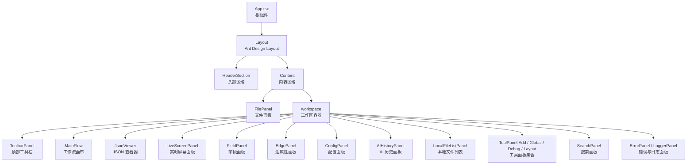
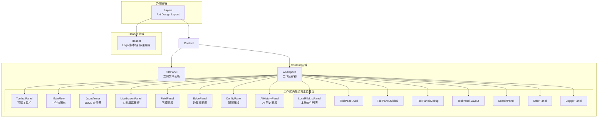
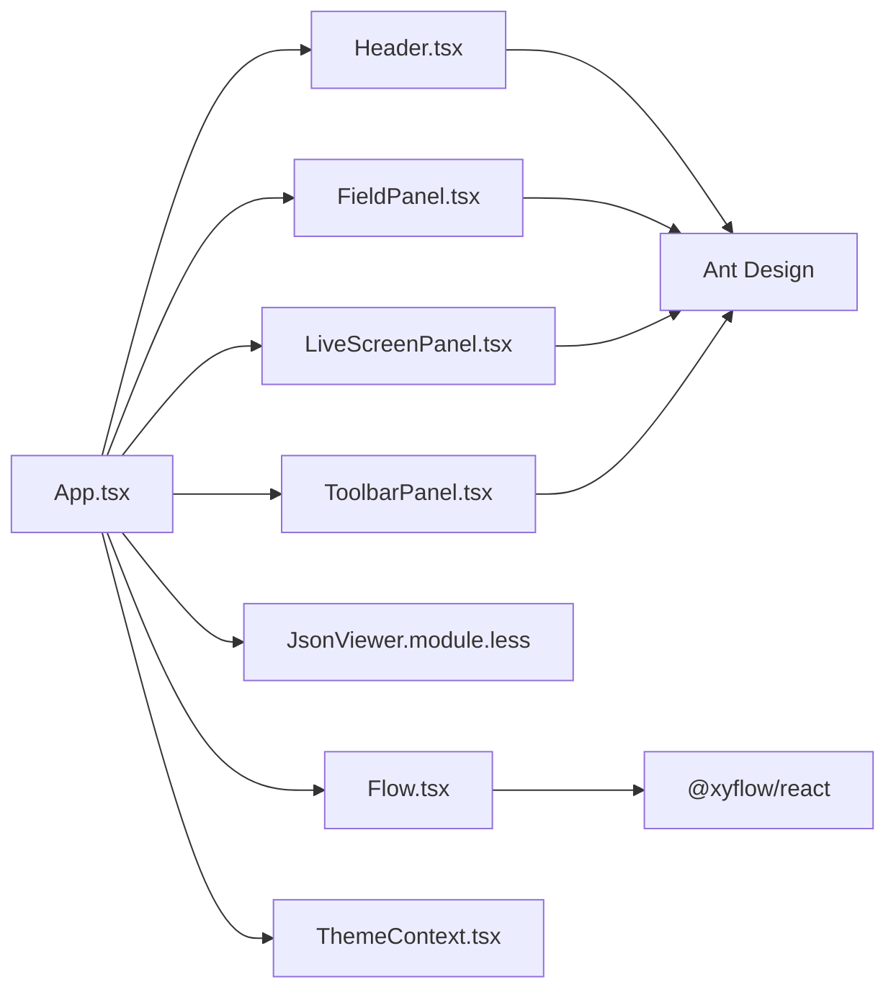

# 主界面布局

<cite>
**本文引用的文件**
- [src\App.tsx](file://src\App.tsx)
- [src\main.tsx](file://src\main.tsx)
- [src\styles\App.module.less](file://src\styles\App.module.less)
- [src\styles\index.less](file://src\styles\index.less)
- [src\styles\global.less](file://src\styles\global.less)
- [src\styles\antd.less](file://src\styles\antd.less)
- [src\styles\Flow.module.less](file://src\styles\Flow.module.less)
- [src\styles\FieldPanel.module.less](file://src\styles\FieldPanel.module.less)
- [src\styles\JsonViewer.module.less](file://src\styles\JsonViewer.module.less)
- [src\styles\LiveScreenPanel.module.less](file://src\styles\LiveScreenPanel.module.less)
- [src\components\Header.tsx](file://src\components\Header.tsx)
- [src\components\Flow.tsx](file://src\components\Flow.tsx)
- [src\components\panels\main\ToolbarPanel.tsx](file://src\components\panels\main\ToolbarPanel.tsx)
- [src\components\panels\main\FieldPanel.tsx](file://src\components\panels\main\FieldPanel.tsx)
- [src\components\panels\main\LiveScreenPanel.tsx](file://src\components\panels\main\LiveScreenPanel.tsx)
- [src\contexts\ThemeContext.tsx](file://src\contexts\ThemeContext.tsx)
</cite>

## 目录
1. [简介](#简介)
2. [项目结构](#项目结构)
3. [核心组件](#核心组件)
4. [架构总览](#架构总览)
5. [详细组件分析](#详细组件分析)
6. [依赖分析](#依赖分析)
7. [性能考虑](#性能考虑)
8. [故障排查指南](#故障排查指南)
9. [结论](#结论)
10. [附录](#附录)

## 简介
本章节聚焦于 MaaPipelineEditor 主界面布局，系统性阐述整体布局架构（Header 区域、Content 区域）、工作区（workspace）的组织方式（工具栏、工作流画布、JSON 查看器、实时屏幕面板等），以及响应式布局与主题系统实现。同时给出 Flex 布局与 Ant Design Layout 的组合使用方式、布局定制化与 CSS 覆盖方法、最佳实践与性能优化建议。

## 项目结构
应用入口通过根组件包裹 ThemeProvider，采用 Ant Design Layout 作为外层容器，内部以 Flex 布局承载 Header 与 Content；Content 内部包含 FilePanel 与 workspace 工作区，工作区内按需渲染多个面板与工具组件，形成“画布 + 右侧面板 + 工具条 + 实时画面”的核心工作流。

图表来源
- [src\App.tsx:296-329](file://src\App.tsx#L296-L329)
- [src\styles\App.module.less:6-31](file://src\styles\App.module.less#L6-L31)

章节来源
- [src\App.tsx:296-329](file://src\App.tsx#L296-L329)
- [src\styles\App.module.less:1-32](file://src\styles\App.module.less#L1-L32)

## 核心组件
- 布局容器与主题提供者
  - 根组件在最外层包裹 ThemeProvider，统一管理暗色/亮色主题切换。
  - 使用 Ant Design Layout 与 Flex 布局，确保 Header、Content 的层级与弹性伸缩。
- Header 区域
  - 包含 Logo、标题、版本标签、连接状态按钮、设备连接按钮、版本切换下拉、主题切换按钮、外部链接入口等。
  - 支持窄屏提示与 WebSocket 连接状态联动。
- Content 区域
  - 包含 FilePanel（左侧文件树/列表）与 workspace 工作区。
- 工作区（workspace）
  - 顶部 ToolbarPanel（导入/导出/JSON 预览）。
  - 中央 MainFlow（工作流画布，基于 @xyflow/react）。
  - 右侧面板：FieldPanel（节点字段编辑）、EdgePanel（边属性）、ConfigPanel（全局配置）、AIHistoryPanel（AI 历史）、LocalFileListPanel（本地文件）、SearchPanel（搜索）。
  - 右下角工具面板：ToolPanel.Add（新增节点）、ToolPanel.Global（全局工具）、ToolPanel.Debug（调试工具，仅 debugMode 开启）、ToolPanel.Layout（布局工具）。
  - 右上角浮动面板：JsonViewer（JSON 文本查看与操作）。
  - 右上角悬浮面板：LiveScreenPanel（实时画面，条件显示）。
  - 底部面板：ErrorPanel（错误面板）、LoggerPanel（日志面板）。

章节来源
- [src\App.tsx:296-329](file://src\App.tsx#L296-L329)
- [src\components\Header.tsx:226-421](file://src\components\Header.tsx#L226-L421)
- [src\components\panels\main\ToolbarPanel.tsx:11-21](file://src\components\panels\main\ToolbarPanel.tsx#L11-L21)
- [src\components\Flow.tsx:462-539](file://src\components\Flow.tsx#L462-L539)
- [src\components\panels\main\FieldPanel.tsx:185-521](file://src\components\panels\main\FieldPanel.tsx#L185-L521)
- [src\components\panels\main\LiveScreenPanel.tsx:13-147](file://src\components\panels\main\LiveScreenPanel.tsx#L13-L147)

## 架构总览
整体采用“外层 Layout + 内层 Flex + 工作区绝对定位面板”的组合布局。Header 固定高度，Content 弹性占满剩余空间；workspace 作为相对定位容器，内部各面板通过绝对定位叠加，实现“画布为主、面板为辅”的工作流界面。

图表来源
- [src\App.tsx:296-329](file://src\App.tsx#L296-L329)
- [src\styles\App.module.less:6-31](file://src\styles\App.module.less#L6-L31)

## 详细组件分析

### 布局容器与工作区组织
- 外层容器
  - App.tsx 使用 Ant Design Layout，HeaderSection 与 Content 分离，Header 固定高度，Content 弹性填充。
  - App.module.less 设置 container/layout/header/content 的尺寸与方向，workspace 作为 content 子元素，flex: 1 并相对定位。
- 工作区（workspace）
  - workspace 是相对定位容器，内部所有面板均使用绝对定位，通过 z-index 控制层级，避免相互遮挡。
  - 顶部工具栏、画布、右侧面板、底部面板、悬浮面板等均在此容器内叠加呈现。

章节来源
- [src\App.tsx:296-329](file://src\App.tsx#L296-L329)
- [src\styles\App.module.less:6-31](file://src\styles\App.module.less#L6-L31)

### Header 区域
- 功能要点
  - 版本信息与版本切换下拉菜单。
  - WebSocket 连接状态按钮，支持连接/断开/连接中状态切换。
  - 设备连接按钮，根据连接状态展示不同图标与文案。
  - 主题切换按钮，通过 useTheme 切换暗色/亮色模式。
  - 窄屏检测与提示，当窗口宽度小于阈值时显示警告横幅。
- 响应式策略
  - Header 内部包含窄屏检测逻辑，动态显示警告横幅，提示用户调整窗口大小以获得更好体验。

章节来源
- [src\components\Header.tsx:226-421](file://src\components\Header.tsx#L226-L421)

### 工作流画布（MainFlow）
- 技术栈
  - 基于 @xyflow/react，内置 Controls、Background、实例监控、视口变更监听、键盘快捷键、节点/边变更处理等。
- 关键行为
  - 双击/右键空白处弹出“节点添加面板”。
  - 节点拖拽磁吸对齐与分组挂载/脱离检测。
  - 视口变化自动保存至文件配置。
  - 节点/边/选区变更自动防抖持久化。
- 样式
  - Flow.module.less 限定 editor 容器宽高 100%，配合 workspace 的相对定位实现全屏画布。

章节来源
- [src\components\Flow.tsx:193-542](file://src\components\Flow.tsx#L193-L542)
- [src\styles\Flow.module.less:1-6](file://src\styles\Flow.module.less#L1-L6)

### 字段面板（FieldPanel）
- 定位与显示
  - 默认绝对定位在右侧，支持可拖拽模式与内联模式（inline）。
  - 当存在目标节点时显示，否则隐藏。
- 结构
  - 顶部工具栏（左/右），中部 Tabs（字段配置/邻接信息/调试记录），底部遮罩层用于加载与进度提示。
- 交互
  - 根据节点类型动态渲染对应编辑器（Pipeline/External/Anchor/Sticker/Group）。
  - 提供节点数据校验与自动修复能力，修复后替换节点数据。

章节来源
- [src\components\panels\main\FieldPanel.tsx:185-521](file://src\components\panels\main\FieldPanel.tsx#L185-L521)
- [src\styles\FieldPanel.module.less:4-127](file://src\styles\FieldPanel.module.less#L4-L127)

### 实时屏幕面板（LiveScreenPanel）
- 显示条件
  - 设备已连接且控制器可用、无其他面板遮挡、启用实时画面、且未处于 JSON 面板显示状态。
- 行为
  - 定时请求截图（受刷新频率配置控制），页面不可见时暂停请求。
  - 截图成功后显示图片，失败时显示错误提示。
- 样式
  - 通过可见/隐藏类名控制显隐与过渡动画，固定尺寸与阴影提升可读性。

章节来源
- [src\components\panels\main\LiveScreenPanel.tsx:13-147](file://src\components\panels\main\LiveScreenPanel.tsx#L13-L147)
- [src\styles\LiveScreenPanel.module.less:3-89](file://src\styles\LiveScreenPanel.module.less#L3-L89)

### JSON 查看器（JsonViewer）
- 定位与布局
  - 绝对定位在右上角，顶部包含标题与操作区（按钮组），下方为容器，flex: 1 并滚动显示 JSON 内容。
- 用途
  - 展示/编辑当前工作流的 JSON 文本，支持一键导入/导出与预览切换。

章节来源
- [src\styles\JsonViewer.module.less:1-45](file://src\styles\JsonViewer.module.less#L1-L45)

### 顶部工具栏（ToolbarPanel）
- 组成
  - 导入、导出、JSON 预览三个按钮，横向排列。
- 位置
  - 位于工作区右上角，随画布滚动独立固定。

章节来源
- [src\components\panels\main\ToolbarPanel.tsx:11-21](file://src\components\panels\main\ToolbarPanel.tsx#L11-L21)

### 响应式布局与适配策略
- 宽度阈值与提示
  - Header 内部检测窗口宽度，小于阈值时显示窄屏警告横幅，提示用户调整窗口大小。
- 面板自适应
  - 各面板使用相对定位与固定尺寸，配合 Ant Design 的 Tabs、滚动容器等组件，保证在不同分辨率下仍具备良好可读性。
- 全局样式
  - index.less 与 global.less 提供基础字体、溢出换行、Antd 组件尺寸微调等通用规则，确保跨面板一致性。

章节来源
- [src\components\Header.tsx:256-265](file://src\components\Header.tsx#L256-L265)
- [src\styles\index.less:1-30](file://src\styles\index.less#L1-L30)
- [src\styles\global.less:14-155](file://src\styles\global.less#L14-L155)

### Flex 布局与 Ant Design Layout 的组合
- 外层使用 Ant Design Layout，Header 固定、Content 弹性，确保页面骨架稳定。
- 内层使用 Flex 布局（App.module.less），设置 direction 与 flex: 1，使 Header 与 Content 在容器内正确分配空间。
- 工作区内部采用绝对定位叠加面板，避免 Flex 影响面板的层叠与定位。

章节来源
- [src\styles\App.module.less:6-31](file://src\styles\App.module.less#L6-L31)

### 主题系统实现（暗色/亮色）
- 主题提供者
  - ThemeProvider 从配置存储读取 useDarkMode，通过 darkreader 动态启用/禁用暗色模式，并暴露 toggleTheme/setTheme。
- Header 中的主题切换按钮
  - 点击切换图标与提示文案，实际通过 useTheme.toggleTheme 触发配置变更。
- 样式层面
  - index.less 引入全局样式与 Antd 覆盖，antd.less 对 Tabs 等组件进行统一美化，global.less 提供面板基础样式与动画。

章节来源
- [src\contexts\ThemeContext.tsx:22-68](file://src\contexts\ThemeContext.tsx#L22-L68)
- [src\components\Header.tsx:355-369](file://src\components\Header.tsx#L355-L369)
- [src\styles\index.less:1-30](file://src\styles\index.less#L1-L30)
- [src\styles\antd.less:3-47](file://src\styles\antd.less#L3-L47)

### 布局定制化与 CSS 覆盖
- 全局样式入口
  - index.less 统一引入 iconfonts、global、flow、antd 样式，作为全局样式入口。
- 面板样式模块化
  - 各面板使用独立 less 模块（如 FieldPanel.module.less、LiveScreenPanel.module.less、JsonViewer.module.less），便于局部覆盖。
- Antd 组件样式覆盖
  - antd.less 对 Tabs、Notification 等组件进行样式微调，避免全局污染。
- 面板通用基类
  - global.less 提供 panel-base、panel-show、panel-draggable 等通用类，统一面板外观与交互。

章节来源
- [src\styles\index.less:1-30](file://src\styles\index.less#L1-L30)
- [src\styles\antd.less:3-47](file://src\styles\antd.less#L3-L47)
- [src\styles\global.less:21-94](file://src\styles\global.less#L21-L94)

## 依赖分析
- 组件耦合
  - App.tsx 作为根容器，聚合 Header、MainFlow、各面板与工具组件，承担布局与状态协调职责。
  - MainFlow 与 Flow.store、配置存储、剪贴板存储等交互，承担画布核心逻辑。
  - 各面板通过 stores 与服务进行数据交互，保持低耦合。
- 外部依赖
  - @xyflow/react：工作流画布渲染与交互。
  - Ant Design：布局、面板、按钮、下拉、通知等 UI 组件。
  - darkreader：主题切换底层实现。

图表来源
- [src\App.tsx:22-37](file://src\App.tsx#L22-L37)
- [src\components\Flow.tsx:14-25](file://src\components\Flow.tsx#L14-L25)
- [src\contexts\ThemeContext.tsx:1-68](file://src\contexts\ThemeContext.tsx#L1-L68)

章节来源
- [src\App.tsx:22-37](file://src\App.tsx#L22-L37)
- [src\components\Flow.tsx:14-25](file://src\components\Flow.tsx#L14-L25)

## 性能考虑
- 画布尺寸与视口
  - MainFlow 使用 ResizeObserver 与防抖更新画布尺寸，减少频繁重排。
  - 视口变更自动保存，避免重复计算。
- 节点/边/选区变更
  - 使用防抖持久化（debounce）降低写盘频率，提升大图场景稳定性。
- 实时画面
  - LiveScreenPanel 在页面不可见时停止截图请求，降低资源消耗。
- 面板显示条件
  - LiveScreenPanel 仅在无其他面板遮挡且启用时显示，避免多余渲染与网络请求。

章节来源
- [src\components\Flow.tsx:438-459](file://src\components\Flow.tsx#L438-L459)
- [src\components\Flow.tsx:131-144](file://src\components\Flow.tsx#L131-L144)
- [src\components\panels\main\LiveScreenPanel.tsx:33-41](file://src\components\panels\main\LiveScreenPanel.tsx#L33-L41)
- [src\components\panels\main\LiveScreenPanel.tsx:85-101](file://src\components\panels\main\LiveScreenPanel.tsx#L85-L101)

## 故障排查指南
- 画布空白或节点丢失
  - 检查 MainFlow 的节点/边变更监听与持久化逻辑是否生效。
  - 确认视口保存与恢复流程正常。
- 实时画面不显示
  - 确认设备连接状态、控制器 ID、面板遮挡条件与刷新频率配置。
  - 检查截图请求是否被页面可见性阻止。
- 主题切换无效
  - 确认 ThemeProvider 正常注入，useTheme 返回值有效。
  - 检查 darkreader 的启用/禁用时机与配置参数。
- 窄屏提示频繁出现
  - 调整浏览器窗口大小或使用更大屏幕，确保工作区有足够的可用空间。

章节来源
- [src\components\Flow.tsx:104-115](file://src\components\Flow.tsx#L104-L115)
- [src\components\panels\main\LiveScreenPanel.tsx:48-52](file://src\components\panels\main\LiveScreenPanel.tsx#L48-L52)
- [src\contexts\ThemeContext.tsx:26-37](file://src\contexts\ThemeContext.tsx#L26-L37)
- [src\components\Header.tsx:256-265](file://src\components\Header.tsx#L256-L265)

## 结论
本布局方案通过 Ant Design Layout 与 Flex 的组合，结合绝对定位叠加的面板体系，实现了“画布为主、面板为辅”的高效工作流界面。Header 提供清晰的状态与操作入口，工作区内部各面板职责明确、可按需显示/隐藏。主题系统与响应式策略进一步提升了可用性与可维护性。通过合理的性能优化与故障排查路径，可在复杂场景下保持流畅体验。

## 附录
- 入口初始化
  - main.tsx 初始化 WebSocket 服务并在根节点挂载 App，确保前端运行环境准备就绪。
- 样式组织
  - index.less 作为全局入口，集中引入 iconfonts、global、flow、antd 样式，保证一致的视觉与交互体验。

章节来源
- [src\main.tsx:1-18](file://src\main.tsx#L1-L18)
- [src\styles\index.less:1-30](file://src\styles\index.less#L1-L30)