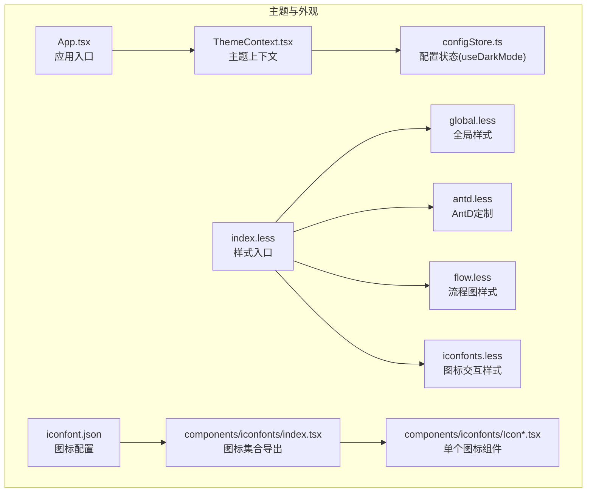
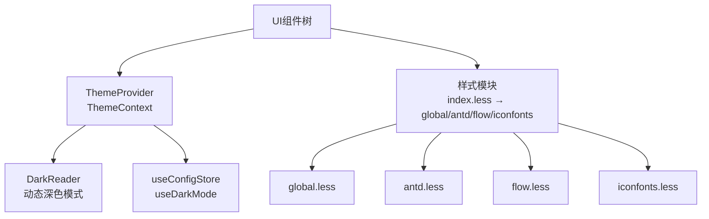
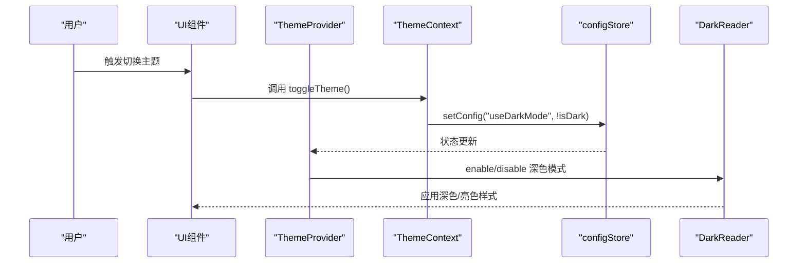
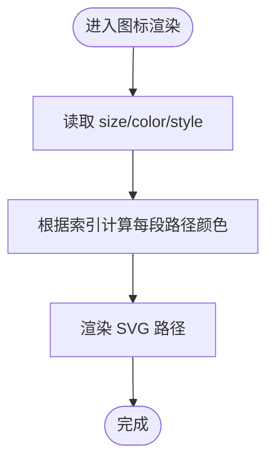
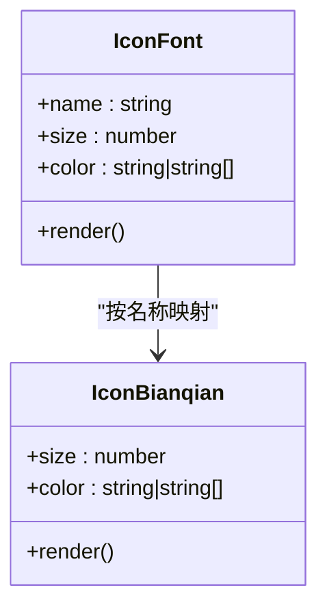
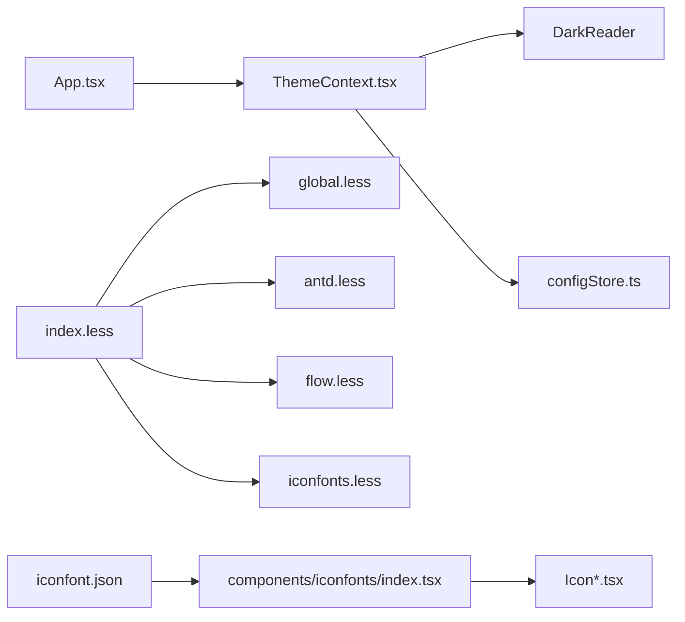

# 主题与外观

<cite>
**本文引用的文件**   
- [ThemeContext.tsx](file://src/contexts/ThemeContext.tsx)
- [configStore.ts](file://src/stores/configStore.ts)
- [App.tsx](file://src/App.tsx)
- [index.less](file://src/styles/index.less)
- [global.less](file://src/styles/global.less)
- [antd.less](file://src/styles/antd.less)
- [flow.less](file://src/styles/flow.less)
- [iconfonts.less](file://src/styles/iconfonts.less)
- [iconfont.json](file://iconfont.json)
- [index.tsx](file://src/components/iconfonts/index.tsx)
- [IconBianqian.tsx](file://src/components/iconfonts/IconBianqian.tsx)
- [App.module.less](file://src/styles/App.module.less)
- [vite.config.ts](file://vite.config.ts)
</cite>

## 目录
1. [简介](#简介)
2. [项目结构](#项目结构)
3. [核心组件](#核心组件)
4. [架构总览](#架构总览)
5. [详细组件分析](#详细组件分析)
6. [依赖分析](#依赖分析)
7. [性能考虑](#性能考虑)
8. [故障排查指南](#故障排查指南)
9. [结论](#结论)
10. [附录](#附录)

## 简介
本文件系统性梳理本项目的“主题与外观”体系，覆盖以下方面：
- 主题上下文与暗色/亮色主题切换机制及状态管理
- 颜色系统设计与主/辅/语义色应用规范
- 图标字体系统（IconFont）的使用、自定义图标添加与管理
- 样式模块化设计（Less 变量、混合器、模块化组织）
- 响应式设计（断点与媒体查询）
- 主题定制化指南（颜色、字体、间距等）
- 性能优化建议与浏览器兼容性说明

## 项目结构
主题与外观相关的关键位置如下：
- 上下文与状态：主题上下文、配置状态（含 useDarkMode）
- 样式入口与模块：样式入口、全局样式、Ant Design 定制、流程图样式、图标样式
- 图标字体：IconFont 配置、图标集合导出、单个图标组件
- 应用入口：App 包裹 ThemeProvider，统一注入主题上下文

**图表来源**
- [App.tsx:296-329](file://src/App.tsx#L296-L329)
- [ThemeContext.tsx:22-56](file://src/contexts/ThemeContext.tsx#L22-L56)
- [configStore.ts:95-211](file://src/stores/configStore.ts#L95-L211)
- [index.less:1-5](file://src/styles/index.less#L1-L5)
- [global.less:1-155](file://src/styles/global.less#L1-L155)
- [antd.less:1-47](file://src/styles/antd.less#L1-L47)
- [flow.less:1-26](file://src/styles/flow.less#L1-L26)
- [iconfonts.less:1-11](file://src/styles/iconfonts.less#L1-L11)
- [iconfont.json:1-8](file://iconfont.json#L1-L8)
- [index.tsx:1-419](file://src/components/iconfonts/index.tsx#L1-L419)
- [IconBianqian.tsx:1-42](file://src/components/iconfonts/IconBianqian.tsx#L1-L42)

**章节来源**
- [App.tsx:296-329](file://src/App.tsx#L296-L329)
- [index.less:1-5](file://src/styles/index.less#L1-L5)

## 核心组件
- 主题上下文与切换
  - 提供 isDark、toggleTheme、setTheme 三个能力，内部通过 DarkReader 动态启用/禁用深色模式，并与配置状态联动
  - 切换行为由 useConfigStore 的 useDarkMode 字段驱动，写入/读取持久化配置
- 配置状态（Zustand）
  - useDarkMode 属于 configs 字段之一，初始值为 false（默认亮色）
  - 支持批量替换配置与迁移逻辑（如旧配置字段与新字段的映射）
- 样式入口与模块化
  - index.less 统一引入 iconfonts.less、global.less、flow.less、antd.less
  - global.less 提供通用布局与 UI 补丁；antd.less 覆盖 Ant Design 组件样式；flow.less 定义流程图语义色；iconfonts.less 提供图标交互样式
- 图标字体系统
  - iconfont.json 定义图标资源地址、生成目录、单位与默认尺寸
  - components/iconfonts/index.tsx 汇总导出所有图标组件，按名称映射到具体组件
  - 单个图标组件（如 IconBianqian.tsx）通过 helper 计算颜色，支持 size/color/style 透传

**章节来源**
- [ThemeContext.tsx:11-67](file://src/contexts/ThemeContext.tsx#L11-L67)
- [configStore.ts:95-211](file://src/stores/configStore.ts#L95-L211)
- [index.less:1-5](file://src/styles/index.less#L1-L5)
- [global.less:21-67](file://src/styles/global.less#L21-L67)
- [antd.less:3-42](file://src/styles/antd.less#L3-L42)
- [flow.less:1-26](file://src/styles/flow.less#L1-L26)
- [iconfonts.less:1-11](file://src/styles/iconfonts.less#L1-L11)
- [iconfont.json:1-8](file://iconfont.json#L1-L8)
- [index.tsx:1-419](file://src/components/iconfonts/index.tsx#L1-L419)
- [IconBianqian.tsx:16-35](file://src/components/iconfonts/IconBianqian.tsx#L16-L35)

## 架构总览
主题与外观系统采用“上下文 + 状态 + 样式模块”的分层设计：
- 上下文层：ThemeContext 提供主题能力，内部依赖 DarkReader 实现动态深色模式
- 状态层：Zustand configStore 管理 useDarkMode 等配置，保证主题状态持久化与跨组件共享
- 样式层：Less 模块化组织，按功能拆分（全局、AntD、流程图、图标），通过入口统一引入

**图表来源**
- [ThemeContext.tsx:22-56](file://src/contexts/ThemeContext.tsx#L22-L56)
- [configStore.ts:95-211](file://src/stores/configStore.ts#L95-L211)
- [index.less:1-5](file://src/styles/index.less#L1-L5)
- [global.less:1-155](file://src/styles/global.less#L1-L155)
- [antd.less:1-47](file://src/styles/antd.less#L1-L47)
- [flow.less:1-26](file://src/styles/flow.less#L1-L26)
- [iconfonts.less:1-11](file://src/styles/iconfonts.less#L1-L11)

## 详细组件分析

### 主题上下文与切换机制
- 初始化与同步
  - 组件挂载时根据 useDarkMode 决定启用/禁用 DarkReader
  - 切换主题时通过 setConfig 更新 useDarkMode，触发 DarkReader 重新计算
- 使用方式
  - App.tsx 中以 Provider 形式包裹整个应用树，确保任意层级组件可通过 useTheme 获取主题状态与切换函数

**图表来源**
- [ThemeContext.tsx:22-56](file://src/contexts/ThemeContext.tsx#L22-L56)
- [configStore.ts:145-225](file://src/stores/configStore.ts#L145-L225)

**章节来源**
- [ThemeContext.tsx:22-56](file://src/contexts/ThemeContext.tsx#L22-L56)
- [App.tsx:296-329](file://src/App.tsx#L296-L329)

### 颜色系统与语义色
- 流程图语义色
  - 在 flow.less 中定义了若干语义色变量，分别用于不同节点/连线状态的视觉表达
- Ant Design 主题补丁
  - 通过 antd.less 对标签页、通知等组件进行样式微调，保持整体风格一致
- 图标颜色策略
  - 单个图标组件通过 helper 计算颜色，支持多路径填充色差异化渲染，便于在不同主题下保持对比度与可读性

**图表来源**
- [IconBianqian.tsx:16-35](file://src/components/iconfonts/IconBianqian.tsx#L16-L35)

**章节来源**
- [flow.less:1-26](file://src/styles/flow.less#L1-L26)
- [antd.less:3-42](file://src/styles/antd.less#L3-L42)
- [IconBianqian.tsx:16-35](file://src/components/iconfonts/IconBianqian.tsx#L16-L35)

### 图标字体系统
- 配置与生成
  - iconfont.json 指定图标资源地址、生成目录、单位与默认尺寸，便于统一管理
  - components/iconfonts/index.tsx 汇总导出所有图标组件，形成统一的图标命名空间
- 使用方式
  - 通过 IconFont 组件按 name 选择对应图标，支持 size/color/style 透传
  - 单个图标组件内部通过 helper 计算颜色，保证在不同主题下的一致表现

**图表来源**
- [index.tsx:212-416](file://src/components/iconfonts/index.tsx#L212-L416)
- [IconBianqian.tsx:16-35](file://src/components/iconfonts/IconBianqian.tsx#L16-L35)

**章节来源**
- [iconfont.json:1-8](file://iconfont.json#L1-L8)
- [index.tsx:1-419](file://src/components/iconfonts/index.tsx#L1-L419)
- [IconBianqian.tsx:16-35](file://src/components/iconfonts/IconBianqian.tsx#L16-L35)

### 样式模块化设计
- Less 变量与混合器
  - 在 flow.less 中使用变量集中管理语义色；在 global.less 中定义常用布局与 UI 补丁
- 模块化组织
  - index.less 作为入口，统一引入各模块样式，避免重复与遗漏
- Ant Design 定制
  - 通过 antd.less 对标签页、通知等组件进行覆盖，确保与整体设计一致

**章节来源**
- [index.less:1-5](file://src/styles/index.less#L1-L5)
- [global.less:1-155](file://src/styles/global.less#L1-L155)
- [antd.less:1-47](file://src/styles/antd.less#L1-L47)
- [flow.less:1-26](file://src/styles/flow.less#L1-L26)

### 响应式设计
- 断点与媒体查询
  - 项目未内置自定义断点常量，但使用了通用的断点库（如 Tailwind、Ant Design 等）与媒体查询工具函数
  - 建议在业务组件中通过媒体查询工具函数（如 useMediaQuery）进行条件渲染与布局调整
- 基础布局
  - App.module.less 提供基础布局容器与内容区域，配合 flex 布局实现自适应

**章节来源**
- [App.module.less:1-32](file://src/styles/App.module.less#L1-L32)

## 依赖分析
- 主题上下文依赖 DarkReader 实现动态深色模式
- 主题状态依赖 Zustand configStore，确保 useDarkMode 的持久化与跨组件共享
- 样式依赖 Less 模块化组织，入口统一引入各模块样式
- 图标字体依赖 iconfont.json 与 components/iconfonts/index.tsx 的映射关系

**图表来源**
- [ThemeContext.tsx:22-56](file://src/contexts/ThemeContext.tsx#L22-L56)
- [configStore.ts:95-211](file://src/stores/configStore.ts#L95-L211)
- [App.tsx:296-329](file://src/App.tsx#L296-L329)
- [index.less:1-5](file://src/styles/index.less#L1-L5)
- [iconfont.json:1-8](file://iconfont.json#L1-L8)
- [index.tsx:1-419](file://src/components/iconfonts/index.tsx#L1-L419)

**章节来源**
- [ThemeContext.tsx:22-56](file://src/contexts/ThemeContext.tsx#L22-L56)
- [configStore.ts:95-211](file://src/stores/configStore.ts#L95-L211)
- [index.less:1-5](file://src/styles/index.less#L1-L5)

## 性能考虑
- 深色模式渲染
  - DarkReader 会对页面进行动态样式重写，建议在主题切换时避免频繁触发（例如合并状态更新）
- 样式打包与体积
  - 通过 index.less 统一引入样式模块，减少重复依赖；合理拆分 less 文件，避免单文件过大
- 图标渲染
  - 图标组件按需引入，避免一次性加载过多图标导致首屏压力；可结合懒加载策略
- 媒体查询与响应式
  - 在组件内使用媒体查询工具函数进行条件渲染，避免不必要的 DOM 结构变更

## 故障排查指南
- 主题切换无效
  - 检查 useDarkMode 是否正确写入配置状态；确认 ThemeProvider 是否包裹应用根节点
- 深色模式异常
  - 确认 DarkReader 的启用/禁用逻辑是否被正确触发；检查浏览器兼容性与第三方扩展冲突
- 图标不显示或颜色异常
  - 检查 iconfont.json 的资源地址与生成目录；确认 components/iconfonts/index.tsx 的图标映射是否正确
- 样式覆盖失效
  - 检查 Less 模块引入顺序与优先级；确认 Ant Design 版本与覆盖规则是否匹配

**章节来源**
- [ThemeContext.tsx:22-56](file://src/contexts/ThemeContext.tsx#L22-L56)
- [configStore.ts:95-211](file://src/stores/configStore.ts#L95-L211)
- [index.tsx:1-419](file://src/components/iconfonts/index.tsx#L1-L419)

## 结论
本项目的主题与外观体系以“上下文 + 状态 + 样式模块”为核心，结合 DarkReader 实现动态深色模式，通过 Less 模块化组织与 Ant Design 定制，形成统一且可扩展的视觉语言。图标字体系统通过配置与映射实现标准化管理。建议在后续迭代中进一步完善断点与媒体查询工具、优化深色模式渲染性能，并持续维护样式模块的可维护性。

## 附录

### 主题定制化完整指南
- 颜色调整
  - 流程图语义色：在 flow.less 中修改对应变量，统一管理主/辅/语义色
  - Ant Design 组件色：在 antd.less 中进行覆盖，确保与整体风格一致
- 字体配置
  - 在 index.less 中调整全局字体族与字号，确保跨平台一致性
- 间距与布局
  - 在 global.less 中调整通用布局与间距类，保持组件间一致性
- 图标定制
  - 通过 iconfont.json 配置资源地址与生成目录；在 components/iconfonts/index.tsx 中新增图标映射；在具体图标组件中按需调整颜色与尺寸

**章节来源**
- [flow.less:1-26](file://src/styles/flow.less#L1-L26)
- [antd.less:1-47](file://src/styles/antd.less#L1-L47)
- [index.less:6-29](file://src/styles/index.less#L6-L29)
- [global.less:1-155](file://src/styles/global.less#L1-L155)
- [iconfont.json:1-8](file://iconfont.json#L1-L8)
- [index.tsx:1-419](file://src/components/iconfonts/index.tsx#L1-L419)

### 浏览器兼容性说明
- DarkReader 在现代浏览器中具备良好支持，建议在低版本浏览器中进行回归测试
- Ant Design 组件在主流浏览器中表现稳定，注意覆盖规则与版本差异
- Less 编译产物在构建阶段进行兼容性处理，确保目标环境可用

**章节来源**
- [ThemeContext.tsx:22-56](file://src/contexts/ThemeContext.tsx#L22-L56)
- [antd.less:1-47](file://src/styles/antd.less#L1-L47)
- [vite.config.ts:14-38](file://vite.config.ts#L14-L38)