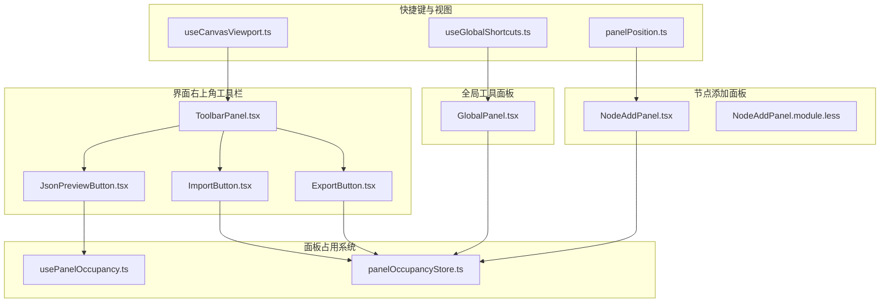
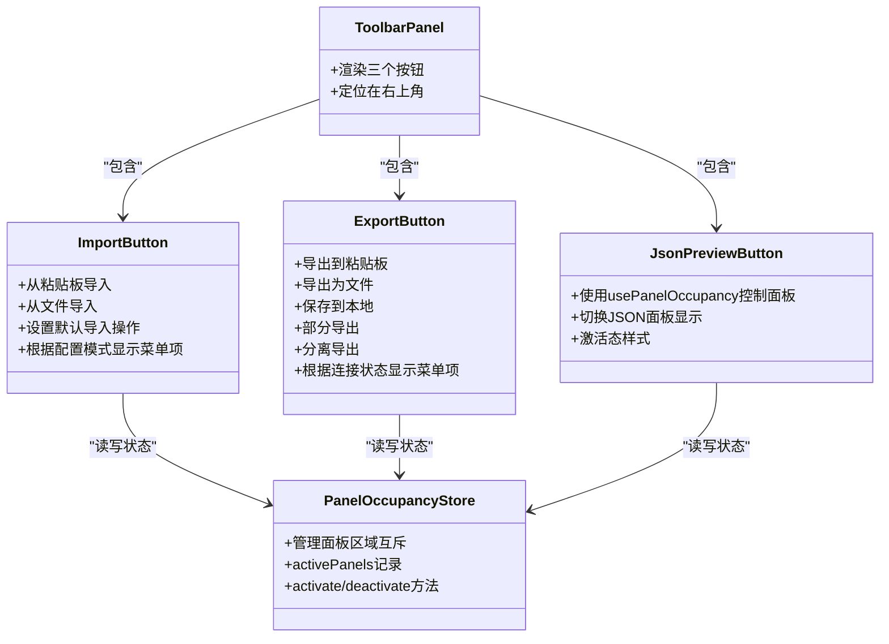
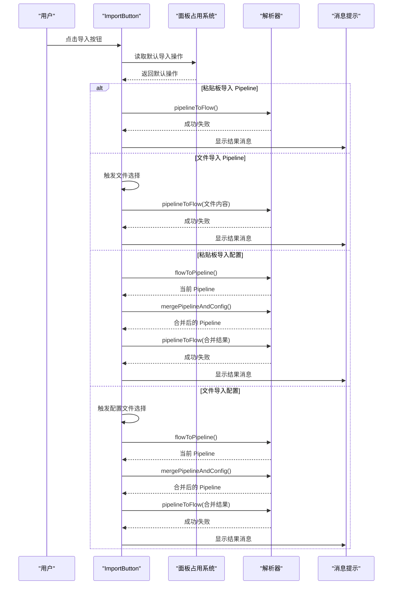
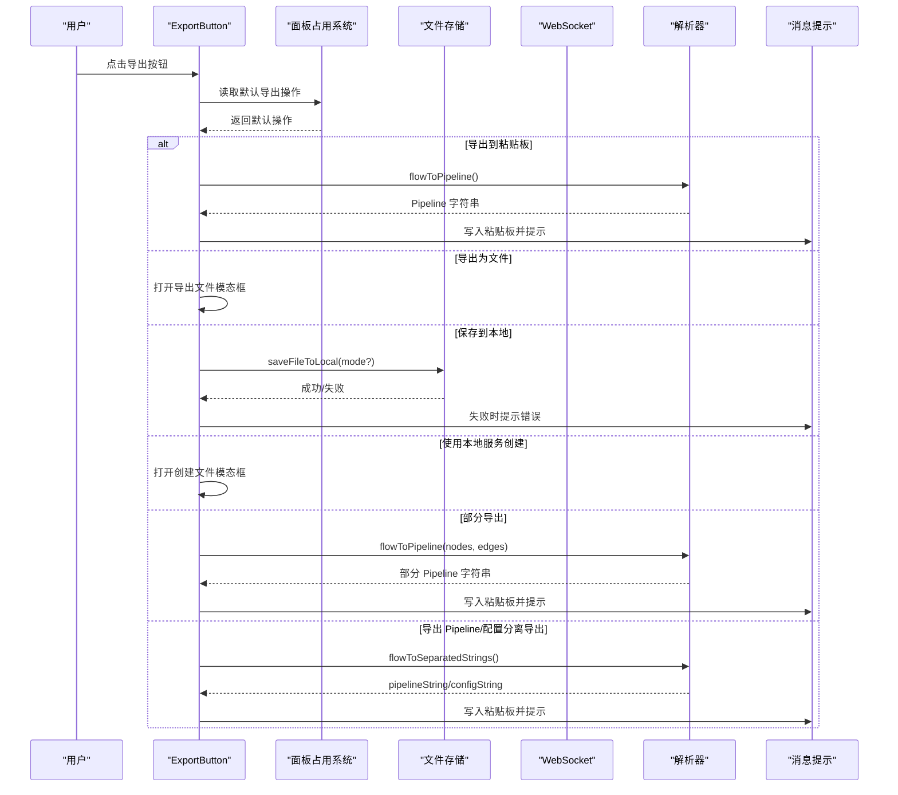
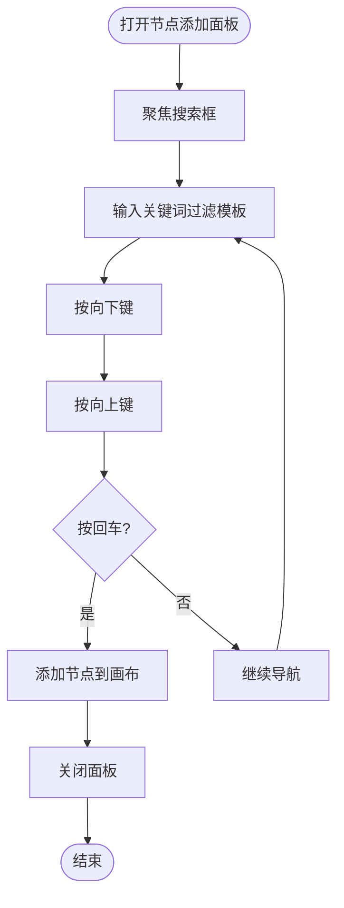
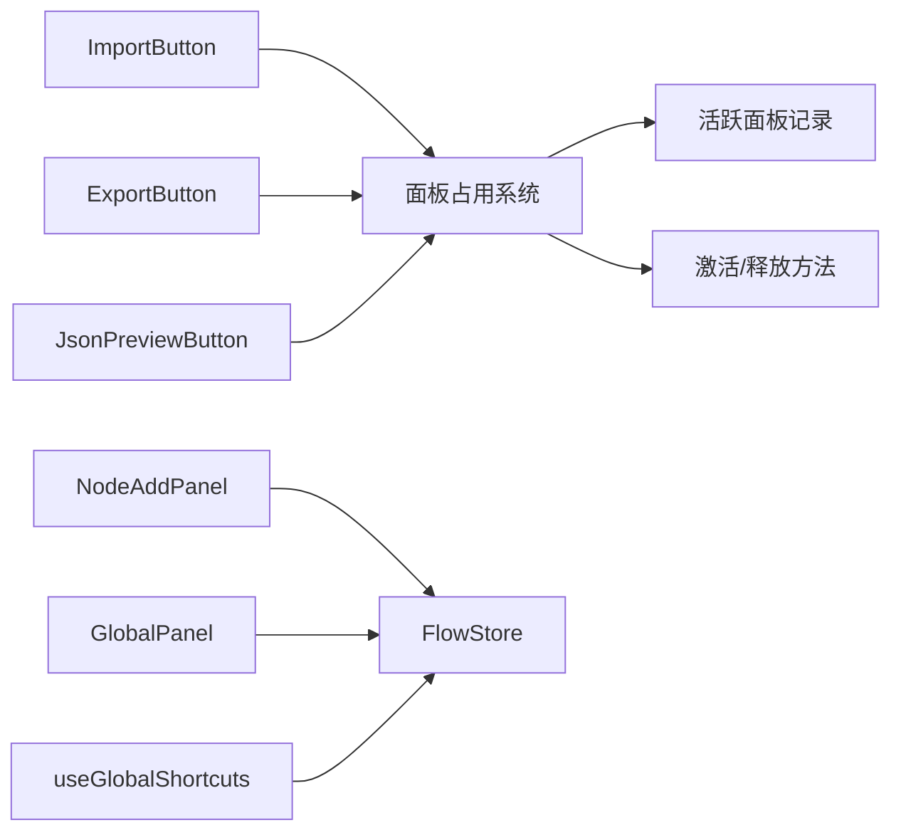

# 工具栏面板

<cite>
**本文档引用的文件**
- [ToolbarPanel.tsx](file://src/components/panels/main/ToolbarPanel.tsx)
- [ImportButton.tsx](file://src/components/panels/toolbar/ImportButton.tsx)
- [ExportButton.tsx](file://src/components/panels/toolbar/ExportButton.tsx)
- [JsonPreviewButton.tsx](file://src/components/panels/toolbar/JsonPreviewButton.tsx)
- [toolbarStore.ts](file://src/stores/toolbarStore.ts)
- [usePanelOccupancy.ts](file://src/hooks/usePanelOccupancy.ts)
- [panelOccupancyStore.ts](file://src/stores/panelOccupancyStore.ts)
- [ToolbarPanel.module.less](file://src/styles/panels/ToolbarPanel.module.less)
- [NodeAddPanel.tsx](file://src/components/panels/main/NodeAddPanel.tsx)
- [NodeAddPanel.module.less](file://src/styles/NodeAddPanel.module.less)
- [GlobalPanel.tsx](file://src/components/panels/tools/GlobalPanel.tsx)
- [useGlobalShortcuts.ts](file://src/hooks/useGlobalShortcuts.ts)
- [panelPosition.ts](file://src/utils/panelPosition.ts)
- [useCanvasViewport.ts](file://src/hooks/useCanvasViewport.ts)
</cite>

## 更新摘要
**所做更改**
- 移除了对已废弃的 toolbarStore 的依赖，改用新的面板占用系统
- 更新了 JSON 预览按钮的实现，使用 usePanelOccupancy hook 替代 toolbarStore
- 更新了面板注册表，新增了面板占用系统的完整实现
- 更新了工具栏按钮的状态管理机制，从集中式状态改为去中心化的面板占用系统
- 移除了工具栏面板相关的旧架构图和状态管理流程图

## 目录
1. [简介](#简介)
2. [项目结构](#项目结构)
3. [核心组件](#核心组件)
4. [架构总览](#架构总览)
5. [详细组件分析](#详细组件分析)
6. [依赖关系分析](#依赖关系分析)
7. [性能考虑](#性能考虑)
8. [故障排除指南](#故障排除指南)
9. [结论](#结论)

## 简介
本文件系统性地阐述顶部工具栏面板的设计与实现，涵盖以下方面：
- 顶部工具栏的功能按钮：文件导入导出、工作流操作、视图控制等
- 节点添加面板的使用方式与快捷键导航
- 工具栏布局设计与响应式适配策略
- 工具栏按钮的状态管理与启用/禁用条件
- 工具栏的自定义与扩展方法
- 工具栏与各面板之间的联动机制
- 快捷键绑定与键盘导航支持

**重要更新**：工具栏面板系统已废弃，被新的面板占用系统替代。工具栏不再依赖 toolbarStore，而是通过 usePanelOccupancy hook 与面板占用系统集成。

## 项目结构
工具栏相关的核心文件分布如下：
- 顶部工具栏容器：位于界面右上角，集成导入、导出、JSON预览三个按钮
- 面板占用系统：统一管理面板区域的互斥关系，替代原有的工具栏状态管理
- 节点添加面板：提供节点模板搜索、预览与快速添加能力
- 全局工具面板：提供复制、粘贴、撤销、重做等常用工作流操作
- 快捷键钩子：提供全局快捷键处理，增强键盘导航体验

**图表来源**
- [ToolbarPanel.tsx:1-22](file://src/components/panels/main/ToolbarPanel.tsx#L1-L22)
- [ImportButton.tsx:1-235](file://src/components/panels/toolbar/ImportButton.tsx#L1-L235)
- [ExportButton.tsx:1-316](file://src/components/panels/toolbar/ExportButton.tsx#L1-L316)
- [JsonPreviewButton.tsx:1-34](file://src/components/panels/toolbar/JsonPreviewButton.tsx#L1-L34)
- [usePanelOccupancy.ts:1-61](file://src/hooks/usePanelOccupancy.ts#L1-L61)
- [panelOccupancyStore.ts:1-136](file://src/stores/panelOccupancyStore.ts#L1-L136)
- [NodeAddPanel.tsx:1-699](file://src/components/panels/main/NodeAddPanel.tsx#L1-L699)
- [GlobalPanel.tsx:1-281](file://src/components/panels/tools/GlobalPanel.tsx#L1-L281)
- [useGlobalShortcuts.ts:1-147](file://src/hooks/useGlobalShortcuts.ts#L1-L147)
- [panelPosition.ts:1-92](file://src/utils/panelPosition.ts#L1-L92)
- [useCanvasViewport.ts:136-306](file://src/hooks/useCanvasViewport.ts#L136-L306)

**章节来源**
- [ToolbarPanel.tsx:1-22](file://src/components/panels/main/ToolbarPanel.tsx#L1-L22)
- [panelOccupancyStore.ts:1-136](file://src/stores/panelOccupancyStore.ts#L1-L136)

## 核心组件
- 顶部工具栏容器：负责渲染三个核心按钮，并提供统一的样式与定位
- 导入按钮：支持从粘贴板或文件导入 Pipeline/配置；支持默认导入操作记忆
- 导出按钮：支持导出到粘贴板、文件、本地保存、部分导出、分离导出等；根据环境动态启用菜单项
- JSON 预览按钮：通过 usePanelOccupancy hook 控制右侧 JSON 浮动面板的显示/隐藏
- 面板占用系统：集中管理面板区域的互斥关系，替代原有的工具栏状态管理

**章节来源**
- [ToolbarPanel.tsx:1-22](file://src/components/panels/main/ToolbarPanel.tsx#L1-L22)
- [ImportButton.tsx:1-235](file://src/components/panels/toolbar/ImportButton.tsx#L1-L235)
- [ExportButton.tsx:1-316](file://src/components/panels/toolbar/ExportButton.tsx#L1-L316)
- [JsonPreviewButton.tsx:1-34](file://src/components/panels/toolbar/JsonPreviewButton.tsx#L1-L34)
- [panelOccupancyStore.ts:1-136](file://src/stores/panelOccupancyStore.ts#L1-L136)

## 架构总览
工具栏采用"容器组件 + 按钮组件 + 面板占用系统"的分层架构：
- 容器组件负责布局与样式
- 按钮组件负责交互逻辑与菜单项生成
- 面板占用系统负责面板区域的互斥关系管理

**重要更新**：移除了 toolbarStore，工具栏按钮现在直接与面板占用系统交互，实现了更灵活的面板管理机制。

**图表来源**
- [ToolbarPanel.tsx:11-21](file://src/components/panels/main/ToolbarPanel.tsx#L11-L21)
- [ImportButton.tsx:19-235](file://src/components/panels/toolbar/ImportButton.tsx#L19-L235)
- [ExportButton.tsx:24-316](file://src/components/panels/toolbar/ExportButton.tsx#L24-L316)
- [JsonPreviewButton.tsx:11-34](file://src/components/panels/toolbar/JsonPreviewButton.tsx#L11-L34)
- [panelOccupancyStore.ts:87-136](file://src/stores/panelOccupancyStore.ts#L87-L136)

## 详细组件分析

### 顶部工具栏容器
- 位置与样式：绝对定位在界面右上角，使用统一的工具栏样式类
- 子组件：依次渲染导出、导入、JSON 预览按钮
- 响应式适配：通过样式文件中的动画与阴影实现视觉一致性

**章节来源**
- [ToolbarPanel.tsx:11-21](file://src/components/panels/main/ToolbarPanel.tsx#L11-L21)
- [ToolbarPanel.module.less:1-71](file://src/styles/panels/ToolbarPanel.module.less#L1-L71)

### 导入按钮组件
- 功能：
  - 从粘贴板导入 Pipeline
  - 从文件导入 Pipeline
  - 从粘贴板导入配置（分离导出模式下）
  - 从文件导入配置（分离导出模式下）
- 默认操作记忆：用户选择后会持久化到本地存储，并作为下次点击的默认行为
- 菜单生成：根据配置处理模式动态显示"导入配置"相关菜单项
- 文件选择：内部隐藏 input，触发系统文件对话框

**图表来源**
- [ImportButton.tsx:29-134](file://src/components/panels/toolbar/ImportButton.tsx#L29-L134)
- [ImportButton.tsx:137-181](file://src/components/panels/toolbar/ImportButton.tsx#L137-L181)
- [ImportButton.tsx:184-197](file://src/components/panels/toolbar/ImportButton.tsx#L184-L197)

**章节来源**
- [ImportButton.tsx:19-235](file://src/components/panels/toolbar/ImportButton.tsx#L19-L235)

### 导出按钮组件
- 功能：
  - 导出到粘贴板
  - 导出为文件（弹出文件导出模态框）
  - 保存到本地（根据配置模式显示"全部/仅 Pipeline/仅配置"子菜单）
  - 使用本地服务创建文件（弹出创建文件模态框）
  - 部分导出（基于选中节点与边）
  - 分离导出（分别导出 Pipeline 与配置）
- 条件启用：根据本地服务连接状态、当前文件路径、选中节点数量、配置处理模式动态生成菜单项
- 默认操作记忆：同导入按钮一致

**图表来源**
- [ExportButton.tsx:46-130](file://src/components/panels/toolbar/ExportButton.tsx#L46-L130)
- [ExportButton.tsx:133-256](file://src/components/panels/toolbar/ExportButton.tsx#L133-L256)
- [ExportButton.tsx:259-284](file://src/components/panels/toolbar/ExportButton.tsx#L259-L284)

**章节来源**
- [ExportButton.tsx:24-316](file://src/components/panels/toolbar/ExportButton.tsx#L24-L316)

### JSON 预览按钮组件
- 功能：通过 usePanelOccupancy hook 控制右侧 JSON 浮动面板的显示/隐藏
- 状态：使用 usePanelOccupancy 返回的 isActive 状态决定按钮激活态样式
- 实现：不再依赖 toolbarStore，直接与面板占用系统交互

**更新**：JSON 预览按钮已完全迁移到新的面板占用系统，移除了对 toolbarStore 的依赖。

**章节来源**
- [JsonPreviewButton.tsx:11-34](file://src/components/panels/toolbar/JsonPreviewButton.tsx#L11-L34)
- [usePanelOccupancy.ts:16-60](file://src/hooks/usePanelOccupancy.ts#L16-L60)

### 节点添加面板
- 功能：提供节点模板的搜索、预览与快速添加
- 交互：
  - 搜索框过滤模板列表
  - 键盘上下方向键选择，回车确认添加
  - 鼠标悬停显示删除自定义模板按钮
  - 预览区域展示节点的识别、动作与其它参数
- 布局：左右布局，左侧预览、右侧列表；支持根据鼠标位置自动调整布局方向
- 快捷键提示：底部显示方向键选择、回车添加、Esc 关闭的快捷键提示

**图表来源**
- [NodeAddPanel.tsx:353-379](file://src/components/panels/main/NodeAddPanel.tsx#L353-L379)
- [NodeAddPanel.tsx:499-551](file://src/components/panels/main/NodeAddPanel.tsx#L499-L551)
- [NodeAddPanel.tsx:564-575](file://src/components/panels/main/NodeAddPanel.tsx#L564-L575)

**章节来源**
- [NodeAddPanel.tsx:276-699](file://src/components/panels/main/NodeAddPanel.tsx#L276-L699)
- [NodeAddPanel.module.less:12-45](file://src/styles/NodeAddPanel.module.less#L12-L45)

### 全局工具面板与工作流操作
- 提供复制、粘贴、撤销、重做等常用工作流操作
- 按钮状态由工作流状态与剪贴板状态驱动，支持禁用态与禁用点击反馈
- 与全局快捷键钩子配合，支持键盘快捷键操作

**章节来源**
- [GlobalPanel.tsx:52-131](file://src/components/panels/tools/GlobalPanel.tsx#L52-L131)
- [useGlobalShortcuts.ts:60-116](file://src/hooks/useGlobalShortcuts.ts#L60-L116)

## 依赖关系分析
- 工具栏按钮与面板占用系统：
  - 导入/导出按钮通过面板占用系统读取默认操作并更新默认值
  - JSON 预览按钮通过 usePanelOccupancy hook 切换面板显示
- 面板占用系统与面板联动：
  - JSON 面板通过 usePanelOccupancy 获取 isActive 状态
  - 其他面板通过 usePanelOccupancy 管理区域互斥关系
- 工具栏与节点添加面板：
  - 节点添加面板通过工作流存储添加节点，与工具栏的"添加节点"入口协同
- 工具栏与视图控制：
  - 视图缩放与平移由独立的视图钩子处理，工具栏按钮不直接参与视图控制

**重要更新**：移除了 toolbarStore 的依赖，工具栏现在完全依赖面板占用系统进行状态管理。

**图表来源**
- [panelOccupancyStore.ts:98-136](file://src/stores/panelOccupancyStore.ts#L98-L136)
- [ImportButton.tsx:20](file://src/components/panels/toolbar/ImportButton.tsx#L20)
- [ExportButton.tsx:25](file://src/components/panels/toolbar/ExportButton.tsx#L25)
- [JsonPreviewButton.tsx:12](file://src/components/panels/toolbar/JsonPreviewButton.tsx#L12)
- [NodeAddPanel.tsx:289-295](file://src/components/panels/main/NodeAddPanel.tsx#L289-L295)
- [GlobalPanel.tsx:28-43](file://src/components/panels/tools/GlobalPanel.tsx#L28-L43)
- [useGlobalShortcuts.ts:3-4](file://src/hooks/useGlobalShortcuts.ts#L3-L4)

**章节来源**
- [panelOccupancyStore.ts:98-136](file://src/stores/panelOccupancyStore.ts#L98-L136)

## 性能考虑
- 按钮组件使用记忆化（memo）减少不必要的重渲染
- 菜单项使用 useMemo 生成，避免每次渲染都重新计算
- 文件导入/导出采用异步处理，避免阻塞主线程
- 面板占用系统使用 Zustand 状态管理，提供高性能的状态更新
- 节点添加面板通过工作流存储添加节点，与工具栏的"添加节点"入口协同

**重要更新**：面板占用系统提供了更好的性能表现，减少了状态更新的复杂度。

## 故障排除指南
- 导入失败：
  - 粘贴板内容为空或格式不正确：检查粘贴板内容与文件格式
  - 配置导入失败：确认配置文件与当前 Pipeline 的兼容性
- 导出失败：
  - 保存到本地失败：检查本地服务连接状态与文件路径
  - 部分导出无选中节点：先在画布中选择节点与边
- JSON 面板无法显示：
  - 检查 usePanelOccupancy hook 的 isActive 状态
  - 确认面板占用系统中 JSON 面板的注册状态
- 快捷键无效：
  - 确认全局快捷键钩子已启用
  - 检查输入框或富文本编辑器中是否阻止了快捷键传播
- 面板互斥问题：
  - 检查面板占用系统的区域配置
  - 确认面板的 passive 属性设置是否正确

**章节来源**
- [ImportButton.tsx:35-64](file://src/components/panels/toolbar/ImportButton.tsx#L35-L64)
- [ExportButton.tsx:56-61](file://src/components/panels/toolbar/ExportButton.tsx#L56-L61)
- [JsonPreviewButton.tsx:14-20](file://src/components/panels/toolbar/JsonPreviewButton.tsx#L14-L20)
- [useGlobalShortcuts.ts:134-146](file://src/hooks/useGlobalShortcuts.ts#L134-L146)

## 结论
工具栏面板通过新的面板占用系统实现了更加灵活和高效的面板管理。JSON 预览按钮已完全迁移到 usePanelOccupancy hook，移除了对已废弃的 toolbarStore 的依赖。面板占用系统提供了更好的性能表现和更清晰的职责划分，实现了导入导出、工作流操作与视图控制的统一入口。节点添加面板提供了高效的节点创建体验，配合快捷键与键盘导航进一步提升了操作效率。通过合理的条件启用与联动机制，工具栏在不同场景下都能保持良好的可用性与一致性。