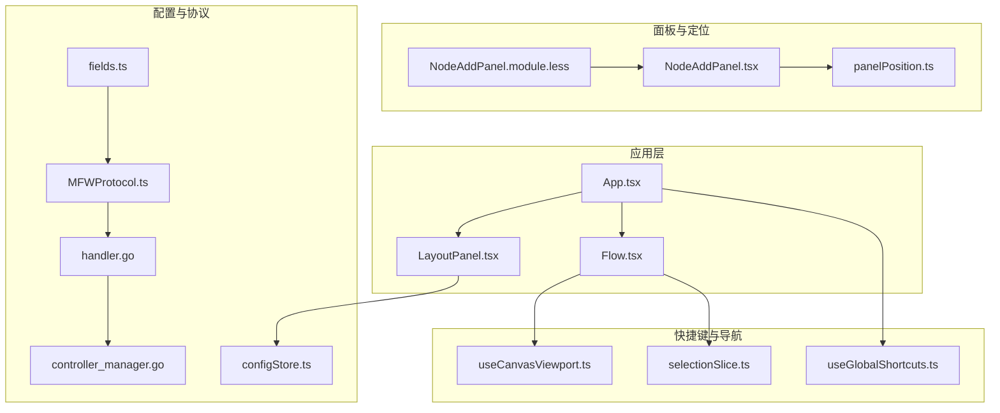
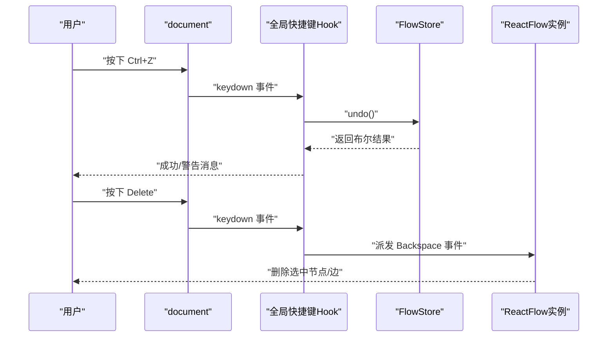
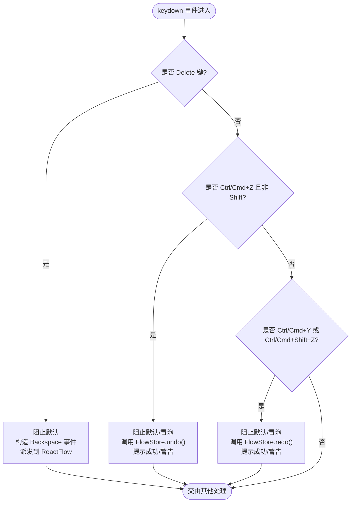
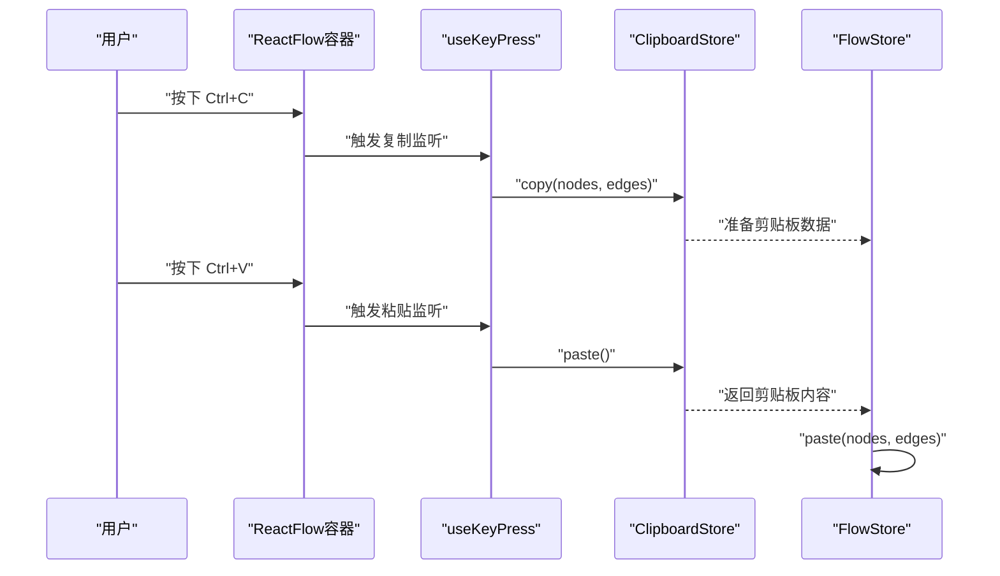
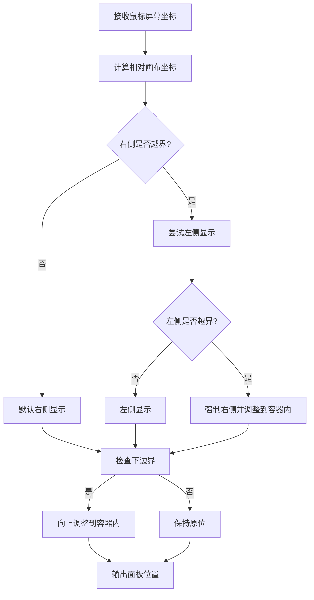
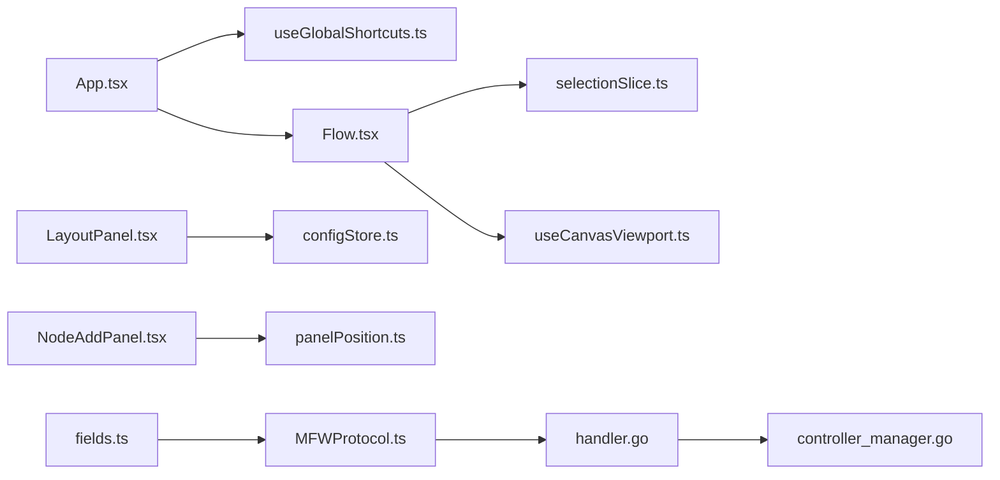

# 快捷键与导航

<cite>
**本文引用的文件**
- [useGlobalShortcuts.ts](file://src/hooks/useGlobalShortcuts.ts)
- [Flow.tsx](file://src/components/Flow.tsx)
- [App.tsx](file://src/App.tsx)
- [LayoutPanel.tsx](file://src/components/panels/tools/LayoutPanel.tsx)
- [panelPosition.ts](file://src/utils/panelPosition.ts)
- [NodeAddPanel.module.less](file://src/styles/NodeAddPanel.module.less)
- [NodeAddPanel.tsx](file://src/components/panels/main/NodeAddPanel.tsx)
- [selectionSlice.ts](file://src/stores/flow/slices/selectionSlice.ts)
- [useCanvasViewport.ts](file://src/hooks/useCanvasViewport.ts)
- [configStore.ts](file://src/stores/configStore.ts)
- [MFWProtocol.ts](file://src/services/protocols/MFWProtocol.ts)
- [handler.go](file://LocalBridge/internal/protocol/mfw/handler.go)
- [controller_manager.go](file://LocalBridge/internal/mfw/controller_manager.go)
- [fields.ts](file://src/core/fields/action/fields.ts)
</cite>

## 目录
1. [简介](#简介)
2. [项目结构](#项目结构)
3. [核心组件](#核心组件)
4. [架构总览](#架构总览)
5. [详细组件分析](#详细组件分析)
6. [依赖关系分析](#依赖关系分析)
7. [性能考量](#性能考量)
8. [故障排查指南](#故障排查指南)
9. [结论](#结论)
10. [附录](#附录)

## 简介
本文件系统化梳理“快捷键与导航”体系，覆盖全局快捷键监听、快捷键绑定与冲突处理、常用快捷键（如撤销/重做、复制粘贴、删除节点）、键盘导航（焦点管理、Tab顺序、方向键）、面板定位与布局快捷键、无障碍访问支持、以及快捷键与鼠标操作的协同。文档同时提供配置与自定义方法、使用指南与最佳实践。

## 项目结构
围绕快捷键与导航的关键模块分布如下：
- 全局快捷键：在应用入口订阅全局键盘事件，拦截并处理撤销/重做、Delete键重定向等。
- 画布快捷键：在画布组件内监听复制/粘贴等组合键，结合剪贴板与画布状态。
- 面板与布局：工具面板提供对齐、间距调整、自动布局、连接线路径重置等快捷操作。
- 面板定位：根据鼠标位置与视口边界自动计算面板显示位置，避免遮挡。
- 焦点与导航：通过配置与工具链实现可预期的 Tab 顺序与焦点管理。
- 无障碍与鼠标协同：快捷键与鼠标交互互补，确保高效率与可访问性。

**图表来源**
- [App.tsx:147-148](file://src/App.tsx#L147-L148)
- [useGlobalShortcuts.ts:134-146](file://src/hooks/useGlobalShortcuts.ts#L134-L146)
- [Flow.tsx:49-93](file://src/components/Flow.tsx#L49-L93)
- [LayoutPanel.tsx:23-129](file://src/components/panels/tools/LayoutPanel.tsx#L23-L129)
- [NodeAddPanel.tsx:393-442](file://src/components/panels/main/NodeAddPanel.tsx#L393-L442)
- [NodeAddPanel.module.less:400-427](file://src/styles/NodeAddPanel.module.less#L400-L427)
- [panelPosition.ts:126-157](file://src/utils/panelPosition.ts#L126-L157)
- [configStore.ts:163-267](file://src/stores/configStore.ts#L163-L267)
- [MFWProtocol.ts:642-743](file://src/services/protocols/MFWProtocol.ts#L642-L743)
- [handler.go:541-623](file://LocalBridge/internal/protocol/mfw/handler.go#L541-L623)
- [controller_manager.go:665-900](file://LocalBridge/internal/mfw/controller_manager.go#L665-L900)
- [fields.ts:46-90](file://src/core/fields/action/fields.ts#L46-L90)

**章节来源**
- [App.tsx:147-148](file://src/App.tsx#L147-L148)
- [useGlobalShortcuts.ts:134-146](file://src/hooks/useGlobalShortcuts.ts#L134-L146)
- [Flow.tsx:49-93](file://src/components/Flow.tsx#L49-L93)
- [LayoutPanel.tsx:23-129](file://src/components/panels/tools/LayoutPanel.tsx#L23-L129)
- [NodeAddPanel.tsx:393-442](file://src/components/panels/main/NodeAddPanel.tsx#L393-L442)
- [NodeAddPanel.module.less:400-427](file://src/styles/NodeAddPanel.module.less#L400-L427)
- [panelPosition.ts:126-157](file://src/utils/panelPosition.ts#L126-L157)
- [configStore.ts:163-267](file://src/stores/configStore.ts#L163-L267)
- [MFWProtocol.ts:642-743](file://src/services/protocols/MFWProtocol.ts#L642-L743)
- [handler.go:541-623](file://LocalBridge/internal/protocol/mfw/handler.go#L541-L623)
- [controller_manager.go:665-900](file://LocalBridge/internal/mfw/controller_manager.go#L665-L900)
- [fields.ts:46-90](file://src/core/fields/action/fields.ts#L46-L90)

## 核心组件
- 全局快捷键 Hook：统一处理撤销/重做、Delete键重定向，避免在输入框中触发，并向画布传递删除事件。
- 画布快捷键：监听复制/粘贴组合键，结合剪贴板与画布状态完成节点/边的复制与粘贴。
- 工具面板布局快捷键：提供对齐、间距调整、连接线路径重置、自动布局、保存为图片等快捷操作。
- 面板定位与布局：根据鼠标位置与视口边界自动计算面板位置，避免超出屏幕。
- 焦点与导航：通过配置与工具链实现可预期的 Tab 顺序与焦点管理。
- 无障碍与鼠标协同：快捷键与鼠标交互互补，确保高效率与可访问性。

**章节来源**
- [useGlobalShortcuts.ts:1-147](file://src/hooks/useGlobalShortcuts.ts#L1-L147)
- [Flow.tsx:49-93](file://src/components/Flow.tsx#L49-L93)
- [LayoutPanel.tsx:23-129](file://src/components/panels/tools/LayoutPanel.tsx#L23-L129)
- [NodeAddPanel.tsx:393-442](file://src/components/panels/main/NodeAddPanel.tsx#L393-L442)
- [panelPosition.ts:126-157](file://src/utils/panelPosition.ts#L126-L157)

## 架构总览
全局快捷键与画布快捷键协同工作，前者负责撤销/重做与删除键重定向，后者负责复制/粘贴与节点/边的批量操作。工具面板提供布局与对齐类快捷键，面板定位模块保证用户界面不被遮挡。配置存储提供开关与模式控制，无障碍与鼠标操作共同提升可用性。

**图表来源**
- [useGlobalShortcuts.ts:60-86](file://src/hooks/useGlobalShortcuts.ts#L60-L86)
- [useGlobalShortcuts.ts:20-55](file://src/hooks/useGlobalShortcuts.ts#L20-L55)
- [Flow.tsx:49-93](file://src/components/Flow.tsx#L49-L93)

**章节来源**
- [useGlobalShortcuts.ts:60-86](file://src/hooks/useGlobalShortcuts.ts#L60-L86)
- [useGlobalShortcuts.ts:20-55](file://src/hooks/useGlobalShortcuts.ts#L20-L55)
- [Flow.tsx:49-93](file://src/components/Flow.tsx#L49-L93)

## 详细组件分析

### 全局快捷键实现机制
- 删除键重定向：将 Delete 键转换为 Backspace 事件，派发给 ReactFlow 容器，确保跨平台一致性。
- 撤销/重做：支持 Ctrl+Z（Mac 使用 Cmd+Z），在输入框中不触发；支持 Ctrl+Y 或 Ctrl+Shift+Z（Mac 使用 Cmd+Shift+Z）。
- 输入框保护：若当前焦点在可编辑元素（输入框、文本域、内容可编辑元素），则忽略快捷键，避免干扰输入。
- 事件传播控制：阻止默认行为与事件冒泡，确保快捷键优先级高于浏览器默认行为。

**图表来源**
- [useGlobalShortcuts.ts:20-55](file://src/hooks/useGlobalShortcuts.ts#L20-L55)
- [useGlobalShortcuts.ts:60-86](file://src/hooks/useGlobalShortcuts.ts#L60-L86)
- [useGlobalShortcuts.ts:91-116](file://src/hooks/useGlobalShortcuts.ts#L91-L116)

**章节来源**
- [useGlobalShortcuts.ts:1-147](file://src/hooks/useGlobalShortcuts.ts#L1-L147)

### 画布快捷键（复制/粘贴）
- 复制：监听 Control+c，当存在选中节点时，写入剪贴板并同步到 FlowStore。
- 粘贴：监听 Control+v，当剪贴板存在内容时，读取并调用 FlowStore.paste() 将节点/边粘贴到画布。
- 目标容器：快捷键监听绑定到 ReactFlow 容器，避免在页面其他区域误触发。

**图表来源**
- [Flow.tsx:49-93](file://src/components/Flow.tsx#L49-L93)

**章节来源**
- [Flow.tsx:49-93](file://src/components/Flow.tsx#L49-L93)

### 面板定位与布局快捷键
- 面板定位：根据鼠标屏幕坐标与视口边界自动计算面板位置，优先右侧显示，必要时切换到左侧；超出下边界时向上调整，超出上边界时留白距。
- 布局工具：提供对齐（水平居中、顶部、底部）、间距调整（水平/垂直）、连接线路径重置、自动布局、保存为图片等快捷操作。
- 配置联动：布局工具依赖选中节点数量与全局节点数量，禁用态给出明确提示；自动布局仅支持全局操作。

**图表来源**
- [panelPosition.ts:126-157](file://src/utils/panelPosition.ts#L126-L157)

**章节来源**
- [NodeAddPanel.tsx:420-442](file://src/components/panels/main/NodeAddPanel.tsx#L420-L442)
- [panelPosition.ts:126-157](file://src/utils/panelPosition.ts#L126-L157)
- [LayoutPanel.tsx:23-129](file://src/components/panels/tools/LayoutPanel.tsx#L23-L129)

### 键盘导航与焦点管理
- 可编辑元素识别：全局快捷键在输入框中不生效，避免打断用户输入。
- 焦点顺序：通过配置与工具链实现可预期的 Tab 顺序与焦点管理，确保键盘可达性。
- 无障碍支持：快捷键与鼠标操作互补，满足不同用户需求；布局工具提供清晰的禁用态提示。

**章节来源**
- [useGlobalShortcuts.ts:8-14](file://src/hooks/useGlobalShortcuts.ts#L8-L14)
- [LayoutPanel.tsx:23-129](file://src/components/panels/tools/LayoutPanel.tsx#L23-L129)

### 配置与自定义方法
- 配置存储：集中管理各类配置项，包括历史记录限制、节点样式、边控制点、实时预览、磁吸对齐等。
- 配置分类：按面板、Pipeline、通信、AI 分类，便于导出与迁移。
- 动态替换：支持替换配置并同步相关字段（如导出配置与处理模式的联动）。

**章节来源**
- [configStore.ts:163-267](file://src/stores/configStore.ts#L163-L267)

### 无障碍访问与鼠标协同
- 无障碍：通过焦点陷阱与 Tab 顺序管理，确保键盘可达性；禁用态提供明确提示。
- 鼠标协同：快捷键与鼠标交互互补，提高效率与可访问性；磁吸对齐与连接线路径重置优化视觉与操作体验。

**章节来源**
- [LayoutPanel.tsx:23-129](file://src/components/panels/tools/LayoutPanel.tsx#L23-L129)
- [useCanvasViewport.ts:209-306](file://src/hooks/useCanvasViewport.ts#L209-L306)

## 依赖关系分析
- 应用入口订阅全局快捷键，确保在应用生命周期内有效。
- 画布组件内部监听复制/粘贴，与全局快捷键形成互补。
- 工具面板依赖配置存储与 FlowStore，实现布局与对齐操作。
- 面板定位依赖 ReactFlow 容器尺寸与视口状态，确保面板不被遮挡。
- 无障碍与鼠标协同通过配置与工具链实现，提升整体可用性。

**图表来源**
- [App.tsx:147-148](file://src/App.tsx#L147-L148)
- [useGlobalShortcuts.ts:134-146](file://src/hooks/useGlobalShortcuts.ts#L134-L146)
- [Flow.tsx:49-93](file://src/components/Flow.tsx#L49-L93)
- [selectionSlice.ts:12-99](file://src/stores/flow/slices/selectionSlice.ts#L12-L99)
- [useCanvasViewport.ts:209-306](file://src/hooks/useCanvasViewport.ts#L209-L306)
- [LayoutPanel.tsx:23-129](file://src/components/panels/tools/LayoutPanel.tsx#L23-L129)
- [configStore.ts:163-267](file://src/stores/configStore.ts#L163-L267)
- [NodeAddPanel.tsx:393-442](file://src/components/panels/main/NodeAddPanel.tsx#L393-L442)
- [panelPosition.ts:126-157](file://src/utils/panelPosition.ts#L126-L157)
- [MFWProtocol.ts:642-743](file://src/services/protocols/MFWProtocol.ts#L642-L743)
- [handler.go:541-623](file://LocalBridge/internal/protocol/mfw/handler.go#L541-L623)
- [controller_manager.go:665-900](file://LocalBridge/internal/mfw/controller_manager.go#L665-L900)
- [fields.ts:46-90](file://src/core/fields/action/fields.ts#L46-L90)

**章节来源**
- [App.tsx:147-148](file://src/App.tsx#L147-L148)
- [useGlobalShortcuts.ts:134-146](file://src/hooks/useGlobalShortcuts.ts#L134-L146)
- [Flow.tsx:49-93](file://src/components/Flow.tsx#L49-L93)
- [selectionSlice.ts:12-99](file://src/stores/flow/slices/selectionSlice.ts#L12-L99)
- [useCanvasViewport.ts:209-306](file://src/hooks/useCanvasViewport.ts#L209-L306)
- [LayoutPanel.tsx:23-129](file://src/components/panels/tools/LayoutPanel.tsx#L23-L129)
- [configStore.ts:163-267](file://src/stores/configStore.ts#L163-L267)
- [NodeAddPanel.tsx:393-442](file://src/components/panels/main/NodeAddPanel.tsx#L393-L442)
- [panelPosition.ts:126-157](file://src/utils/panelPosition.ts#L126-L157)
- [MFWProtocol.ts:642-743](file://src/services/protocols/MFWProtocol.ts#L642-L743)
- [handler.go:541-623](file://LocalBridge/internal/protocol/mfw/handler.go#L541-L623)
- [controller_manager.go:665-900](file://LocalBridge/internal/mfw/controller_manager.go#L665-L900)
- [fields.ts:46-90](file://src/core/fields/action/fields.ts#L46-L90)

## 性能考量
- 全局事件监听：采用受控订阅与清理，避免对 document 的广域硬绑定，降低内存泄漏风险。
- 防抖与节流：选择状态与目标节点的更新采用防抖策略，减少频繁渲染与存储写入。
- 视口与尺寸：ResizeObserver 与防抖更新尺寸，避免高频重排。
- 磁吸对齐：仅在启用磁吸时计算对齐参考线，减少不必要的计算。

[本节为通用指导，无需特定文件来源]

## 故障排查指南
- 快捷键无效
  - 检查是否在输入框中（全局快捷键在可编辑元素中会被忽略）。
  - 确认应用入口已调用全局快捷键 Hook。
  - 查看 FlowStore 的撤销/重做状态是否可用。
- 复制/粘贴异常
  - 确认存在选中节点/边，且剪贴板内容非空。
  - 检查 ReactFlow 容器是否正确绑定快捷键监听。
- 面板遮挡
  - 检查视口边界与容器尺寸，确认面板定位逻辑是否正确执行。
  - 调整视口或容器尺寸，确保面板可见。
- 布局工具不可用
  - 检查选中节点数量与全局节点数量，确认禁用态提示。
  - 确认自动布局仅支持全局操作。

**章节来源**
- [useGlobalShortcuts.ts:60-86](file://src/hooks/useGlobalShortcuts.ts#L60-L86)
- [Flow.tsx:49-93](file://src/components/Flow.tsx#L49-L93)
- [NodeAddPanel.tsx:420-442](file://src/components/panels/main/NodeAddPanel.tsx#L420-L442)
- [panelPosition.ts:126-157](file://src/utils/panelPosition.ts#L126-L157)
- [LayoutPanel.tsx:23-129](file://src/components/panels/tools/LayoutPanel.tsx#L23-L129)

## 结论
本系统通过全局快捷键与画布快捷键的协同、工具面板的布局与对齐能力、以及面板定位与无障碍设计，构建了高效、可访问且可扩展的快捷键与导航体系。配置存储与动态替换机制进一步增强了灵活性。建议在团队协作中统一快捷键约定，并持续优化焦点管理与提示信息，以提升用户体验。

[本节为总结性内容，无需特定文件来源]

## 附录

### 常用快捷键一览
- 撤销：Ctrl+Z（Mac 使用 Cmd+Z）
- 重做：Ctrl+Y 或 Ctrl+Shift+Z（Mac 使用 Cmd+Shift+Z）
- 复制：Ctrl+C
- 粘贴：Ctrl+V
- 删除节点：Delete（内部重定向为 Backspace）

**章节来源**
- [useGlobalShortcuts.ts:60-86](file://src/hooks/useGlobalShortcuts.ts#L60-L86)
- [useGlobalShortcuts.ts:91-116](file://src/hooks/useGlobalShortcuts.ts#L91-L116)
- [Flow.tsx:74-89](file://src/components/Flow.tsx#L74-L89)

### 面板定位与布局快捷键
- 对齐：水平居中、顶部、底部
- 间距：水平/垂直间距增减
- 连接线：重置控制点路径
- 自动布局：全局操作
- 保存为图片：导出当前布局

**章节来源**
- [LayoutPanel.tsx:23-129](file://src/components/panels/tools/LayoutPanel.tsx#L23-L129)

### 配置与自定义
- 历史记录限制、节点样式、边控制点、实时预览、磁吸对齐等配置项集中管理。
- 支持替换配置并同步相关字段（如导出配置与处理模式的联动）。

**章节来源**
- [configStore.ts:163-267](file://src/stores/configStore.ts#L163-L267)

### 无障碍访问与鼠标协同
- 通过焦点陷阱与 Tab 顺序管理，确保键盘可达性。
- 快捷键与鼠标操作互补，满足不同用户需求。

**章节来源**
- [LayoutPanel.tsx:23-129](file://src/components/panels/tools/LayoutPanel.tsx#L23-L129)
- [useCanvasViewport.ts:209-306](file://src/hooks/useCanvasViewport.ts#L209-L306)