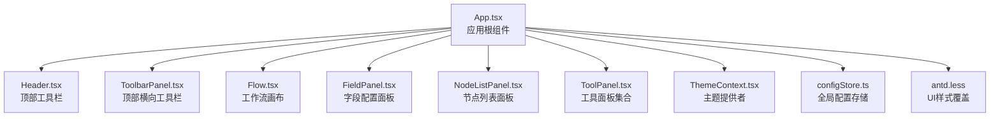
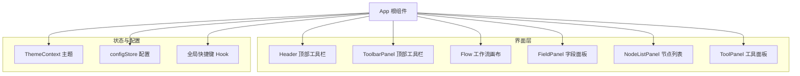
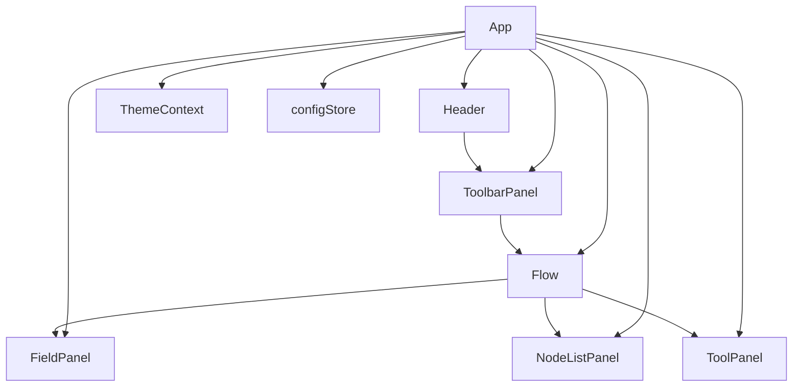
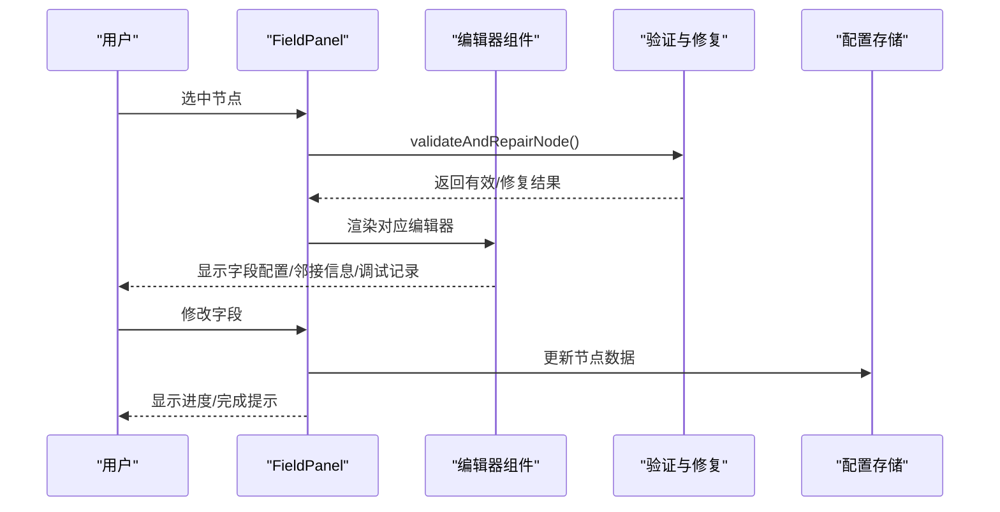
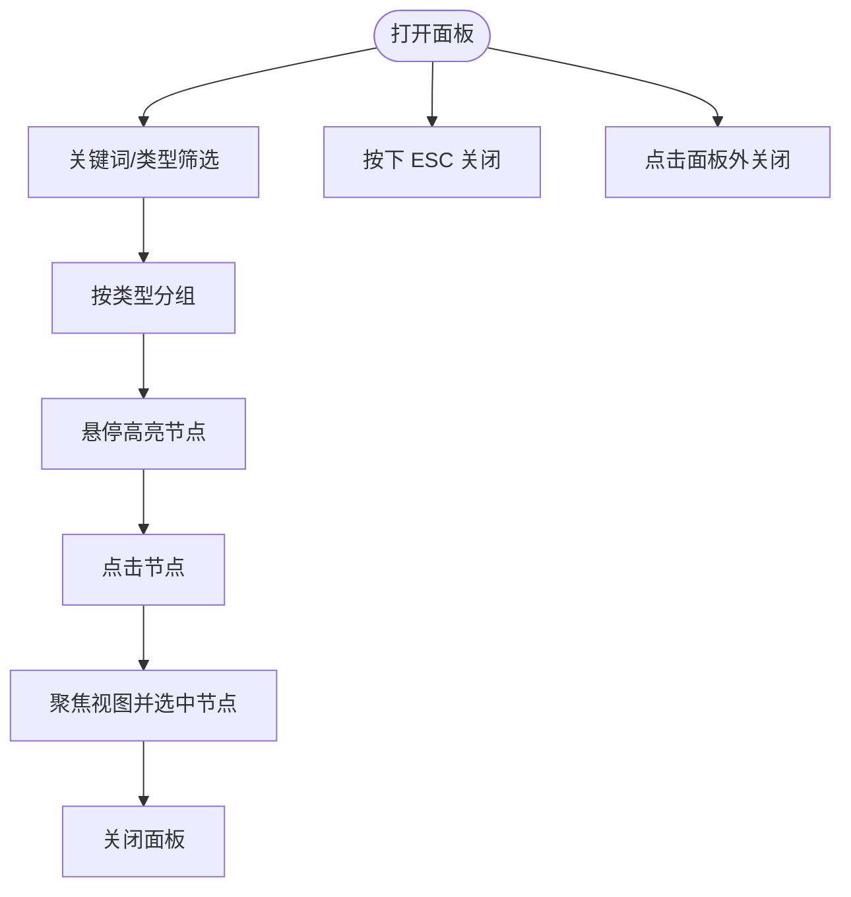
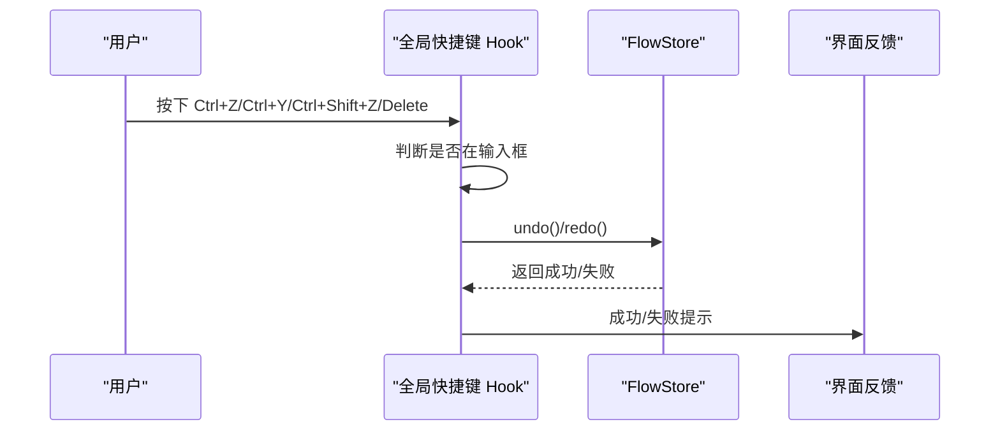
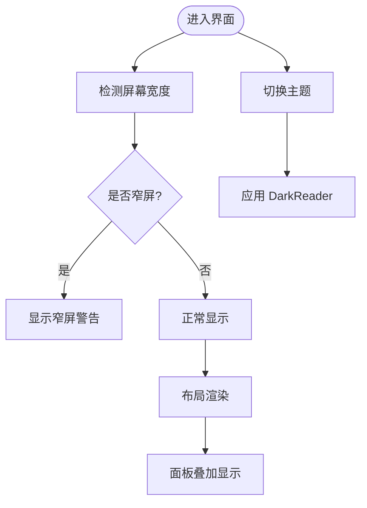
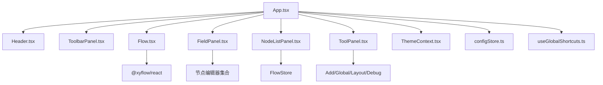

# 用户界面

<cite>
**本文引用的文件**
- [src\App.tsx](file://src\App.tsx)
- [src\main.tsx](file://src\main.tsx)
- [src\styles\App.module.less](file://src\styles\App.module.less)
- [src\components\Header.tsx](file://src\components\Header.tsx)
- [src\components\Flow.tsx](file://src\components\Flow.tsx)
- [src\hooks\useGlobalShortcuts.ts](file://src\hooks\useGlobalShortcuts.ts)
- [src\contexts\ThemeContext.tsx](file://src\contexts\ThemeContext.tsx)
- [src\stores\configStore.ts](file://src\stores\configStore.ts)
- [src\components\panels\main\FieldPanel.tsx](file://src\components\panels\main\FieldPanel.tsx)
- [src\components\panels\main\node-list\NodeListPanel.tsx](file://src\components\panels\main\node-list\NodeListPanel.tsx)
- [src\components\panels\main\ToolbarPanel.tsx](file://src\components\panels\main\ToolbarPanel.tsx)
- [src\components\panels\tools\ToolPanel.tsx](file://src\components\panels\tools\ToolPanel.tsx)
- [src\styles\antd.less](file://src\styles\antd.less)
</cite>

## 目录
1. [简介](#简介)
2. [项目结构](#项目结构)
3. [核心组件](#核心组件)
4. [架构总览](#架构总览)
5. [详细组件分析](#详细组件分析)
6. [依赖关系分析](#依赖关系分析)
7. [性能考虑](#性能考虑)
8. [故障排查指南](#故障排查指南)
9. [结论](#结论)
10. [附录](#附录)

## 简介
本文件为 MaaPipelineEditor 用户界面的综合文档，聚焦于主界面布局、各区域功能与交互、面板体系、快捷键与键盘导航、主题与布局、响应式与定制化、以及视觉设计规范。文档同时面向不同技能水平的用户，提供从入门到进阶的操作指导。

## 项目结构
应用采用 React + TypeScript + Vite 构建，前端样式通过 Less 模块化组织，Ant Design 作为基础 UI 组件库。主入口负责初始化 WebSocket、主题提供者与全局布局；工作流画布基于 @xyflow/react 实现；右侧为多面板体系，涵盖字段配置、节点列表、工具与调试等；顶部工具栏提供导入导出与 JSON 预览；主题通过 DarkReader 动态切换。

**图表来源**
- [src\App.tsx:296-329](file://src\App.tsx#L296-L329)
- [src\components\Header.tsx:279-420](file://src\components\Header.tsx#L279-L420)
- [src\components\Flow.tsx:462-538](file://src\components\Flow.tsx#L462-L538)
- [src\components\panels\main\FieldPanel.tsx:185-521](file://src\components\panels\main\FieldPanel.tsx#L185-L521)
- [src\components\panels\main\node-list\NodeListPanel.tsx:48-395](file://src\components\panels\main\node-list\NodeListPanel.tsx#L48-L395)
- [src\components\panels\tools\ToolPanel.tsx:6-13](file://src\components\panels\tools\ToolPanel.tsx#L6-L13)
- [src\contexts\ThemeContext.tsx:22-55](file://src\contexts\ThemeContext.tsx#L22-L55)
- [src\stores\configStore.ts:163-267](file://src\stores\configStore.ts#L163-L267)
- [src\styles\antd.less:3-46](file://src\styles\antd.less#L3-L46)

**章节来源**
- [src\App.tsx:296-329](file://src\App.tsx#L296-L329)
- [src\styles\App.module.less:1-32](file://src\styles\App.module.less#L1-L32)

## 核心组件
- 应用根组件 App：负责全局事件、WebSocket 连接、主题提供者包裹、文件拖拽导入、调试模式条件渲染等。
- 顶部 Header：版本信息、连接本地服务、设备连接、主题切换、文档与更新日志入口。
- 工作流画布 Flow：基于 @xyflow/react 的画布，支持节点拖拽、连线、磁吸对齐、内嵌字段/边面板、右键菜单、视口持久化。
- 字段配置面板 FieldPanel：按节点类型动态渲染编辑器，支持数据校验与修复、遮罩进度提示、标签页切换。
- 节点列表面板 NodeListPanel：按类型分组展示节点，支持关键词与类型筛选、点击高亮与聚焦。
- 顶部工具栏 ToolbarPanel：导入、导出、JSON 预览按钮集合。
- 工具面板 ToolPanel：包含新增、全局、布局、调试等子面板。
- 主题上下文 ThemeContext：统一管理明暗主题切换与持久化。
- 全局快捷键 Hook：统一处理撤销/重做、Delete 键重定向等。
- 全局配置 Store：集中管理面板、画布、通信、AI 等配置项。

**章节来源**
- [src\components\Header.tsx:226-420](file://src\components\Header.tsx#L226-L420)
- [src\components\Flow.tsx:193-542](file://src\components\Flow.tsx#L193-L542)
- [src\components\panels\main\FieldPanel.tsx:185-521](file://src\components\panels\main\FieldPanel.tsx#L185-L521)
- [src\components\panels\main\node-list\NodeListPanel.tsx:48-395](file://src\components\panels\main\node-list\NodeListPanel.tsx#L48-L395)
- [src\components\panels\main\ToolbarPanel.tsx:11-19](file://src\components\panels\main\ToolbarPanel.tsx#L11-L19)
- [src\components\panels\tools\ToolPanel.tsx:6-13](file://src\components\panels\tools\ToolPanel.tsx#L6-L13)
- [src\contexts\ThemeContext.tsx:22-55](file://src\contexts\ThemeContext.tsx#L22-L55)
- [src\hooks\useGlobalShortcuts.ts:134-146](file://src\hooks\useGlobalShortcuts.ts#L134-L146)
- [src\stores\configStore.ts:163-267](file://src\stores\configStore.ts#L163-L267)

## 架构总览
应用采用“根组件 + 多面板 + 画布 + 主题 + 配置”的分层架构。根组件负责生命周期与全局事件；画布承载节点与连线；右侧面板按需展示；主题与配置贯穿全局。

**图表来源**
- [src\App.tsx:296-329](file://src\App.tsx#L296-L329)
- [src\components\Header.tsx:279-420](file://src\components\Header.tsx#L279-L420)
- [src\components\Flow.tsx:462-538](file://src\components\Flow.tsx#L462-L538)
- [src\components\panels\main\FieldPanel.tsx:185-521](file://src\components\panels\main\FieldPanel.tsx#L185-L521)
- [src\components\panels\main\node-list\NodeListPanel.tsx:48-395](file://src\components\panels\main\node-list\NodeListPanel.tsx#L48-L395)
- [src\components\panels\tools\ToolPanel.tsx:6-13](file://src\components\panels\tools\ToolPanel.tsx#L6-L13)
- [src\contexts\ThemeContext.tsx:22-55](file://src\contexts\ThemeContext.tsx#L22-L55)
- [src\stores\configStore.ts:163-267](file://src\stores\configStore.ts#L163-L267)
- [src\hooks\useGlobalShortcuts.ts:134-146](file://src\hooks\useGlobalShortcuts.ts#L134-L146)

## 详细组件分析

### 主界面布局与区域职责
- 顶部工具栏 Header：包含 Logo、标题、版本标签、连接本地服务、设备连接、主题切换、文档与更新日志入口。支持窄屏告警与版本更新弹窗。
- 顶部工具栏 ToolbarPanel：横向按钮区，提供导入、导出、JSON 预览。
- 工作流画布 Flow：承载节点与连线，支持双击/右键打开节点添加面板、磁吸对齐、分组拖拽、视口持久化、内嵌字段/边面板、右键菜单。
- 字段配置面板 FieldPanel：根据选中节点类型动态渲染编辑器，支持数据校验与修复、遮罩进度提示、标签页切换（字段配置/邻接信息/调试记录）。
- 节点列表面板 NodeListPanel：按类型分组展示节点，支持关键词与类型筛选、点击高亮与聚焦视图。
- 工具面板 ToolPanel：包含新增、全局、布局、调试等子面板，按需显示。
- 主题与配置：ThemeContext 提供明暗主题切换；configStore 统一管理面板、画布、通信、AI 等配置。

**图表来源**
- [src\App.tsx:296-329](file://src\App.tsx#L296-L329)
- [src\components\Header.tsx:279-420](file://src\components\Header.tsx#L279-L420)
- [src\components\Flow.tsx:462-538](file://src\components\Flow.tsx#L462-L538)
- [src\components\panels\main\FieldPanel.tsx:185-521](file://src\components\panels\main\FieldPanel.tsx#L185-L521)
- [src\components\panels\main\node-list\NodeListPanel.tsx:48-395](file://src\components\panels\main\node-list\NodeListPanel.tsx#L48-L395)
- [src\components\panels\tools\ToolPanel.tsx:6-13](file://src\components\panels\tools\ToolPanel.tsx#L6-L13)
- [src\contexts\ThemeContext.tsx:22-55](file://src\contexts\ThemeContext.tsx#L22-L55)
- [src\stores\configStore.ts:163-267](file://src\stores\configStore.ts#L163-L267)

**章节来源**
- [src\components\Header.tsx:226-420](file://src\components\Header.tsx#L226-L420)
- [src\components\Flow.tsx:193-542](file://src\components\Flow.tsx#L193-L542)
- [src\components\panels\main\FieldPanel.tsx:185-521](file://src\components\panels\main\FieldPanel.tsx#L185-L521)
- [src\components\panels\main\node-list\NodeListPanel.tsx:48-395](file://src\components\panels\main\node-list\NodeListPanel.tsx#L48-L395)
- [src\components\panels\main\ToolbarPanel.tsx:11-19](file://src\components\panels\main\ToolbarPanel.tsx#L11-L19)
- [src\components\panels\tools\ToolPanel.tsx:6-13](file://src\components\panels\tools\ToolPanel.tsx#L6-L13)

### 字段配置面板 FieldPanel
- 功能要点
  - 按节点类型动态渲染编辑器（Pipeline/External/Anchor/Sticker/Group）。
  - 数据校验与自动修复：对 Pipeline 节点的 recognition/action/others 结构进行完整性检查与修复。
  - 遮罩进度提示：在复杂编辑过程中显示加载与进度信息。
  - 标签页：字段配置、邻接信息、调试记录（调试模式开启时）。
  - 面板模式：固定/可拖拽/内嵌三种模式，由配置决定。
- 交互流程

**图表来源**
- [src\components\panels\main\FieldPanel.tsx:40-119](file://src\components\panels\main\FieldPanel.tsx#L40-L119)
- [src\components\panels\main\FieldPanel.tsx:240-380](file://src\components\panels\main\FieldPanel.tsx#L240-L380)
- [src\stores\configStore.ts:163-267](file://src\stores\configStore.ts#L163-L267)

**章节来源**
- [src\components\panels\main\FieldPanel.tsx:185-521](file://src\components\panels\main\FieldPanel.tsx#L185-L521)

### 节点列表面板 NodeListPanel
- 功能要点
  - 按类型分组展示节点（Pipeline/External/Anchor/Sticker/Group）。
  - 支持关键词与类型筛选，统计总数与各类别数量。
  - 点击节点高亮并聚焦视图；ESC 关闭；点击外部区域关闭。
  - 基于锚点元素定位，适配窄屏与窗口变化。
- 交互流程

**图表来源**
- [src\components\panels\main\node-list\NodeListPanel.tsx:144-164](file://src\components\panels\main\node-list\NodeListPanel.tsx#L144-L164)
- [src\components\panels\main\node-list\NodeListPanel.tsx:207-232](file://src\components\panels\main\node-list\NodeListPanel.tsx#L207-L232)
- [src\components\panels\main\node-list\NodeListPanel.tsx:294-305](file://src\components\panels\main\node-list\NodeListPanel.tsx#L294-L305)

**章节来源**
- [src\components\panels\main\node-list\NodeListPanel.tsx:48-395](file://src\components\panels\main\node-list\NodeListPanel.tsx#L48-L395)

### 工具面板与快捷键系统
- 工具面板 ToolPanel：包含新增、全局、布局、调试等子面板，按需显示。
- 全局快捷键 Hook：统一处理撤销/重做、Delete 键重定向到 Backspace，避免在编辑器中误删。
- 顶部工具栏 ToolbarPanel：提供导入、导出、JSON 预览按钮。

**图表来源**
- [src\hooks\useGlobalShortcuts.ts:121-126](file://src\hooks\useGlobalShortcuts.ts#L121-L126)
- [src\hooks\useGlobalShortcuts.ts:57-116](file://src\hooks\useGlobalShortcuts.ts#L57-L116)

**章节来源**
- [src\components\panels\tools\ToolPanel.tsx:6-13](file://src\components\panels\tools\ToolPanel.tsx#L6-L13)
- [src\hooks\useGlobalShortcuts.ts:134-146](file://src\hooks\useGlobalShortcuts.ts#L134-L146)
- [src\components\panels\main\ToolbarPanel.tsx:11-19](file://src\components\panels\main\ToolbarPanel.tsx#L11-L19)

### 主题切换、布局与响应式
- 主题切换：ThemeContext 通过 DarkReader 动态启用/禁用深色模式，并与配置存储联动。
- 布局：App 根容器采用 Flex 布局，Header 固定顶部，Content 区域自适应，工作区相对定位，右侧面板按需叠加。
- 响应式：Header 在窄屏时显示警告提示；节点列表面板基于锚点元素定位并随窗口变化调整位置与高度。
- UI 样式覆盖：antd.less 对标签页与通知等组件进行样式微调。

**图表来源**
- [src\components\Header.tsx:256-265](file://src\components\Header.tsx#L256-L265)
- [src\components\Header.tsx:281-290](file://src\components\Header.tsx#L281-L290)
- [src\contexts\ThemeContext.tsx:27-37](file://src\contexts\ThemeContext.tsx#L27-L37)
- [src\styles\App.module.less:1-32](file://src\styles\App.module.less#L1-L32)
- [src\styles\antd.less:3-46](file://src\styles\antd.less#L3-L46)

**章节来源**
- [src\contexts\ThemeContext.tsx:22-55](file://src\contexts\ThemeContext.tsx#L22-L55)
- [src\styles\App.module.less:1-32](file://src\styles\App.module.less#L1-L32)
- [src\components\Header.tsx:226-420](file://src\components\Header.tsx#L226-L420)
- [src\styles\antd.less:3-46](file://src\styles\antd.less#L3-L46)

### 界面定制化与设置
- 配置分类：面板、Pipeline、通信、AI 四大类，涵盖节点样式、边标签、实时预览、磁吸对齐、画布背景、字段面板模式、内嵌面板缩放、跨文件搜索、WebSocket 连接等。
- 配置联动：如 configHandlingMode 与 isExportConfig 的双向同步；默认句柄方向、导出协议版本、JSON 缩进等。
- 状态管理：status 中包含面板显示状态与右侧面板宽度等。

**章节来源**
- [src\stores\configStore.ts:17-62](file://src\stores\configStore.ts#L17-L62)
- [src\stores\configStore.ts:95-161](file://src\stores\configStore.ts#L95-L161)
- [src\stores\configStore.ts:255-267](file://src\stores\configStore.ts#L255-L267)

### 视觉设计指南
- 颜色与主题：通过 ThemeContext 控制明暗主题，深色模式使用 DarkReader 参数调节亮度、对比度与色偏。
- 图标：使用 Ant Design 图标与自定义 IconFont，确保一致的交互视觉反馈。
- 字体与排版：遵循 Ant Design 默认排版，标签页与通知等组件样式在 antd.less 中进行微调。
- 面板与画布：FieldPanel 支持固定/可拖拽/内嵌三种模式；画布背景支持纯色与护眼两种模式；磁吸对齐与仅视口内吸附提升布局效率。

**章节来源**
- [src\contexts\ThemeContext.tsx:27-37](file://src\contexts\ThemeContext.tsx#L27-L37)
- [src\components\Flow.tsx:432-436](file://src\components\Flow.tsx#L432-L436)
- [src\stores\configStore.ts:193-211](file://src\stores\configStore.ts#L193-L211)
- [src\styles\antd.less:3-46](file://src\styles\antd.less#L3-L46)

## 依赖关系分析
- 组件耦合
  - App 作为根组件，依赖 Header、ToolbarPanel、Flow、FieldPanel、NodeListPanel、ToolPanel、ThemeContext、configStore、全局快捷键 Hook。
  - Flow 依赖 @xyflow/react、节点与边类型注册、磁吸工具与视口变更监听。
  - FieldPanel 依赖节点编辑器集合、配置存储、调试存储、工具栏状态。
  - NodeListPanel 依赖 FlowStore 节点与边数据、实例聚焦能力。
- 外部依赖
  - @xyflow/react：画布与交互。
  - Ant Design：基础 UI 组件与样式。
  - DarkReader：主题切换。
  - Zustand：状态管理。

**图表来源**
- [src\App.tsx:296-329](file://src\App.tsx#L296-L329)
- [src\components\Flow.tsx:13-25](file://src\components\Flow.tsx#L13-L25)
- [src\components\panels\main\FieldPanel.tsx:26-31](file://src\components\panels\main\FieldPanel.tsx#L26-L31)
- [src\components\panels\main\node-list\NodeListPanel.tsx:17-25](file://src\components\panels\main\node-list\NodeListPanel.tsx#L17-L25)
- [src\components\panels\tools\ToolPanel.tsx:1-4](file://src\components\panels\tools\ToolPanel.tsx#L1-L4)
- [src\hooks\useGlobalShortcuts.ts:1-4](file://src\hooks\useGlobalShortcuts.ts#L1-L4)

**章节来源**
- [src\App.tsx:296-329](file://src\App.tsx#L296-L329)
- [src\components\Flow.tsx:13-25](file://src\components\Flow.tsx#L13-L25)

## 性能考虑
- 画布渲染优化
  - 使用 ResizeObserver 与防抖更新画布尺寸，减少频繁重绘。
  - 视口变更时仅保存必要配置，避免全量状态写入。
- 状态更新节流
  - 字段面板与节点变更采用防抖保存，降低本地存储压力。
- 磁吸对齐
  - 仅在启用磁吸时计算对齐，且可限制在视口范围内，减少计算量。
- 面板懒加载
  - 字段面板在节点选中时才渲染对应编辑器，避免不必要的组件挂载。

**章节来源**
- [src\components\Flow.tsx:438-459](file://src\components\Flow.tsx#L438-L459)
- [src\components\Flow.tsx:131-144](file://src\components\Flow.tsx#L131-L144)
- [src\components\Flow.tsx:296-329](file://src\components\Flow.tsx#L296-L329)
- [src\components\panels\main\FieldPanel.tsx:240-380](file://src\components\panels\main\FieldPanel.tsx#L240-L380)

## 故障排查指南
- 本地服务连接问题
  - 检查 Header 中连接按钮状态与 WebSocket 连接状态；确认端口配置与自动连接设置。
- 节点数据损坏
  - FieldPanel 提供数据校验与修复提示；若无法修复，建议删除节点并重建。
- 磁吸对齐无效
  - 检查配置中“启用节点磁吸”与“仅视口内吸附”开关；确认节点数量与视口范围。
- 窄屏显示异常
  - Header 会在窄屏时显示警告；建议增大浏览器窗口或使用更大屏幕。
- 快捷键冲突
  - 全局快捷键在输入框中会被忽略；Delete 键会重定向为 Backspace。

**章节来源**
- [src\components\Header.tsx:67-159](file://src\components\Header.tsx#L67-L159)
- [src\components\panels\main\FieldPanel.tsx:40-119](file://src\components\panels\main\FieldPanel.tsx#L40-L119)
- [src\components\Flow.tsx:226-231](file://src\components\Flow.tsx#L226-L231)
- [src\components\Header.tsx:281-290](file://src\components\Header.tsx#L281-L290)
- [src\hooks\useGlobalShortcuts.ts:8-14](file://src\hooks\useGlobalShortcuts.ts#L8-L14)

## 结论
MaaPipelineEditor 的用户界面以清晰的布局与强大的可定制性为核心，结合主题切换、响应式设计与丰富的面板体系，满足从初学者到高级用户的多样化需求。通过统一的状态与配置管理、高效的画布渲染与磁吸对齐机制，以及完善的快捷键与错误处理，整体用户体验流畅且高效。

## 附录
- 快捷键一览
  - 撤销：Ctrl+Z（或 Meta+Z）
  - 重做：Ctrl+Y 或 Ctrl+Shift+Z
  - Delete 键：重定向为 Backspace
- 常用配置项
  - 面板模式：固定/可拖拽/内嵌
  - 画布背景：纯色/护眼
  - 磁吸对齐：启用/仅视口内
  - 实时预览：开启/关闭
  - 跨文件搜索：开启/关闭