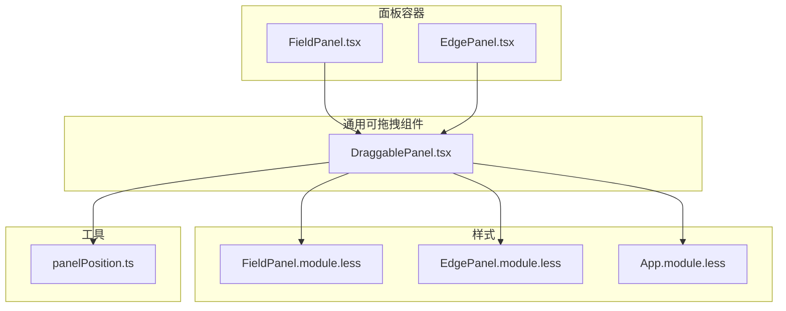
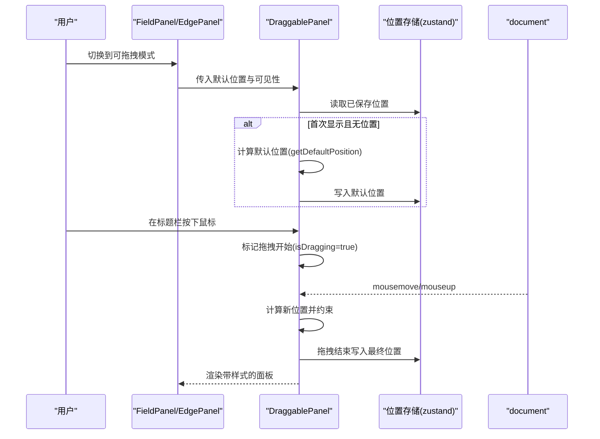
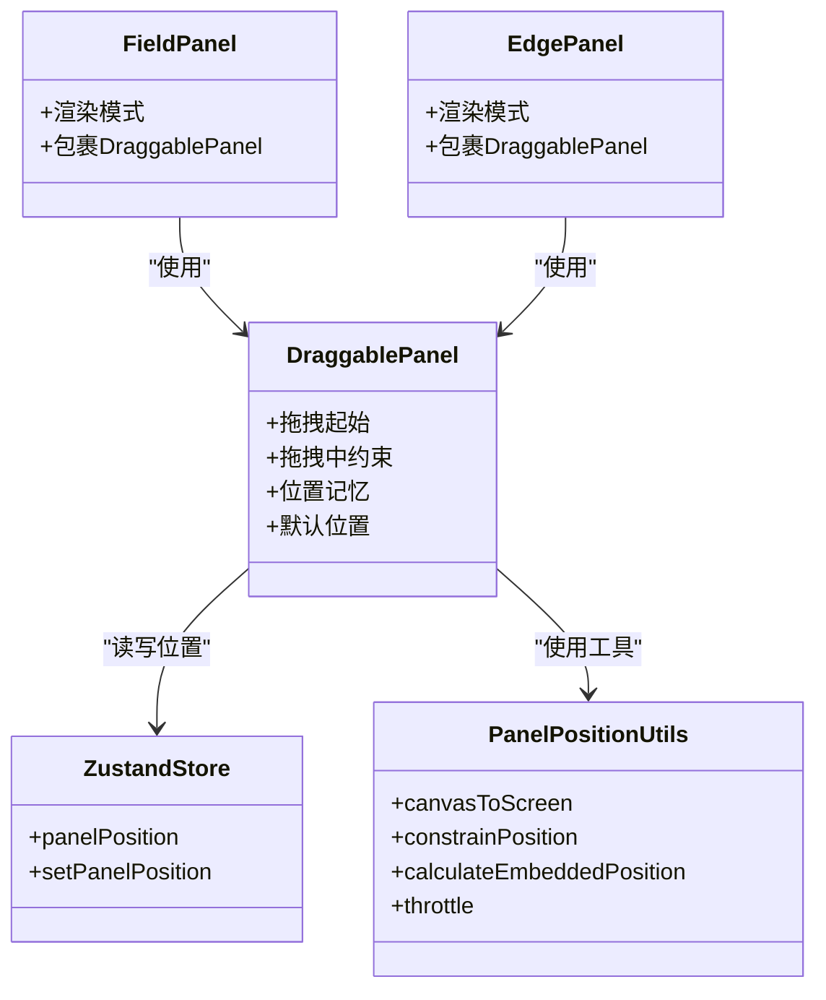

# 可拖拽面板

<cite>
**本文引用的文件**
- [DraggablePanel.tsx](file://src/components/panels/common/DraggablePanel.tsx)
- [FieldPanel.tsx](file://src/components/panels/main/FieldPanel.tsx)
- [EdgePanel.tsx](file://src/components/panels/main/EdgePanel.tsx)
- [FieldPanel.module.less](file://src/styles/FieldPanel.module.less)
- [EdgePanel.module.less](file://src/styles/EdgePanel.module.less)
- [App.module.less](file://src/styles/App.module.less)
- [panelPosition.ts](file://src/utils/panelPosition.ts)
</cite>

## 目录
1. [简介](#简介)
2. [项目结构](#项目结构)
3. [核心组件](#核心组件)
4. [架构总览](#架构总览)
5. [详细组件分析](#详细组件分析)
6. [依赖关系分析](#依赖关系分析)
7. [性能考量](#性能考量)
8. [故障排查指南](#故障排查指南)
9. [结论](#结论)

## 简介
本文件系统性阐述“可拖拽面板”的设计理念与实现机制，覆盖拖拽、缩放、定位与布局管理；重点解析 DraggablePanel 组件的拖拽移动、位置记忆与恢复、边界约束、样式与动画、以及与主界面的集成方式（含 Z-index、遮挡与响应式适配）。同时给出配置项与自定义参数建议、性能优化策略（重绘优化、事件节流、内存管理）、移动端支持方案与不同屏幕尺寸的适配策略。

## 项目结构
可拖拽面板主要由以下部分组成：
- 通用可拖拽包装组件：DraggablePanel
- 主面板容器：FieldPanel、EdgePanel
- 样式系统：FieldPanel.module.less、EdgePanel.module.less、App.module.less
- 位置计算与约束工具：panelPosition.ts

图表来源
- [DraggablePanel.tsx:1-178](file://src/components/panels/common/DraggablePanel.tsx#L1-L178)
- [FieldPanel.tsx:506-523](file://src/components/panels/main/FieldPanel.tsx#L506-L523)
- [EdgePanel.tsx:263-278](file://src/components/panels/main/EdgePanel.tsx#L263-L278)
- [FieldPanel.module.less:1-206](file://src/styles/FieldPanel.module.less#L1-L206)
- [EdgePanel.module.less:1-98](file://src/styles/EdgePanel.module.less#L1-L98)
- [App.module.less:1-31](file://src/styles/App.module.less#L1-L31)
- [panelPosition.ts:1-263](file://src/utils/panelPosition.ts#L1-L263)

章节来源
- [DraggablePanel.tsx:1-178](file://src/components/panels/common/DraggablePanel.tsx#L1-L178)
- [FieldPanel.tsx:506-523](file://src/components/panels/main/FieldPanel.tsx#L506-L523)
- [EdgePanel.tsx:263-278](file://src/components/panels/main/EdgePanel.tsx#L263-L278)
- [FieldPanel.module.less:1-206](file://src/styles/FieldPanel.module.less#L1-L206)
- [EdgePanel.module.less:1-98](file://src/styles/EdgePanel.module.less#L1-L98)
- [App.module.less:1-31](file://src/styles/App.module.less#L1-L31)
- [panelPosition.ts:1-263](file://src/utils/panelPosition.ts#L1-L263)

## 核心组件
- DraggablePanel：提供拖拽、边界约束、位置记忆与恢复、鼠标样式反馈等能力，作为通用包装组件被 FieldPanel/EdgePanel 使用。
- FieldPanel/EdgePanel：根据当前模式（内联/可拖拽/静态）决定是否包裹 DraggablePanel，并传入默认位置与尺寸参数。
- 样式模块：分别定义面板尺寸、圆角、阴影、动画、滚动条等外观与行为。
- 位置工具：提供画布坐标与屏幕坐标转换、边界约束、嵌入跟随模式下的位置计算、节流工具等。

章节来源
- [DraggablePanel.tsx:24-31](file://src/components/panels/common/DraggablePanel.tsx#L24-L31)
- [FieldPanel.tsx:506-523](file://src/components/panels/main/FieldPanel.tsx#L506-L523)
- [EdgePanel.tsx:263-278](file://src/components/panels/main/EdgePanel.tsx#L263-L278)
- [FieldPanel.module.less:4-12](file://src/styles/FieldPanel.module.less#L4-L12)
- [EdgePanel.module.less:4-12](file://src/styles/EdgePanel.module.less#L4-L12)
- [panelPosition.ts:15-42](file://src/utils/panelPosition.ts#L15-L42)

## 架构总览
可拖拽面板的运行时控制流如下：
- 初始化阶段：当面板可见且未记录位置时，使用 requestAnimationFrame 延迟计算默认位置并写入全局位置存储。
- 拖拽阶段：仅在标题栏区域触发拖拽；拖拽过程中实时计算新位置并在边界内约束；拖拽结束时将最终位置写回存储。
- 渲染阶段：根据当前位置或默认位置生成内联样式，结合类名与鼠标样式提供视觉反馈。

图表来源
- [DraggablePanel.tsx:74-81](file://src/components/panels/common/DraggablePanel.tsx#L74-L81)
- [DraggablePanel.tsx:84-100](file://src/components/panels/common/DraggablePanel.tsx#L84-L100)
- [DraggablePanel.tsx:106-146](file://src/components/panels/common/DraggablePanel.tsx#L106-L146)
- [DraggablePanel.tsx:130-137](file://src/components/panels/common/DraggablePanel.tsx#L130-L137)
- [DraggablePanel.tsx:149-169](file://src/components/panels/common/DraggablePanel.tsx#L149-L169)

## 详细组件分析

### DraggablePanel 组件
- 功能要点
  - 仅在标题栏区域触发拖拽，避免误触按钮。
  - 拖拽过程实时计算相对位移并进行边界约束，保证面板始终在可视区域内。
  - 支持默认位置与记忆位置的优先级：记忆位置优先，不存在则使用默认位置。
  - 提供拖拽中的视觉反馈（类名与鼠标样式）。
  - 使用全局状态存储位置，实现跨面板共享与持久化基础。

- 关键实现路径
  - 默认位置计算与初始化写入：[getDefaultPosition:62-71](file://src/components/panels/common/DraggablePanel.tsx#L62-L71)，[useEffect 初始化:74-81](file://src/components/panels/common/DraggablePanel.tsx#L74-L81)
  - 拖拽起始与拦截逻辑：[handleMouseDown:84-100](file://src/components/panels/common/DraggablePanel.tsx#L84-L100)
  - 拖拽中事件监听与边界约束：[useEffect 监听拖拽:103-146](file://src/components/panels/common/DraggablePanel.tsx#L103-L146)
  - 位置样式应用与类名切换：[位置样式计算:149-169](file://src/components/panels/common/DraggablePanel.tsx#L149-L169)

- 边界约束与记忆
  - 边界约束：基于面板尺寸与窗口尺寸计算最大/最小坐标，防止面板移出可视区。
  - 位置记忆：通过 zustand store 存储最近一次拖拽结束的位置，下次显示时优先使用。

- 样式与动画
  - 类名“dragging”用于在拖拽时切换视觉状态。
  - 鼠标样式在拖拽时变为抓取样式，提升交互反馈。
  - 面板尺寸与圆角、阴影等由对应模块样式定义。

- 与主界面集成
  - 采用绝对定位，配合主界面容器的层级管理，避免遮挡底层内容。
  - 通过默认位置参数控制初始出现位置，便于与主界面布局协调。

章节来源
- [DraggablePanel.tsx:37-177](file://src/components/panels/common/DraggablePanel.tsx#L37-L177)

### FieldPanel 与 EdgePanel 的集成
- 模式判断与渲染
  - 当模式为“内联”时，直接渲染为内联面板；当模式为“可拖拽”时，用 DraggablePanel 包裹；否则渲染为静态面板。
- 默认位置传递
  - 两者均向 DraggablePanel 传入默认右间距与顶部间距，确保首次出现位置一致。

- 关键调用路径
  - FieldPanel 可拖拽模式渲染：[渲染分支:506-523](file://src/components/panels/main/FieldPanel.tsx#L506-L523)
  - EdgePanel 可拖拽模式渲染：[渲染分支:263-278](file://src/components/panels/main/EdgePanel.tsx#L263-L278)

章节来源
- [FieldPanel.tsx:506-523](file://src/components/panels/main/FieldPanel.tsx#L506-L523)
- [EdgePanel.tsx:263-278](file://src/components/panels/main/EdgePanel.tsx#L263-L278)

### 样式系统与动画
- 面板外观
  - FieldPanel：固定宽度、最大高度、圆角、阴影、滚动条等，满足字段编辑场景的可读性与操作性。
  - EdgePanel：紧凑宽度、最大高度、列表项排版与描述文本样式，适合连接属性查看与编辑。
- 动画与过渡
  - 样式模块中包含淡入动画与过渡，提升面板显隐的顺滑度。
- 主界面容器
  - App.module.less 定义了主容器、内容区与工作区的层级关系，为面板的遮挡与层级管理提供基础。

章节来源
- [FieldPanel.module.less:4-12](file://src/styles/FieldPanel.module.less#L4-L12)
- [EdgePanel.module.less:4-12](file://src/styles/EdgePanel.module.less#L4-L12)
- [App.module.less:1-31](file://src/styles/App.module.less#L1-L31)

### 位置计算与约束工具
- 坐标转换
  - 画布坐标与屏幕坐标之间的双向转换，用于在不同坐标系间定位面板。
- 边界约束
  - 对面板位置进行上下左右边界约束，确保面板始终在可视区域内，且满足最小可见尺寸要求。
- 嵌入跟随模式
  - 针对节点/连接的嵌入跟随模式，计算面板在目标元素周边的最佳显示位置，并考虑容器边界与留白。
- 节流工具
  - 提供节流函数，可用于高频事件（如窗口尺寸变化、滚动）的性能优化。

章节来源
- [panelPosition.ts:15-42](file://src/utils/panelPosition.ts#L15-L42)
- [panelPosition.ts:56-79](file://src/utils/panelPosition.ts#L56-L79)
- [panelPosition.ts:93-157](file://src/utils/panelPosition.ts#L93-L157)
- [panelPosition.ts:171-231](file://src/utils/panelPosition.ts#L171-L231)
- [panelPosition.ts:239-262](file://src/utils/panelPosition.ts#L239-L262)

## 依赖关系分析
- 组件耦合
  - FieldPanel/EdgePanel 依赖 DraggablePanel 实现拖拽与位置记忆。
  - DraggablePanel 依赖 zustand store 进行位置持久化。
  - DraggablePanel 依赖 panelPosition 工具进行坐标转换与边界约束。
- 外部依赖
  - React（memo、useEffect、useState、useRef、useCallback）
  - zustand（状态存储）
  - 浏览器事件模型（mousedown/mousemove/mouseup）

图表来源
- [FieldPanel.tsx:506-523](file://src/components/panels/main/FieldPanel.tsx#L506-L523)
- [EdgePanel.tsx:263-278](file://src/components/panels/main/EdgePanel.tsx#L263-L278)
- [DraggablePanel.tsx:19-22](file://src/components/panels/common/DraggablePanel.tsx#L19-L22)
- [DraggablePanel.tsx:62-71](file://src/components/panels/common/DraggablePanel.tsx#L62-L71)
- [panelPosition.ts:15-42](file://src/utils/panelPosition.ts#L15-L42)
- [panelPosition.ts:56-79](file://src/utils/panelPosition.ts#L56-L79)
- [panelPosition.ts:93-157](file://src/utils/panelPosition.ts#L93-L157)
- [panelPosition.ts:239-262](file://src/utils/panelPosition.ts#L239-L262)

## 性能考量
- 重绘优化
  - 使用 React.memo 包装 DraggablePanel，避免不必要的重渲染。
  - 仅在拖拽状态改变时更新类名与鼠标样式，减少样式变更频率。
- 事件节流
  - panelPosition.ts 提供 throttle 工具，可在高频事件（如窗口尺寸变化、滚动）中使用，降低回调频率。
- 内存管理
  - 拖拽事件监听在 useEffect 中注册与清理，确保组件卸载时移除监听，避免内存泄漏。
  - 使用 requestAnimationFrame 延迟初始化默认位置，避免阻塞首屏渲染。
- 帧率控制
  - 可结合 requestAnimationFrame 或节流工具控制拖拽过程中的计算频率，减少主线程压力。

章节来源
- [DraggablePanel.tsx:37-45](file://src/components/panels/common/DraggablePanel.tsx#L37-L45)
- [DraggablePanel.tsx:103-146](file://src/components/panels/common/DraggablePanel.tsx#L103-L146)
- [DraggablePanel.tsx:74-81](file://src/components/panels/common/DraggablePanel.tsx#L74-L81)
- [panelPosition.ts:239-262](file://src/utils/panelPosition.ts#L239-L262)

## 故障排查指南
- 面板无法拖拽
  - 检查是否在标题栏区域触发拖拽（非标题栏区域会被拦截）。
  - 确认 DraggablePanel 的默认位置是否正确计算，避免初始位置异常导致不可见。
- 面板拖出边界
  - 检查边界约束逻辑是否生效，确认面板尺寸与窗口尺寸计算正确。
- 位置记忆失效
  - 确认 zustand store 是否正常写入与读取，检查拖拽结束时的写入时机。
- 遮挡与层级问题
  - 检查主界面容器层级（App.module.less），确保面板层级合理，避免被其他元素遮挡。
- 移动端体验差
  - 当前实现基于鼠标事件，移动端触摸支持需扩展（见后续移动端支持建议）。

章节来源
- [DraggablePanel.tsx:84-100](file://src/components/panels/common/DraggablePanel.tsx#L84-L100)
- [DraggablePanel.tsx:113-128](file://src/components/panels/common/DraggablePanel.tsx#L113-L128)
- [DraggablePanel.tsx:130-137](file://src/components/panels/common/DraggablePanel.tsx#L130-L137)
- [App.module.less:11-15](file://src/styles/App.module.less#L11-L15)

## 结论
可拖拽面板通过 DraggablePanel 提供了稳定、可复用的拖拽与位置记忆能力，并与 FieldPanel/EdgePanel 紧密协作，形成统一的面板交互体系。配合样式模块与位置工具，实现了良好的视觉反馈与边界约束。建议在后续版本中补充移动端触摸支持、尺寸调整与最小化/最大化切换能力，进一步完善用户体验。