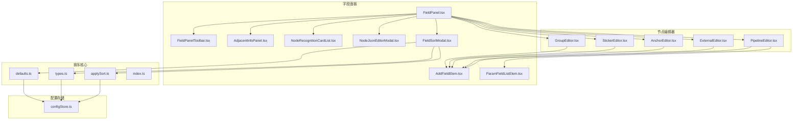
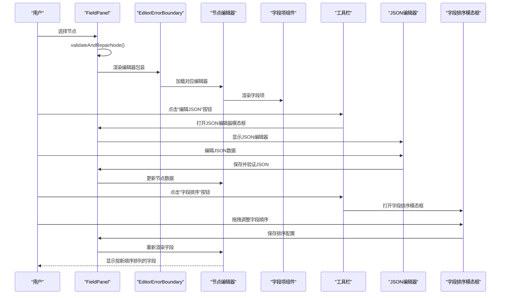
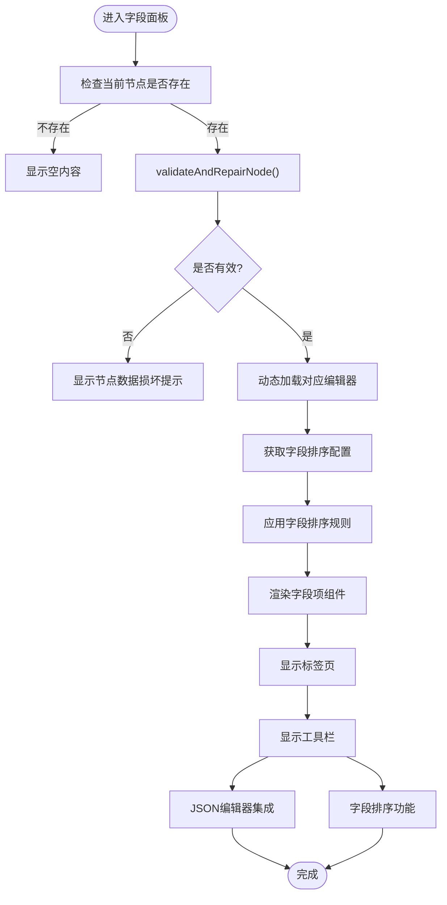
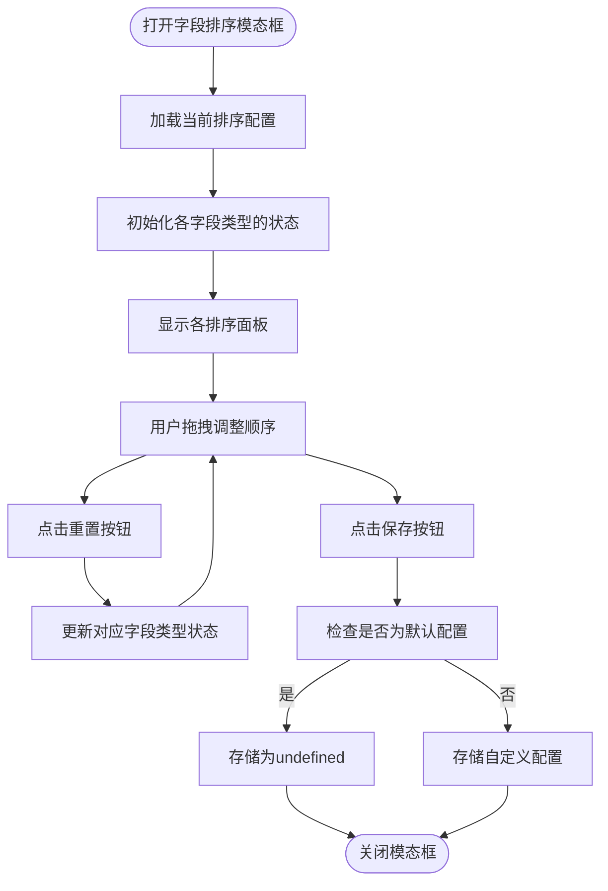
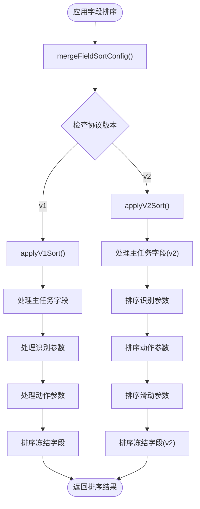
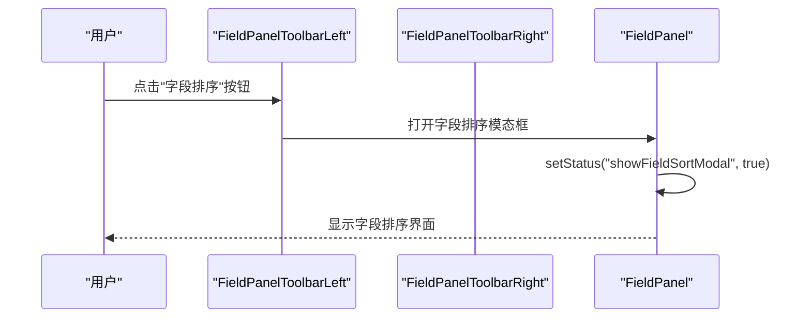
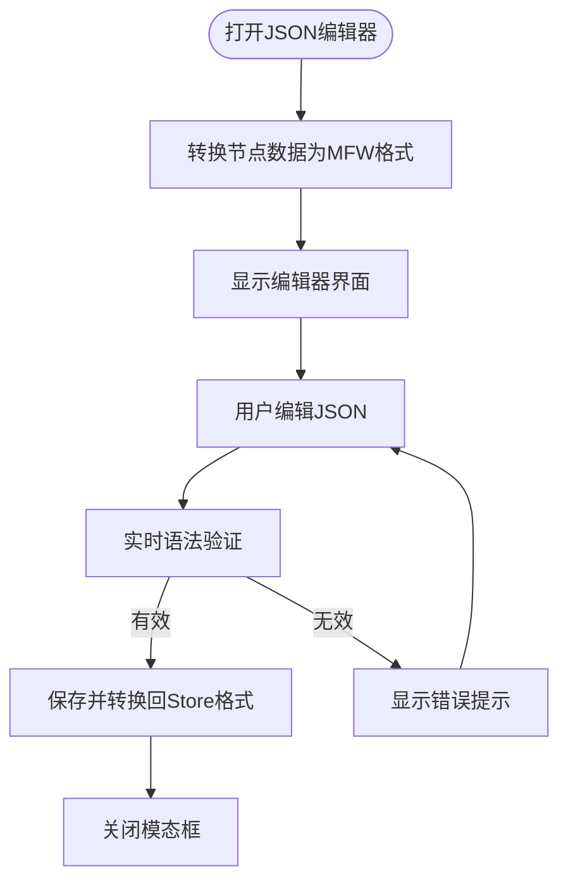
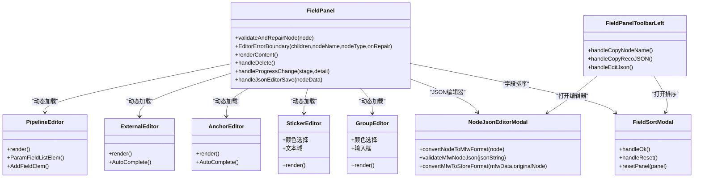
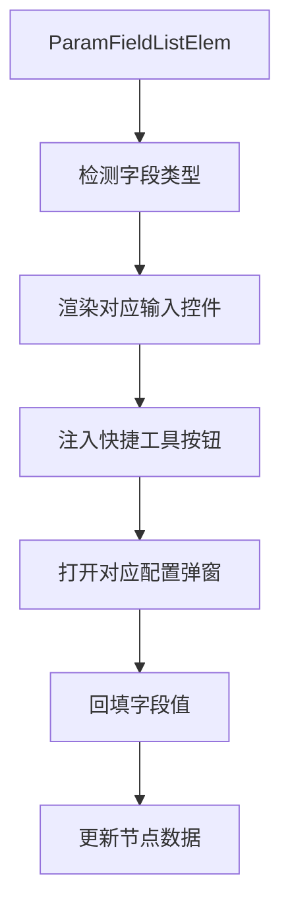
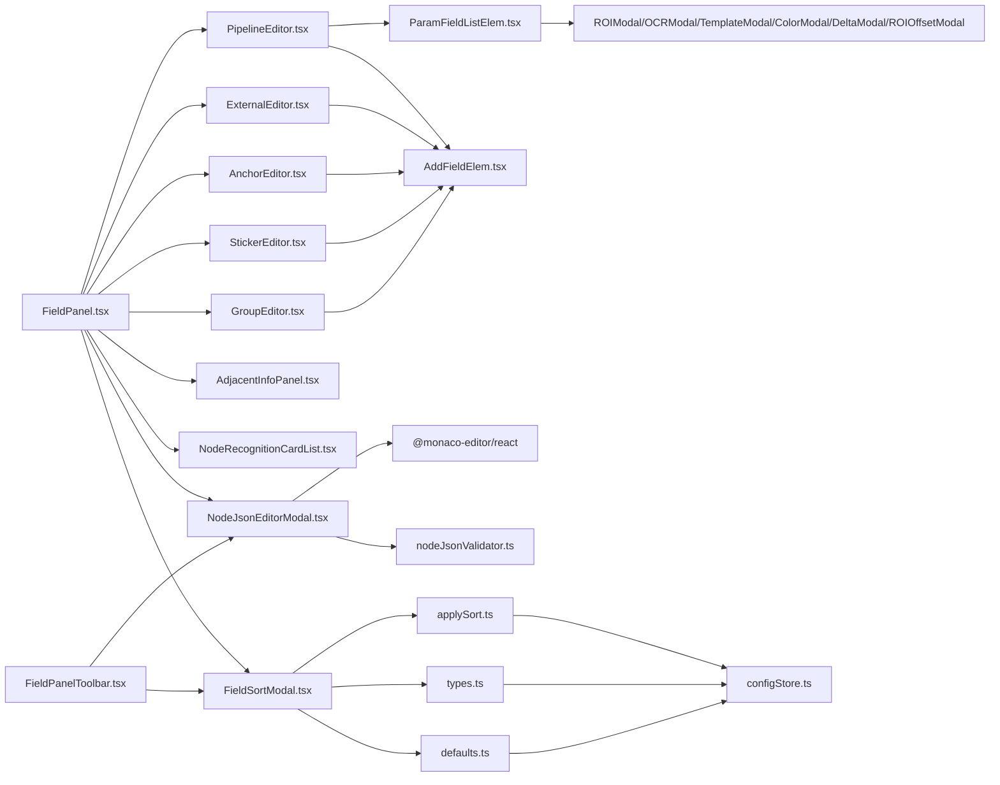

# 字段面板

<cite>
**本文档引用的文件**
- [FieldPanel.tsx](file://src/components/panels/main/FieldPanel.tsx)
- [FieldPanelToolbar.tsx](file://src/components/panels/field/tools/FieldPanelToolbar.tsx)
- [NodeJsonEditorModal.tsx](file://src/components/modals/NodeJsonEditorModal.tsx)
- [PipelineEditor.tsx](file://src/components/panels/node-editors/PipelineEditor.tsx)
- [ExternalEditor.tsx](file://src/components/panels/node-editors/ExternalEditor.tsx)
- [AnchorEditor.tsx](file://src/components/panels/node-editors/AnchorEditor.tsx)
- [StickerEditor.tsx](file://src/components/panels/node-editors/StickerEditor.tsx)
- [GroupEditor.tsx](file://src/components/panels/node-editors/GroupEditor.tsx)
- [AdjacentInfoPanel.tsx](file://src/components/panels/main/AdjacentInfoPanel.tsx)
- [NodeRecognitionCardList.tsx](file://src/components/panels/tools/NodeRecognitionCardList.tsx)
- [FieldPanel.module.less](file://src/styles/FieldPanel.module.less)
- [AddFieldElem.tsx](file://src/components/panels/field/items/AddFieldElem.tsx)
- [ParamFieldListElem.tsx](file://src/components/panels/field/items/ParamFieldListElem.tsx)
- [FieldSortModal.tsx](file://src/components/modals/FieldSortModal.tsx)
- [FieldSortModal.module.less](file://src/styles/FieldSortModal.module.less)
- [index.ts](file://src/components/panels/field/items/index.ts)
- [index.ts](file://src/components/panels/field/tools/index.ts)
- [nodeJsonValidator.ts](file://src/utils/nodeJsonValidator.ts)
- [IconJson.tsx](file://src/components/iconfonts/IconJson.tsx)
- [IconA11Maodian1.tsx](file://src/components/iconfonts/IconA11Maodian1.tsx)
- [IconA11Maodian2.tsx](file://src/components/iconfonts/IconA11Maodian2.tsx)
- [applySort.ts](file://src/core/sorting/applySort.ts)
- [types.ts](file://src/core/sorting/types.ts)
- [defaults.ts](file://src/core/sorting/defaults.ts)
- [index.ts](file://src/core/sorting/index.ts)
- [configStore.ts](file://src/stores/configStore.ts)
</cite>

## 更新摘要
**变更内容**
- 新增字段排序配置功能，支持自定义字段显示顺序
- 新增字段排序模态框，提供拖拽式排序界面
- 新增字段排序配置的默认值和合并机制
- 新增字段排序的协议版本兼容性支持
- 新增字段排序的MPE特色字段处理机制

## 目录
1. [简介](#简介)
2. [项目结构](#项目结构)
3. [核心组件](#核心组件)
4. [架构总览](#架构总览)
5. [详细组件分析](#详细组件分析)
6. [依赖关系分析](#依赖关系分析)
7. [性能考虑](#性能考虑)
8. [故障排查指南](#故障排查指南)
9. [结论](#结论)
10. [附录](#附录)

## 简介
字段面板是可视化流程编辑器中的关键交互区域，负责展示并编辑当前选中节点的所有参数字段。它支持多种节点类型（Pipeline、External、Anchor、Sticker、Group），通过动态加载对应编辑器组件实现参数配置；内置字段验证与自动修复机制，保障节点数据完整性；提供邻接信息与调试记录两个扩展标签页（调试模式下），帮助用户理解节点在流程中的位置与识别历史；并通过工具栏提供节点删除、进度显示、数据修复等实用功能。**新增的字段排序功能**允许用户自定义字段显示顺序，通过拖拽方式调整字段排列，提升编辑效率和用户体验。

## 项目结构
字段面板相关代码主要分布在以下目录：
- 主面板：src/components/panels/main/FieldPanel.tsx
- 节点编辑器：src/components/panels/node-editors/*.tsx
- 字段项组件：src/components/panels/field/items/*.tsx
- 工具栏：src/components/panels/field/tools/FieldPanelToolbar.tsx
- JSON编辑器模态框：src/components/modals/NodeJsonEditorModal.tsx
- **字段排序模态框**：src/components/modals/FieldSortModal.tsx
- 邻接信息：src/components/panels/main/AdjacentInfoPanel.tsx
- 调试记录：src/components/panels/tools/NodeRecognitionCardList.tsx
- 样式：src/styles/FieldPanel.module.less
- **排序核心模块**：src/core/sorting/*
- **配置存储**：src/stores/configStore.ts
- JSON验证工具：src/utils/nodeJsonValidator.ts

**图表来源**
- [FieldPanel.tsx:185-573](file://src/components/panels/main/FieldPanel.tsx#L185-L573)
- [FieldPanelToolbar.tsx:1-259](file://src/components/panels/field/tools/FieldPanelToolbar.tsx#L1-L259)
- [NodeJsonEditorModal.tsx:1-320](file://src/components/modals/NodeJsonEditorModal.tsx#L1-L320)
- [FieldSortModal.tsx:1-362](file://src/components/modals/FieldSortModal.tsx#L1-L362)
- [PipelineEditor.tsx:1-949](file://src/components/panels/node-editors/PipelineEditor.tsx#L1-L949)
- [ExternalEditor.tsx:1-106](file://src/components/panels/node-editors/ExternalEditor.tsx#L1-L106)
- [AnchorEditor.tsx:1-106](file://src/components/panels/node-editors/AnchorEditor.tsx#L1-L106)
- [StickerEditor.tsx:1-132](file://src/components/panels/node-editors/StickerEditor.tsx#L1-L132)
- [GroupEditor.tsx:1-97](file://src/components/panels/node-editors/GroupEditor.tsx#L1-L97)
- [AdjacentInfoPanel.tsx:1-344](file://src/components/panels/main/AdjacentInfoPanel.tsx#L1-L344)
- [NodeRecognitionCardList.tsx:1-359](file://src/components/panels/tools/NodeRecognitionCardList.tsx#L1-L359)
- [applySort.ts:1-341](file://src/core/sorting/applySort.ts#L1-L341)
- [types.ts:1-28](file://src/core/sorting/types.ts#L1-L28)
- [defaults.ts:1-152](file://src/core/sorting/defaults.ts#L1-L152)
- [configStore.ts:153-154](file://src/stores/configStore.ts#L153-L154)

**章节来源**
- [FieldPanel.tsx:1-573](file://src/components/panels/main/FieldPanel.tsx#L1-L573)
- [FieldPanel.module.less:1-206](file://src/styles/FieldPanel.module.less#L1-L206)

## 核心组件
- 字段面板主体：负责节点选择、编辑器动态加载、验证与修复、标签页管理、工具栏集成与遮罩进度显示。
- 节点编辑器：针对不同节点类型提供专用字段编辑界面。
- 字段项组件：通用字段渲染与快捷工具（如ROI、OCR、模板、颜色、位移差值等）。
- 工具栏：左侧复制节点名/复制识别JSON/编辑JSON；右侧导航、保存模板、AI预测、删除节点。
- **JSON编辑器模态框**：提供专业的节点数据JSON编辑功能，支持实时语法验证、格式化和保存。
- **字段排序模态框**：提供拖拽式字段排序界面，支持主任务字段、识别参数、动作参数、滑动参数、冻结参数的自定义排序。
- 邻接信息：展示前驱/后继节点及其连接类型与顺序。
- 调试记录：在调试模式下展示出发/目标节点的识别历史卡片列表。
- **排序核心模块**：提供字段排序的配置管理、应用逻辑和协议版本兼容性支持。

**章节来源**
- [FieldPanel.tsx:185-573](file://src/components/panels/main/FieldPanel.tsx#L185-L573)
- [FieldPanelToolbar.tsx:23-259](file://src/components/panels/field/tools/FieldPanelToolbar.tsx#L23-L259)
- [NodeJsonEditorModal.tsx:132-320](file://src/components/modals/NodeJsonEditorModal.tsx#L132-L320)
- [FieldSortModal.tsx:106-362](file://src/components/modals/FieldSortModal.tsx#L106-L362)
- [AdjacentInfoPanel.tsx:43-344](file://src/components/panels/main/AdjacentInfoPanel.tsx#L43-L344)
- [NodeRecognitionCardList.tsx:197-359](file://src/components/panels/tools/NodeRecognitionCardList.tsx#L197-L359)

## 架构总览
字段面板采用"主面板 + 编辑器组件 + 字段项组件 + 工具栏 + JSON编辑器 + 字段排序 + 辅助面板"的分层架构。主面板根据当前节点类型动态选择编辑器，编辑器内部使用字段项组件渲染具体字段，并通过统一的数据更新接口修改节点数据。**新增的字段排序功能通过独立的模态框提供拖拽式排序界面，支持多种字段类型的自定义排序**，排序配置存储在配置存储中，导出时应用排序规则。工具栏提供节点级操作，辅助面板（邻接信息、调试记录）在调试模式下增强可观测性。

**图表来源**
- [FieldPanel.tsx:41-119](file://src/components/panels/main/FieldPanel.tsx#L41-L119)
- [FieldPanel.tsx:269-323](file://src/components/panels/main/FieldPanel.tsx#L269-L323)
- [FieldPanelToolbar.tsx:47-81](file://src/components/panels/field/tools/FieldPanelToolbar.tsx#L47-L81)
- [NodeJsonEditorModal.tsx:180-198](file://src/components/modals/NodeJsonEditorModal.tsx#L180-L198)
- [FieldSortModal.tsx:327-359](file://src/components/modals/FieldSortModal.tsx#L327-L359)

## 详细组件分析

### 字段面板主体（FieldPanel）
- 节点验证与修复
  - validateAndRepairNode：对 Pipeline 节点进行结构完整性检查，自动修复缺失的 recognition/action/others 字段，保证编辑器可正常渲染。
- 错误边界
  - EditorErrorBoundary：捕获编辑器渲染异常，提供"尝试修复节点"按钮触发自动修复流程。
- 动态编辑器加载
  - 根据节点类型选择 PipelineEditor、ExternalEditor、AnchorEditor、StickerEditor、GroupEditor。
- 标签页管理
  - 字段配置、邻接信息、调试记录（调试模式下）三类标签页，支持切换与内容懒加载。
- 工具栏集成
  - 左侧复制节点名/复制识别JSON/编辑JSON；右侧导航、保存模板、AI预测、删除节点。
- 进度遮罩
  - 在 AI 预测等异步操作期间显示遮罩层与进度文案，避免用户误操作。
- **JSON编辑器集成**
  - 通过NodeJsonEditorModal提供专业的节点数据编辑功能，支持实时语法验证和格式化。
- **字段排序集成**
  - 通过配置存储获取字段排序配置，在渲染字段时应用排序规则。

**图表来源**
- [FieldPanel.tsx:41-119](file://src/components/panels/main/FieldPanel.tsx#L41-L119)
- [FieldPanel.tsx:269-323](file://src/components/panels/main/FieldPanel.tsx#L269-L323)
- [FieldPanel.tsx:445-497](file://src/components/panels/main/FieldPanel.tsx#L445-L497)
- [FieldPanel.tsx:549-569](file://src/components/panels/main/FieldPanel.tsx#L549-L569)

**章节来源**
- [FieldPanel.tsx:41-119](file://src/components/panels/main/FieldPanel.tsx#L41-L119)
- [FieldPanel.tsx:122-182](file://src/components/panels/main/FieldPanel.tsx#L122-L182)
- [FieldPanel.tsx:269-323](file://src/components/panels/main/FieldPanel.tsx#L269-L323)
- [FieldPanel.tsx:445-497](file://src/components/panels/main/FieldPanel.tsx#L445-L497)
- [FieldPanel.tsx:549-569](file://src/components/panels/main/FieldPanel.tsx#L549-L569)

### 字段排序模态框（FieldSortModal）
- **拖拽式排序界面**
  - 基于@dnd-kit提供拖拽式字段排序功能，支持主任务字段、识别参数、动作参数、滑动参数、冻结参数的自定义排序。
  - 每个字段类型都有独立的排序面板，支持重置为默认顺序。
- **字段类型管理**
  - 主任务字段：desc、doc、enabled、max_hit、sub_name、recognition、inverse、pre_wait_freezes、pre_delay、action、anchor、repeat、repeat_wait_freezes、repeat_delay、post_wait_freezes、post_delay、timeout、rate_limit、next、on_error、focus、attach。
  - 识别参数字段：custom_recognition、custom_recognition_param、roi、roi_offset、template、green_mask、method、detector、ratio、lower、upper、connected、expected、replace、only_rec、model、color_filter、labels、threshold、count、all_of、any_of、box_index、order_by、index。
  - 动作参数字段：custom_action、custom_action_param、target、target_offset、begin、begin_offset、end、end_offset、end_hold、only_hover、duration、contact、pressure、swipes、dx、dy、key、input_text、package、exec、args、detach、cmd、shell_timeout、filename、format、quality。
  - 滑动参数字段：基于swipeFieldSchemaKeyList动态获取。
  - 冻结参数字段：time、target、target_offset、threshold、method、rate_limit、timeout。
- **默认值与重置**
  - 提供重置为默认顺序的功能，支持单个面板重置和全部重置。
  - 保存时自动检测是否与默认值相同，相同则存储为undefined以节省空间。
- **用户交互**
  - 支持拖拽排序、重置按钮、保存和取消操作。
  - 提供视觉反馈，拖拽时字段项半透明显示。

**图表来源**
- [FieldSortModal.tsx:106-184](file://src/components/modals/FieldSortModal.tsx#L106-L184)
- [FieldSortModal.tsx:191-213](file://src/components/modals/FieldSortModal.tsx#L191-L213)
- [FieldSortModal.tsx:327-359](file://src/components/modals/FieldSortModal.tsx#L327-L359)

**章节来源**
- [FieldSortModal.tsx:106-362](file://src/components/modals/FieldSortModal.tsx#L106-L362)
- [FieldSortModal.module.less:1-54](file://src/styles/FieldSortModal.module.less#L1-L54)

### 排序核心模块（applySort）
- **字段排序配置管理**
  - FieldSortConfig：定义字段排序配置结构，包含主任务字段、识别参数、动作参数、滑动参数、冻结参数的排序数组。
  - SortContext：定义排序上下文，包含协议版本和排序配置。
- **默认排序配置**
  - getDefaultSortConfig：生成默认字段排序配置，包含所有字段类型的默认顺序。
  - 各字段类型的默认顺序：主任务字段、识别参数、动作参数、滑动参数、冻结参数。
- **排序应用逻辑**
  - applyFieldSort：根据协议版本（v1/v2）应用字段排序，支持对象字段的递归排序。
  - applyV1Sort：v1版本的排序逻辑，适用于旧版协议。
  - applyV2Sort：v2版本的排序逻辑，支持对象字段的深度排序。
- **字段处理机制**
  - sortObjectByOrder：按指定顺序重排对象字段，支持MPE特色字段放置在末尾。
  - sortKeysByOrder：对字段键进行排序，保持指定顺序的同时添加未指定的字段。
  - isMpeField：判断是否为MPE特色字段（以$__mpe_开头）。
- **协议版本兼容性**
  - 支持v1和v2两种协议版本的字段排序。
  - v1版本：recognition和action作为字符串处理。
  - v2版本：recognition和action作为对象处理，支持param内部字段排序。

**图表来源**
- [applySort.ts:59-74](file://src/core/sorting/applySort.ts#L59-L74)
- [applySort.ts:314-327](file://src/core/sorting/applySort.ts#L314-L327)
- [applySort.ts:183-236](file://src/core/sorting/applySort.ts#L183-L236)
- [applySort.ts:241-305](file://src/core/sorting/applySort.ts#L241-L305)

**章节来源**
- [applySort.ts:1-341](file://src/core/sorting/applySort.ts#L1-L341)
- [types.ts:1-28](file://src/core/sorting/types.ts#L1-L28)
- [defaults.ts:1-152](file://src/core/sorting/defaults.ts#L1-L152)
- [index.ts:1-22](file://src/core/sorting/index.ts#L1-L22)

### 字段面板工具栏（FieldPanelToolbar）
- 左侧工具
  - 复制节点名、复制识别JSON（仅 Pipeline 节点）、**编辑 JSON**（所有节点类型）。
- 右侧工具
  - 导航到目标节点（仅 External 节点）、保存为模板（仅 Pipeline）、AI智能预测（仅 Pipeline）、删除节点。
- AI预测流程
  - 收集上下文 -> 调用预测 -> 应用结果 -> 反馈进度与统计。
- **字段排序按钮**
  - 新增"字段排序"图标按钮，使用专门的排序图标，支持所有节点类型的字段排序配置。

**图表来源**
- [FieldPanelToolbar.tsx:47-81](file://src/components/panels/field/tools/FieldPanelToolbar.tsx#L47-L81)
- [FieldPanelToolbar.tsx:119-183](file://src/components/panels/field/tools/FieldPanelToolbar.tsx#L119-L183)

**章节来源**
- [FieldPanelToolbar.tsx:23-81](file://src/components/panels/field/tools/FieldPanelToolbar.tsx#L23-L81)
- [FieldPanelToolbar.tsx:88-259](file://src/components/panels/field/tools/FieldPanelToolbar.tsx#L88-L259)

### JSON编辑器模态框（NodeJsonEditorModal）
- **专业JSON编辑功能**
  - 基于Monaco Editor提供专业的代码编辑体验，支持语法高亮、自动格式化、智能缩进。
  - 实时JSON语法验证，提供详细的错误提示和修复建议。
  - 支持JSON格式化、保存、取消等标准编辑器功能。
- **节点数据转换**
  - 将节点数据转换为MFW格式用于编辑，保存时再转换回Store格式。
  - 支持Pipeline节点的复杂结构转换，包括recognition、action、others字段的处理。
- **安全验证**
  - 保存前进行完整的JSON格式验证，防止损坏的数据写入。
  - 支持节点类型特定的业务规则验证（如Pipeline节点的必需字段检查）。

**图表来源**
- [NodeJsonEditorModal.tsx:140-157](file://src/components/modals/NodeJsonEditorModal.tsx#L140-L157)
- [NodeJsonEditorModal.tsx:160-171](file://src/components/modals/NodeJsonEditorModal.tsx#L160-L171)
- [NodeJsonEditorModal.tsx:180-198](file://src/components/modals/NodeJsonEditorModal.tsx#L180-L198)

**章节来源**
- [NodeJsonEditorModal.tsx:132-320](file://src/components/modals/NodeJsonEditorModal.tsx#L132-L320)
- [nodeJsonValidator.ts:15-56](file://src/utils/nodeJsonValidator.ts#L15-L56)

### 节点编辑器组件
- PipelineEditor
  - 提供节点名、识别算法、动作类型、others 等字段的编辑入口；支持 focus、waitFreezes 等复杂字段的结构化/数值模式切换与增删改。
  - 使用 ParamFieldListElem 渲染字段，AddFieldElem 提供一键添加字段。
- ExternalEditor / AnchorEditor
  - 基于 AutoComplete 提供跨文件节点名自动补全与选择。
- StickerEditor / GroupEditor
  - 提供标题、颜色、内容等基础字段编辑。

**图表来源**
- [FieldPanel.tsx:269-323](file://src/components/panels/main/FieldPanel.tsx#L269-L323)
- [FieldPanelToolbar.tsx:47-81](file://src/components/panels/field/tools/FieldPanelToolbar.tsx#L47-L81)
- [NodeJsonEditorModal.tsx:140-147](file://src/components/modals/NodeJsonEditorModal.tsx#L140-L147)
- [FieldSortModal.tsx:158-184](file://src/components/modals/FieldSortModal.tsx#L158-L184)
- [PipelineEditor.tsx:22-949](file://src/components/panels/node-editors/PipelineEditor.tsx#L22-L949)
- [ExternalEditor.tsx:8-106](file://src/components/panels/node-editors/ExternalEditor.tsx#L8-L106)
- [AnchorEditor.tsx:8-106](file://src/components/panels/node-editors/AnchorEditor.tsx#L8-L106)
- [StickerEditor.tsx:21-132](file://src/components/panels/node-editors/StickerEditor.tsx#L21-L132)
- [GroupEditor.tsx:20-97](file://src/components/panels/node-editors/GroupEditor.tsx#L20-L97)

**章节来源**
- [PipelineEditor.tsx:22-949](file://src/components/panels/node-editors/PipelineEditor.tsx#L22-L949)
- [ExternalEditor.tsx:8-106](file://src/components/panels/node-editors/ExternalEditor.tsx#L8-L106)
- [AnchorEditor.tsx:8-106](file://src/components/panels/node-editors/AnchorEditor.tsx#L8-L106)
- [StickerEditor.tsx:21-132](file://src/components/panels/node-editors/StickerEditor.tsx#L21-L132)
- [GroupEditor.tsx:20-97](file://src/components/panels/node-editors/GroupEditor.tsx#L20-L97)

### 字段项组件与快捷工具（ParamFieldListElem / AddFieldElem）
- ParamFieldListElem
  - 根据字段类型渲染不同输入控件（字符串、数字、布尔、列表、对象等），支持快捷工具弹窗（ROI、OCR、模板、颜色、位移差值、ROI偏移）。
  - 对列表字段提供增删改能力，并在渲染时自动注入快捷工具按钮。
- AddFieldElem
  - 用于一键添加缺失字段，结合字段描述气泡提示提升易用性。

**图表来源**
- [ParamFieldListElem.tsx:72-775](file://src/components/panels/field/items/ParamFieldListElem.tsx#L72-L775)
- [AddFieldElem.tsx:12-62](file://src/components/panels/field/items/AddFieldElem.tsx#L12-L62)

**章节来源**
- [ParamFieldListElem.tsx:72-775](file://src/components/panels/field/items/ParamFieldListElem.tsx#L72-L775)
- [AddFieldElem.tsx:12-62](file://src/components/panels/field/items/AddFieldElem.tsx#L12-L62)

### 邻接信息面板（AdjacentInfoPanel）
- 展示当前节点的前驱/后继节点，按连接类型（next、on_error）分组排序。
- 支持点击标签跳转到对应节点并聚焦视图。
- 无连接时显示空状态。

**章节来源**
- [AdjacentInfoPanel.tsx:43-344](file://src/components/panels/main/AdjacentInfoPanel.tsx#L43-L344)

### 调试记录面板（NodeRecognitionCardList）
- 在调试模式下提供"出发节点记录"和"目标节点记录"两个标签页。
- 以卡片形式展示识别历史，支持分页与查看详情。

**章节来源**
- [NodeRecognitionCardList.tsx:197-359](file://src/components/panels/tools/NodeRecognitionCardList.tsx#L197-L359)

## 依赖关系分析
- 主面板依赖编辑器组件与辅助面板，编辑器组件依赖字段项组件与通用字段定义。
- 工具栏依赖全局状态（节点选择、连接状态、设备状态）与服务（跨文件导航、AI预测）。
- 字段项组件依赖模态框组件（ROI、OCR、模板、颜色、位移差值、ROI偏移）。
- **JSON编辑器依赖Monaco Editor和节点JSON验证工具**，提供专业的数据编辑能力。
- **字段排序依赖配置存储和排序核心模块**，提供自定义字段排序功能。
- **排序核心模块依赖字段定义和协议版本**，确保排序规则的正确应用。

**图表来源**
- [FieldPanel.tsx:269-323](file://src/components/panels/main/FieldPanel.tsx#L269-L323)
- [FieldPanelToolbar.tsx:47-81](file://src/components/panels/field/tools/FieldPanelToolbar.tsx#L47-L81)
- [NodeJsonEditorModal.tsx:9](file://src/components/modals/NodeJsonEditorModal.tsx#L9)
- [FieldSortModal.tsx:21-29](file://src/components/modals/FieldSortModal.tsx#L21-L29)
- [PipelineEditor.tsx:14-16](file://src/components/panels/node-editors/PipelineEditor.tsx#L14-L16)
- [ParamFieldListElem.tsx:10-17](file://src/components/panels/field/items/ParamFieldListElem.tsx#L10-L17)
- [applySort.ts:1-4](file://src/core/sorting/applySort.ts#L1-L4)
- [types.ts:1](file://src/core/sorting/types.ts#L1)
- [defaults.ts:1-6](file://src/core/sorting/defaults.ts#L1-L6)
- [configStore.ts:153-154](file://src/stores/configStore.ts#L153-L154)

**章节来源**
- [FieldPanel.tsx:1-573](file://src/components/panels/main/FieldPanel.tsx#L1-L573)
- [PipelineEditor.tsx:1-949](file://src/components/panels/node-editors/PipelineEditor.tsx#L1-L949)
- [ParamFieldListElem.tsx:1-775](file://src/components/panels/field/items/ParamFieldListElem.tsx#L1-L775)
- [NodeJsonEditorModal.tsx:1-320](file://src/components/modals/NodeJsonEditorModal.tsx#L1-L320)
- [FieldSortModal.tsx:1-362](file://src/components/modals/FieldSortModal.tsx#L1-L362)
- [applySort.ts:1-341](file://src/core/sorting/applySort.ts#L1-L341)
- [types.ts:1-28](file://src/core/sorting/types.ts#L1-L28)
- [defaults.ts:1-152](file://src/core/sorting/defaults.ts#L1-L152)
- [configStore.ts:153-154](file://src/stores/configStore.ts#L153-L154)

## 性能考虑
- 懒加载编辑器：使用 React.lazy 与 Suspense，减少初始包体积与首屏渲染压力。
- 虚拟滚动与分页：调试记录卡片列表采用分页，避免一次性渲染大量 DOM。
- 状态最小化：字段面板仅在节点变化或显式触发时重渲染，避免不必要的计算。
- 进度遮罩：异步操作期间阻断用户交互，降低无效重绘概率。
- **JSON编辑器优化**：使用Monaco Editor的延迟加载和虚拟滚动，确保大文件编辑的流畅性。
- **字段排序缓存**：排序配置存储在配置存储中，避免重复计算排序规则。
- **增量更新**：字段排序只影响字段显示顺序，不影响数据结构，减少重渲染开销。

## 故障排查指南
- 编辑器渲染失败
  - 使用 EditorErrorBoundary 捕获错误并提示修复；点击"尝试修复节点"触发 validateAndRepairNode 自动修复。
- 节点数据损坏
  - validateAndRepairNode 返回错误信息与修复建议；若无法修复，建议删除节点并重建。
- AI预测失败
  - 工具栏根据错误类型提示连接状态、API 配置或 OCR 配置问题；检查本地服务与设备连接后再试。
- 调试记录为空
  - 确认已启动调试；根据过滤模式检查"出发节点记录"或"目标节点记录"。
- **JSON编辑器问题**
  - JSON语法错误：使用实时验证功能，编辑器会显示具体的语法错误位置和原因。
  - 保存失败：检查节点类型特定的业务规则，确保所有必需字段都已正确填写。
  - 编辑器无法打开：确认当前有选中的节点，且节点类型支持JSON编辑。
- **字段排序问题**
  - 排序配置不生效：检查配置存储中的fieldSortConfig是否正确保存。
  - 字段丢失：确认字段名称是否在对应的默认字段列表中，排序不会删除字段。
  - 协议版本冲突：检查pipelineProtocolVersion设置，确保排序逻辑与协议版本匹配。

**章节来源**
- [FieldPanel.tsx:122-182](file://src/components/panels/main/FieldPanel.tsx#L122-L182)
- [FieldPanel.tsx:41-119](file://src/components/panels/main/FieldPanel.tsx#L41-L119)
- [FieldPanelToolbar.tsx:164-182](file://src/components/panels/field/tools/FieldPanelToolbar.tsx#L164-L182)
- [NodeRecognitionCardList.tsx:294-309](file://src/components/panels/tools/NodeRecognitionCardList.tsx#L294-L309)
- [NodeJsonEditorModal.tsx:164-171](file://src/components/modals/NodeJsonEditorModal.tsx#L164-L171)
- [FieldSortModal.tsx:141-155](file://src/components/modals/FieldSortModal.tsx#L141-L155)
- [applySort.ts:314-327](file://src/core/sorting/applySort.ts#L314-L327)

## 结论
字段面板通过清晰的分层架构与模块化组件，实现了对多节点类型的统一参数配置体验。**新增的字段排序功能进一步增强了字段面板的灵活性和用户体验**，用户可以通过拖拽方式自定义字段显示顺序，支持多种字段类型的个性化配置。**新增的JSON编辑器功能**进一步增强了字段面板的专业性和灵活性，为高级用户提供精确的节点数据编辑能力。其内置的验证与修复机制、丰富的字段项组件与快捷工具、以及调试辅助面板，显著提升了编辑效率与可靠性。配合工具栏提供的节点级操作与进度反馈，整体用户体验在复杂流程场景下仍保持稳定与高效。

## 附录

### 字段面板的三个标签页
- 字段配置：展示并编辑当前节点的参数字段。
- 邻接信息：展示前驱/后继节点及连接类型。
- 调试记录（调试模式下）：展示出发/目标节点的识别历史卡片列表。

**章节来源**
- [FieldPanel.tsx:445-497](file://src/components/panels/main/FieldPanel.tsx#L445-L497)
- [AdjacentInfoPanel.tsx:282-314](file://src/components/panels/main/AdjacentInfoPanel.tsx#L282-L314)
- [NodeRecognitionCardList.tsx:197-359](file://src/components/panels/tools/NodeRecognitionCardList.tsx#L197-L359)

### 工具栏功能清单
- 左侧
  - 复制节点名
  - 复制识别JSON（Pipeline 节点）
  - **编辑 JSON**（所有节点类型）
- 右侧
  - 导航到目标节点（External 节点）
  - 保存为模板（Pipeline 节点）
  - AI智能预测（Pipeline 节点）
  - 删除节点
- **新增**
  - **字段排序**（所有节点类型）

**更新** 新增"编辑 JSON"和"字段排序"功能，支持通过工具栏按钮直接打开专业的JSON编辑器和字段排序界面

**章节来源**
- [FieldPanelToolbar.tsx:23-81](file://src/components/panels/field/tools/FieldPanelToolbar.tsx#L23-L81)
- [FieldPanelToolbar.tsx:88-259](file://src/components/panels/field/tools/FieldPanelToolbar.tsx#L88-L259)

### JSON编辑器功能特性
- **专业编辑体验**：基于Monaco Editor，支持语法高亮、智能缩进、自动格式化
- **实时验证**：编辑过程中实时检查JSON语法，提供详细的错误提示
- **格式转换**：自动处理节点数据格式转换，支持Pipeline节点的复杂结构
- **安全保障**：保存前进行全面验证，防止损坏数据写入
- **响应式设计**：支持窗口大小调整，适配不同屏幕分辨率

**章节来源**
- [NodeJsonEditorModal.tsx:132-320](file://src/components/modals/NodeJsonEditorModal.tsx#L132-L320)
- [nodeJsonValidator.ts:15-56](file://src/utils/nodeJsonValidator.ts#L15-L56)

### 字段排序功能特性
- **拖拽式排序**：基于@dnd-kit提供直观的拖拽排序体验
- **多字段类型支持**：支持主任务字段、识别参数、动作参数、滑动参数、冻结参数的自定义排序
- **默认值管理**：提供重置为默认顺序的功能，支持单个面板和全部重置
- **配置持久化**：排序配置存储在配置存储中，支持跨会话使用
- **协议版本兼容**：支持v1和v2两种协议版本的字段排序
- **MPE特色字段处理**：自动识别并正确处理MPE特色字段（以$__mpe_开头）

**章节来源**
- [FieldSortModal.tsx:106-362](file://src/components/modals/FieldSortModal.tsx#L106-L362)
- [applySort.ts:1-341](file://src/core/sorting/applySort.ts#L1-L341)
- [types.ts:1-28](file://src/core/sorting/types.ts#L1-L28)
- [defaults.ts:1-152](file://src/core/sorting/defaults.ts#L1-L152)

### 响应式设计与用户体验优化
- 面板尺寸与布局：固定宽度面板与自适应高度，配合滚动容器避免溢出。
- 标签页与遮罩：卡片式标签页与进度遮罩提升交互反馈。
- 字段项样式：统一的键值布局、气泡提示与操作图标，提升可读性与可用性。
- 模态框与快捷工具：在不打断主流程的前提下提供专业工具。
- **JSON编辑器优化**：专业的编辑器界面，支持键盘快捷键和鼠标操作，提升编辑效率。
- **字段排序界面**：直观的拖拽界面，提供视觉反馈和即时预览效果。

**章节来源**
- [FieldPanel.module.less:4-127](file://src/styles/FieldPanel.module.less#L4-L127)
- [FieldPanel.tsx:409-497](file://src/components/panels/main/FieldPanel.tsx#L409-L497)
- [NodeJsonEditorModal.tsx:218-231](file://src/components/modals/NodeJsonEditorModal.tsx#L218-L231)
- [FieldSortModal.module.less:1-54](file://src/styles/FieldSortModal.module.less#L1-L54)

### 字段排序配置结构
- **FieldSortConfig**：字段排序配置对象
  - mainTaskFields：主任务字段排序数组
  - recognitionParamFields：识别参数字段排序数组
  - actionParamFields：动作参数字段排序数组
  - swipeFields：滑动参数字段排序数组
  - freezeParamFields：冻结参数字段排序数组
- **SortContext**：排序上下文对象
  - version：协议版本（v1/v2）
  - config：FieldSortConfig配置对象

**章节来源**
- [types.ts:6-27](file://src/core/sorting/types.ts#L6-L27)
- [configStore.ts:153-154](file://src/stores/configStore.ts#L153-L154)