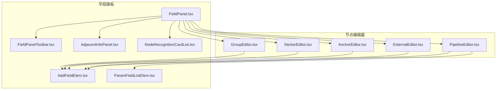
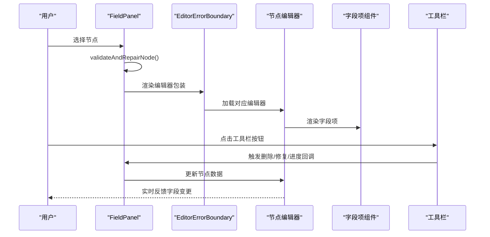
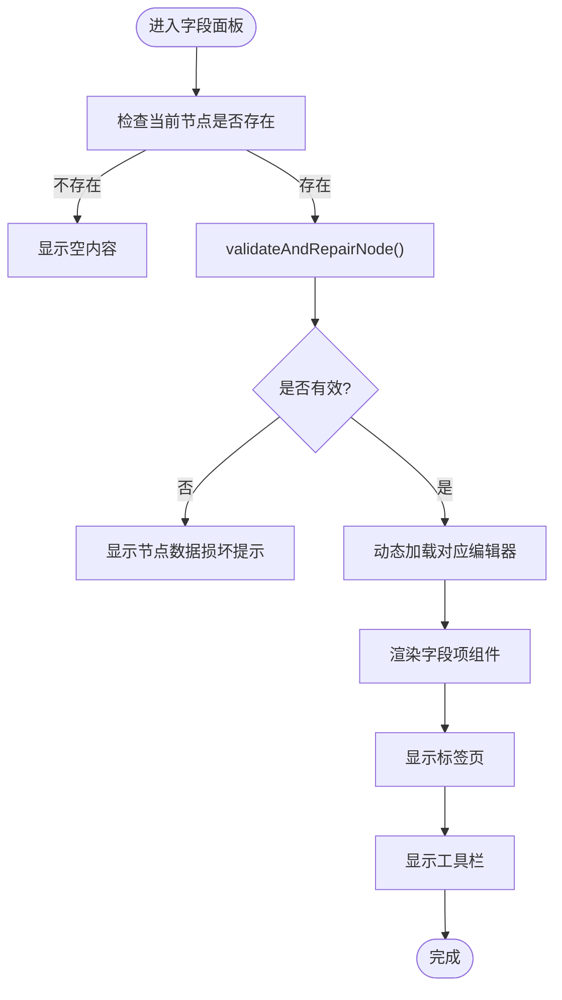
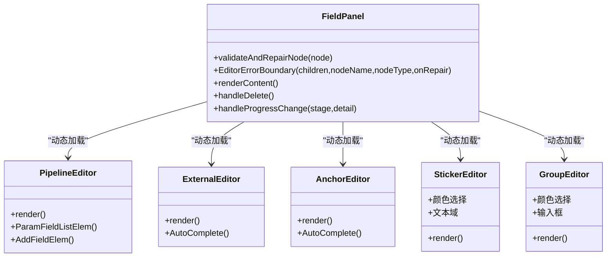
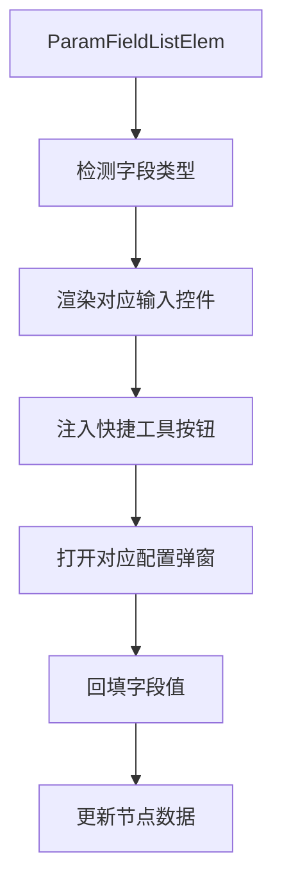
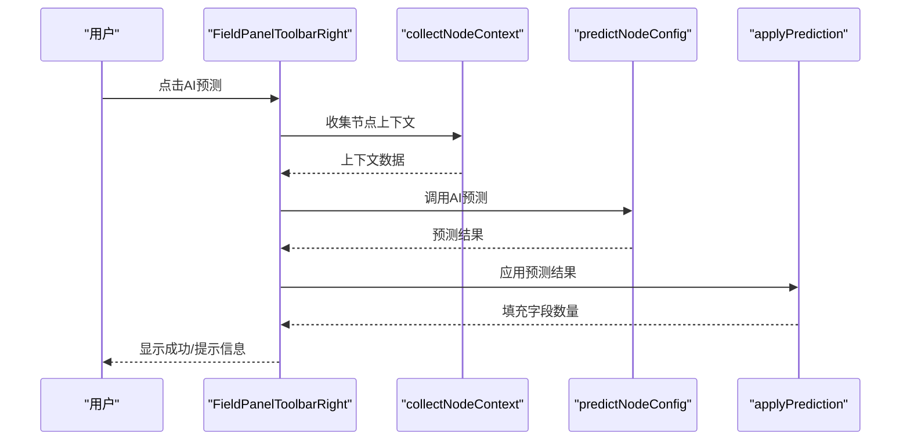
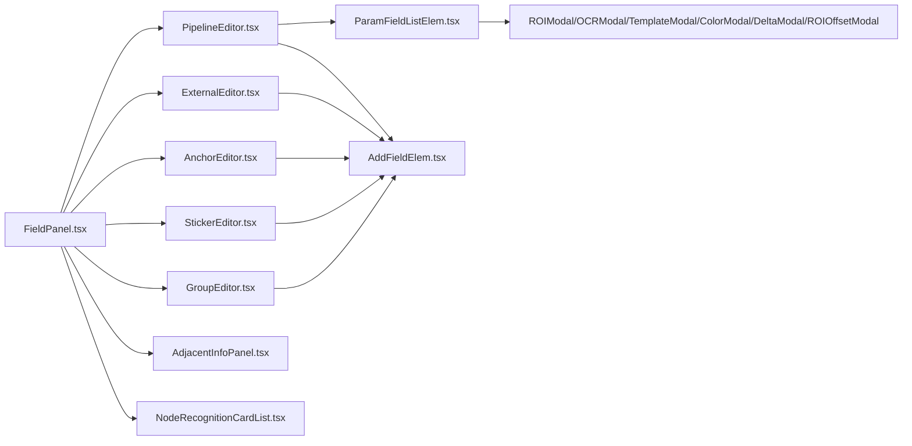

# 字段面板

<cite>
**本文档引用的文件**
- [FieldPanel.tsx](file://src/components/panels/main/FieldPanel.tsx)
- [FieldPanelToolbar.tsx](file://src/components/panels/field/tools/FieldPanelToolbar.tsx)
- [PipelineEditor.tsx](file://src/components/panels/node-editors/PipelineEditor.tsx)
- [ExternalEditor.tsx](file://src/components/panels/node-editors/ExternalEditor.tsx)
- [AnchorEditor.tsx](file://src/components/panels/node-editors/AnchorEditor.tsx)
- [StickerEditor.tsx](file://src/components/panels/node-editors/StickerEditor.tsx)
- [GroupEditor.tsx](file://src/components/panels/node-editors/GroupEditor.tsx)
- [AdjacentInfoPanel.tsx](file://src/components/panels/main/AdjacentInfoPanel.tsx)
- [NodeRecognitionCardList.tsx](file://src/components/panels/tools/NodeRecognitionCardList.tsx)
- [FieldPanel.module.less](file://src/styles/FieldPanel.module.less)
- [AddFieldElem.tsx](file://src/components/panels/field/items/AddFieldElem.tsx)
- [ParamFieldListElem.tsx](file://src/components/panels/field/items/ParamFieldListElem.tsx)
- [index.ts](file://src/components/panels/field/items/index.ts)
- [index.ts](file://src/components/panels/field/tools/index.ts)
</cite>

## 目录
1. [简介](#简介)
2. [项目结构](#项目结构)
3. [核心组件](#核心组件)
4. [架构总览](#架构总览)
5. [详细组件分析](#详细组件分析)
6. [依赖关系分析](#依赖关系分析)
7. [性能考虑](#性能考虑)
8. [故障排查指南](#故障排查指南)
9. [结论](#结论)
10. [附录](#附录)

## 简介
字段面板是可视化流程编辑器中的关键交互区域，负责展示并编辑当前选中节点的所有参数字段。它支持多种节点类型（Pipeline、External、Anchor、Sticker、Group），通过动态加载对应编辑器组件实现参数配置；内置字段验证与自动修复机制，保障节点数据完整性；提供邻接信息与调试记录两个扩展标签页（调试模式下），帮助用户理解节点在流程中的位置与识别历史；并通过工具栏提供节点删除、进度显示、数据修复等实用功能。

## 项目结构
字段面板相关代码主要分布在以下目录：
- 主面板：src/components/panels/main/FieldPanel.tsx
- 节点编辑器：src/components/panels/node-editors/*.tsx
- 字段项组件：src/components/panels/field/items/*.tsx
- 工具栏：src/components/panels/field/tools/FieldPanelToolbar.tsx
- 邻接信息：src/components/panels/main/AdjacentInfoPanel.tsx
- 调试记录：src/components/panels/tools/NodeRecognitionCardList.tsx
- 样式：src/styles/FieldPanel.module.less

**图表来源**
- [FieldPanel.tsx:185-521](file://src/components/panels/main/FieldPanel.tsx#L185-L521)
- [FieldPanelToolbar.tsx:1-238](file://src/components/panels/field/tools/FieldPanelToolbar.tsx#L1-L238)
- [PipelineEditor.tsx:1-949](file://src/components/panels/node-editors/PipelineEditor.tsx#L1-L949)
- [ExternalEditor.tsx:1-106](file://src/components/panels/node-editors/ExternalEditor.tsx#L1-L106)
- [AnchorEditor.tsx:1-106](file://src/components/panels/node-editors/AnchorEditor.tsx#L1-L106)
- [StickerEditor.tsx:1-132](file://src/components/panels/node-editors/StickerEditor.tsx#L1-L132)
- [GroupEditor.tsx:1-97](file://src/components/panels/node-editors/GroupEditor.tsx#L1-L97)
- [AdjacentInfoPanel.tsx:1-344](file://src/components/panels/main/AdjacentInfoPanel.tsx#L1-L344)
- [NodeRecognitionCardList.tsx:1-359](file://src/components/panels/tools/NodeRecognitionCardList.tsx#L1-L359)

**章节来源**
- [FieldPanel.tsx:1-524](file://src/components/panels/main/FieldPanel.tsx#L1-L524)
- [FieldPanel.module.less:1-206](file://src/styles/FieldPanel.module.less#L1-L206)

## 核心组件
- 字段面板主体：负责节点选择、编辑器动态加载、验证与修复、标签页管理、工具栏集成与遮罩进度显示。
- 节点编辑器：针对不同节点类型提供专用字段编辑界面。
- 字段项组件：通用字段渲染与快捷工具（如ROI、OCR、模板、颜色、位移差值等）。
- 工具栏：左侧复制节点名/复制识别JSON；右侧导航、保存模板、AI预测、删除节点。
- 邻接信息：展示前驱/后继节点及其连接类型与顺序。
- 调试记录：在调试模式下展示出发/目标节点的识别历史卡片列表。

**章节来源**
- [FieldPanel.tsx:185-521](file://src/components/panels/main/FieldPanel.tsx#L185-L521)
- [FieldPanelToolbar.tsx:23-238](file://src/components/panels/field/tools/FieldPanelToolbar.tsx#L23-L238)
- [AdjacentInfoPanel.tsx:43-344](file://src/components/panels/main/AdjacentInfoPanel.tsx#L43-L344)
- [NodeRecognitionCardList.tsx:197-359](file://src/components/panels/tools/NodeRecognitionCardList.tsx#L197-L359)

## 架构总览
字段面板采用“主面板 + 编辑器组件 + 字段项组件 + 工具栏 + 辅助面板”的分层架构。主面板根据当前节点类型动态选择编辑器，编辑器内部使用字段项组件渲染具体字段，并通过统一的数据更新接口修改节点数据。工具栏提供节点级操作，辅助面板（邻接信息、调试记录）在调试模式下增强可观测性。

**图表来源**
- [FieldPanel.tsx:41-119](file://src/components/panels/main/FieldPanel.tsx#L41-L119)
- [FieldPanel.tsx:269-323](file://src/components/panels/main/FieldPanel.tsx#L269-L323)
- [FieldPanelToolbar.tsx:67-238](file://src/components/panels/field/tools/FieldPanelToolbar.tsx#L67-L238)

## 详细组件分析

### 字段面板主体（FieldPanel）
- 节点验证与修复
  - validateAndRepairNode：对 Pipeline 节点进行结构完整性检查，自动修复缺失的 recognition/action/others 字段，保证编辑器可正常渲染。
- 错误边界
  - EditorErrorBoundary：捕获编辑器渲染异常，提供“尝试修复节点”按钮触发自动修复流程。
- 动态编辑器加载
  - 根据节点类型选择 PipelineEditor、ExternalEditor、AnchorEditor、StickerEditor、GroupEditor。
- 标签页管理
  - 字段配置、邻接信息、调试记录（调试模式下）三类标签页，支持切换与内容懒加载。
- 工具栏集成
  - 左侧复制节点名/复制识别JSON；右侧导航、保存模板、AI预测、删除节点。
- 进度遮罩
  - 在 AI 预测等异步操作期间显示遮罩层与进度文案，避免用户误操作。

**图表来源**
- [FieldPanel.tsx:41-119](file://src/components/panels/main/FieldPanel.tsx#L41-L119)
- [FieldPanel.tsx:269-323](file://src/components/panels/main/FieldPanel.tsx#L269-L323)
- [FieldPanel.tsx:445-497](file://src/components/panels/main/FieldPanel.tsx#L445-L497)

**章节来源**
- [FieldPanel.tsx:41-119](file://src/components/panels/main/FieldPanel.tsx#L41-L119)
- [FieldPanel.tsx:122-182](file://src/components/panels/main/FieldPanel.tsx#L122-L182)
- [FieldPanel.tsx:269-323](file://src/components/panels/main/FieldPanel.tsx#L269-L323)
- [FieldPanel.tsx:445-497](file://src/components/panels/main/FieldPanel.tsx#L445-L497)

### 节点编辑器组件
- PipelineEditor
  - 提供节点名、识别算法、动作类型、others 等字段的编辑入口；支持 focus、waitFreezes 等复杂字段的结构化/数值模式切换与增删改。
  - 使用 ParamFieldListElem 渲染字段，AddFieldElem 提供一键添加字段。
- ExternalEditor / AnchorEditor
  - 基于 AutoComplete 提供跨文件节点名自动补全与选择。
- StickerEditor / GroupEditor
  - 提供标题、颜色、内容等基础字段编辑。

**图表来源**
- [FieldPanel.tsx:269-323](file://src/components/panels/main/FieldPanel.tsx#L269-L323)
- [PipelineEditor.tsx:22-949](file://src/components/panels/node-editors/PipelineEditor.tsx#L22-L949)
- [ExternalEditor.tsx:8-106](file://src/components/panels/node-editors/ExternalEditor.tsx#L8-L106)
- [AnchorEditor.tsx:8-106](file://src/components/panels/node-editors/AnchorEditor.tsx#L8-L106)
- [StickerEditor.tsx:21-132](file://src/components/panels/node-editors/StickerEditor.tsx#L21-L132)
- [GroupEditor.tsx:20-97](file://src/components/panels/node-editors/GroupEditor.tsx#L20-L97)

**章节来源**
- [PipelineEditor.tsx:22-949](file://src/components/panels/node-editors/PipelineEditor.tsx#L22-L949)
- [ExternalEditor.tsx:8-106](file://src/components/panels/node-editors/ExternalEditor.tsx#L8-L106)
- [AnchorEditor.tsx:8-106](file://src/components/panels/node-editors/AnchorEditor.tsx#L8-L106)
- [StickerEditor.tsx:21-132](file://src/components/panels/node-editors/StickerEditor.tsx#L21-L132)
- [GroupEditor.tsx:20-97](file://src/components/panels/node-editors/GroupEditor.tsx#L20-L97)

### 字段项组件与快捷工具（ParamFieldListElem / AddFieldElem）
- ParamFieldListElem
  - 根据字段类型渲染不同输入控件（字符串、数字、布尔、列表、对象等），支持快捷工具弹窗（ROI、OCR、模板、颜色、位移差值、ROI偏移）。
  - 对列表字段提供增删改能力，并在渲染时自动注入快捷工具按钮。
- AddFieldElem
  - 用于一键添加缺失字段，结合字段描述气泡提示提升易用性。

**图表来源**
- [ParamFieldListElem.tsx:72-775](file://src/components/panels/field/items/ParamFieldListElem.tsx#L72-L775)
- [AddFieldElem.tsx:12-62](file://src/components/panels/field/items/AddFieldElem.tsx#L12-L62)

**章节来源**
- [ParamFieldListElem.tsx:72-775](file://src/components/panels/field/items/ParamFieldListElem.tsx#L72-L775)
- [AddFieldElem.tsx:12-62](file://src/components/panels/field/items/AddFieldElem.tsx#L12-L62)

### 工具栏（FieldPanelToolbar）
- 左侧工具
  - 复制节点名、复制识别JSON（仅 Pipeline 节点）。
- 右侧工具
  - 导航到目标节点（仅 External 节点）、保存为模板（仅 Pipeline）、AI智能预测（仅 Pipeline）、删除节点。
- AI预测流程
  - 收集上下文 -> 调用预测 -> 应用结果 -> 反馈进度与统计。

**图表来源**
- [FieldPanelToolbar.tsx:119-183](file://src/components/panels/field/tools/FieldPanelToolbar.tsx#L119-L183)

**章节来源**
- [FieldPanelToolbar.tsx:23-64](file://src/components/panels/field/tools/FieldPanelToolbar.tsx#L23-L64)
- [FieldPanelToolbar.tsx:67-238](file://src/components/panels/field/tools/FieldPanelToolbar.tsx#L67-L238)

### 邻接信息面板（AdjacentInfoPanel）
- 展示当前节点的前驱/后继节点，按连接类型（next、on_error）分组排序。
- 支持点击标签跳转到对应节点并聚焦视图。
- 无连接时显示空状态。

**章节来源**
- [AdjacentInfoPanel.tsx:43-344](file://src/components/panels/main/AdjacentInfoPanel.tsx#L43-L344)

### 调试记录面板（NodeRecognitionCardList）
- 在调试模式下提供“出发节点记录”和“目标节点记录”两个标签页。
- 以卡片形式展示识别历史，支持分页与查看详情。

**章节来源**
- [NodeRecognitionCardList.tsx:197-359](file://src/components/panels/tools/NodeRecognitionCardList.tsx#L197-L359)

## 依赖关系分析
- 主面板依赖编辑器组件与辅助面板，编辑器组件依赖字段项组件与通用字段定义。
- 工具栏依赖全局状态（节点选择、连接状态、设备状态）与服务（跨文件导航、AI预测）。
- 字段项组件依赖模态框组件（ROI、OCR、模板、颜色、位移差值、ROI偏移）。

**图表来源**
- [FieldPanel.tsx:269-323](file://src/components/panels/main/FieldPanel.tsx#L269-L323)
- [PipelineEditor.tsx:14-16](file://src/components/panels/node-editors/PipelineEditor.tsx#L14-L16)
- [ParamFieldListElem.tsx:10-17](file://src/components/panels/field/items/ParamFieldListElem.tsx#L10-L17)

**章节来源**
- [FieldPanel.tsx:1-524](file://src/components/panels/main/FieldPanel.tsx#L1-L524)
- [PipelineEditor.tsx:1-949](file://src/components/panels/node-editors/PipelineEditor.tsx#L1-L949)
- [ParamFieldListElem.tsx:1-775](file://src/components/panels/field/items/ParamFieldListElem.tsx#L1-L775)

## 性能考虑
- 懒加载编辑器：使用 React.lazy 与 Suspense，减少初始包体积与首屏渲染压力。
- 虚拟滚动与分页：调试记录卡片列表采用分页，避免一次性渲染大量 DOM。
- 状态最小化：字段面板仅在节点变化或显式触发时重渲染，避免不必要的计算。
- 进度遮罩：异步操作期间阻断用户交互，降低无效重绘概率。

[本节为通用建议，无需特定文件来源]

## 故障排查指南
- 编辑器渲染失败
  - 使用 EditorErrorBoundary 捕获错误并提示修复；点击“尝试修复节点”触发 validateAndRepairNode 自动修复。
- 节点数据损坏
  - validateAndRepairNode 返回错误信息与修复建议；若无法修复，建议删除节点并重建。
- AI预测失败
  - 工具栏根据错误类型提示连接状态、API 配置或 OCR 配置问题；检查本地服务与设备连接后再试。
- 调试记录为空
  - 确认已启动调试；根据过滤模式检查“出发节点记录”或“目标节点记录”。

**章节来源**
- [FieldPanel.tsx:122-182](file://src/components/panels/main/FieldPanel.tsx#L122-L182)
- [FieldPanel.tsx:41-119](file://src/components/panels/main/FieldPanel.tsx#L41-L119)
- [FieldPanelToolbar.tsx:164-182](file://src/components/panels/field/tools/FieldPanelToolbar.tsx#L164-L182)
- [NodeRecognitionCardList.tsx:294-309](file://src/components/panels/tools/NodeRecognitionCardList.tsx#L294-L309)

## 结论
字段面板通过清晰的分层架构与模块化组件，实现了对多节点类型的统一参数配置体验。其内置的验证与修复机制、丰富的字段项组件与快捷工具、以及调试辅助面板，显著提升了编辑效率与可靠性。配合工具栏提供的节点级操作与进度反馈，整体用户体验在复杂流程场景下仍保持稳定与高效。

[本节为总结性内容，无需特定文件来源]

## 附录

### 字段面板的三个标签页
- 字段配置：展示并编辑当前节点的参数字段。
- 邻接信息：展示前驱/后继节点及连接类型。
- 调试记录（调试模式下）：展示出发/目标节点的识别历史卡片列表。

**章节来源**
- [FieldPanel.tsx:445-497](file://src/components/panels/main/FieldPanel.tsx#L445-L497)
- [AdjacentInfoPanel.tsx:282-314](file://src/components/panels/main/AdjacentInfoPanel.tsx#L282-L314)
- [NodeRecognitionCardList.tsx:197-359](file://src/components/panels/tools/NodeRecognitionCardList.tsx#L197-L359)

### 工具栏功能清单
- 左侧
  - 复制节点名
  - 复制识别JSON（Pipeline 节点）
- 右侧
  - 导航到目标节点（External 节点）
  - 保存为模板（Pipeline 节点）
  - AI智能预测（Pipeline 节点）
  - 删除节点

**章节来源**
- [FieldPanelToolbar.tsx:23-64](file://src/components/panels/field/tools/FieldPanelToolbar.tsx#L23-L64)
- [FieldPanelToolbar.tsx:67-238](file://src/components/panels/field/tools/FieldPanelToolbar.tsx#L67-L238)

### 响应式设计与用户体验优化
- 面板尺寸与布局：固定宽度面板与自适应高度，配合滚动容器避免溢出。
- 标签页与遮罩：卡片式标签页与进度遮罩提升交互反馈。
- 字段项样式：统一的键值布局、气泡提示与操作图标，提升可读性与可用性。
- 模态框与快捷工具：在不打断主流程的前提下提供专业工具。

**章节来源**
- [FieldPanel.module.less:4-127](file://src/styles/FieldPanel.module.less#L4-L127)
- [FieldPanel.tsx:409-497](file://src/components/panels/main/FieldPanel.tsx#L409-L497)