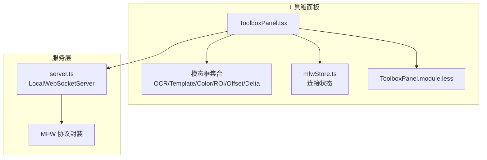
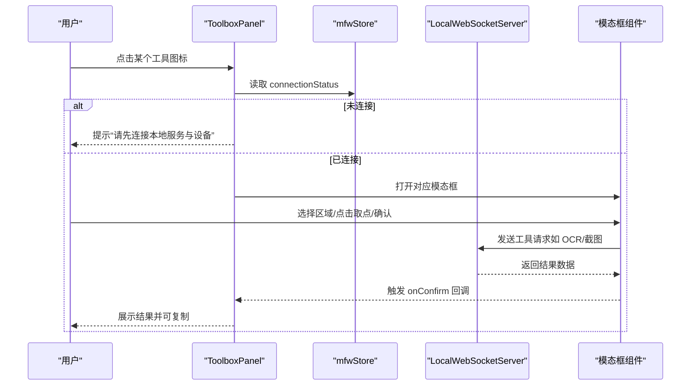
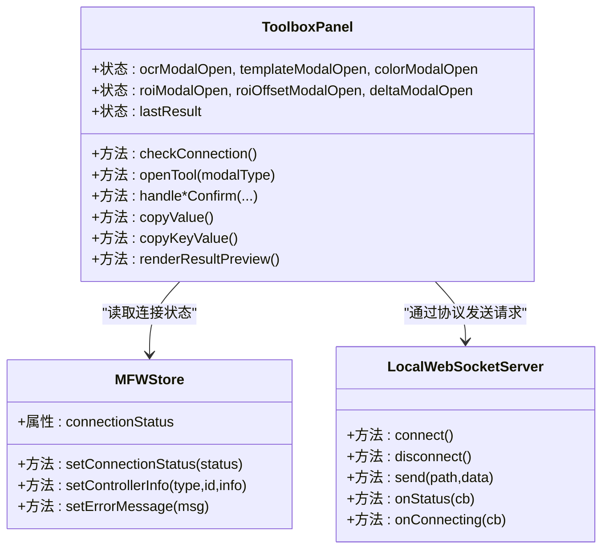
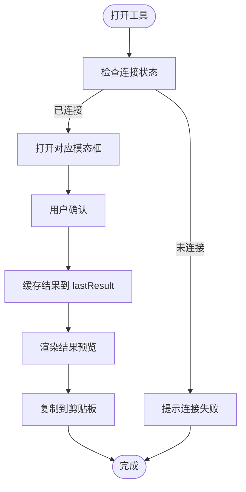
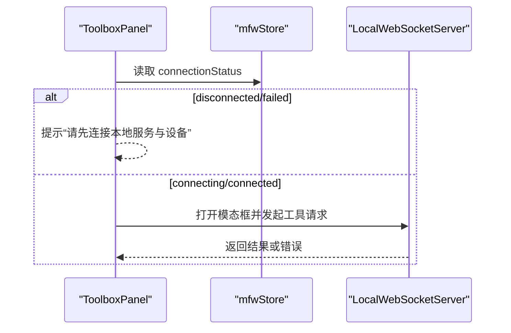
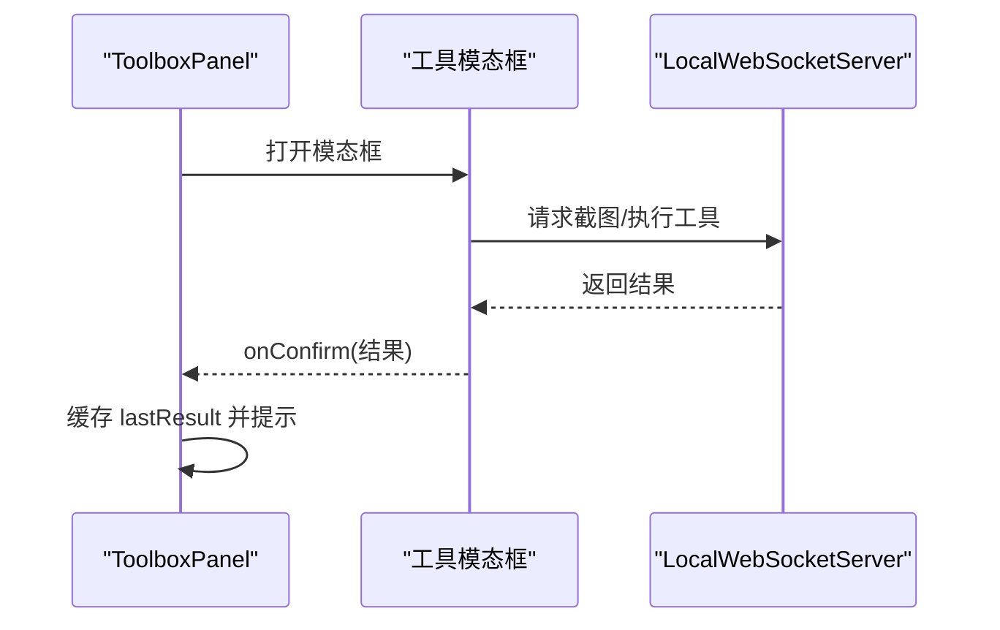
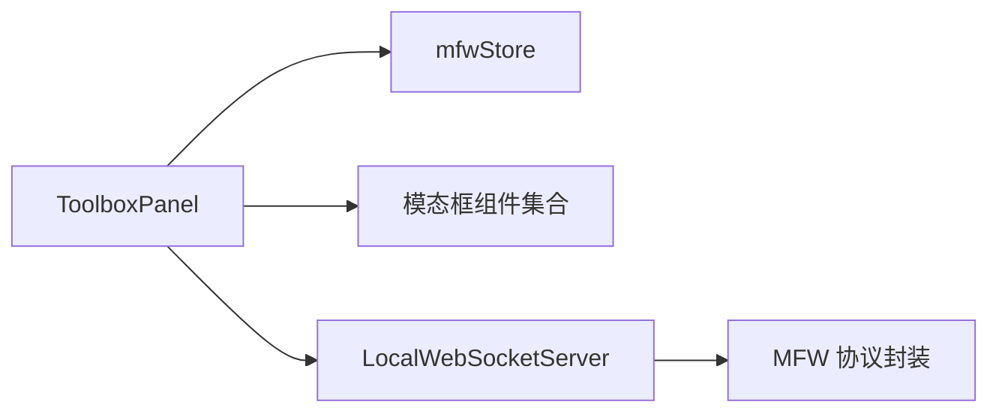

# 工具箱面板

<cite>
**本文档引用的文件**
- [ToolboxPanel.tsx](file://src/components/panels/tools/ToolboxPanel.tsx)
- [mfwStore.ts](file://src/stores/mfwStore.ts)
- [server.ts](file://src/services/server.ts)
- [OCRModal.tsx](file://src/components/modals/OCRModal.tsx)
- [TemplateModal.tsx](file://src/components/modals/TemplateModal.tsx)
- [ColorModal.tsx](file://src/components/modals/ColorModal.tsx)
- [ROIModal.tsx](file://src/components/modals/ROIModal.tsx)
- [ROIOffsetModal.tsx](file://src/components/modals/ROIOffsetModal.tsx)
- [DeltaModal.tsx](file://src/components/modals/DeltaModal.tsx)
- [ScreenshotModalBase.tsx](file://src/components/modals/ScreenshotModalBase.tsx)
- [index.ts](file://src/components/modals/index.ts)
- [ToolboxPanel.module.less](file://src/styles/ToolboxPanel.module.less)
</cite>

## 目录
1. [简介](#简介)
2. [项目结构](#项目结构)
3. [核心组件](#核心组件)
4. [架构总览](#架构总览)
5. [详细组件分析](#详细组件分析)
6. [依赖关系分析](#依赖关系分析)
7. [性能考虑](#性能考虑)
8. [故障排除指南](#故障排除指南)
9. [结论](#结论)
10. [附录](#附录)

## 简介
工具箱面板是一个集成了七种工作流配置辅助工具的交互面板，旨在通过图形化方式提升用户在配置识别与定位参数时的工作效率。它提供以下核心能力：
- 屏幕文字提取与 ROI 区域标注（OCR 文字识别）
- 图像模板的捕获与保存（模板截图）
- RGB/GRAY 颜色值的精确获取（颜色取点）
- ROI 区域的精确框选（区域选择）
- 相对位置的精确测量（偏移测量）
- 坐标差值计算（位移差值 dx/dy）

此外，工具箱还包含状态管理机制（模态框状态、结果缓存）、剪贴板操作以及与本地 MFW 服务的连接检查与错误处理。

## 项目结构
工具箱面板位于前端工程的组件层，采用模块化组织：
- 面板组件：负责工具入口、状态管理和结果展示
- 模态框组件：封装具体工具的交互逻辑（如 OCR、模板截图、颜色取点等）
- 存储层：维护与本地服务的连接状态
- 服务层：封装 WebSocket 连接与协议交互
- 样式层：提供统一的视觉样式与布局

图表来源
- [ToolboxPanel.tsx:1-475](file://src/components/panels/tools/ToolboxPanel.tsx#L1-L475)
- [mfwStore.ts:1-158](file://src/stores/mfwStore.ts#L1-L158)
- [server.ts:1-373](file://src/services/server.ts#L1-L373)

章节来源
- [ToolboxPanel.tsx:1-475](file://src/components/panels/tools/ToolboxPanel.tsx#L1-L475)
- [mfwStore.ts:1-158](file://src/stores/mfwStore.ts#L1-L158)
- [server.ts:1-373](file://src/services/server.ts#L1-L373)

## 核心组件
工具箱面板的核心职责包括：
- 定义七个工具的配置与图标映射
- 统一的状态管理（模态框开关、最近一次结果缓存）
- 连接状态检查与错误提示
- 结果复制到剪贴板（值与键值对两种格式）
- 将结果以可视化形式展示在面板中

关键实现要点：
- 工具配置数组定义了每个工具的键、标签、图标与模态框类型
- 使用 Zustand 的 mfwStore 提供连接状态
- 通过回调函数接收各工具确认后的结果，并缓存到 lastResult
- 支持复制值与复制键值对两种剪贴板操作
- 模态框组件通过 props 接收 onConfirm 回调，完成后触发 ToolboxPanel 的结果缓存与提示

章节来源
- [ToolboxPanel.tsx:17-86](file://src/components/panels/tools/ToolboxPanel.tsx#L17-L86)
- [ToolboxPanel.tsx:87-137](file://src/components/panels/tools/ToolboxPanel.tsx#L87-L137)
- [ToolboxPanel.tsx:139-193](file://src/components/panels/tools/ToolboxPanel.tsx#L139-L193)
- [ToolboxPanel.tsx:194-294](file://src/components/panels/tools/ToolboxPanel.tsx#L194-L294)
- [ToolboxPanel.tsx:295-414](file://src/components/panels/tools/ToolboxPanel.tsx#L295-L414)

## 架构总览
工具箱面板与本地服务的交互遵循 WebSocket 握手与协议通信规范。连接状态由 mfwStore 维护，ToolboxPanel 在打开工具前进行连接检查，确保服务可用后再弹出对应模态框。

图表来源
- [ToolboxPanel.tsx:101-137](file://src/components/panels/tools/ToolboxPanel.tsx#L101-L137)
- [mfwStore.ts:72-97](file://src/stores/mfwStore.ts#L72-L97)
- [server.ts:20-331](file://src/services/server.ts#L20-L331)

章节来源
- [ToolboxPanel.tsx:101-137](file://src/components/panels/tools/ToolboxPanel.tsx#L101-L137)
- [mfwStore.ts:72-97](file://src/stores/mfwStore.ts#L72-L97)
- [server.ts:20-331](file://src/services/server.ts#L20-L331)

## 详细组件分析

### 工具箱面板类图

图表来源
- [ToolboxPanel.tsx:87-472](file://src/components/panels/tools/ToolboxPanel.tsx#L87-L472)
- [mfwStore.ts:102-157](file://src/stores/mfwStore.ts#L102-L157)
- [server.ts:20-331](file://src/services/server.ts#L20-L331)

章节来源
- [ToolboxPanel.tsx:87-472](file://src/components/panels/tools/ToolboxPanel.tsx#L87-L472)
- [mfwStore.ts:102-157](file://src/stores/mfwStore.ts#L102-L157)
- [server.ts:20-331](file://src/services/server.ts#L20-L331)

### 工具清单与功能说明
工具箱包含七个主要工具，每个工具都通过独立的模态框实现：

- OCR 文字识别
  - 功能：支持原生 OCR 与前端 OCR 两种模式，可对指定 ROI 区域进行文字识别
  - 交互：通过截图画布选择 ROI，确认后返回文本与 ROI
  - 输出：文本内容与可选 ROI 坐标，支持复制为纯文本或多行格式

- 模板截图
  - 功能：截取屏幕图像并可叠加绿幕遮罩标记
  - 交互：选择 ROI 后保存模板文件，支持确认回调返回路径与遮罩选项
  - 输出：模板路径与遮罩开关，支持复制为数组与布尔值格式

- 颜色取点
  - 功能：支持 RGB、HSV、GRAY 三种颜色模式，精确获取像素颜色值
  - 交互：在截图画布上取点，根据模式返回相应通道数值
  - 输出：颜色值数组，支持复制为标准数组格式

- 区域选择
  - 功能：在截图画布上精确框选 ROI 区域
  - 交互：拖拽绘制矩形，确认后返回四元组坐标
  - 输出：ROI 坐标数组，支持复制为标准格式

- 偏移测量
  - 功能：测量两个 ROI 之间的相对偏移
  - 交互：分别选择两个区域，确认后返回偏移量
  - 输出：偏移四元组，支持复制为标准格式

- 位移差值 (dx/dy)
  - 功能：计算两点之间的水平(dx)与垂直(dy)差值
  - 交互：选择两点，确认后返回差值
  - 输出：dx 或 dy 数值，支持复制为数字格式

章节来源
- [ToolboxPanel.tsx:27-70](file://src/components/panels/tools/ToolboxPanel.tsx#L27-L70)
- [ToolboxPanel.tsx:139-193](file://src/components/panels/tools/ToolboxPanel.tsx#L139-L193)

### 状态管理机制
- 模态框状态：每个工具对应一个独立的布尔状态，控制对应模态框的显示/隐藏
- 结果缓存：最近一次工具结果保存在 lastResult 中，用于结果预览与复制
- 连接检查：在打开工具前检查连接状态，未连接时提示用户先连接本地服务
- 剪贴板操作：提供复制值与复制键值对两种格式，自动根据结果类型生成合适的内容

图表来源
- [ToolboxPanel.tsx:101-137](file://src/components/panels/tools/ToolboxPanel.tsx#L101-L137)
- [ToolboxPanel.tsx:194-294](file://src/components/panels/tools/ToolboxPanel.tsx#L194-L294)

章节来源
- [ToolboxPanel.tsx:101-137](file://src/components/panels/tools/ToolboxPanel.tsx#L101-L137)
- [ToolboxPanel.tsx:194-294](file://src/components/panels/tools/ToolboxPanel.tsx#L194-L294)

### 与 MFW 服务的连接检查与错误处理
- 连接状态来源：mfwStore 提供 connectionStatus，ToolboxPanel 在打开工具前读取
- 连接建立：LocalWebSocketServer 负责 WebSocket 连接、握手与消息分发
- 错误处理：当连接失败、超时或协议版本不匹配时，会通过通知与消息提示用户，并引导至部署文档

图表来源
- [ToolboxPanel.tsx:87-108](file://src/components/panels/tools/ToolboxPanel.tsx#L87-L108)
- [mfwStore.ts:72-97](file://src/stores/mfwStore.ts#L72-L97)
- [server.ts:20-331](file://src/services/server.ts#L20-L331)

章节来源
- [ToolboxPanel.tsx:87-108](file://src/components/panels/tools/ToolboxPanel.tsx#L87-L108)
- [mfwStore.ts:72-97](file://src/stores/mfwStore.ts#L72-L97)
- [server.ts:20-331](file://src/services/server.ts#L20-L331)

### 模态框组件与工具交互
各工具模态框均基于 ScreenshotModalBase 实现，具备统一的截图加载、画布渲染与 ROI 处理能力。确认后通过 onConfirm 回调将结果传递给 ToolboxPanel。

图表来源
- [ToolboxPanel.tsx:439-470](file://src/components/panels/tools/ToolboxPanel.tsx#L439-L470)
- [OCRModal.tsx:291-314](file://src/components/modals/OCRModal.tsx#L291-L314)
- [TemplateModal.tsx:40-51](file://src/components/modals/TemplateModal.tsx#L40-L51)
- [ColorModal.tsx:23-34](file://src/components/modals/ColorModal.tsx#L23-L34)
- [ROIModal.tsx:20-44](file://src/components/modals/ROIModal.tsx#L20-L44)
- [ROIOffsetModal.tsx:1-44](file://src/components/modals/ROIOffsetModal.tsx#L1-L44)
- [DeltaModal.tsx:1-44](file://src/components/modals/DeltaModal.tsx#L1-L44)

章节来源
- [ToolboxPanel.tsx:439-470](file://src/components/panels/tools/ToolboxPanel.tsx#L439-L470)
- [OCRModal.tsx:291-314](file://src/components/modals/OCRModal.tsx#L291-L314)
- [TemplateModal.tsx:40-51](file://src/components/modals/TemplateModal.tsx#L40-L51)
- [ColorModal.tsx:23-34](file://src/components/modals/ColorModal.tsx#L23-L34)
- [ROIModal.tsx:20-44](file://src/components/modals/ROIModal.tsx#L20-L44)
- [ROIOffsetModal.tsx:1-44](file://src/components/modals/ROIOffsetModal.tsx#L1-L44)
- [DeltaModal.tsx:1-44](file://src/components/modals/DeltaModal.tsx#L1-L44)

## 依赖关系分析
- 组件耦合
  - ToolboxPanel 与各模态框组件松耦合，通过 props 与回调进行交互
  - 与 mfwStore 的耦合仅限于连接状态读取，避免了深层依赖
- 外部依赖
  - WebSocket 服务：LocalWebSocketServer 提供统一的连接与消息分发
  - 协议封装：MFW 协议负责与本地服务的通信细节
- 潜在循环依赖
  - 当前结构未发现循环依赖，ToolboxPanel 不直接依赖模态框内部实现

图表来源
- [ToolboxPanel.tsx:6-14](file://src/components/panels/tools/ToolboxPanel.tsx#L6-L14)
- [mfwStore.ts:102-157](file://src/stores/mfwStore.ts#L102-L157)
- [server.ts:333-342](file://src/services/server.ts#L333-L342)

章节来源
- [ToolboxPanel.tsx:6-14](file://src/components/panels/tools/ToolboxPanel.tsx#L6-L14)
- [mfwStore.ts:102-157](file://src/stores/mfwStore.ts#L102-L157)
- [server.ts:333-342](file://src/services/server.ts#L333-L342)

## 性能考虑
- 模态框状态管理：使用独立布尔状态避免不必要的重渲染
- 结果缓存：仅缓存最后一次结果，减少内存占用
- 连接检查：在打开工具前进行轻量检查，避免无效请求
- 剪贴板操作：批量生成字符串后一次性写入，降低多次 I/O 影响

## 故障排除指南
常见问题与处理建议：
- 无法连接本地服务
  - 现象：打开工具时提示“请先连接本地服务与设备”
  - 处理：检查本地服务是否启动、端口是否正确、协议版本是否匹配
- 连接超时或失败
  - 现象：出现连接超时或连接失败的通知
  - 处理：查看网络与防火墙设置，参考部署文档进行排查
- OCR 资源未配置
  - 现象：OCR 模态框返回资源未配置错误
  - 处理：按照提示运行配置命令并重启服务

章节来源
- [ToolboxPanel.tsx:101-108](file://src/components/panels/tools/ToolboxPanel.tsx#L101-L108)
- [server.ts:127-159](file://src/services/server.ts#L127-L159)
- [server.ts:182-250](file://src/services/server.ts#L182-L250)
- [OCRModal.tsx:304-313](file://src/components/modals/OCRModal.tsx#L304-L313)

## 结论
工具箱面板通过统一的状态管理与模态框架构，将多个工作流配置工具整合在一个简洁易用的界面中。其与本地服务的连接检查与错误处理机制保证了工具使用的稳定性，而结果缓存与剪贴板操作进一步提升了用户的配置效率。建议在实际使用中结合最佳实践，优先使用 ROI 区域标注与颜色取点来提高识别精度，并通过复制键值对快速填充字段面板。

## 附录
- 最佳实践
  - 使用 ROI 区域标注缩小识别范围，提升准确率
  - 颜色取点时根据场景选择合适的颜色模式（RGB/HSV/GRAY）
  - 偏移测量与位移差值配合使用，确保定位一致性
  - 通过复制键值对快速将结果粘贴到字段面板，减少手工输入