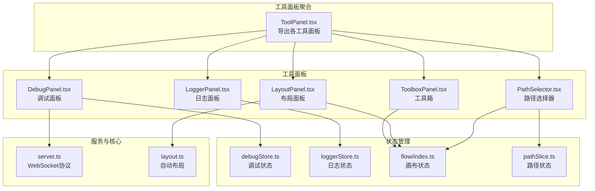
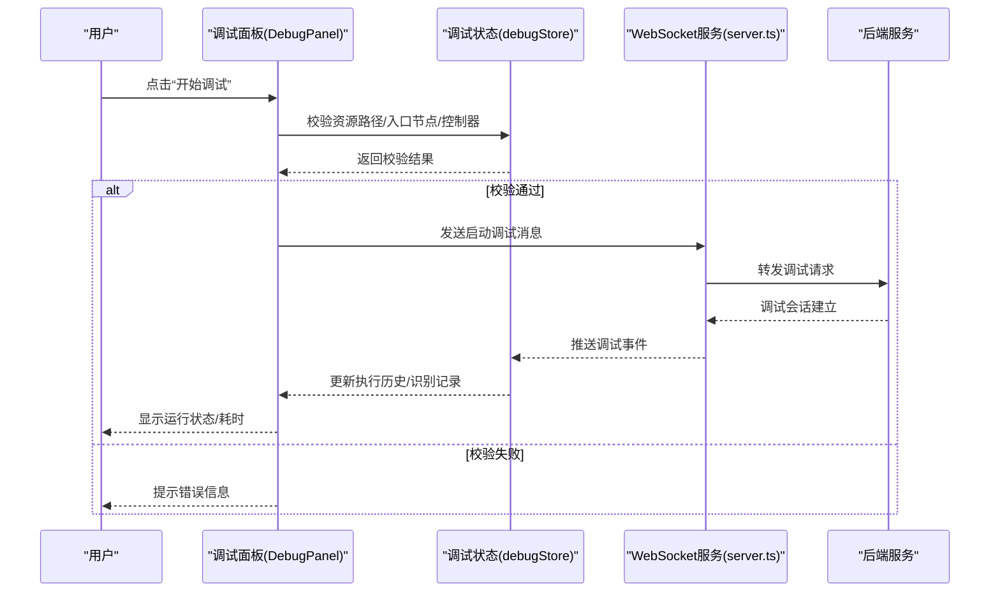
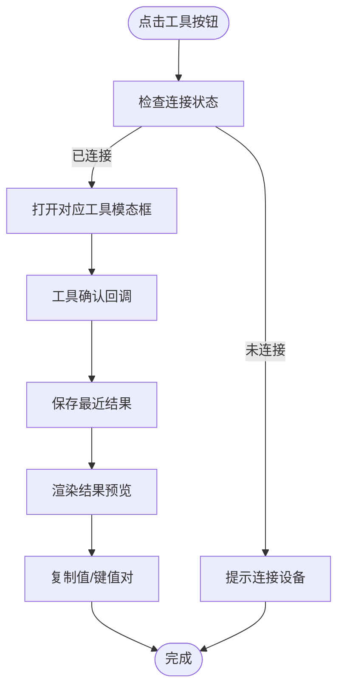
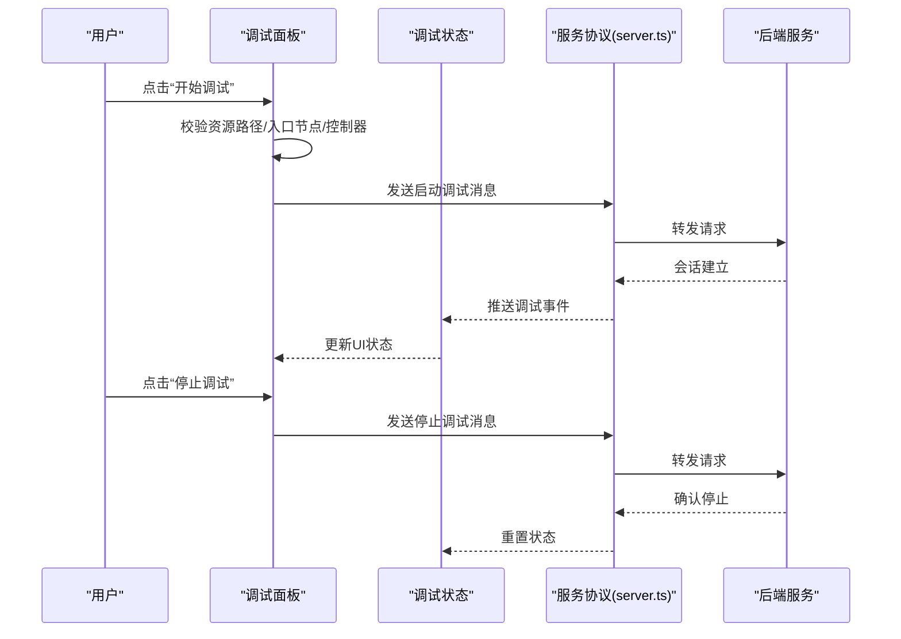
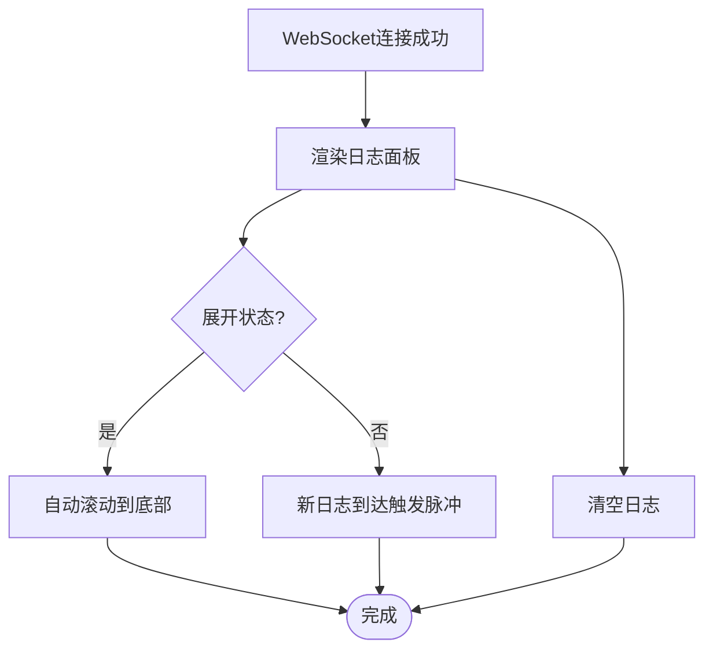
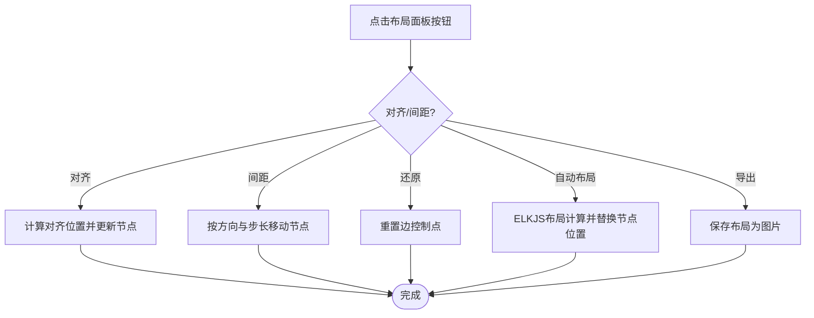
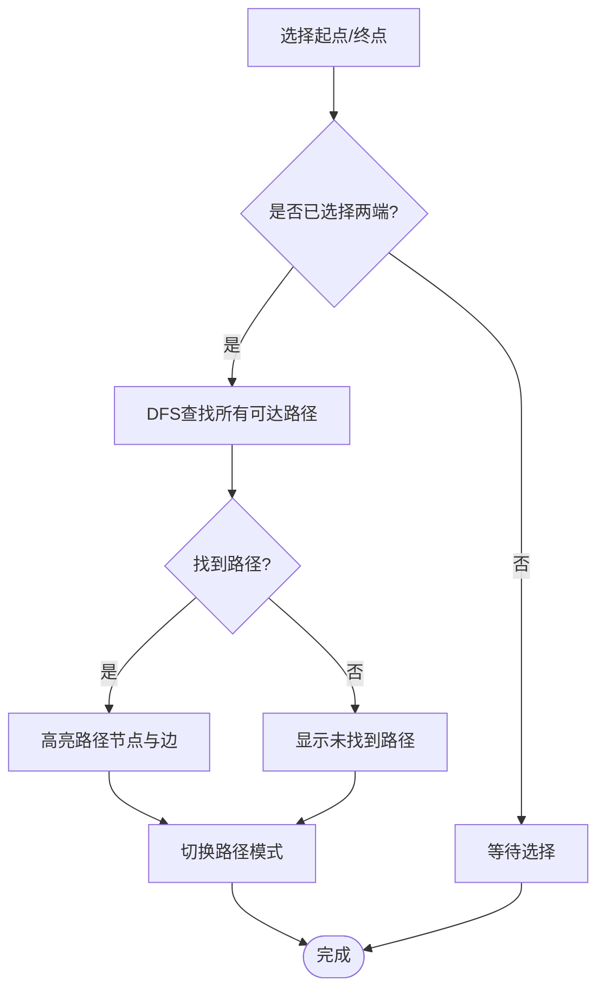
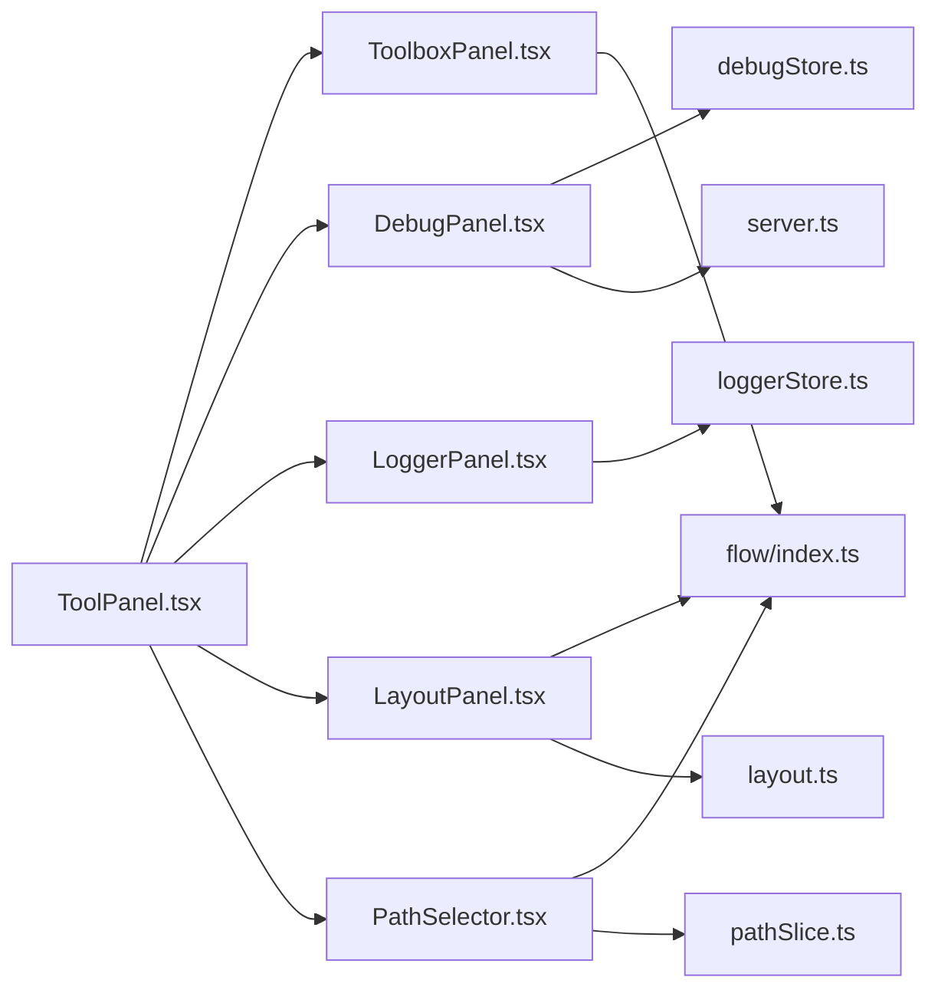

# 工具面板

<cite>
**本文档引用的文件**
- [ToolPanel.tsx](file://src/components/panels/tools/ToolPanel.tsx)
- [ToolboxPanel.tsx](file://src/components/panels/tools/ToolboxPanel.tsx)
- [DebugPanel.tsx](file://src/components/panels/tools/DebugPanel.tsx)
- [LoggerPanel.tsx](file://src/components/panels/tools/LoggerPanel.tsx)
- [LayoutPanel.tsx](file://src/components/panels/tools/LayoutPanel.tsx)
- [PathSelector.tsx](file://src/components/panels/tools/PathSelector.tsx)
- [debugStore.ts](file://src/stores/debugStore.ts)
- [loggerStore.ts](file://src/stores/loggerStore.ts)
- [flow/index.ts](file://src/stores/flow/index.ts)
- [flow/slices/pathSlice.ts](file://src/stores/flow/slices/pathSlice.ts)
- [server.ts](file://src/services/server.ts)
- [layout.ts](file://src/core/layout.ts)
- [ToolboxPanel.module.less](file://src/styles/ToolboxPanel.module.less)
- [ToolPanel.module.less](file://src/styles/ToolPanel.module.less)
- [DebugPanel.module.less](file://src/styles/DebugPanel.module.less)
- [DraggablePanel.tsx](file://src/components/panels/common/DraggablePanel.tsx)
</cite>

## 目录
1. [简介](#简介)
2. [项目结构](#项目结构)
3. [核心组件](#核心组件)
4. [架构总览](#架构总览)
5. [详细组件分析](#详细组件分析)
6. [依赖关系分析](#依赖关系分析)
7. [性能考虑](#性能考虑)
8. [故障排除指南](#故障排除指南)
9. [结论](#结论)
10. [附录](#附录)

## 简介
本文件系统性地介绍工具面板的综合功能与架构，涵盖工具箱面板、调试面板、日志面板、布局面板以及路径选择器等核心组件。文档重点阐述各组件的功能职责、状态管理与持久化机制、与其他面板的协作关系与数据共享方式，并提供扩展开发指南，帮助开发者快速添加自定义工具与功能模块。

## 项目结构
工具面板位于前端组件树的“panels/tools”目录下，采用“按功能分组”的组织方式，每个工具面板独立封装，通过统一的工具面板聚合器进行导出与使用。同时，配合状态管理（Zustand）、服务层（WebSocket 协议）与核心布局算法，形成完整的工具链路。

图表来源
- [ToolPanel.tsx:1-14](file://src/components/panels/tools/ToolPanel.tsx#L1-L14)
- [ToolboxPanel.tsx:1-475](file://src/components/panels/tools/ToolboxPanel.tsx#L1-L475)
- [DebugPanel.tsx:1-493](file://src/components/panels/tools/DebugPanel.tsx#L1-L493)
- [LoggerPanel.tsx:1-182](file://src/components/panels/tools/LoggerPanel.tsx#L1-L182)
- [LayoutPanel.tsx:1-171](file://src/components/panels/tools/LayoutPanel.tsx#L1-L171)
- [PathSelector.tsx:1-120](file://src/components/panels/tools/PathSelector.tsx#L1-L120)
- [debugStore.ts:1-897](file://src/stores/debugStore.ts#L1-L897)
- [loggerStore.ts:1-46](file://src/stores/loggerStore.ts#L1-L46)
- [flow/index.ts:1-109](file://src/stores/flow/index.ts#L1-L109)
- [flow/slices/pathSlice.ts:1-159](file://src/stores/flow/slices/pathSlice.ts#L1-L159)
- [server.ts:1-373](file://src/services/server.ts#L1-L373)
- [layout.ts:1-142](file://src/core/layout.ts#L1-L142)

章节来源
- [ToolPanel.tsx:1-14](file://src/components/panels/tools/ToolPanel.tsx#L1-L14)
- [ToolboxPanel.tsx:1-475](file://src/components/panels/tools/ToolboxPanel.tsx#L1-L475)
- [DebugPanel.tsx:1-493](file://src/components/panels/tools/DebugPanel.tsx#L1-L493)
- [LoggerPanel.tsx:1-182](file://src/components/panels/tools/LoggerPanel.tsx#L1-L182)
- [LayoutPanel.tsx:1-171](file://src/components/panels/tools/LayoutPanel.tsx#L1-L171)
- [PathSelector.tsx:1-120](file://src/components/panels/tools/PathSelector.tsx#L1-L120)

## 核心组件
- 工具箱面板（ToolboxPanel）：提供 OCR、模板截图、颜色取点、区域选择、偏移测量、位移差值等工具的入口与结果预览，支持一键复制结果与键值对。
- 调试面板（DebugPanel）：负责流程执行状态监控、调试配置、启动/停止调试、打开日志、显示识别记录面板等，与后端 WebSocket 协议交互。
- 日志面板（LoggerPanel）：展示后端实时日志，支持展开/收起、自动滚动、清空日志等。
- 布局面板（LayoutPanel）：提供节点对齐、间距调整、连接线路径还原、自动布局、导出布局为图片等功能。
- 路径选择器（PathSelector）：在画布节点间选择起点与终点，计算并高亮路径上的节点与边，支持路径模式开关与清除。

章节来源
- [ToolboxPanel.tsx:1-475](file://src/components/panels/tools/ToolboxPanel.tsx#L1-L475)
- [DebugPanel.tsx:1-493](file://src/components/panels/tools/DebugPanel.tsx#L1-L493)
- [LoggerPanel.tsx:1-182](file://src/components/panels/tools/LoggerPanel.tsx#L1-L182)
- [LayoutPanel.tsx:1-171](file://src/components/panels/tools/LayoutPanel.tsx#L1-L171)
- [PathSelector.tsx:1-120](file://src/components/panels/tools/PathSelector.tsx#L1-L120)

## 架构总览
工具面板围绕“状态管理 + 服务协议 + 核心算法”的架构展开：
- 状态管理：使用 Zustand 管理调试状态、日志状态、画布状态与路径状态，保证组件间解耦与高效更新。
- 服务协议：通过 WebSocket 与本地服务通信，实现调试启动/停止、日志打开、配置获取等能力。
- 核心算法：ELKJS 实现自动布局；DFS 算法计算节点间可达路径；剪贴板 API 复制工具结果。

图表来源
- [DebugPanel.tsx:289-332](file://src/components/panels/tools/DebugPanel.tsx#L289-L332)
- [debugStore.ts:295-398](file://src/stores/debugStore.ts#L295-L398)
- [server.ts:285-300](file://src/services/server.ts#L285-L300)

## 详细组件分析

### 工具箱面板（ToolboxPanel）
- 功能要点
  - 工具入口：提供 OCR、模板截图、颜色取点、区域选择、偏移测量、位移差值等工具按钮。
  - 结果预览：展示最后一次工具执行的结果，支持复制“值”与“键值对”。
  - 连接检查：在工具打开前检查本地服务连接状态，避免无效操作。
- 状态与交互
  - 使用本地服务连接状态与工具结果状态驱动 UI 行为。
  - 通过多个模态框承载具体工具的交互逻辑。
- 复杂度与性能
  - 工具列表为静态配置，渲染复杂度低；结果复制使用浏览器剪贴板 API，性能良好。

图表来源
- [ToolboxPanel.tsx:102-137](file://src/components/panels/tools/ToolboxPanel.tsx#L102-L137)
- [ToolboxPanel.tsx:140-192](file://src/components/panels/tools/ToolboxPanel.tsx#L140-L192)
- [ToolboxPanel.tsx:195-293](file://src/components/panels/tools/ToolboxPanel.tsx#L195-L293)

章节来源
- [ToolboxPanel.tsx:1-475](file://src/components/panels/tools/ToolboxPanel.tsx#L1-L475)
- [ToolboxPanel.module.less:1-147](file://src/styles/ToolboxPanel.module.less#L1-L147)

### 调试面板（DebugPanel）
- 功能要点
  - 调试配置：资源路径、Agent 标识符、入口节点选择。
  - 调试控制：开始调试、停止调试、打开日志、显示/隐藏识别记录面板。
  - 状态展示：调试状态标签、运行耗时、当前节点与识别目标。
  - 自动加载：连接成功后自动请求后端配置填充资源路径。
- 状态管理
  - 依赖调试状态存储（debugStore），维护会话 ID、执行历史、识别记录、当前节点与阶段等。
  - 与文件、工具栏、MFW 等状态协同，确保调试前保存文件、显示识别记录等行为一致。
- 交互流程
  - 开始调试前进行多项校验（资源路径、入口节点、控制器、Agent 标识符），通过后发送 WebSocket 消息启动调试。
  - 停止调试时回滚状态并通知后端销毁会话。

图表来源
- [DebugPanel.tsx:289-351](file://src/components/panels/tools/DebugPanel.tsx#L289-L351)
- [debugStore.ts:295-415](file://src/stores/debugStore.ts#L295-L415)
- [server.ts:285-300](file://src/services/server.ts#L285-L300)

章节来源
- [DebugPanel.tsx:1-493](file://src/components/panels/tools/DebugPanel.tsx#L1-L493)
- [DebugPanel.module.less:1-798](file://src/styles/DebugPanel.module.less#L1-L798)
- [debugStore.ts:1-897](file://src/stores/debugStore.ts#L1-L897)

### 日志面板（LoggerPanel）
- 功能要点
  - 展示后端日志：支持展开/收起、自动滚动、清空日志。
  - 脉冲提示：未展开时新日志到达触发脉冲动画，引导用户查看。
  - 连接感知：仅在 WebSocket 连接成功时显示。
- 状态管理
  - 使用日志状态存储（loggerStore）维护日志列表、展开状态与最大容量，具备自动截断能力。

图表来源
- [LoggerPanel.tsx:56-98](file://src/components/panels/tools/LoggerPanel.tsx#L56-L98)
- [loggerStore.ts:21-45](file://src/stores/loggerStore.ts#L21-L45)

章节来源
- [LoggerPanel.tsx:1-182](file://src/components/panels/tools/LoggerPanel.tsx#L1-L182)
- [loggerStore.ts:1-46](file://src/stores/loggerStore.ts#L1-L46)

### 布局面板（LayoutPanel）
- 功能要点
  - 节点对齐：居中对齐、顶部对齐、底部对齐。
  - 间距调整：水平/垂直间距增减。
  - 连接线路径还原：一键还原边的控制点。
  - 自动布局：基于 ELKJS 的层级布局算法，自动优化节点排列。
  - 导出布局：将当前布局保存为图片。
- 状态与算法
  - 依赖画布状态（flowStore）与路径切片（pathSlice）读取选中节点与全局节点。
  - 自动布局使用 ELKJS 异步计算，完成后批量更新节点位置。

图表来源
- [LayoutPanel.tsx:23-129](file://src/components/panels/tools/LayoutPanel.tsx#L23-L129)
- [layout.ts:41-107](file://src/core/layout.ts#L41-L107)

章节来源
- [LayoutPanel.tsx:1-171](file://src/components/panels/tools/LayoutPanel.tsx#L1-L171)
- [layout.ts:1-142](file://src/core/layout.ts#L1-L142)
- [flow/index.ts:1-109](file://src/stores/flow/index.ts#L1-L109)

### 路径选择器（PathSelector）
- 功能要点
  - 起点/终点选择：通过下拉框选择起始与结束节点。
  - 路径计算：基于 DFS 算法查找从起点到终点的所有可达路径，高亮途经节点与边。
  - 路径模式：支持开启/关闭路径模式，便于交互选择。
- 状态与算法
  - 依赖画布状态与路径切片（pathSlice）维护路径模式、起止节点与路径集合。
  - DFS 算法遍历邻接表，收集节点与边集合，若无路径则清空高亮。

图表来源
- [PathSelector.tsx:7-119](file://src/components/panels/tools/PathSelector.tsx#L7-L119)
- [flow/slices/pathSlice.ts:9-87](file://src/stores/flow/slices/pathSlice.ts#L9-L87)

章节来源
- [PathSelector.tsx:1-120](file://src/components/panels/tools/PathSelector.tsx#L1-L120)
- [flow/slices/pathSlice.ts:1-159](file://src/stores/flow/slices/pathSlice.ts#L1-L159)

## 依赖关系分析
- 组件耦合
  - 工具面板聚合器（ToolPanel.tsx）仅负责导出，降低外部依赖。
  - 各工具面板与状态存储（Zustand）松耦合，通过选择器读取所需状态。
- 外部依赖
  - WebSocket 服务（server.ts）提供统一的消息通道，调试面板与日志面板均依赖其协议实例。
  - ELKJS 作为自动布局的外部库，仅在布局面板中使用。
- 潜在循环依赖
  - 工具面板与状态存储之间为单向依赖，无循环风险。
  - 服务层与协议层分离，避免协议与 UI 的直接耦合。

图表来源
- [ToolPanel.tsx:1-14](file://src/components/panels/tools/ToolPanel.tsx#L1-L14)
- [ToolboxPanel.tsx:1-475](file://src/components/panels/tools/ToolboxPanel.tsx#L1-L475)
- [DebugPanel.tsx:1-493](file://src/components/panels/tools/DebugPanel.tsx#L1-L493)
- [LoggerPanel.tsx:1-182](file://src/components/panels/tools/LoggerPanel.tsx#L1-L182)
- [LayoutPanel.tsx:1-171](file://src/components/panels/tools/LayoutPanel.tsx#L1-L171)
- [PathSelector.tsx:1-120](file://src/components/panels/tools/PathSelector.tsx#L1-L120)
- [debugStore.ts:1-897](file://src/stores/debugStore.ts#L1-L897)
- [loggerStore.ts:1-46](file://src/stores/loggerStore.ts#L1-L46)
- [flow/index.ts:1-109](file://src/stores/flow/index.ts#L1-L109)
- [flow/slices/pathSlice.ts:1-159](file://src/stores/flow/slices/pathSlice.ts#L1-L159)
- [server.ts:1-373](file://src/services/server.ts#L1-L373)
- [layout.ts:1-142](file://src/core/layout.ts#L1-L142)

章节来源
- [ToolPanel.tsx:1-14](file://src/components/panels/tools/ToolPanel.tsx#L1-L14)
- [server.ts:1-373](file://src/services/server.ts#L1-L373)

## 性能考虑
- 状态裁剪
  - 调试状态存储对识别记录与执行历史设置了上限与清理比例，避免内存膨胀。
- 渲染优化
  - 工具箱面板与布局面板使用 memo 包装，减少不必要的重渲染。
  - 日志面板在未展开时仅渲染最新日志摘要，降低 DOM 负担。
- 算法效率
  - 自动布局使用 ELKJS 异步计算，避免阻塞主线程。
  - 路径计算采用 DFS，对稀疏图性能友好，必要时可引入缓存优化。

## 故障排除指南
- 调试无法启动
  - 检查资源路径、入口节点、控制器与 Agent 标识符是否配置正确。
  - 若 WebSocket 连接异常，查看连接状态与错误提示，确认本地服务端口与协议版本。
- 日志不显示
  - 确认 WebSocket 已连接，日志面板仅在连接成功时渲染。
  - 若长时间无日志，检查后端日志输出与网络延迟。
- 布局异常
  - 确保节点尺寸已测量，否则自动布局会在下一帧重试。
  - 如出现布局卡顿，适当减少节点数量或关闭实时预览。
- 路径计算为空
  - 检查起点/终点是否在同一连通分量内，确认边的方向与连接关系。

章节来源
- [DebugPanel.tsx:92-128](file://src/components/panels/tools/DebugPanel.tsx#L92-L128)
- [LoggerPanel.tsx:56-98](file://src/components/panels/tools/LoggerPanel.tsx#L56-L98)
- [layout.ts:55-64](file://src/core/layout.ts#L55-L64)
- [flow/slices/pathSlice.ts:130-147](file://src/stores/flow/slices/pathSlice.ts#L130-L147)

## 结论
工具面板通过清晰的功能划分与稳定的架构设计，实现了从工具采集、调试监控、日志展示到布局优化与路径计算的完整闭环。借助 Zustand 的轻量状态管理与 WebSocket 的可靠通信，系统在易用性与性能之间取得平衡。建议在扩展新工具时遵循现有模式：定义状态切片、封装 UI 组件、接入服务协议，并在样式层面保持一致性。

## 附录

### 状态管理与持久化机制
- 调试状态（debugStore）
  - 维护调试模式、会话 ID、资源路径、入口节点、执行历史、识别记录、详情缓存等。
  - 提供清理策略与上限控制，防止内存占用过高。
- 日志状态（loggerStore）
  - 维护日志列表、展开状态与最大容量，自动截断超出部分。
- 画布与路径状态（flowStore + pathSlice）
  - 维护节点、边、选中状态、历史记录与路径集合，支持路径计算与高亮。
- 可拖动面板位置（DraggablePanel）
  - 通过独立 store 记录面板位置，实现跨会话的位置记忆。

章节来源
- [debugStore.ts:143-221](file://src/stores/debugStore.ts#L143-L221)
- [loggerStore.ts:11-19](file://src/stores/loggerStore.ts#L11-L19)
- [flow/index.ts:1-109](file://src/stores/flow/index.ts#L1-L109)
- [flow/slices/pathSlice.ts:89-159](file://src/stores/flow/slices/pathSlice.ts#L89-L159)
- [DraggablePanel.tsx:13-22](file://src/components/panels/common/DraggablePanel.tsx#L13-L22)

### 与其他面板的协作关系与数据共享
- 调试面板与文件/工具栏/配置状态联动，确保调试前保存文件、显示识别记录等行为一致。
- 布局面板与路径选择器共享画布状态，路径高亮与布局调整相互独立但数据互通。
- 日志面板依赖 WebSocket 连接状态，仅在连接成功时展示，避免无效渲染。

章节来源
- [DebugPanel.tsx:25-38](file://src/components/panels/tools/DebugPanel.tsx#L25-L38)
- [LayoutPanel.tsx:23-31](file://src/components/panels/tools/LayoutPanel.tsx#L23-L31)
- [PathSelector.tsx:7-29](file://src/components/panels/tools/PathSelector.tsx#L7-L29)
- [LoggerPanel.tsx:56-58](file://src/components/panels/tools/LoggerPanel.tsx#L56-L58)

### 扩展开发指南
- 添加新的工具面板
  - 在“panels/tools”下新建组件文件，封装 UI 与交互逻辑。
  - 定义必要的状态切片（如需），并在“ToolPanel.tsx”中导出。
  - 如需与后端交互，新增协议类并在“server.ts”中注册。
- 添加新的调试功能
  - 在调试状态存储中扩展状态字段与事件处理器。
  - 在调试面板中新增按钮与配置项，确保与现有事件流兼容。
- 添加新的布局功能
  - 在“core/layout.ts”中扩展布局算法或参数。
  - 在布局面板中新增按钮与调用逻辑，保持与 ELKJS 的解耦。
- 样式与主题
  - 使用“ToolPanel.module.less”统一风格，遵循暗色模式适配规则。
  - 工具箱面板使用专用样式文件，确保图标与结果区域的一致性。

章节来源
- [ToolPanel.tsx:6-11](file://src/components/panels/tools/ToolPanel.tsx#L6-L11)
- [server.ts:335-372](file://src/services/server.ts#L335-L372)
- [layout.ts:39-141](file://src/core/layout.ts#L39-L141)
- [ToolPanel.module.less:1-149](file://src/styles/ToolPanel.module.less#L1-L149)
- [ToolboxPanel.module.less:1-147](file://src/styles/ToolboxPanel.module.less#L1-L147)