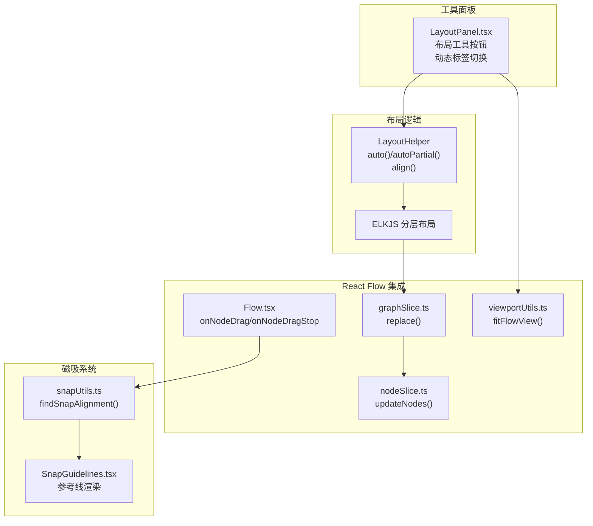
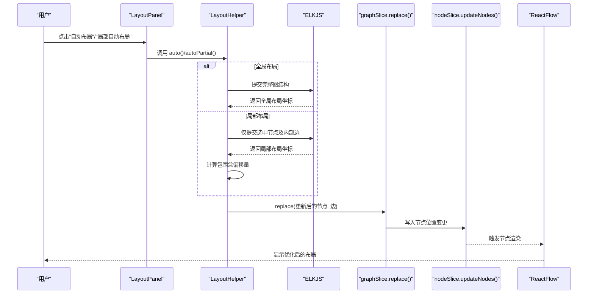
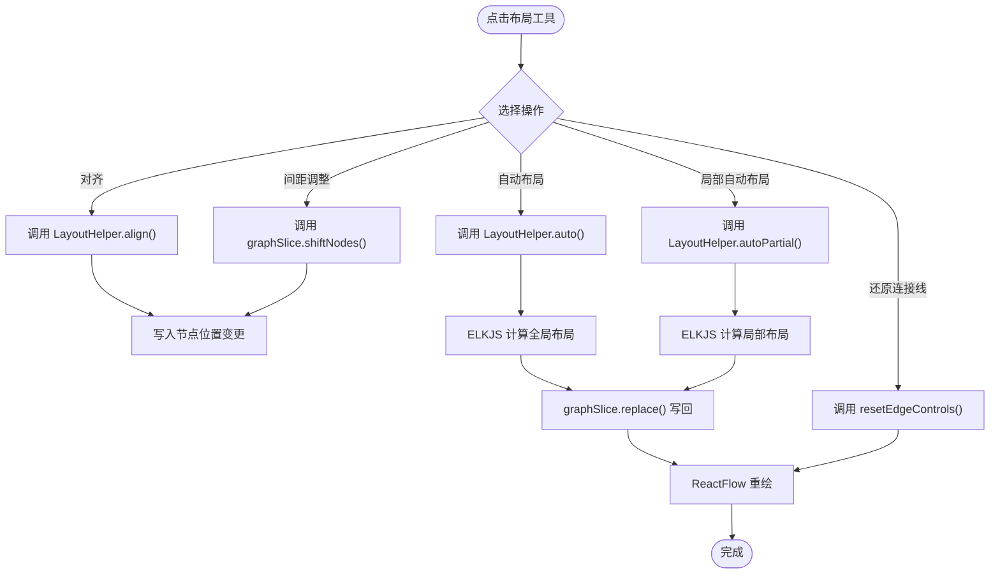
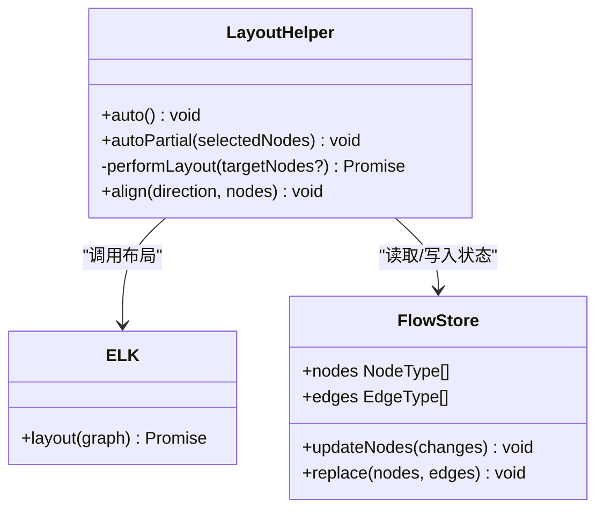
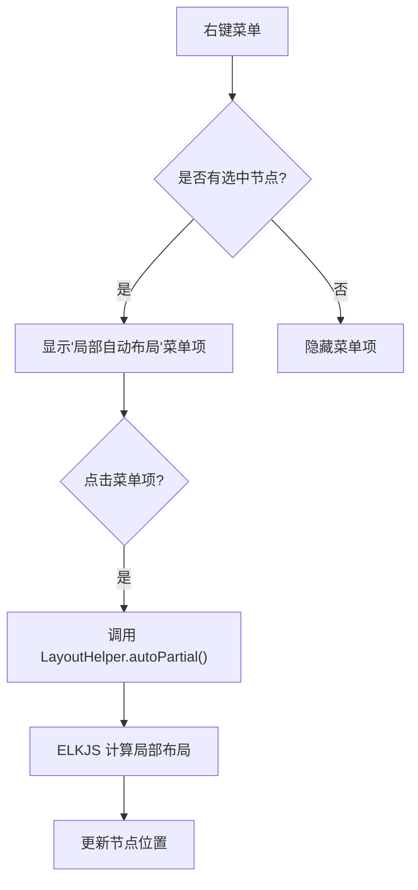
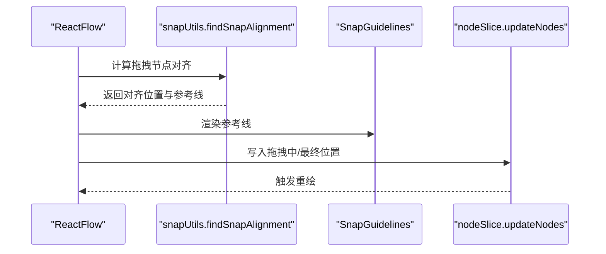
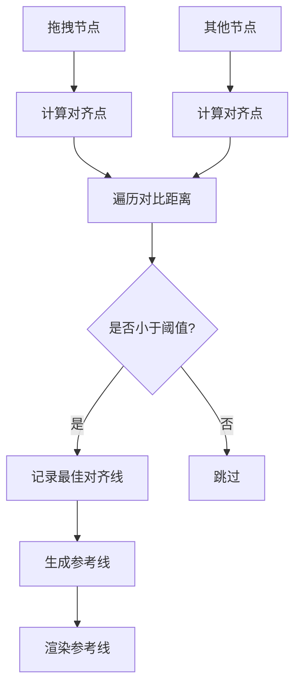
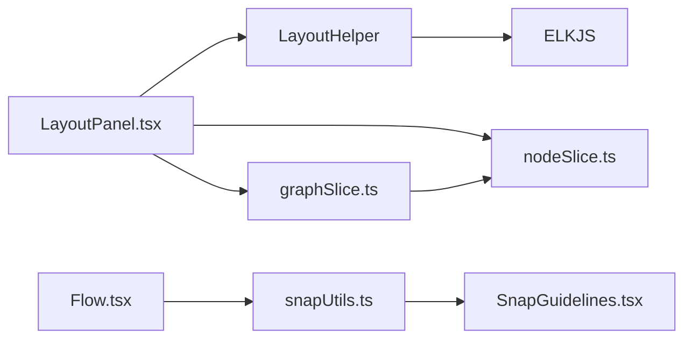

# 布局面板

<cite>
**本文档引用的文件**
- [src/components/panels/tools/LayoutPanel.tsx](file://src/components/panels/tools/LayoutPanel.tsx)
- [src/core/layout.ts](file://src/core/layout.ts)
- [src/components/flow/selectionContextMenu.tsx](file://src/components/flow/selectionContextMenu.tsx)
- [src/stores/flow/types.ts](file://src/stores/flow/types.ts)
- [src/stores/flow/slices/graphSlice.ts](file://src/stores/flow/slices/graphSlice.ts)
- [src/stores/flow/slices/nodeSlice.ts](file://src/stores/flow/slices/nodeSlice.ts)
- [src/stores/flow/utils/viewportUtils.ts](file://src/stores/flow/utils/viewportUtils.ts)
- [src/stores/flow/utils/nodeUtils.ts](file://src/stores/flow/utils/nodeUtils.ts)
- [src/components/Flow.tsx](file://src/components/Flow.tsx)
- [src/components/flow/SnapGuidelines.tsx](file://src/components/flow/SnapGuidelines.tsx)
- [src/core/snapUtils.ts](file://src/core/snapUtils.ts)
</cite>

## 更新摘要
**变更内容**
- 新增局部自动布局功能：支持对选中节点进行局部布局优化
- 布局面板按钮实现动态标签切换：根据选中节点数量智能显示"局部自动布局"或"自动布局"
- 选择上下文菜单新增"局部自动布局"选项：提供右键菜单入口
- 局部布局算法优化：支持选中节点间的边关系处理和包围盒偏移计算

## 目录
1. [简介](#简介)
2. [项目结构](#项目结构)
3. [核心组件](#核心组件)
4. [架构总览](#架构总览)
5. [详细组件分析](#详细组件分析)
6. [依赖分析](#依赖分析)
7. [性能考量](#性能考量)
8. [故障排查指南](#故障排查指南)
9. [结论](#结论)
10. [附录](#附录)

## 简介
本文件系统性阐述"布局面板"的功能架构与布局优化体系，覆盖以下方面：
- 自动布局算法：基于 ELKJS 的分层布局，优化节点排列与连线走向
- **局部自动布局**：支持对选中节点进行局部布局优化，保持其他节点位置不变
- 节点对齐工具：批量对齐选中节点（顶部、底部、水平居中）
- 视觉优化：连接线路径还原、视口适配与聚焦
- 网格吸附系统：拖拽时的磁吸对齐与参考线可视化
- 与 React Flow 的集成：节点位置计算、连线路径优化、视口管理
- 算法实现：拓扑排序思想（分层）、力导向布局（网络单纯形）与约束满足（最小交叉、正交边路由）
- 使用指南：一键优化布局、手动调整、对齐基准设置、布局参数自定义
- 最佳实践与视觉设计原则

## 项目结构
布局面板由"UI 控件 + 布局逻辑 + React Flow 集成 + 磁吸工具"四部分组成：
- UI 控件：位于工具面板，提供一键自动布局、局部自动布局、对齐、间距调整、连接线路径还原等入口
- 布局逻辑：封装在布局辅助类中，负责调用 ELKJS 执行分层布局，并将结果写回状态
- React Flow 集成：通过状态切片与回调，将布局结果应用到画布节点与连线
- 磁吸工具：提供节点拖拽时的吸附对齐与参考线绘制

**图表来源**
- [src/components/panels/tools/LayoutPanel.tsx:23-171](file://src/components/panels/tools/LayoutPanel.tsx#L23-L171)
- [src/core/layout.ts:39-141](file://src/core/layout.ts#L39-L141)
- [src/stores/flow/slices/graphSlice.ts:18-50](file://src/stores/flow/slices/graphSlice.ts#L18-L50)
- [src/stores/flow/slices/nodeSlice.ts:44-130](file://src/stores/flow/slices/nodeSlice.ts#L44-L130)
- [src/stores/flow/utils/viewportUtils.ts:21-52](file://src/stores/flow/utils/viewportUtils.ts#L21-L52)
- [src/components/Flow.tsx:296-413](file://src/components/Flow.tsx#L296-L413)
- [src/core/snapUtils.ts:100-161](file://src/core/snapUtils.ts#L100-L161)
- [src/components/flow/SnapGuidelines.tsx:5-59](file://src/components/flow/SnapGuidelines.tsx#L5-L59)

**章节来源**
- [src/components/panels/tools/LayoutPanel.tsx:23-171](file://src/components/panels/tools/LayoutPanel.tsx#L23-L171)
- [src/core/layout.ts:39-141](file://src/core/layout.ts#L39-L141)
- [src/components/Flow.tsx:296-413](file://src/components/Flow.tsx#L296-L413)
- [src/core/snapUtils.ts:100-161](file://src/core/snapUtils.ts#L100-L161)

## 核心组件
- 布局工具面板：提供"居中对齐/顶部对齐/底部对齐"、"水平/垂直间距调整"、"连接线路径还原"、"自动布局"、"局部自动布局"、"导出布局为图片"等入口
- 布局辅助类：封装自动布局与对齐逻辑，负责与 ELKJS 交互并将结果写回状态
- React Flow 集成：在拖拽阶段提供磁吸对齐与参考线，在布局完成后进行视口适配
- 磁吸工具：计算拖拽节点与其他节点的对齐关系，输出参考线并更新节点位置

**章节来源**
- [src/components/panels/tools/LayoutPanel.tsx:23-171](file://src/components/panels/tools/LayoutPanel.tsx#L23-L171)
- [src/core/layout.ts:39-141](file://src/core/layout.ts#L39-L141)
- [src/components/Flow.tsx:296-413](file://src/components/Flow.tsx#L296-L413)
- [src/core/snapUtils.ts:100-161](file://src/core/snapUtils.ts#L100-L161)

## 架构总览
布局面板围绕 Zustand 流程状态与 React Flow 画布展开，形成"工具面板 -> 布局逻辑 -> 状态更新 -> 画布渲染"的闭环。

**图表来源**
- [src/components/panels/tools/LayoutPanel.tsx:107-113](file://src/components/panels/tools/LayoutPanel.tsx#L107-L113)
- [src/core/layout.ts:41-107](file://src/core/layout.ts#L41-L107)
- [src/stores/flow/slices/graphSlice.ts:18-50](file://src/stores/flow/slices/graphSlice.ts#L18-L50)
- [src/stores/flow/slices/nodeSlice.ts:44-130](file://src/stores/flow/slices/nodeSlice.ts#L44-L130)
- [src/components/Flow.tsx:462-504](file://src/components/Flow.tsx#L462-L504)

## 详细组件分析

### 布局工具面板（LayoutPanel）
- 功能入口
  - 居中对齐/顶部对齐/底部对齐：对选中节点进行批量对齐
  - 水平/垂直间距调整：按比例放大/缩小节点间距
  - 连接线路径还原：重置边控制点
  - **自动布局**：全局执行分层布局
  - **局部自动布局**：对选中节点进行局部布局优化
  - 导出布局为图片：将节点区域截图保存
- 交互与禁用规则
  - 当未选中足够节点或图为空时，对应按钮禁用并提示
  - **动态按钮标签**：当选中节点≥2个时显示"局部自动布局"，否则显示"自动布局"
  - **智能路由**：根据选中节点数量自动选择合适的布局方法

**图表来源**
- [src/components/panels/tools/LayoutPanel.tsx:55-129](file://src/components/panels/tools/LayoutPanel.tsx#L55-L129)
- [src/core/layout.ts:110-140](file://src/core/layout.ts#L110-L140)
- [src/stores/flow/slices/graphSlice.ts:255-303](file://src/stores/flow/slices/graphSlice.ts#L255-L303)

**章节来源**
- [src/components/panels/tools/LayoutPanel.tsx:23-171](file://src/components/panels/tools/LayoutPanel.tsx#L23-L171)

### 布局辅助类（LayoutHelper）
- 自动布局
  - 依赖 ELKJS 分层布局算法，方向为从左到右，设置层级间距、同层间距、交叉最小化策略、节点放置策略、边路由为正交等
  - 在节点测量尺寸就绪后构建图结构并提交布局，再将结果写回状态
- **局部自动布局**
  - **仅处理选中节点**：当传入选中节点数组时，仅对选中节点进行布局
  - **边关系过滤**：仅保留选中节点之间的边，忽略外部边
  - **包围盒偏移**：计算选中节点原始包围盒，将布局结果偏移到原始位置
  - **智能定位**：保持其他节点位置不变，仅更新选中节点位置
- 节点对齐
  - 支持"水平居中对齐"（以最左侧节点为基准）、"顶部对齐"（以最高节点为基准）、"底部对齐"（以最低节点底部为基准）

**图表来源**
- [src/core/layout.ts:39-141](file://src/core/layout.ts#L39-L141)
- [src/stores/flow/types.ts:28-38](file://src/stores/flow/types.ts#L28-L38)
- [src/stores/flow/slices/graphSlice.ts:18-50](file://src/stores/flow/slices/graphSlice.ts#L18-L50)
- [src/stores/flow/slices/nodeSlice.ts:44-130](file://src/stores/flow/slices/nodeSlice.ts#L44-L130)

**章节来源**
- [src/core/layout.ts:39-141](file://src/core/layout.ts#L39-L141)

### 选择上下文菜单（SelectionContextMenu）
- **新增局部自动布局菜单项**：在右键菜单中提供"局部自动布局"选项
- **智能可见性控制**：仅当选中节点≥2个时显示菜单项
- **权限控制**：支持嵌入模式下的能力限制
- **操作流程**：调用 `LayoutHelper.autoPartial()` 对选中节点进行局部布局

**图表来源**
- [src/components/flow/selectionContextMenu.tsx:445-453](file://src/components/flow/selectionContextMenu.tsx#L445-L453)
- [src/components/flow/selectionContextMenu.tsx:295-304](file://src/components/flow/selectionContextMenu.tsx#L295-L304)

**章节来源**
- [src/components/flow/selectionContextMenu.tsx:445-453](file://src/components/flow/selectionContextMenu.tsx#L445-L453)

### React Flow 集成与视口管理
- 节点拖拽磁吸对齐
  - 在拖拽过程中根据配置过滤节点，计算对齐关系，实时更新节点位置并绘制参考线
  - 拖拽结束时再次校验并写入最终位置
- 视口适配
  - 布局完成后可调用视口适配函数，使画布聚焦到节点区域
- 选择与组合
  - 支持选中节点进入/离开分组，自动维护父子关系与坐标转换

**图表来源**
- [src/components/Flow.tsx:296-413](file://src/components/Flow.tsx#L296-L413)
- [src/core/snapUtils.ts:100-161](file://src/core/snapUtils.ts#L100-L161)
- [src/components/flow/SnapGuidelines.tsx:5-59](file://src/components/flow/SnapGuidelines.tsx#L5-L59)
- [src/stores/flow/slices/nodeSlice.ts:44-130](file://src/stores/flow/slices/nodeSlice.ts#L44-L130)

**章节来源**
- [src/components/Flow.tsx:296-413](file://src/components/Flow.tsx#L296-L413)
- [src/stores/flow/utils/viewportUtils.ts:21-52](file://src/stores/flow/utils/viewportUtils.ts#L21-L52)
- [src/stores/flow/utils/nodeUtils.ts:192-213](file://src/stores/flow/utils/nodeUtils.ts#L192-L213)

### 磁吸工具与参考线
- 对齐点计算：基于节点左右中上下六个关键点，遍历比较与阈值，找到最佳对齐
- 参考线渲染：将最佳对齐线转换为画布坐标，使用渐变线条绘制
- 视口过滤：可按需仅对视口范围内的节点进行对齐计算

**图表来源**
- [src/core/snapUtils.ts:80-161](file://src/core/snapUtils.ts#L80-L161)
- [src/components/flow/SnapGuidelines.tsx:5-59](file://src/components/flow/SnapGuidelines.tsx#L5-L59)

**章节来源**
- [src/core/snapUtils.ts:1-161](file://src/core/snapUtils.ts#L1-L161)
- [src/components/flow/SnapGuidelines.tsx:1-59](file://src/components/flow/SnapGuidelines.tsx#L1-L59)

## 依赖分析
- 组件耦合
  - 布局工具面板依赖布局辅助类与状态切片
  - 布局辅助类依赖 ELKJS 与状态存储
  - React Flow 集成依赖状态切片与磁吸工具
- 外部依赖
  - ELKJS：分层布局引擎
  - React Flow：画布渲染与交互
  - Zustand：状态管理

**图表来源**
- [src/components/panels/tools/LayoutPanel.tsx:8-30](file://src/components/panels/tools/LayoutPanel.tsx#L8-L30)
- [src/core/layout.ts:1-4](file://src/core/layout.ts#L1-L4)
- [src/stores/flow/slices/graphSlice.ts:1-8](file://src/stores/flow/slices/graphSlice.ts#L1-L8)
- [src/stores/flow/slices/nodeSlice.ts:1-30](file://src/stores/flow/slices/nodeSlice.ts#L1-L30)
- [src/components/Flow.tsx:40-45](file://src/components/Flow.tsx#L40-L45)
- [src/core/snapUtils.ts:1-10](file://src/core/snapUtils.ts#L1-L10)
- [src/components/flow/SnapGuidelines.tsx:1-5](file://src/components/flow/SnapGuidelines.tsx#L1-L5)

**章节来源**
- [src/components/panels/tools/LayoutPanel.tsx:1-31](file://src/components/panels/tools/LayoutPanel.tsx#L1-L31)
- [src/core/layout.ts:1-4](file://src/core/layout.ts#L1-L4)
- [src/components/Flow.tsx:1-46](file://src/components/Flow.tsx#L1-L46)

## 性能考量
- 自动布局
  - ELKJS 分层布局在节点较多时计算开销较大，建议在空闲帧调度（requestAnimationFrame）中执行
  - 若节点尚未测量尺寸，等待后重试，避免布局失败
  - **局部布局优化**：仅处理选中节点，减少计算量
- 磁吸对齐
  - 对齐计算复杂度与节点数量平方相关，可通过"仅对视口内节点对齐"降低计算量
- 视口适配
  - 适配函数采用延迟触发，避免频繁重绘

## 故障排查指南
- 自动布局无效
  - 检查是否存在节点；若节点未测量尺寸，等待测量后再尝试
  - 确认未处于"选中节点"模式（自动布局仅支持全局）
  - **局部布局检查**：确保选中节点≥2个，且每个节点都有测量尺寸
- 对齐按钮不可用
  - 至少需要两个以上选中节点才可对齐
- 磁吸对齐不生效
  - 检查配置项"启用节点磁吸"与"仅对视口内节点磁吸"
  - 确认被拖拽节点不是分组节点
- 连接线路径异常
  - 使用"还原连接线路径"按钮重置控制点

**章节来源**
- [src/components/panels/tools/LayoutPanel.tsx:107-127](file://src/components/panels/tools/LayoutPanel.tsx#L107-L127)
- [src/core/layout.ts:46-64](file://src/core/layout.ts#L46-L64)
- [src/components/Flow.tsx:296-413](file://src/components/Flow.tsx#L296-L413)

## 结论
布局面板通过"自动布局 + 局部自动布局 + 对齐工具 + 磁吸对齐 + 视口管理"的组合，提供了从宏观到微观的完整布局优化能力。新增的局部自动布局功能使得用户可以在不影响其他节点的情况下，对工作流的特定部分进行优化调整。其与 React Flow 的深度集成确保了布局结果的即时可视化与交互体验，适合在复杂工作流场景下提升可读性与一致性。

## 附录

### 使用指南
- 一键优化布局
  - 在工具面板点击"自动布局"，系统将基于 ELKJS 的分层算法重新排列整个工作流
  - **局部优化**：在工具面板点击"局部自动布局"，系统仅对选中节点进行布局优化
- 手动调整节点位置
  - 拖拽节点时启用磁吸对齐，参考线会实时显示对齐关系；松开鼠标后写入最终位置
- 设置对齐基准
  - 选择多个节点后，可使用"居中对齐/顶部对齐/底部对齐"按钮快速对齐
- 自定义布局参数
  - 可通过"水平/垂直间距调整"按钮按比例微调节点间距，实现更紧凑或更宽松的布局
- **右键菜单操作**
  - 右键选中节点后，在上下文菜单中选择"局部自动布局"进行快速优化

**章节来源**
- [src/components/panels/tools/LayoutPanel.tsx:55-129](file://src/components/panels/tools/LayoutPanel.tsx#L55-L129)
- [src/core/layout.ts:110-140](file://src/core/layout.ts#L110-L140)
- [src/components/Flow.tsx:296-413](file://src/components/Flow.tsx#L296-L413)
- [src/components/flow/selectionContextMenu.tsx:445-453](file://src/components/flow/selectionContextMenu.tsx#L445-L453)

### 最佳实践与视觉设计原则
- 布局前准备
  - 确保节点测量尺寸可用，避免自动布局失败
  - 合理组织节点分组，减少跨组连线，提高可读性
- 对齐策略
  - 优先使用"顶部对齐"统一起始位置，"底部对齐"统一结束位置
  - "居中对齐"适用于需要视觉平衡的节点群
- 磁吸与间距
  - 启用磁吸对齐提升编辑效率；必要时关闭"仅对视口内节点磁吸"以跨屏对齐
  - 使用间距调整按钮微调整体密度，避免过度拥挤
- 视口与聚焦
  - 完成布局后使用视口适配，确保重要节点可见且居中
- **局部布局最佳实践**
  - **精准选择**：仅选择需要优化的节点，避免影响其他部分
  - **边关系处理**：局部布局会自动过滤外部边，专注于节点间关系
  - **包围盒保持**：局部布局会保持整体布局的相对位置关系
  - **迭代优化**：可以多次使用局部布局对不同模块进行逐步优化