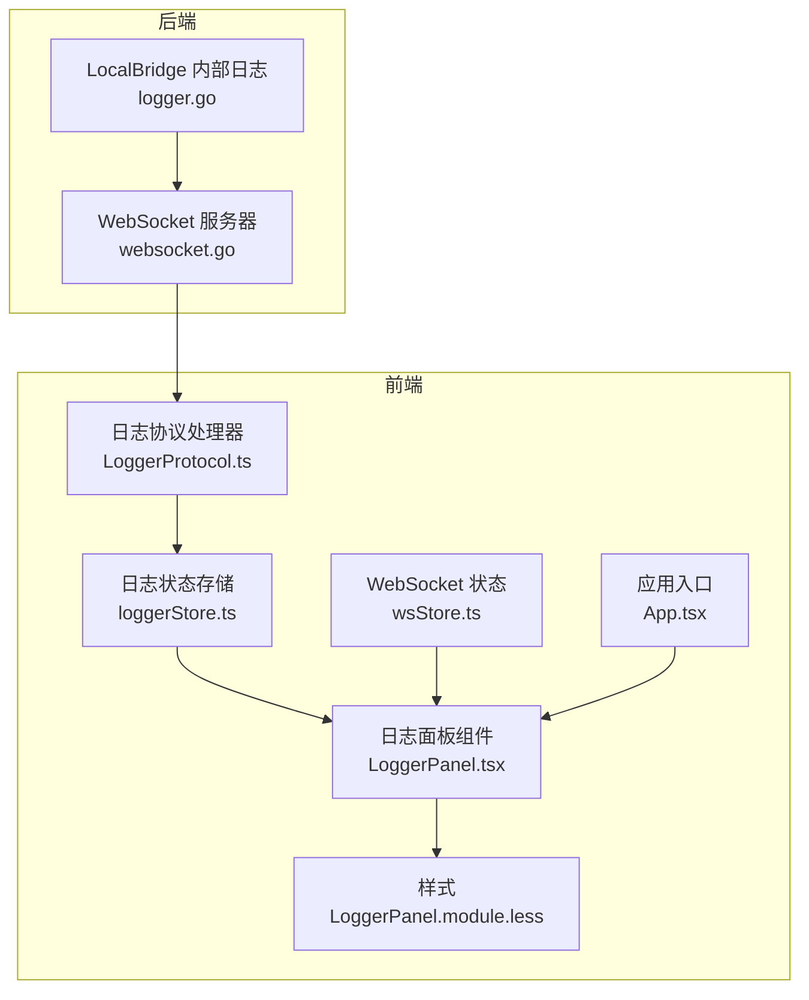
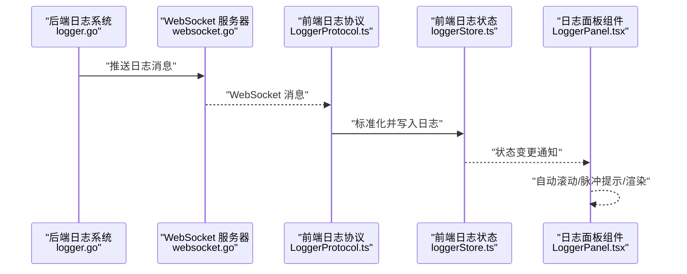
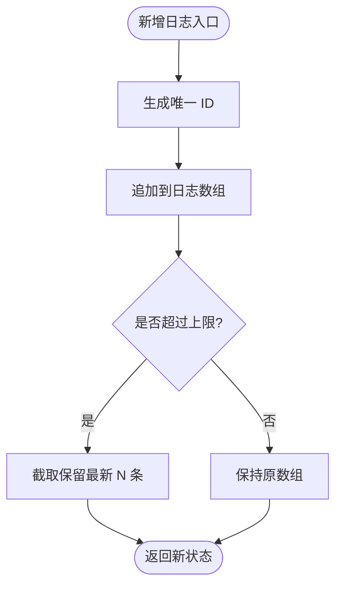
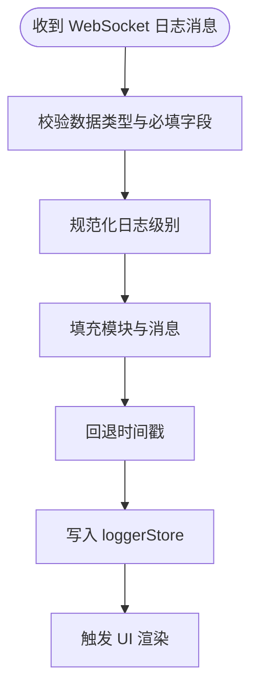
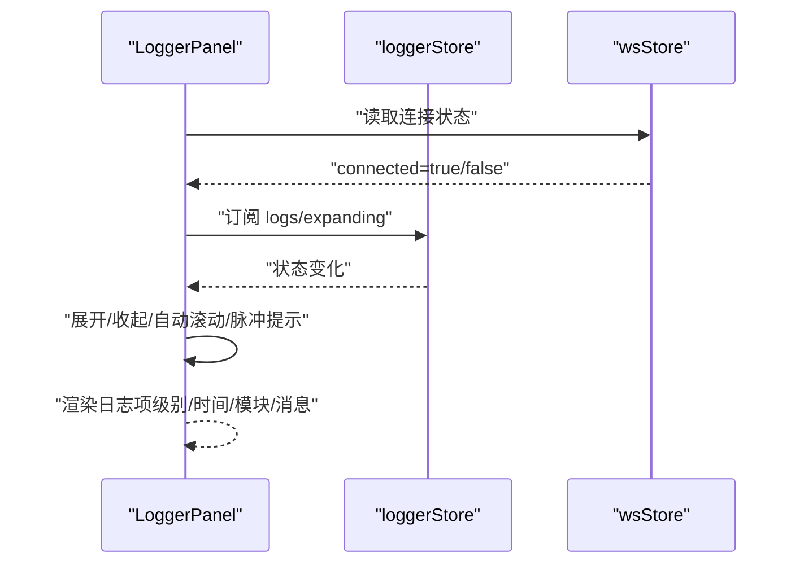
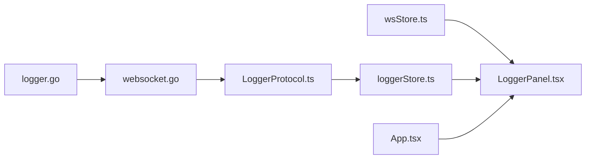

# 日志面板

<cite>
**本文引用的文件**
- [loggerStore.ts](file://src/stores/loggerStore.ts)
- [LoggerProtocol.ts](file://src/services/protocols/LoggerProtocol.ts)
- [LoggerPanel.tsx](file://src/components/panels/tools/LoggerPanel.tsx)
- [LoggerPanel.module.less](file://src/styles/LoggerPanel.module.less)
- [wsStore.ts](file://src/stores/wsStore.ts)
- [websocket.go](file://LocalBridge/internal/server/websocket.go)
- [logger.go](file://LocalBridge/internal/logger/logger.go)
- [App.tsx](file://src/App.tsx)
</cite>

## 目录
1. [简介](#简介)
2. [项目结构](#项目结构)
3. [核心组件](#核心组件)
4. [架构总览](#架构总览)
5. [详细组件分析](#详细组件分析)
6. [依赖关系分析](#依赖关系分析)
7. [性能考量](#性能考量)
8. [故障排查指南](#故障排查指南)
9. [结论](#结论)
10. [附录](#附录)

## 简介
本文件系统性地介绍日志面板的功能架构与日志管理系统，涵盖系统日志收集、错误信息展示、日志过滤与搜索、实时更新机制（WebSocket 推送）、以及日志级别分类与可视化呈现。读者将理解日志存储（loggerStore）、日志协议（LoggerProtocol）、日志渲染组件（LoggerPanel）之间的协作关系，并掌握如何使用日志面板进行问题诊断与定位。

## 项目结构
日志面板相关代码分布在前端 React 组件、状态管理、样式、协议与后端日志系统之间，形成“后端日志 → WebSocket → 前端协议 → 状态存储 → UI 渲染”的完整链路。

图表来源
- [logger.go:1-251](file://LocalBridge/internal/logger/logger.go#L1-L251)
- [websocket.go:1-179](file://LocalBridge/internal/server/websocket.go#L1-L179)
- [App.tsx:321-322](file://src/App.tsx#L321-L322)
- [wsStore.ts:1-24](file://src/stores/wsStore.ts#L1-L24)
- [LoggerProtocol.ts:1-58](file://src/services/protocols/LoggerProtocol.ts#L1-L58)
- [loggerStore.ts:1-46](file://src/stores/loggerStore.ts#L1-L46)
- [LoggerPanel.tsx:1-182](file://src/components/panels/tools/LoggerPanel.tsx#L1-L182)
- [LoggerPanel.module.less:1-272](file://src/styles/LoggerPanel.module.less#L1-L272)

章节来源
- [App.tsx:321-322](file://src/App.tsx#L321-L322)
- [wsStore.ts:18-23](file://src/stores/wsStore.ts#L18-L23)

## 核心组件
- 日志存储（loggerStore）
  - 负责维护日志数组、展开状态、最大日志条数限制、新增日志、清空日志、切换展开等操作。
  - 提供日志条目的结构定义与增删改查能力。
- 日志协议（LoggerProtocol）
  - 作为 WebSocket 路由处理器，接收后端推送的日志消息，标准化日志级别与字段，写入 loggerStore。
- 日志渲染组件（LoggerPanel）
  - 基于 loggerStore 和 wsStore 渲染日志列表，支持展开/收起、自动滚动、脉冲提示、清空日志等交互。
  - 使用 Less 样式区分日志级别（信息/警告/错误），并提供时间、模块、消息的可视化展示。

章节来源
- [loggerStore.ts:3-19](file://src/stores/loggerStore.ts#L3-L19)
- [loggerStore.ts:21-45](file://src/stores/loggerStore.ts#L21-L45)
- [LoggerProtocol.ts:16-56](file://src/services/protocols/LoggerProtocol.ts#L16-L56)
- [LoggerPanel.tsx:55-181](file://src/components/panels/tools/LoggerPanel.tsx#L55-L181)
- [LoggerPanel.module.less:213-248](file://src/styles/LoggerPanel.module.less#L213-L248)

## 架构总览
日志从后端产生，经由 WebSocket 推送到前端，前端通过 LoggerProtocol 标准化后写入 loggerStore，最终由 LoggerPanel 渲染展示。同时，wsStore 提供连接状态，影响日志面板的可见性与行为。

图表来源
- [logger.go:137-162](file://LocalBridge/internal/logger/logger.go#L137-L162)
- [websocket.go:144-161](file://LocalBridge/internal/server/websocket.go#L144-L161)
- [LoggerProtocol.ts:25-56](file://src/services/protocols/LoggerProtocol.ts#L25-L56)
- [loggerStore.ts:26-38](file://src/stores/loggerStore.ts#L26-L38)
- [LoggerPanel.tsx:64-78](file://src/components/panels/tools/LoggerPanel.tsx#L64-L78)

## 详细组件分析

### 日志存储（loggerStore）
- 数据模型
  - 日志条目包含：唯一 ID、级别（INFO/WARN/ERROR）、模块名、消息体、时间戳。
  - 状态包含：日志数组、展开状态、最大日志条数上限。
- 关键行为
  - 新增日志：生成唯一 ID，追加到数组尾部；超过上限则截取保留最新 N 条。
  - 清空日志：重置为空数组。
  - 展开/收起：切换面板展开状态。
- 复杂度与优化
  - 新增日志为 O(n)（数组拼接与截取），n 为当前日志数量；上限控制避免无限增长。
  - 可选优化：使用环形缓冲区替代数组，以获得 O(1) 的插入与固定空间占用。

图表来源
- [loggerStore.ts:26-38](file://src/stores/loggerStore.ts#L26-L38)

章节来源
- [loggerStore.ts:3-9](file://src/stores/loggerStore.ts#L3-L9)
- [loggerStore.ts:11-19](file://src/stores/loggerStore.ts#L11-L19)
- [loggerStore.ts:21-45](file://src/stores/loggerStore.ts#L21-L45)

### 日志协议（LoggerProtocol）
- 路由注册
  - 在 WebSocket 服务器上注册 “/lte/logger” 路由，接收后端推送的日志数据。
- 消息处理
  - 校验数据有效性与字段完整性。
  - 规范化日志级别为大写枚举（INFO/WARN/ERROR），默认未知模块，时间戳缺失时回退当前时间。
  - 写入 loggerStore，触发 UI 更新。
- 错误处理
  - 缺失必要字段或级别不在允许集合时直接忽略，保证健壮性。

图表来源
- [LoggerProtocol.ts:25-56](file://src/services/protocols/LoggerProtocol.ts#L25-L56)

章节来源
- [LoggerProtocol.ts:16-30](file://src/services/protocols/LoggerProtocol.ts#L16-L30)
- [LoggerProtocol.ts:32-56](file://src/services/protocols/LoggerProtocol.ts#L32-L56)

### 日志渲染组件（LoggerPanel）
- 可见性与连接状态
  - 仅在 WebSocket 已连接时显示；连接状态来自 wsStore。
- 展开/收起
  - 收起态：仅显示最新一条日志的图标、模块与消息，点击展开。
  - 展开态：显示完整日志列表，支持清空与收起。
- 实时更新机制
  - 自动滚动：展开且自动滚动开启时，新日志到达自动滚动到底部。
  - 手动滚动：当滚动条靠近底部时自动开启“自动滚动”，否则关闭。
  - 脉冲提示：收起态下有新日志到达时，顶部条目执行脉冲动画提示。
- 样式与级别
  - 使用 Less 样式区分 INFO/WARN/ERROR 的图标与文字颜色。
  - 时间格式化为本地时间字符串，模块与消息分行展示。

图表来源
- [LoggerPanel.tsx:55-98](file://src/components/panels/tools/LoggerPanel.tsx#L55-L98)
- [LoggerPanel.tsx:64-93](file://src/components/panels/tools/LoggerPanel.tsx#L64-L93)
- [LoggerPanel.tsx:102-181](file://src/components/panels/tools/LoggerPanel.tsx#L102-L181)
- [LoggerPanel.module.less:213-248](file://src/styles/LoggerPanel.module.less#L213-L248)

章节来源
- [LoggerPanel.tsx:55-98](file://src/components/panels/tools/LoggerPanel.tsx#L55-L98)
- [LoggerPanel.tsx:102-181](file://src/components/panels/tools/LoggerPanel.tsx#L102-L181)
- [LoggerPanel.module.less:213-248](file://src/styles/LoggerPanel.module.less#L213-L248)

### 日志级别与过滤
- 级别分类
  - INFO：普通信息类日志。
  - WARN：警告类日志。
  - ERROR：错误类日志。
- 前端过滤
  - 当前实现未提供 UI 过滤控件，建议在 UI 中增加按级别筛选的复选框或下拉菜单，结合 loggerStore 的 logs 数组进行本地过滤。
- 后端过滤
  - 可在后端日志系统中设置最小输出级别，减少前端传输与渲染压力。

章节来源
- [LoggerProtocol.ts:44-47](file://src/services/protocols/LoggerProtocol.ts#L44-L47)
- [loggerStore.ts:4](file://src/stores/loggerStore.ts#L4)

### 实时更新机制
- WebSocket 推送
  - 后端日志系统通过 WebSocket 将日志消息广播至前端。
- 自动滚动
  - 展开态下，新日志到达时自动滚动到底部；手动滚动时根据滚动位置决定是否开启自动滚动。
- 脉冲提示
  - 收起态下，新日志到达触发顶部条目脉冲动画，提示用户有新日志。

章节来源
- [websocket.go:164-171](file://LocalBridge/internal/server/websocket.go#L164-L171)
- [LoggerPanel.tsx:64-93](file://src/components/panels/tools/LoggerPanel.tsx#L64-L93)
- [LoggerPanel.tsx:70-78](file://src/components/panels/tools/LoggerPanel.tsx#L70-L78)

## 依赖关系分析
- 组件耦合
  - LoggerPanel 依赖 loggerStore 与 wsStore，耦合度低，便于测试与替换。
  - LoggerProtocol 依赖 WebSocket 服务器与 loggerStore，负责协议层的数据清洗与落库。
- 外部依赖
  - 后端日志系统使用 logrus，具备模块字段注入与文件落盘能力。
  - WebSocket 服务器基于 gorilla/websocket，提供连接管理与广播能力。

图表来源
- [wsStore.ts:18-23](file://src/stores/wsStore.ts#L18-L23)
- [LoggerPanel.tsx:55-98](file://src/components/panels/tools/LoggerPanel.tsx#L55-L98)
- [loggerStore.ts:21-45](file://src/stores/loggerStore.ts#L21-L45)
- [LoggerProtocol.ts:25-30](file://src/services/protocols/LoggerProtocol.ts#L25-L30)
- [App.tsx:321-322](file://src/App.tsx#L321-L322)
- [logger.go:137-162](file://LocalBridge/internal/logger/logger.go#L137-L162)
- [websocket.go:144-161](file://LocalBridge/internal/server/websocket.go#L144-L161)

章节来源
- [App.tsx:321-322](file://src/App.tsx#L321-L322)
- [wsStore.ts:18-23](file://src/stores/wsStore.ts#L18-L23)
- [LoggerProtocol.ts:25-30](file://src/services/protocols/LoggerProtocol.ts#L25-L30)
- [loggerStore.ts:21-45](file://src/stores/loggerStore.ts#L21-L45)
- [LoggerPanel.tsx:55-98](file://src/components/panels/tools/LoggerPanel.tsx#L55-L98)

## 性能考量
- 日志上限控制
  - loggerStore 通过 maxLogs 限制日志数量，避免内存膨胀；建议根据屏幕高度与渲染性能设定合理上限。
- 渲染优化
  - 使用虚拟滚动（如 react-window）可显著提升大量日志的渲染性能。
- 传输与解析
  - 后端仅推送 INFO/WARN/ERROR 三类日志，减少前端解析与渲染负担。
- 自动滚动策略
  - 仅在展开态且处于底部时自动滚动，避免频繁 DOM 操作影响性能。

## 故障排查指南
- 日志面板不显示
  - 检查 WebSocket 是否已连接（wsStore.connected）。
  - 确认后端日志系统是否启用推送钩子并正确初始化。
- 日志级别异常
  - 确认后端日志级别是否为 INFO/WARN/ERROR，前端会忽略非允许级别。
  - 检查模块字段是否为空，前端会回退为 Unknown。
- 日志过多导致卡顿
  - 调整 loggerStore 的 maxLogs 上限，或引入虚拟滚动。
  - 在后端降低日志级别或增加最小输出级别。
- 自动滚动不生效
  - 展开态下需确保滚动容器存在且可滚动到底部。
  - 手动滚动到中间时会关闭自动滚动，属于预期行为。

章节来源
- [LoggerPanel.tsx:95-98](file://src/components/panels/tools/LoggerPanel.tsx#L95-L98)
- [LoggerProtocol.ts:39-47](file://src/services/protocols/LoggerProtocol.ts#L39-L47)
- [loggerStore.ts:24](file://src/stores/loggerStore.ts#L24)

## 结论
日志面板通过清晰的分层设计实现了从后端日志到前端可视化的完整闭环：后端负责日志生成与推送，前端协议负责标准化与落库，前端组件负责实时渲染与交互体验。当前实现提供了基础的级别区分与自动滚动能力，后续可在 UI 层增加过滤与搜索功能，并在性能层引入虚拟滚动与更细粒度的传输控制，以进一步提升可用性与稳定性。

## 附录

### 使用指南
- 查看日志
  - 展开日志面板，查看完整日志列表；收起态下点击顶部条目展开。
- 筛选与搜索
  - 建议在 UI 中增加按级别（INFO/WARN/ERROR）与按模块/关键词的筛选与搜索控件。
- 导出日志
  - 可将 loggerStore 中的 logs 数组序列化为 JSON 或文本文件，便于离线分析。
- 问题诊断
  - 结合时间戳与模块定位问题来源；优先关注 ERROR 级别；对高频 WARN 进行归因与优化。

### 常见分析方法与技巧
- 时间轴分析：按时间排序观察事件顺序与耗时。
- 模块关联：按模块聚合，识别热点模块与异常模块。
- 错误根因：从 ERROR 向上追溯最近的 INFO/WARN，定位触发条件。
- 性能瓶颈：结合日志频率与 UI 卡顿，评估是否需要降低日志级别或引入采样。