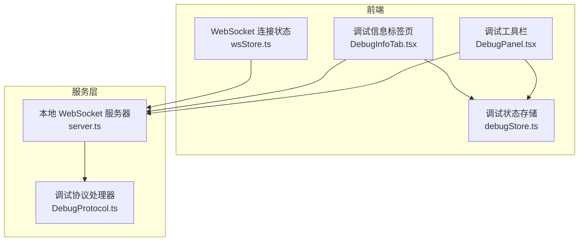
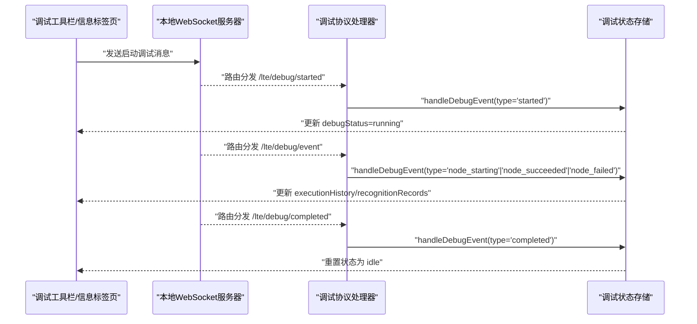
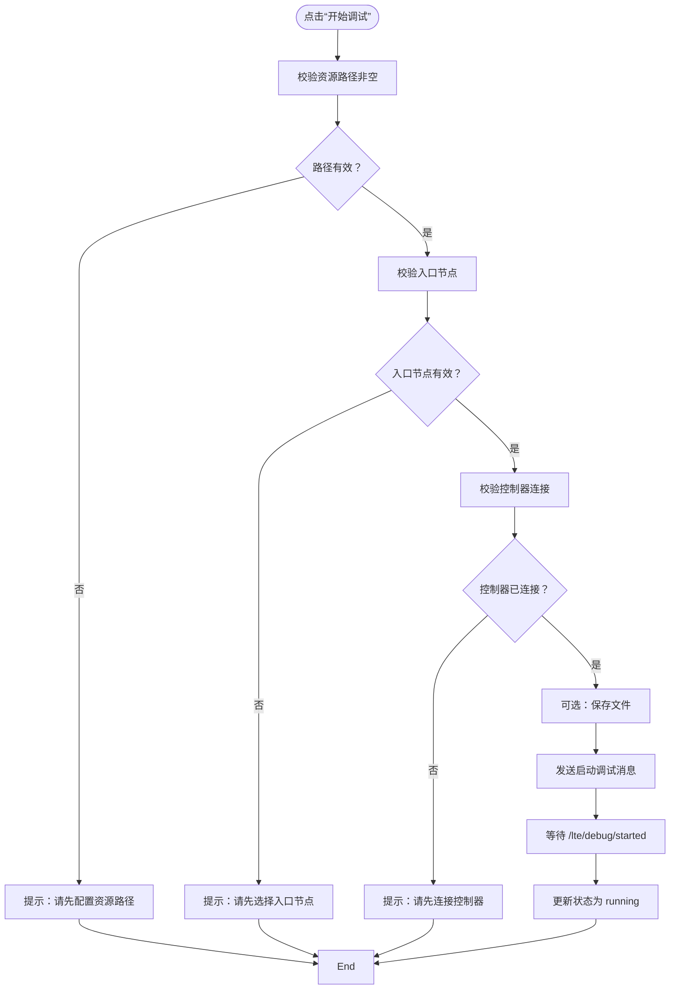
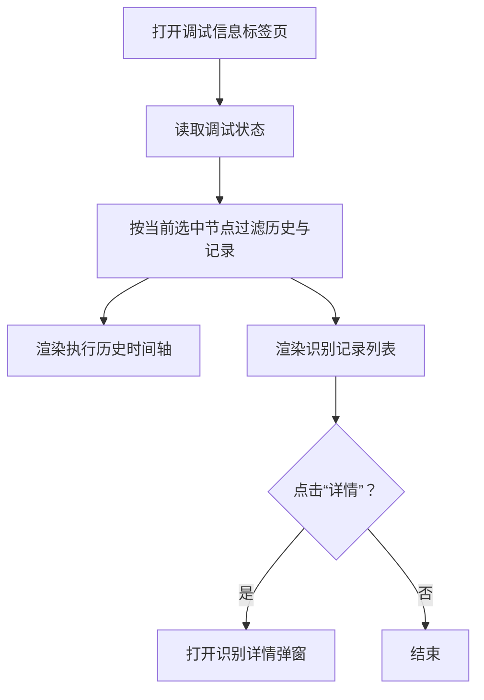
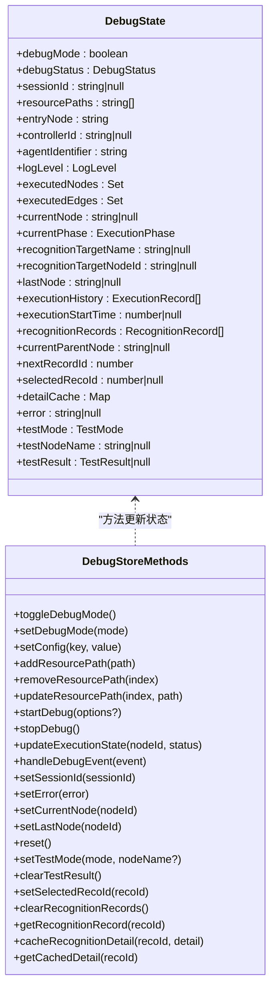
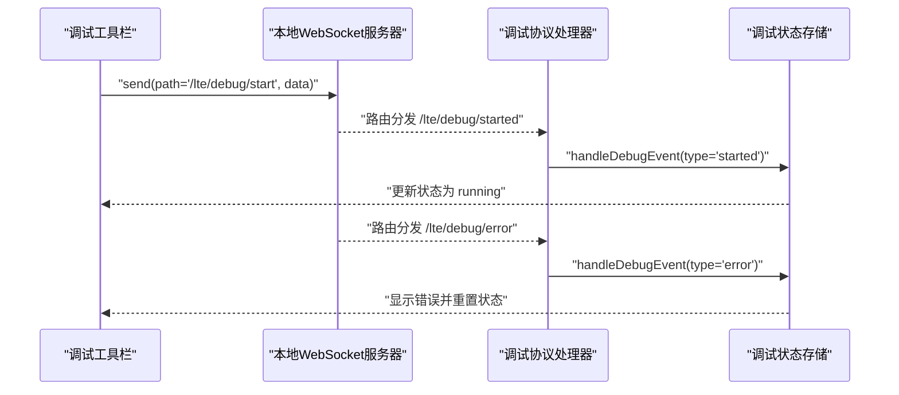
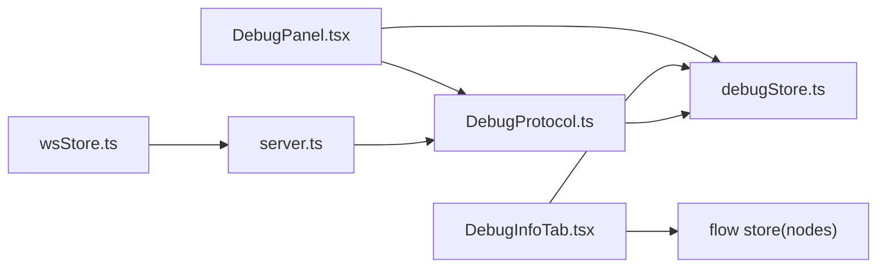

# 调试面板

<cite>
**本文引用的文件**
- [DebugInfoTab.tsx](file://src/components/panels/tools/DebugInfoTab.tsx)
- [DebugPanel.tsx](file://src/components/panels/tools/DebugPanel.tsx)
- [debugStore.ts](file://src/stores/debugStore.ts)
- [DebugProtocol.ts](file://src/services/protocols/DebugProtocol.ts)
- [server.ts](file://src/services/server.ts)
- [wsStore.ts](file://src/stores/wsStore.ts)
</cite>

## 目录
1. [简介](#简介)
2. [项目结构](#项目结构)
3. [核心组件](#核心组件)
4. [架构总览](#架构总览)
5. [详细组件分析](#详细组件分析)
6. [依赖关系分析](#依赖关系分析)
7. [性能考量](#性能考量)
8. [故障排除指南](#故障排除指南)
9. [结论](#结论)
10. [附录](#附录)

## 简介
本文件面向“调试面板”的使用者与维护者，系统性阐述调试面板的功能架构与工作原理，涵盖：
- 流程执行状态监控：节点执行历史、识别记录、动作执行状态
- 调试信息展示：执行时间统计、错误信息呈现、识别详情查看
- 实时诊断能力：基于 WebSocket 的事件驱动更新、会话状态同步、单节点测试模式
- 与后端服务的通信机制：WebSocket 路由注册、消息分发与处理
- 数据流管理：执行历史记录、识别详情缓存、错误信息收集与状态同步
- 使用指南：启动调试会话、查看执行状态、分析错误原因、优化工作流性能
- 实际调试场景示例与故障排除技巧

## 项目结构
调试面板位于前端工程的“工具面板”模块中，主要由以下部分组成：
- 调试工具栏（DebugPanel）：负责调试配置、启动/停止调试、状态展示、日志打开、识别记录面板切换
- 调试信息标签页（DebugInfoTab）：展示执行历史时间轴、识别记录列表、识别详情弹窗
- 调试状态存储（debugStore）：集中管理调试状态、执行历史、识别记录、详情缓存、单节点测试结果
- WebSocket 服务层（server.ts + DebugProtocol.ts）：封装本地 WebSocket 连接、路由注册、消息分发与调试事件处理
- WebSocket 连接状态（wsStore.ts）：轻量的状态存储，用于 UI 展示连接状态

图表来源
- [DebugPanel.tsx:1-493](file://src/components/panels/tools/DebugPanel.tsx#L1-L493)
- [DebugInfoTab.tsx:1-375](file://src/components/panels/tools/DebugInfoTab.tsx#L1-L375)
- [debugStore.ts:1-897](file://src/stores/debugStore.ts#L1-L897)
- [server.ts:1-373](file://src/services/server.ts#L1-L373)
- [DebugProtocol.ts:1-1004](file://src/services/protocols/DebugProtocol.ts#L1-L1004)
- [wsStore.ts:1-24](file://src/stores/wsStore.ts#L1-L24)

章节来源
- [DebugPanel.tsx:1-493](file://src/components/panels/tools/DebugPanel.tsx#L1-L493)
- [DebugInfoTab.tsx:1-375](file://src/components/panels/tools/DebugInfoTab.tsx#L1-L375)
- [debugStore.ts:1-897](file://src/stores/debugStore.ts#L1-L897)
- [server.ts:1-373](file://src/services/server.ts#L1-L373)
- [DebugProtocol.ts:1-1004](file://src/services/protocols/DebugProtocol.ts#L1-L1004)
- [wsStore.ts:1-24](file://src/stores/wsStore.ts#L1-L24)

## 核心组件
- 调试工具栏（DebugPanel）
  - 负责调试配置（资源路径、Agent 标识符、入口节点）、启动/停止调试、状态展示、日志打开、识别记录面板切换
  - 与调试协议交互，发送启动/停止调试消息，并根据连接状态启用/禁用按钮
- 调试信息标签页（DebugInfoTab）
  - 展示执行历史时间轴、识别记录列表、识别详情弹窗
  - 支持按当前选中节点过滤执行历史与识别记录
- 调试状态存储（debugStore）
  - 管理调试模式、会话状态、执行历史、识别记录、详情缓存、错误信息、单节点测试结果
  - 提供事件处理函数，将后端 WebSocket 事件映射为前端状态变更
- WebSocket 服务层（server.ts + DebugProtocol.ts）
  - 封装本地 WebSocket 连接、握手、路由注册、消息分发
  - 调试协议处理器负责解析后端调试事件，更新前端状态并触发 UI 更新
- WebSocket 连接状态（wsStore.ts）
  - 轻量存储连接状态，供 UI 展示连接/断开状态

章节来源
- [DebugPanel.tsx:1-493](file://src/components/panels/tools/DebugPanel.tsx#L1-L493)
- [DebugInfoTab.tsx:1-375](file://src/components/panels/tools/DebugInfoTab.tsx#L1-L375)
- [debugStore.ts:1-897](file://src/stores/debugStore.ts#L1-L897)
- [server.ts:1-373](file://src/services/server.ts#L1-L373)
- [DebugProtocol.ts:1-1004](file://src/services/protocols/DebugProtocol.ts#L1-L1004)
- [wsStore.ts:1-24](file://src/stores/wsStore.ts#L1-L24)

## 架构总览
调试面板采用“事件驱动 + 状态存储”的架构：
- 前端通过 WebSocket 与本地服务通信，接收调试事件
- 调试协议处理器解析事件并调用调试状态存储进行状态更新
- UI 组件订阅状态存储，实时渲染执行历史、识别记录与诊断信息
- 调试状态存储对历史与缓存进行容量控制，避免内存膨胀

图表来源
- [DebugProtocol.ts:47-75](file://src/services/protocols/DebugProtocol.ts#L47-L75)
- [DebugProtocol.ts:136-232](file://src/services/protocols/DebugProtocol.ts#L136-L232)
- [debugStore.ts:437-795](file://src/stores/debugStore.ts#L437-L795)

章节来源
- [DebugProtocol.ts:1-1004](file://src/services/protocols/DebugProtocol.ts#L1-L1004)
- [debugStore.ts:1-897](file://src/stores/debugStore.ts#L1-L897)

## 详细组件分析

### 组件一：调试工具栏（DebugPanel）
- 功能职责
  - 调试配置：资源路径（支持多路径覆盖）、Agent 标识符、入口节点选择
  - 调试控制：开始调试（校验资源路径、入口节点、控制器连接）、停止调试
  - 状态展示：当前会话状态、运行时长、当前节点与阶段（识别中/执行中）
  - 辅助功能：打开日志、切换识别记录面板
- 关键交互
  - 启动调试时，将节点 ID 转换为管道节点名称，发送启动消息
  - 停止调试时，若存在会话 ID，则向后端发送停止消息并重置前端状态
- 与服务层集成
  - 通过调试协议发送启动/停止消息
  - 监听连接状态变化，自动加载后端配置填充资源路径

图表来源
- [DebugPanel.tsx:289-332](file://src/components/panels/tools/DebugPanel.tsx#L289-L332)
- [DebugProtocol.ts:574-666](file://src/services/protocols/DebugProtocol.ts#L574-L666)

章节来源
- [DebugPanel.tsx:1-493](file://src/components/panels/tools/DebugPanel.tsx#L1-L493)

### 组件二：调试信息标签页（DebugInfoTab）
- 功能职责
  - 执行历史时间轴：按节点维度展示运行/完成/失败状态，显示开始/结束时间与耗时
  - 识别记录列表：展示节点被识别的记录，支持查看详情（含命中状态、算法、框图等）
  - 识别详情弹窗：按选中的识别 ID 拉取并展示识别详情（懒加载 + 缓存）
  - 会话概览：显示当前会话状态、Session ID、执行次数与累计时长
- 数据来源
  - 来自调试状态存储的 executionHistory 与 recognitionRecords
  - 识别详情来自 detailCache 或后端 API（通过调试协议触发）

图表来源
- [DebugInfoTab.tsx:36-173](file://src/components/panels/tools/DebugInfoTab.tsx#L36-L173)
- [DebugInfoTab.tsx:286-363](file://src/components/panels/tools/DebugInfoTab.tsx#L286-L363)

章节来源
- [DebugInfoTab.tsx:1-375](file://src/components/panels/tools/DebugInfoTab.tsx#L1-L375)

### 组件三：调试状态存储（debugStore）
- 状态模型
  - 调试模式与状态：debugMode、debugStatus（idle/preparing/running/paused/completed）
  - 会话与配置：sessionId、resourcePaths、entryNode、controllerId、agentIdentifier、logLevel
  - 执行与识别：executedNodes、executedEdges、currentNode、currentPhase、lastNode、executionHistory、recognitionRecords、nextRecordId、selectedRecoId、detailCache
  - 错误与测试：error、testMode、testNodeName、testResult
- 事件处理与数据流
  - handleDebugEvent：统一入口，根据事件类型更新执行历史、识别记录、当前节点与阶段、错误信息
  - startDebug/stopDebug：初始化/清理调试状态，必要时通知后端销毁会话
  - 识别详情缓存：按上限清理，避免内存占用过高
- 性能与容量控制
  - 执行历史与识别记录均设置最大条数与清理比例，保证 UI 流畅
  - 识别详情缓存按上限清理，避免大图 Base64 导致内存膨胀

图表来源
- [debugStore.ts:143-221](file://src/stores/debugStore.ts#L143-L221)
- [debugStore.ts:227-896](file://src/stores/debugStore.ts#L227-L896)

章节来源
- [debugStore.ts:1-897](file://src/stores/debugStore.ts#L1-L897)

### 组件四：WebSocket 服务层（server.ts + DebugProtocol.ts）
- 本地 WebSocket 服务器
  - 负责连接建立、握手、路由注册、消息分发、连接状态回调
  - 提供 onStatus/onConnecting 回调，供上层组件感知连接状态变化
- 调试协议处理器
  - 注册调试相关路由：事件、错误、完成、启动、停止、运行中
  - 解析后端事件，转换为前端可消费的事件类型，调用调试状态存储更新 UI
  - 在连接断开时自动停止调试，避免状态不一致
- 与 UI 的协作
  - 调试工具栏通过调试协议发送启动/停止消息
  - 调试信息标签页通过状态存储订阅渲染

图表来源
- [server.ts:348-372](file://src/services/server.ts#L348-L372)
- [DebugProtocol.ts:25-75](file://src/services/protocols/DebugProtocol.ts#L25-L75)
- [DebugProtocol.ts:444-540](file://src/services/protocols/DebugProtocol.ts#L444-L540)

章节来源
- [server.ts:1-373](file://src/services/server.ts#L1-L373)
- [DebugProtocol.ts:1-1004](file://src/services/protocols/DebugProtocol.ts#L1-L1004)

### 组件五：WebSocket 连接状态（wsStore.ts）
- 轻量状态存储，仅包含连接状态与连接中状态
- 用于 UI 展示连接状态，便于用户感知本地服务连通性

章节来源
- [wsStore.ts:1-24](file://src/stores/wsStore.ts#L1-L24)

## 依赖关系分析
- 调试工具栏依赖
  - 调试状态存储：读取/写入调试状态、配置、会话信息
  - 调试协议：发送启动/停止消息
  - 控制器连接状态：决定按钮可用性
- 调试信息标签页依赖
  - 调试状态存储：读取执行历史、识别记录、详情缓存
  - 流程图状态存储：读取当前选中节点
- WebSocket 服务层依赖
  - 调试协议处理器依赖调试状态存储以更新 UI
  - 本地 WebSocket 服务器负责路由注册与消息分发

图表来源
- [DebugPanel.tsx:7-77](file://src/components/panels/tools/DebugPanel.tsx#L7-L77)
- [DebugInfoTab.tsx:9-34](file://src/components/panels/tools/DebugInfoTab.tsx#L9-L34)
- [DebugProtocol.ts:16-75](file://src/services/protocols/DebugProtocol.ts#L16-L75)
- [server.ts:333-372](file://src/services/server.ts#L333-L372)
- [wsStore.ts:18-23](file://src/stores/wsStore.ts#L18-L23)

章节来源
- [DebugPanel.tsx:1-493](file://src/components/panels/tools/DebugPanel.tsx#L1-L493)
- [DebugInfoTab.tsx:1-375](file://src/components/panels/tools/DebugInfoTab.tsx#L1-L375)
- [debugStore.ts:1-897](file://src/stores/debugStore.ts#L1-L897)
- [server.ts:1-373](file://src/services/server.ts#L1-L373)
- [DebugProtocol.ts:1-1004](file://src/services/protocols/DebugProtocol.ts#L1-L1004)
- [wsStore.ts:1-24](file://src/stores/wsStore.ts#L1-L24)

## 性能考量
- 容量控制
  - 执行历史与识别记录最大条数限制，超过阈值按比例清理，避免内存增长
  - 识别详情缓存上限控制，清理最旧项，避免大图 Base64 占用过多内存
- 渲染优化
  - 执行历史时间轴与识别记录列表使用 useMemo 过滤当前节点数据，减少无效渲染
  - 识别详情弹窗按需打开，避免不必要的组件挂载
- 网络与状态一致性
  - 连接断开时自动停止调试，防止状态不一致
  - 会话 ID 校验，避免跨会话事件污染当前调试状态

章节来源
- [debugStore.ts:10-21](file://src/stores/debugStore.ts#L10-L21)
- [debugStore.ts:467-471](file://src/stores/debugStore.ts#L467-L471)
- [debugStore.ts:576-595](file://src/stores/debugStore.ts#L576-L595)
- [debugStore.ts:882-887](file://src/stores/debugStore.ts#L882-L887)
- [DebugProtocol.ts:29-40](file://src/services/protocols/DebugProtocol.ts#L29-L40)

## 故障排除指南
- 启动调试失败
  - 检查资源路径是否配置且非空
  - 检查入口节点是否选择
  - 检查控制器是否连接
  - 若后端返回“资源加载失败”，检查资源路径是否指向包含 pipeline 的目录，确认各 pipeline 内容格式正确
- 连接本地服务失败
  - 确认本地服务已启动且端口可用
  - 查看连接超时/失败提示，按指引检查服务状态
- 调试过程中断开连接
  - 自动停止调试并重置状态，重新连接后可再次启动
- 识别详情无法查看
  - 确认识别记录存在且 recoId 有效
  - 检查缓存是否存在，必要时重新触发识别事件以刷新缓存
- 错误信息定位
  - 调试信息标签页会显示节点执行错误文本
  - 调试协议处理器会弹窗提示资源加载失败的具体建议

章节来源
- [DebugPanel.tsx:289-332](file://src/components/panels/tools/DebugPanel.tsx#L289-L332)
- [DebugProtocol.ts:444-540](file://src/services/protocols/DebugProtocol.ts#L444-L540)
- [DebugProtocol.ts:574-666](file://src/services/protocols/DebugProtocol.ts#L574-L666)
- [DebugInfoTab.tsx:150-165](file://src/components/panels/tools/DebugInfoTab.tsx#L150-L165)

## 结论
调试面板通过清晰的组件划分与事件驱动架构，实现了对流程执行状态的实时监控、调试信息的可视化展示以及与后端服务的稳定通信。其容量控制与状态一致性设计确保了在复杂调试场景下的稳定性与性能表现。配合完善的使用指南与故障排除技巧，用户可以高效地启动调试会话、定位问题并优化工作流性能。

## 附录
- 使用指南（简要）
  - 准备：配置资源路径、选择入口节点、连接控制器
  - 启动：点击“开始调试”，等待会话启动
  - 观察：查看执行历史时间轴、识别记录与识别详情
  - 停止：点击“停止调试”，或等待调试完成自动停止
  - 诊断：结合错误信息与识别详情定位问题
- 实际调试场景示例
  - 识别失败：查看识别记录与识别详情，确认算法与命中状态
  - 节点执行失败：查看执行历史时间轴，定位失败节点与错误文本
  - 性能优化：关注节点耗时，优化识别算法或动作执行逻辑