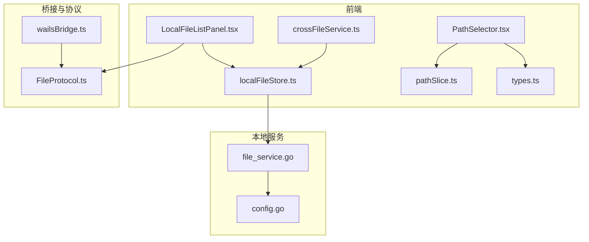
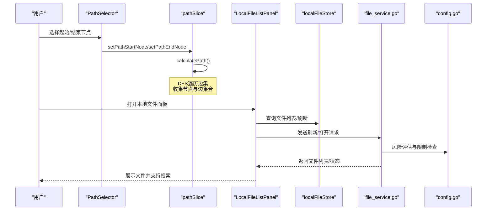
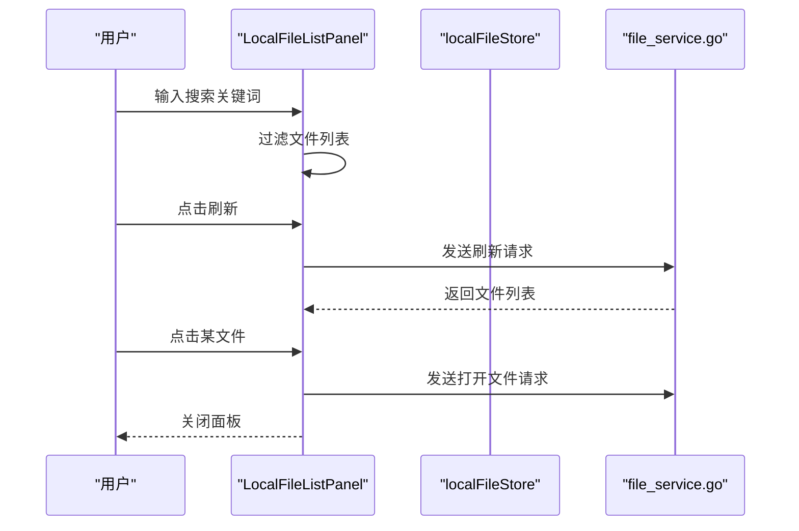
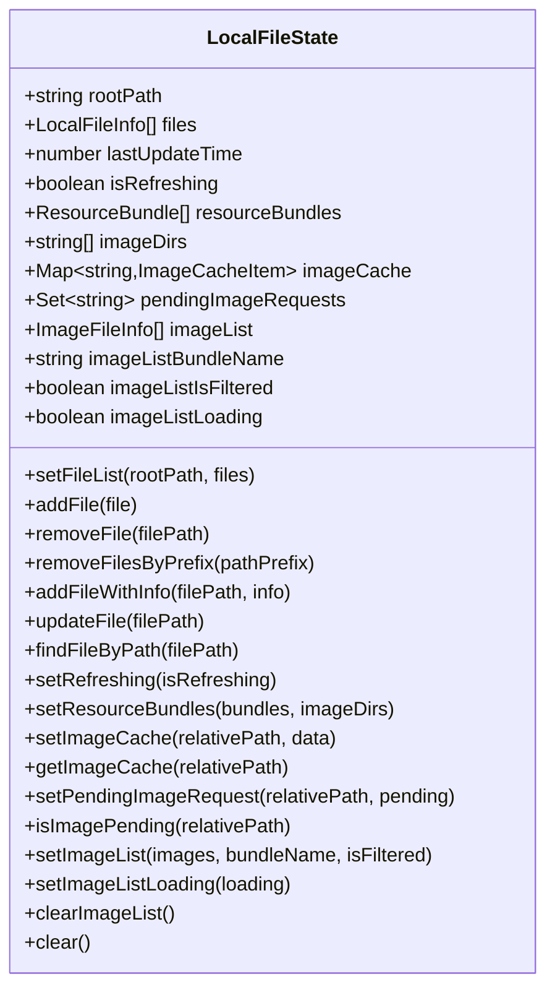
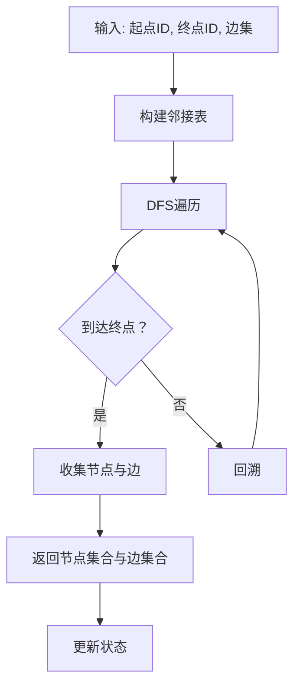
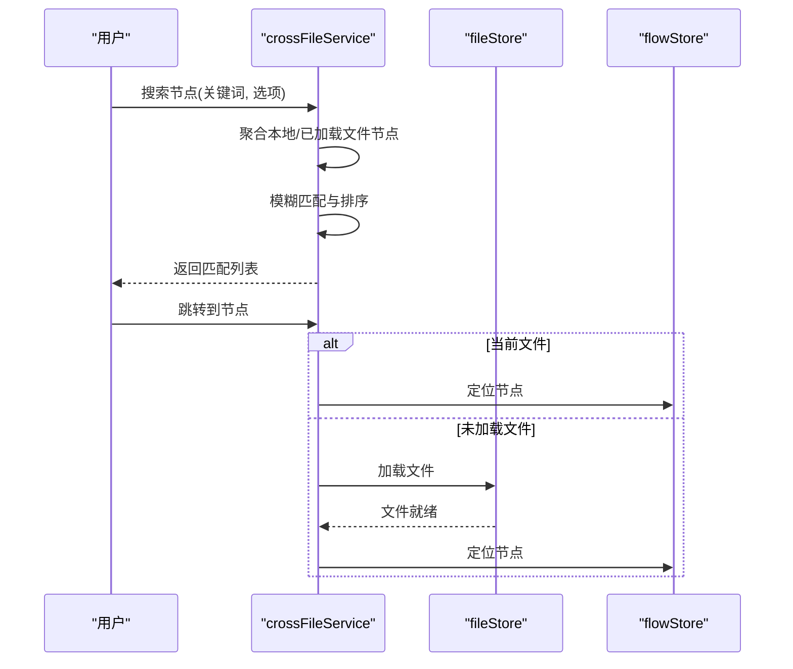
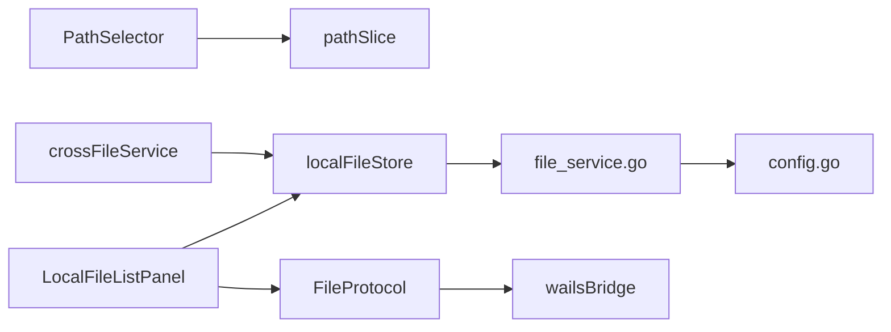

# 路径选择器

<cite>
**本文档引用的文件**
- [PathSelector.tsx](file://src/components/panels/tools/PathSelector.tsx)
- [localFileStore.ts](file://src/stores/localFileStore.ts)
- [LocalFileListPanel.tsx](file://src/components/panels/main/LocalFileListPanel.tsx)
- [pathSlice.ts](file://src/stores/flow/slices/pathSlice.ts)
- [types.ts](file://src/stores/flow/types.ts)
- [crossFileService.ts](file://src/services/crossFileService.ts)
- [file_service.go](file://LocalBridge/internal/service/file/file_service.go)
- [config.go](file://LocalBridge/internal/config/config.go)
- [wailsBridge.ts](file://src/utils/wailsBridge.ts)
- [FileProtocol.ts](file://src/services/protocols/FileProtocol.ts)
</cite>

## 目录
1. [简介](#简介)
2. [项目结构](#项目结构)
3. [核心组件](#核心组件)
4. [架构总览](#架构总览)
5. [详细组件分析](#详细组件分析)
6. [依赖关系分析](#依赖关系分析)
7. [性能考虑](#性能考虑)
8. [故障排查指南](#故障排查指南)
9. [结论](#结论)
10. [附录](#附录)

## 简介
本文件面向“路径选择器”的功能与实现进行全面说明，涵盖以下方面：
- 路径选择器的功能架构与文件系统导航机制
- 文件与目录的选择、路径管理、本地文件浏览
- 路径验证机制与安全策略
- 最近使用路径历史与快速访问
- 与本地文件系统的集成（文件扫描、权限检查、路径标准化）
- UI 设计与交互（树形目录、文件图标、搜索过滤）
- 使用指南与最佳实践、安全注意事项

## 项目结构
围绕路径选择器的相关模块主要分布在前端组件与状态管理、本地文件服务以及桥接层：
- 前端路径选择与文件浏览：PathSelector、LocalFileListPanel、localFileStore
- 流程图路径计算：pathSlice、types
- 跨文件节点导航：crossFileService
- 本地文件服务与安全校验：file_service.go、config.go
- Wails 桥接与协议：wailsBridge.ts、FileProtocol.ts

**图表来源**
- [PathSelector.tsx:1-120](file://src/components/panels/tools/PathSelector.tsx#L1-L120)
- [LocalFileListPanel.tsx:1-165](file://src/components/panels/main/LocalFileListPanel.tsx#L1-L165)
- [localFileStore.ts:1-338](file://src/stores/localFileStore.ts#L1-L338)
- [pathSlice.ts:1-159](file://src/stores/flow/slices/pathSlice.ts#L1-L159)
- [types.ts:340-362](file://src/stores/flow/types.ts#L340-L362)
- [crossFileService.ts:1-565](file://src/services/crossFileService.ts#L1-L565)
- [file_service.go:1-360](file://LocalBridge/internal/service/file/file_service.go#L1-L360)
- [config.go:259-338](file://LocalBridge/internal/config/config.go#L259-L338)
- [wailsBridge.ts:1-197](file://src/utils/wailsBridge.ts#L1-L197)
- [FileProtocol.ts:560-606](file://src/services/protocols/FileProtocol.ts#L560-L606)

**章节来源**
- [PathSelector.tsx:1-120](file://src/components/panels/tools/PathSelector.tsx#L1-L120)
- [LocalFileListPanel.tsx:1-165](file://src/components/panels/main/LocalFileListPanel.tsx#L1-L165)
- [localFileStore.ts:1-338](file://src/stores/localFileStore.ts#L1-L338)
- [pathSlice.ts:1-159](file://src/stores/flow/slices/pathSlice.ts#L1-L159)
- [types.ts:340-362](file://src/stores/flow/types.ts#L340-L362)
- [crossFileService.ts:1-565](file://src/services/crossFileService.ts#L1-L565)
- [file_service.go:1-360](file://LocalBridge/internal/service/file/file_service.go#L1-L360)
- [config.go:259-338](file://LocalBridge/internal/config/config.go#L259-L338)
- [wailsBridge.ts:1-197](file://src/utils/wailsBridge.ts#L1-L197)
- [FileProtocol.ts:560-606](file://src/services/protocols/FileProtocol.ts#L560-L606)

## 核心组件
- 路径选择器（PathSelector）：提供流程图节点间的路径模式开关与起止节点选择，用于可视化路径计算结果。
- 本地文件列表面板（LocalFileListPanel）：展示本地文件系统中的文件，支持搜索、刷新与打开文件。
- 本地文件状态（localFileStore）：维护根目录、文件列表、资源包、图片缓存等状态，并提供增删改查与批量操作。
- 路径切片（pathSlice）：基于流程图边集计算从起点到终点的所有可达路径节点与边集合。
- 跨文件服务（crossFileService）：整合本地文件与前端已加载文件的节点，提供跨文件搜索、跳转与自动完成。
- 本地文件服务（file_service.go）：负责文件扫描、变更监听、读写、安全校验与事件发布。
- 配置与风险评估（config.go）：提供高风险目录判断与扫描限制建议。
- Wails 桥接（wailsBridge.ts）：检测运行环境、事件监听与桥接调用。
- 文件协议（FileProtocol.ts）：保存确认机制与回调管理。

**章节来源**
- [PathSelector.tsx:1-120](file://src/components/panels/tools/PathSelector.tsx#L1-L120)
- [LocalFileListPanel.tsx:1-165](file://src/components/panels/main/LocalFileListPanel.tsx#L1-L165)
- [localFileStore.ts:1-338](file://src/stores/localFileStore.ts#L1-L338)
- [pathSlice.ts:1-159](file://src/stores/flow/slices/pathSlice.ts#L1-L159)
- [types.ts:340-362](file://src/stores/flow/types.ts#L340-L362)
- [crossFileService.ts:1-565](file://src/services/crossFileService.ts#L1-L565)
- [file_service.go:1-360](file://LocalBridge/internal/service/file/file_service.go#L1-L360)
- [config.go:259-338](file://LocalBridge/internal/config/config.go#L259-L338)
- [wailsBridge.ts:1-197](file://src/utils/wailsBridge.ts#L1-L197)
- [FileProtocol.ts:560-606](file://src/services/protocols/FileProtocol.ts#L560-L606)

## 架构总览
路径选择器贯穿前端 UI、状态管理、本地文件服务与桥接层，形成“选择—浏览—验证—打开”的闭环。

**图表来源**
- [PathSelector.tsx:1-120](file://src/components/panels/tools/PathSelector.tsx#L1-L120)
- [pathSlice.ts:1-159](file://src/stores/flow/slices/pathSlice.ts#L1-L159)
- [LocalFileListPanel.tsx:1-165](file://src/components/panels/main/LocalFileListPanel.tsx#L1-L165)
- [localFileStore.ts:1-338](file://src/stores/localFileStore.ts#L1-L338)
- [file_service.go:1-360](file://LocalBridge/internal/service/file/file_service.go#L1-L360)
- [config.go:259-338](file://LocalBridge/internal/config/config.go#L259-L338)

## 详细组件分析

### 路径选择器（PathSelector）
- 功能要点
  - 起始/结束节点选择：通过下拉框选择流程图节点，支持搜索过滤与清空。
  - 路径模式控制：开启/关闭路径模式，切换按钮样式与文字。
  - 结果提示：根据是否存在可达路径显示成功或失败提示。
  - 与流程图状态联动：通过 zustand slice 更新路径模式与节点选择。

**图表来源**
- [PathSelector.tsx:1-120](file://src/components/panels/tools/PathSelector.tsx#L1-L120)
- [pathSlice.ts:1-159](file://src/stores/flow/slices/pathSlice.ts#L1-L159)

**章节来源**
- [PathSelector.tsx:1-120](file://src/components/panels/tools/PathSelector.tsx#L1-L120)
- [pathSlice.ts:1-159](file://src/stores/flow/slices/pathSlice.ts#L1-L159)
- [types.ts:340-362](file://src/stores/flow/types.ts#L340-L362)

### 本地文件列表面板（LocalFileListPanel）
- 功能要点
  - 文件列表展示：显示文件名与相对路径，支持徽章统计总数。
  - 搜索过滤：按文件名或相对路径进行大小写不敏感过滤。
  - 刷新机制：连接本地服务后请求刷新文件列表。
  - 打开文件：向本地服务发送打开文件请求并关闭面板。

**图表来源**
- [LocalFileListPanel.tsx:1-165](file://src/components/panels/main/LocalFileListPanel.tsx#L1-L165)
- [localFileStore.ts:1-338](file://src/stores/localFileStore.ts#L1-L338)
- [file_service.go:1-360](file://LocalBridge/internal/service/file/file_service.go#L1-L360)

**章节来源**
- [LocalFileListPanel.tsx:1-165](file://src/components/panels/main/LocalFileListPanel.tsx#L1-L165)
- [localFileStore.ts:1-338](file://src/stores/localFileStore.ts#L1-L338)

### 本地文件状态（localFileStore）
- 数据模型
  - 文件节点信息：标签、前缀
  - 本地文件信息：绝对路径、文件名、相对路径、节点列表、前缀
  - 资源包信息：绝对路径、相对路径、名称、目录存在性、image目录绝对路径
  - 图片缓存项：base64、MIME、尺寸、所属资源包、绝对路径、时间戳
  - 图片文件信息：相对路径、所属资源包
- 核心能力
  - 文件列表管理：全量设置、增量添加/删除、按前缀批量删除、按路径查找
  - 资源包与图片：设置资源包列表、图片缓存读写、请求状态管理
  - 图片列表：设置、加载状态、清空
  - 清空缓存：重置所有状态

**图表来源**
- [localFileStore.ts:1-338](file://src/stores/localFileStore.ts#L1-L338)

**章节来源**
- [localFileStore.ts:1-338](file://src/stores/localFileStore.ts#L1-L338)

### 路径计算（pathSlice）
- 算法要点
  - 基于边集构建邻接表
  - 使用 DFS 遍历所有从起点到终点的路径，收集途经节点与边集合
  - 若无路径则清空结果集合
- 状态管理
  - pathMode、pathStartNodeId、pathEndNodeId、pathNodeIds、pathEdgeIds
  - 提供设置模式、设置起止节点、计算路径、清除路径的方法

**图表来源**
- [pathSlice.ts:1-159](file://src/stores/flow/slices/pathSlice.ts#L1-L159)
- [types.ts:340-362](file://src/stores/flow/types.ts#L340-L362)

**章节来源**
- [pathSlice.ts:1-159](file://src/stores/flow/slices/pathSlice.ts#L1-L159)
- [types.ts:340-362](file://src/stores/flow/types.ts#L340-L362)

### 跨文件节点导航（crossFileService）
- 能力概述
  - 连接/未连接两种模式下的节点聚合
  - 节点搜索（模糊匹配、类型过滤、当前文件优先）
  - 节点跳转（当前文件直接定位、未加载文件先加载再定位）
  - 自动完成（带前缀完整节点名）
- 关键流程
  - 搜索匹配 → 选择最佳候选 → 跳转或加载 → 定位节点

**图表来源**
- [crossFileService.ts:1-565](file://src/services/crossFileService.ts#L1-L565)

**章节来源**
- [crossFileService.ts:1-565](file://src/services/crossFileService.ts#L1-L565)

### 本地文件服务与安全校验（file_service.go）
- 文件服务职责
  - 初始扫描与增量监听
  - 文件读取/保存/创建
  - 变更事件处理（创建/修改/删除/重命名）
  - 路径安全校验（绝对路径转换、根目录范围检查）
- 风险评估（config.go）
  - 高风险目录识别（系统目录、驱动器根、用户主目录）
  - 扫描限制建议（最大深度、最大文件数）

**图表来源**
- [file_service.go:345-359](file://LocalBridge/internal/service/file/file_service.go#L345-L359)
- [config.go:259-338](file://LocalBridge/internal/config/config.go#L259-L338)

**章节来源**
- [file_service.go:1-360](file://LocalBridge/internal/service/file/file_service.go#L1-L360)
- [config.go:259-338](file://LocalBridge/internal/config/config.go#L259-L338)

### Wails 桥接与协议（wailsBridge.ts、FileProtocol.ts）
- Wails 桥接
  - 环境检测、事件监听、后端调用（端口、工作目录、根目录设置、重启桥接）
- 文件协议
  - 保存确认回调注册与超时处理
  - 断开连接时清理等待中的回调

**章节来源**
- [wailsBridge.ts:1-197](file://src/utils/wailsBridge.ts#L1-L197)
- [FileProtocol.ts:560-606](file://src/services/protocols/FileProtocol.ts#L560-L606)

## 依赖关系分析
- 组件耦合
  - PathSelector 依赖 flow store 的 pathSlice 与节点数据
  - LocalFileListPanel 依赖 localFileStore 与本地服务协议
  - crossFileService 依赖 localFileStore 与 fileStore
  - file_service.go 依赖配置模块进行风险评估
- 外部依赖
  - Wails 运行时与 Go 后端桥接
  - 本地文件系统扫描与监听

**图表来源**
- [PathSelector.tsx:1-120](file://src/components/panels/tools/PathSelector.tsx#L1-L120)
- [LocalFileListPanel.tsx:1-165](file://src/components/panels/main/LocalFileListPanel.tsx#L1-L165)
- [localFileStore.ts:1-338](file://src/stores/localFileStore.ts#L1-L338)
- [crossFileService.ts:1-565](file://src/services/crossFileService.ts#L1-L565)
- [file_service.go:1-360](file://LocalBridge/internal/service/file/file_service.go#L1-L360)
- [config.go:259-338](file://LocalBridge/internal/config/config.go#L259-L338)
- [wailsBridge.ts:1-197](file://src/utils/wailsBridge.ts#L1-L197)
- [FileProtocol.ts:560-606](file://src/services/protocols/FileProtocol.ts#L560-L606)

**章节来源**
- [PathSelector.tsx:1-120](file://src/components/panels/tools/PathSelector.tsx#L1-L120)
- [LocalFileListPanel.tsx:1-165](file://src/components/panels/main/LocalFileListPanel.tsx#L1-L165)
- [localFileStore.ts:1-338](file://src/stores/localFileStore.ts#L1-L338)
- [crossFileService.ts:1-565](file://src/services/crossFileService.ts#L1-L565)
- [file_service.go:1-360](file://LocalBridge/internal/service/file/file_service.go#L1-L360)
- [config.go:259-338](file://LocalBridge/internal/config/config.go#L259-L338)
- [wailsBridge.ts:1-197](file://src/utils/wailsBridge.ts#L1-L197)
- [FileProtocol.ts:560-606](file://src/services/protocols/FileProtocol.ts#L560-L606)

## 性能考虑
- 文件扫描与监听
  - 通过 Scanner 与 Watcher 实现初始扫描与增量监听，避免全量轮询
  - 限制最大深度与最大文件数，降低大规模目录的扫描成本
- 路径计算
  - DFS 遍历在稀疏图上效率较高，但需注意节点与边数量增长导致的时间复杂度上升
- 图像缓存
  - 通过 Map 与 Set 管理缓存与请求状态，减少重复请求
- 前端渲染
  - 列表过滤采用 useMemo 与小列表渲染，提升交互响应速度

[本节为通用指导，无需特定文件来源]

## 故障排查指南
- 无法打开文件
  - 检查本地服务连接状态与刷新请求是否成功
  - 确认路径安全校验未被触发（路径必须在根目录范围内）
- 路径计算无结果
  - 确认起止节点选择正确且存在可达路径
  - 检查边集是否完整，避免环路或孤立节点
- 跨文件跳转失败
  - 若目标文件未加载，确认本地服务已成功加载并切换文件
  - 检查节点名称是否唯一，必要时使用带前缀的完整节点名
- 保存失败或确认超时
  - 检查保存确认回调是否超时，必要时重试或清理等待中的回调

**章节来源**
- [LocalFileListPanel.tsx:1-165](file://src/components/panels/main/LocalFileListPanel.tsx#L1-L165)
- [file_service.go:1-360](file://LocalBridge/internal/service/file/file_service.go#L1-L360)
- [crossFileService.ts:1-565](file://src/services/crossFileService.ts#L1-L565)
- [FileProtocol.ts:560-606](file://src/services/protocols/FileProtocol.ts#L560-L606)

## 结论
路径选择器通过前端 UI 与状态管理实现节点路径的可视化选择，结合本地文件服务与安全校验，提供了可靠的文件浏览与打开能力。跨文件服务进一步增强了节点导航体验。整体架构清晰、职责分离明确，具备良好的扩展性与可维护性。

[本节为总结，无需特定文件来源]

## 附录

### 使用指南
- 选择文件与目录
  - 打开本地文件面板，使用搜索框快速筛选文件
  - 点击文件即可发送打开请求并关闭面板
- 使用搜索功能
  - 支持按文件名或相对路径进行模糊搜索
- 添加收藏夹
  - 可在 UI 中将常用路径加入收藏（具体实现依据业务需求）
- 处理路径冲突
  - 若保存失败，检查文件是否被占用或权限不足
  - 对于跨文件引用，使用带前缀的完整节点名避免歧义

[本节为通用指导，无需特定文件来源]

### 最佳实践与安全注意事项
- 最佳实践
  - 合理设置扫描限制（最大深度、最大文件数），避免大规模目录带来的性能问题
  - 使用相对路径与资源包管理，统一组织文件结构
  - 对频繁访问的文件建立图像缓存，减少重复请求
- 安全注意事项
  - 严格限制路径范围，仅允许访问根目录内的文件
  - 高风险目录（系统目录、驱动器根、用户主目录）应避免直接扫描
  - 对文件名进行合法性校验，防止注入与非法字符

**章节来源**
- [config.go:259-338](file://LocalBridge/internal/config/config.go#L259-L338)
- [file_service.go:345-359](file://LocalBridge/internal/service/file/file_service.go#L345-L359)