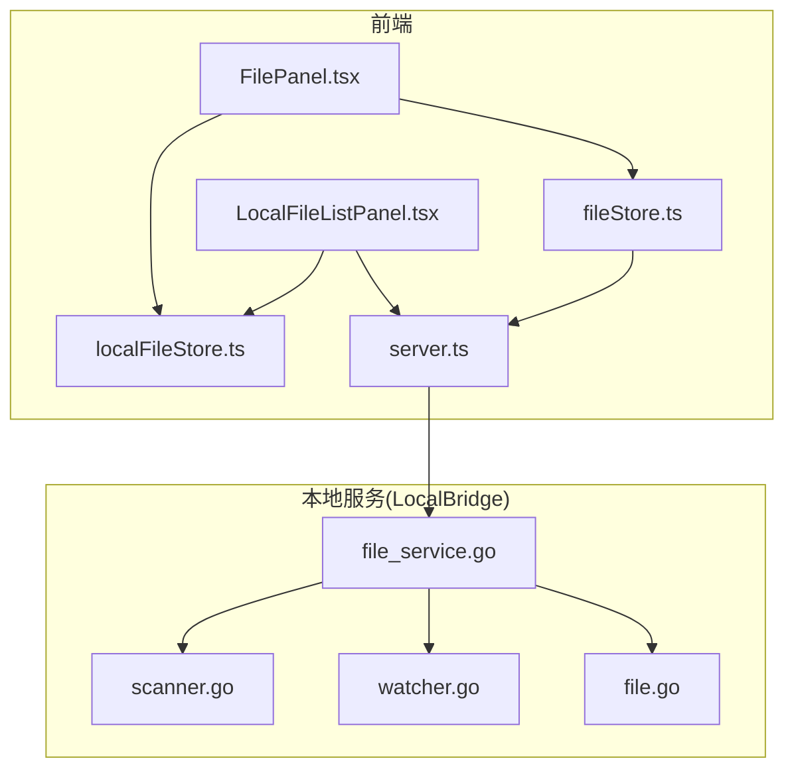
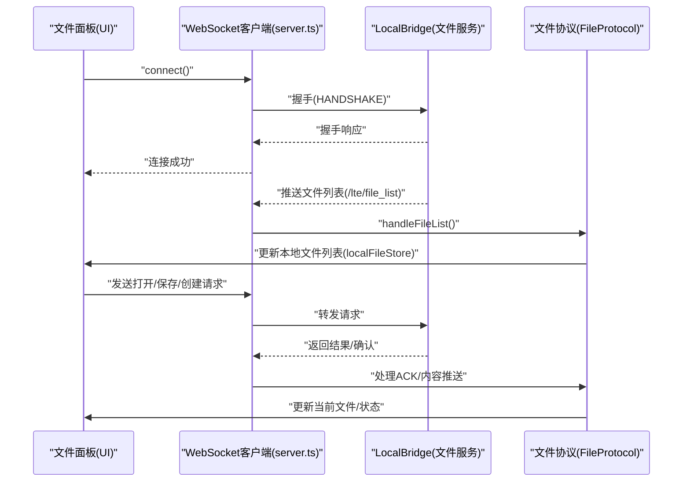
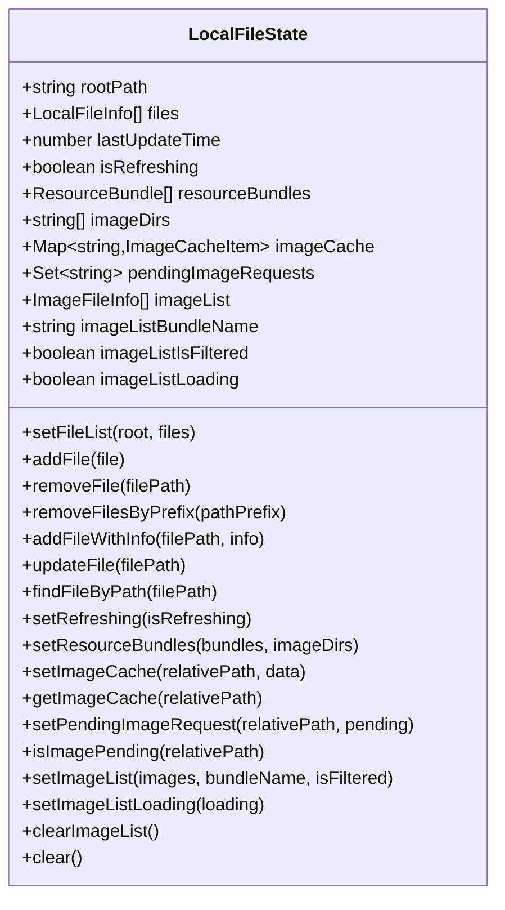
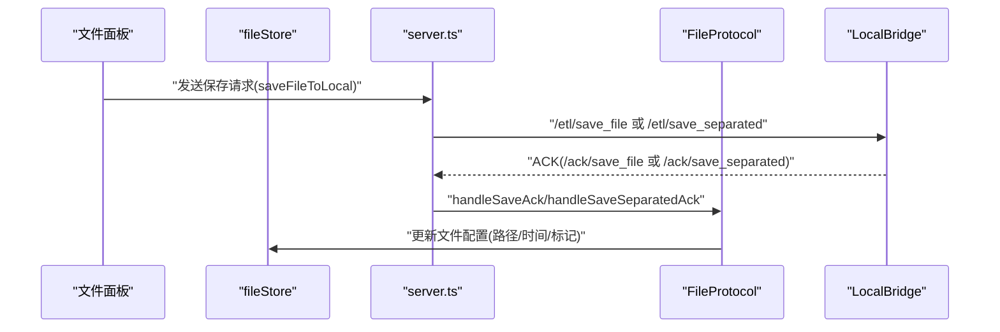
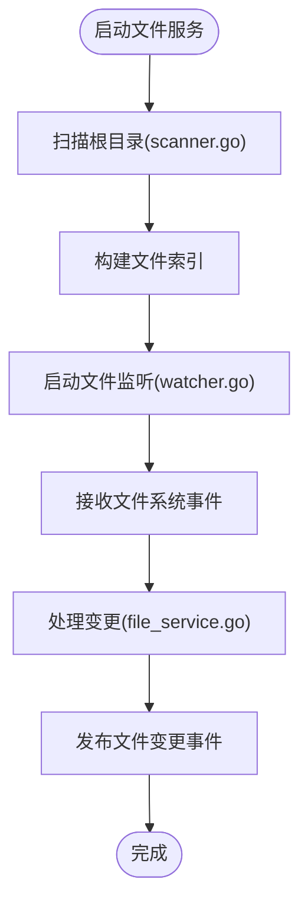
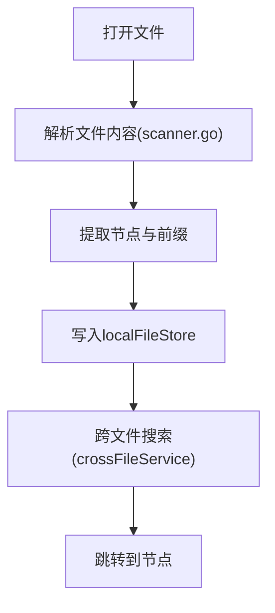
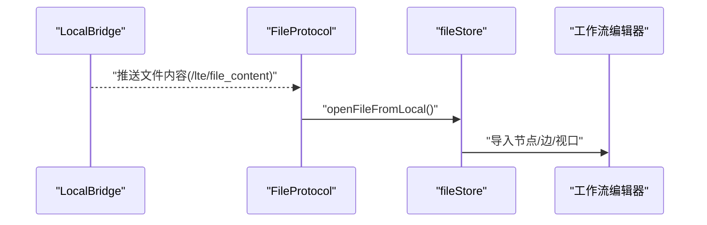
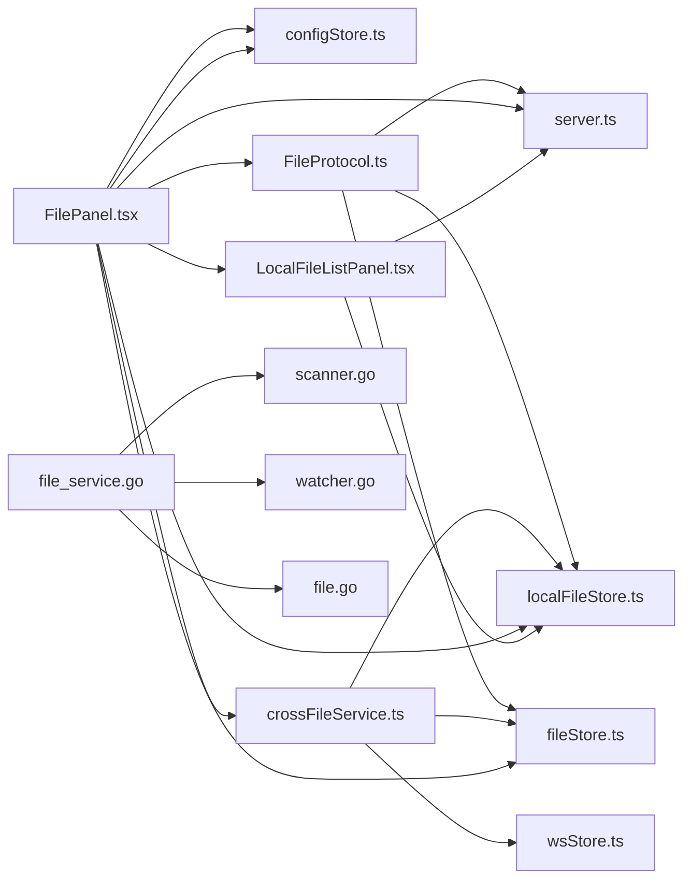

# 文件面板

<cite>
**本文档引用的文件**
- [FilePanel.tsx](file://src/components/panels/main/FilePanel.tsx)
- [LocalFileListPanel.tsx](file://src/components/panels/main/LocalFileListPanel.tsx)
- [localFileStore.ts](file://src/stores/localFileStore.ts)
- [fileStore.ts](file://src/stores/fileStore.ts)
- [crossFileService.ts](file://src/services/crossFileService.ts)
- [server.ts](file://src/services/server.ts)
- [FileProtocol.ts](file://src/services/protocols/FileProtocol.ts)
- [file_service.go](file://LocalBridge/internal/service/file/file_service.go)
- [scanner.go](file://LocalBridge/internal/service/file/scanner.go)
- [watcher.go](file://LocalBridge/internal/service/file/watcher.go)
- [file.go](file://LocalBridge/pkg/models/file.go)
- [CreateFileModal.tsx](file://src/components/modals/CreateFileModal.tsx)
- [ImageSelect.tsx](file://src/components/panels/field/items/ImageSelect.tsx)
</cite>

## 目录
1. [简介](#简介)
2. [项目结构](#项目结构)
3. [核心组件](#核心组件)
4. [架构总览](#架构总览)
5. [详细组件分析](#详细组件分析)
6. [依赖分析](#依赖分析)
7. [性能考虑](#性能考虑)
8. [故障排查指南](#故障排查指南)
9. [结论](#结论)

## 简介
文件面板是工作流编辑器中用于浏览、筛选、打开本地文件并管理多个工作文件的核心界面模块。它通过与 LocalBridge 本地服务建立 WebSocket 连接，实现实时文件扫描、监控与管理，并与工作流编辑器无缝集成，支持文件引用、模板加载与资源管理。

## 项目结构
文件面板相关的关键文件分布如下：
- UI 展示层：FilePanel.tsx、LocalFileListPanel.tsx
- 状态管理：localFileStore.ts、fileStore.ts
- 通信协议：FileProtocol.ts、server.ts
- 本地服务：file_service.go、scanner.go、watcher.go、file.go
- 功能辅助：crossFileService.ts、CreateFileModal.tsx、ImageSelect.tsx

图表来源
- [FilePanel.tsx:48-165](file://src/components/panels/main/FilePanel.tsx#L48-L165)
- [LocalFileListPanel.tsx:20-165](file://src/components/panels/main/LocalFileListPanel.tsx#L20-L165)
- [localFileStore.ts:129-338](file://src/stores/localFileStore.ts#L129-L338)
- [fileStore.ts:299-800](file://src/stores/fileStore.ts#L299-L800)
- [server.ts:20-373](file://src/services/server.ts#L20-L373)
- [file_service.go:19-95](file://LocalBridge/internal/service/file/file_service.go#L19-L95)
- [scanner.go:20-147](file://LocalBridge/internal/service/file/scanner.go#L20-L147)
- [watcher.go:34-92](file://LocalBridge/internal/service/file/watcher.go#L34-L92)
- [file.go:9-29](file://LocalBridge/pkg/models/file.go#L9-L29)

章节来源
- [FilePanel.tsx:48-165](file://src/components/panels/main/FilePanel.tsx#L48-L165)
- [LocalFileListPanel.tsx:20-165](file://src/components/panels/main/LocalFileListPanel.tsx#L20-L165)
- [localFileStore.ts:129-338](file://src/stores/localFileStore.ts#L129-L338)
- [fileStore.ts:299-800](file://src/stores/fileStore.ts#L299-L800)
- [server.ts:20-373](file://src/services/server.ts#L20-L373)
- [file_service.go:19-95](file://LocalBridge/internal/service/file/file_service.go#L19-L95)
- [scanner.go:20-147](file://LocalBridge/internal/service/file/scanner.go#L20-L147)
- [watcher.go:34-92](file://LocalBridge/internal/service/file/watcher.go#L34-L92)
- [file.go:9-29](file://LocalBridge/pkg/models/file.go#L9-L29)

## 核心组件
- 文件面板容器：负责文件标签页的拖拽排序、文件名编辑与切换。
- 本地文件列表面板：提供搜索、刷新、打开文件等交互。
- 本地文件状态：维护根路径、文件列表、资源包、图片缓存等。
- 文件状态：维护当前文件、节点边数据、保存/打开逻辑。
- 通信协议：统一处理文件列表、内容、变更与保存确认。
- 本地服务：扫描文件、监听变更、安全路径校验与文件读写。

章节来源
- [FilePanel.tsx:48-165](file://src/components/panels/main/FilePanel.tsx#L48-L165)
- [LocalFileListPanel.tsx:20-165](file://src/components/panels/main/LocalFileListPanel.tsx#L20-L165)
- [localFileStore.ts:129-338](file://src/stores/localFileStore.ts#L129-L338)
- [fileStore.ts:299-800](file://src/stores/fileStore.ts#L299-L800)
- [FileProtocol.ts:44-68](file://src/services/protocols/FileProtocol.ts#L44-L68)
- [file_service.go:19-95](file://LocalBridge/internal/service/file/file_service.go#L19-L95)

## 架构总览
文件面板通过 WebSocket 与 LocalBridge 通信，实现以下闭环：
- 启动时握手与协议注册
- 接收文件列表推送并更新本地状态
- 用户操作触发打开/保存/创建等请求
- 本地服务扫描与监听文件变更，向前端推送变更事件
- 前端根据配置自动重载或弹窗提示

图表来源
- [server.ts:104-251](file://src/services/server.ts#L104-L251)
- [FileProtocol.ts:44-68](file://src/services/protocols/FileProtocol.ts#L44-L68)
- [file_service.go:64-95](file://LocalBridge/internal/service/file/file_service.go#L64-L95)

章节来源
- [server.ts:104-251](file://src/services/server.ts#L104-L251)
- [FileProtocol.ts:44-68](file://src/services/protocols/FileProtocol.ts#L44-L68)
- [file_service.go:64-95](file://LocalBridge/internal/service/file/file_service.go#L64-L95)

## 详细组件分析

### 文件面板容器(FilePanel)
- 功能要点
  - 文件标签页渲染与拖拽排序
  - 文件名编辑与唯一性校验
  - 切换当前文件并同步视口
  - 打开“本地文件”面板
- 关键交互
  - 使用 DndKit 实现标签页拖拽
  - 通过 fileStore 切换文件
  - 通过 configStore 控制面板显示

图表来源
- [FilePanel.tsx:48-165](file://src/components/panels/main/FilePanel.tsx#L48-L165)
- [fileStore.ts:372-438](file://src/stores/fileStore.ts#L372-L438)

章节来源
- [FilePanel.tsx:48-165](file://src/components/panels/main/FilePanel.tsx#L48-L165)
- [fileStore.ts:372-438](file://src/stores/fileStore.ts#L372-L438)

### 本地文件列表面板(LocalFileListPanel)
- 功能要点
  - 搜索：按文件名或相对路径模糊匹配
  - 刷新：请求后端重新扫描并推送文件列表
  - 打开：向后端发送打开文件请求并关闭面板
  - 状态：显示根路径、文件计数、刷新中状态
- 关键交互
  - 通过 localServer 发送 /etl/refresh_file_list 与 /etl/open_file
  - 通过 localFileStore 更新文件列表与刷新状态

图表来源
- [LocalFileListPanel.tsx:20-165](file://src/components/panels/main/LocalFileListPanel.tsx#L20-L165)
- [FileProtocol.ts:78-103](file://src/services/protocols/FileProtocol.ts#L78-L103)

章节来源
- [LocalFileListPanel.tsx:20-165](file://src/components/panels/main/LocalFileListPanel.tsx#L20-L165)
- [FileProtocol.ts:78-103](file://src/services/protocols/FileProtocol.ts#L78-L103)

### 本地文件状态(localFileStore)
- 数据结构
  - 根路径、文件列表、最后更新时间、刷新状态
  - 资源包列表、image 目录集合、图片缓存与请求去重
  - 图片列表及其过滤状态与加载状态
- 关键能力
  - 增量增删改查文件
  - 设置/获取图片缓存与请求状态
  - 清空缓存与图片列表

图表来源
- [localFileStore.ts:60-122](file://src/stores/localFileStore.ts#L60-L122)
- [localFileStore.ts:129-338](file://src/stores/localFileStore.ts#L129-L338)

章节来源
- [localFileStore.ts:60-122](file://src/stores/localFileStore.ts#L60-L122)
- [localFileStore.ts:129-338](file://src/stores/localFileStore.ts#L129-L338)

### 文件状态(fileStore)
- 数据结构
  - 当前文件、文件列表、文件配置（前缀、路径、分离配置路径、修改标记、视口等）
- 关键能力
  - 打开本地文件：解析内容、合并配置、导入到工作流
  - 保存到本地：根据配置处理分离/集成模式，等待 ACK
  - 切换文件：保存当前视口、恢复目标文件视口
  - 标记删除/外部修改：用于变更提示与自动重载

图表来源
- [fileStore.ts:605-778](file://src/stores/fileStore.ts#L605-L778)
- [FileProtocol.ts:237-315](file://src/services/protocols/FileProtocol.ts#L237-L315)

章节来源
- [fileStore.ts:605-778](file://src/stores/fileStore.ts#L605-L778)
- [FileProtocol.ts:237-315](file://src/services/protocols/FileProtocol.ts#L237-L315)

### 本地服务(LocalBridge)与文件扫描/监听
- 扫描器(scanner.go)
  - 递归扫描根目录，受最大深度与文件数量限制
  - 过滤扩展名，解析文件节点与前缀
- 监听器(watcher.go)
  - 使用 fsnotify 监听创建/修改/删除/重命名
  - 防抖处理，避免频繁触发
- 文件服务(file_service.go)
  - 启动时全量扫描并发布扫描完成事件
  - 处理文件读取/保存/创建，安全路径校验
  - 忽略自身写入触发的变更事件

图表来源
- [file_service.go:64-95](file://LocalBridge/internal/service/file/file_service.go#L64-L95)
- [scanner.go:64-147](file://LocalBridge/internal/service/file/scanner.go#L64-L147)
- [watcher.go:113-188](file://LocalBridge/internal/service/file/watcher.go#L113-L188)

章节来源
- [file_service.go:64-95](file://LocalBridge/internal/service/file/file_service.go#L64-L95)
- [scanner.go:64-147](file://LocalBridge/internal/service/file/scanner.go#L64-L147)
- [watcher.go:113-188](file://LocalBridge/internal/service/file/watcher.go#L113-L188)

### 文件类型识别与分类
- 文件类型识别
  - 通过扩展名过滤：.json/.jsonc 等
  - 通过扫描器解析顶层键作为节点列表与前缀
- 分类策略
  - JSON：按键名生成节点，支持前缀
  - 图片：通过图片选择器与缓存机制提供缩略图
  - 文本：按需读取与展示
- 跨文件节点搜索
  - crossFileService 提供跨文件节点搜索、跳转与自动完成
  - 支持模糊匹配、类型过滤、当前文件优先排序

图表来源
- [scanner.go:212-249](file://LocalBridge/internal/service/file/scanner.go#L212-L249)
- [localFileStore.ts:147-155](file://src/stores/localFileStore.ts#L147-L155)
- [crossFileService.ts:68-199](file://src/services/crossFileService.ts#L68-L199)

章节来源
- [scanner.go:212-249](file://LocalBridge/internal/service/file/scanner.go#L212-L249)
- [localFileStore.ts:147-155](file://src/stores/localFileStore.ts#L147-L155)
- [crossFileService.ts:68-199](file://src/services/crossFileService.ts#L68-L199)

### 搜索与过滤
- 名称/路径过滤：LocalFileListPanel 对文件名与相对路径进行小写模糊匹配
- 跨文件搜索：crossFileService 支持按节点标签/完整名称模糊匹配，支持排除类型与限制数量
- 节点跳转：支持按节点名跳转到指定文件并聚焦节点

图表来源
- [LocalFileListPanel.tsx:30-41](file://src/components/panels/main/LocalFileListPanel.tsx#L30-L41)
- [crossFileService.ts:207-268](file://src/services/crossFileService.ts#L207-L268)

章节来源
- [LocalFileListPanel.tsx:30-41](file://src/components/panels/main/LocalFileListPanel.tsx#L30-L41)
- [crossFileService.ts:207-268](file://src/services/crossFileService.ts#L207-L268)

### 与工作流编辑器的集成
- 文件引用与模板加载
  - 通过 FileProtocol 推送文件内容，fileStore 导入到工作流
  - 支持分离配置模式，分别保存 pipeline 与 .mpe.json
- 资源管理
  - localFileStore 维护资源包与图片目录，提供图片缓存与去重
  - ImageSelect 使用缓存数据渲染缩略图

图表来源
- [FileProtocol.ts:109-141](file://src/services/protocols/FileProtocol.ts#L109-L141)
- [fileStore.ts:517-603](file://src/stores/fileStore.ts#L517-L603)
- [ImageSelect.tsx:166-205](file://src/components/panels/field/items/ImageSelect.tsx#L166-L205)

章节来源
- [FileProtocol.ts:109-141](file://src/services/protocols/FileProtocol.ts#L109-L141)
- [fileStore.ts:517-603](file://src/stores/fileStore.ts#L517-L603)
- [ImageSelect.tsx:166-205](file://src/components/panels/field/items/ImageSelect.tsx#L166-L205)

## 依赖分析
- 前端依赖
  - FilePanel 依赖 fileStore 与 configStore
  - LocalFileListPanel 依赖 localFileStore 与 server
  - FileProtocol 依赖 server 与 stores
  - crossFileService 依赖 localFileStore、fileStore、wsStore
- 本地服务依赖
  - file_service 依赖 scanner 与 watcher
  - scanner 依赖 utils 与 models
  - watcher 依赖 fsnotify 与防抖器

图表来源
- [FilePanel.tsx:18-20](file://src/components/panels/main/FilePanel.tsx#L18-L20)
- [LocalFileListPanel.tsx:10-15](file://src/components/panels/main/LocalFileListPanel.tsx#L10-L15)
- [crossFileService.ts:6-15](file://src/services/crossFileService.ts#L6-L15)
- [file_service.go:19-35](file://LocalBridge/internal/service/file/file_service.go#L19-L35)

章节来源
- [FilePanel.tsx:18-20](file://src/components/panels/main/FilePanel.tsx#L18-L20)
- [LocalFileListPanel.tsx:10-15](file://src/components/panels/main/LocalFileListPanel.tsx#L10-L15)
- [crossFileService.ts:6-15](file://src/services/crossFileService.ts#L6-L15)
- [file_service.go:19-35](file://LocalBridge/internal/service/file/file_service.go#L19-L35)

## 性能考虑
- 大文件处理
  - 通过扫描限制(maxDepth/maxFiles)避免过度扫描
  - 保存时按配置模式选择 pipeline/config 分离，降低单文件体积
- 缓存机制
  - localFileStore 维护图片缓存与请求去重，避免重复请求
  - 图片缩略图使用 base64 数据，减少二次请求
- 懒加载与防抖
  - watcher 使用防抖器，合并高频事件
  - 跨文件搜索支持限制数量与类型过滤，避免全量匹配
- 本地存储
  - fileStore 支持本地持久化，注意浏览器存储配额

章节来源
- [scanner.go:40-48](file://LocalBridge/internal/service/file/scanner.go#L40-L48)
- [watcher.go:201-258](file://LocalBridge/internal/service/file/watcher.go#L201-L258)
- [localFileStore.ts:258-293](file://src/stores/localFileStore.ts#L258-L293)
- [fileStore.ts:227-268](file://src/stores/fileStore.ts#L227-L268)

## 故障排查指南
- 连接问题
  - 检查 LocalBridge 是否启动、端口是否正确
  - 查看握手版本是否匹配
- 文件列表不更新
  - 确认 /lte/file_list 是否推送
  - 检查扫描限制与过滤规则
- 文件变更未生效
  - 检查 file_auto_reload 配置
  - 确认 ACK 是否返回成功
- 保存失败
  - 检查保存请求参数与缩进配置
  - 查看 ACK 超时与错误提示

章节来源
- [server.ts:104-251](file://src/services/server.ts#L104-L251)
- [FileProtocol.ts:237-315](file://src/services/protocols/FileProtocol.ts#L237-L315)
- [fileStore.ts:605-778](file://src/stores/fileStore.ts#L605-L778)

## 结论
文件面板通过清晰的前后端职责划分与稳健的本地服务集成，实现了高效、可靠的本地文件浏览、搜索与管理。其与工作流编辑器的深度集成支持跨文件节点导航与资源管理，配合缓存与防抖等性能优化策略，能够满足复杂工程的文件管理需求。建议在生产环境中合理配置扫描限制与自动重载策略，并关注浏览器存储配额与网络稳定性。