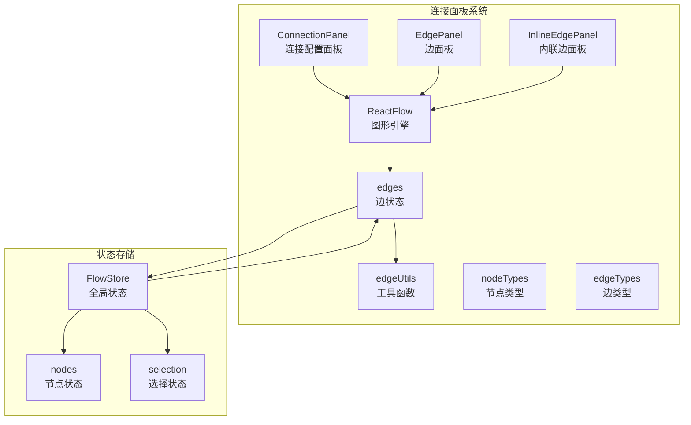
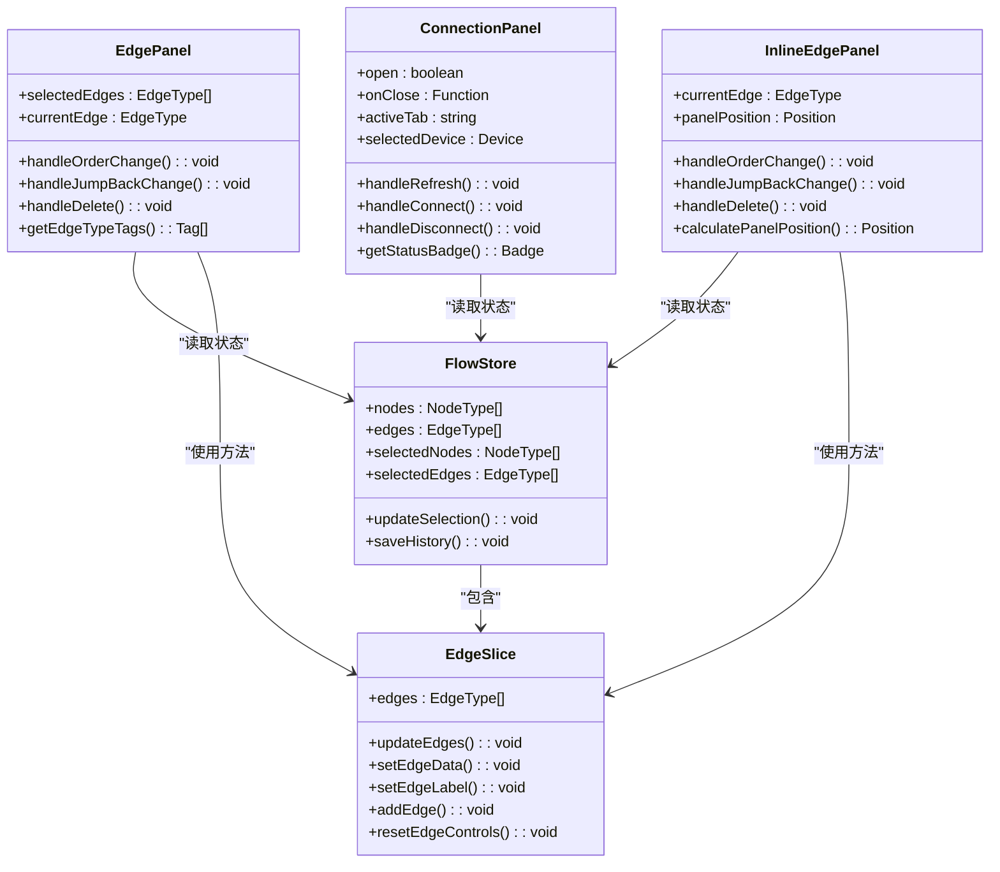
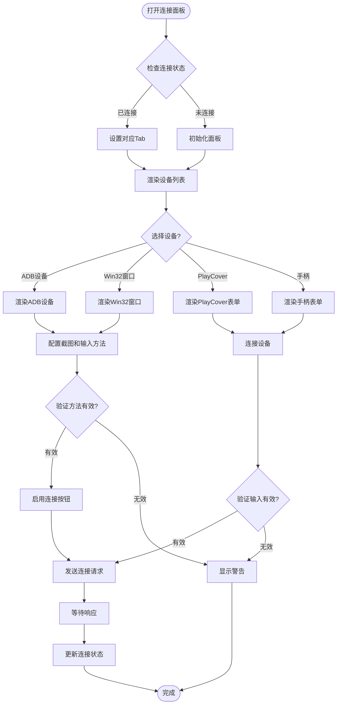
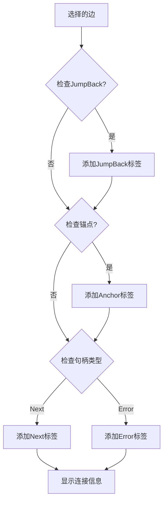
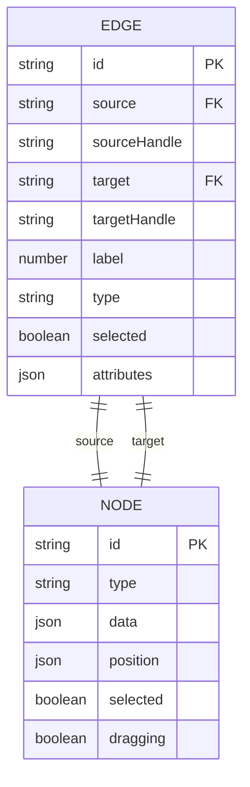
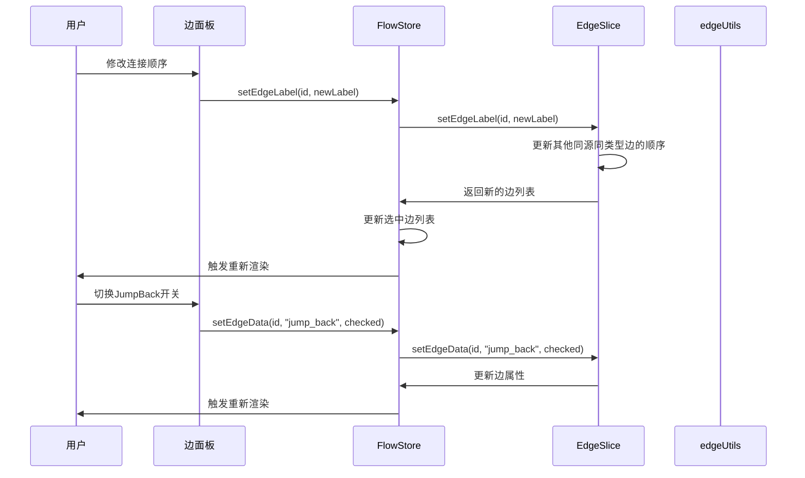
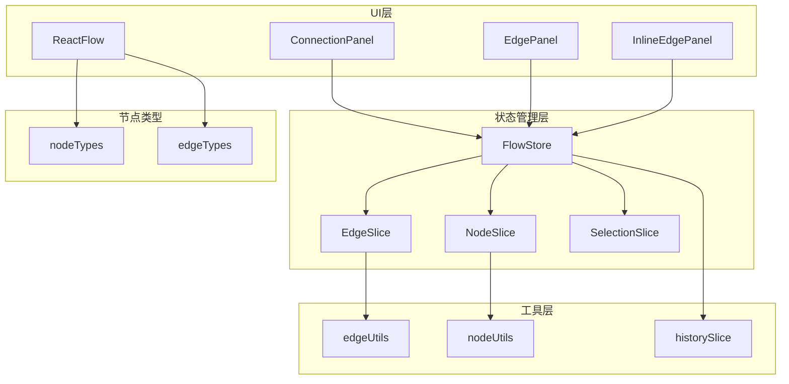

# 连接面板

<cite>
**本文档引用的文件**
- [ConnectionPanel.tsx](file://src/components/panels/main/ConnectionPanel.tsx)
- [EdgePanel.tsx](file://src/components/panels/main/EdgePanel.tsx)
- [InlineEdgePanel.tsx](file://src/components/panels/main/InlineEdgePanel.tsx)
- [Flow.tsx](file://src/components/Flow.tsx)
- [edges.tsx](file://src/components/flow/edges.tsx)
- [edgeSlice.ts](file://src/stores/flow/slices/edgeSlice.ts)
- [edgeUtils.ts](file://src/stores/flow/utils/edgeUtils.ts)
- [types.ts](file://src/stores/flow/types.ts)
- [constants.ts](file://src/components/flow/nodes/constants.ts)
- [nodeUtils.ts](file://src/stores/flow/utils/nodeUtils.ts)
</cite>

## 目录
1. [简介](#简介)
2. [项目结构](#项目结构)
3. [核心组件](#核心组件)
4. [架构概览](#架构概览)
5. [详细组件分析](#详细组件分析)
6. [依赖关系分析](#依赖关系分析)
7. [性能考虑](#性能考虑)
8. [故障排除指南](#故障排除指南)
9. [结论](#结论)

## 简介

连接面板是 MAA Pipeline Editor 中用于管理和可视化节点间连接关系的核心组件。它提供了完整的连接生命周期管理，包括连接的创建、编辑、删除和实时同步功能。该系统支持多种连接类型，包括普通连接（next）、错误连接（on_error）和跳转回连接（jump_back），并通过边面板（EdgePanel）和内联边面板（InlineEdgePanel）提供直观的用户交互体验。

连接面板不仅负责连接的可视化展示，还实现了复杂的状态管理机制，确保工作流图与连接状态保持实时一致。系统通过 ZUSTAND 状态管理库实现高效的数据流控制，并通过 React Flow 提供强大的图形渲染能力。

## 项目结构

连接面板系统由多个相互协作的组件组成，形成了一个完整的连接管理生态系统：

**图表来源**
- [ConnectionPanel.tsx:1-1007](file://src/components/panels/main/ConnectionPanel.tsx#L1-L1007)
- [EdgePanel.tsx:1-281](file://src/components/panels/main/EdgePanel.tsx#L1-L281)
- [InlineEdgePanel.tsx:1-290](file://src/components/panels/main/InlineEdgePanel.tsx#L1-L290)

**章节来源**
- [ConnectionPanel.tsx:1-1007](file://src/components/panels/main/ConnectionPanel.tsx#L1-L1007)
- [Flow.tsx:1-542](file://src/components/Flow.tsx#L1-L542)

## 核心组件

连接面板系统包含三个主要组件，每个组件都有特定的功能和职责：

### 1. 连接配置面板（ConnectionPanel）

连接配置面板是用户与连接系统交互的主要入口，提供设备连接和配置功能：

- **设备类型支持**：ADB 设备、Win32 窗口、PlayCover、手柄连接
- **智能设备发现**：自动刷新和发现可用设备
- **连接状态管理**：实时监控连接状态和错误信息
- **配置参数管理**：支持自定义截图和输入方法

### 2. 边面板（EdgePanel）

边面板提供传统的侧边栏连接编辑功能：

- **连接信息展示**：显示源节点、目标节点和连接类型
- **顺序管理**：支持连接顺序的调整和管理
- **JumpBack 功能**：提供错误处理的跳转回机制
- **删除操作**：一键删除不需要的连接

### 3. 内联边面板（InlineEdgePanel）

内联边面板提供沉浸式的连接编辑体验：

- **实时位置计算**：根据边的几何位置动态计算面板位置
- **拖拽状态感知**：在节点拖拽时自动隐藏面板
- **缩放适配**：支持视口缩放的动态适配
- **轻量级交互**：减少对主工作流的干扰

**章节来源**
- [EdgePanel.tsx:1-281](file://src/components/panels/main/EdgePanel.tsx#L1-L281)
- [InlineEdgePanel.tsx:1-290](file://src/components/panels/main/InlineEdgePanel.tsx#L1-L290)

## 架构概览

连接面板系统采用分层架构设计，确保各组件间的松耦合和高内聚：

**图表来源**
- [ConnectionPanel.tsx:34-425](file://src/components/panels/main/ConnectionPanel.tsx#L34-L425)
- [EdgePanel.tsx:130-278](file://src/components/panels/main/EdgePanel.tsx#L130-L278)
- [InlineEdgePanel.tsx:56-287](file://src/components/panels/main/InlineEdgePanel.tsx#L56-L287)
- [edgeSlice.ts:16-222](file://src/stores/flow/slices/edgeSlice.ts#L16-L222)

## 详细组件分析

### 连接配置面板（ConnectionPanel）

连接配置面板是一个复杂的设备管理界面，支持多种连接方式：

#### 设备类型和配置

**图表来源**
- [ConnectionPanel.tsx:231-332](file://src/components/panels/main/ConnectionPanel.tsx#L231-L332)

#### 连接状态管理

连接面板实现了完整的连接生命周期管理：

- **状态监控**：实时跟踪连接状态（未连接、连接中、已连接、连接失败）
- **设备发现**：自动刷新和发现可用设备
- **配置持久化**：保存用户的连接偏好设置
- **错误处理**：提供详细的错误信息和解决方案

**章节来源**
- [ConnectionPanel.tsx:1-1007](file://src/components/panels/main/ConnectionPanel.tsx#L1-L1007)

### 边面板（EdgePanel）

边面板提供传统的连接编辑功能，支持完整的连接属性管理：

#### 连接类型识别

**图表来源**
- [EdgePanel.tsx:24-50](file://src/components/panels/main/EdgePanel.tsx#L24-L50)

#### 属性编辑功能

边面板支持以下连接属性的编辑：

- **连接顺序**：通过数字输入框调整连接在同源同类型边中的顺序
- **JumpBack 开关**：控制错误处理时的跳转回功能
- **连接类型标签**：实时显示连接的语义类型
- **源目标节点信息**：显示连接两端节点的详细信息

**章节来源**
- [EdgePanel.tsx:1-281](file://src/components/panels/main/EdgePanel.tsx#L1-L281)

### 内联边面板（InlineEdgePanel）

内联边面板提供沉浸式的连接编辑体验，具有以下特点：

#### 位置计算算法

**图表来源**
- [InlineEdgePanel.tsx:95-124](file://src/components/panels/main/InlineEdgePanel.tsx#L95-L124)

#### 交互优化

内联边面板实现了多项交互优化：

- **动态位置计算**：根据节点位置变化实时更新面板位置
- **拖拽状态感知**：在节点拖拽时自动隐藏面板，避免干扰
- **缩放适配**：支持视口缩放的动态适配
- **轻量级渲染**：使用 ViewportPortal 实现高效的渲染

**章节来源**
- [InlineEdgePanel.tsx:1-290](file://src/components/panels/main/InlineEdgePanel.tsx#L1-L290)

### 数据模型和状态管理

连接面板系统基于 ZUSTAND 实现了完整的状态管理：

#### 边类型定义

**图表来源**
- [types.ts:28-38](file://src/stores/flow/types.ts#L28-L38)

#### 状态管理流程

**图表来源**
- [edgeSlice.ts:102-148](file://src/stores/flow/slices/edgeSlice.ts#L102-L148)
- [edgeUtils.ts:17-31](file://src/stores/flow/utils/edgeUtils.ts#L17-L31)

**章节来源**
- [types.ts:1-362](file://src/stores/flow/types.ts#L1-L362)
- [edgeSlice.ts:1-222](file://src/stores/flow/slices/edgeSlice.ts#L1-L222)
- [edgeUtils.ts:1-32](file://src/stores/flow/utils/edgeUtils.ts#L1-L32)

## 依赖关系分析

连接面板系统具有清晰的依赖层次结构：

**图表来源**
- [Flow.tsx:464-504](file://src/components/Flow.tsx#L464-L504)
- [edgeSlice.ts:16-222](file://src/stores/flow/slices/edgeSlice.ts#L16-L222)

### 关键依赖关系

1. **React Flow 集成**：所有连接面板都依赖于 React Flow 提供的图形渲染和交互能力
2. **ZUSTAND 状态管理**：通过 FlowStore 统一管理所有连接相关的状态
3. **工具函数库**：edgeUtils 和 nodeUtils 提供核心的业务逻辑支持
4. **节点类型系统**：通过 constants.ts 定义的枚举类型确保类型安全

**章节来源**
- [Flow.tsx:1-542](file://src/components/Flow.tsx#L1-L542)
- [constants.ts:1-47](file://src/components/flow/nodes/constants.ts#L1-L47)

## 性能考虑

连接面板系统在设计时充分考虑了性能优化：

### 渲染优化策略

1. **条件渲染**：只有在相关状态变化时才重新渲染面板
2. **记忆化优化**：使用 useMemo 和 useCallback 避免不必要的重计算
3. **虚拟化支持**：对于大量连接场景，考虑实现虚拟化渲染
4. **事件节流**：对频繁触发的事件进行节流处理

### 内存管理

1. **状态分离**：将连接状态与其他状态分离，避免不必要的状态更新
2. **引用稳定**：使用稳定化的回调函数和对象引用
3. **清理机制**：及时清理事件监听器和定时器

### 大规模连接处理

对于包含数百个连接的工作流，建议采用以下策略：

- **分页渲染**：只渲染可见区域内的连接
- **延迟加载**：连接信息的详细内容采用懒加载
- **简化视觉效果**：在大规模场景下简化边的视觉样式

## 故障排除指南

### 常见问题和解决方案

#### 连接创建失败

**问题症状**：
- 连接无法创建或立即消失
- 控制台出现错误信息

**可能原因**：
1. 同源同类型连接冲突
2. 节点句柄类型不匹配
3. 边界条件检查失败

**解决步骤**：
1. 检查源节点和目标节点的句柄类型
2. 确认没有重复的连接
3. 验证节点间的逻辑关系

#### 连接编辑异常

**问题症状**：
- 连接顺序调整无效
- JumpBack 功能不工作

**可能原因**：
1. 状态更新失败
2. 边属性设置错误
3. 选择状态不正确

**解决步骤**：
1. 检查 FlowStore 的状态更新
2. 验证 setEdgeData 方法的调用
3. 确认当前选中的边状态

#### 性能问题

**问题症状**：
- 大量连接时界面卡顿
- 拖拽操作响应迟缓

**优化建议**：
1. 减少不必要的重新渲染
2. 实施虚拟化渲染
3. 优化事件处理逻辑

**章节来源**
- [edgeSlice.ts:150-210](file://src/stores/flow/slices/edgeSlice.ts#L150-L210)

## 结论

连接面板系统为 MAA Pipeline Editor 提供了强大而灵活的连接管理能力。通过精心设计的架构和优化的实现，系统能够：

1. **提供直观的用户界面**：通过多种面板模式满足不同用户需求
2. **确保数据一致性**：通过实时状态同步保证连接状态的准确性
3. **支持复杂的工作流**：处理各种连接类型和场景
4. **保持良好的性能**：通过多种优化策略应对大规模连接场景

系统的模块化设计使得各个组件职责明确，易于维护和扩展。未来的发展方向包括进一步优化大规模连接的渲染性能、增强连接的可视化效果，以及提供更多智能化的连接管理功能。