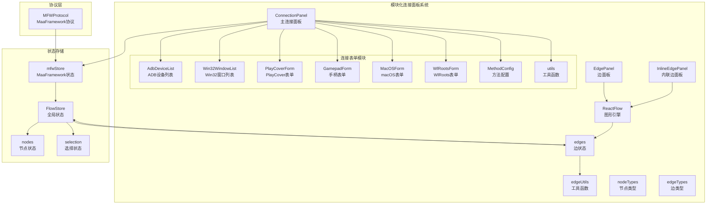
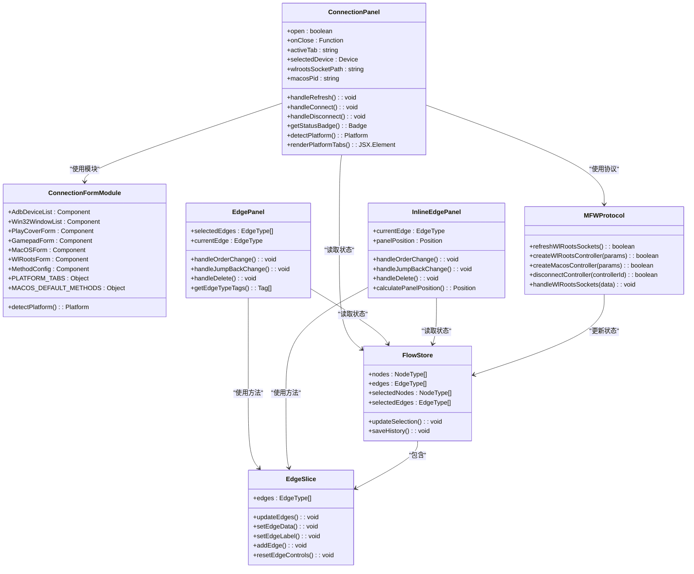
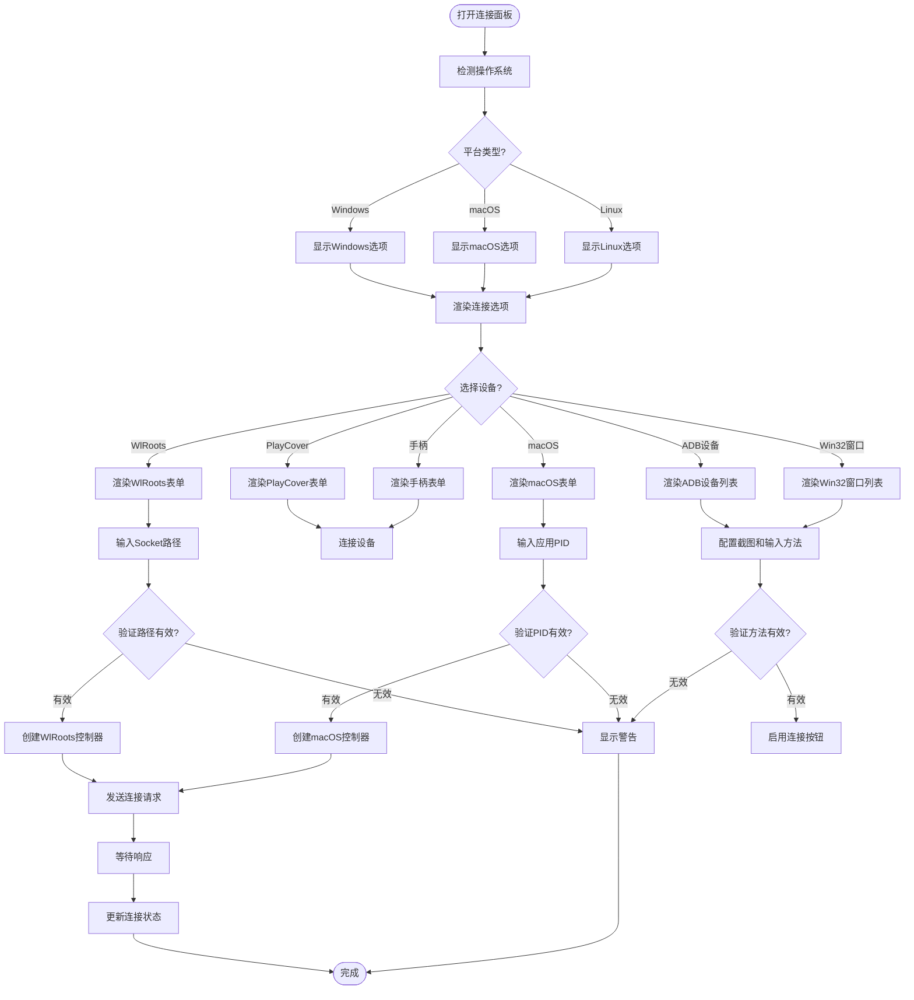
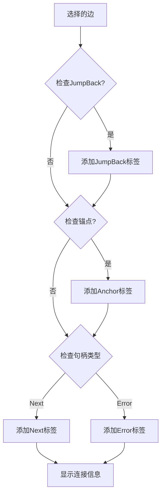
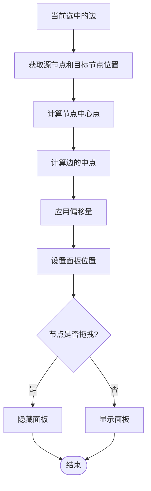
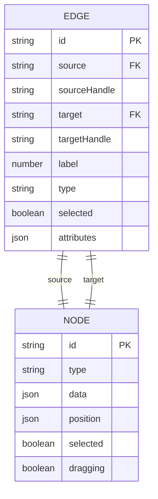
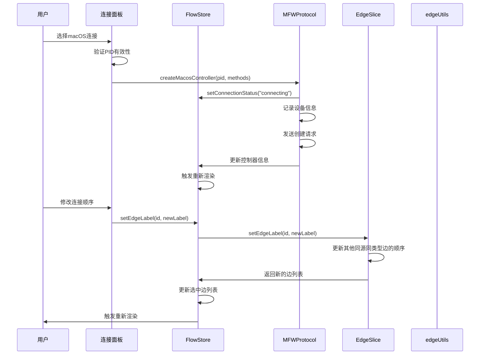
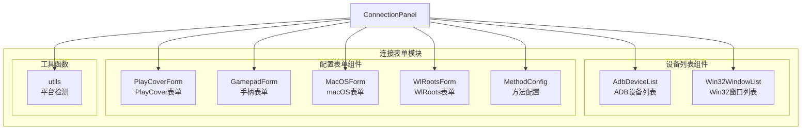
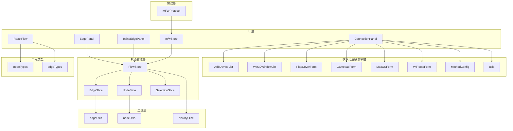

# 连接面板

<cite>
**本文档引用的文件**
- [ConnectionPanel.tsx](file://src/components/panels/main/ConnectionPanel.tsx)
- [EdgePanel.tsx](file://src/components/panels/main/EdgePanel.tsx)
- [InlineEdgePanel.tsx](file://src/components/panels/main/InlineEdgePanel.tsx)
- [Flow.tsx](file://src/components/Flow.tsx)
- [edges.tsx](file://src/components/flow/edges.tsx)
- [edgeSlice.ts](file://src/stores/flow/slices/edgeSlice.ts)
- [edgeUtils.ts](file://src/stores/flow/utils/edgeUtils.ts)
- [types.ts](file://src/stores/flow/types.ts)
- [constants.ts](file://src/components/flow/nodes/constants.ts)
- [nodeUtils.ts](file://src/stores/flow/utils/nodeUtils.ts)
- [mfwStore.ts](file://src/stores/mfwStore.ts)
- [MFWProtocol.ts](file://src/services/protocols/MFWProtocol.ts)
- [index.ts](file://src/components/panels/main/connection/index.ts)
- [utils.ts](file://src/components/panels/main/connection/utils.ts)
- [MacOSForm.tsx](file://src/components/panels/main/connection/MacOSForm.tsx)
- [WlRootsForm.tsx](file://src/components/panels/main/connection/WlRootsForm.tsx)
- [AdbDeviceList.tsx](file://src/components/panels/main/connection/AdbDeviceList.tsx)
- [Win32WindowList.tsx](file://src/components/panels/main/connection/Win32WindowList.tsx)
- [MethodConfig.tsx](file://src/components/panels/main/connection/MethodConfig.tsx)
- [PlayCoverForm.tsx](file://src/components/panels/main/connection/PlayCoverForm.tsx)
</cite>

## 更新摘要
**变更内容**
- 连接面板已从单体架构重构为模块化组件结构，新增macOS控制器支持
- 新增独立的连接表单组件模块，包括MacOSForm、WlRootsForm等
- 改进了平台特定优化和性能提升，支持跨平台连接管理
- 更新了连接面板的设备类型支持和配置选项

## 目录
1. [简介](#简介)
2. [项目结构](#项目结构)
3. [核心组件](#核心组件)
4. [架构概览](#架构概览)
5. [详细组件分析](#详细组件分析)
6. [模块化重构详解](#模块化重构详解)
7. [平台特定支持](#平台特定支持)
8. [依赖关系分析](#依赖关系分析)
9. [性能考虑](#性能考虑)
10. [故障排除指南](#故障排除指南)
11. [结论](#结论)

## 简介

连接面板是 MAA Pipeline Editor 中用于管理和可视化节点间连接关系的核心组件。经过模块化重构后，系统采用了全新的架构设计，提供了完整的连接生命周期管理，包括连接的创建、编辑、删除和实时同步功能。

**更新** 连接面板现已支持macOS原生应用控制和改进的平台特定优化，通过模块化的连接表单组件提供更直观的用户交互体验。系统支持多种连接类型，包括普通连接（next）、错误连接（on_error）和跳转回连接（jump_back），并通过边面板（EdgePanel）和内联边面板（InlineEdgePanel）提供灵活的用户界面。

连接面板不仅负责连接的可视化展示，还实现了复杂的状态管理机制，确保工作流图与连接状态保持实时一致。系统通过 ZUSTAND 状态管理库实现高效的数据流控制，并通过 React Flow 提供强大的图形渲染能力。

## 项目结构

连接面板系统经过模块化重构后，形成了更加清晰的组件层次结构：



**图表来源**
- [ConnectionPanel.tsx:1-793](file://src/components/panels/main/ConnectionPanel.tsx#L1-L793)
- [index.ts:1-9](file://src/components/panels/main/connection/index.ts#L1-L9)
- [utils.ts:1-26](file://src/components/panels/main/connection/utils.ts#L1-L26)

**章节来源**
- [ConnectionPanel.tsx:1-793](file://src/components/panels/main/ConnectionPanel.tsx#L1-L793)
- [Flow.tsx:1-542](file://src/components/Flow.tsx#L1-L542)

## 核心组件

连接面板系统包含四个主要组件，每个组件都有特定的功能和职责：

### 1. 主连接面板（ConnectionPanel）

主连接面板是用户与连接系统交互的主要入口，经过模块化重构后，现在支持跨平台连接管理：

- **平台检测**：自动检测操作系统并显示相应的连接选项
- **设备类型支持**：ADB设备、Win32窗口、PlayCover、手柄连接、WlRoots连接、macOS原生应用
- **智能设备发现**：自动刷新和发现可用设备（除WlRoots和macOS外）
- **连接状态管理**：实时监控连接状态和错误信息
- **配置参数管理**：支持自定义截图和输入方法

**更新** 新增macOS原生应用连接支持，通过PID直接控制macOS原生应用程序。

### 2. 连接表单模块

模块化重构后的连接表单组件提供了专门的表单界面：

- **AdbDeviceList**：ADB设备列表选择界面
- **Win32WindowList**：Win32窗口列表选择界面
- **PlayCoverForm**：PlayCover连接配置界面
- **GamepadForm**：手柄连接配置界面
- **MacOSForm**：macOS原生应用连接界面
- **WlRootsForm**：WlRoots连接配置界面
- **MethodConfig**：设备方法配置界面

### 3. 边面板（EdgePanel）

边面板提供传统的侧边栏连接编辑功能：

- **连接信息展示**：显示源节点、目标节点和连接类型
- **顺序管理**：支持连接顺序的调整和管理
- **JumpBack 功能**：提供错误处理的跳转回机制
- **删除操作**：一键删除不需要的连接

### 4. 内联边面板（InlineEdgePanel）

内联边面板提供沉浸式的连接编辑体验：

- **实时位置计算**：根据边的几何位置动态计算面板位置
- **拖拽状态感知**：在节点拖拽时自动隐藏面板
- **缩放适配**：支持视口缩放的动态适配
- **轻量级交互**：减少对主工作流的干扰

**章节来源**
- [EdgePanel.tsx:1-281](file://src/components/panels/main/EdgePanel.tsx#L1-L281)
- [InlineEdgePanel.tsx:1-290](file://src/components/panels/main/InlineEdgePanel.tsx#L1-L290)

## 架构概览

连接面板系统采用分层架构设计，经过模块化重构后，确保各组件间的松耦合和高内聚：



**图表来源**
- [ConnectionPanel.tsx:49-793](file://src/components/panels/main/ConnectionPanel.tsx#L49-L793)
- [index.ts:1-9](file://src/components/panels/main/connection/index.ts#L1-L9)
- [utils.ts:1-26](file://src/components/panels/main/connection/utils.ts#L1-L26)

## 详细组件分析

### 主连接面板（ConnectionPanel）

主连接面板经过模块化重构后，现在支持跨平台连接管理：

#### 平台检测和选项管理

**更新** 新增平台检测功能，支持Windows、macOS、Linux三种平台的不同连接选项：



**图表来源**
- [ConnectionPanel.tsx:62-71](file://src/components/panels/main/ConnectionPanel.tsx#L62-L71)
- [ConnectionPanel.tsx:644-733](file://src/components/panels/main/ConnectionPanel.tsx#L644-L733)
- [utils.ts:12-19](file://src/components/panels/main/connection/utils.ts#L12-L19)

#### 连接状态管理

连接面板实现了完整的连接生命周期管理：

- **状态监控**：实时跟踪连接状态（未连接、连接中、已连接、连接失败）
- **设备发现**：自动刷新和发现可用设备（ADB和Win32设备）
- **配置持久化**：保存用户的连接偏好设置
- **错误处理**：提供详细的错误信息和解决方案

**更新** 新增macOS原生应用连接支持，通过PID直接控制macOS原生应用程序，支持ScreenCaptureKit截图和GlobalEvent/PostToPid输入方法。

**章节来源**
- [ConnectionPanel.tsx:1-793](file://src/components/panels/main/ConnectionPanel.tsx#L1-L793)

### 边面板（EdgePanel）

边面板提供传统的连接编辑功能，支持完整的连接属性管理：

#### 连接类型识别



**图表来源**
- [EdgePanel.tsx:24-50](file://src/components/panels/main/EdgePanel.tsx#L24-L50)

#### 属性编辑功能

边面板支持以下连接属性的编辑：

- **连接顺序**：通过数字输入框调整连接在同源同类型边中的顺序
- **JumpBack 开关**：控制错误处理时的跳转回功能
- **连接类型标签**：实时显示连接的语义类型
- **源目标节点信息**：显示连接两端节点的详细信息

**章节来源**
- [EdgePanel.tsx:1-281](file://src/components/panels/main/EdgePanel.tsx#L1-L281)

### 内联边面板（InlineEdgePanel）

内联边面板提供沉浸式的连接编辑体验，具有以下特点：

#### 位置计算算法



**图表来源**
- [InlineEdgePanel.tsx:95-124](file://src/components/panels/main/InlineEdgePanel.tsx#L95-L124)

#### 交互优化

内联边面板实现了多项交互优化：

- **动态位置计算**：根据节点位置变化实时更新面板位置
- **拖拽状态感知**：在节点拖拽时自动隐藏面板，避免干扰
- **缩放适配**：支持视口缩放的动态适配
- **轻量级渲染**：使用 ViewportPortal 实现高效的渲染

**章节来源**
- [InlineEdgePanel.tsx:1-290](file://src/components/panels/main/InlineEdgePanel.tsx#L1-L290)

### 数据模型和状态管理

连接面板系统基于 ZUSTAND 实现了完整的状态管理：

#### 边类型定义



**图表来源**
- [types.ts:28-38](file://src/stores/flow/types.ts#L28-L38)

#### 状态管理流程



**图表来源**
- [edgeSlice.ts:102-148](file://src/stores/flow/slices/edgeSlice.ts#L102-L148)
- [edgeUtils.ts:17-31](file://src/stores/flow/utils/edgeUtils.ts#L17-L31)
- [MFWProtocol.ts:486-507](file://src/services/protocols/MFWProtocol.ts#L486-L507)

**更新** 新增macOS原生应用连接支持，通过createMacosController方法处理PID和方法配置。

**章节来源**
- [types.ts:1-362](file://src/stores/flow/types.ts#L1-L362)
- [edgeSlice.ts:1-222](file://src/stores/flow/slices/edgeSlice.ts#L1-L222)
- [edgeUtils.ts:1-32](file://src/stores/flow/utils/edgeUtils.ts#L1-L32)
- [mfwStore.ts:1-176](file://src/stores/mfwStore.ts#L1-L176)
- [MFWProtocol.ts:1-906](file://src/services/protocols/MFWProtocol.ts#L1-L906)

## 模块化重构详解

### 连接表单模块化设计

连接面板经过模块化重构后，将不同的连接表单分离为独立的组件：

#### 模块化结构



**图表来源**
- [index.ts:1-9](file://src/components/panels/main/connection/index.ts#L1-L9)
- [utils.ts:1-26](file://src/components/panels/main/connection/utils.ts#L1-L26)

#### 平台特定优化

**更新** 新增平台检测和特定优化：

- **Windows平台**：支持ADB、Win32窗口、手柄连接
- **macOS平台**：支持ADB、macOS原生应用、PlayCover连接
- **Linux平台**：支持ADB、WlRoots连接

#### 模块导入和导出

模块化重构后，连接表单组件通过统一的index.ts文件导出：

- **AdbDeviceList**：ADB设备列表组件
- **Win32WindowList**：Win32窗口列表组件  
- **PlayCoverForm**：PlayCover连接表单组件
- **GamepadForm**：手柄连接表单组件
- **MacOSForm**：macOS原生应用连接表单组件
- **WlRootsForm**：WlRoots连接表单组件
- **MethodConfig**：方法配置组件
- **utils**：平台检测和工具函数

**章节来源**
- [index.ts:1-9](file://src/components/panels/main/connection/index.ts#L1-L9)
- [utils.ts:1-26](file://src/components/panels/main/connection/utils.ts#L1-L26)

## 平台特定支持

### macOS原生应用连接

**更新** 新增macOS原生应用连接支持，这是模块化重构的重要成果：

#### 连接配置界面

macOS连接表单提供了专门的界面来配置原生应用连接：

- **应用PID输入**：通过Activity Monitor或命令行查找应用PID
- **截图方法选择**：支持ScreenCaptureKit等截图方法
- **输入方法配置**：支持GlobalEvent和PostToPid输入方法
- **权限要求说明**：详细说明所需的系统权限

#### 权限和兼容性

- **录屏权限**：ScreenCaptureKit需要macOS 14.0+和录屏权限
- **辅助功能权限**：用于输入控制功能
- **权限重置**：提供tccutil命令重置权限

**章节来源**
- [MacOSForm.tsx:1-164](file://src/components/panels/main/connection/MacOSForm.tsx#L1-L164)

### WlRoots连接优化

WlRoots连接现在支持手动输入socket路径，简化了连接流程：

#### 连接配置界面

WlRoots表单提供了简洁的socket路径输入界面：

- **Socket路径输入**：手动输入wlroots合成器的socket路径
- **路径格式说明**：提供常见的路径格式示例
- **嵌套合成器建议**：建议使用嵌套合成器会话

#### 连接可靠性提升

- **手动路径验证**：用户可以验证socket路径的有效性
- **减少自动发现开销**：避免自动发现过程中的资源消耗
- **提高连接成功率**：通过精确的路径配置提高连接可靠性

**章节来源**
- [WlRootsForm.tsx:1-47](file://src/components/panels/main/connection/WlRootsForm.tsx#L1-L47)

### 平台检测机制

模块化重构后，系统实现了智能的平台检测机制：

#### 平台检测函数

```mermaid
flowchart TD
Navigator[浏览器navigator对象] --> CheckPlatform{检测平台字符串}
CheckPlatform --> |包含"win"| Windows[Windows平台]
CheckPlatform --> |包含"mac"或"darwin"| MacOS[macOS平台]
CheckPlatform --> |包含"linux"| Linux[Linux平台]
CheckPlatform --> |其他| Default[默认Windows平台]
Windows --> ReturnWindows[返回"windows"]
MacOS --> ReturnMacOS[返回"macos"]
Linux --> ReturnLinux[返回"linux"]
Default --> ReturnWindows
```

**图表来源**
- [utils.ts:2-9](file://src/components/panels/main/connection/utils.ts#L2-L9)

#### 平台选项映射

不同平台支持不同的连接选项：

- **Windows**：ADB、Win32窗口、手柄连接
- **macOS**：ADB、macOS原生应用、PlayCover连接  
- **Linux**：ADB、WlRoots连接

**章节来源**
- [utils.ts:12-26](file://src/components/panels/main/connection/utils.ts#L12-L26)

## 依赖关系分析

连接面板系统经过模块化重构后，具有更加清晰的依赖层次结构：



**图表来源**
- [Flow.tsx:464-504](file://src/components/Flow.tsx#L464-L504)
- [index.ts:1-9](file://src/components/panels/main/connection/index.ts#L1-L9)
- [edgeSlice.ts:16-222](file://src/stores/flow/slices/edgeSlice.ts#L16-L222)
- [mfwStore.ts:1-176](file://src/stores/mfwStore.ts#L1-L176)
- [MFWProtocol.ts:1-906](file://src/services/protocols/MFWProtocol.ts#L1-L906)

### 关键依赖关系

1. **模块化导入**：主连接面板通过index.ts统一导入所有连接表单组件
2. **平台检测依赖**：utils.ts提供平台检测功能，影响UI渲染
3. **React Flow 集成**：所有连接面板都依赖于 React Flow 提供的图形渲染和交互能力
4. **ZUSTAND 状态管理**：通过 FlowStore 统一管理所有连接相关的状态
5. **MFWProtocol 协议**：通过 MFWProtocol 处理与后端的通信，包括新增的macOS连接
6. **工具函数库**：edgeUtils 和 nodeUtils 提供核心的业务逻辑支持

**更新** 新增MacOSForm组件对MFWProtocol.createMacosController方法的调用。

**章节来源**
- [Flow.tsx:1-542](file://src/components/Flow.tsx#L1-L542)
- [constants.ts:1-47](file://src/components/flow/nodes/constants.ts#L1-L47)

## 性能考虑

连接面板系统在模块化重构后继续关注性能优化：

### 渲染优化策略

1. **条件渲染**：只有在相关状态变化时才重新渲染面板
2. **记忆化优化**：使用 useMemo 和 useCallback 避免不必要的重计算
3. **模块化加载**：按需加载不同的连接表单组件
4. **虚拟化支持**：对于大量连接场景，考虑实现虚拟化渲染
5. **事件节流**：对频繁触发的事件进行节流处理

### 内存管理

1. **状态分离**：将连接状态与其他状态分离，避免不必要的状态更新
2. **引用稳定**：使用稳定化的回调函数和对象引用
3. **清理机制**：及时清理事件监听器和定时器
4. **模块卸载**：组件卸载时清理相关资源

### 大规模连接处理

对于包含数百个连接的工作流，建议采用以下策略：

- **分页渲染**：只渲染可见区域内的连接
- **延迟加载**：连接信息的详细内容采用懒加载
- **简化视觉效果**：在大规模场景下简化边的视觉样式
- **模块化优化**：按需加载连接表单组件，减少初始加载时间

**更新** 模块化重构后，连接表单组件按需加载，减少了初始内存占用。

## 故障排除指南

### 常见问题和解决方案

#### 连接创建失败

**问题症状**：
- 连接无法创建或立即消失
- 控制台出现错误信息
- **macOS连接权限问题**

**可能原因**：
1. 同源同类型连接冲突
2. 节点句柄类型不匹配
3. 边界条件检查失败
4. **WlRoots socket路径无效**
5. **macOS权限不足**

**解决步骤**：
1. 检查源节点和目标节点的句柄类型
2. 确认没有重复的连接
3. 验证节点间的逻辑关系
4. **检查WlRoots socket路径的有效性**
5. **验证macOS录屏和辅助功能权限**

#### 连接编辑异常

**问题症状**：
- 连接顺序调整无效
- JumpBack 功能不工作
- **macOS连接不稳定**

**可能原因**：
1. 状态更新失败
2. 边属性设置错误
3. 选择状态不正确
4. **macOS应用PID失效**

**解决步骤**：
1. 检查 FlowStore 的状态更新
2. 验证 setEdgeData 方法的调用
3. 确认当前选中的边状态
4. **重新获取并验证macOS应用PID**

#### 性能问题

**问题症状**：
- 大量连接时界面卡顿
- 拖拽操作响应迟缓
- **模块化组件加载缓慢**

**优化建议**：
1. 减少不必要的重新渲染
2. 实施虚拟化渲染
3. 优化事件处理逻辑
4. **使用模块化按需加载**

**更新** 模块化重构后，连接表单组件按需加载，减少了初始加载时间。

**章节来源**
- [edgeSlice.ts:150-210](file://src/stores/flow/slices/edgeSlice.ts#L150-L210)

## 结论

连接面板系统经过模块化重构后，为 MAA Pipeline Editor 提供了更加强大和灵活的连接管理能力。通过精心设计的架构和优化的实现，系统能够：

1. **提供跨平台支持**：通过模块化设计支持Windows、macOS、Linux三大平台
2. **增强用户体验**：新增macOS原生应用连接和改进的WlRoots连接
3. **确保数据一致性**：通过实时状态同步保证连接状态的准确性
4. **支持复杂的工作流**：处理各种连接类型和场景
5. **保持良好的性能**：通过模块化加载和多种优化策略应对大规模连接场景

**更新** 最新的模块化重构显著提升了系统的可维护性和扩展性。通过将连接表单分离为独立的模块组件，系统实现了更好的代码组织和职责分离。新增的macOS原生应用连接支持为macOS用户提供了更加直观和可靠的连接方式，而改进的WlRoots连接机制则通过手动输入socket路径简化了连接流程。

系统的模块化设计使得各个组件职责明确，易于维护和扩展。未来的发展方向包括进一步优化模块化加载性能、增强连接的可视化效果，以及提供更多智能化的连接管理功能。模块化重构的成功实施为后续的功能扩展奠定了坚实的基础。