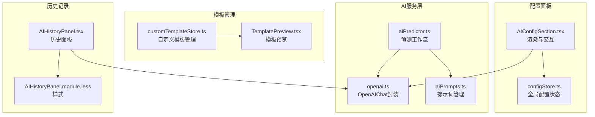
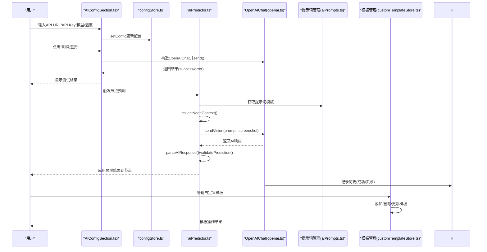
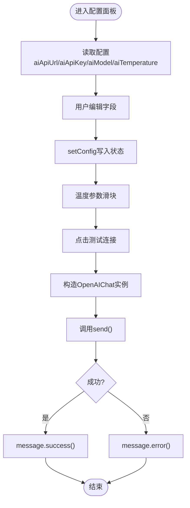
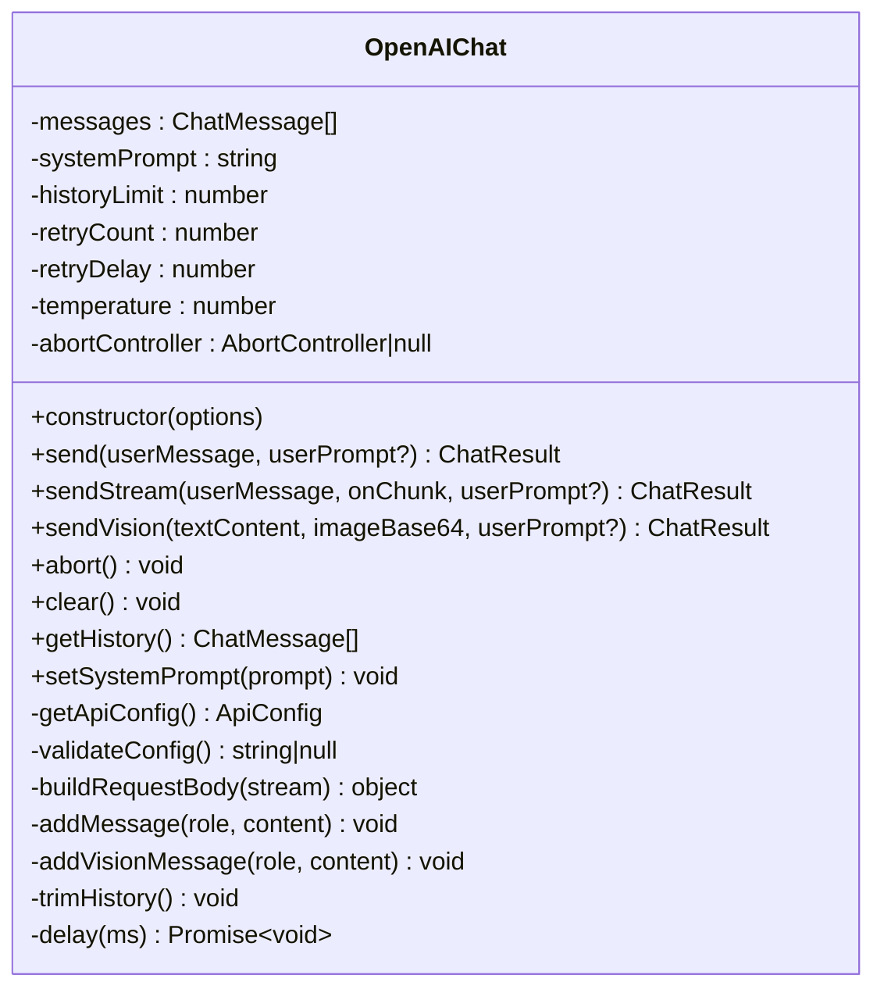
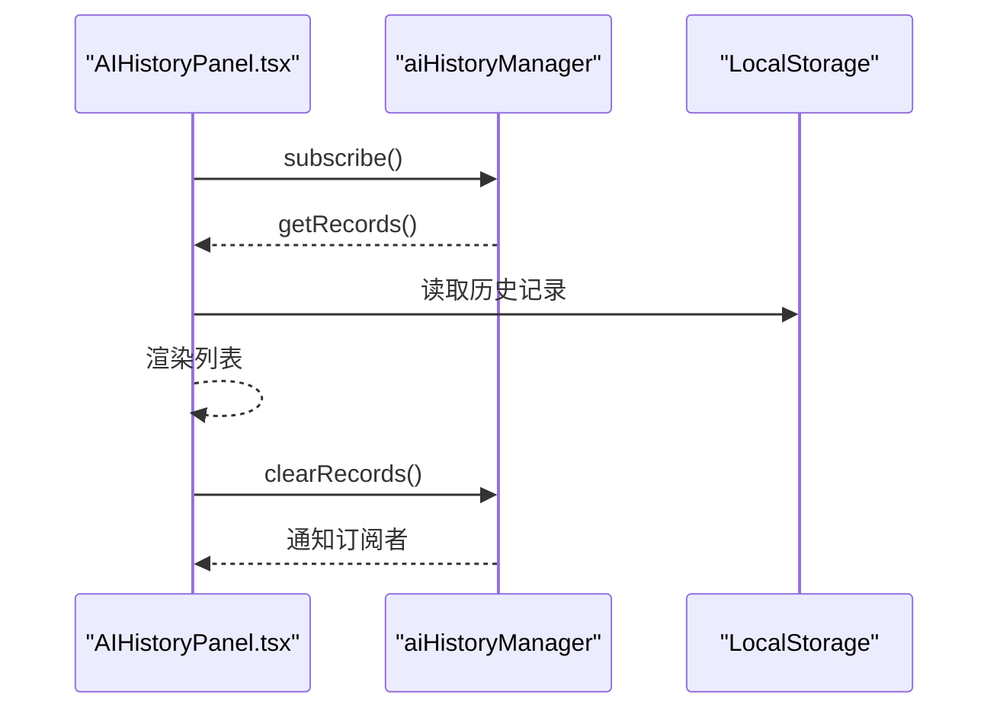

# AI配置区域

<cite>
**本文档引用的文件**
- [AIConfigSection.tsx](file://src/components/panels/config/AIConfigSection.tsx)
- [openai.ts](file://src/utils/openai.ts)
- [aiPredictor.ts](file://src/utils/aiPredictor.ts)
- [configStore.ts](file://src/stores/configStore.ts)
- [aiPrompts.ts](file://src/utils/aiPrompts.ts)
- [customTemplateStore.ts](file://src/stores/customTemplateStore.ts)
- [TemplatePreview.tsx](file://src/components/panels/field/items/TemplatePreview.tsx)
- [AIHistoryPanel.tsx](file://src/components/panels/main/AIHistoryPanel.tsx)
- [AIHistoryPanel.module.less](file://src/styles/AIHistoryPanel.module.less)
- [ConfigPanel.module.less](file://src/styles/ConfigPanel.module.less)
- [AI 服务.md](file://docsite/docs/01.指南/20.本地服务/50.AI 服务.md)
</cite>

## 更新摘要
**所做更改**
- 新增了丰富的提示词管理系统，包括系统提示词模板和预测示例
- 增强了AI预测配置的精确性和可定制性
- 新增了自定义节点模板管理功能
- 改进了模板图片预览和验证机制
- 优化了温度参数配置和历史记录管理

## 目录
1. [简介](#简介)
2. [项目结构](#项目结构)
3. [核心组件](#核心组件)
4. [架构总览](#架构总览)
5. [详细组件分析](#详细组件分析)
6. [依赖关系分析](#依赖关系分析)
7. [性能考量](#性能考量)
8. [故障排除指南](#故障排除指南)
9. [结论](#结论)
10. [附录](#附录)

## 简介
本文件系统性梳理了 MaaPipelineEditor 中"AI配置区域"的最新功能与实现，涵盖：
- AI服务API密钥配置、模型参数设置与推理选项调整
- 增强的提示词管理系统，包括系统提示词模板和预测示例
- OpenAI API的集成方式（认证机制、请求格式、响应处理）
- AI预测功能的精确配置选项（模型选择、温度参数、历史轮数等）
- 自定义节点模板管理与模板图片预览
- 性能优化策略（重试机制、历史轮数限制、取消请求）
- 最佳实践（成本控制、隐私保护、合规性）
- 故障排除与监控建议

## 项目结构
AI配置区域由前端配置面板、AI对话封装、预测工作流、提示词管理与历史记录面板组成，整体围绕配置存储与状态管理展开。



**图表来源**
- [AIConfigSection.tsx:1-188](file://src/components/panels/config/AIConfigSection.tsx#L1-L188)
- [configStore.ts:124-128](file://src/stores/configStore.ts#L124-L128)
- [openai.ts:419-499](file://src/utils/openai.ts#L419-L499)
- [aiPredictor.ts:311-342](file://src/utils/aiPredictor.ts#L311-L342)
- [aiPrompts.ts:420-427](file://src/utils/aiPrompts.ts#L420-L427)
- [customTemplateStore.ts:1-327](file://src/stores/customTemplateStore.ts#L1-L327)
- [TemplatePreview.tsx:1-185](file://src/components/panels/field/items/TemplatePreview.tsx#L1-L185)

**章节来源**
- [AIConfigSection.tsx:1-188](file://src/components/panels/config/AIConfigSection.tsx#L1-L188)
- [configStore.ts:124-128](file://src/stores/configStore.ts#L124-L128)

## 核心组件
- AI配置面板：提供API URL、API Key、模型名称和温度参数的输入与测试连接能力，并给出安全与CORS注意事项。
- OpenAIChat：封装OpenAI兼容API调用，支持非流式与流式响应、重试、取消、历史记录、系统提示词管理，新增Vision API支持。
- AI预测工作流：收集节点上下文、执行OCR截图识别、构建提示词、调用AI生成、解析与校验结果、应用到节点。
- 提示词管理系统：统一管理所有AI功能的提示词，包括系统提示词模板和预测示例。
- 自定义模板管理：支持节点模板的创建、编辑、删除、导入导出功能。
- 模板图片预览：提供模板图片的实时预览和验证功能。
- AI历史面板：展示历史记录、支持清空与展开查看实际消息。

**章节来源**
- [AIConfigSection.tsx:12-188](file://src/components/panels/config/AIConfigSection.tsx#L12-L188)
- [openai.ts:419-499](file://src/utils/openai.ts#L419-L499)
- [aiPredictor.ts:311-342](file://src/utils/aiPredictor.ts#L311-L342)
- [aiPrompts.ts:420-427](file://src/utils/aiPrompts.ts#L420-L427)
- [customTemplateStore.ts:1-327](file://src/stores/customTemplateStore.ts#L1-L327)
- [TemplatePreview.tsx:1-185](file://src/components/panels/field/items/TemplatePreview.tsx#L1-L185)

## 架构总览
AI配置区域的端到端流程如下：



**图表来源**
- [AIConfigSection.tsx:168-182](file://src/components/panels/config/AIConfigSection.tsx#L168-L182)
- [openai.ts:419-499](file://src/utils/openai.ts#L419-L499)
- [aiPredictor.ts:311-342](file://src/utils/aiPredictor.ts#L311-L342)
- [aiPrompts.ts:420-427](file://src/utils/aiPrompts.ts#L420-L427)
- [customTemplateStore.ts:96-170](file://src/stores/customTemplateStore.ts#L96-L170)

## 详细组件分析

### 组件A：AI配置面板（AIConfigSection）
- 功能要点
  - 展示并编辑AI配置项：API URL、API Key、模型名称、温度参数
  - 提供测试连接按钮，内部构造OpenAIChat并发起一次简短对话
  - 以警告提示API Key明文存储风险与CORS注意事项
  - 新增温度参数滑块控件，支持0-1范围调节
- 交互与数据流
  - 读取配置：通过useConfigStore读取aiApiUrl/aiApiKey/aiModel/aiTemperature
  - 写入配置：setConfig触发状态更新
  - 测试流程：构造OpenAIChat实例，调用send，根据结果弹出消息
- UI样式
  - 通过ConfigPanel.module.less中的.ai-config类控制宽度与布局



**图表来源**
- [AIConfigSection.tsx:12-188](file://src/components/panels/config/AIConfigSection.tsx#L12-L188)
- [ConfigPanel.module.less:90-94](file://src/styles/ConfigPanel.module.less#L90-L94)

**章节来源**
- [AIConfigSection.tsx:12-188](file://src/components/panels/config/AIConfigSection.tsx#L12-L188)
- [ConfigPanel.module.less:90-94](file://src/styles/ConfigPanel.module.less#L90-L94)

### 组件B：OpenAIChat（openai.ts）
- 功能要点
  - 配置校验：API URL、API Key、模型名称三要素缺一不可
  - 请求构建：统一构建messages、model、temperature、stream
  - 认证机制：Authorization头使用Bearer Token
  - 响应处理：非流式解析choices[0].message.content；流式解析SSE数据块
  - 重试机制：支持retryCount与retryDelay，逐次重试
  - 取消请求：AbortController支持主动取消
  - 历史上限：trimHistory按系统消息+非系统消息的倍数裁剪
  - **新增** Vision API支持：sendVision方法支持图片+文本的多模态输入
- 推理选项
  - temperature：默认0.7，可通过构造函数传入
  - historyLimit：默认10，控制非系统消息轮数上限
  - retryCount/retryDelay：默认2次重试、1000ms间隔
- 并发与取消
  - 每个OpenAIChat实例独立维护消息历史
  - 支持abort()取消当前请求



**图表来源**
- [openai.ts:419-499](file://src/utils/openai.ts#L419-L499)

**章节来源**
- [openai.ts:419-499](file://src/utils/openai.ts#L419-L499)

### 组件C：AI预测工作流（aiPredictor.ts）
- 功能要点
  - 收集上下文：定位当前节点、收集前置节点连接类型与关键参数、可选包含OCR结果
  - OCR截图识别：通过MFW协议请求截图与OCR，超时与失败时降级
  - 构建提示词：使用增强的提示词管理器，包含系统提示词模板和预测示例
  - 调用AI：构造OpenAIChat（temperature=0.3，historyLimit=5），发送构建的提示词
  - 解析与校验：去除Markdown代码块标记，校验JSON结构与必需字段
  - 应用配置：validatePrediction过滤无效类型/字段，applyPrediction批量更新节点
- 推理选项
  - temperature=0.3：降低创造性，提升稳定性
  - historyLimit=5：减少上下文长度，提高响应速度
- 降级处理
  - OCR失败时降级为无内容，不影响整体流程
  - AI返回格式异常时抛出明确错误


**图表来源**
- [aiPredictor.ts:311-342](file://src/utils/aiPredictor.ts#L311-L342)
- [aiPredictor.ts:347-379](file://src/utils/aiPredictor.ts#L347-L379)
- [aiPredictor.ts:386-496](file://src/utils/aiPredictor.ts#L386-L496)

**章节来源**
- [aiPredictor.ts:311-342](file://src/utils/aiPredictor.ts#L311-L342)
- [aiPredictor.ts:347-379](file://src/utils/aiPredictor.ts#L347-L379)
- [aiPredictor.ts:386-496](file://src/utils/aiPredictor.ts#L386-L496)

### 组件D：提示词管理系统（aiPrompts.ts）
- 功能要点
  - **系统提示词模板**：包含PIPELINE_EXPERT和TEST_CONNECTION等常量
  - **管道协议简要**：详细说明MaaFramework Pipeline协议的核心概念
  - **预测示例**：提供10个完整的正确和错误示例，涵盖各种节点类型
  - **视觉预测提示词构建**：buildVisionUserPrompt和buildVisionPredictionPrompt函数
  - **AI搜索提示词**：buildAISearchPrompt函数用于节点搜索功能
- 提示词结构
  - 系统提示词：定义AI的角色和行为准则
  - 用户提示词：包含节点上下文、分析要求和输出格式
  - 示例：提供具体的正确和错误案例

**章节来源**
- [aiPrompts.ts:420-427](file://src/utils/aiPrompts.ts#L420-L427)
- [aiPrompts.ts:11-138](file://src/utils/aiPrompts.ts#L11-L138)
- [aiPrompts.ts:143-314](file://src/utils/aiPrompts.ts#L143-L314)
- [aiPrompts.ts:320-392](file://src/utils/aiPrompts.ts#L320-L392)

### 组件E：自定义模板管理（customTemplateStore.ts）
- 功能要点
  - **模板存储**：支持最多50个自定义模板的存储
  - **模板操作**：添加、删除、更新、获取所有模板
  - **模板导入导出**：支持模板数据的导入和导出功能
  - **版本管理**：使用版本化的存储格式确保数据兼容性
  - **模板验证**：检查模板名称的有效性和数量限制
- 模板结构
  - label：模板名称
  - nodeType：节点类型
  - data：节点数据（不包含label）
  - createTime：创建时间

**章节来源**
- [customTemplateStore.ts:7-18](file://src/stores/customTemplateStore.ts#L7-L18)
- [customTemplateStore.ts:96-170](file://src/stores/customTemplateStore.ts#L96-L170)
- [customTemplateStore.ts:212-265](file://src/stores/customTemplateStore.ts#L212-L265)

### 组件F：模板图片预览（TemplatePreview.tsx）
- 功能要点
  - **图片预览**：在hover时显示模板图片预览
  - **缓存管理**：支持图片缓存和待处理请求的状态跟踪
  - **多资源支持**：支持多模板图片的批量预览
  - **连接状态**：根据WebSocket连接状态动态调整行为
  - **尺寸适配**：自动计算图片显示尺寸，支持单张和多张图片预览
- 预览内容
  - 字段描述
  - 图片列表和尺寸信息
  - 加载状态指示

**章节来源**
- [TemplatePreview.tsx:18-50](file://src/components/panels/field/items/TemplatePreview.tsx#L18-L50)
- [TemplatePreview.tsx:140-159](file://src/components/panels/field/items/TemplatePreview.tsx#L140-L159)

### 组件G：AI历史面板（AIHistoryPanel）
- 功能要点
  - 订阅AI历史变更，实时渲染列表
  - 展示时间戳、成功/失败标签、用户输入与实际消息、AI回复或错误
  - 支持清空历史与展开查看实际消息
- 样式适配
  - 暗色模式适配，背景与边框颜色随主题切换



**图表来源**
- [AIHistoryPanel.tsx:94-106](file://src/components/panels/main/AIHistoryPanel.tsx#L94-L106)
- [AIHistoryPanel.module.less:100-118](file://src/styles/AIHistoryPanel.module.less#L100-L118)

**章节来源**
- [AIHistoryPanel.tsx:83-163](file://src/components/panels/main/AIHistoryPanel.tsx#L83-L163)
- [AIHistoryPanel.module.less:1-119](file://src/styles/AIHistoryPanel.module.less#L1-L119)

## 依赖关系分析
- 配置存储
  - configStore.ts集中管理aiApiUrl、aiApiKey、aiModel、aiTemperature等AI相关配置，并提供setConfig与replaceConfig
- 组件耦合
  - AIConfigSection依赖configStore读写配置，同时依赖OpenAIChat进行测试
  - aiPredictor依赖OpenAIChat进行AI调用，依赖MFW协议进行OCR截图
  - **新增** aiPredictor依赖aiPrompts进行提示词构建
  - **新增** 模板管理依赖localStorage进行数据持久化
  - AIHistoryPanel依赖aiHistoryManager进行历史记录的订阅与展示
- 外部依赖
  - fetch API用于HTTP请求
  - LocalStorage用于历史记录和模板数据持久化（由aiHistoryManager和customTemplateStore内部实现）

```mermaid
graph LR
CFG["configStore.ts"] <- --> AICFG["AIConfigSection.tsx"]
CFG <- --> OPENAI["openai.ts"]
PRED["aiPredictor.ts"] --> OPENAI
PRED --> PROMPTS["aiPrompts.ts"]
TEMPLATES["customTemplateStore.ts"] --> PREVIEW["TemplatePreview.tsx"]
HISUI["AIHistoryPanel.tsx"] --> OPENAI
```

**图表来源**
- [configStore.ts:124-128](file://src/stores/configStore.ts#L124-L128)
- [AIConfigSection.tsx:7-17](file://src/components/panels/config/AIConfigSection.tsx#L7-L17)
- [openai.ts:115-119](file://src/utils/openai.ts#L115-L119)
- [aiPredictor.ts:18](file://src/utils/aiPredictor.ts#L18)
- [aiPrompts.ts:8](file://src/utils/aiPrompts.ts#L8)
- [customTemplateStore.ts:1](file://src/stores/customTemplateStore.ts#L1)
- [TemplatePreview.tsx:3-5](file://src/components/panels/field/items/TemplatePreview.tsx#L3-L5)

**章节来源**
- [configStore.ts:124-128](file://src/stores/configStore.ts#L124-L128)
- [AIConfigSection.tsx:7-17](file://src/components/panels/config/AIConfigSection.tsx#L7-L17)
- [openai.ts:115-119](file://src/utils/openai.ts#L115-L119)
- [aiPredictor.ts:18](file://src/utils/aiPredictor.ts#L18)
- [aiPrompts.ts:8](file://src/utils/aiPrompts.ts#L8)
- [customTemplateStore.ts:1](file://src/stores/customTemplateStore.ts#L1)
- [TemplatePreview.tsx:3-5](file://src/components/panels/field/items/TemplatePreview.tsx#L3-L5)

## 性能考量
- 温度参数与历史轮数
  - OpenAIChat默认temperature=0.7；predictNodeConfig中显式设置temperature=0.3，降低创造性，提升稳定性与一致性
  - 默认historyLimit=10；predictNodeConfig中设置historyLimit=5，缩短上下文，减少延迟与成本
- 重试与超时
  - 默认retryCount=2，retryDelay=1000ms；在不稳定网络环境下可适当增加重试次数
  - OCR截图与OCR识别分别设置超时（截图10s、OCR15s），失败时降级，避免阻塞
- 取消请求
  - 支持AbortController取消当前请求，防止长时间挂起
- 历史记录裁剪
  - trimHistory按系统消息+非系统消息的倍数裁剪，避免历史无限增长导致性能下降
- **新增** 模板管理优化
  - 自定义模板数量限制为50个，防止内存占用过大
  - 模板数据版本化管理，确保向后兼容性

**章节来源**
- [openai.ts:102-107](file://src/utils/openai.ts#L102-L107)
- [openai.ts:148-157](file://src/utils/openai.ts#L148-L157)
- [aiPredictor.ts:322-325](file://src/utils/aiPredictor.ts#L322-L325)
- [customTemplateStore.ts:22](file://src/stores/customTemplateStore.ts#L22)

## 故障排除指南
- 常见问题与解决
  - 未连接到本地服务与设备：确认LocalBridge与设备连接状态
  - AI API配置不完整：检查API URL、API Key、模型名称、温度参数是否填写
  - OCR识别失败：检查MaaFramework路径、OCR模型文件、设备画面清晰度
  - AI生成配置不符合预期：查看AI对话历史，优化节点命名与前置节点配置
  - CORS跨域错误：使用支持CORS的API代理服务或选择官方支持CORS的提供商
  - **新增** 模板管理问题：检查模板数量限制、模板名称有效性、存储权限
  - **新增** Vision API问题：确认图片格式正确、base64编码无前缀
- 监控与诊断
  - 使用AI历史面板查看每次请求的userPrompt、actualMessage、response与错误信息
  - 通过测试连接快速验证API配置是否可用
  - 在网络不稳定时适当增加retryCount或选择国内访问友好的API服务
  - **新增** 使用模板预览功能验证模板图片的有效性

**章节来源**
- [AI 服务.md:156-225](file://docsite/docs/01.指南/20.本地服务/50.AI 服务.md#L156-L225)
- [AIHistoryPanel.tsx:94-106](file://src/components/panels/main/AIHistoryPanel.tsx#L94-L106)

## 结论
AI配置区域通过简洁的配置面板与完善的AI服务封装，实现了从API配置到预测应用的完整闭环。**最新的更新增强了提示词管理系统的丰富性和精确性，新增了自定义模板管理功能，改进了模板图片预览机制。**OpenAIChat提供了稳健的请求与重试机制，aiPredictor在保证协议约束的前提下，最大化地利用上下文与OCR信息生成高质量节点配置。配合历史记录面板与文档指导，用户可以在保障隐私与合规的同时，高效地完成复杂流程的节点配置。

## 附录

### OpenAI API集成细节
- 认证机制
  - Authorization: Bearer {apiKey}
- 请求格式
  - Content-Type: application/json
  - Body包含：model、messages、temperature、stream
- 响应处理
  - 非流式：解析choices[0].message.content
  - 流式：解析SSE数据块，逐段拼接content
- **新增** Vision API支持
  - sendVision方法支持图片+文本的多模态输入
  - 支持base64格式的图片数据
  - 自动添加图片URL到消息内容

**章节来源**
- [openai.ts:453-466](file://src/utils/openai.ts#L453-L466)
- [openai.ts:436-443](file://src/utils/openai.ts#L436-L443)
- [openai.ts:473-475](file://src/utils/openai.ts#L473-L475)

### AI预测配置选项
- 模型选择
  - 在配置面板中设置aiModel
- 温度参数
  - OpenAIChat默认0.7；predictNodeConfig显式设置0.3
  - **新增** 配置面板支持0-1范围的温度参数滑块调节
- 历史轮数
  - OpenAIChat默认10；predictNodeConfig设置5
- 重试与延迟
  - 默认retryCount=2，retryDelay=1000ms

**章节来源**
- [AIConfigSection.tsx:129-158](file://src/components/panels/config/AIConfigSection.tsx#L129-L158)
- [openai.ts:102-107](file://src/utils/openai.ts#L102-L107)
- [aiPredictor.ts:322-325](file://src/utils/aiPredictor.ts#L322-L325)

### 提示词管理系统
- **系统提示词模板**
  - PIPELINE_EXPERT：MaaFramework Pipeline配置专家角色定义
  - TEST_CONNECTION：简短回复测试连接
- **管道协议简要**
  - 识别类型速查表：DirectHit、TemplateMatch、OCR、ColorMatch等
  - 动作类型速查表：Click、LongPress、Swipe、InputText等
  - 关键约束规则：类型约束、格式规范、节点命名语义映射
- **预测示例**
  - 10个正确示例：涵盖点击、滑动、长按、输入、启动应用等场景
  - 7个错误示例：说明常见的配置错误和解决方案

**章节来源**
- [aiPrompts.ts:420-427](file://src/utils/aiPrompts.ts#L420-L427)
- [aiPrompts.ts:11-138](file://src/utils/aiPrompts.ts#L11-L138)
- [aiPrompts.ts:143-314](file://src/utils/aiPrompts.ts#L143-L314)

### 自定义模板管理最佳实践
- **模板数量限制**
  - 最多支持50个自定义模板
  - 超限时需要删除旧模板才能添加新模板
- **模板验证**
  - 模板名称不能为空且不超过30个字符
  - 自动序列化节点数据，排除label字段
- **数据持久化**
  - 使用版本化的存储格式确保向后兼容性
  - 支持模板数据的导入和导出功能
- **模板预览**
  - 实时预览模板图片，支持多模板图片
  - 自动计算显示尺寸，支持单张和多张图片预览

**章节来源**
- [customTemplateStore.ts:22](file://src/stores/customTemplateStore.ts#L22)
- [customTemplateStore.ts:107-116](file://src/stores/customTemplateStore.ts#L107-L116)
- [TemplatePreview.tsx:100-117](file://src/components/panels/field/items/TemplatePreview.tsx#L100-L117)

### 最佳实践
- 成本控制
  - 选择国内访问友好的API服务，缩短往返时间
  - 使用较低temperature（如0.3）与较短historyLimit（如5）减少token用量
  - **新增** 合理使用Vision API，避免不必要的图片传输
- 隐私保护
  - API Key明文存储于浏览器LocalStorage，避免在公共设备使用
  - 使用支持CORS的API代理服务，避免直接暴露密钥
  - **新增** 定期清理自定义模板，避免敏感信息泄露
- 合规性
  - 仅在授权范围内使用AI服务
  - 保留AI历史记录以便审计与追溯
  - **新增** 遵守模板使用规范，避免侵权内容

**章节来源**
- [AI 服务.md:110-147](file://docsite/docs/01.指南/20.本地服务/50.AI 服务.md#L110-L147)
- [AIConfigSection.tsx:28-42](file://src/components/panels/config/AIConfigSection.tsx#L28-L42)