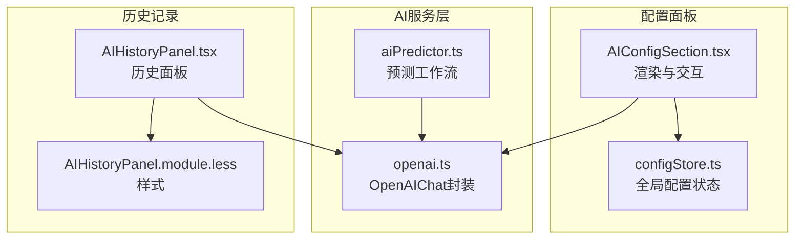
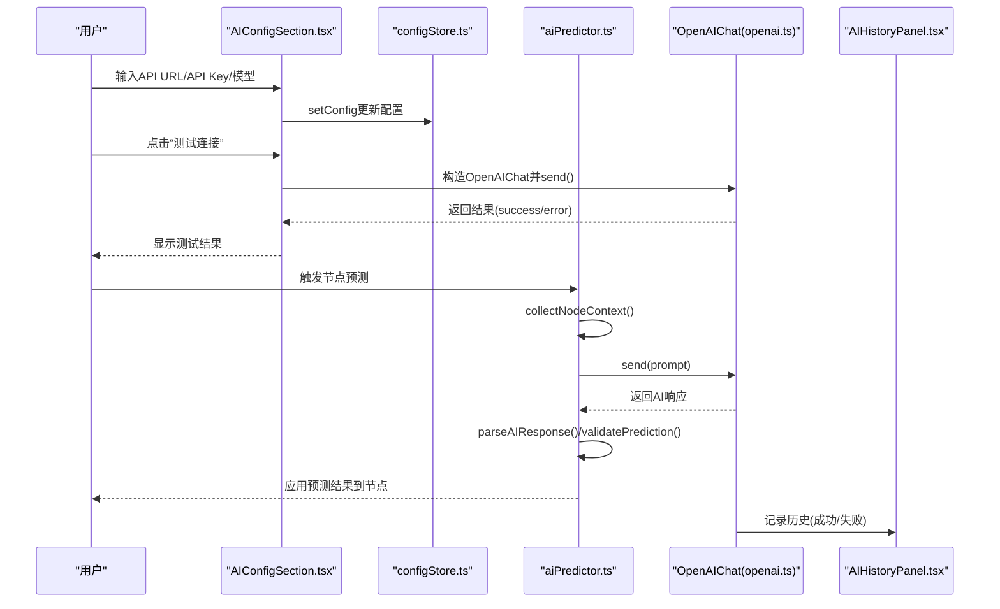
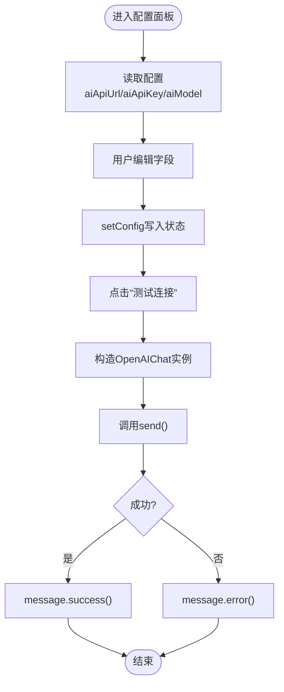
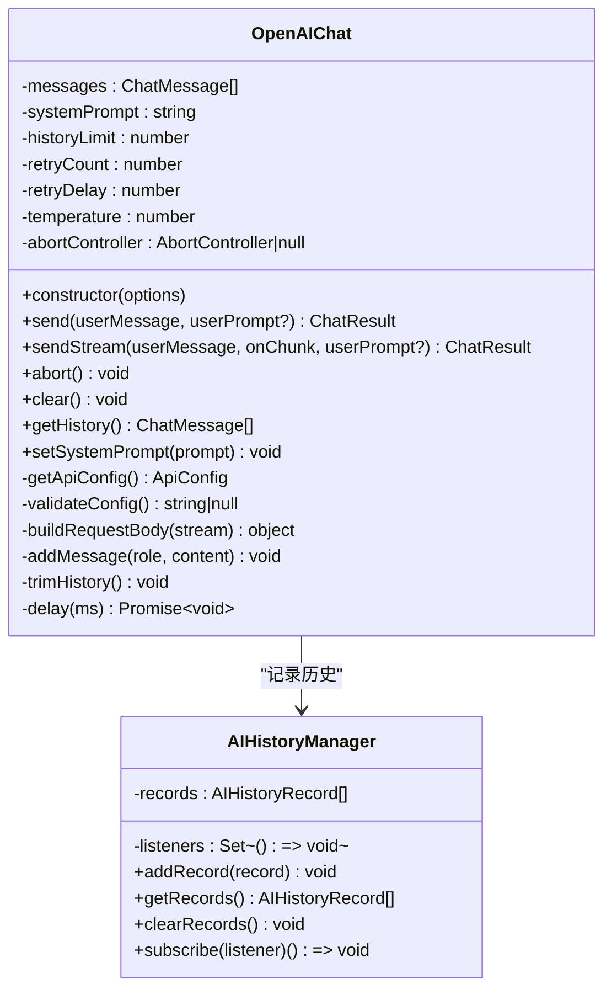
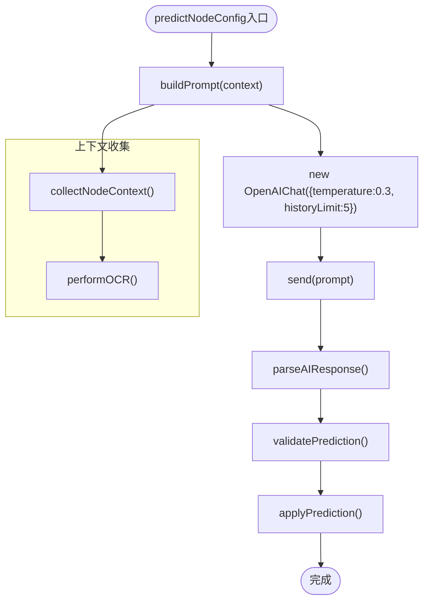
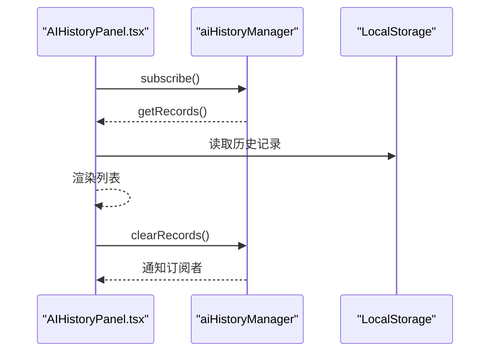

# AI配置区域

<cite>
**本文档引用的文件**
- [AIConfigSection.tsx](file://src/components/panels/config/AIConfigSection.tsx)
- [openai.ts](file://src/utils/openai.ts)
- [aiPredictor.ts](file://src/utils/aiPredictor.ts)
- [configStore.ts](file://src/stores/configStore.ts)
- [AIHistoryPanel.tsx](file://src/components/panels/main/AIHistoryPanel.tsx)
- [AIHistoryPanel.module.less](file://src/styles/AIHistoryPanel.module.less)
- [ConfigPanel.module.less](file://src/styles/ConfigPanel.module.less)
- [AI 服务.md](file://docsite/docs/01.指南/20.本地服务/50.AI 服务.md)
</cite>

## 目录
1. [简介](#简介)
2. [项目结构](#项目结构)
3. [核心组件](#核心组件)
4. [架构总览](#架构总览)
5. [详细组件分析](#详细组件分析)
6. [依赖关系分析](#依赖关系分析)
7. [性能考量](#性能考量)
8. [故障排除指南](#故障排除指南)
9. [结论](#结论)
10. [附录](#附录)

## 简介
本文件系统性梳理了 MaaPipelineEditor 中“AI配置区域”的功能与实现，涵盖：
- AI服务API密钥配置、模型参数设置与推理选项调整
- OpenAI API的集成方式（认证机制、请求格式、响应处理）
- AI预测功能的配置选项（模型选择、温度参数、历史轮数等）
- 性能优化策略（重试机制、历史轮数限制、取消请求）
- 最佳实践（成本控制、隐私保护、合规性）
- 故障排除与监控建议

## 项目结构
AI配置区域由前端配置面板、AI对话封装、预测工作流与历史记录面板组成，整体围绕配置存储与状态管理展开。



图表来源
- [AIConfigSection.tsx:1-148](file://src/components/panels/config/AIConfigSection.tsx#L1-L148)
- [configStore.ts:115-144](file://src/stores/configStore.ts#L115-L144)
- [openai.ts:93-393](file://src/utils/openai.ts#L93-L393)
- [aiPredictor.ts:532-559](file://src/utils/aiPredictor.ts#L532-L559)
- [AIHistoryPanel.tsx:83-163](file://src/components/panels/main/AIHistoryPanel.tsx#L83-L163)
- [AIHistoryPanel.module.less:1-119](file://src/styles/AIHistoryPanel.module.less#L1-L119)

章节来源
- [AIConfigSection.tsx:1-148](file://src/components/panels/config/AIConfigSection.tsx#L1-L148)
- [configStore.ts:115-144](file://src/stores/configStore.ts#L115-L144)

## 核心组件
- AI配置面板：提供API URL、API Key、模型名称的输入与测试连接能力，并给出安全与CORS注意事项。
- OpenAIChat：封装OpenAI兼容API调用，支持非流式与流式响应、重试、取消、历史记录、系统提示词管理。
- AI预测工作流：收集节点上下文、执行OCR截图识别、构建提示词、调用AI生成、解析与校验结果、应用到节点。
- AI历史面板：展示历史记录、支持清空与展开查看实际消息。

章节来源
- [AIConfigSection.tsx:11-148](file://src/components/panels/config/AIConfigSection.tsx#L11-L148)
- [openai.ts:93-393](file://src/utils/openai.ts#L93-L393)
- [aiPredictor.ts:82-172](file://src/utils/aiPredictor.ts#L82-L172)
- [AIHistoryPanel.tsx:83-163](file://src/components/panels/main/AIHistoryPanel.tsx#L83-L163)

## 架构总览
AI配置区域的端到端流程如下：



图表来源
- [AIConfigSection.tsx:129-140](file://src/components/panels/config/AIConfigSection.tsx#L129-L140)
- [openai.ts:169-243](file://src/utils/openai.ts#L169-L243)
- [aiPredictor.ts:532-559](file://src/utils/aiPredictor.ts#L532-L559)
- [AIHistoryPanel.tsx:94-106](file://src/components/panels/main/AIHistoryPanel.tsx#L94-L106)

## 详细组件分析

### 组件A：AI配置面板（AIConfigSection）
- 功能要点
  - 展示并编辑AI配置项：API URL、API Key、模型名称
  - 提供测试连接按钮，内部构造OpenAIChat并发起一次简短对话
  - 以警告提示API Key明文存储风险与CORS注意事项
- 交互与数据流
  - 读取配置：通过useConfigStore读取aiApiUrl/aiApiKey/aiModel
  - 写入配置：setConfig触发状态更新
  - 测试流程：构造OpenAIChat实例，调用send，根据结果弹出消息
- UI样式
  - 通过ConfigPanel.module.less中的.ai-config类控制宽度与布局



图表来源
- [AIConfigSection.tsx:11-148](file://src/components/panels/config/AIConfigSection.tsx#L11-L148)
- [ConfigPanel.module.less:90-94](file://src/styles/ConfigPanel.module.less#L90-L94)

章节来源
- [AIConfigSection.tsx:11-148](file://src/components/panels/config/AIConfigSection.tsx#L11-L148)
- [ConfigPanel.module.less:90-94](file://src/styles/ConfigPanel.module.less#L90-L94)

### 组件B：OpenAIChat（openai.ts）
- 功能要点
  - 配置校验：API URL、API Key、模型名称三要素缺一不可
  - 请求构建：统一构建messages、model、temperature、stream
  - 认证机制：Authorization头使用Bearer Token
  - 响应处理：非流式解析choices[0].message.content；流式解析SSE数据块
  - 重试机制：支持retryCount与retryDelay，逐次重试
  - 取消请求：AbortController支持主动取消
  - 历史记录：aiHistoryManager统一记录每次请求的userPrompt/actualMessage/response/success/error
  - 历史上限：trimHistory按系统消息+非系统消息的倍数裁剪
- 推理选项
  - temperature：默认0.7，可通过构造函数传入
  - historyLimit：默认10，控制非系统消息轮数上限
  - retryCount/retryDelay：默认2次重试、1000ms间隔
- 并发与取消
  - 每个OpenAIChat实例独立维护消息历史
  - 支持abort()取消当前请求



图表来源
- [openai.ts:93-393](file://src/utils/openai.ts#L93-L393)

章节来源
- [openai.ts:93-393](file://src/utils/openai.ts#L93-L393)

### 组件C：AI预测工作流（aiPredictor.ts）
- 功能要点
  - 收集上下文：定位当前节点、收集前置节点连接类型与关键参数、可选包含OCR结果
  - OCR截图识别：通过MFW协议请求截图与OCR，超时与失败时降级
  - 构建提示词：内置系统知识与用户提示词，严格约束字段与类型组合
  - 调用AI：构造OpenAIChat（temperature=0.3，historyLimit=5），发送构建的提示词
  - 解析与校验：去除Markdown代码块标记，校验JSON结构与必需字段
  - 应用配置：validatePrediction过滤无效类型/字段，applyPrediction批量更新节点
- 推理选项
  - temperature=0.3：降低创造性，提升稳定性
  - historyLimit=5：减少上下文长度，提高响应速度
- 降级处理
  - OCR失败时降级为无内容，不影响整体流程
  - AI返回格式异常时抛出明确错误



图表来源
- [aiPredictor.ts:532-559](file://src/utils/aiPredictor.ts#L532-L559)
- [aiPredictor.ts:271-525](file://src/utils/aiPredictor.ts#L271-L525)
- [aiPredictor.ts:564-596](file://src/utils/aiPredictor.ts#L564-L596)
- [aiPredictor.ts:603-713](file://src/utils/aiPredictor.ts#L603-L713)
- [aiPredictor.ts:720-784](file://src/utils/aiPredictor.ts#L720-L784)

章节来源
- [aiPredictor.ts:82-172](file://src/utils/aiPredictor.ts#L82-L172)
- [aiPredictor.ts:271-525](file://src/utils/aiPredictor.ts#L271-L525)
- [aiPredictor.ts:532-559](file://src/utils/aiPredictor.ts#L532-L559)
- [aiPredictor.ts:564-596](file://src/utils/aiPredictor.ts#L564-L596)
- [aiPredictor.ts:603-713](file://src/utils/aiPredictor.ts#L603-L713)
- [aiPredictor.ts:720-784](file://src/utils/aiPredictor.ts#L720-L784)

### 组件D：AI历史面板（AIHistoryPanel）
- 功能要点
  - 订阅AI历史变更，实时渲染列表
  - 展示时间戳、成功/失败标签、用户输入与实际消息、AI回复或错误
  - 支持清空历史与展开查看实际消息
- 样式适配
  - 暗色模式适配，背景与边框颜色随主题切换



图表来源
- [AIHistoryPanel.tsx:94-106](file://src/components/panels/main/AIHistoryPanel.tsx#L94-L106)
- [AIHistoryPanel.tsx:109-111](file://src/components/panels/main/AIHistoryPanel.tsx#L109-L111)
- [AIHistoryPanel.module.less:100-118](file://src/styles/AIHistoryPanel.module.less#L100-L118)

章节来源
- [AIHistoryPanel.tsx:83-163](file://src/components/panels/main/AIHistoryPanel.tsx#L83-L163)
- [AIHistoryPanel.module.less:1-119](file://src/styles/AIHistoryPanel.module.less#L1-L119)

## 依赖关系分析
- 配置存储
  - configStore.ts集中管理aiApiUrl、aiApiKey、aiModel等AI相关配置，并提供setConfig与replaceConfig
- 组件耦合
  - AIConfigSection依赖configStore读写配置，同时依赖OpenAIChat进行测试
  - aiPredictor依赖OpenAIChat进行AI调用，依赖MFW协议进行OCR截图
  - AIHistoryPanel依赖aiHistoryManager进行历史记录的订阅与展示
- 外部依赖
  - fetch API用于HTTP请求
  - LocalStorage用于历史记录持久化（由aiHistoryManager内部实现）

```mermaid
graph LR
CFG["configStore.ts"] <- --> AICFG["AIConfigSection.tsx"]
CFG <- --> OPENAI["openai.ts"]
PRED["aiPredictor.ts"] --> OPENAI
HISUI["AIHistoryPanel.tsx"] --> OPENAI
```

图表来源
- [configStore.ts:115-144](file://src/stores/configStore.ts#L115-L144)
- [AIConfigSection.tsx:7-15](file://src/components/panels/config/AIConfigSection.tsx#L7-L15)
- [openai.ts:115-119](file://src/utils/openai.ts#L115-L119)
- [aiPredictor.ts:1-15](file://src/utils/aiPredictor.ts#L1-L15)
- [AIHistoryPanel.tsx:8-9](file://src/components/panels/main/AIHistoryPanel.tsx#L8-L9)

章节来源
- [configStore.ts:115-144](file://src/stores/configStore.ts#L115-L144)
- [AIConfigSection.tsx:7-15](file://src/components/panels/config/AIConfigSection.tsx#L7-L15)
- [openai.ts:115-119](file://src/utils/openai.ts#L115-L119)
- [aiPredictor.ts:1-15](file://src/utils/aiPredictor.ts#L1-L15)
- [AIHistoryPanel.tsx:8-9](file://src/components/panels/main/AIHistoryPanel.tsx#L8-L9)

## 性能考量
- 温度参数与历史轮数
  - OpenAIChat默认temperature=0.7；predictNodeConfig中显式设置temperature=0.3，降低创造性，提升稳定性与一致性
  - 默认historyLimit=10；predictNodeConfig中设置historyLimit=5，缩短上下文，减少延迟与成本
- 重试与超时
  - 默认retryCount=2，retryDelay=1000ms；在不稳定网络环境下可适当增加重试次数
  - OCR截图与OCR识别分别设置超时（截图10s、OCR15s），失败时降级，避免阻塞
- 取消请求
  - 支持AbortController取消当前请求，防止长时间挂起
- 历史记录裁剪
  - trimHistory按系统消息+非系统消息的倍数裁剪，避免历史无限增长导致性能下降

章节来源
- [openai.ts:102-107](file://src/utils/openai.ts#L102-L107)
- [openai.ts:148-157](file://src/utils/openai.ts#L148-L157)
- [aiPredictor.ts:539-543](file://src/utils/aiPredictor.ts#L539-L543)
- [aiPredictor.ts:196-248](file://src/utils/aiPredictor.ts#L196-L248)

## 故障排除指南
- 常见问题与解决
  - 未连接到本地服务与设备：确认LocalBridge与设备连接状态
  - AI API配置不完整：检查API URL、API Key、模型名称是否填写
  - OCR识别失败：检查MaaFramework路径、OCR模型文件、设备画面清晰度
  - AI生成配置不符合预期：查看AI对话历史，优化节点命名与前置节点配置
  - CORS跨域错误：使用支持CORS的API代理服务或选择官方支持CORS的提供商
- 监控与诊断
  - 使用AI历史面板查看每次请求的userPrompt、actualMessage、response与错误信息
  - 通过测试连接快速验证API配置是否可用
  - 在网络不稳定时适当增加retryCount或选择国内访问友好的API服务

章节来源
- [AI 服务.md:156-225](file://docsite/docs/01.指南/20.本地服务/50.AI 服务.md#L156-L225)
- [AIHistoryPanel.tsx:94-106](file://src/components/panels/main/AIHistoryPanel.tsx#L94-L106)

## 结论
AI配置区域通过简洁的配置面板与完善的AI服务封装，实现了从API配置到预测应用的完整闭环。OpenAIChat提供了稳健的请求与重试机制，aiPredictor在保证协议约束的前提下，最大化地利用上下文与OCR信息生成高质量节点配置。配合历史记录面板与文档指导，用户可以在保障隐私与合规的同时，高效地完成复杂流程的节点配置。

## 附录

### OpenAI API集成细节
- 认证机制
  - Authorization: Bearer {apiKey}
- 请求格式
  - Content-Type: application/json
  - Body包含：model、messages、temperature、stream
- 响应处理
  - 非流式：解析choices[0].message.content
  - 流式：解析SSE数据块，逐段拼接content
- 错误处理
  - HTTP状态码非2xx时读取响应文本作为错误信息
  - 支持AbortError区分用户取消

章节来源
- [openai.ts:191-209](file://src/utils/openai.ts#L191-L209)
- [openai.ts:277-290](file://src/utils/openai.ts#L277-L290)
- [openai.ts:300-325](file://src/utils/openai.ts#L300-L325)

### AI预测配置选项
- 模型选择
  - 在配置面板中设置aiModel
- 温度参数
  - OpenAIChat默认0.7；predictNodeConfig显式设置0.3
- 历史轮数
  - OpenAIChat默认10；predictNodeConfig设置5
- 重试与延迟
  - 默认retryCount=2，retryDelay=1000ms

章节来源
- [AIConfigSection.tsx:115-118](file://src/components/panels/config/AIConfigSection.tsx#L115-L118)
- [openai.ts:102-107](file://src/utils/openai.ts#L102-L107)
- [aiPredictor.ts:539-543](file://src/utils/aiPredictor.ts#L539-L543)

### 最佳实践
- 成本控制
  - 选择国内访问友好的API服务，缩短往返时间
  - 使用较低temperature（如0.3）与较短historyLimit（如5）减少token用量
- 隐私保护
  - API Key明文存储于浏览器LocalStorage，避免在公共设备使用
  - 使用支持CORS的API代理服务，避免直接暴露密钥
- 合规性
  - 仅在授权范围内使用AI服务
  - 保留AI历史记录以便审计与追溯

章节来源
- [AI 服务.md:110-147](file://docsite/docs/01.指南/20.本地服务/50.AI 服务.md#L110-L147)
- [AIConfigSection.tsx:37-42](file://src/components/panels/config/AIConfigSection.tsx#L37-L42)