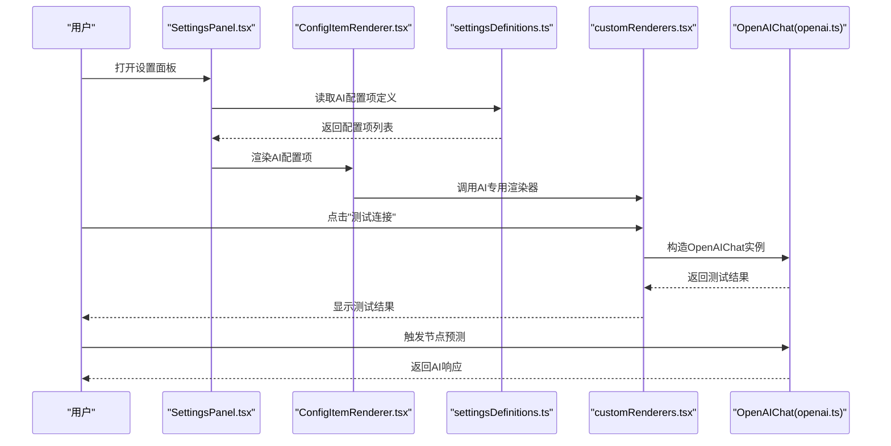
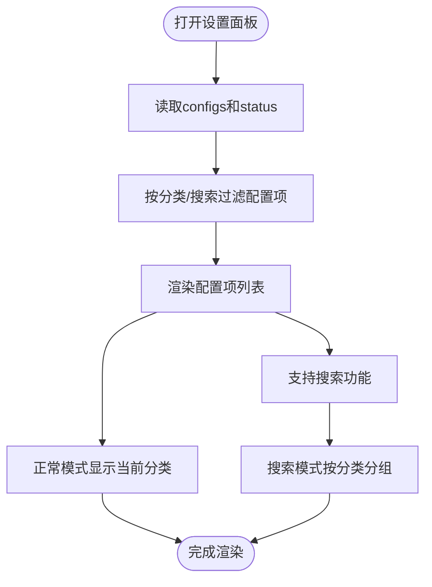
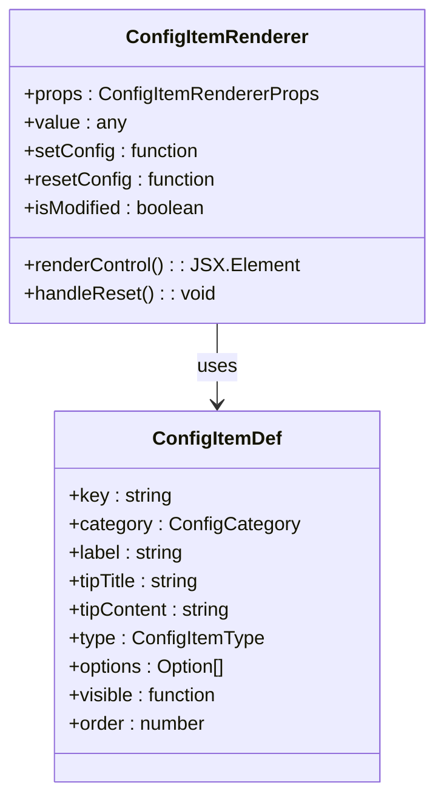
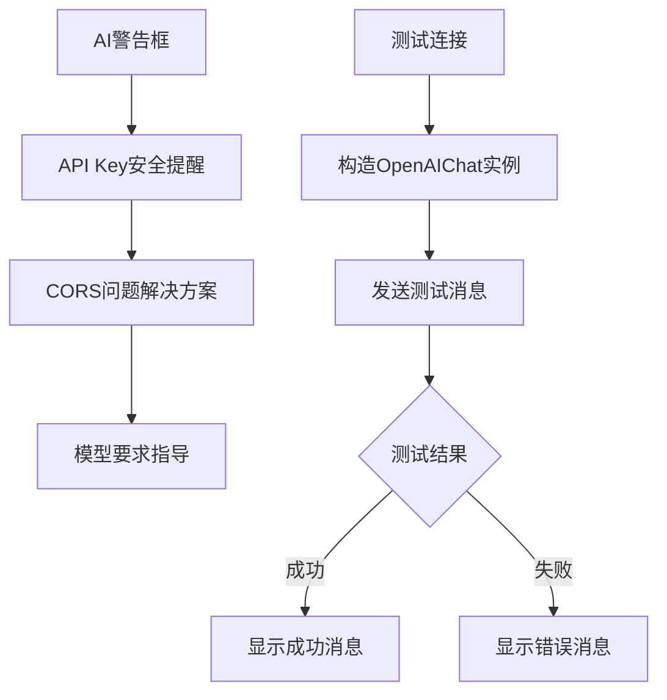
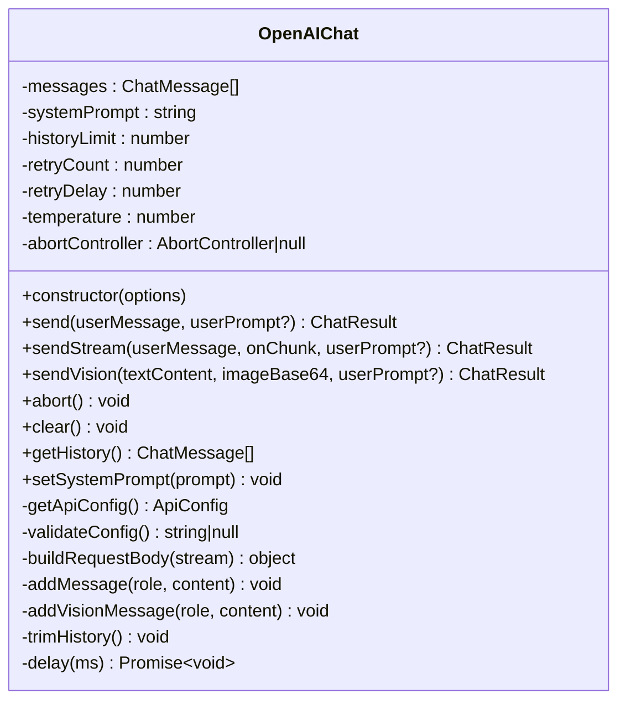
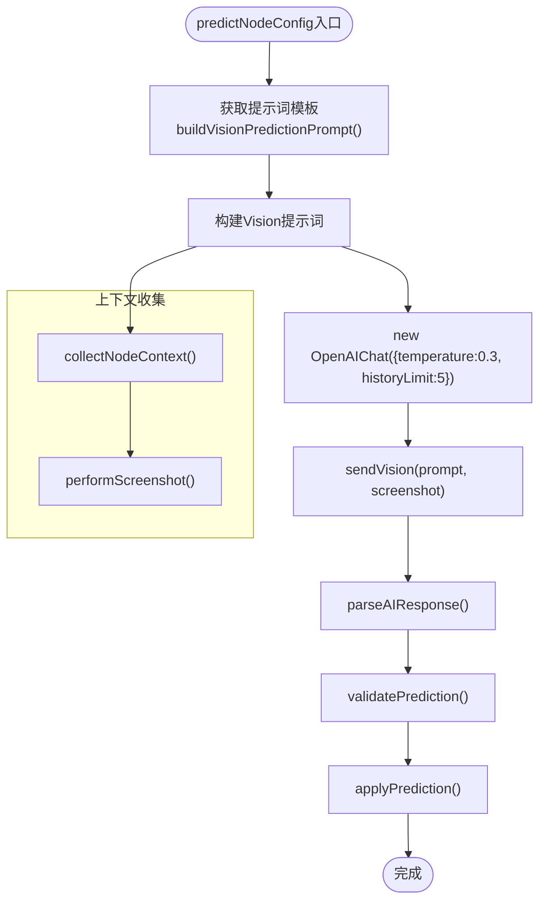
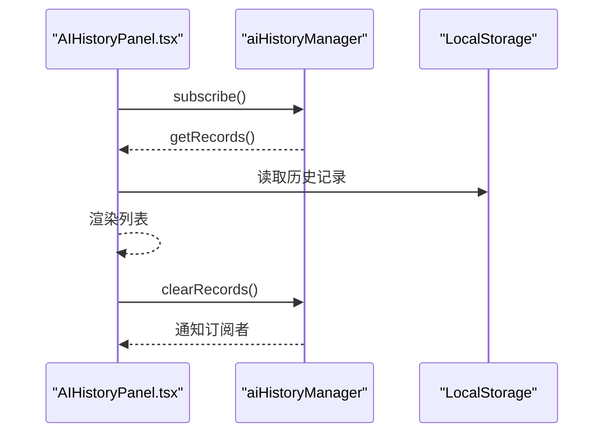

# AI配置区域

<cite>
**本文档引用的文件**
- [SettingsPanel.tsx](file://src/components/panels/settings/SettingsPanel.tsx)
- [ConfigItemRenderer.tsx](file://src/components/panels/settings/ConfigItemRenderer.tsx)
- [settingsDefinitions.ts](file://src/components/panels/settings/settingsDefinitions.ts)
- [customRenderers.tsx](file://src/components/panels/settings/customRenderers.tsx)
- [openai.ts](file://src/utils/ai/openai.ts)
- [aiPredictor.ts](file://src/utils/ai/aiPredictor.ts)
- [aiPrompts.ts](file://src/utils/ai/aiPrompts.ts)
- [configStore.ts](file://src/stores/configStore.ts)
- [AIHistoryPanel.tsx](file://src/components/panels/main/AIHistoryPanel.tsx)
- [AIHistoryPanel.module.less](file://src/styles/panels/AIHistoryPanel.module.less)
</cite>

## 更新摘要
**所做更改**
- AI配置区域已重构为统一设置系统的一部分，不再使用独立的AIConfigSection组件
- AI配置现在通过专门的渲染器进行管理，包括AI警告框和测试连接功能
- 新增了完整的AI配置项定义，包括API URL、API Key、模型名称和温度参数
- 改进了AI历史记录面板的显示和管理功能
- 优化了AI配置的安全提示和使用指导

## 目录
1. [简介](#简介)
2. [项目结构](#项目结构)
3. [核心组件](#核心组件)
4. [架构总览](#架构总览)
5. [详细组件分析](#详细组件分析)
6. [依赖关系分析](#依赖关系分析)
7. [性能考量](#性能考量)
8. [故障排除指南](#故障排除指南)
9. [结论](#结论)
10. [附录](#附录)

## 简介
本文件系统性梳理了 MaaPipelineEditor 中重构后的"AI配置区域"的最新功能与实现，涵盖：
- 统一设置系统中的AI配置管理
- AI服务API密钥配置、模型参数设置与推理选项调整
- OpenAI API的集成方式（认证机制、请求格式、响应处理）
- AI预测功能的精确配置选项（模型选择、温度参数、历史轮数等）
- AI历史记录的可视化管理和监控
- 性能优化策略（重试机制、历史轮数限制、取消请求）
- 最佳实践（成本控制、隐私保护、合规性）
- 故障排除与监控建议

## 项目结构
AI配置区域现已整合到统一的设置系统中，通过专门的渲染器进行管理，整体围绕配置存储与状态管理展开。

```mermaid
graph TB
subgraph "统一设置系统"
SET["SettingsPanel.tsx<br/>设置面板主容器"]
CFG["ConfigItemRenderer.tsx<br/>通用配置项渲染器"]
DEF["settingsDefinitions.ts<br/>配置项定义"]
END
subgraph "AI配置专用渲染器"
AIWARN["AIWarningRenderer<br/>AI配置警告框"]
TESTCONN["TestConnectionRenderer<br/>测试连接功能"]
END
subgraph "AI服务层"
OPENAI["openai.ts<br/>OpenAIChat封装"]
PREDICT["aiPredictor.ts<br/>预测工作流"]
PROMPTS["aiPrompts.ts<br/>提示词管理"]
end
subgraph "历史记录"
HISUI["AIHistoryPanel.tsx<br/>历史面板"]
HISSTYLE["AIHistoryPanel.module.less<br/>样式"]
end
SET --> CFG
CFG --> DEF
DEF --> AIWARN
DEF --> TESTCONN
AIWARN --> OPENAI
TESTCONN --> OPENAI
PREDICT --> OPENAI
PREDICT --> PROMPTS
HISUI --> OPENAI
HISUI --> HISSTYLE
```

**图表来源**
- [SettingsPanel.tsx:35-175](file://src/components/panels/settings/SettingsPanel.tsx#L35-L175)
- [ConfigItemRenderer.tsx:23-254](file://src/components/panels/settings/ConfigItemRenderer.tsx#L23-L254)
- [settingsDefinitions.ts:502-567](file://src/components/panels/settings/settingsDefinitions.ts#L502-L567)
- [customRenderers.tsx:107-156](file://src/components/panels/settings/customRenderers.tsx#L107-L156)

## 核心组件
- **设置面板主容器**：提供统一的设置界面，支持分类导航和搜索功能
- **通用配置项渲染器**：支持多种控件类型的统一渲染框架
- **AI配置专用渲染器**：包括AI警告框和测试连接功能
- **OpenAIChat**：封装OpenAI兼容API调用，支持非流式与流式响应、重试、取消、历史记录
- **AI预测工作流**：收集节点上下文、执行OCR截图识别、构建提示词、调用AI生成、解析与校验结果
- **提示词管理系统**：统一管理所有AI功能的提示词，包括系统提示词模板和预测示例
- **AI历史面板**：展示历史记录、支持清空与展开查看实际消息

**章节来源**
- [SettingsPanel.tsx:35-175](file://src/components/panels/settings/SettingsPanel.tsx#L35-L175)
- [ConfigItemRenderer.tsx:23-254](file://src/components/panels/settings/ConfigItemRenderer.tsx#L23-L254)
- [settingsDefinitions.ts:502-567](file://src/components/panels/settings/settingsDefinitions.ts#L502-L567)
- [customRenderers.tsx:107-156](file://src/components/panels/settings/customRenderers.tsx#L107-L156)

## 架构总览
重构后的AI配置区域采用统一设置系统架构，端到端流程如下：



**图表来源**
- [SettingsPanel.tsx:146-175](file://src/components/panels/settings/SettingsPanel.tsx#L146-L175)
- [ConfigItemRenderer.tsx:47-164](file://src/components/panels/settings/ConfigItemRenderer.tsx#L47-L164)
- [settingsDefinitions.ts:502-567](file://src/components/panels/settings/settingsDefinitions.ts#L502-L567)
- [customRenderers.tsx:130-156](file://src/components/panels/settings/customRenderers.tsx#L130-L156)

## 详细组件分析

### 组件A：设置面板主容器（SettingsPanel）
- **功能要点**
  - 提供统一的设置界面，支持8个分类（导出、节点、连接、画布、组件、本地服务、AI、管理）
  - 支持搜索功能，可在所有分类中搜索配置项
  - 支持侧边栏导航和内容区域的配置项渲染
  - 提供遮罩层和关闭功能
- **交互与数据流**
  - 读取配置：通过useConfigStore读取configs和status
  - 过滤逻辑：支持按分类过滤和搜索关键词过滤
  - 条件显隐：支持基于其他配置项的条件显示
- **UI样式**
  - 采用overlay容器和sidebar布局
  - 支持搜索输入框和提示文本



**图表来源**
- [SettingsPanel.tsx:35-175](file://src/components/panels/settings/SettingsPanel.tsx#L35-L175)

**章节来源**
- [SettingsPanel.tsx:35-175](file://src/components/panels/settings/SettingsPanel.tsx#L35-L175)

### 组件B：通用配置项渲染器（ConfigItemRenderer）
- **功能要点**
  - 支持多种控件类型：开关、下拉框、数字输入、文本输入、密码输入、滑块、按钮
  - 提供修改状态显示和重置功能
  - 支持自定义渲染器
  - 支持条件显隐和排序
- **控件类型支持**
  - `switch`：布尔值开关
  - `select`：下拉选择框
  - `inputNumber`：数值输入框
  - `input`：普通文本输入
  - `inputPassword`：密码输入
  - `slider`：滑块控件
  - `custom`：自定义渲染器
- **交互功能**
  - 实时状态监控：显示是否已修改
  - 一键重置：恢复默认值
  - 条件渲染：根据其他配置项动态显示



**图表来源**
- [ConfigItemRenderer.tsx:17-254](file://src/components/panels/settings/ConfigItemRenderer.tsx#L17-L254)

**章节来源**
- [ConfigItemRenderer.tsx:17-254](file://src/components/panels/settings/ConfigItemRenderer.tsx#L17-L254)

### 组件C：AI配置专用渲染器（customRenderers）
- **AI警告框（AIWarningRenderer）**
  - 提供AI配置的安全警告和使用指导
  - 包含API Key存储风险提醒
  - 提供CORS跨域问题解决方案
  - 指导节点预测功能的模型要求
- **测试连接功能（TestConnectionRenderer）**
  - 提供一键测试AI配置连通性的功能
  - 使用SYSTEM_PROMPTS.TEST_CONNECTION进行简短测试
  - 支持加载状态显示
  - 统一的错误处理和成功反馈



**图表来源**
- [customRenderers.tsx:107-156](file://src/components/panels/settings/customRenderers.tsx#L107-L156)

**章节来源**
- [customRenderers.tsx:107-156](file://src/components/panels/settings/customRenderers.tsx#L107-L156)

### 组件D：AI配置项定义（settingsDefinitions）
- **AI配置分类**
  - 分类标识：`category: "ai"`
  - 支持的配置项：API URL、API Key、模型名称、温度参数
  - 排序权重：order属性控制显示顺序
- **配置项详情**
  - `__aiWarning`：AI配置警告框（自定义渲染）
  - `aiApiUrl`：API端点地址（文本输入）
  - `aiApiKey`：API密钥（密码输入）
  - `aiModel`：模型名称（文本输入）
  - `aiTemperature`：温度参数（滑块控件，0-1范围）
  - `__testConnection`：测试连接按钮（自定义渲染）

**章节来源**
- [settingsDefinitions.ts:502-567](file://src/components/panels/settings/settingsDefinitions.ts#L502-L567)

### 组件E：OpenAIChat（openai.ts）
- **功能要点**
  - 配置校验：API URL、API Key、模型名称三要素缺一不可
  - 请求构建：统一构建messages、model、temperature、stream
  - 认证机制：Authorization头使用Bearer Token
  - 响应处理：非流式解析choices[0].message.content；流式解析SSE数据块
  - 重试机制：支持retryCount与retryDelay，逐次重试
  - 取消请求：AbortController支持主动取消
  - 历史上限：trimHistory按系统消息+非系统消息的倍数裁剪
  - **新增** Vision API支持：sendVision方法支持图片+文本的多模态输入
- **推理选项**
  - temperature：默认0.7，可通过构造函数传入
  - historyLimit：默认10，控制非系统消息轮数上限
  - retryCount/retryDelay：默认2次重试、1000ms间隔
- **并发与取消**
  - 每个OpenAIChat实例独立维护消息历史
  - 支持abort()取消当前请求



**图表来源**
- [openai.ts:111-575](file://src/utils/ai/openai.ts#L111-L575)

**章节来源**
- [openai.ts:111-575](file://src/utils/ai/openai.ts#L111-L575)

### 组件F：AI预测工作流（aiPredictor.ts）
- **功能要点**
  - 收集上下文：定位当前节点、收集前置节点连接类型与关键参数、可选包含OCR结果
  - OCR截图识别：通过MFW协议请求截图与OCR，超时与失败时降级
  - 构建提示词：使用增强的提示词管理器，包含系统提示词模板和预测示例
  - 调用AI：构造OpenAIChat（temperature=0.3，historyLimit=5），发送构建的提示词
  - 解析与校验：去除Markdown代码块标记，校验JSON结构与必需字段
  - 应用配置：validatePrediction过滤无效类型/字段，applyPrediction批量更新节点
- **推理选项**
  - temperature=0.3：降低创造性，提升稳定性
  - historyLimit=5：减少上下文长度，提高响应速度
- **降级处理**
  - OCR失败时降级为无内容，不影响整体流程
  - AI返回格式异常时抛出明确错误



**图表来源**
- [aiPredictor.ts:311-342](file://src/utils/ai/aiPredictor.ts#L311-L342)
- [aiPredictor.ts:347-379](file://src/utils/ai/aiPredictor.ts#L347-L379)
- [aiPredictor.ts:386-496](file://src/utils/ai/aiPredictor.ts#L386-L496)

**章节来源**
- [aiPredictor.ts:311-342](file://src/utils/ai/aiPredictor.ts#L311-L342)
- [aiPredictor.ts:347-379](file://src/utils/ai/aiPredictor.ts#L347-L379)
- [aiPredictor.ts:386-496](file://src/utils/ai/aiPredictor.ts#L386-L496)

### 组件G：提示词管理系统（aiPrompts.ts）
- **功能要点**
  - **系统提示词模板**：包含PIPELINE_EXPERT和TEST_CONNECTION等常量
  - **管道协议简要**：详细说明MaaFramework Pipeline协议的核心概念
  - **预测示例**：提供10个完整的正确和错误示例，涵盖各种节点类型
  - **视觉预测提示词构建**：buildVisionUserPrompt和buildVisionPredictionPrompt函数
  - **AI搜索提示词**：buildAISearchPrompt函数用于节点搜索功能
- **提示词结构**
  - 系统提示词：定义AI的角色和行为准则
  - 用户提示词：包含节点上下文、分析要求和输出格式
  - 示例：提供具体的正确和错误案例

**章节来源**
- [aiPrompts.ts:420-427](file://src/utils/ai/aiPrompts.ts#L420-L427)
- [aiPrompts.ts:11-138](file://src/utils/ai/aiPrompts.ts#L11-L138)
- [aiPrompts.ts:143-314](file://src/utils/ai/aiPrompts.ts#L143-L314)
- [aiPrompts.ts:320-392](file://src/utils/ai/aiPrompts.ts#L320-L392)

### 组件H：AI历史面板（AIHistoryPanel）
- **功能要点**
  - 订阅AI历史变更，实时渲染列表
  - 展示时间戳、成功/失败标签、用户输入与实际消息、AI回复或错误
  - 支持清空历史与展开查看实际消息
  - **新增** Token用量统计显示
  - **新增** 图片预览功能
- **样式适配**
  - 暗色模式适配，背景与边框颜色随主题切换
  - 支持响应式展开/收起功能



**图表来源**
- [AIHistoryPanel.tsx:172-256](file://src/components/panels/main/AIHistoryPanel.tsx#L172-L256)

**章节来源**
- [AIHistoryPanel.tsx:172-256](file://src/components/panels/main/AIHistoryPanel.tsx#L172-L256)
- [AIHistoryPanel.module.less:1-190](file://src/styles/panels/AIHistoryPanel.module.less#L1-L190)

## 依赖关系分析
- **配置存储**
  - configStore.ts集中管理所有配置项，包括AI相关的aiApiUrl、aiApiKey、aiModel、aiTemperature
  - 支持配置的读取、写入、重置和导出功能
- **组件耦合**
  - SettingsPanel依赖settingsDefinitions进行配置项定义
  - ConfigItemRenderer依赖customRenderers进行特殊渲染
  - AIWarningRenderer和TestConnectionRenderer提供AI专用功能
  - aiPredictor依赖OpenAIChat进行AI调用
  - AIHistoryPanel依赖aiHistoryManager进行历史记录管理
- **外部依赖**
  - fetch API用于HTTP请求
  - LocalStorage用于历史记录持久化

```mermaid
graph LR
CFG["configStore.ts"] <- --> SET["SettingsPanel.tsx"]
DEF["settingsDefinitions.ts"] <- --> SET
CFG <- --> CIR["ConfigItemRenderer.tsx"]
CR["customRenderers.tsx"] --> SET
PRED["aiPredictor.ts"] --> OPENAI["openai.ts"]
HISUI["AIHistoryPanel.tsx"] --> OPENAI
```

**图表来源**
- [configStore.ts:112-166](file://src/stores/configStore.ts#L112-L166)
- [SettingsPanel.tsx:16-21](file://src/components/panels/settings/SettingsPanel.tsx#L16-L21)
- [settingsDefinitions.ts:62-619](file://src/components/panels/settings/settingsDefinitions.ts#L62-L619)

**章节来源**
- [configStore.ts:112-166](file://src/stores/configStore.ts#L112-L166)
- [SettingsPanel.tsx:16-21](file://src/components/panels/settings/SettingsPanel.tsx#L16-L21)
- [settingsDefinitions.ts:62-619](file://src/components/panels/settings/settingsDefinitions.ts#L62-L619)

## 性能考量
- **温度参数与历史轮数**
  - OpenAIChat默认temperature=0.7；predictNodeConfig中显式设置temperature=0.3，降低创造性，提升稳定性与一致性
  - 默认historyLimit=10；predictNodeConfig中设置historyLimit=5，缩短上下文，减少延迟与成本
- **重试与超时**
  - 默认retryCount=2，retryDelay=1000ms；在不稳定网络环境下可适当增加重试次数
  - OCR截图与OCR识别分别设置超时（截图10s、OCR15s），失败时降级，避免阻塞
- **取消请求**
  - 支持AbortController取消当前请求，防止长时间挂起
- **历史上限**
  - trimHistory按系统消息+非系统消息的倍数裁剪，避免历史无限增长导致性能下降
- **UI性能优化**
  - 设置面板支持搜索和分类过滤，减少渲染负担
  - AI历史面板支持分页和懒加载，避免大量历史记录影响性能

**章节来源**
- [openai.ts:102-107](file://src/utils/ai/openai.ts#L102-L107)
- [openai.ts:148-157](file://src/utils/ai/openai.ts#L148-L157)
- [aiPredictor.ts:322-325](file://src/utils/ai/aiPredictor.ts#L322-L325)

## 故障排除指南
- **常见问题与解决**
  - 未连接到本地服务与设备：确认LocalBridge与设备连接状态
  - AI API配置不完整：检查API URL、API Key、模型名称、温度参数是否填写
  - OCR识别失败：检查MaaFramework路径、OCR模型文件、设备画面清晰度
  - AI生成配置不符合预期：查看AI对话历史，优化节点命名与前置节点配置
  - CORS跨域错误：使用支持CORS的API代理服务或选择官方支持CORS的提供商
  - **新增** 设置面板无法显示AI配置：检查configCategoryMap中AI配置项的分类映射
  - **新增** 测试连接失败：确认网络连接、API密钥有效性、模型支持情况
- **监控与诊断**
  - 使用AI历史面板查看每次请求的userPrompt、actualMessage、response与错误信息
  - 通过测试连接快速验证API配置是否可用
  - 在网络不稳定时适当增加retryCount或选择国内访问友好的API服务
  - **新增** 检查AI警告框中的安全提示和使用指导

**章节来源**
- [AIHistoryPanel.tsx:172-256](file://src/components/panels/main/AIHistoryPanel.tsx#L172-L256)
- [customRenderers.tsx:107-156](file://src/components/panels/settings/customRenderers.tsx#L107-L156)

## 结论
AI配置区域通过重构为统一设置系统的一部分，实现了更加模块化和可扩展的配置管理。新的架构通过专门的渲染器提供AI配置的安全警告和测试功能，同时保持了原有的AI服务封装和预测工作流。用户现在可以通过统一的设置界面管理所有配置项，包括AI配置，享受更好的用户体验和更强的可维护性。配合历史记录面板与文档指导，用户可以在保障隐私与合规的同时，高效地完成复杂流程的节点配置。

## 附录

### 统一设置系统集成细节
- **分类导航**
  - AI配置位于"AI"分类中，与其他配置项并列显示
  - 支持侧边栏导航和搜索功能
- **配置项定义**
  - 使用ConfigItemDef接口定义配置项属性
  - 支持多种控件类型和自定义渲染器
- **状态管理**
  - 通过useConfigStore进行全局状态管理
  - 支持配置的读取、写入、重置和导出

**章节来源**
- [settingsDefinitions.ts:502-567](file://src/components/panels/settings/settingsDefinitions.ts#L502-L567)
- [SettingsPanel.tsx:35-175](file://src/components/panels/settings/SettingsPanel.tsx#L35-L175)

### OpenAI API集成细节
- **认证机制**
  - Authorization: Bearer {apiKey}
- **请求格式**
  - Content-Type: application/json
  - Body包含：model、messages、temperature、stream
- **响应处理**
  - 非流式：解析choices[0].message.content
  - 流式：解析SSE数据块，逐段拼接content
- **Vision API支持**
  - sendVision方法支持图片+文本的多模态输入
  - 支持base64格式的图片数据
  - 自动添加图片URL到消息内容

**章节来源**
- [openai.ts:453-466](file://src/utils/ai/openai.ts#L453-L466)
- [openai.ts:436-443](file://src/utils/ai/openai.ts#L436-L443)
- [openai.ts:473-475](file://src/utils/ai/openai.ts#L473-L475)

### AI预测配置选项
- **模型选择**
  - 在设置面板中设置aiModel
- **温度参数**
  - OpenAIChat默认0.7；predictNodeConfig显式设置0.3
  - **新增** 设置面板支持0-1范围的温度参数滑块调节
- **历史轮数**
  - OpenAIChat默认10；predictNodeConfig设置5
- **重试与延迟**
  - 默认retryCount=2，retryDelay=1000ms

**章节来源**
- [settingsDefinitions.ts:545-557](file://src/components/panels/settings/settingsDefinitions.ts#L545-L557)
- [openai.ts:102-107](file://src/utils/ai/openai.ts#L102-L107)
- [aiPredictor.ts:322-325](file://src/utils/ai/aiPredictor.ts#L322-L325)

### 提示词管理系统
- **系统提示词模板**
  - PIPELINE_EXPERT：MaaFramework Pipeline配置专家角色定义
  - TEST_CONNECTION：简短回复测试连接
- **管道协议简要**
  - 识别类型速查表：DirectHit、TemplateMatch、OCR、ColorMatch等
  - 动作类型速查表：Click、LongPress、Swipe、InputText等
  - 关键约束规则：类型约束、格式规范、节点命名语义映射
- **预测示例**
  - 10个正确示例：涵盖点击、滑动、长按、输入、启动应用等场景
  - 7个错误示例：说明常见的配置错误和解决方案

**章节来源**
- [aiPrompts.ts:420-427](file://src/utils/ai/aiPrompts.ts#L420-L427)
- [aiPrompts.ts:11-138](file://src/utils/ai/aiPrompts.ts#L11-L138)
- [aiPrompts.ts:143-314](file://src/utils/ai/aiPrompts.ts#L143-L314)

### AI配置最佳实践
- **成本控制**
  - 选择国内访问友好的API服务，缩短往返时间
  - 使用较低temperature（如0.3）与较短historyLimit（如5）减少token用量
  - **新增** 合理使用Vision API，避免不必要的图片传输
- **隐私保护**
  - API Key明文存储于浏览器LocalStorage，避免在公共设备使用
  - 使用支持CORS的API代理服务，避免直接暴露密钥
  - **新增** 定期检查AI历史记录，避免敏感信息泄露
- **合规性**
  - 仅在授权范围内使用AI服务
  - 保留AI历史记录以便审计与追溯
  - **新增** 遵守AI配置的安全提示和使用指导

**章节来源**
- [customRenderers.tsx:107-128](file://src/components/panels/settings/customRenderers.tsx#L107-L128)
- [settingsDefinitions.ts:514-557](file://src/components/panels/settings/settingsDefinitions.ts#L514-L557)