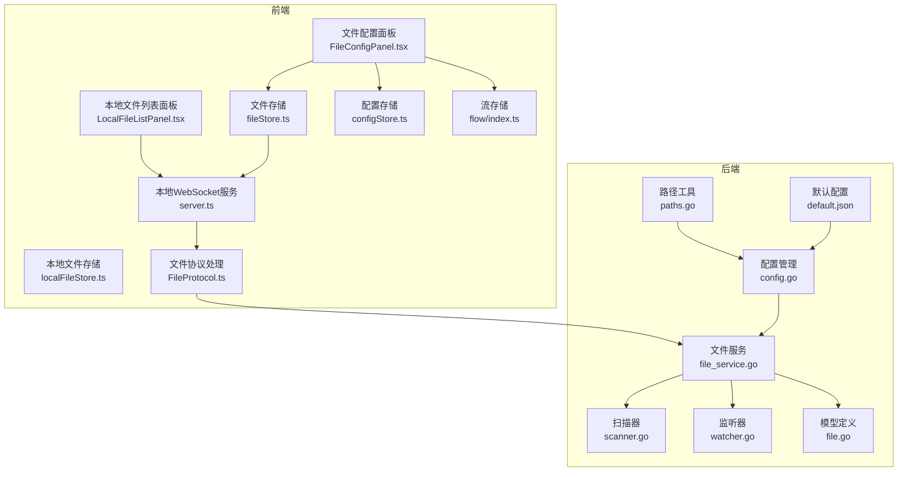
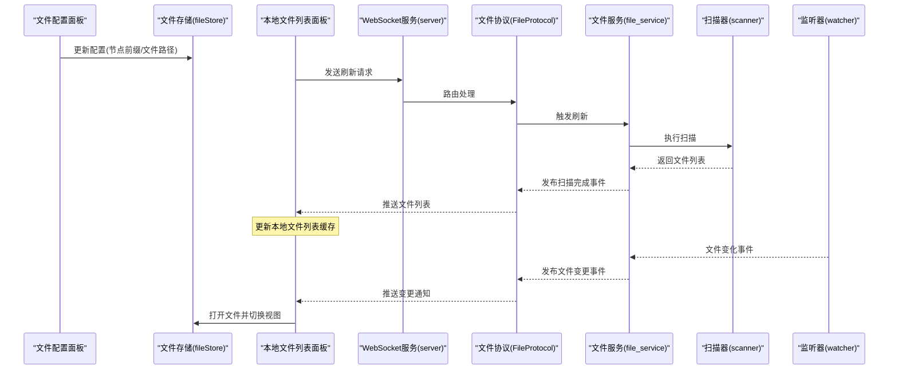
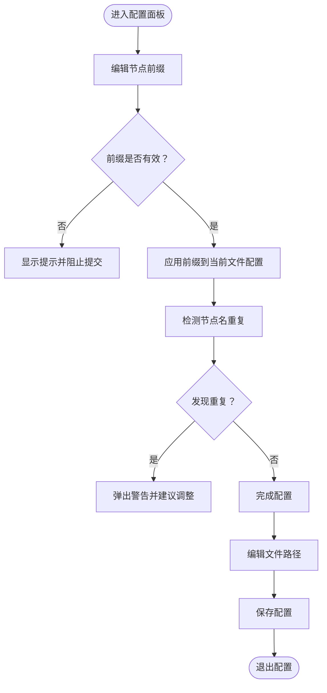
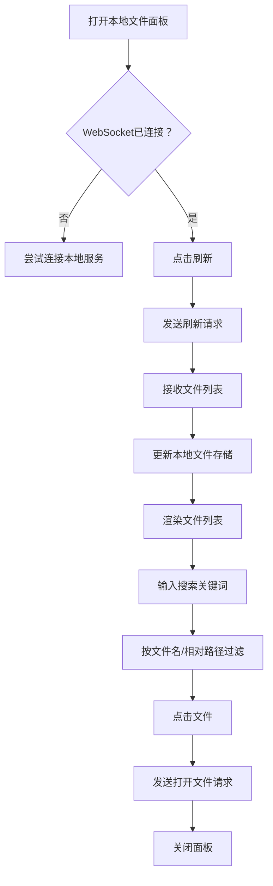
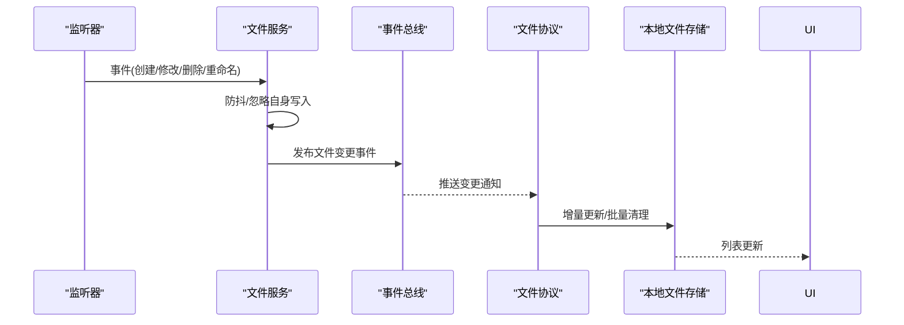
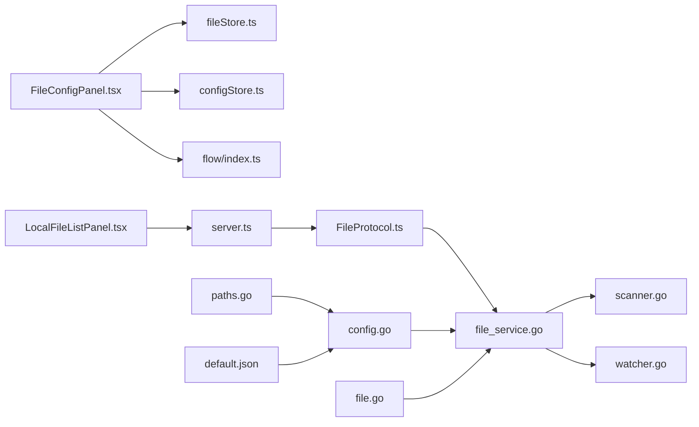

# 文件配置区域

<cite>
**本文档引用的文件**
- [FileConfigPanel.tsx](file://src/components/panels/main/FileConfigPanel.tsx)
- [FileConfigPanel.module.less](file://src/styles/panels/FileConfigPanel.module.less)
- [configStore.ts](file://src/stores/configStore.ts)
- [fileStore.ts](file://src/stores/fileStore.ts)
- [flow/index.ts](file://src/stores/flow/index.ts)
- [file_service.go](file://LocalBridge/internal/service/file/file_service.go)
- [scanner.go](file://LocalBridge/internal/service/file/scanner.go)
- [watcher.go](file://LocalBridge/internal/service/file/watcher.go)
- [config.go](file://LocalBridge/internal/config/config.go)
- [paths.go](file://LocalBridge/internal/paths/paths.go)
- [default.json](file://Extremer/config/default.json)
- [localFileStore.ts](file://src/stores/localFileStore.ts)
- [LocalFileListPanel.tsx](file://src/components/panels/main/LocalFileListPanel.tsx)
- [server.ts](file://src/services/server.ts)
- [FileProtocol.ts](file://src/services/protocols/FileProtocol.ts)
- [file.go](file://LocalBridge/pkg/models/file.go)
</cite>

## 更新摘要
**所做更改**
- 更新了文件配置面板组件：从旧的FileConfigSection替换为新的FileConfigPanel
- 新增了FileConfigPanel的详细文档说明
- 更新了组件架构图以反映新的文件配置面板结构
- 增强了文件配置区域的用户界面设计说明

## 目录
1. [简介](#简介)
2. [项目结构](#项目结构)
3. [核心组件](#核心组件)
4. [架构总览](#架构总览)
5. [详细组件分析](#详细组件分析)
6. [依赖分析](#依赖分析)
7. [性能考虑](#性能考虑)
8. [故障排查指南](#故障排查指南)
9. [结论](#结论)

## 简介
本章节面向"文件配置区域"的功能与实现进行全面说明，涵盖以下方面：
- 文件扫描路径设置：如何配置根目录、排除目录、文件类型与深度/数量限制
- 文件过滤规则配置：扩展名白名单、路径排除、命名模式匹配思路
- 文件监控选项：文件系统监听机制、变化检测、增量更新与批量处理策略
- 本地文件列表管理：文件索引、缓存策略与搜索功能
- 性能优化建议：大文件处理、网络驱动器支持与权限管理策略

**更新** 文件配置区域现已采用新的FileConfigPanel组件，提供更直观的文件级配置界面，替代了之前的FileConfigSection组件。

## 项目结构
文件配置区域涉及前端配置面板、本地文件列表面板、文件服务与扫描器、文件监听器以及协议层等模块。整体采用前后端分离的 WebSocket 通信方式，前端负责展示与交互，后端负责文件扫描、监听与索引维护。



**图表来源**
- [FileConfigPanel.tsx:12-91](file://src/components/panels/main/FileConfigPanel.tsx#L12-L91)
- [configStore.ts:238-250](file://src/stores/configStore.ts#L238-L250)
- [flow/index.ts:76-96](file://src/stores/flow/index.ts#L76-L96)
- [LocalFileListPanel.tsx:20-165](file://src/components/panels/main/LocalFileListPanel.tsx#L20-L165)
- [fileStore.ts:20-38](file://src/stores/fileStore.ts#L20-L38)
- [server.ts:20-200](file://src/services/server.ts#L20-L200)
- [FileProtocol.ts:16-68](file://src/services/protocols/FileProtocol.ts#L16-L68)
- [config.go:54-95](file://LocalBridge/internal/config/config.go#L54-L95)
- [paths.go:192-237](file://LocalBridge/internal/paths/paths.go#L192-L237)
- [default.json:1-33](file://Extremer/config/default.json#L1-L33)
- [file_service.go:37-62](file://LocalBridge/internal/service/file/file_service.go#L37-L62)
- [scanner.go:29-38](file://LocalBridge/internal/service/file/scanner.go#L29-L38)
- [watcher.go:43-59](file://LocalBridge/internal/service/file/watcher.go#L43-L59)
- [file.go:9-29](file://LocalBridge/pkg/models/file.go#L9-L29)

**章节来源**
- [FileConfigPanel.tsx:12-91](file://src/components/panels/main/FileConfigPanel.tsx#L12-L91)
- [configStore.ts:238-250](file://src/stores/configStore.ts#L238-L250)
- [flow/index.ts:76-96](file://src/stores/flow/index.ts#L76-L96)
- [LocalFileListPanel.tsx:20-165](file://src/components/panels/main/LocalFileListPanel.tsx#L20-L165)
- [fileStore.ts:20-38](file://src/stores/fileStore.ts#L20-L38)
- [server.ts:20-200](file://src/services/server.ts#L20-L200)
- [FileProtocol.ts:16-68](file://src/services/protocols/FileProtocol.ts#L16-L68)
- [config.go:54-95](file://LocalBridge/internal/config/config.go#L54-L95)
- [paths.go:192-237](file://LocalBridge/internal/paths/paths.go#L192-L237)
- [default.json:1-33](file://Extremer/config/default.json#L1-L33)
- [file_service.go:37-62](file://LocalBridge/internal/service/file/file_service.go#L37-L62)
- [scanner.go:29-38](file://LocalBridge/internal/service/file/scanner.go#L29-L38)
- [watcher.go:43-59](file://LocalBridge/internal/service/file/watcher.go#L43-L59)
- [file.go:9-29](file://LocalBridge/pkg/models/file.go#L9-L29)

## 核心组件
- 文件配置面板：提供"节点前缀"和"文件路径"的配置入口，支持实时校验与提示，采用新的FileConfigPanel组件实现。
- 本地文件列表面板：展示扫描到的文件，支持搜索、刷新与打开文件。
- 文件服务：负责初始扫描、构建索引、监听文件变化并发布事件。
- 扫描器：根据配置过滤目录与扩展名，支持深度与数量限制。
- 监听器：基于 fsnotify 实现文件系统事件监听，具备防抖与重命名处理。
- 存储层：前端使用 zustand 管理文件与本地文件列表状态，支持增量更新与批量清理。
- 协议层：通过 WebSocket 与后端通信，处理文件列表、内容与变更通知。

**更新** 文件配置面板现已采用FileConfigPanel组件，提供更直观的配置界面和更好的用户体验。

**章节来源**
- [FileConfigPanel.tsx:12-91](file://src/components/panels/main/FileConfigPanel.tsx#L12-L91)
- [LocalFileListPanel.tsx:20-165](file://src/components/panels/main/LocalFileListPanel.tsx#L20-L165)
- [fileStore.ts:20-38](file://src/stores/fileStore.ts#L20-L38)
- [file_service.go:19-62](file://LocalBridge/internal/service/file/file_service.go#L19-L62)
- [scanner.go:20-48](file://LocalBridge/internal/service/file/scanner.go#L20-L48)
- [watcher.go:34-59](file://LocalBridge/internal/service/file/watcher.go#L34-L59)
- [configStore.ts:238-250](file://src/stores/configStore.ts#L238-L250)
- [flow/index.ts:76-96](file://src/stores/flow/index.ts#L76-L96)

## 架构总览
文件配置区域的运行流程如下：
- 前端配置面板读取并更新文件配置（如节点前缀、文件路径），触发校验与提示。
- 本地文件列表面板通过 WebSocket 请求刷新文件列表，后端返回文件清单并更新前端缓存。
- 后端文件服务启动扫描器与监听器，扫描根目录下的文件，构建索引，并对文件系统事件进行处理。
- 文件变更通过协议层推送到前端，前端根据变更类型执行增量更新或批量清理。



**图表来源**
- [FileConfigPanel.tsx:12-91](file://src/components/panels/main/FileConfigPanel.tsx#L12-L91)
- [fileStore.ts:20-38](file://src/stores/fileStore.ts#L20-L38)
- [LocalFileListPanel.tsx:44-72](file://src/components/panels/main/LocalFileListPanel.tsx#L44-L72)
- [server.ts:20-200](file://src/services/server.ts#L20-L200)
- [FileProtocol.ts:44-68](file://src/services/protocols/FileProtocol.ts#L44-L68)
- [file_service.go:64-95](file://LocalBridge/internal/service/file/file_service.go#L64-L95)
- [scanner.go:64-147](file://LocalBridge/internal/service/file/scanner.go#L64-L147)
- [watcher.go:62-92](file://LocalBridge/internal/service/file/watcher.go#L62-L92)

## 详细组件分析

### 文件配置面板
- 功能要点
  - 节点前缀：为所有节点添加统一前缀并使用下划线连接节点名，避免跨文件节点名冲突。
  - 文件路径：设置本地 JSON 文件的完整路径，用于与本地服务通信时标识文件。
  - 实时校验：配置变更时自动检测节点名称重复并提供警告。
- 交互逻辑
  - 输入框绑定到文件配置状态，变更时触发重复节点名检测与提示。
  - 提供气泡提示帮助理解配置含义与使用场景。
  - 支持面板的显示/隐藏控制。



**图表来源**
- [FileConfigPanel.tsx:12-91](file://src/components/panels/main/FileConfigPanel.tsx#L12-L91)
- [flow/index.ts:76-96](file://src/stores/flow/index.ts#L76-L96)

**章节来源**
- [FileConfigPanel.tsx:12-91](file://src/components/panels/main/FileConfigPanel.tsx#L12-L91)
- [flow/index.ts:76-96](file://src/stores/flow/index.ts#L76-L96)

### 本地文件列表面板
- 功能要点
  - 展示根目录下的文件列表，支持按文件名与相对路径搜索。
  - 提供刷新按钮，向后端请求重新扫描并更新列表。
  - 点击文件后通过 WebSocket 打开文件并关闭面板。
- 状态管理
  - 使用本地文件存储管理文件列表、根路径、刷新状态与图片缓存。
  - 支持增量添加、删除、按前缀批量删除与查找。



**图表来源**
- [LocalFileListPanel.tsx:20-165](file://src/components/panels/main/LocalFileListPanel.tsx#L20-L165)
- [localFileStore.ts:129-338](file://src/stores/localFileStore.ts#L129-L338)
- [server.ts:20-200](file://src/services/server.ts#L20-L200)
- [FileProtocol.ts:78-103](file://src/services/protocols/FileProtocol.ts#L78-L103)

**章节来源**
- [LocalFileListPanel.tsx:20-165](file://src/components/panels/main/LocalFileListPanel.tsx#L20-L165)
- [localFileStore.ts:129-338](file://src/stores/localFileStore.ts#L129-L338)
- [server.ts:20-200](file://src/services/server.ts#L20-L200)
- [FileProtocol.ts:78-103](file://src/services/protocols/FileProtocol.ts#L78-L103)

### 文件服务与扫描器
- 文件服务职责
  - 初始化扫描、构建文件索引、发布扫描完成事件。
  - 启动文件监听器，处理文件创建、修改、删除与重命名事件。
  - 提供读取与保存文件的能力，并进行路径安全验证。
- 扫描器过滤规则
  - 排除目录：根据配置的排除列表跳过特定目录。
  - 扩展名过滤：仅接受配置的扩展名集合，同时过滤以"."开头的隐藏配置文件。
  - 深度与数量限制：控制最大扫描深度与文件数量，避免性能问题。

```mermaid
classDiagram
class Service {
+string root
+Scanner scanner
+Watcher watcher
+map~string,File~ fileIndex
+int maxDepth
+int maxFiles
+Start() error
+Stop() void
+GetFileList() []FileInfo
+ReadFile(path) interface{}
+SaveFile(path, content, indent) error
+CreateFile(dir, name, content) string
-validatePath(path) error
-handleFileChange(change) void
}
class Scanner {
+string root
+[]string exclude
+[]string extensions
+int maxDepth
+int maxFiles
+ScanWithLimit() ScanResult
-shouldExcludeDir(name) bool
-hasValidExtension(path) bool
-parseFileNodes(path) (nodes, prefix)
}
class Watcher {
+string root
+[]string extensions
+Start() error
+Stop() void
-processEvent(event) void
-hasValidExtension(path) bool
}
Service --> Scanner : "使用"
Service --> Watcher : "使用"
```

**图表来源**
- [file_service.go:19-62](file://LocalBridge/internal/service/file/file_service.go#L19-L62)
- [scanner.go:20-48](file://LocalBridge/internal/service/file/scanner.go#L20-L48)
- [watcher.go:34-59](file://LocalBridge/internal/service/file/watcher.go#L34-L59)

**章节来源**
- [file_service.go:19-102](file://LocalBridge/internal/service/file/file_service.go#L19-L102)
- [scanner.go:20-174](file://LocalBridge/internal/service/file/scanner.go#L20-L174)
- [watcher.go:34-92](file://LocalBridge/internal/service/file/watcher.go#L34-L92)

### 文件监听与变更处理
- 监听机制
  - 使用 fsnotify 监听根目录及其子目录的文件系统事件。
  - 对创建、修改、删除、重命名事件进行分类处理。
  - 防抖策略：对同一文件的频繁事件进行合并，降低处理压力。
- 自身写入忽略
  - 在保存文件时记录最近写入时间，窗口期内忽略自身触发的修改事件，避免循环处理。
- 变更传播
  - 文件变化通过事件总线发布，前端协议层接收并更新本地文件列表与打开状态。



**图表来源**
- [watcher.go:94-188](file://LocalBridge/internal/service/file/watcher.go#L94-L188)
- [file_service.go:253-343](file://LocalBridge/internal/service/file/file_service.go#L253-L343)
- [FileProtocol.ts:147-200](file://src/services/protocols/FileProtocol.ts#L147-L200)
- [localFileStore.ts:157-202](file://src/stores/localFileStore.ts#L157-L202)

**章节来源**
- [watcher.go:94-188](file://LocalBridge/internal/service/file/watcher.go#L94-L188)
- [file_service.go:253-343](file://LocalBridge/internal/service/file/file_service.go#L253-L343)
- [FileProtocol.ts:147-200](file://src/services/protocols/FileProtocol.ts#L147-L200)
- [localFileStore.ts:157-202](file://src/stores/localFileStore.ts#L157-L202)

### 文件过滤规则配置
- 扩展名白名单：仅接受配置中声明的扩展名，隐藏以"."开头的配置文件。
- 排除目录：扫描过程中跳过配置中的目录列表，避免无关文件干扰。
- 深度与数量限制：通过最大深度与最大文件数限制扫描范围，防止性能问题。
- 命名模式匹配：当前实现基于扩展名与目录排除，未提供正则表达式模式匹配；如需更复杂的匹配，可在扫描器中扩展匹配逻辑。

**章节来源**
- [scanner.go:149-174](file://LocalBridge/internal/service/file/scanner.go#L149-L174)
- [config.go:102-123](file://LocalBridge/internal/config/config.go#L102-L123)
- [default.json:6-17](file://Extremer/config/default.json#L6-L17)

### 本地文件列表管理
- 文件索引：后端扫描器将文件信息转换为内部模型并构建索引，前端通过协议层接收并更新本地存储。
- 缓存策略：前端使用 Map 与 Set 管理图片缓存与请求状态，支持按相对路径查询与去重。
- 搜索功能：支持按文件名与相对路径大小写不敏感搜索，提升查找效率。
- 增量更新：针对单文件增删改提供增量更新接口，批量删除支持按路径前缀清理。

**章节来源**
- [file.go:9-29](file://LocalBridge/pkg/models/file.go#L9-L29)
- [FileProtocol.ts:78-103](file://src/services/protocols/FileProtocol.ts#L78-L103)
- [localFileStore.ts:129-338](file://src/stores/localFileStore.ts#L129-L338)
- [LocalFileListPanel.tsx:30-41](file://src/components/panels/main/LocalFileListPanel.tsx#L30-L41)

## 依赖分析
- 前端依赖
  - 文件配置面板依赖文件存储与提示组件，实现配置输入与校验。
  - 本地文件列表面板依赖 WebSocket 服务与文件协议，实现文件列表刷新与打开。
  - 本地文件存储依赖 zustand 管理状态，提供增删改查与批量清理能力。
- 后端依赖
  - 文件服务依赖扫描器与监听器，结合配置与路径工具实现文件管理。
  - 协议层依赖 WebSocket 客户端，负责消息路由与确认回调。



**图表来源**
- [FileConfigPanel.tsx:12-91](file://src/components/panels/main/FileConfigPanel.tsx#L12-L91)
- [configStore.ts:238-250](file://src/stores/configStore.ts#L238-L250)
- [flow/index.ts:76-96](file://src/stores/flow/index.ts#L76-L96)
- [LocalFileListPanel.tsx:20-165](file://src/components/panels/main/LocalFileListPanel.tsx#L20-L165)
- [fileStore.ts:20-38](file://src/stores/fileStore.ts#L20-L38)
- [server.ts:20-200](file://src/services/server.ts#L20-L200)
- [FileProtocol.ts:16-68](file://src/services/protocols/FileProtocol.ts#L16-L68)
- [file_service.go:37-62](file://LocalBridge/internal/service/file/file_service.go#L37-L62)
- [scanner.go:29-38](file://LocalBridge/internal/service/file/scanner.go#L29-L38)
- [watcher.go:43-59](file://LocalBridge/internal/service/file/watcher.go#L43-L59)
- [config.go:54-95](file://LocalBridge/internal/config/config.go#L54-L95)
- [paths.go:192-237](file://LocalBridge/internal/paths/paths.go#L192-L237)
- [default.json:1-33](file://Extremer/config/default.json#L1-L33)
- [file.go:9-29](file://LocalBridge/pkg/models/file.go#L9-L29)

**章节来源**
- [FileConfigPanel.tsx:12-91](file://src/components/panels/main/FileConfigPanel.tsx#L12-L91)
- [configStore.ts:238-250](file://src/stores/configStore.ts#L238-L250)
- [flow/index.ts:76-96](file://src/stores/flow/index.ts#L76-L96)
- [LocalFileListPanel.tsx:20-165](file://src/components/panels/main/LocalFileListPanel.tsx#L20-L165)
- [fileStore.ts:20-38](file://src/stores/fileStore.ts#L20-L38)
- [server.ts:20-200](file://src/services/server.ts#L20-L200)
- [FileProtocol.ts:16-68](file://src/services/protocols/FileProtocol.ts#L16-L68)
- [file_service.go:37-62](file://LocalBridge/internal/service/file/file_service.go#L37-L62)
- [scanner.go:29-38](file://LocalBridge/internal/service/file/scanner.go#L29-L38)
- [watcher.go:43-59](file://LocalBridge/internal/service/file/watcher.go#L43-L59)
- [config.go:54-95](file://LocalBridge/internal/config/config.go#L54-L95)
- [paths.go:192-237](file://LocalBridge/internal/paths/paths.go#L192-L237)
- [default.json:1-33](file://Extremer/config/default.json#L1-L33)
- [file.go:9-29](file://LocalBridge/pkg/models/file.go#L9-L29)

## 性能考虑
- 大文件处理
  - 读取与保存采用分块序列化与写入，避免一次性占用过多内存。
  - 保存时记录最近写入时间，窗口期内忽略自身写入事件，减少重复处理。
- 网络驱动器支持
  - 扫描器对访问错误的目录/文件进行忽略并继续遍历，提高稳定性。
  - 监听器对目录新增自动加入监听，保证网络挂载目录的动态性。
- 权限管理策略
  - 路径安全验证：仅允许在根目录范围内访问，防止越权访问。
  - 读取与保存均进行权限检查，失败时返回明确错误信息。
- 配置优化建议
  - 合理设置最大扫描深度与文件数量，避免大规模目录导致性能下降。
  - 使用合适的扩展名白名单，减少无关文件的处理负担。
  - 对频繁写入的文件启用防抖，降低事件风暴影响。

**章节来源**
- [file_service.go:122-201](file://LocalBridge/internal/service/file/file_service.go#L122-L201)
- [scanner.go:74-147](file://LocalBridge/internal/service/file/scanner.go#L74-L147)
- [watcher.go:113-188](file://LocalBridge/internal/service/file/watcher.go#L113-L188)
- [config.go:102-123](file://LocalBridge/internal/config/config.go#L102-L123)

## 故障排查指南
- 连接问题
  - WebSocket 连接超时或失败：检查本地服务是否启动、端口是否正确、防火墙设置。
  - 协议版本不匹配：前端与后端协议版本不一致，需按提示升级。
- 文件列表异常
  - 刷新后列表为空：确认根目录配置正确且可访问，检查排除规则是否过于严格。
  - 文件未显示：检查扩展名白名单与深度限制，确认文件路径在根目录范围内。
- 文件变更未生效
  - 修改事件被忽略：检查是否为自身写入且处于忽略窗口内。
  - 监听器未启动：确认监听器已成功启动并加入所有子目录。
- 保存失败
  - 路径越权：确保文件路径在根目录范围内。
  - 写入权限不足：检查目标路径的写入权限与磁盘空间。

**章节来源**
- [server.ts:104-200](file://src/services/server.ts#L104-L200)
- [FileProtocol.ts:147-200](file://src/services/protocols/FileProtocol.ts#L147-L200)
- [file_service.go:345-359](file://LocalBridge/internal/service/file/file_service.go#L345-L359)

## 结论
文件配置区域通过清晰的前后端分工与完善的文件管理机制，实现了灵活的扫描路径设置、严格的过滤规则与高效的文件监听。前端提供直观的配置与列表操作体验，后端保障扫描、监听与权限的安全性与稳定性。结合合理的性能优化与故障排查策略，能够满足复杂工程中的文件管理需求。

**更新** 新的FileConfigPanel组件提供了更直观的用户界面和更好的交互体验，替代了之前的FileConfigSection组件，提升了文件配置的易用性和效率。