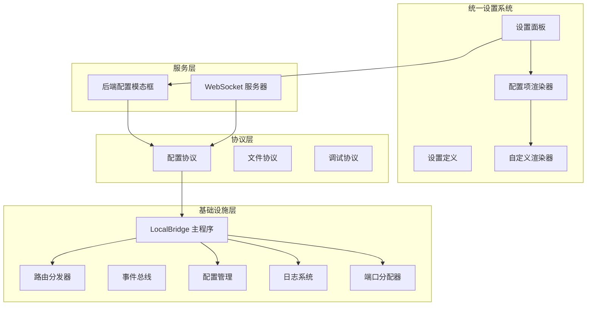
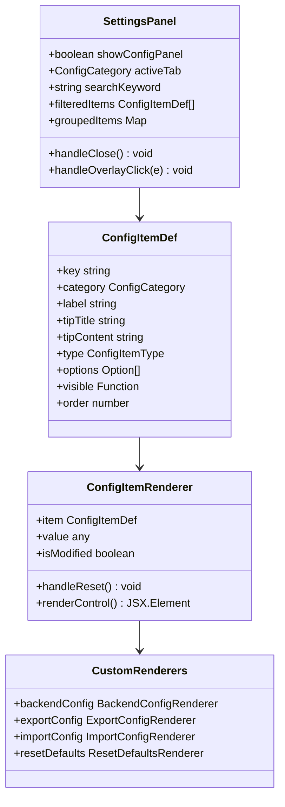
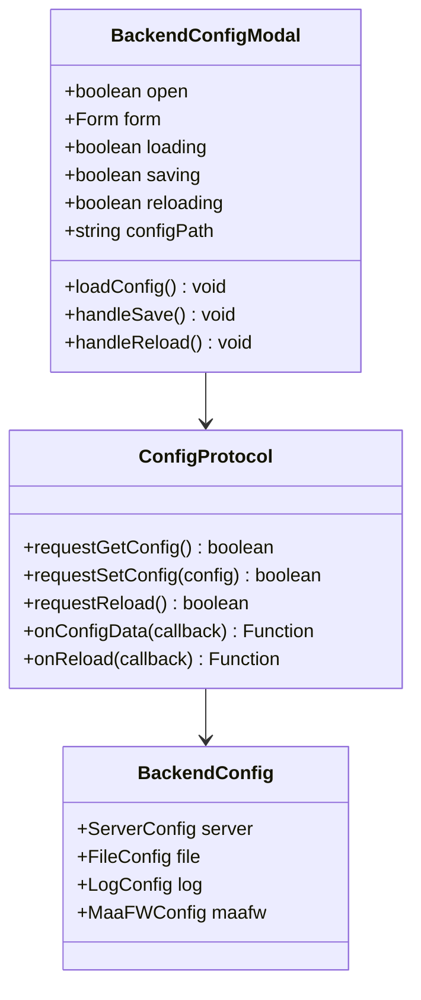
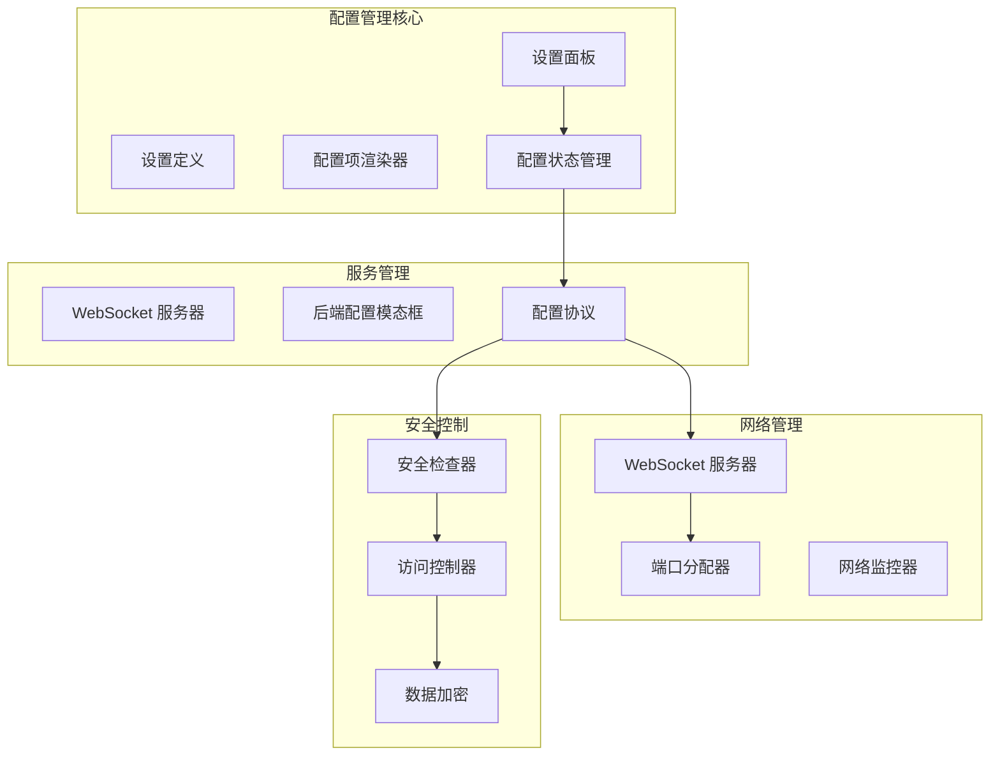
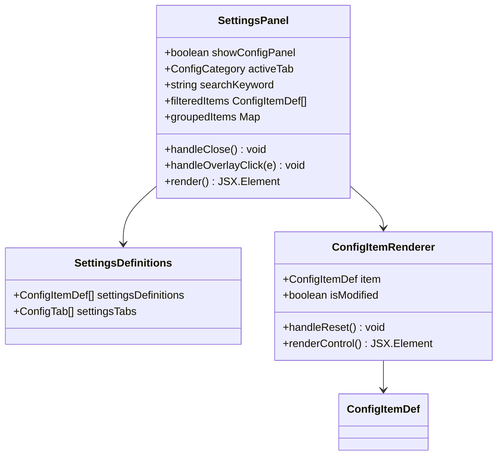
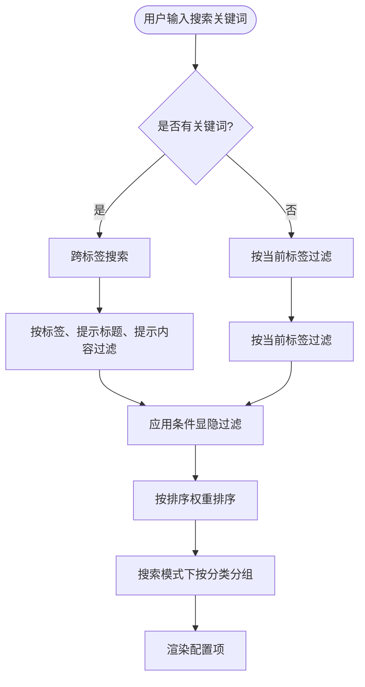
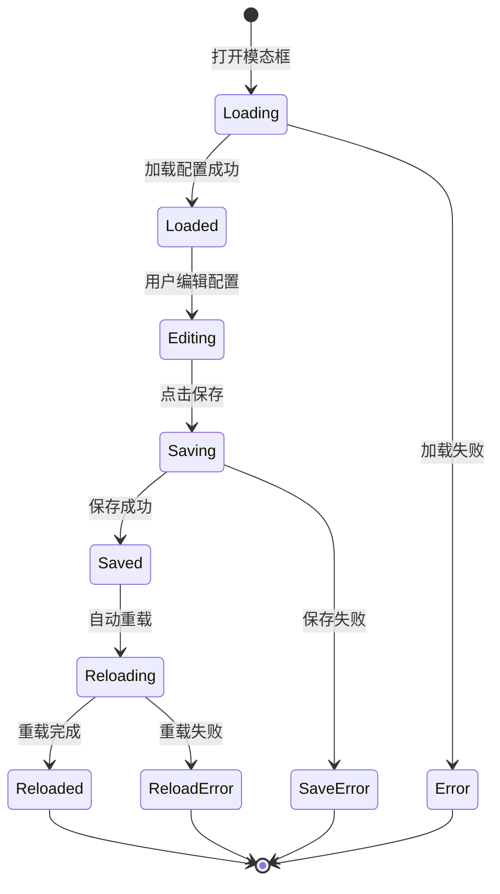
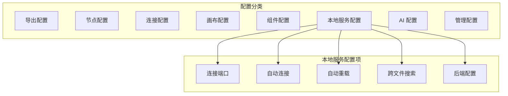
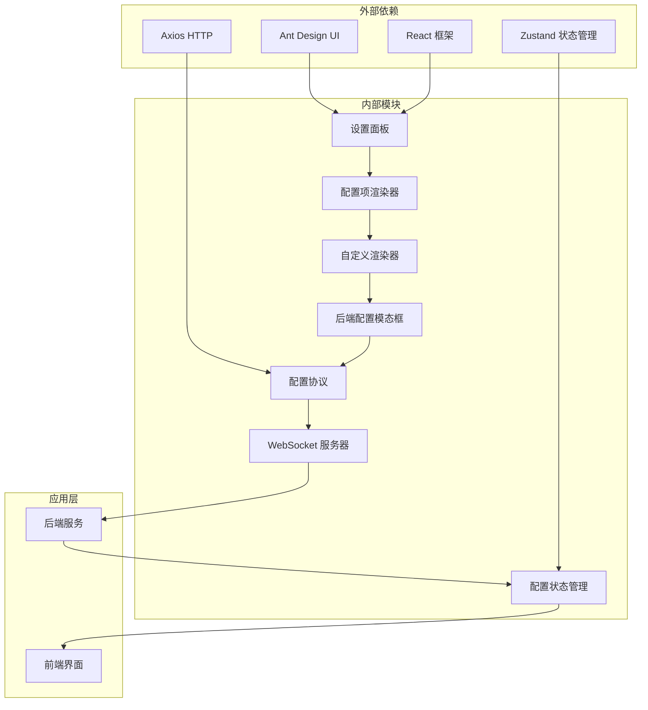

# 本地服务配置区域

<cite>
**本文档引用的文件**
- [LocalBridge 配置定义](file://LocalBridge/internal/config/config.go)
- [默认配置文件](file://LocalBridge/config/default.json)
- [WebSocket 服务器](file://LocalBridge/internal/server/websocket.go)
- [WebSocket 连接管理](file://LocalBridge/internal/server/connection.go)
- [事件总线](file://LocalBridge/internal/eventbus/eventbus.go)
- [端口分配器](file://Extremer/internal/ports/allocator.go)
- [LocalBridge 主程序](file://LocalBridge/cmd/lb/main.go)
- [路由分发器](file://LocalBridge/internal/router/router.go)
- [设置面板](file://src/components/panels/settings/SettingsPanel.tsx)
- [设置定义](file://src/components/panels/settings/settingsDefinitions.ts)
- [配置项渲染器](file://src/components/panels/settings/ConfigItemRenderer.tsx)
- [自定义渲染器](file://src/components/panels/settings/customRenderers.tsx)
- [后端配置模态框](file://src/components/modals/BackendConfigModal.tsx)
- [配置协议](file://src/services/protocols/ConfigProtocol.ts)
- [WebSocket 服务](file://src/services/server.ts)
- [配置状态管理](file://src/stores/configStore.ts)
- [进阶配置文档](file://docsite/docs/01.指南/20.本地服务/100.进阶配置.md)
- [本地服务部署文档](file://docsite/docs/01.指南/20.本地服务/01.概览与部署.md)
</cite>

## 更新摘要
**变更内容**
- 重构本地服务配置区域架构，从独立的 LocalServiceSection 组件迁移到统一设置系统
- 新增 SettingsPanel 作为中央配置管理界面，集成所有配置项
- 引入 BackendConfigModal 提供后端服务配置的图形化界面
- 更新配置分类系统，新增 "local-service" 分类
- 优化配置项渲染机制，支持自定义渲染器
- 增强配置搜索和分组功能

## 目录
1. [简介](#简介)
2. [项目结构](#项目结构)
3. [核心组件](#核心组件)
4. [架构概览](#架构概览)
5. [详细组件分析](#详细组件分析)
6. [依赖关系分析](#依赖关系分析)
7. [性能考虑](#性能考虑)
8. [故障排除指南](#故障排除指南)
9. [结论](#结论)

## 简介

本地服务配置区域是 MaaPipelineEditor 本地服务系统的核心配置管理模块。该系统经过重构，现在采用统一设置系统架构，提供了完整的本地服务配置、WebSocket 连接管理和安全控制功能，支持后端服务连接配置、WebSocket 端口设置和网络参数调整。

本地服务配置区域主要包含以下功能：
- **统一设置面板**：集成所有配置项的中央管理界面
- **后端服务连接配置**：通过 BackendConfigModal 提供图形化配置界面
- **WebSocket 端口设置**：支持动态端口配置和自动连接
- **文件扫描配置**：根目录、排除规则、文件类型设置
- **日志系统配置**：级别、输出目录、推送设置
- **MaaFramework 集成配置**：库目录、资源目录设置
- **配置热重载**：支持配置动态更新和自动重载
- **安全检查**：风险评估和访问控制

## 项目结构

本地服务配置区域采用重构后的统一设置系统架构，主要分为以下几个层次：

**图表来源**
- [设置面板:35-176](file://src/components/panels/settings/SettingsPanel.tsx#L35-L176)
- [设置定义:62-619](file://src/components/panels/settings/settingsDefinitions.ts#L62-L619)
- [配置协议:46-197](file://src/services/protocols/ConfigProtocol.ts#L46-L197)

**章节来源**
- [设置面板:1-176](file://src/components/panels/settings/SettingsPanel.tsx#L1-L176)
- [设置定义:1-619](file://src/components/panels/settings/settingsDefinitions.ts#L1-L619)
- [配置协议:1-197](file://src/services/protocols/ConfigProtocol.ts#L1-L197)

## 核心组件

### 统一设置系统

重构后的统一设置系统采用声明式配置定义和自定义渲染器机制：

**图表来源**
- [设置面板:35-176](file://src/components/panels/settings/SettingsPanel.tsx#L35-L176)
- [设置定义:16-59](file://src/components/panels/settings/settingsDefinitions.ts#L16-L59)
- [配置项渲染器:23-254](file://src/components/panels/settings/ConfigItemRenderer.tsx#L23-L254)

### 后端配置管理系统

后端配置管理系统通过 BackendConfigModal 提供完整的图形化配置界面：

**图表来源**
- [后端配置模态框:38-473](file://src/components/modals/BackendConfigModal.tsx#L38-L473)
- [配置协议:46-197](file://src/services/protocols/ConfigProtocol.ts#L46-L197)

**章节来源**
- [设置面板:1-176](file://src/components/panels/settings/SettingsPanel.tsx#L1-L176)
- [设置定义:444-501](file://src/components/panels/settings/settingsDefinitions.ts#L444-L501)
- [配置项渲染器:1-254](file://src/components/panels/settings/ConfigItemRenderer.tsx#L1-L254)
- [自定义渲染器:69-105](file://src/components/panels/settings/customRenderers.tsx#L69-L105)

## 架构概览

本地服务配置区域采用模块化设计，重构后的架构更加统一和灵活：

**图表来源**
- [设置面板:35-176](file://src/components/panels/settings/SettingsPanel.tsx#L35-L176)
- [配置协议:46-197](file://src/services/protocols/ConfigProtocol.ts#L46-L197)
- [配置状态管理:252-355](file://src/stores/configStore.ts#L252-L355)

## 详细组件分析

### 设置面板组件

重构后的设置面板提供统一的配置管理界面：

**图表来源**
- [设置面板:35-176](file://src/components/panels/settings/SettingsPanel.tsx#L35-L176)
- [设置定义:62-619](file://src/components/panels/settings/settingsDefinitions.ts#L62-L619)

### 配置搜索和过滤系统

新的搜索系统支持跨标签搜索和条件过滤：

**图表来源**
- [设置面板:59-94](file://src/components/panels/settings/SettingsPanel.tsx#L59-L94)

### 后端配置模态框

后端配置模态框提供完整的图形化配置界面：

**图表来源**
- [后端配置模态框:46-127](file://src/components/modals/BackendConfigModal.tsx#L46-L127)

**章节来源**
- [设置面板:1-176](file://src/components/panels/settings/SettingsPanel.tsx#L1-L176)
- [设置定义:444-501](file://src/components/panels/settings/settingsDefinitions.ts#L444-L501)
- [配置项渲染器:1-254](file://src/components/panels/settings/ConfigItemRenderer.tsx#L1-L254)
- [后端配置模态框:1-473](file://src/components/modals/BackendConfigModal.tsx#L1-L473)

### 配置分类系统

重构后的配置分类系统支持更精细的配置组织：

**图表来源**
- [设置定义:604-619](file://src/components/panels/settings/settingsDefinitions.ts#L604-L619)
- [配置状态管理:32-77](file://src/stores/configStore.ts#L32-L77)

**章节来源**
- [设置定义:444-501](file://src/components/panels/settings/settingsDefinitions.ts#L444-L501)
- [配置状态管理:32-77](file://src/stores/configStore.ts#L32-L77)

## 依赖关系分析

重构后的依赖关系更加清晰和模块化：

**图表来源**
- [设置面板:1-22](file://src/components/panels/settings/SettingsPanel.tsx#L1-L22)
- [配置协议:1-197](file://src/services/protocols/ConfigProtocol.ts#L1-L197)

**章节来源**
- [设置面板:1-176](file://src/components/panels/settings/SettingsPanel.tsx#L1-L176)
- [配置协议:1-197](file://src/services/protocols/ConfigProtocol.ts#L1-L197)

## 性能考虑

重构后的本地服务配置区域在性能方面进行了多项优化：

### 智能搜索和过滤
- **跨标签搜索**：支持在所有配置项中进行关键词搜索
- **条件显隐过滤**：根据当前配置状态动态显示相关配置项
- **分组显示**：搜索模式下按配置分类进行分组显示

### 渲染优化
- **Memo 化组件**：使用 React.memo 优化组件重渲染
- **延迟加载**：配置项按需渲染，减少初始渲染压力
- **虚拟滚动**：支持大量配置项的高效显示

### 状态管理优化
- **局部状态**：每个配置项维护自己的状态，避免全局重渲染
- **批量更新**：支持配置项的批量更新和同步
- **默认值追踪**：智能追踪配置项的修改状态

## 故障排除指南

### 设置面板问题

#### 设置面板无法打开
**症状**: 点击设置按钮无反应
**解决方案**:
1. 检查 `showConfigPanel` 状态是否正确设置
2. 验证设置面板的 CSS 样式是否正确加载
3. 检查父组件的状态传递是否正常

#### 配置项渲染异常
**症状**: 配置项显示不正确或无法编辑
**解决方案**:
1. 检查配置项定义是否正确
2. 验证自定义渲染器是否正确注册
3. 确认配置状态管理器的数据结构

### 后端配置问题

#### 后端配置模态框无法打开
**症状**: 点击后端配置按钮无响应
**解决方案**:
1. 检查 WebSocket 连接状态
2. 验证 `isConnected()` 方法的返回值
3. 确认配置协议是否正确初始化

#### 配置保存失败
**症状**: 保存配置后无响应或显示错误
**解决方案**:
1. 检查表单验证是否通过
2. 验证配置协议的请求是否成功发送
3. 查看控制台错误信息

### WebSocket 连接问题

#### 连接超时
**症状**: 设置面板显示连接超时错误
**解决方案**:
1. 检查本地服务是否正常启动
2. 验证端口号配置是否正确
3. 确认防火墙设置允许连接

#### 协议版本不匹配
**症状**: 显示协议版本不兼容错误
**解决方案**:
1. 检查前端和后端的协议版本
2. 更新到兼容的版本组合
3. 重新安装本地服务

### 配置搜索问题

#### 搜索结果不准确
**症状**: 搜索不到预期的配置项
**解决方案**:
1. 检查搜索关键词的准确性
2. 验证配置项的标签和提示内容
3. 确认搜索功能的过滤逻辑

#### 分组显示异常
**症状**: 搜索结果按分类分组显示不正确
**解决方案**:
1. 检查配置项的分类设置
2. 验证分组逻辑的实现
3. 确认配置状态的正确性

**章节来源**
- [设置面板:1-176](file://src/components/panels/settings/SettingsPanel.tsx#L1-L176)
- [后端配置模态框:1-473](file://src/components/modals/BackendConfigModal.tsx#L1-L473)
- [配置协议:1-197](file://src/services/protocols/ConfigProtocol.ts#L1-L197)

## 结论

重构后的本地服务配置区域是一个功能完整、设计合理的统一配置管理系统。主要改进包括：

1. **统一设置系统**：从独立组件迁移到统一设置面板，提供更好的用户体验
2. **图形化配置界面**：通过 BackendConfigModal 提供直观的后端配置界面
3. **智能搜索功能**：支持跨标签搜索和条件过滤
4. **模块化架构**：清晰的组件分离和依赖关系
5. **性能优化**：智能渲染和状态管理优化
6. **扩展性增强**：支持自定义渲染器和配置项定义

该系统采用现代化的 React 架构，具有良好的可维护性和扩展性。通过合理的组件设计和状态管理，为用户提供稳定可靠的本地服务配置体验。

未来可以考虑的改进方向包括：
- 增加配置导入导出的批量操作
- 优化大型配置集的性能表现
- 扩展更多自定义渲染器类型
- 增强配置项的可视化编辑功能
- 提供配置模板和预设功能