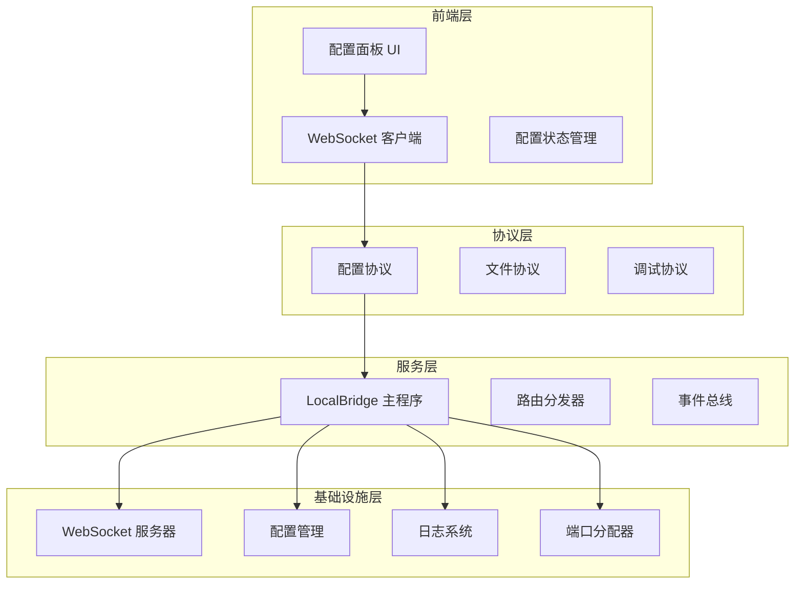
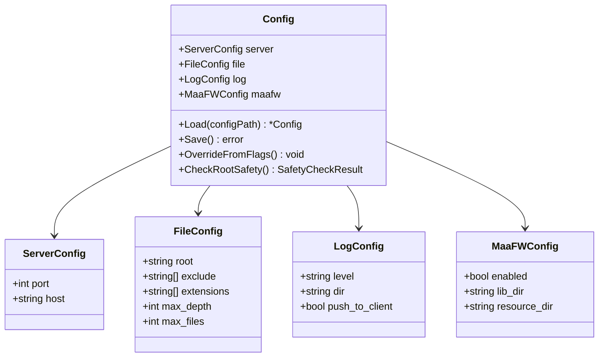
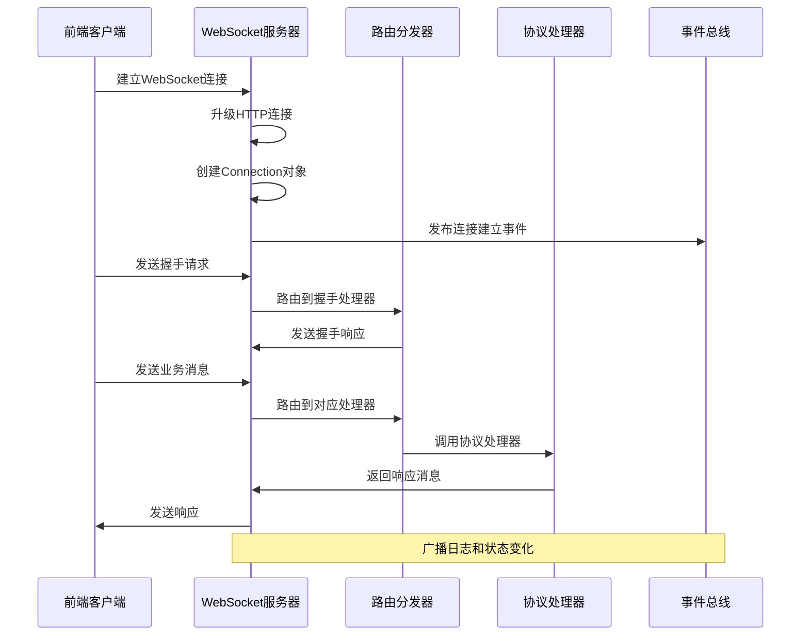
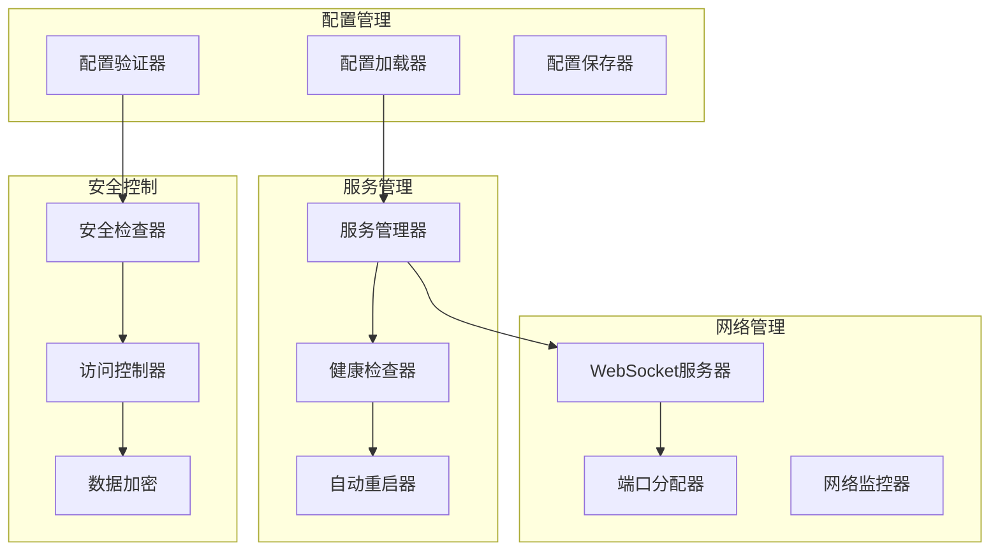
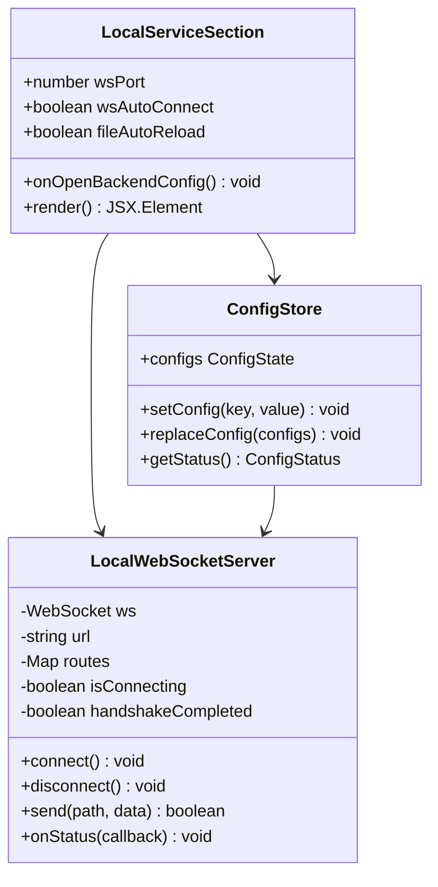
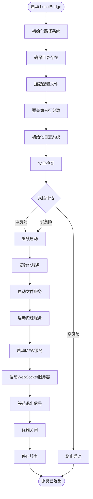
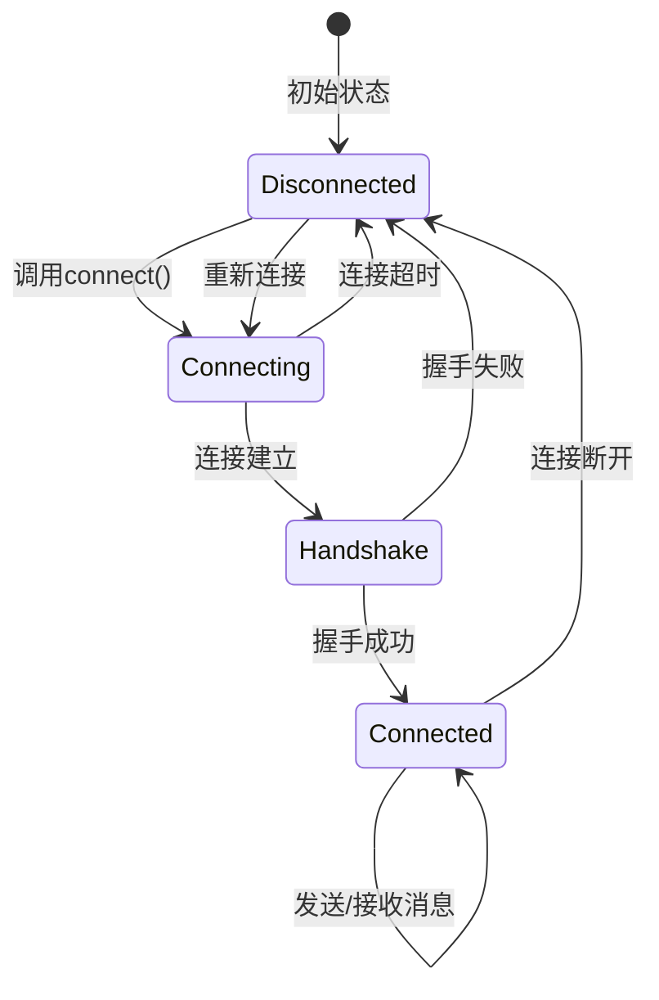
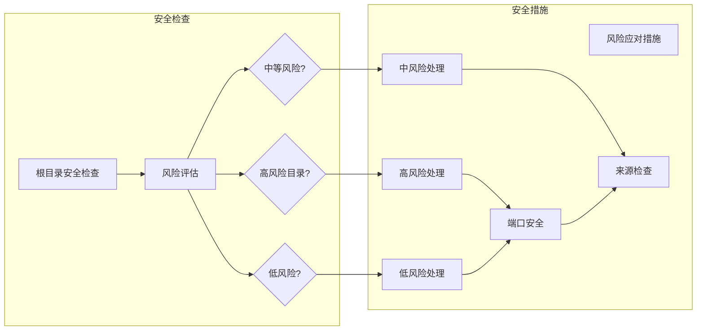
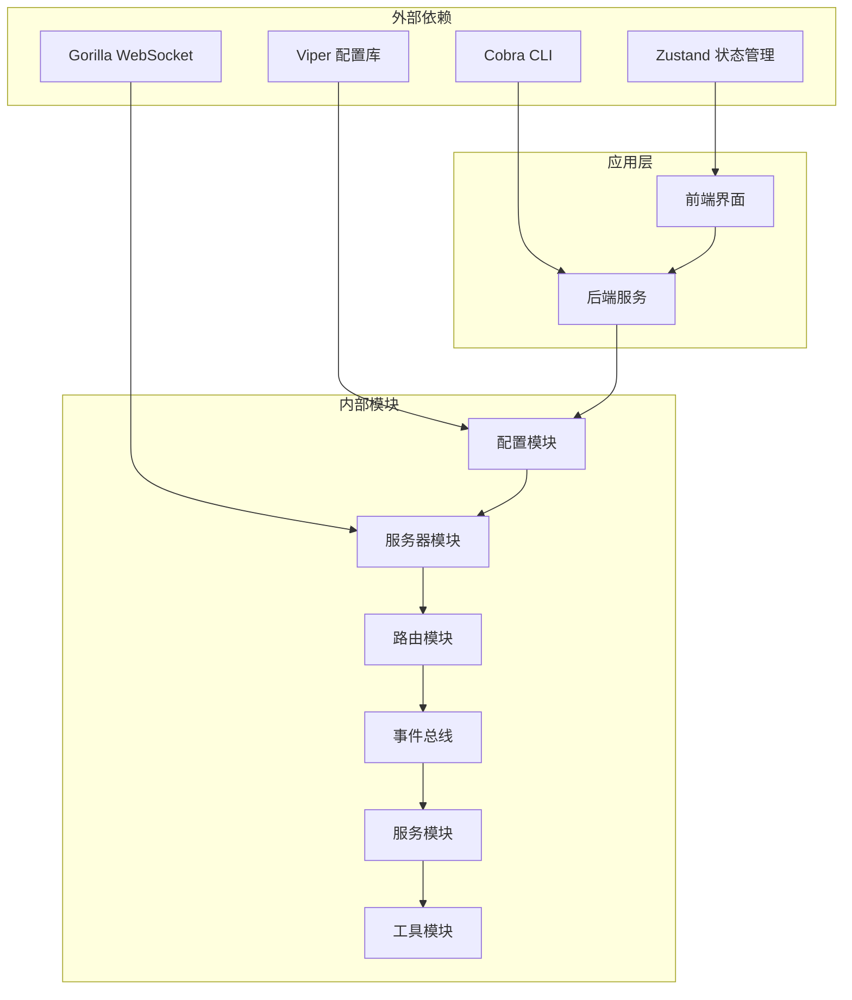

# 本地服务配置区域

<cite>
**本文档引用的文件**
- [LocalBridge 配置定义](file://LocalBridge/internal/config/config.go)
- [默认配置文件](file://LocalBridge/config/default.json)
- [WebSocket 服务器](file://LocalBridge/internal/server/websocket.go)
- [WebSocket 连接管理](file://LocalBridge/internal/server/connection.go)
- [事件总线](file://LocalBridge/internal/eventbus/eventbus.go)
- [端口分配器](file://Extremer/internal/ports/allocator.go)
- [LocalBridge 主程序](file://LocalBridge/cmd/lb/main.go)
- [路由分发器](file://LocalBridge/internal/router/router.go)
- [本地服务配置面板](file://src/components/panels/config/LocalServiceSection.tsx)
- [前端 WebSocket 服务](file://src/services/server.ts)
- [配置协议](file://src/services/protocols/ConfigProtocol.ts)
- [配置状态管理](file://src/stores/configStore.ts)
- [进阶配置文档](file://docsite/docs/01.指南/20.本地服务/100.进阶配置.md)
- [本地服务部署文档](file://docsite/docs/01.指南/20.本地服务/01.概览与部署.md)
</cite>

## 目录
1. [简介](#简介)
2. [项目结构](#项目结构)
3. [核心组件](#核心组件)
4. [架构概览](#架构概览)
5. [详细组件分析](#详细组件分析)
6. [依赖关系分析](#依赖关系分析)
7. [性能考虑](#性能考虑)
8. [故障排除指南](#故障排除指南)
9. [结论](#结论)

## 简介

本地服务配置区域是 MaaPipelineEditor 本地服务系统的核心配置管理模块。该系统提供了完整的本地服务配置、WebSocket 连接管理和安全控制功能，支持后端服务连接配置、WebSocket 端口设置和网络参数调整。

本地服务配置区域主要包含以下功能：
- 后端服务连接配置管理
- WebSocket 端口设置和网络参数调整
- 文件扫描配置（根目录、排除规则、文件类型）
- 日志系统配置（级别、输出目录、推送设置）
- MaaFramework 集成配置（库目录、资源目录）
- 安全性检查和风险评估
- 配置热重载和自动更新检测

## 项目结构

本地服务配置区域采用分层架构设计，主要分为以下几个层次：

**图表来源**
- [LocalBridge 配置定义:43-48](file://LocalBridge/internal/config/config.go#L43-L48)
- [LocalBridge 主程序:183-440](file://LocalBridge/cmd/lb/main.go#L183-L440)
- [前端 WebSocket 服务:20-333](file://src/services/server.ts#L20-L333)

**章节来源**
- [LocalBridge 配置定义:1-339](file://LocalBridge/internal/config/config.go#L1-L339)
- [LocalBridge 主程序:1-882](file://LocalBridge/cmd/lb/main.go#L1-L882)

## 核心组件

### 配置管理系统

配置管理系统采用 Viper 库实现，支持多种配置源和动态重载：

**图表来源**
- [LocalBridge 配置定义:14-48](file://LocalBridge/internal/config/config.go#L14-L48)

### WebSocket 通信系统

WebSocket 通信系统提供实时双向通信能力，支持连接管理、消息路由和事件广播：

**图表来源**
- [WebSocket 服务器:66-93](file://LocalBridge/internal/server/websocket.go#L66-L93)
- [路由分发器:50-76](file://LocalBridge/internal/router/router.go#L50-L76)

**章节来源**
- [WebSocket 服务器:1-179](file://LocalBridge/internal/server/websocket.go#L1-L179)
- [WebSocket 连接管理:1-96](file://LocalBridge/internal/server/connection.go#L1-L96)
- [路由分发器:1-151](file://LocalBridge/internal/router/router.go#L1-L151)

## 架构概览

本地服务配置区域采用模块化设计，各组件职责清晰，耦合度低：

**图表来源**
- [LocalBridge 主程序:222-254](file://LocalBridge/cmd/lb/main.go#L222-L254)
- [端口分配器:17-40](file://Extremer/internal/ports/allocator.go#L17-L40)

## 详细组件分析

### 配置面板组件

配置面板组件提供用户友好的图形界面来管理本地服务配置：

**图表来源**
- [本地服务配置面板:15-144](file://src/components/panels/config/LocalServiceSection.tsx#L15-L144)
- [配置状态管理:95-161](file://src/stores/configStore.ts#L95-L161)

### 后端服务启动机制

后端服务启动机制包含完整的生命周期管理：

**图表来源**
- [LocalBridge 主程序:183-440](file://LocalBridge/cmd/lb/main.go#L183-L440)

### WebSocket 连接管理

WebSocket 连接管理提供完整的连接生命周期控制：

**图表来源**
- [前端 WebSocket 服务:105-251](file://src/services/server.ts#L105-L251)

**章节来源**
- [本地服务配置面板:1-144](file://src/components/panels/config/LocalServiceSection.tsx#L1-L144)
- [前端 WebSocket 服务:1-373](file://src/services/server.ts#L1-L373)
- [配置状态管理:1-268](file://src/stores/configStore.ts#L1-L268)

### 安全配置系统

安全配置系统提供多层次的安全保护机制：

**图表来源**
- [LocalBridge 配置定义:235-296](file://LocalBridge/internal/config/config.go#L235-L296)

**章节来源**
- [LocalBridge 配置定义:234-338](file://LocalBridge/internal/config/config.go#L234-L338)

## 依赖关系分析

本地服务配置区域的依赖关系呈现清晰的分层结构：

**图表来源**
- [LocalBridge 主程序:3-35](file://LocalBridge/cmd/lb/main.go#L3-L35)
- [前端 WebSocket 服务:1-17](file://src/services/server.ts#L1-L17)

**章节来源**
- [LocalBridge 主程序:1-882](file://LocalBridge/cmd/lb/main.go#L1-L882)
- [前端 WebSocket 服务:1-373](file://src/services/server.ts#L1-L373)

## 性能考虑

本地服务配置区域在设计时充分考虑了性能优化：

### 连接池管理
- WebSocket 连接采用 goroutine 管理，支持并发处理
- 消息队列缓冲区大小适中，避免内存泄漏
- 连接注册和注销使用互斥锁保证线程安全

### 配置缓存机制
- 配置文件采用内存缓存，减少磁盘 I/O
- 支持配置热重载，避免服务重启
- Viper 库提供高效的配置解析和序列化

### 资源优化
- 文件扫描使用限制参数（最大深度、最大文件数）
- 日志系统支持异步写入，减少阻塞
- 端口分配器使用高效算法查找可用端口

## 故障排除指南

### 常见连接问题

#### 端口冲突问题
**症状**: 启动时出现端口占用错误
**解决方案**:
1. 使用端口分配器查找可用端口
2. 修改配置文件中的端口号
3. 检查系统中是否有其他进程占用端口

#### 连接超时问题
**症状**: 前端显示连接超时错误
**解决方案**:
1. 检查 LocalBridge 服务是否正常启动
2. 验证端口号配置是否正确
3. 检查防火墙设置是否允许连接

#### 协议版本不匹配
**症状**: 握手失败，显示版本不兼容
**解决方案**:
1. 更新前端或后端到兼容版本
2. 检查协议版本配置
3. 重新安装本地服务

### 配置文件问题

#### 配置文件损坏
**症状**: 配置加载失败或默认值生效
**解决方案**:
1. 备份当前配置文件
2. 删除损坏的配置文件
3. 重新生成默认配置文件
4. 逐步恢复配置项

#### 权限问题
**症状**: 无法保存配置或访问受限
**解决方案**:
1. 检查配置文件所在目录权限
2. 以管理员权限运行程序
3. 更改配置文件存储位置

### 性能问题

#### 高 CPU 使用率
**症状**: 本地服务占用大量 CPU 资源
**解决方案**:
1. 检查文件扫描范围是否过大
2. 减少日志级别或关闭日志推送
3. 优化配置文件中的扫描参数

#### 内存泄漏
**症状**: 内存使用持续增长
**解决方案**:
1. 检查 WebSocket 连接是否正确关闭
2. 验证消息队列是否及时清理
3. 更新到最新版本修复已知问题

### 网络配置问题

#### 防火墙阻止连接
**症状**: 本地服务无法被前端访问
**解决方案**:
1. 在防火墙中添加例外规则
2. 检查 Windows Defender 防火墙设置
3. 验证端口是否在允许列表中

#### 网络隔离问题
**症状**: 局域网内无法连接本地服务
**解决方案**:
1. 修改配置文件中的监听地址
2. 使用 0.0.0.0 监听所有网络接口
3. 配置路由器端口转发

**章节来源**
- [进阶配置文档:1-123](file://docsite/docs/01.指南/20.本地服务/100.进阶配置.md#L1-L123)
- [本地服务部署文档:241-273](file://docsite/docs/01.指南/20.本地服务/01.概览与部署.md#L241-L273)

## 结论

本地服务配置区域是一个功能完整、设计合理的本地服务管理系统。它提供了：

1. **完整的配置管理**: 支持多种配置源、动态重载和安全检查
2. **可靠的通信机制**: 基于 WebSocket 的实时双向通信
3. **灵活的服务管理**: 支持服务启动、停止和健康检查
4. **强大的安全控制**: 多层次的安全检查和访问控制
5. **良好的用户体验**: 图形化配置界面和详细的错误提示

该系统采用模块化设计，具有良好的扩展性和维护性。通过合理的架构设计和完善的错误处理机制，为用户提供稳定可靠的本地服务配置体验。

未来可以考虑的改进方向包括：
- 增加更多的安全认证机制
- 优化性能监控和诊断功能
- 扩展更多协议支持
- 增强配置导入导出功能
- 提供更丰富的故障诊断工具