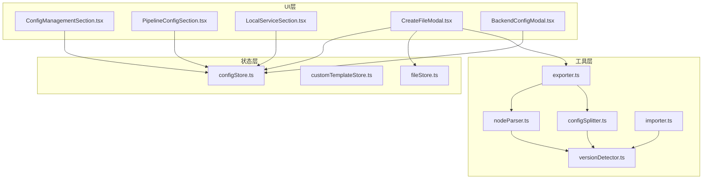
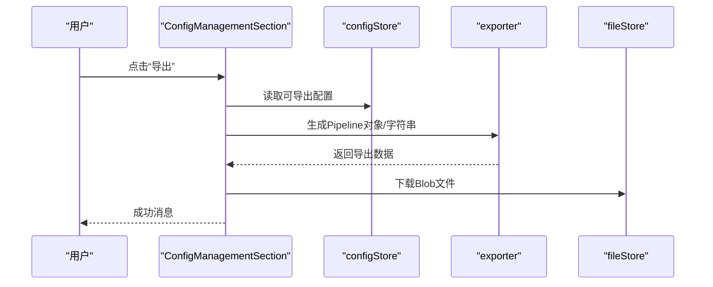
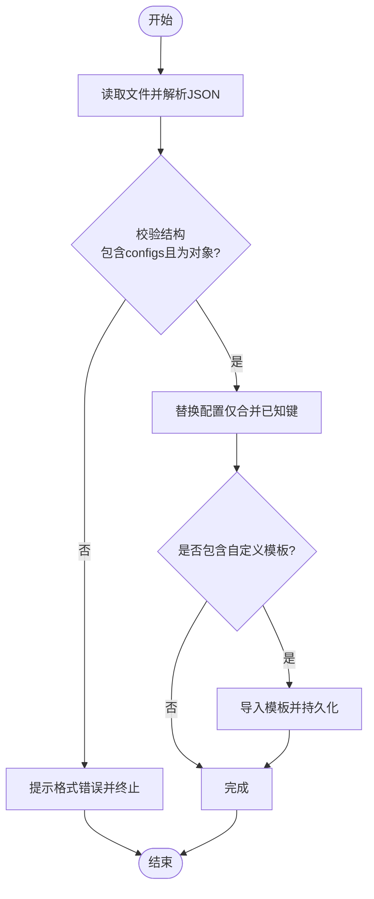
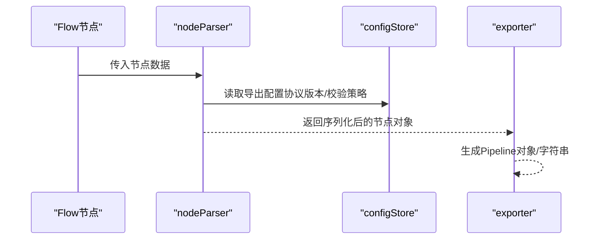
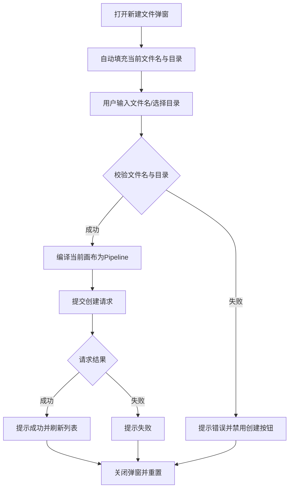
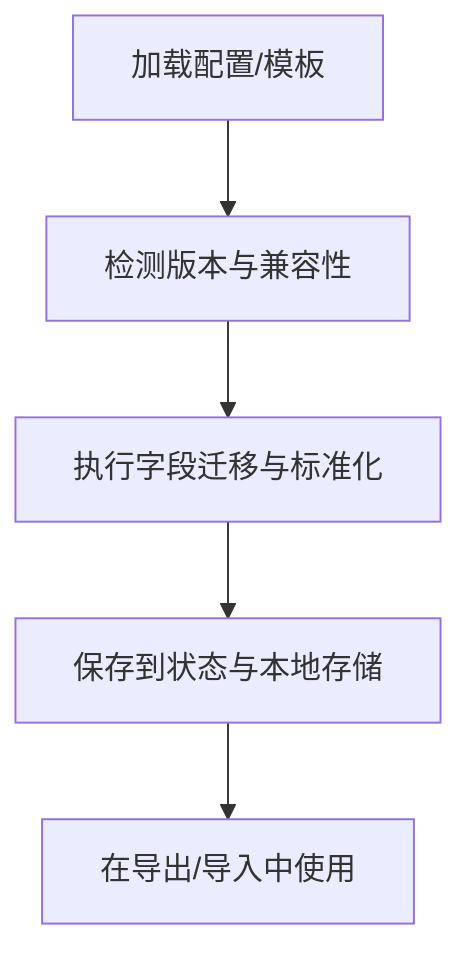
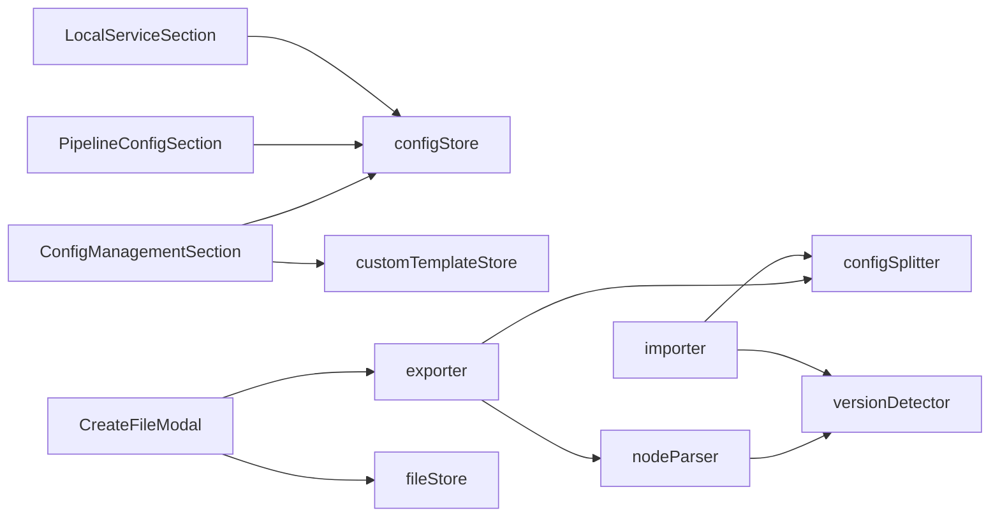

# 配置管理区域

<cite>
**本文档引用的文件**
- [ConfigManagementSection.tsx](file://src/components/panels/config/ConfigManagementSection.tsx)
- [configStore.ts](file://src/stores/configStore.ts)
- [exporter.ts](file://src/core/parser/exporter.ts)
- [configSplitter.ts](file://src/core/parser/configSplitter.ts)
- [nodeParser.ts](file://src/core/parser/nodeParser.ts)
- [versionDetector.ts](file://src/core/parser/versionDetector.ts)
- [customTemplateStore.ts](file://src/stores/customTemplateStore.ts)
- [CreateFileModal.tsx](file://src/components/modals/CreateFileModal.tsx)
- [PipelineConfigSection.tsx](file://src/components/panels/config/PipelineConfigSection.tsx)
- [LocalServiceSection.tsx](file://src/components/panels/config/LocalServiceSection.tsx)
- [BackendConfigModal.tsx](file://src/components/modals/BackendConfigModal.tsx)
- [fileStore.ts](file://src/stores/fileStore.ts)
- [importer.ts](file://src/core/parser/importer.ts)
</cite>

## 目录
1. [简介](#简介)
2. [项目结构](#项目结构)
3. [核心组件](#核心组件)
4. [架构总览](#架构总览)
5. [详细组件分析](#详细组件分析)
6. [依赖关系分析](#依赖关系分析)
7. [性能考量](#性能考量)
8. [故障排查指南](#故障排查指南)
9. [结论](#结论)
10. [附录](#附录)

## 简介
本章节系统性阐述“配置管理区域”的功能与实现，覆盖以下能力：
- 配置文件的导入与导出：支持单文件集成导出、分离导出与不导出三种模式；导出时自动处理节点位置、端点方向等可视化配置；导入时进行格式校验与兼容迁移。
- 创建新配置/文件：提供新建本地文件的向导式流程，包含文件名校验、目录选择、内容生成与提交。
- 配置版本管理：通过协议版本与字段版本检测，确保不同版本的Pipeline节点正确解析与迁移。
- 配置备份与恢复：通过导出/导入配置与自定义模板，实现工作区配置与节点模板的备份与恢复。
- 模板管理：支持自定义节点模板的增删改查、导入导出与持久化存储。

## 项目结构
配置管理区域由前端UI组件、状态管理、解析与导出工具链三部分组成：
- UI层：配置面板与弹窗组件，负责用户交互与参数收集。
- 状态层：Zustand状态管理，集中维护编辑器配置、模板与文件状态。
- 工具层：解析器、导出器、拆分器、版本检测器等，负责数据结构转换与兼容处理。

**图表来源**
- [ConfigManagementSection.tsx:1-137](file://src/components/panels/config/ConfigManagementSection.tsx#L1-L137)
- [configStore.ts:1-268](file://src/stores/configStore.ts#L1-L268)
- [exporter.ts:1-244](file://src/core/parser/exporter.ts#L1-L244)
- [configSplitter.ts:1-486](file://src/core/parser/configSplitter.ts#L1-L486)
- [nodeParser.ts:1-372](file://src/core/parser/nodeParser.ts#L1-L372)
- [versionDetector.ts:1-149](file://src/core/parser/versionDetector.ts#L1-L149)
- [customTemplateStore.ts:1-310](file://src/stores/customTemplateStore.ts#L1-L310)
- [CreateFileModal.tsx:1-450](file://src/components/modals/CreateFileModal.tsx#L1-L450)
- [fileStore.ts:121-180](file://src/stores/fileStore.ts#L121-L180)
- [importer.ts:141-249](file://src/core/parser/importer.ts#L141-L249)

**章节来源**
- [ConfigManagementSection.tsx:1-137](file://src/components/panels/config/ConfigManagementSection.tsx#L1-L137)
- [configStore.ts:1-268](file://src/stores/configStore.ts#L1-L268)

## 核心组件
- 配置管理面板：提供导出/导入配置入口，整合自定义模板导出与导入。
- 导出器：将Flow图转换为Pipeline对象或字符串，支持集成/分离/不导出三种模式。
- 配置拆分器：在分离模式下将Pipeline对象拆分为纯Pipeline与MPE配置，或进行合并。
- 节点解析器：将Flow节点解析为导出格式，处理识别/动作字段、others、focus、extras等。
- 版本检测器：检测recognition与action字段版本，执行类型标准化与迁移。
- 模板存储：管理自定义节点模板的增删改查、导入导出与本地持久化。
- 新建文件向导：校验文件名、目录合法性，生成Pipeline内容并提交到本地服务。

**章节来源**
- [exporter.ts:42-244](file://src/core/parser/exporter.ts#L42-L244)
- [configSplitter.ts:21-141](file://src/core/parser/configSplitter.ts#L21-L141)
- [nodeParser.ts:21-147](file://src/core/parser/nodeParser.ts#L21-L147)
- [versionDetector.ts:23-110](file://src/core/parser/versionDetector.ts#L23-L110)
- [customTemplateStore.ts:45-310](file://src/stores/customTemplateStore.ts#L45-L310)
- [CreateFileModal.tsx:183-262](file://src/components/modals/CreateFileModal.tsx#L183-L262)

## 架构总览
配置管理区域围绕“状态驱动 + 工具链解析”的架构展开：
- 状态驱动：configStore集中管理编辑器配置；customTemplateStore管理模板；fileStore管理文件与保存后配置更新。
- 工具链解析：exporter负责导出；configSplitter负责拆分/合并；nodeParser负责节点字段解析；versionDetector负责版本检测与标准化；importer负责导入流程与兼容迁移。

**图表来源**
- [ConfigManagementSection.tsx:28-58](file://src/components/panels/config/ConfigManagementSection.tsx#L28-L58)
- [exporter.ts:42-221](file://src/core/parser/exporter.ts#L42-L221)
- [configStore.ts:64-77](file://src/stores/configStore.ts#L64-L77)
- [fileStore.ts:154-180](file://src/stores/fileStore.ts#L154-L180)

## 详细组件分析

### 配置导入与导出流程
- 导出流程
  - 读取可导出配置：根据配置分类映射筛选出可导出字段。
  - 生成Pipeline对象：根据节点顺序、边连接、节点属性导出形式等生成对象。
  - 拆分/合并：在分离模式下拆分为Pipeline与配置两部分；在集成模式下合并为单文件。
  - 下载：根据缩进设置生成JSON字符串并下载为文件。
- 导入流程
  - 读取文件并解析JSON。
  - 校验数据结构：确保包含configs字段且为对象。
  - 替换配置：仅合并存在的配置键，避免未知键污染。
  - 模板导入：调用模板存储的导入方法，进行格式校验与持久化。

**图表来源**
- [ConfigManagementSection.tsx:61-104](file://src/components/panels/config/ConfigManagementSection.tsx#L61-L104)
- [configStore.ts:226-254](file://src/stores/configStore.ts#L226-L254)
- [customTemplateStore.ts:266-307](file://src/stores/customTemplateStore.ts#L266-L307)

**章节来源**
- [ConfigManagementSection.tsx:28-104](file://src/components/panels/config/ConfigManagementSection.tsx#L28-L104)
- [configStore.ts:64-77](file://src/stores/configStore.ts#L64-L77)
- [exporter.ts:42-244](file://src/core/parser/exporter.ts#L42-L244)
- [configSplitter.ts:21-141](file://src/core/parser/configSplitter.ts#L21-L141)
- [customTemplateStore.ts:255-307](file://src/stores/customTemplateStore.ts#L255-L307)

### 配置文件格式规范与数据结构
- 配置对象
  - 编辑器配置：如节点样式、边控制点、实时预览、画布背景模式、字段面板模式等。
  - 通信配置：如WebSocket端口、自动连接、文件自动重载等。
  - AI配置：如API地址、密钥、模型等。
  - Pipeline导出配置：如节点属性导出形式、默认端点位置、导出默认识别/动作、协议版本、字段校验策略、JSON缩进、配置处理方案等。
- 模板存储结构
  - 版本号与模板数组，每个模板包含标签、节点类型、数据（不含label）、创建时间。
- 文件配置结构
  - 文件名、节点顺序映射、下一个编号、保存的视口等运行时字段在导出时会被过滤。

**章节来源**
- [configStore.ts:95-144](file://src/stores/configStore.ts#L95-L144)
- [configStore.ts:163-267](file://src/stores/configStore.ts#L163-L267)
- [customTemplateStore.ts:8-22](file://src/stores/customTemplateStore.ts#L8-L22)
- [exporter.ts:184-200](file://src/core/parser/exporter.ts#L184-L200)

### Pipeline配置的序列化与反序列化
- 序列化（导出）
  - 节点解析：识别/动作字段按协议版本（v1/v2）序列化；others、focus、extras按需导出。
  - 边连接：根据节点属性导出形式（前缀/对象）生成引用。
  - 配置嵌入：在集成模式下将文件配置节点嵌入Pipeline对象。
- 反序列化（导入）
  - 版本检测：检测recognition与action字段版本，执行类型标准化。
  - 字段匹配：根据字段类型匹配规则进行参数校验或跳过校验。
  - 兼容迁移：处理废弃字段、键顺序、节点位置与端点方向等。

**图表来源**
- [nodeParser.ts:21-147](file://src/core/parser/nodeParser.ts#L21-L147)
- [exporter.ts:42-210](file://src/core/parser/exporter.ts#L42-L210)
- [configStore.ts:95-144](file://src/stores/configStore.ts#L95-L144)

**章节来源**
- [nodeParser.ts:21-147](file://src/core/parser/nodeParser.ts#L21-L147)
- [exporter.ts:42-210](file://src/core/parser/exporter.ts#L42-L210)
- [versionDetector.ts:23-110](file://src/core/parser/versionDetector.ts#L23-L110)

### 配置创建向导（新建本地文件）
- 文件名校验：支持.json与.jsonc后缀，禁止非法字符，自动补全后缀。
- 目录选择：基于本地文件列表提取目录，支持相对路径显示与绝对路径输入。
- 内容生成：调用导出器将当前画布编译为Pipeline对象。
- 提交与反馈：通过协议请求创建文件，成功后刷新文件列表并提示消息。

**图表来源**
- [CreateFileModal.tsx:89-131](file://src/components/modals/CreateFileModal.tsx#L89-L131)
- [CreateFileModal.tsx:134-205](file://src/components/modals/CreateFileModal.tsx#L134-L205)
- [CreateFileModal.tsx:218-262](file://src/components/modals/CreateFileModal.tsx#L218-L262)
- [exporter.ts:42-221](file://src/core/parser/exporter.ts#L42-L221)

**章节来源**
- [CreateFileModal.tsx:1-450](file://src/components/modals/CreateFileModal.tsx#L1-L450)
- [exporter.ts:42-221](file://src/core/parser/exporter.ts#L42-L221)

### 配置版本管理与备份恢复
- 版本检测与迁移
  - 节点版本检测：识别recognition与action字段版本，执行类型标准化。
  - 键顺序保持：导入时记录原始键顺序，保证导出顺序一致性。
  - 兼容处理：处理废弃字段、端点方向迁移、method值转换等。
- 备份与恢复
  - 导出：导出配置与自定义模板，形成可移植的JSON包。
  - 导入：恢复配置与模板，自动迁移旧版本数据。

**图表来源**
- [versionDetector.ts:23-110](file://src/core/parser/versionDetector.ts#L23-L110)
- [importer.ts:155-249](file://src/core/parser/importer.ts#L155-L249)
- [configSplitter.ts:151-448](file://src/core/parser/configSplitter.ts#L151-L448)
- [customTemplateStore.ts:50-94](file://src/stores/customTemplateStore.ts#L50-L94)

**章节来源**
- [versionDetector.ts:1-149](file://src/core/parser/versionDetector.ts#L1-L149)
- [importer.ts:155-249](file://src/core/parser/importer.ts#L155-L249)
- [configSplitter.ts:151-448](file://src/core/parser/configSplitter.ts#L151-L448)
- [customTemplateStore.ts:50-94](file://src/stores/customTemplateStore.ts#L50-L94)

## 依赖关系分析
- 组件耦合
  - ConfigManagementSection依赖configStore与customTemplateStore，负责导出/导入配置与模板。
  - PipelineConfigSection与LocalServiceSection依赖configStore，提供配置项编辑入口。
  - CreateFileModal依赖exporter与fileStore，负责新建文件流程。
- 工具链依赖
  - exporter依赖configStore、configSplitter、nodeParser与错误状态。
  - nodeParser依赖configStore、typeMatchers与versionDetector。
  - configSplitter依赖类型前缀与键提取逻辑。
  - importer依赖versionDetector与configSplitter。

**图表来源**
- [ConfigManagementSection.tsx:1-137](file://src/components/panels/config/ConfigManagementSection.tsx#L1-L137)
- [configStore.ts:1-268](file://src/stores/configStore.ts#L1-L268)
- [customTemplateStore.ts:1-310](file://src/stores/customTemplateStore.ts#L1-L310)
- [PipelineConfigSection.tsx:1-274](file://src/components/panels/config/PipelineConfigSection.tsx#L1-L274)
- [LocalServiceSection.tsx:1-144](file://src/components/panels/config/LocalServiceSection.tsx#L1-L144)
- [CreateFileModal.tsx:1-450](file://src/components/modals/CreateFileModal.tsx#L1-L450)
- [exporter.ts:1-244](file://src/core/parser/exporter.ts#L1-L244)
- [configSplitter.ts:1-486](file://src/core/parser/configSplitter.ts#L1-L486)
- [nodeParser.ts:1-372](file://src/core/parser/nodeParser.ts#L1-L372)
- [versionDetector.ts:1-149](file://src/core/parser/versionDetector.ts#L1-L149)
- [importer.ts:141-249](file://src/core/parser/importer.ts#L141-L249)

**章节来源**
- [exporter.ts:1-244](file://src/core/parser/exporter.ts#L1-L244)
- [nodeParser.ts:1-372](file://src/core/parser/nodeParser.ts#L1-L372)
- [configSplitter.ts:1-486](file://src/core/parser/configSplitter.ts#L1-L486)
- [importer.ts:141-249](file://src/core/parser/importer.ts#L141-L249)

## 性能考量
- 导出性能
  - 节点排序与边分组：在导出阶段对节点与边进行排序与分组，避免重复计算。
  - JSON缩进：通过配置控制缩进，平衡可读性与体积。
- 导入性能
  - 键顺序保持：导入时记录原始键顺序，减少后续排序成本。
  - 类型匹配：在跳过校验模式下可提升导入速度，但需谨慎使用。
- 模板存储
  - 本地持久化：模板存储在localStorage，注意容量限制与序列化开销。

[本节为通用指导，不涉及具体文件分析]

## 故障排查指南
- 导出失败
  - 节点名重复：导出前检查重复节点名并提示修正。
  - 格式错误：检查节点字段是否符合协议，查看控制台错误信息。
- 导入失败
  - 格式不正确：确保导入文件包含configs字段且为对象。
  - 模板导入失败：检查模板数据格式与版本，清理损坏数据后重试。
- 新建文件失败
  - 未连接本地服务：先建立本地服务连接再创建文件。
  - 文件名冲突：更换文件名或目录后重试。
- 配置不生效
  - 端口变更：修改端口后需重新连接本地服务。
  - 自动重载：开启自动重载后外部修改会自动生效。

**章节来源**
- [exporter.ts:44-55](file://src/core/parser/exporter.ts#L44-L55)
- [ConfigManagementSection.tsx:69-76](file://src/components/panels/config/ConfigManagementSection.tsx#L69-L76)
- [CreateFileModal.tsx:223-232](file://src/components/modals/CreateFileModal.tsx#L223-L232)
- [LocalServiceSection.tsx:53-58](file://src/components/panels/config/LocalServiceSection.tsx#L53-L58)

## 结论
配置管理区域通过清晰的UI组件、集中状态管理与完善的工具链，实现了配置的导入导出、版本管理、备份恢复与模板管理。其设计兼顾易用性与可扩展性，既满足日常使用需求，也为未来版本演进提供了良好的兼容基础。

[本节为总结性内容，不涉及具体文件分析]

## 附录

### 最佳实践与安全建议
- 导入导出
  - 使用集成导出便于分享，使用分离导出便于版本管理。
  - 导入前备份当前配置，避免不可逆覆盖。
- 模板管理
  - 控制模板数量，避免过多模板影响加载性能。
  - 导出模板时注意模板内容的合规性与可移植性。
- 安全考虑
  - 避免在配置中存储敏感信息（如API密钥）。
  - 如需加密存储，建议采用应用层加密后再持久化，而非依赖浏览器默认存储机制。
- 兼容性
  - 定期更新编辑器版本，确保与最新协议一致。
  - 在升级前后进行一次配置导出与导入，验证兼容性。

[本节为通用指导，不涉及具体文件分析]