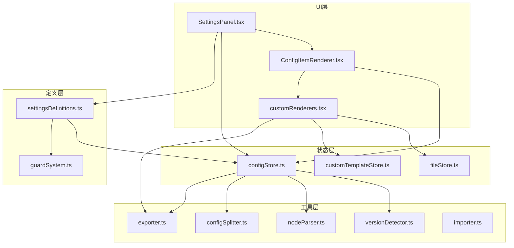
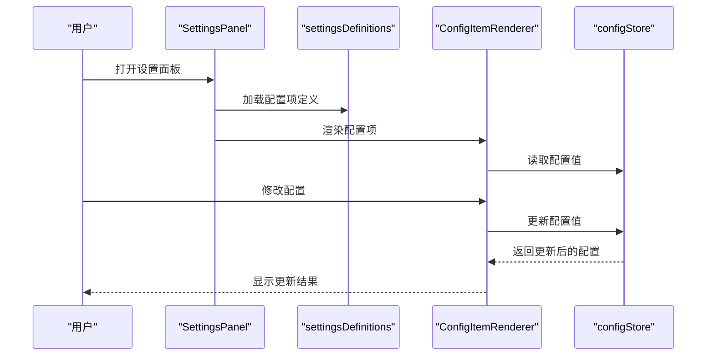
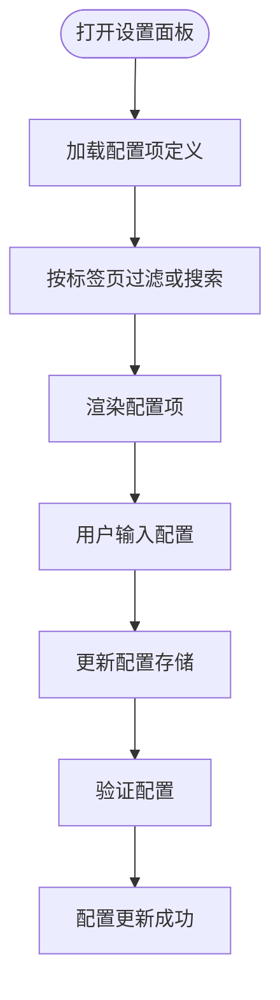
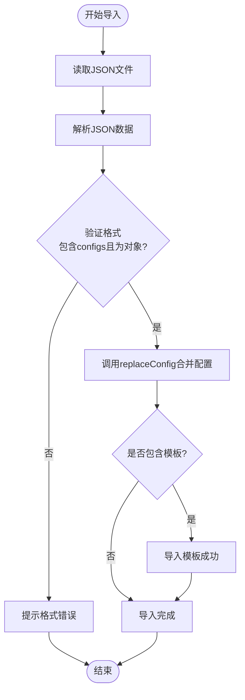
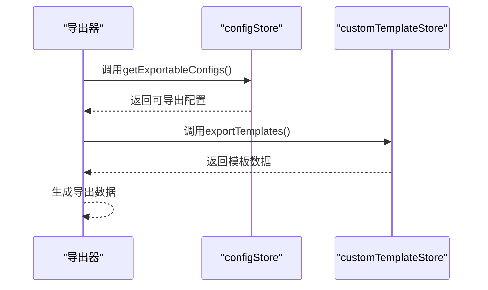
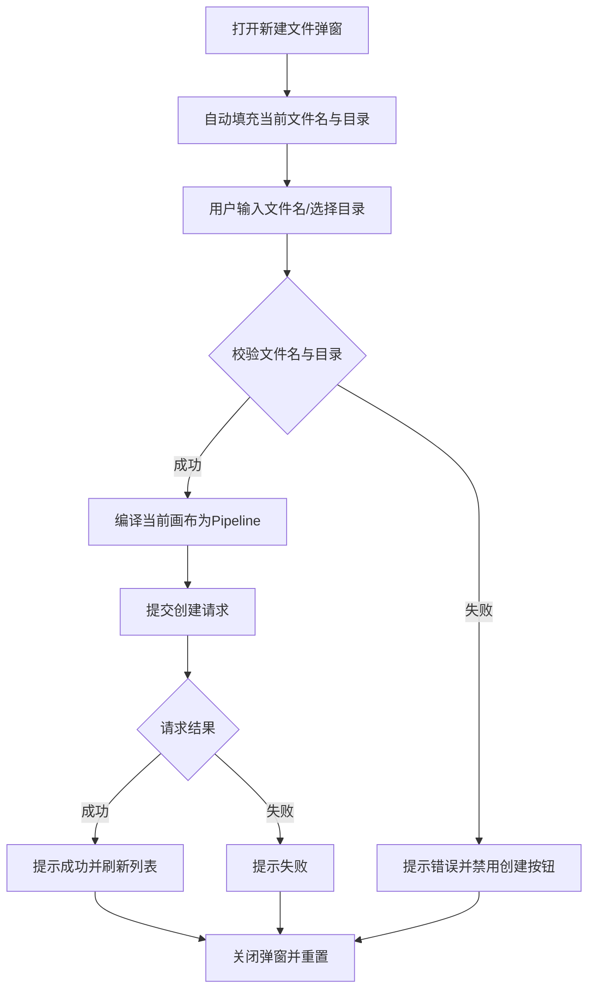
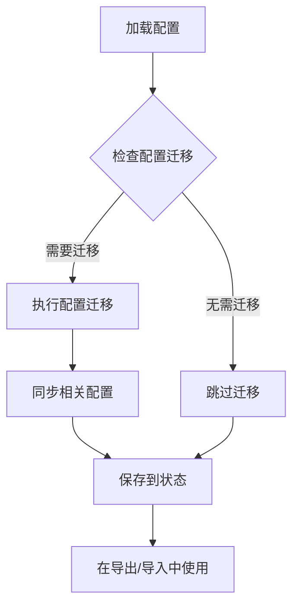
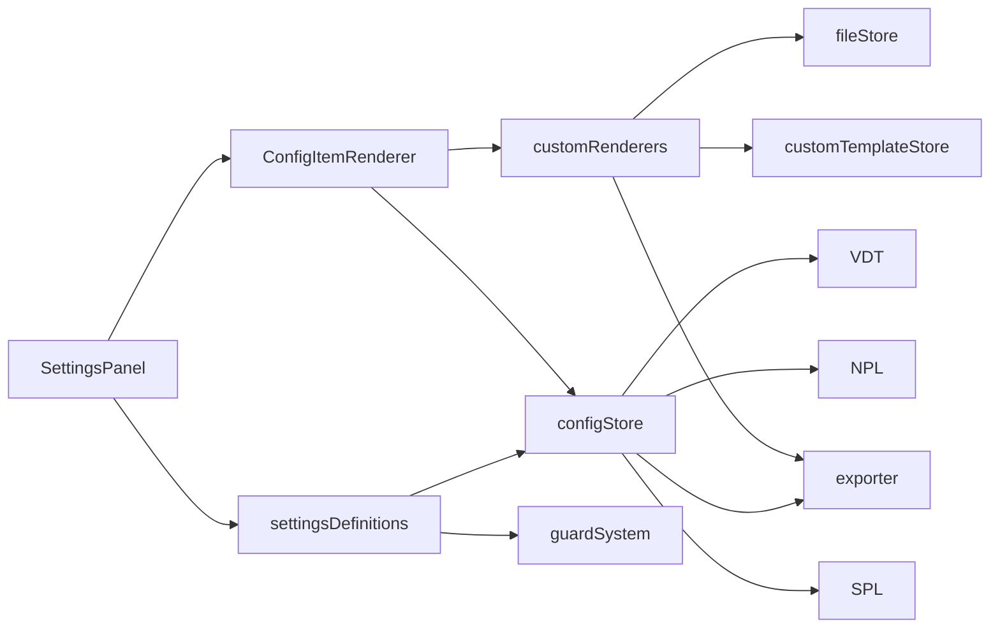

# 配置管理区域

<cite>
**本文档引用的文件**
- [SettingsPanel.tsx](file://src/components/panels/settings/SettingsPanel.tsx)
- [settingsDefinitions.ts](file://src/components/panels/settings/settingsDefinitions.ts)
- [ConfigItemRenderer.tsx](file://src/components/panels/settings/ConfigItemRenderer.tsx)
- [customRenderers.tsx](file://src/components/panels/settings/customRenderers.tsx)
- [guardSystem.ts](file://src/components/panels/settings/guardSystem.ts)
- [configStore.ts](file://src/stores/configStore.ts)
- [exporter.ts](file://src/core/parser/exporter.ts)
- [configSplitter.ts](file://src/core/parser/configSplitter.ts)
- [nodeParser.ts](file://src/core/parser/nodeParser.ts)
- [versionDetector.ts](file://src/core/parser/versionDetector.ts)
- [customTemplateStore.ts](file://src/stores/customTemplateStore.ts)
- [CreateFileModal.tsx](file://src/components/modals/CreateFileModal.tsx)
- [PipelineConfigSection.tsx](file://src/components/panels/config/PipelineConfigSection.tsx)
- [LocalServiceSection.tsx](file://src/components/panels/config/LocalServiceSection.tsx)
- [BackendConfigModal.tsx](file://src/components/modals/BackendConfigModal.tsx)
- [fileStore.ts](file://src/stores/fileStore.ts)
- [importer.ts](file://src/core/parser/importer.ts)
</cite>

## 更新摘要
**所做更改**
- 更新了配置管理区域的架构说明，反映从ConfigManagementSection到统一设置系统的重构
- 新增了SettingsPanel组件的详细分析，包括配置项定义、渲染器和自定义渲染器
- 更新了配置分类和管理方式，从分散的配置面板整合到统一的设置系统
- 增强了配置导入导出功能的说明，包括守卫系统和配置验证机制
- 更新了配置管理的最佳实践和安全考虑

## 目录
1. [简介](#简介)
2. [项目结构](#项目结构)
3. [核心组件](#核心组件)
4. [架构总览](#架构总览)
5. [详细组件分析](#详细组件分析)
6. [依赖关系分析](#依赖关系分析)
7. [性能考量](#性能考量)
8. [故障排查指南](#故障排查指南)
9. [结论](#结论)
10. [附录](#附录)

## 简介
本章节系统性阐述"配置管理区域"的重构后功能与实现，覆盖以下能力：
- **统一设置系统**：全新的SettingsPanel组件替代了旧的ConfigManagementSection，提供统一的配置管理界面
- **配置分类管理**：将配置项按功能分类到导出、节点、连接、画布、组件、本地服务、AI、管理八个类别
- **配置导入导出**：支持完整的配置导入导出功能，包括编辑器配置和自定义节点模板
- **守卫系统**：引入配置守卫机制，确保关键配置项在使用前得到正确设置
- **自定义渲染器**：提供丰富的自定义控件，支持复杂配置项的交互
- **搜索和过滤**：支持跨类别的配置项搜索和过滤功能

## 项目结构
配置管理区域经过重构后，采用统一设置系统架构：
- **UI层**：SettingsPanel作为主要配置界面，ConfigItemRenderer负责配置项渲染，customRenderers提供自定义控件
- **定义层**：settingsDefinitions集中定义所有配置项及其属性，包括类型、分类、验证规则等
- **状态层**：configStore管理配置状态、默认值和配置追踪
- **工具层**：guardSystem提供配置守卫功能，支持配置验证和提示

**图表来源**
- [SettingsPanel.tsx:1-175](file://src/components/panels/settings/SettingsPanel.tsx#L1-L175)
- [settingsDefinitions.ts:1-619](file://src/components/panels/settings/settingsDefinitions.ts#L1-L619)
- [ConfigItemRenderer.tsx:1-254](file://src/components/panels/settings/ConfigItemRenderer.tsx#L1-L254)
- [customRenderers.tsx:1-292](file://src/components/panels/settings/customRenderers.tsx#L1-L292)
- [guardSystem.ts:1-38](file://src/components/panels/settings/guardSystem.ts#L1-L38)
- [configStore.ts:1-355](file://src/stores/configStore.ts#L1-L355)

## 核心组件
- **SettingsPanel**：统一的配置管理界面，提供标签页导航和搜索功能
- **配置项定义**：settingsDefinitions集中定义所有配置项，包括类型、分类、验证规则
- **配置项渲染器**：ConfigItemRenderer负责渲染各种类型的配置控件
- **自定义渲染器**：提供复杂的配置控件，如导出导入、AI配置、本地服务配置等
- **守卫系统**：guardSystem提供配置验证和提示功能
- **配置存储**：configStore管理配置状态、默认值和配置追踪

**章节来源**
- [SettingsPanel.tsx:35-175](file://src/components/panels/settings/SettingsPanel.tsx#L35-L175)
- [settingsDefinitions.ts:62-602](file://src/components/panels/settings/settingsDefinitions.ts#L62-L602)
- [ConfigItemRenderer.tsx:23-254](file://src/components/panels/settings/ConfigItemRenderer.tsx#L23-L254)
- [customRenderers.tsx:17-292](file://src/components/panels/settings/customRenderers.tsx#L17-L292)
- [guardSystem.ts:17-38](file://src/components/panels/settings/guardSystem.ts#L17-L38)
- [configStore.ts:252-355](file://src/stores/configStore.ts#L252-L355)

## 架构总览
配置管理区域采用统一设置系统架构：
- **统一界面**：SettingsPanel作为单一配置入口，整合所有配置功能
- **分类管理**：配置项按功能分类，支持标签页导航和搜索过滤
- **声明式定义**：通过settingsDefinitions声明配置项属性，支持类型、验证、可见性等
- **状态驱动**：configStore集中管理配置状态和默认值
- **守卫验证**：通过guardSystem确保关键配置项的正确设置

**图表来源**
- [SettingsPanel.tsx:60-82](file://src/components/panels/settings/SettingsPanel.tsx#L60-L82)
- [settingsDefinitions.ts:62-602](file://src/components/panels/settings/settingsDefinitions.ts#L62-L602)
- [ConfigItemRenderer.tsx:25-44](file://src/components/panels/settings/ConfigItemRenderer.tsx#L25-L44)
- [configStore.ts:255-274](file://src/stores/configStore.ts#L255-L274)

## 详细组件分析

### 统一设置系统架构
- **SettingsPanel**：提供系统配置界面，支持标签页导航、搜索过滤和配置项渲染
- **配置项定义系统**：通过settingsDefinitions集中定义配置项，支持类型、分类、验证、可见性等属性
- **渲染器系统**：ConfigItemRenderer根据配置项类型渲染相应的控件，支持自定义渲染器
- **守卫系统**：guardSystem提供配置验证功能，确保关键配置项在使用前得到正确设置

**图表来源**
- [SettingsPanel.tsx:60-82](file://src/components/panels/settings/SettingsPanel.tsx#L60-L82)
- [settingsDefinitions.ts:62-602](file://src/components/panels/settings/settingsDefinitions.ts#L62-L602)
- [ConfigItemRenderer.tsx:25-44](file://src/components/panels/settings/ConfigItemRenderer.tsx#L25-L44)

**章节来源**
- [SettingsPanel.tsx:35-175](file://src/components/panels/settings/SettingsPanel.tsx#L35-L175)
- [settingsDefinitions.ts:16-59](file://src/components/panels/settings/settingsDefinitions.ts#L16-L59)
- [ConfigItemRenderer.tsx:23-254](file://src/components/panels/settings/ConfigItemRenderer.tsx#L23-L254)
- [guardSystem.ts:17-38](file://src/components/panels/settings/guardSystem.ts#L17-L38)

### 配置导入与导出流程
- **导出流程**
  - 收集可导出配置：通过getExportableConfigs函数筛选出可导出的配置项
  - 导出模板：调用customTemplateStore.exportTemplates()获取自定义模板
  - 生成导出数据：包含版本信息、导出时间、配置数据和模板数据
  - 下载文件：根据jsonIndent配置生成JSON字符串并下载
- **导入流程**
  - 读取文件：用户选择JSON文件并读取内容
  - 解析数据：解析JSON内容并验证格式
  - 验证配置：确保包含configs字段且为对象
  - 替换配置：调用replaceConfig方法合并配置
  - 导入模板：调用importTemplates方法导入自定义模板

**图表来源**
- [customRenderers.tsx:203-254](file://src/components/panels/settings/customRenderers.tsx#L203-L254)
- [configStore.ts:275-306](file://src/stores/configStore.ts#L275-L306)
- [customTemplateStore.ts:266-307](file://src/stores/customTemplateStore.ts#L266-L307)

**章节来源**
- [customRenderers.tsx:159-254](file://src/components/panels/settings/customRenderers.tsx#L159-L254)
- [configStore.ts:79-92](file://src/stores/configStore.ts#L79-L92)
- [configStore.ts:275-306](file://src/stores/configStore.ts#L275-L306)
- [customTemplateStore.ts:255-307](file://src/stores/customTemplateStore.ts#L255-L307)

### 配置文件格式规范与数据结构
- **导出数据结构**
  - version：应用版本信息
  - exportTime：导出时间戳
  - configs：配置数据对象
  - customTemplates：自定义模板数组
- **配置项定义结构**
  - key：配置项键名
  - category：配置项分类
  - label：显示标签
  - tipTitle：提示标题
  - tipContent：提示内容
  - type：控件类型
  - options：选择项选项
  - 其他属性：min、max、step、placeholder等

**章节来源**
- [customRenderers.tsx:169-174](file://src/components/panels/settings/customRenderers.tsx#L169-L174)
- [settingsDefinitions.ts:16-59](file://src/components/panels/settings/settingsDefinitions.ts#L16-L59)
- [configStore.ts:113-166](file://src/stores/configStore.ts#L113-L166)

### Pipeline配置的序列化与反序列化
- **序列化（导出）**
  - 配置过滤：通过configCategoryMap筛选出可导出的配置项
  - 数据转换：将配置数据转换为导出格式
  - 模板处理：导出自定义节点模板
- **反序列化（导入）**
  - 配置合并：通过replaceConfig方法合并导入的配置
  - 兼容性处理：处理isExportConfig到configHandlingMode的迁移
  - 状态同步：同步相关配置项的状态

**图表来源**
- [configStore.ts:79-92](file://src/stores/configStore.ts#L79-L92)
- [customRenderers.tsx:165-167](file://src/components/panels/settings/customRenderers.tsx#L165-L167)

**章节来源**
- [configStore.ts:79-92](file://src/stores/configStore.ts#L79-L92)
- [configStore.ts:275-306](file://src/stores/configStore.ts#L275-L306)
- [exporter.ts:42-244](file://src/core/parser/exporter.ts#L42-L244)
- [configSplitter.ts:21-141](file://src/core/parser/configSplitter.ts#L21-L141)

### 配置创建向导（新建本地文件）
- 文件名校验：支持.json与.jsonc后缀，禁止非法字符，自动补全后缀
- 目录选择：基于本地文件列表提取目录，支持相对路径显示与绝对路径输入
- 内容生成：调用导出器将当前画布编译为Pipeline对象
- 提交与反馈：通过协议请求创建文件，成功后刷新文件列表并提示消息

**图表来源**
- [CreateFileModal.tsx:89-131](file://src/components/modals/CreateFileModal.tsx#L89-L131)
- [CreateFileModal.tsx:134-205](file://src/components/modals/CreateFileModal.tsx#L134-L205)
- [CreateFileModal.tsx:218-262](file://src/components/modals/CreateFileModal.tsx#L218-L262)
- [exporter.ts:42-221](file://src/core/parser/exporter.ts#L42-L221)

**章节来源**
- [CreateFileModal.tsx:1-450](file://src/components/modals/CreateFileModal.tsx#L1-L450)
- [exporter.ts:42-221](file://src/core/parser/exporter.ts#L42-L221)

### 配置版本管理与备份恢复
- **版本检测与迁移**
  - 配置迁移：处理isExportConfig到configHandlingMode的双向同步
  - 兼容性处理：确保新旧配置格式的兼容性
  - 状态同步：同步相关配置项的状态
- **备份与恢复**
  - 完整备份：导出配置和自定义模板，形成可移植的JSON包
  - 智能恢复：导入时自动处理配置兼容性和模板导入

**图表来源**
- [configStore.ts:285-299](file://src/stores/configStore.ts#L285-L299)
- [configStore.ts:327-332](file://src/stores/configStore.ts#L327-L332)

**章节来源**
- [configStore.ts:285-299](file://src/stores/configStore.ts#L285-L299)
- [configStore.ts:327-332](file://src/stores/configStore.ts#L327-L332)
- [importer.ts:155-249](file://src/core/parser/importer.ts#L155-L249)
- [configSplitter.ts:151-448](file://src/core/parser/configSplitter.ts#L151-L448)

## 依赖关系分析
- **组件耦合**
  - SettingsPanel依赖settingsDefinitions、configStore和ConfigItemRenderer
  - ConfigItemRenderer依赖configStore和customRenderers
  - customRenderers依赖configStore、customTemplateStore和各种服务
  - guardSystem依赖settingsDefinitions和configStore
- **工具链依赖**
  - configStore依赖settingsDefinitions进行配置管理和默认值处理
  - 导出导入功能依赖exporter、configSplitter、nodeParser和versionDetector

**图表来源**
- [SettingsPanel.tsx:16-21](file://src/components/panels/settings/SettingsPanel.tsx#L16-L21)
- [settingsDefinitions.ts:1-619](file://src/components/panels/settings/settingsDefinitions.ts#L1-L619)
- [ConfigItemRenderer.tsx:12-15](file://src/components/panels/settings/ConfigItemRenderer.tsx#L12-L15)
- [customRenderers.tsx:3-15](file://src/components/panels/settings/customRenderers.tsx#L3-L15)
- [guardSystem.ts:1-3](file://src/components/panels/settings/guardSystem.ts#L1-L3)
- [configStore.ts:1-355](file://src/stores/configStore.ts#L1-L355)

**章节来源**
- [SettingsPanel.tsx:16-21](file://src/components/panels/settings/SettingsPanel.tsx#L16-L21)
- [settingsDefinitions.ts:1-619](file://src/components/panels/settings/settingsDefinitions.ts#L1-L619)
- [ConfigItemRenderer.tsx:12-15](file://src/components/panels/settings/ConfigItemRenderer.tsx#L12-L15)
- [customRenderers.tsx:3-15](file://src/components/panels/settings/customRenderers.tsx#L3-L15)
- [guardSystem.ts:1-3](file://src/components/panels/settings/guardSystem.ts#L1-L3)
- [configStore.ts:1-355](file://src/stores/configStore.ts#L1-L355)

## 性能考量
- **渲染性能**
  - 懒加载：配置项按需渲染，减少初始渲染负担
  - 搜索优化：支持跨标签页搜索，提高查找效率
  - 状态缓存：使用useMemo和useCallback优化渲染性能
- **存储性能**
  - 配置追踪：通过Set结构高效追踪已配置项
  - 批量操作：支持批量重置和配置同步
  - 内存管理：及时释放临时对象和事件监听器

## 故障排查指南
- **设置面板无法打开**
  - 检查showConfigPanel状态是否正确设置
  - 确认SettingsPanel组件的条件渲染逻辑
- **配置项不显示**
  - 检查配置项的visible属性和条件判断
  - 确认配置项分类是否正确映射
- **配置导入失败**
  - 检查JSON文件格式是否正确
  - 确认configs字段是否存在且为对象
  - 验证配置项键名是否存在于当前版本
- **自定义渲染器异常**
  - 检查customRenderers注册表中的组件是否存在
  - 确认组件的依赖注入是否正确
  - 验证组件的props传递是否完整

**章节来源**
- [SettingsPanel.tsx:96-114](file://src/components/panels/settings/SettingsPanel.tsx#L96-L114)
- [settingsDefinitions.ts:47-48](file://src/components/panels/settings/settingsDefinitions.ts#L47-L48)
- [customRenderers.tsx:48-53](file://src/components/panels/settings/customRenderers.tsx#L48-L53)
- [configStore.ts:285-306](file://src/stores/configStore.ts#L285-L306)

## 结论
配置管理区域经过重构后，采用了更加统一和高效的设置系统架构。新的SettingsPanel组件提供了更好的用户体验，支持配置项的分类管理、搜索过滤和守卫验证。通过声明式的配置定义和自定义渲染器系统，配置管理变得更加灵活和可扩展。整体架构在保持功能完整性的同时，提高了代码的可维护性和性能表现。

## 附录

### 最佳实践与安全建议
- **配置管理**
  - 使用统一的设置面板进行配置管理，避免分散在多个界面
  - 定期导出配置备份，防止意外丢失
  - 利用搜索功能快速定位配置项，提高工作效率
- **安全考虑**
  - AI配置中的API Key将以明文存储在浏览器本地，避免在公共设备上使用
  - 考虑使用支持CORS的API中转服务，避免浏览器跨域限制
  - 定期更新配置，确保使用最新的安全设置
- **性能优化**
  - 合理使用配置项的visible属性，避免不必要的渲染
  - 利用配置追踪功能，及时发现和修复配置问题
  - 定期清理不需要的自定义模板，减少存储压力
- **兼容性**
  - 导入配置前备份当前设置，避免不可逆的覆盖
  - 关注配置迁移提示，确保新旧版本的兼容性
  - 定期更新应用版本，获得最新的配置支持和安全修复