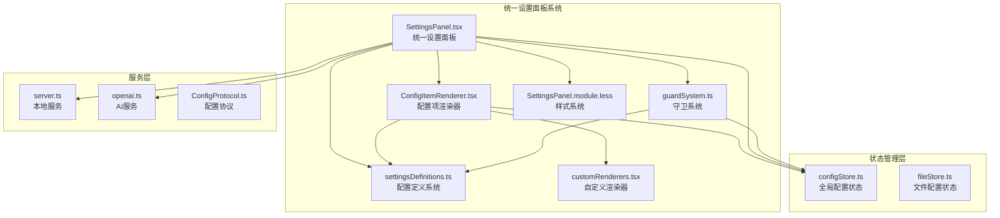
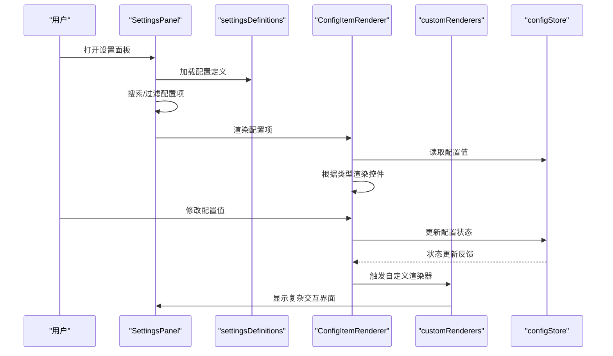
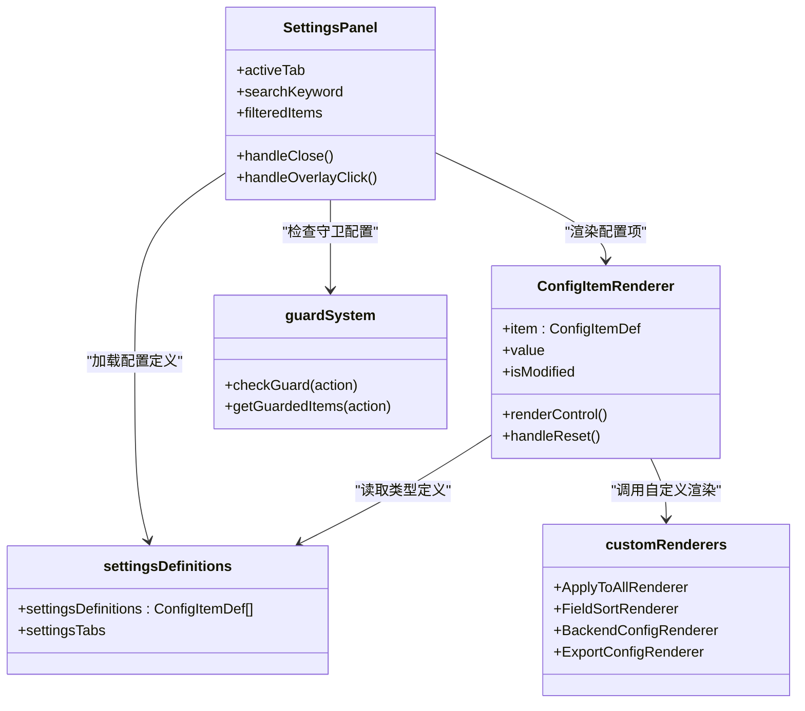

# 配置面板

<cite>
**本文引用的文件列表**
- [SettingsPanel.tsx](file://src/components/panels/settings/SettingsPanel.tsx)
- [ConfigItemRenderer.tsx](file://src/components/panels/settings/ConfigItemRenderer.tsx)
- [settingsDefinitions.ts](file://src/components/panels/settings/settingsDefinitions.ts)
- [customRenderers.tsx](file://src/components/panels/settings/customRenderers.tsx)
- [guardSystem.ts](file://src/components/panels/settings/guardSystem.ts)
- [SettingsPanel.module.less](file://src/styles/panels/SettingsPanel.module.less)
- [configStore.ts](file://src/stores/configStore.ts)
- [FileConfigPanel.tsx](file://src/components/panels/main/FileConfigPanel.tsx)
- [FileConfigPanel.module.less](file://src/styles/panels/FileConfigPanel.module.less)
- [server.ts](file://src/services/server.ts)
- [openai.ts](file://src/utils/ai/openai.ts)
- [fileStore.ts](file://src/stores/fileStore.ts)
- [ConfigProtocol.ts](file://src/services/protocols/ConfigProtocol.ts)
- [BackendConfigModal.tsx](file://src/components/modals/BackendConfigModal.tsx)
- [edges.tsx](file://src/components/flow/edges.tsx)
- [edges.module.less](file://src/styles/edges.module.less)
- [flow.less](file://src/styles/flow.less)
- [Flow.tsx](file://src/components/Flow.tsx)
- [NodeAddPanel.tsx](file://src/components/panels/main/NodeAddPanel.tsx)
</cite>

## 更新摘要
**所做更改**
- 新增统一设置面板系统架构分析
- 更新配置面板组件结构和数据流
- 新增SettingsPanel核心组件文档
- 新增ConfigItemRenderer渲染器文档
- 新增settingsDefinitions配置定义系统文档
- 新增customRenderers自定义渲染器文档
- 新增guardSystem守卫系统文档
- 更新配置面板架构图和组件关系
- 新增搜索和分组功能说明
- 更新配置项分类和功能说明

## 目录
1. [简介](#简介)
2. [项目结构](#项目结构)
3. [核心组件](#核心组件)
4. [架构总览](#架构总览)
5. [详细组件分析](#详细组件分析)
6. [依赖关系分析](#依赖关系分析)
7. [性能考量](#性能考量)
8. [故障排查指南](#故障排查指南)
9. [结论](#结论)
10. [附录](#附录)

## 简介
本文档全面介绍重构后的统一设置面板系统，该系统从原有的模块化面板架构迁移到全新的SettingsPanel组件体系。新系统采用声明式配置定义、统一渲染器和守卫机制，提供更加灵活和可扩展的配置管理体验。系统包含八大配置分区：导出、节点、连接、画布、组件、本地服务、AI和管理，每个分区都通过settingsDefinitions进行统一定义，ConfigItemRenderer负责渲染，customRenderers处理复杂交互，guardSystem提供配置守卫功能。

**更新** 重大重构：从旧的模块化面板系统迁移到新的统一设置面板系统，新增SettingsPanel组件、ConfigItemRenderer渲染器、settingsDefinitions配置定义系统等核心组件。

## 项目结构
重构后的配置面板系统采用统一设置面板架构，所有配置管理功能集中在SettingsPanel组件中，通过声明式配置定义和统一渲染机制实现：

- **SettingsPanel**：统一设置面板容器，负责面板显示、搜索、分组和状态管理
- **ConfigItemRenderer**：通用配置项渲染器，支持多种控件类型和自定义渲染
- **settingsDefinitions**：配置定义系统，声明式定义所有配置项及其属性
- **customRenderers**：自定义渲染器集合，处理复杂交互和业务逻辑
- **guardSystem**：配置守卫系统，提供关键配置的前置检查机制
- **样式系统**：SettingsPanel.module.less提供完整的样式支持

**图表来源**
- [SettingsPanel.tsx:35-176](file://src/components/panels/settings/SettingsPanel.tsx#L35-L176)
- [ConfigItemRenderer.tsx:23-254](file://src/components/panels/settings/ConfigItemRenderer.tsx#L23-L254)
- [settingsDefinitions.ts:62-619](file://src/components/panels/settings/settingsDefinitions.ts#L62-L619)
- [customRenderers.tsx:17-292](file://src/components/panels/settings/customRenderers.tsx#L17-L292)
- [guardSystem.ts:17-38](file://src/components/panels/settings/guardSystem.ts#L17-L38)

## 核心组件
- **SettingsPanel**：统一设置面板容器，提供搜索、分组、状态管理和事件处理
- **ConfigItemRenderer**：通用配置项渲染器，支持switch、select、inputNumber、input、slider等多种控件类型
- **settingsDefinitions**：声明式配置定义系统，定义所有配置项的元数据、分类、可见性等属性
- **customRenderers**：自定义渲染器集合，处理复杂交互如一键应用、字段排序、后端配置等
- **guardSystem**：配置守卫系统，提供关键配置的前置检查和用户引导
- **样式系统**：完整的CSS模块化样式，支持响应式布局和主题适配

**章节来源**
- [SettingsPanel.tsx:35-176](file://src/components/panels/settings/SettingsPanel.tsx#L35-L176)
- [ConfigItemRenderer.tsx:23-254](file://src/components/panels/settings/ConfigItemRenderer.tsx#L23-L254)
- [settingsDefinitions.ts:15-619](file://src/components/panels/settings/settingsDefinitions.ts#L15-L619)
- [customRenderers.tsx:17-292](file://src/components/panels/settings/customRenderers.tsx#L17-L292)
- [guardSystem.ts:5-38](file://src/components/panels/settings/guardSystem.ts#L5-L38)

## 架构总览
统一设置面板系统采用声明式配置和统一渲染架构，通过settingsDefinitions定义配置项元数据，ConfigItemRenderer根据类型自动渲染相应控件，customRenderers处理复杂业务逻辑，guardSystem提供配置守卫机制。系统支持搜索过滤、分组显示、条件显隐等功能，提供完整的配置管理体验。

**图表来源**
- [SettingsPanel.tsx:60-94](file://src/components/panels/settings/SettingsPanel.tsx#L60-L94)
- [ConfigItemRenderer.tsx:25-44](file://src/components/panels/settings/ConfigItemRenderer.tsx#L25-L44)
- [settingsDefinitions.ts:62-602](file://src/components/panels/settings/settingsDefinitions.ts#L62-L602)
- [customRenderers.tsx:159-200](file://src/components/panels/settings/customRenderers.tsx#L159-L200)

## 详细组件分析

### SettingsPanel（统一设置面板）
- **功能职责**
  - 控制面板显隐状态和遮罩层
  - 实现搜索过滤和分组显示
  - 管理侧边栏Tab切换和内容区域渲染
  - 处理配置项的条件显隐和排序
- **核心特性**
  - 搜索模式：跨Tab搜索配置项标题、提示标题、提示内容
  - 分组显示：搜索结果按配置分区分组展示
  - 条件显隐：根据配置状态动态显示/隐藏配置项
  - 响应式布局：支持不同屏幕尺寸的自适应显示

**章节来源**
- [SettingsPanel.tsx:35-176](file://src/components/panels/settings/SettingsPanel.tsx#L35-L176)

### ConfigItemRenderer（配置项渲染器）
- **功能职责**
  - 根据配置项类型自动渲染相应控件
  - 处理配置值的读取、修改和重置
  - 显示配置项的提示信息和修改状态
  - 支持自定义渲染器和条件显隐
- **控件类型支持**
  - 基础控件：switch、select、inputNumber、input、inputPassword、slider
  - 自定义控件：通过customRender属性支持复杂交互
  - 按钮控件：用于触发特定操作如测试连接、导出配置等

**章节来源**
- [ConfigItemRenderer.tsx:23-254](file://src/components/panels/settings/ConfigItemRenderer.tsx#L23-L254)

### settingsDefinitions（配置定义系统）
- **功能职责**
  - 声明式定义所有配置项的元数据
  - 提供配置项的分类、可见性、排序等属性
  - 支持条件显隐、守卫动作、自定义渲染等高级特性
- **配置项结构**
  - 基本属性：key、category、label、tipTitle、tipContent
  - 控件属性：type、options、min/max、step、placeholder等
  - 高级属性：visible、guardAction、order、controlWidth等

**章节来源**
- [settingsDefinitions.ts:15-619](file://src/components/panels/settings/settingsDefinitions.ts#L15-L619)

### customRenderers（自定义渲染器）
- **功能职责**
  - 处理复杂业务逻辑的配置项渲染
  - 提供一键应用、字段排序、后端配置等高级功能
  - 管理模态框、对话框等复杂交互界面
- **内置渲染器**
  - ApplyToAll：一键应用默认端点位置到所有节点
  - FieldSort：字段排序配置界面
  - BackendConfig：本地服务配置弹窗
  - AIWarning：AI配置安全警告
  - TestConnection：AI连接测试
  - ExportConfig/ImportConfig：配置导入导出
  - ResetDefaults：重置默认值

**章节来源**
- [customRenderers.tsx:17-292](file://src/components/panels/settings/customRenderers.tsx#L17-L292)

### guardSystem（配置守卫系统）
- **功能职责**
  - 检查关键配置项的完整性和正确性
  - 提供用户友好的配置引导和提示
  - 防止重要配置缺失导致的功能异常
- **守卫机制**
  - 基于guardAction属性的配置项分组
  - 检查configuredKeys集合中的配置状态
  - 返回守卫检查结果和未配置项列表

**章节来源**
- [guardSystem.ts:17-38](file://src/components/panels/settings/guardSystem.ts#L17-L38)

### 配置面板容器（ConfigPanel）
- **功能职责**
  - 控制面板显隐状态
  - 渲染五大配置区域
  - 同步WebSocket端口到本地服务
  - 打开后端配置弹窗
- **关键交互**
  - 通过useConfigStore读取showConfigPanel与wsPort
  - useEffect在端口变化时调用localServer.setPort
  - 传递onOpenBackendConfig回调给LocalServiceSection

**章节来源**
- [ConfigPanel.tsx:17-77](file://src/components/panels/main/ConfigPanel.tsx#L17-L77)

### 全局配置管理（ConfigManagementSection）
- **功能职责**
  - 导出配置：收集可导出配置与自定义模板，生成JSON并下载
  - 导入配置：解析JSON，合并到当前配置，导入自定义模板
  - 版本与时间戳：导出数据包含版本与导出时间
- **数据流**
  - 读取configStore.configs
  - 使用getExportableConfigs过滤可导出项
  - 导入时调用replaceConfig合并并迁移旧字段

**章节来源**
- [ConfigManagementSection.tsx:15-138](file://src/components/panels/config/ConfigManagementSection.tsx#L15-L138)

### 面板配置（PanelConfigSection）
- **功能职责**
  - 节点风格、边标签、边控制点、自动聚焦、磁吸对齐、焦点不透明度、画布背景、面板模式、内嵌缩放、模板图片、实时画面预览、刷新间隔等
  - **新增** 边走线模式：支持曲线、直角和避让三种连接线样式
- **状态管理**
  - 通过useConfigStore.setConfig(key, value)更新
  - 部分配置存在联动（如isExportConfig与configHandlingMode）

**章节来源**
- [PanelConfigSection.tsx:10-456](file://src/components/panels/config/PanelConfigSection.tsx#L10-L456)

### 文件配置（FileConfigSection）
- **功能职责**
  - 节点前缀：防止跨文件节点名冲突
  - 文件路径：标识本地文件以便与本地服务通信
- **状态管理**
  - 通过useFileStore.setFileConfig更新当前文件配置
  - 节点前缀变更时触发重复节点标签检查

**章节来源**
- [FileConfigSection.tsx:10-75](file://src/components/panels/config/FileConfigSection.tsx#L10-L75)

### 本地服务配置（LocalServiceSection）
- **功能职责**
  - 打开后端配置弹窗（需先连接本地服务）
  - 端口设置、自动连接、文件自动重载
- **通信机制**
  - 通过localServer.setPort同步端口
  - 通过ConfigProtocol与后端交互

**章节来源**
- [LocalServiceSection.tsx:15-144](file://src/components/panels/config/LocalServiceSection.tsx#L15-L144)

### AI配置（AIConfigSection）
- **功能职责**
  - API URL、API Key、模型名称
  - 测试连接：使用OpenAIChat发送测试消息
- **安全与提示**
  - 明文存储于浏览器LocalStorage的安全提示
  - 跨域限制的建议

**章节来源**
- [AIConfigSection.tsx:11-148](file://src/components/panels/config/AIConfigSection.tsx#L11-L148)

### Pipeline配置（PipelineConfigSection）
- **功能职责**
  - 节点属性导出形式、默认端点方向、一键应用端点方向、导出默认识别/动作、导出版本、忽略字段校验、JSON缩进、配置处理方案
  - **新增** 连接空白处时创建：从节点拖出连接线，如果终点落在画布空白处，则在落点直接弹出节点添加面板
- **交互增强**
  - 一键应用到所有节点的端点方向
  - **新增** 智能连接到空白处功能

**章节来源**
- [PipelineConfigSection.tsx:13-274](file://src/components/panels/config/PipelineConfigSection.tsx#L13-L274)

### 后端配置弹窗（BackendConfigModal）
- **功能职责**
  - 读取后端配置、保存配置、重载配置、重启服务
  - 支持Wails环境下的根目录同步
- **数据结构**
  - 服务器、文件、日志、MaaFramework四大块配置

**章节来源**
- [BackendConfigModal.tsx:38-473](file://src/components/modals/BackendConfigModal.tsx#L38-L473)

### 连接处理器（Flow）
- **功能职责**
  - **新增** 监听连接事件，处理智能连接到空白处功能
  - 捕获连接开始和结束事件
  - 验证连接是否结束在空白处
  - 根据配置决定是否显示节点添加面板
- **实现细节**
  - onConnectStart：记录连接开始状态
  - onConnectEnd：验证连接状态，检查是否结束在空白处
  - endedOnBlank：通过connectionState判断连接是否有效且目标为空白
  - suppressNextPaneClickRef：防止面板闪烁的防抖机制

**章节来源**
- [Flow.tsx:270-323](file://src/components/Flow.tsx#L270-L323)

### 节点添加面板（NodeAddPanel）
- **功能职责**
  - **新增** 空白处节点创建的交互界面
  - 模板搜索与筛选
  - 节点预览与选择
  - 自定义模板管理
- **交互特性**
  - 搜索框支持关键词匹配
  - 键盘导航（上下箭头、Enter、Esc）
  - 模板预览显示识别类型、动作类型和参数
  - 自定义模板删除功能

**章节来源**
- [NodeAddPanel.tsx:276-583](file://src/components/panels/main/NodeAddPanel.tsx#L276-L583)

### 边渲染引擎（edges）
- **功能职责**
  - **新增** 根据edgePathMode配置渲染不同样式的连接线
  - 支持贝塞尔曲线、直角路径和避让模式三种模式
  - 提供控制点拖拽功能（仅曲线模式）
- **实现细节**
  - 贝塞尔模式：使用getStandardBezierPath或getCustomBezierPath计算路径
  - 直角模式：使用getSmoothStepEdgePath计算阶梯状路径
  - 避让模式：使用避让算法自动绕过路径上的节点

**章节来源**
- [edges.tsx:235-577](file://src/components/flow/edges.tsx#L235-L577)

## 依赖关系分析
统一设置面板系统采用声明式架构，各组件之间通过配置定义和状态管理形成松耦合关系：

- **声明式配置**：settingsDefinitions提供所有配置项的元数据定义
- **统一渲染**：ConfigItemRenderer根据配置类型自动渲染相应控件
- **自定义处理**：customRenderers处理复杂业务逻辑和交互
- **状态管理**：configStore集中管理所有配置状态
- **守卫机制**：guardSystem提供关键配置的前置检查

**图表来源**
- [SettingsPanel.tsx:42-82](file://src/components/panels/settings/SettingsPanel.tsx#L42-L82)
- [ConfigItemRenderer.tsx:17-44](file://src/components/panels/settings/ConfigItemRenderer.tsx#L17-L44)
- [settingsDefinitions.ts:62-619](file://src/components/panels/settings/settingsDefinitions.ts#L62-L619)
- [customRenderers.tsx:282-292](file://src/components/panels/settings/customRenderers.tsx#L282-L292)
- [guardSystem.ts:17-38](file://src/components/panels/settings/guardSystem.ts#L17-L38)

## 性能考量
统一设置面板系统在性能方面进行了多项优化：

- **虚拟化渲染**：ConfigItemRenderer使用memo优化避免不必要的重渲染
- **条件显隐**：通过visible函数动态控制配置项显示，减少DOM节点数量
- **搜索优化**：使用useMemo缓存过滤结果，避免重复计算
- **懒加载**：自定义渲染器按需加载，减少初始包体积
- **状态隔离**：每个配置项独立的状态管理，避免全局状态更新

**章节来源**
- [ConfigItemRenderer.tsx:23-44](file://src/components/panels/settings/ConfigItemRenderer.tsx#L23-L44)
- [SettingsPanel.tsx:60-94](file://src/components/panels/settings/SettingsPanel.tsx#L60-L94)
- [customRenderers.tsx:17-292](file://src/components/panels/settings/customRenderers.tsx#L17-L292)

## 故障排查指南
统一设置面板系统提供完善的错误处理和用户引导：

- **配置项缺失**：通过guardSystem检查关键配置，提供友好的用户提示
- **渲染异常**：ConfigItemRenderer提供默认渲染和错误边界处理
- **自定义渲染器**：customRenderers中的复杂逻辑提供详细的错误反馈
- **状态同步**：configStore的状态更新提供实时反馈和错误提示
- **搜索过滤**：搜索功能提供空状态和错误提示

**章节来源**
- [guardSystem.ts:24-32](file://src/components/panels/settings/guardSystem.ts#L24-L32)
- [ConfigItemRenderer.tsx:47-164](file://src/components/panels/settings/ConfigItemRenderer.tsx#L47-L164)
- [customRenderers.tsx:134-156](file://src/components/panels/settings/customRenderers.tsx#L134-L156)

## 结论
统一设置面板系统通过声明式配置、统一渲染和守卫机制，实现了更加灵活和可扩展的配置管理体验。新系统不仅保持了原有功能的完整性，还新增了搜索过滤、分组显示、条件显隐等高级特性，为用户提供了更加直观和高效的配置管理方式。自定义渲染器系统使得复杂业务逻辑的集成变得简单，守卫机制确保了关键配置的完整性和正确性。

## 附录

### 配置面板的数据流与状态管理机制
- **读取**：ConfigItemRenderer通过useConfigStore读取配置值
- **修改**：ConfigItemRenderer调用setConfig更新配置状态
- **保存**：configStore.replaceConfig合并并迁移旧字段
- **同步**：SettingsPanel监听状态变化并更新UI
- **守卫**：guardSystem检查关键配置的完整性和正确性

**章节来源**
- [ConfigItemRenderer.tsx:25-44](file://src/components/panels/settings/ConfigItemRenderer.tsx#L25-L44)
- [configStore.ts:226-254](file://src/stores/configStore.ts#L226-L254)
- [guardSystem.ts:17-32](file://src/components/panels/settings/guardSystem.ts#L17-L32)

### 各配置区域功能要点
- **导出配置**：配置保存方案、Pipeline导出版本、节点属性导出形式、默认识别/动作、JSON缩进、字段排序
- **节点配置**：节点风格、节点显示二级字段、节点显示模板图片、默认端点位置、一键更改端点位置、节点磁吸对齐
- **连接配置**：边走线模式、显示边标签、边拖拽手柄、连接空白处时创建
- **画布配置**：画布背景、自动聚焦、非聚焦节点不透明度、深色模式
- **组件配置**：字段/连接面板模式、内嵌面板缩放比例、实时画面预览、画面刷新间隔、历史记录上限、调试前保存文件
- **本地服务配置**：本地服务配置、连接端口、自动连接、自动重载变更文件、启用跨文件搜索
- **AI配置**：AI配置须知、API URL、API Key、模型、温度、测试连接
- **管理配置**：导出配置、导入配置、重置默认值

**章节来源**
- [settingsDefinitions.ts:62-602](file://src/components/panels/settings/settingsDefinitions.ts#L62-L602)

### 表单验证与错误处理策略
- **类型验证**：ConfigItemRenderer根据配置类型验证输入值的有效性
- **范围检查**：inputNumber和slider控件检查min/max范围约束
- **格式验证**：自定义渲染器提供复杂的业务逻辑验证
- **守卫检查**：guardSystem检查关键配置的完整性和正确性
- **错误反馈**：提供详细的错误提示和用户引导

**章节来源**
- [ConfigItemRenderer.tsx:83-164](file://src/components/panels/settings/ConfigItemRenderer.tsx#L83-L164)
- [guardSystem.ts:24-32](file://src/components/panels/settings/guardSystem.ts#L24-L32)

### 扩展开发指南：如何添加新的配置项
- **步骤**
  - 在settingsDefinitions中添加新的ConfigItemDef定义
  - 在settingsTabs中添加对应的Tab分区
  - 如需复杂交互，创建自定义渲染器并注册到customRenderers
  - 如需守卫机制，在配置项中设置guardAction属性
  - 在ConfigItemRenderer中处理新的控件类型
- **注意事项**
  - 遵循ConfigItemDef接口定义所有必需属性
  - 合理设置visible函数控制条件显隐
  - 为新配置项提供适当的默认值和范围约束
  - 在UI中提供清晰的提示和帮助信息
  - 考虑配置项之间的依赖关系和联动逻辑

**章节来源**
- [settingsDefinitions.ts:15-619](file://src/components/panels/settings/settingsDefinitions.ts#L15-L619)
- [customRenderers.tsx:282-292](file://src/components/panels/settings/customRenderers.tsx#L282-L292)

### 统一设置面板系统技术实现详解
- **声明式配置**：通过settingsDefinitions提供完整的配置项元数据定义
- **统一渲染**：ConfigItemRenderer根据配置类型自动选择合适的控件渲染
- **自定义渲染**：customRenderers处理复杂业务逻辑，如一键应用、字段排序、后端配置等
- **守卫机制**：guardSystem提供关键配置的前置检查和用户引导
- **搜索过滤**：支持跨Tab搜索配置项，提供实时过滤和分组显示

**章节来源**
- [settingsDefinitions.ts:62-602](file://src/components/panels/settings/settingsDefinitions.ts#L62-L602)
- [ConfigItemRenderer.tsx:47-164](file://src/components/panels/settings/ConfigItemRenderer.tsx#L47-L164)
- [customRenderers.tsx:17-292](file://src/components/panels/settings/customRenderers.tsx#L17-L292)
- [guardSystem.ts:17-38](file://src/components/panels/settings/guardSystem.ts#L17-L38)

### 边走线模式技术实现详解
- **配置类型定义**：EdgePathMode类型支持"bezier"、"smoothstep"和"avoid"三种值
- **渲染算法选择**：根据edgePathMode值选择不同的路径计算函数
- **用户交互支持**：曲线模式支持控制点拖拽调整路径形状
- **避让算法**：避让模式使用避让算法自动绕过路径上的节点
- **性能优化**：不同模式有不同的性能特征，用户可根据需求选择

**章节来源**
- [edges.tsx:206-233](file://src/components/flow/edges.tsx#L206-L233)
- [edges.tsx:299-344](file://src/components/flow/edges.tsx#L299-L344)
- [edges.tsx:565-577](file://src/components/flow/edges.tsx#L565-L577)

### 连接空白处时创建功能实现详解
- **配置类型定义**：quickCreateNodeOnConnectBlank布尔值，默认为true
- **连接事件处理**：Flow监听连接开始和结束事件
- **状态验证**：endedOnBlank通过connectionState判断连接是否结束在空白处
- **防抖机制**：suppressNextPaneClickRef防止面板闪烁
- **面板显示**：setNodeAddPanelPos和setNodeAddPanelVisible控制节点添加面板
- **用户交互**：支持键盘导航和鼠标选择节点模板

**章节来源**
- [Flow.tsx:278-323](file://src/components/Flow.tsx#L278-L323)
- [Flow.tsx:331-361](file://src/components/Flow.tsx#L331-L361)
- [NodeAddPanel.tsx:444-583](file://src/components/panels/main/NodeAddPanel.tsx#L444-L583)