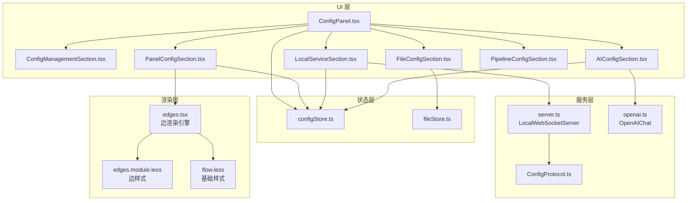
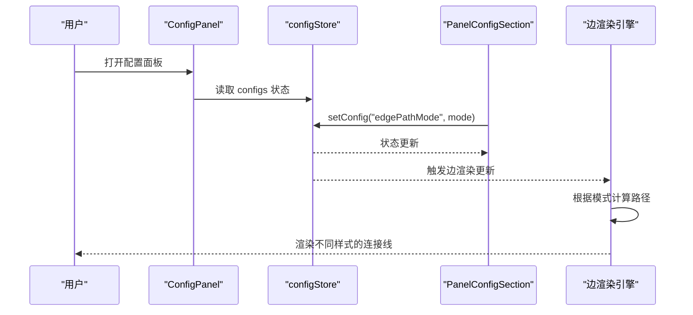
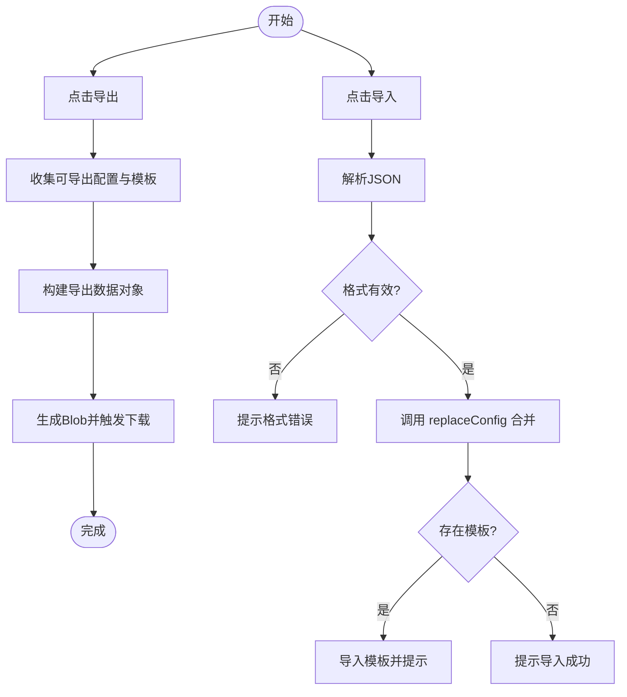
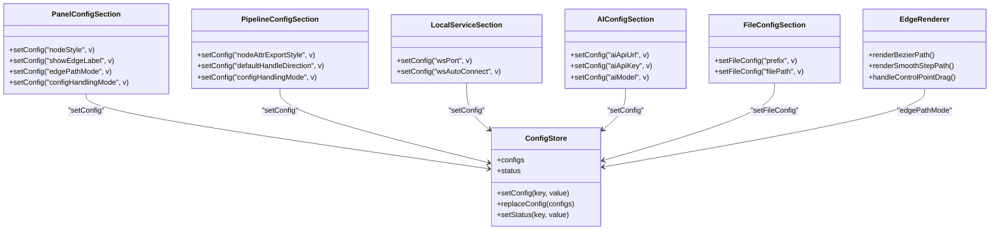

# 配置面板

<cite>
**本文引用的文件列表**
- [ConfigPanel.tsx](file://src/components/panels/main/ConfigPanel.tsx)
- [configStore.ts](file://src/stores/configStore.ts)
- [ConfigManagementSection.tsx](file://src/components/panels/config/ConfigManagementSection.tsx)
- [PanelConfigSection.tsx](file://src/components/panels/config/PanelConfigSection.tsx)
- [FileConfigSection.tsx](file://src/components/panels/config/FileConfigSection.tsx)
- [LocalServiceSection.tsx](file://src/components/panels/config/LocalServiceSection.tsx)
- [AIConfigSection.tsx](file://src/components/panels/config/AIConfigSection.tsx)
- [PipelineConfigSection.tsx](file://src/components/panels/config/PipelineConfigSection.tsx)
- [server.ts](file://src/services/server.ts)
- [openai.ts](file://src/utils/openai.ts)
- [fileStore.ts](file://src/stores/fileStore.ts)
- [ConfigProtocol.ts](file://src/services/protocols/ConfigProtocol.ts)
- [BackendConfigModal.tsx](file://src/components/modals/BackendConfigModal.tsx)
- [ConfigPanel.module.less](file://src/styles/ConfigPanel.module.less)
- [edges.tsx](file://src/components/flow/edges.tsx)
- [edges.module.less](file://src/styles/edges.module.less)
- [flow.less](file://src/styles/flow.less)
</cite>

## 目录
1. [简介](#简介)
2. [项目结构](#项目结构)
3. [核心组件](#核心组件)
4. [架构总览](#架构总览)
5. [详细组件分析](#详细组件分析)
6. [依赖关系分析](#依赖关系分析)
7. [性能考量](#性能考量)
8. [故障排查指南](#故障排查指南)
9. [结论](#结论)
10. [附录](#附录)

## 简介
本文件面向"配置面板"的使用者与开发者，系统性阐述其整体架构、五大配置区域的功能边界、数据流与状态管理机制、表单验证与错误处理策略，并提供扩展开发指南。配置面板负责统一管理全局配置、面板布局与显示、文件扫描与路径、本地服务连接与参数、以及 AI 服务的 API 密钥与参数，同时提供配置导入导出与版本化管理能力。

**更新** 新增边走线模式配置项，支持曲线和直角两种连接线样式。

## 项目结构
配置面板位于前端工程的组件与状态层，采用模块化组织：
- 面板容器：ConfigPanel.tsx 负责面板的显示与子区域组合
- 子区域：五大配置区域分别封装在独立的 TSX 文件中
- 状态管理：configStore.ts 定义全局配置状态、分类映射与迁移逻辑
- 本地服务：server.ts 提供 WebSocket 通信与协议注册
- AI 服务：openai.ts 提供 OpenAI 兼容接口与历史记录管理
- 文件存储：fileStore.ts 负责本地持久化与与后端交互
- 后端配置：ConfigProtocol.ts 与 BackendConfigModal.tsx 提供后端配置的读取、设置与重载
- 边渲染：edges.tsx 和 edges.module.less 负责连接线的渲染与样式

**图表来源**
- [ConfigPanel.tsx:17-77](file://src/components/panels/main/ConfigPanel.tsx#L17-L77)
- [configStore.ts:163-267](file://src/stores/configStore.ts#L163-L267)
- [server.ts:20-333](file://src/services/server.ts#L20-L333)
- [openai.ts:93-393](file://src/utils/openai.ts#L93-L393)
- [fileStore.ts:299-800](file://src/stores/fileStore.ts#L299-L800)
- [ConfigProtocol.ts:46-196](file://src/services/protocols/ConfigProtocol.ts#L46-L196)
- [edges.tsx:235-577](file://src/components/flow/edges.tsx#L235-L577)
- [edges.module.less:1-98](file://src/styles/edges.module.less#L1-L98)
- [flow.less:1-26](file://src/styles/flow.less#L1-L26)

**章节来源**
- [ConfigPanel.tsx:17-77](file://src/components/panels/main/ConfigPanel.tsx#L17-L77)
- [configStore.ts:163-267](file://src/stores/configStore.ts#L163-L267)

## 核心组件
- 配置面板容器：负责渲染五大配置区域、面板显隐控制、WebSocket 端口同步
- 配置存储：集中管理配置项、分类映射、替换合并与迁移逻辑
- 本地服务：封装 WebSocket 连接、握手、路由注册与错误处理
- AI 服务：封装 OpenAI 兼容调用、历史记录与重试机制
- 文件存储：负责本地持久化、与后端保存/加载交互、文件路径与配置联动
- 边渲染引擎：负责连接线的路径计算、样式渲染与交互控制

**章节来源**
- [ConfigPanel.tsx:17-77](file://src/components/panels/main/ConfigPanel.tsx#L17-L77)
- [configStore.ts:163-267](file://src/stores/configStore.ts#L163-L267)
- [server.ts:20-333](file://src/services/server.ts#L20-L333)
- [openai.ts:93-393](file://src/utils/openai.ts#L93-L393)
- [fileStore.ts:299-800](file://src/stores/fileStore.ts#L299-L800)

## 架构总览
配置面板通过 Zustand 管理全局配置状态，各配置区域通过受控组件读写状态；本地服务通过 WebSocket 与后端通信，AI 配置通过 OpenAIChat 调用远端 API；文件配置与文件存储协同实现本地持久化与后端同步。新增的边走线模式配置项通过 edges.tsx 的边渲染引擎实现不同的连接线样式。

**图表来源**
- [ConfigPanel.tsx:28-31](file://src/components/panels/main/ConfigPanel.tsx#L28-L31)
- [PanelConfigSection.tsx:154-181](file://src/components/panels/config/PanelConfigSection.tsx#L154-L181)
- [configStore.ts:220-233](file://src/stores/configStore.ts#L220-L233)
- [edges.tsx:299-344](file://src/components/flow/edges.tsx#L299-L344)

## 详细组件分析

### 配置面板容器（ConfigPanel）
- 功能职责
  - 控制面板显隐状态
  - 渲染五大配置区域
  - 同步 WebSocket 端口到本地服务
  - 打开后端配置弹窗
- 关键交互
  - 通过 useConfigStore 读取 showConfigPanel 与 wsPort
  - useEffect 在端口变化时调用 localServer.setPort
  - 传递 onOpenBackendConfig 回调给 LocalServiceSection

**章节来源**
- [ConfigPanel.tsx:17-77](file://src/components/panels/main/ConfigPanel.tsx#L17-L77)

### 全局配置管理（ConfigManagementSection）
- 功能职责
  - 导出配置：收集可导出配置与自定义模板，生成 JSON 并下载
  - 导入配置：解析 JSON，合并到当前配置，导入自定义模板
  - 版本与时间戳：导出数据包含版本与导出时间
- 数据流
  - 读取 configStore.configs
  - 使用 getExportableConfigs 过滤可导出项
  - 导入时调用 replaceConfig 合并并迁移旧字段

**图表来源**
- [ConfigManagementSection.tsx:27-102](file://src/components/panels/config/ConfigManagementSection.tsx#L27-L102)
- [configStore.ts:64-77](file://src/stores/configStore.ts#L64-L77)

**章节来源**
- [ConfigManagementSection.tsx:15-138](file://src/components/panels/config/ConfigManagementSection.tsx#L15-L138)
- [configStore.ts:64-77](file://src/stores/configStore.ts#L64-L77)

### 面板配置（PanelConfigSection）
- 功能职责
  - 节点风格、边标签、边控制点、自动聚焦、磁吸对齐、焦点不透明度、画布背景、面板模式、内嵌缩放、模板图片、实时画面预览、刷新间隔等
  - **新增** 边走线模式：支持曲线和直角两种连接线样式
- 状态管理
  - 通过 useConfigStore.setConfig(key, value) 更新
  - 部分配置存在联动（如 isExportConfig 与 configHandlingMode）
- **新增功能详情**
  - 边走线模式配置项 edgePathMode，支持 "bezier"（曲线）和 "smoothstep"（直角）两种模式
  - 曲线模式：使用贝塞尔曲线连接节点，线条平滑流畅，支持控制点拖拽调整
  - 直角模式：使用阶梯状折线连接节点，路径规整清晰，无控制点拖拽功能

**章节来源**
- [PanelConfigSection.tsx:10-456](file://src/components/panels/config/PanelConfigSection.tsx#L10-L456)
- [configStore.ts:212-225](file://src/stores/configStore.ts#L212-L225)
- [configStore.ts:95-97](file://src/stores/configStore.ts#L95-L97)
- [configStore.ts:128-129](file://src/stores/configStore.ts#L128-L129)

### 文件配置（FileConfigSection）
- 功能职责
  - 节点前缀：防止跨文件节点名冲突
  - 文件路径：标识本地文件以便与本地服务通信
- 状态管理
  - 通过 useFileStore.setFileConfig 更新当前文件配置
  - 节点前缀变更时触发重复节点标签检查

**章节来源**
- [FileConfigSection.tsx:10-75](file://src/components/panels/config/FileConfigSection.tsx#L10-L75)
- [fileStore.ts:363-370](file://src/stores/fileStore.ts#L363-L370)

### 本地服务配置（LocalServiceSection）
- 功能职责
  - 打开后端配置弹窗（需先连接本地服务）
  - 端口设置、自动连接、文件自动重载
- 通信机制
  - 通过 localServer.setPort 同步端口
  - 通过 ConfigProtocol 与后端交互

**章节来源**
- [LocalServiceSection.tsx:15-144](file://src/components/panels/config/LocalServiceSection.tsx#L15-L144)
- [server.ts:67-74](file://src/services/server.ts#L67-L74)
- [ConfigProtocol.ts:128-161](file://src/services/protocols/ConfigProtocol.ts#L128-L161)

### AI 配置（AIConfigSection）
- 功能职责
  - API URL、API Key、模型名称
  - 测试连接：使用 OpenAIChat 发送测试消息
- 安全与提示
  - 明文存储于浏览器 LocalStorage 的安全提示
  - 跨域限制的建议

**章节来源**
- [AIConfigSection.tsx:11-148](file://src/components/panels/config/AIConfigSection.tsx#L11-L148)
- [openai.ts:115-129](file://src/utils/openai.ts#L115-L129)

### Pipeline 配置（PipelineConfigSection）
- 功能职责
  - 节点属性导出形式、默认端点方向、一键应用端点方向、导出默认识别/动作、导出版本、忽略字段校验、JSON 缩进、配置处理方案
- 交互增强
  - 一键应用到所有节点的端点方向

**章节来源**
- [PipelineConfigSection.tsx:13-274](file://src/components/panels/config/PipelineConfigSection.tsx#L13-L274)
- [configStore.ts:212-225](file://src/stores/configStore.ts#L212-L225)

### 后端配置弹窗（BackendConfigModal）
- 功能职责
  - 读取后端配置、保存配置、重载配置、重启服务
  - 支持 Wails 环境下的根目录同步
- 数据结构
  - 服务器、文件、日志、MaaFramework 四大块配置

**章节来源**
- [BackendConfigModal.tsx:38-473](file://src/components/modals/BackendConfigModal.tsx#L38-L473)
- [ConfigProtocol.ts:8-40](file://src/services/protocols/ConfigProtocol.ts#L8-L40)

### 边渲染引擎（edges.tsx）
- 功能职责
  - **新增** 根据 edgePathMode 配置渲染不同样式的连接线
  - 支持贝塞尔曲线和直角路径两种模式
  - 提供控制点拖拽功能（仅曲线模式）
- 实现细节
  - 贝塞尔模式：使用 getStandardBezierPath 或 getCustomBezierPath 计算路径
  - 直角模式：使用 getSmoothStepEdgePath 计算阶梯状路径
  - 控制点拖拽：通过 mouse 事件监听实现路径偏移调整

**章节来源**
- [edges.tsx:235-577](file://src/components/flow/edges.tsx#L235-L577)
- [edges.tsx:206-233](file://src/components/flow/edges.tsx#L206-L233)
- [edges.tsx:299-344](file://src/components/flow/edges.tsx#L299-L344)

## 依赖关系分析
- 配置分类映射：configStore.ts 中的 configCategoryMap 将配置项归类到 panel、pipeline、communication、ai，用于导出过滤
- 状态耦合：PanelConfigSection 与 PipelineConfigSection 通过 setConfig 联动（如 isExportConfig 与 configHandlingMode）
- 本地服务耦合：LocalServiceSection 依赖 server.ts 的 LocalWebSocketServer，ConfigProtocol 作为协议层
- AI 耦合：AIConfigSection 依赖 openai.ts 的 OpenAIChat，读取配置存储中的 AI 参数
- 文件耦合：FileConfigSection 与 fileStore.ts 协同，FileConfigSection 通过 setFileConfig 更新，fileStore.ts 通过 setFileConfig 更新当前文件配置
- **新增依赖**：边渲染引擎依赖 configStore 中的 edgePathMode 配置进行样式渲染

**图表来源**
- [configStore.ts:145-161](file://src/stores/configStore.ts#L145-L161)
- [PanelConfigSection.tsx:47-47](file://src/components/panels/config/PanelConfigSection.tsx#L47-L47)
- [PipelineConfigSection.tsx:33-33](file://src/components/panels/config/PipelineConfigSection.tsx#L33-L33)
- [LocalServiceSection.tsx:24-24](file://src/components/panels/config/LocalServiceSection.tsx#L24-L24)
- [AIConfigSection.tsx:15-15](file://src/components/panels/config/AIConfigSection.tsx#L15-L15)
- [FileConfigSection.tsx:12-12](file://src/components/panels/config/FileConfigSection.tsx#L12-L12)
- [edges.tsx:235-577](file://src/components/flow/edges.tsx#L235-L577)

## 性能考量
- 配置联动：configStore 中对 isExportConfig 与 configHandlingMode 的双向同步避免了重复渲染
- 端口同步：ConfigPanel 在端口变化时仅调用 localServer.setPort，避免不必要的连接重建
- 导出体积：ConfigManagementSection 仅导出可导出配置与模板，减少冗余数据
- AI 请求：OpenAIChat 支持重试与取消，避免长时间阻塞 UI
- **新增性能考量**：边渲染引擎根据 edgePathMode 选择不同的路径计算算法，直角模式性能更优，曲线模式支持动态调整但有额外计算开销

**章节来源**
- [configStore.ts:212-225](file://src/stores/configStore.ts#L212-L225)
- [ConfigPanel.tsx:28-31](file://src/components/panels/main/ConfigPanel.tsx#L28-L31)
- [ConfigManagementSection.tsx:27-58](file://src/components/panels/config/ConfigManagementSection.tsx#L27-L58)
- [openai.ts:169-243](file://src/utils/openai.ts#L169-L243)
- [edges.tsx:206-233](file://src/components/flow/edges.tsx#L206-L233)

## 故障排查指南
- 本地服务连接失败
  - 检查端口是否正确、服务是否启动
  - 查看连接超时与错误提示，必要时查看文档链接
- 协议版本不匹配
  - 前端与后端协议版本需一致，不匹配时会提示并断开连接
- 配置导入失败
  - 确认 JSON 格式有效，包含 configs 对象
  - 模板导入失败会提示但不影响配置导入
- AI 连接问题
  - 确认 API URL、API Key、模型名称均已配置
  - 注意浏览器跨域限制，建议使用支持 CORS 的 API 中转服务
- 文件保存失败
  - 确认已连接本地服务，检查保存模式与路径
  - 本地存储空间不足时会提示清理
- **新增故障排查**：边走线模式异常
  - 确认 edgePathMode 配置值为 "bezier" 或 "smoothstep"
  - 曲线模式下控制点拖拽无效可能是浏览器兼容性问题
  - 直角模式下路径不规整可能与节点位置或布局有关

**章节来源**
- [server.ts:104-251](file://src/services/server.ts#L104-L251)
- [ConfigProtocol.ts:38-98](file://src/services/protocols/ConfigProtocol.ts#L38-L98)
- [ConfigManagementSection.tsx:60-102](file://src/components/panels/config/ConfigManagementSection.tsx#L60-L102)
- [AIConfigSection.tsx:120-142](file://src/components/panels/config/AIConfigSection.tsx#L120-L142)
- [fileStore.ts:605-778](file://src/stores/fileStore.ts#L605-L778)

## 结论
配置面板通过清晰的区域划分、完善的联动与迁移逻辑、稳健的本地服务与 AI 交互，提供了易用且可扩展的配置管理体验。其模块化设计便于新增配置项与协议扩展，同时具备良好的错误处理与用户体验反馈。新增的边走线模式配置项进一步增强了用户对连接线样式的控制能力，提供了更丰富的可视化表达方式。

## 附录

### 配置面板的数据流与状态管理机制
- 读取：各区域通过 useConfigStore/useFileStore 读取状态
- 修改：通过 setConfig 或 setFileConfig 更新状态
- 保存：configStore.replaceConfig 合并并迁移旧字段；fileStore.localSave 本地持久化
- 同步：ConfigPanel 在端口变化时同步到本地服务；AI 配置通过 OpenAIChat 与后端交互
- **新增同步**：边走线模式配置通过 edges.tsx 的边渲染引擎实时响应配置变化

**章节来源**
- [configStore.ts:226-254](file://src/stores/configStore.ts#L226-L254)
- [fileStore.ts:227-268](file://src/stores/fileStore.ts#L227-L268)
- [ConfigPanel.tsx:28-31](file://src/components/panels/main/ConfigPanel.tsx#L28-L31)
- [openai.ts:115-129](file://src/utils/openai.ts#L115-L129)

### 各配置区域功能要点
- 配置管理区域：导出/导入配置与模板，版本与时间戳记录
- 面板配置区域：界面布局、显示选项、实时画面、磁吸对齐等，**新增边走线模式配置**
- 文件配置区域：节点前缀与文件路径
- 本地服务配置区域：后端配置弹窗、端口、自动连接、文件自动重载
- AI 配置区域：API URL、API Key、模型名称与测试连接

**章节来源**
- [ConfigManagementSection.tsx:104-135](file://src/components/panels/config/ConfigManagementSection.tsx#L104-L135)
- [PanelConfigSection.tsx:52-451](file://src/components/panels/config/PanelConfigSection.tsx#L52-L451)
- [FileConfigSection.tsx:14-71](file://src/components/panels/config/FileConfigSection.tsx#L14-L71)
- [LocalServiceSection.tsx:29-139](file://src/components/panels/config/LocalServiceSection.tsx#L29-L139)
- [AIConfigSection.tsx:22-143](file://src/components/panels/config/AIConfigSection.tsx#L22-L143)

### 表单验证与错误处理策略
- 导入校验：检查 JSON 格式与 configs 对象有效性
- 本地服务：连接超时、错误与断开均有明确提示与引导
- AI 配置：必填项校验与跨域提示
- 文件保存：保存模式与路径校验、ACK 等待与错误回退
- **新增验证策略**：边走线模式配置值验证，确保为 "bezier" 或 "smoothstep"

**章节来源**
- [ConfigManagementSection.tsx:60-102](file://src/components/panels/config/ConfigManagementSection.tsx#L60-L102)
- [server.ts:104-251](file://src/services/server.ts#L104-L251)
- [openai.ts:121-129](file://src/utils/openai.ts#L121-L129)
- [fileStore.ts:605-778](file://src/stores/fileStore.ts#L605-L778)

### 扩展开发指南：如何添加新的配置项
- 步骤
  - 在 configStore.ts 的 configs 类型与初始值中添加新字段
  - 在 configCategoryMap 中标注所属分类（panel/pipeline/communication/ai）
  - 在对应配置区域组件中添加受控输入与 setConfig 调用
  - 如需导出，确保 getExportableConfigs 能识别该字段
  - 如涉及后端交互，补充协议与服务层对接
  - **新增步骤**：如涉及渲染层，需要在相应的渲染组件中处理配置变化
- 注意事项
  - 若存在联动关系（如 isExportConfig 与 configHandlingMode），在 setConfig 中处理同步
  - 为新字段提供合理的默认值与范围约束
  - 在 UI 中提供清晰的提示与帮助信息
  - **新增注意事项**：渲染层配置需要考虑性能影响和兼容性

**章节来源**
- [configStore.ts:95-161](file://src/stores/configStore.ts#L95-L161)
- [configStore.ts:24-62](file://src/stores/configStore.ts#L24-L62)
- [configStore.ts:212-225](file://src/stores/configStore.ts#L212-L225)
- [PanelConfigSection.tsx:47-47](file://src/components/panels/config/PanelConfigSection.tsx#L47-L47)
- [PipelineConfigSection.tsx:33-33](file://src/components/panels/config/PipelineConfigSection.tsx#L33-L33)
- [LocalServiceSection.tsx:24-24](file://src/components/panels/config/LocalServiceSection.tsx#L24-L24)
- [AIConfigSection.tsx:15-15](file://src/components/panels/config/AIConfigSection.tsx#L15-L15)

### 边走线模式技术实现详解
- 配置类型定义：EdgePathMode 类型支持 "bezier" 和 "smoothstep" 两种值
- 渲染算法选择：根据 edgePathMode 值选择不同的路径计算函数
- 用户交互支持：曲线模式支持控制点拖拽调整路径形状
- 性能优化：直角模式使用更简单的路径计算，性能优于曲线模式

**章节来源**
- [configStore.ts:95-97](file://src/stores/configStore.ts#L95-L97)
- [configStore.ts:128-129](file://src/stores/configStore.ts#L128-L129)
- [edges.tsx:206-233](file://src/components/flow/edges.tsx#L206-L233)
- [edges.tsx:299-344](file://src/components/flow/edges.tsx#L299-L344)
- [edges.tsx:565-577](file://src/components/flow/edges.tsx#L565-L577)