# 面板配置区域

<cite>
**本文档引用的文件**
- [SettingsPanel.tsx](file://src/components/panels/settings/SettingsPanel.tsx)
- [settingsDefinitions.ts](file://src/components/panels/settings/settingsDefinitions.ts)
- [ConfigItemRenderer.tsx](file://src/components/panels/settings/ConfigItemRenderer.tsx)
- [configStore.ts](file://src/stores/configStore.ts)
- [DraggablePanel.tsx](file://src/components/panels/common/DraggablePanel.tsx)
- [panelPosition.ts](file://src/utils/panelPosition.ts)
- [FieldPanel.tsx](file://src/components/panels/main/FieldPanel.tsx)
- [LiveScreenPanel.tsx](file://src/components/panels/main/LiveScreenPanel.tsx)
- [ThemeContext.tsx](file://src/contexts/ThemeContext.tsx)
- [edges.tsx](file://src/components/flow/edges.tsx)
- [avoidanceUtils.ts](file://src/core/avoidanceUtils.ts)
- [SettingsPanel.module.less](file://src/styles/panels/SettingsPanel.module.less)
- [edges.module.less](file://src/styles/edges.module.less)
- [global.less](file://src/styles/global.less)
- [useCanvasViewport.ts](file://src/hooks/useCanvasViewport.ts)
</cite>

## 更新摘要
**变更内容**
- 重构面板配置区域：旧的PanelConfigSection组件已被新的统一设置系统替代
- 新的SettingsPanel组件提供统一的配置管理界面
- 所有面板配置现在通过SettingsPanel进行管理，支持分类导航和搜索功能
- 新增配置项定义系统，支持多种控件类型和条件显隐
- 保留原有的边路径模式配置和智能避让算法功能

## 目录
1. [简介](#简介)
2. [项目结构](#项目结构)
3. [核心组件](#核心组件)
4. [架构总览](#架构总览)
5. [详细组件分析](#详细组件分析)
6. [依赖关系分析](#依赖关系分析)
7. [性能考量](#性能考量)
8. [故障排查指南](#故障排查指南)
9. [结论](#结论)
10. [附录](#附录)

## 简介
本章节面向"面板配置区域"的设计与实现，系统性阐述界面布局控制、面板显示选项与用户偏好设置，覆盖以下方面：
- **重构后的统一设置系统**：新的SettingsPanel组件替代了旧的PanelConfigSection，提供统一的配置管理界面
- 面板位置、大小、可见性与排列顺序的配置管理
- 可拖拽面板系统的实现原理（拖拽行为、停靠位置与布局算法）
- 界面主题与外观定制（颜色方案、字体与视觉效果）
- **新增** 配置项定义系统，支持多种控件类型和条件显隐
- **新增** 分类导航和搜索功能，提升配置管理效率
- 用户体验优化（响应式布局与多屏幕适配）

## 项目结构
面板配置区域由"设置面板系统""字段面板""实时画面面板""边路径系统"以及"主题上下文"共同构成，配合全局样式与工具函数，形成统一的布局与交互体系。

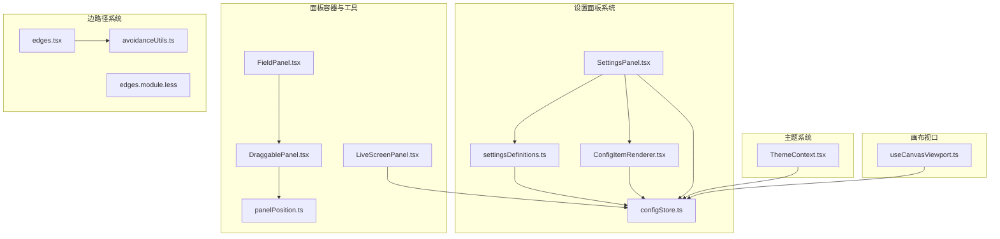

**图表来源**
- [SettingsPanel.tsx:1-175](file://src/components/panels/settings/SettingsPanel.tsx#L1-L175)
- [settingsDefinitions.ts:1-619](file://src/components/panels/settings/settingsDefinitions.ts#L1-L619)
- [ConfigItemRenderer.tsx:1-254](file://src/components/panels/settings/ConfigItemRenderer.tsx#L1-L254)
- [configStore.ts:1-355](file://src/stores/configStore.ts#L1-L355)
- [DraggablePanel.tsx:1-178](file://src/components/panels/common/DraggablePanel.tsx#L1-L178)
- [panelPosition.ts:1-263](file://src/utils/panelPosition.ts#L1-L263)
- [FieldPanel.tsx:1-524](file://src/components/panels/main/FieldPanel.tsx#L1-L524)
- [LiveScreenPanel.tsx:1-147](file://src/components/panels/main/LiveScreenPanel.tsx#L1-L147)
- [edges.tsx:1-675](file://src/components/flow/edges.tsx#L1-L675)
- [avoidanceUtils.ts:1-777](file://src/core/avoidanceUtils.ts#L1-L777)
- [ThemeContext.tsx:1-68](file://src/contexts/ThemeContext.tsx#L1-L68)
- [useCanvasViewport.ts:1-307](file://src/hooks/useCanvasViewport.ts#L1-L307)

## 核心组件
- **重构后的设置面板**（SettingsPanel）：全新的统一配置管理界面，替代了旧的PanelConfigSection组件，提供分类导航、搜索功能和条件显隐支持。
- **配置项定义系统**（settingsDefinitions）：声明式配置项定义，支持多种控件类型（switch、select、inputNumber、input、inputPassword、slider、custom）和条件显隐逻辑。
- **通用配置项渲染器**（ConfigItemRenderer）：根据配置项定义动态渲染对应的控件，支持修改状态跟踪和默认值重置功能。
- 配置存储（configStore）：集中管理配置项、状态与持久化策略，包含配置分类映射、默认值、联动逻辑与导出能力。
- 可拖拽面板（DraggablePanel）：封装面板拖拽行为、位置存储与边界约束，支持固定/拖动两种模式。
- 面板位置工具（panelPosition）：提供画布坐标与屏幕坐标转换、视口边界约束、嵌入跟随模式位置计算与节流函数。
- 字段面板（FieldPanel）：根据面板模式渲染固定/拖动/内嵌三种形态，结合 DraggablePanel 与内嵌缩放比例。
- 实时画面面板（LiveScreenPanel）：基于连接状态与面板可见性条件渲染，按刷新周期定时请求截图。
- 边路径算法（edges.tsx）：实现三种边路径模式的渲染逻辑，包括避让算法的集成。
- 智能避让算法（avoidanceUtils.ts）：提供节点避让路径计算、自循环路径处理和递归避让策略。
- 主题上下文（ThemeContext）：提供深色/浅色主题切换与同步至 DarkReader。

**章节来源**
- [SettingsPanel.tsx:35-175](file://src/components/panels/settings/SettingsPanel.tsx#L35-L175)
- [settingsDefinitions.ts:15-619](file://src/components/panels/settings/settingsDefinitions.ts#L15-L619)
- [ConfigItemRenderer.tsx:22-254](file://src/components/panels/settings/ConfigItemRenderer.tsx#L22-L254)
- [configStore.ts:168-355](file://src/stores/configStore.ts#L168-L355)
- [DraggablePanel.tsx:37-178](file://src/components/panels/common/DraggablePanel.tsx#L37-L178)
- [panelPosition.ts:15-263](file://src/utils/panelPosition.ts#L15-L263)
- [FieldPanel.tsx:185-524](file://src/components/panels/main/FieldPanel.tsx#L185-L524)
- [LiveScreenPanel.tsx:13-147](file://src/components/panels/main/LiveScreenPanel.tsx#L13-L147)
- [edges.tsx:1-675](file://src/components/flow/edges.tsx#L1-L675)
- [avoidanceUtils.ts:1-777](file://src/core/avoidanceUtils.ts#L1-L777)
- [ThemeContext.tsx:22-68](file://src/contexts/ThemeContext.tsx#L22-L68)

## 架构总览
配置区域采用"设置面板 + 配置项定义 + 通用渲染器 + 配置存储 + 面板组件 + 工具函数 + 主题上下文 + 边路径系统"的分层架构，配置项通过声明式定义系统管理，UI 组件通过 Ant Design 控件绑定状态，工具函数负责坐标转换与布局计算，主题上下文负责外观切换，边路径系统提供智能路径规划功能。

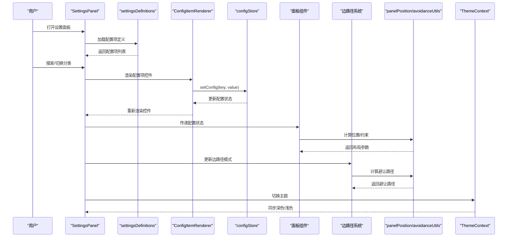

**图表来源**
- [SettingsPanel.tsx:59-94](file://src/components/panels/settings/SettingsPanel.tsx#L59-L94)
- [settingsDefinitions.ts:62-602](file://src/components/panels/settings/settingsDefinitions.ts#L62-L602)
- [ConfigItemRenderer.tsx:24-164](file://src/components/panels/settings/ConfigItemRenderer.tsx#L24-L164)
- [configStore.ts:252-274](file://src/stores/configStore.ts#L252-L274)
- [DraggablePanel.tsx:52-146](file://src/components/panels/common/DraggablePanel.tsx#L52-L146)
- [panelPosition.ts:56-157](file://src/utils/panelPosition.ts#L56-L157)
- [edges.tsx:361-427](file://src/components/flow/edges.tsx#L361-L427)
- [avoidanceUtils.ts:379-576](file://src/core/avoidanceUtils.ts#L379-L576)
- [ThemeContext.tsx:27-45](file://src/contexts/ThemeContext.tsx#L27-L45)

## 详细组件分析

### 统一设置系统架构
- **设置面板**（SettingsPanel）：全新的配置管理界面，支持分类导航、搜索功能和条件显隐，替代了旧的PanelConfigSection组件。
- **配置项定义系统**：声明式配置项定义，支持多种控件类型和条件显隐逻辑，提供统一的配置管理接口。
- **通用配置项渲染器**：根据配置项定义动态渲染对应的控件，支持修改状态跟踪和默认值重置功能。
- **分类导航**：支持导出、节点、连接、画布、组件、本地服务、AI、管理八个分类的导航。
- **搜索功能**：支持跨分类搜索配置项，提升配置管理效率。

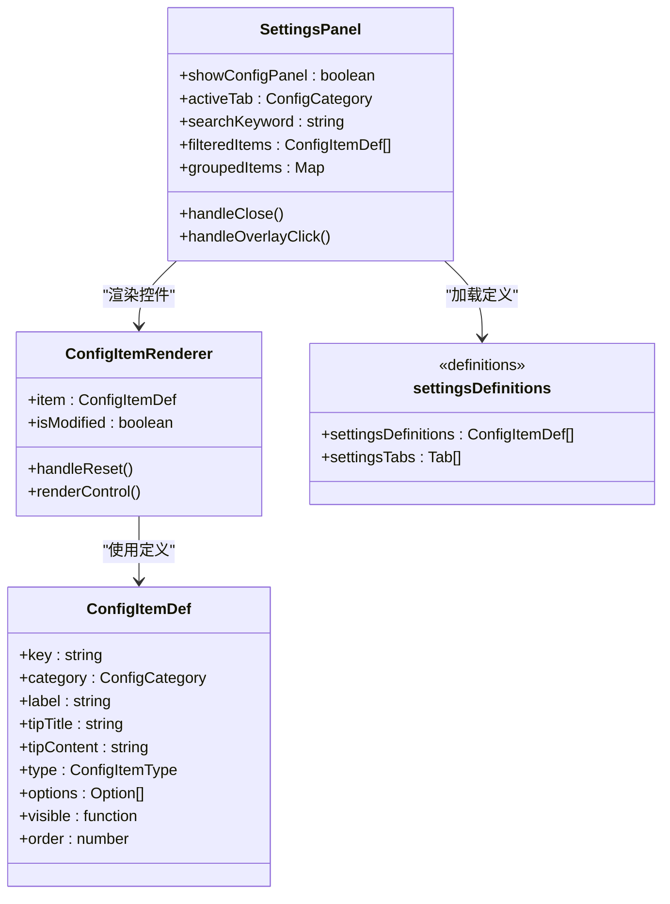

**图表来源**
- [SettingsPanel.tsx:35-94](file://src/components/panels/settings/SettingsPanel.tsx#L35-L94)
- [settingsDefinitions.ts:15-59](file://src/components/panels/settings/settingsDefinitions.ts#L15-L59)
- [ConfigItemRenderer.tsx:17-44](file://src/components/panels/settings/ConfigItemRenderer.tsx#L17-L44)

**章节来源**
- [SettingsPanel.tsx:35-175](file://src/components/panels/settings/SettingsPanel.tsx#L35-L175)
- [settingsDefinitions.ts:62-619](file://src/components/panels/settings/settingsDefinitions.ts#L62-L619)
- [ConfigItemRenderer.tsx:22-254](file://src/components/panels/settings/ConfigItemRenderer.tsx#L22-L254)

### 配置项定义系统
- **控件类型支持**：支持switch、select、inputNumber、input、inputPassword、slider、button、custom八种控件类型。
- **条件显隐**：通过visible函数实现动态显隐，如内嵌面板缩放比例仅在inline模式下显示。
- **排序权重**：通过order属性控制配置项的显示顺序，数值越小越靠前。
- **分类组织**：按功能分类组织配置项，便于管理和查找。
- **提示系统**：每个配置项都有详细的tipTitle和tipContent，提供完整的使用说明。

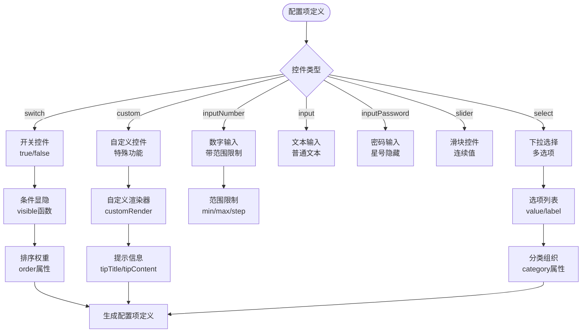

**图表来源**
- [settingsDefinitions.ts:4-59](file://src/components/panels/settings/settingsDefinitions.ts#L4-L59)
- [settingsDefinitions.ts:62-602](file://src/components/panels/settings/settingsDefinitions.ts#L62-L602)

**章节来源**
- [settingsDefinitions.ts:15-619](file://src/components/panels/settings/settingsDefinitions.ts#L15-L619)

### 通用配置项渲染器
- **动态控件渲染**：根据配置项定义的type属性动态渲染对应的Ant Design控件。
- **修改状态跟踪**：自动比较当前值与默认值，显示修改标记。
- **默认值重置**：提供一键重置为默认值的功能。
- **自定义渲染**：支持custom类型的配置项，通过customRender属性指定自定义渲染器。
- **条件显隐**：根据visible函数动态控制配置项的显示与隐藏。

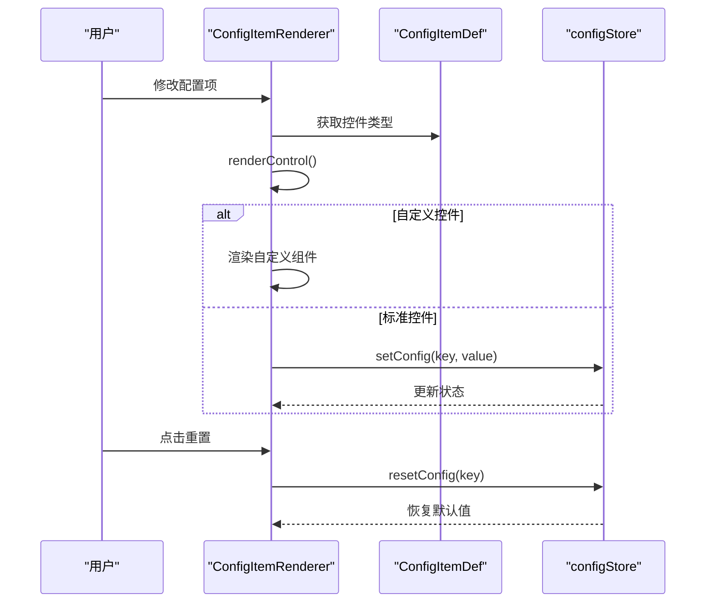

**图表来源**
- [ConfigItemRenderer.tsx:46-164](file://src/components/panels/settings/ConfigItemRenderer.tsx#L46-L164)
- [ConfigItemRenderer.tsx:42-44](file://src/components/panels/settings/ConfigItemRenderer.tsx#L42-L44)

**章节来源**
- [ConfigItemRenderer.tsx:22-254](file://src/components/panels/settings/ConfigItemRenderer.tsx#L22-L254)

### 配置存储与分类
- 配置分类映射：将配置项归类到"面板""管道""通信""AI"，便于导出与管理。
- 默认值与联动：如"导出配置"与"配置处理模式"双向同步；内嵌面板缩放比例范围限制。
- 导出能力：按分类过滤可导出配置，避免敏感或平台特定项泄露。
- 边路径模式配置：默认使用贝塞尔曲线模式，支持三种路径模式切换。

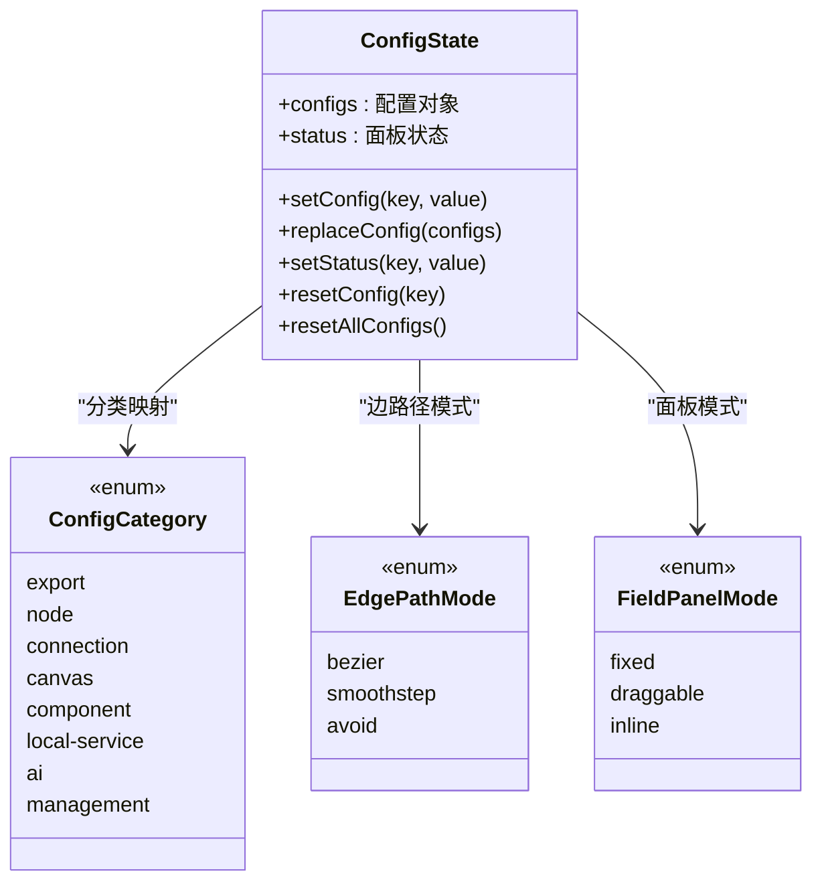

**图表来源**
- [configStore.ts:18-27](file://src/stores/configStore.ts#L18-L27)
- [configStore.ts:109-110](file://src/stores/configStore.ts#L109-L110)
- [configStore.ts:29-30](file://src/stores/configStore.ts#L29-L30)
- [configStore.ts:252-354](file://src/stores/configStore.ts#L252-L354)

**章节来源**
- [configStore.ts:168-355](file://src/stores/configStore.ts#L168-L355)

### 边路径模式系统
- 边路径模式配置：提供曲线、直角、避让三种模式选择，通过下拉菜单配置。
- 智能避让算法：自动计算节点间的最优路径，避免路径交叉和重叠。
- 路径模式切换：根据用户选择动态切换边的渲染模式，支持实时预览。
- 控制点拖拽：仅在贝塞尔模式下显示控制点，支持手动调整路径形状。

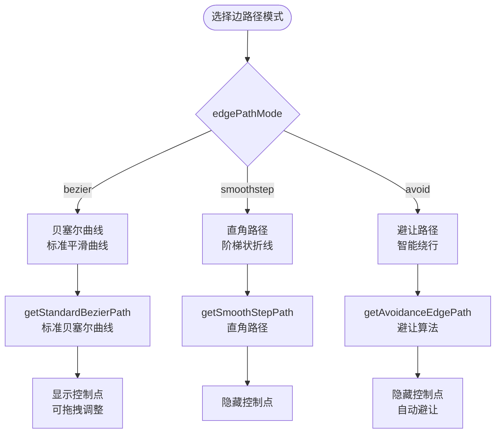

**图表来源**
- [settingsDefinitions.ts:260-275](file://src/components/panels/settings/settingsDefinitions.ts#L260-L275)
- [edges.tsx:361-427](file://src/components/flow/edges.tsx#L361-L427)
- [edges.tsx:647-660](file://src/components/flow/edges.tsx#L647-L660)

**章节来源**
- [settingsDefinitions.ts:260-275](file://src/components/panels/settings/settingsDefinitions.ts#L260-L275)
- [edges.tsx:361-427](file://src/components/flow/edges.tsx#L361-L427)
- [edges.tsx:647-660](file://src/components/flow/edges.tsx#L647-L660)

### 智能避让算法实现
- 避让算法核心：基于节点边界框计算最优路径，自动绕过障碍物。
- 递归避让策略：当路径被阻塞时，自动寻找替代路径并递归计算剩余部分。
- 自循环路径处理：特殊处理节点自连接的情况，提供多种绕行方案。
- 配置参数：支持最大递归深度、避让边距、转角圆角半径等参数调优。

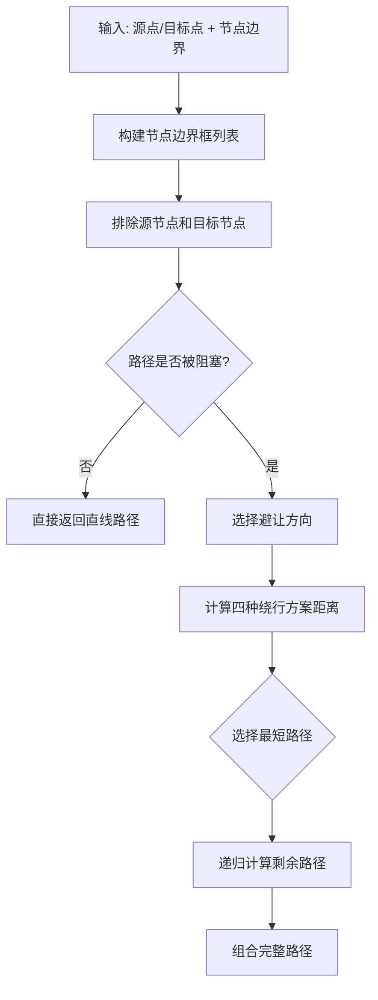

**图表来源**
- [avoidanceUtils.ts:379-576](file://src/core/avoidanceUtils.ts#L379-L576)
- [avoidanceUtils.ts:581-614](file://src/core/avoidanceUtils.ts#L581-L614)

**章节来源**
- [avoidanceUtils.ts:19-35](file://src/core/avoidanceUtils.ts#L19-L35)
- [avoidanceUtils.ts:379-576](file://src/core/avoidanceUtils.ts#L379-L576)
- [avoidanceUtils.ts:741-777](file://src/core/avoidanceUtils.ts#L741-L777)

### 可拖拽面板系统
- 位置存储：使用 zustand 存储面板位置，拖拽结束后写回 store。
- 拖拽行为：仅标题区域可拖拽，拦截按钮点击；拖拽过程中更新局部状态，释放时合并到 store。
- 边界约束：限制面板在窗口内的可见范围，防止完全移出可视区。
- 模式切换：固定模式直接定位，拖动模式保持拖拽后位置，内嵌模式不适用。

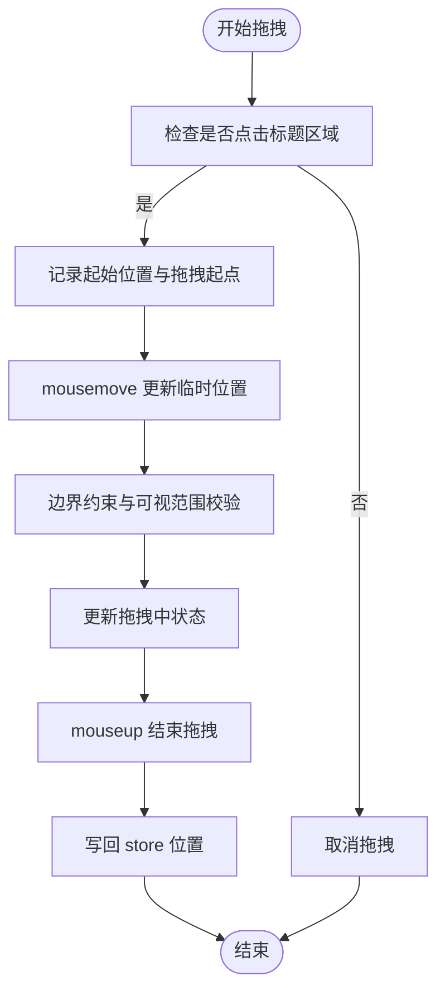

**图表来源**
- [DraggablePanel.tsx:84-146](file://src/components/panels/common/DraggablePanel.tsx#L84-L146)
- [DraggablePanel.tsx:149-159](file://src/components/panels/common/DraggablePanel.tsx#L149-L159)

**章节来源**
- [DraggablePanel.tsx:37-178](file://src/components/panels/common/DraggablePanel.tsx#L37-L178)

### 面板位置计算与嵌入跟随
- 坐标转换：提供画布坐标与屏幕坐标互转，考虑视口缩放与平移。
- 边界约束：限制面板在视口内的可见区域，保证最小可见宽高。
- 嵌入跟随：根据目标元素或连接中点计算相对 .workspace 的坐标，优先右侧显示，溢出时尝试左侧或调整到容器内。

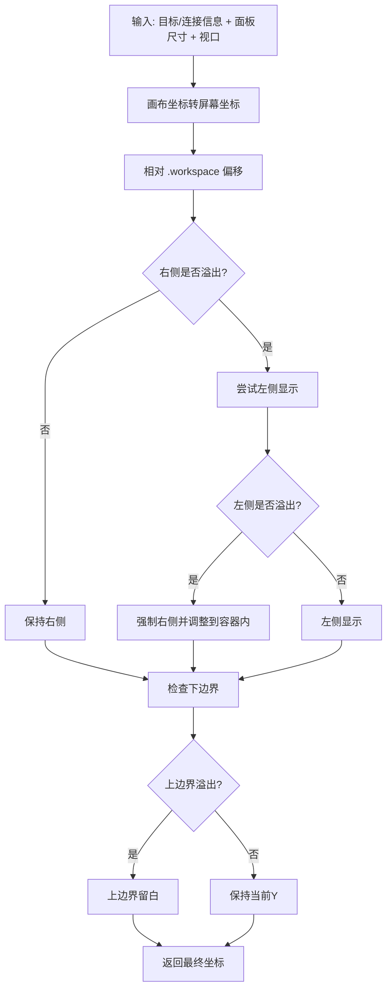

**图表来源**
- [panelPosition.ts:93-157](file://src/utils/panelPosition.ts#L93-L157)
- [panelPosition.ts:171-231](file://src/utils/panelPosition.ts#L171-L231)
- [panelPosition.ts:56-79](file://src/utils/panelPosition.ts#L56-L79)

**章节来源**
- [panelPosition.ts:15-42](file://src/utils/panelPosition.ts#L15-L42)
- [panelPosition.ts:56-79](file://src/utils/panelPosition.ts#L56-L79)
- [panelPosition.ts:93-157](file://src/utils/panelPosition.ts#L93-L157)
- [panelPosition.ts:171-231](file://src/utils/panelPosition.ts#L171-L231)

### 字段面板模式与内嵌缩放
- 模式选择：固定/拖动/内嵌三种模式，分别对应不同渲染路径与交互方式。
- 内嵌缩放：仅在内嵌模式生效，范围 0.5–1.0，用于适配不同分辨率与阅读习惯。
- 与 DraggablePanel 协作：拖动模式下包裹 DraggablePanel，固定/内嵌模式直接渲染。

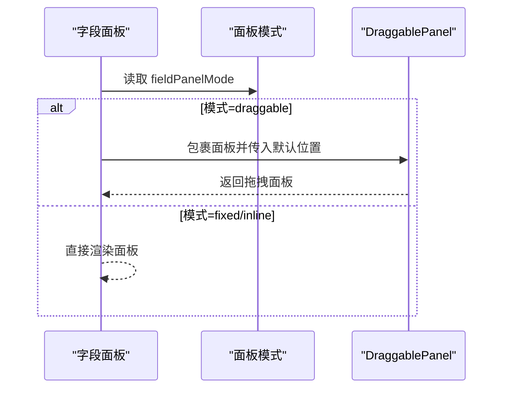

**图表来源**
- [FieldPanel.tsx:502-521](file://src/components/panels/main/FieldPanel.tsx#L502-L521)
- [DraggablePanel.tsx:37-178](file://src/components/panels/common/DraggablePanel.tsx#L37-L178)

**章节来源**
- [FieldPanel.tsx:189-392](file://src/components/panels/main/FieldPanel.tsx#L189-L392)
- [FieldPanel.tsx:502-521](file://src/components/panels/main/FieldPanel.tsx#L502-L521)

### 实时画面面板与可见性控制
- 条件渲染：仅在设备连接、无其他面板遮挡且启用实时画面时显示。
- 刷新策略：基于刷新周期定时请求截图，页面不可见时暂停请求。
- 错误处理：截图失败时显示错误状态，断开连接时清理画面。

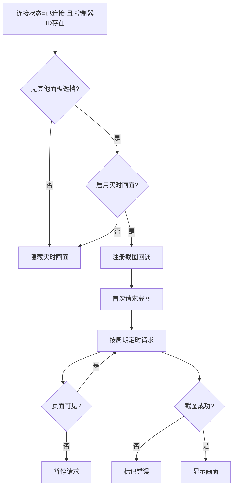

**图表来源**
- [LiveScreenPanel.tsx:48-110](file://src/components/panels/main/LiveScreenPanel.tsx#L48-L110)
- [LiveScreenPanel.tsx:74-101](file://src/components/panels/main/LiveScreenPanel.tsx#L74-L101)

**章节来源**
- [LiveScreenPanel.tsx:13-147](file://src/components/panels/main/LiveScreenPanel.tsx#L13-L147)

### 主题与外观定制
- 主题切换：通过 ThemeContext 提供 toggle/set 方法，同步到 DarkReader，支持亮度、对比度、色相等参数。
- 面板外观：全局样式定义面板基础样式与过渡动画，拖动模式下提供抓取/抓握光标反馈。
- 配置项：画布背景模式（护眼/纯白），节点模板图片显示开关，节点详细字段渲染开关等。

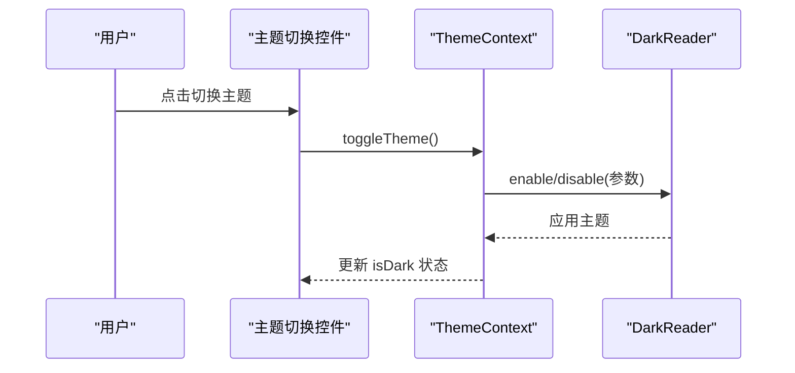

**图表来源**
- [ThemeContext.tsx:27-45](file://src/contexts/ThemeContext.tsx#L27-L45)

**章节来源**
- [ThemeContext.tsx:22-68](file://src/contexts/ThemeContext.tsx#L22-L68)
- [settingsDefinitions.ts:433-442](file://src/components/panels/settings/settingsDefinitions.ts#L433-L442)
- [global.less:21-94](file://src/styles/global.less#L21-L94)

### 设置面板与样式
- **重构后的设置面板**：全新的统一配置管理界面，替代了旧的PanelConfigSection组件。
- **分类导航**：支持导出、节点、连接、画布、组件、本地服务、AI、管理八个分类的导航。
- **搜索功能**：支持跨分类搜索配置项，提升配置管理效率。
- **样式规范**：模块化 Less 文件定义面板宽度、头部布局、列表项样式与全局样式覆盖。

**章节来源**
- [SettingsPanel.tsx:96-175](file://src/components/panels/settings/SettingsPanel.tsx#L96-L175)
- [settingsDefinitions.ts:604-619](file://src/components/panels/settings/settingsDefinitions.ts#L604-L619)
- [SettingsPanel.module.less](file://src/styles/panels/SettingsPanel.module.less)

## 依赖关系分析
- 设置面板依赖配置项定义系统和配置存储，提供统一的配置管理界面。
- 配置项定义系统依赖配置存储的类型定义，提供声明式的配置项描述。
- 通用配置项渲染器依赖配置项定义和配置存储，动态渲染控件并处理用户交互。
- 配置存储依赖 Ant Design 控件与 zustand，提供强类型的配置项与状态管理。
- DraggablePanel 依赖 zustand 存储位置，依赖 panelPosition 进行坐标转换与约束。
- FieldPanel 依赖 configStore 决定渲染模式，依赖 DraggablePanel 实现拖动模式。
- LiveScreenPanel 依赖 mfw 协议与 configStore 控制可见性与刷新周期。
- ThemeContext 依赖 DarkReader 与 configStore 同步主题状态。
- 边路径系统依赖 avoidanceUtils 进行智能避让计算。

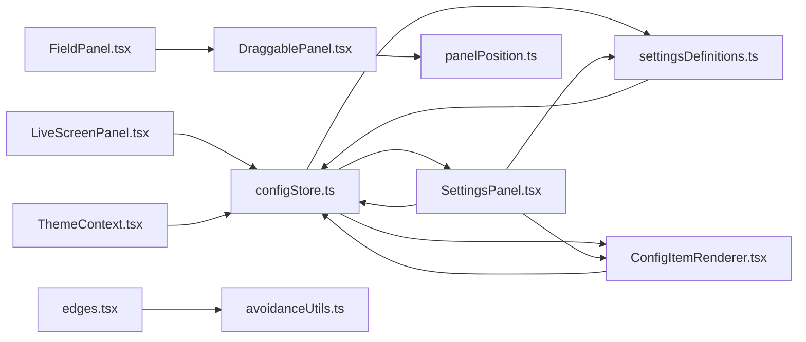

**图表来源**
- [configStore.ts:168-355](file://src/stores/configStore.ts#L168-L355)
- [settingsDefinitions.ts:62-602](file://src/components/panels/settings/settingsDefinitions.ts#L62-L602)
- [SettingsPanel.tsx:16-21](file://src/components/panels/settings/SettingsPanel.tsx#L16-L21)
- [ConfigItemRenderer.tsx:12-15](file://src/components/panels/settings/ConfigItemRenderer.tsx#L12-L15)
- [DraggablePanel.tsx:10-22](file://src/components/panels/common/DraggablePanel.tsx#L10-L22)
- [panelPosition.ts:6-42](file://src/utils/panelPosition.ts#L6-L42)
- [FieldPanel.tsx:189-194](file://src/components/panels/main/FieldPanel.tsx#L189-L194)
- [LiveScreenPanel.tsx:21-26](file://src/components/panels/main/LiveScreenPanel.tsx#L21-L26)
- [ThemeContext.tsx:23-45](file://src/contexts/ThemeContext.tsx#L23-L45)
- [edges.tsx:22-26](file://src/components/flow/edges.tsx#L22-L26)
- [avoidanceUtils.ts:1-7](file://src/core/avoidanceUtils.ts#L1-L7)

**章节来源**
- [configStore.ts:168-355](file://src/stores/configStore.ts#L168-L355)
- [settingsDefinitions.ts:62-602](file://src/components/panels/settings/settingsDefinitions.ts#L62-L602)
- [SettingsPanel.tsx:16-21](file://src/components/panels/settings/SettingsPanel.tsx#L16-L21)
- [ConfigItemRenderer.tsx:12-15](file://src/components/panels/settings/ConfigItemRenderer.tsx#L12-L15)
- [DraggablePanel.tsx:10-22](file://src/components/panels/common/DraggablePanel.tsx#L10-L22)
- [panelPosition.ts:6-42](file://src/utils/panelPosition.ts#L6-L42)
- [FieldPanel.tsx:189-194](file://src/components/panels/main/FieldPanel.tsx#L189-L194)
- [LiveScreenPanel.tsx:21-26](file://src/components/panels/main/LiveScreenPanel.tsx#L21-L26)
- [ThemeContext.tsx:23-45](file://src/contexts/ThemeContext.tsx#L23-L45)
- [edges.tsx:22-26](file://src/components/flow/edges.tsx#L22-L26)
- [avoidanceUtils.ts:1-7](file://src/core/avoidanceUtils.ts#L1-L7)

## 性能考量
- **重构后的设置面板**：新的统一设置系统减少了组件间的耦合，提升了渲染性能。
- 面板拖拽：拖拽过程使用局部状态更新，释放后一次性写回 store，避免频繁重渲染。
- 坐标计算：panelPosition 提供节流函数，降低高频事件对布局的影响。
- 实时画面：页面不可见时暂停截图请求，连接断开时及时清理资源，减少无效网络与渲染开销。
- 磁吸与对齐：磁吸对齐与边标签显示可按需关闭，避免在复杂场景下造成性能损耗。
- 内嵌缩放：内嵌面板缩放比例限制在 0.5–1.0，兼顾清晰度与性能。
- 配置项渲染：通过条件显隐和搜索功能减少不必要的控件渲染。
- **边路径模式**：智能避让算法在复杂布局下可能影响性能，建议在大量节点场景下谨慎使用避让模式。

## 故障排查指南
- **设置面板无法打开**
  - 检查configStore中的showConfigPanel状态是否正确设置。
  - 确认SettingsPanel组件的条件渲染逻辑正常。
- **配置项不显示**
  - 检查配置项的visible函数是否返回正确的布尔值。
  - 确认配置项的category是否正确，搜索模式下是否被过滤。
- **配置项修改无效**
  - 检查ConfigItemRenderer的setConfig调用是否正常执行。
  - 确认configStore的setConfig方法是否正确更新状态。
- 面板无法拖拽
  - 检查是否点击标题区域，确认未拦截按钮点击。
  - 确认面板处于拖动模式，查看样式类名是否包含拖动态效。
- 面板位置异常
  - 检查 store 中位置是否被意外重置，确认边界约束逻辑是否生效。
  - 在复杂布局下，确认 .workspace 容器存在且尺寸正确。
- 实时画面不显示
  - 检查设备连接状态与控制器 ID 是否有效。
  - 确认无其他面板遮挡，且启用实时画面。
  - 查看刷新周期设置是否合理，避免过高频率导致卡顿。
- 主题切换无效
  - 确认 DarkReader 已正确启用/禁用，检查配置项 useDarkMode 是否同步更新。
- **边路径模式问题**
  - 检查 edgePathMode 配置是否正确，确认三种模式选项是否存在。
  - 避让模式下检查节点边界框计算是否正常，确认避让算法参数设置合理。
  - 控制点拖拽功能仅在贝塞尔模式下生效，直角和避让模式下应隐藏控制点。

**章节来源**
- [SettingsPanel.tsx:36-57](file://src/components/panels/settings/SettingsPanel.tsx#L36-L57)
- [ConfigItemRenderer.tsx:25-44](file://src/components/panels/settings/ConfigItemRenderer.tsx#L25-L44)
- [configStore.ts:255-274](file://src/stores/configStore.ts#L255-L274)
- [DraggablePanel.tsx:84-146](file://src/components/panels/common/DraggablePanel.tsx#L84-L146)
- [panelPosition.ts:56-79](file://src/utils/panelPosition.ts#L56-L79)
- [LiveScreenPanel.tsx:48-110](file://src/components/panels/main/LiveScreenPanel.tsx#L48-L110)
- [ThemeContext.tsx:27-45](file://src/contexts/ThemeContext.tsx#L27-L45)
- [settingsDefinitions.ts:260-275](file://src/components/panels/settings/settingsDefinitions.ts#L260-L275)
- [edges.tsx:361-427](file://src/components/flow/edges.tsx#L361-L427)

## 结论
面板配置区域通过"设置面板 + 配置项定义 + 通用渲染器 + 配置存储 + 面板组件 + 工具函数 + 主题上下文 + 边路径系统"的协同，实现了重构后的统一配置管理。新的SettingsPanel组件替代了旧的PanelConfigSection，提供了更好的用户体验和维护性。配置项定义系统支持多种控件类型和条件显隐，分类导航和搜索功能提升了配置管理效率。可拖拽面板系统与嵌入跟随算法提升了多屏幕与复杂场景下的可用性；主题与外观定制进一步增强了个性化体验。边路径模式配置和智能避让算法提供了优秀的可视化效果。建议在大规模节点场景下谨慎开启边标签与磁吸对齐，以平衡可视化与性能。

## 附录
- 响应式布局与多屏幕适配建议
  - 使用媒体查询与断点策略适配不同屏幕尺寸，确保面板在小屏设备上不被遮挡。
  - 对于高 DPI 屏幕，适当提高内嵌面板缩放比例与字体大小，保证可读性。
  - 在多显示器环境下，记录各显示器的面板位置，避免跨屏时面板消失或移出可视区。
- 用户体验优化清单
  - 提供一键重置布局与恢复默认设置的能力。
  - 在面板模式切换时保留关键状态（如当前选中节点、滚动位置）。
  - 为高频操作提供快捷键或工具栏入口，减少鼠标交互成本。
  - **设置面板优化**：利用分类导航和搜索功能快速定位配置项，提升配置效率。
  - **配置项管理**：通过条件显隐和排序权重优化配置项的显示和组织。
  - **边路径模式的性能提示**：在复杂场景下建议使用直角或避让模式，避免使用贝塞尔曲线的大量控制点。
  - **避让算法参数调优**：根据实际需求调整避让边距、递归深度等参数，平衡路径质量和性能。