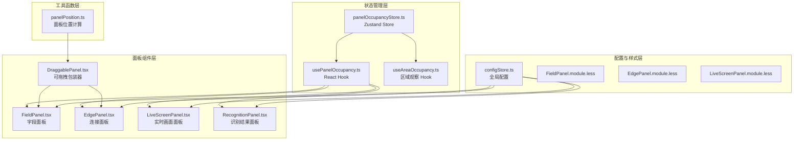
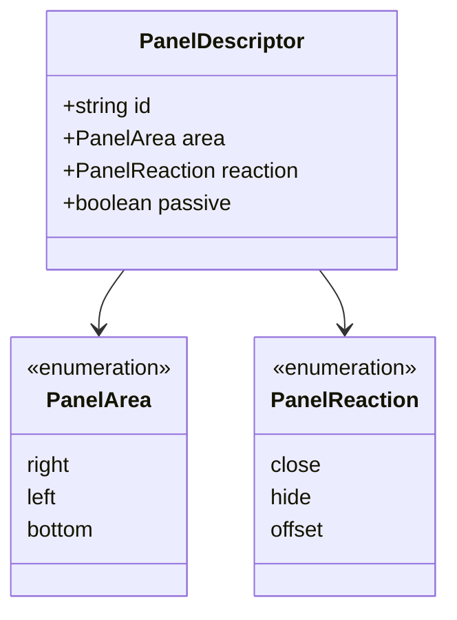
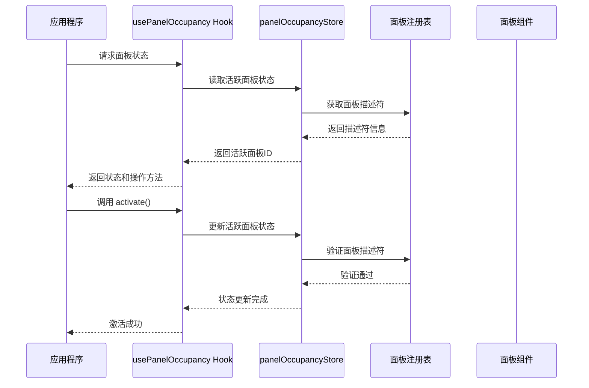
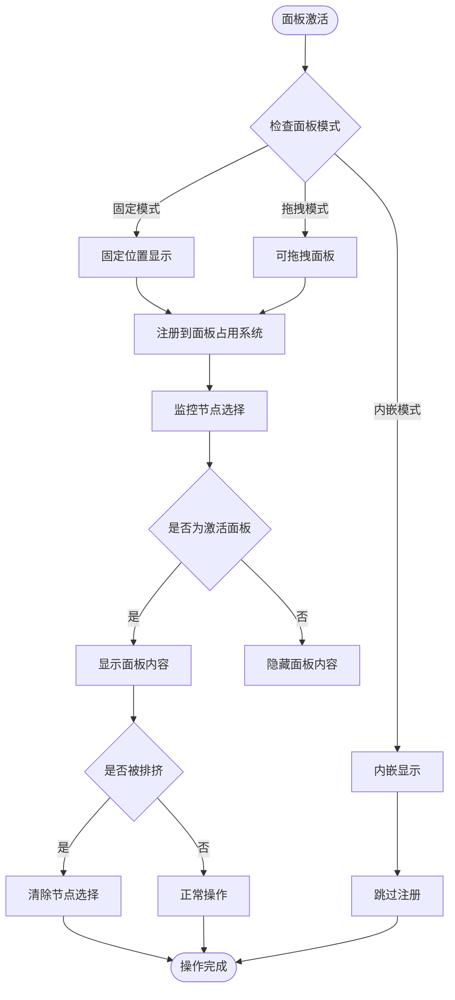
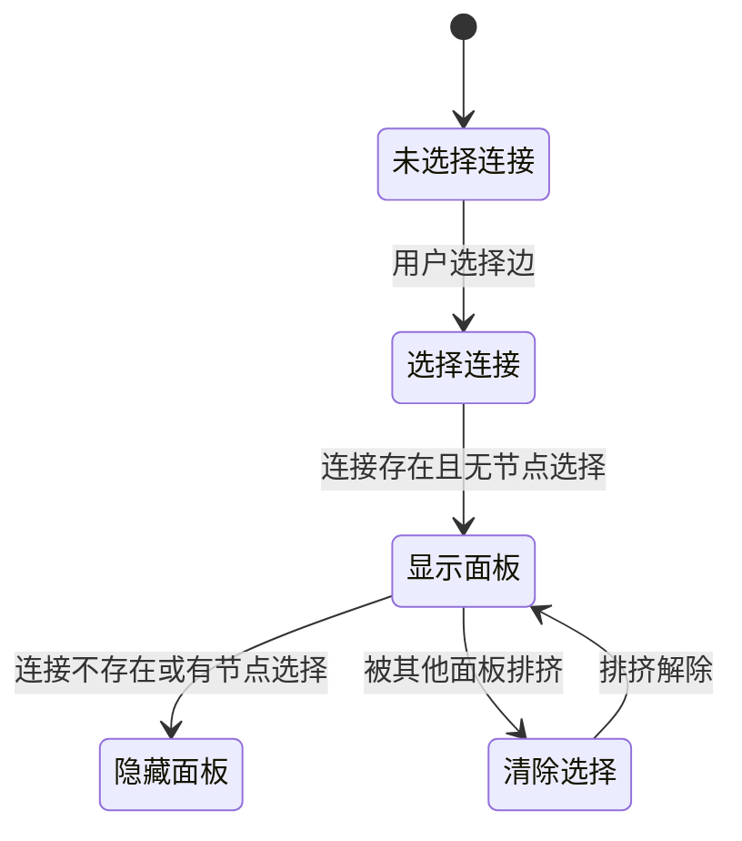
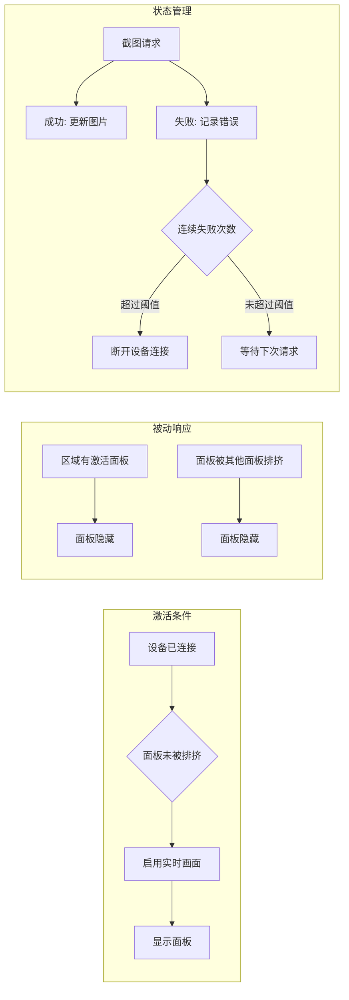
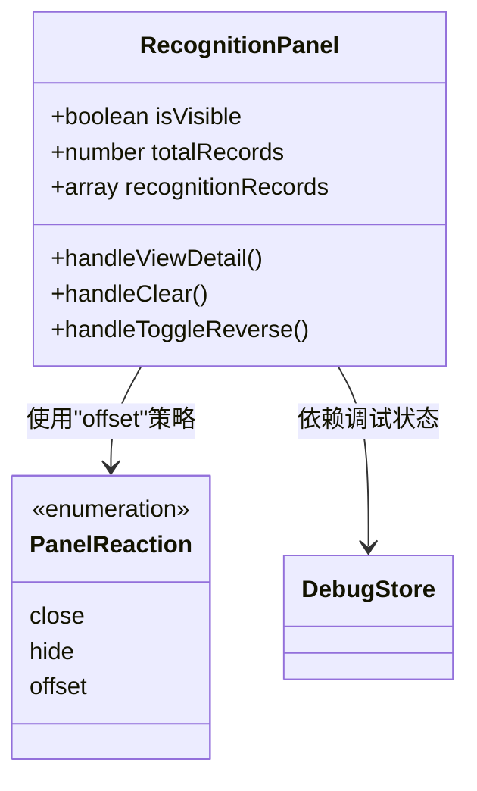
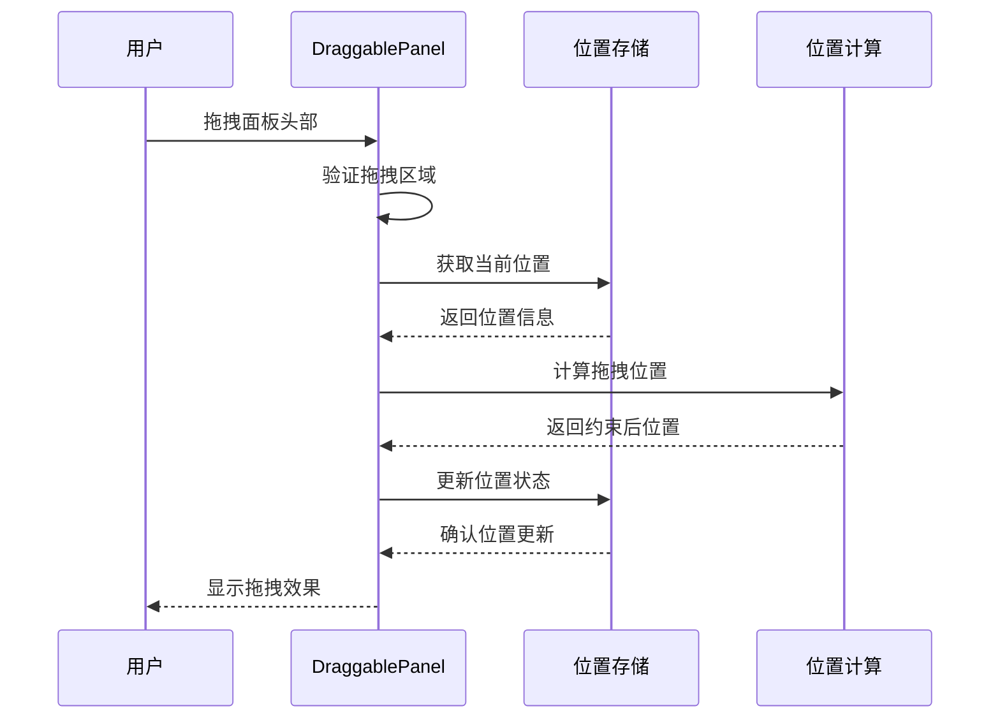
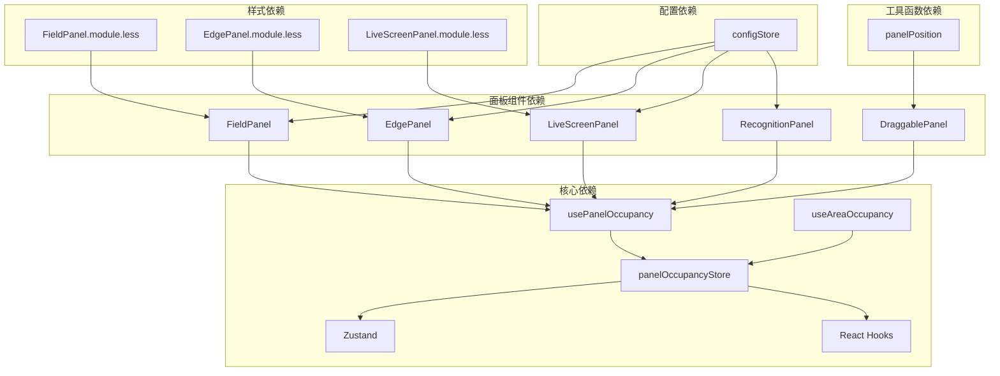

# 面板占用系统

<cite>
**本文档引用的文件**
- [panelOccupancyStore.ts](file://src/stores/panelOccupancyStore.ts)
- [usePanelOccupancy.ts](file://src/hooks/usePanelOccupancy.ts)
- [useAreaOccupancy.ts](file://src/hooks/useAreaOccupancy.ts)
- [DraggablePanel.tsx](file://src/components/panels/common/DraggablePanel.tsx)
- [panelPosition.ts](file://src/utils/ui/panelPosition.ts)
- [FieldPanel.tsx](file://src/components/panels/main/FieldPanel.tsx)
- [EdgePanel.tsx](file://src/components/panels/main/EdgePanel.tsx)
- [LiveScreenPanel.tsx](file://src/components/panels/main/LiveScreenPanel.tsx)
- [RecognitionPanel.tsx](file://src/components/panels/main/RecognitionPanel.tsx)
- [configStore.ts](file://src/stores/configStore.ts)
- [FieldPanel.module.less](file://src/styles/panels/FieldPanel.module.less)
- [EdgePanel.module.less](file://src/styles/panels/EdgePanel.module.less)
- [LiveScreenPanel.module.less](file://src/styles/panels/LiveScreenPanel.module.less)
</cite>

## 目录
1. [简介](#简介)
2. [项目结构](#项目结构)
3. [核心组件](#核心组件)
4. [架构总览](#架构总览)
5. [详细组件分析](#详细组件分析)
6. [依赖关系分析](#依赖关系分析)
7. [性能考量](#性能考量)
8. [故障排除指南](#故障排除指南)
9. [结论](#结论)

## 简介

面板占用系统是 MAA Pipeline Editor 中负责管理右侧、左侧和底部面板区域互斥占用的核心机制。该系统确保在同一区域内，同一时刻只有一个面板能够激活，同时为被动面板提供不同的响应策略（关闭、隐藏、偏移）。系统采用声明式注册方式，所有面板在应用初始化时注册到系统中，运行时通过 Hook 与 Store 交互实现状态管理。

## 项目结构

面板占用系统主要由以下几部分组成：

**图表来源**
- [panelOccupancyStore.ts:1-136](file://src/stores/panelOccupancyStore.ts#L1-L136)
- [usePanelOccupancy.ts:1-61](file://src/hooks/usePanelOccupancy.ts#L1-L61)
- [DraggablePanel.tsx:1-178](file://src/components/panels/common/DraggablePanel.tsx#L1-L178)

**章节来源**
- [panelOccupancyStore.ts:1-136](file://src/stores/panelOccupancyStore.ts#L1-L136)
- [usePanelOccupancy.ts:1-61](file://src/hooks/usePanelOccupancy.ts#L1-L61)
- [useAreaOccupancy.ts:1-30](file://src/hooks/useAreaOccupancy.ts#L1-L30)

## 核心组件

### 面板描述符系统

面板占用系统的核心是面板描述符（PanelDescriptor），它定义了面板的基本属性：

**图表来源**
- [panelOccupancyStore.ts:12-28](file://src/stores/panelOccupancyStore.ts#L12-L28)

系统初始化时注册了多个面板，包括主动面板和被动面板：

- **右侧区域主动面板**：字段面板、连接面板、节点列表面板
- **右侧区域被动面板**：实时画面面板、识别结果面板、探索浮动按钮

### 状态管理 Store

Store 使用 Zustand 提供响应式状态管理，包含以下核心功能：

- **活跃面板跟踪**：记录每个区域当前激活的面板 ID
- **面板抢占**：主动面板可以抢占其所属区域
- **面板释放**：仅当面板是当前激活者时才允许释放

**章节来源**
- [panelOccupancyStore.ts:87-136](file://src/stores/panelOccupancyStore.ts#L87-L136)

## 架构总览

面板占用系统采用分层架构设计，确保高内聚低耦合：

**图表来源**
- [usePanelOccupancy.ts:16-60](file://src/hooks/usePanelOccupancy.ts#L16-L60)
- [panelOccupancyStore.ts:98-135](file://src/stores/panelOccupancyStore.ts#L98-L135)

## 详细组件分析

### 主动面板：字段面板

字段面板是最复杂的主动面板，负责节点字段的编辑和管理：

**图表来源**
- [FieldPanel.tsx:105-131](file://src/components/panels/main/FieldPanel.tsx#L105-L131)
- [FieldPanel.tsx:133-147](file://src/components/panels/main/FieldPanel.tsx#L133-L147)

字段面板的关键特性：
- **自动激活**：当有节点被选中时自动激活
- **智能排挤**：当被其他面板排挤时自动清除节点选择
- **多模式支持**：支持固定、拖拽、内嵌三种显示模式

**章节来源**
- [FieldPanel.tsx:105-513](file://src/components/panels/main/FieldPanel.tsx#L105-L513)

### 主动面板：连接面板

连接面板专门处理节点间的连接关系编辑：

**图表来源**
- [EdgePanel.tsx:130-156](file://src/components/panels/main/EdgePanel.tsx#L130-L156)

连接面板的特点：
- **条件激活**：仅在有且仅有单条边被选中时激活
- **类型识别**：自动识别连接类型（next、on_error、jumpback）
- **顺序管理**：支持连接顺序的调整和管理

**章节来源**
- [EdgePanel.tsx:130-299](file://src/components/panels/main/EdgePanel.tsx#L130-L299)

### 被动面板：实时画面面板

实时画面面板是典型的被动面板，具有独特的响应策略：

**图表来源**
- [LiveScreenPanel.tsx:15-49](file://src/components/panels/main/LiveScreenPanel.tsx#L15-L49)
- [LiveScreenPanel.tsx:50-108](file://src/components/panels/main/LiveScreenPanel.tsx#L50-L108)

实时画面面板的特殊机制：
- **自动隐藏**：当区域有其他面板激活时自动隐藏
- **异常处理**：连续截图失败超过阈值时自动断开设备连接
- **页面可见性感知**：页面不可见时不发送截图请求

**章节来源**
- [LiveScreenPanel.tsx:15-156](file://src/components/panels/main/LiveScreenPanel.tsx#L15-L156)

### 被动面板：识别结果面板

识别结果面板采用偏移策略响应区域占用：

**图表来源**
- [RecognitionPanel.tsx:133-227](file://src/components/panels/main/RecognitionPanel.tsx#L133-L227)

识别结果面板的偏移机制：
- **视觉偏移**：当右侧有其他面板打开时，识别面板会向左偏移
- **数据驱动**：基于调试模式和识别记录状态自动显示
- **分页管理**：支持大量识别记录的分页显示

**章节来源**
- [RecognitionPanel.tsx:133-330](file://src/components/panels/main/RecognitionPanel.tsx#L133-L330)

### 可拖拽面板包装器

DraggablePanel 组件提供了统一的面板拖拽功能：

**图表来源**
- [DraggablePanel.tsx:37-175](file://src/components/panels/common/DraggablePanel.tsx#L37-L175)

拖拽功能的关键特性：
- **头部拖拽**：仅在面板头部区域触发拖拽
- **边界限制**：自动限制面板在视口内的移动范围
- **位置持久化**：拖拽结束后位置信息保存到状态管理

**章节来源**
- [DraggablePanel.tsx:1-178](file://src/components/panels/common/DraggablePanel.tsx#L1-178)

## 依赖关系分析

面板占用系统与其他模块的依赖关系如下：

**图表来源**
- [panelOccupancyStore.ts:1-136](file://src/stores/panelOccupancyStore.ts#L1-L136)
- [configStore.ts:179-290](file://src/stores/configStore.ts#L179-L290)

**章节来源**
- [configStore.ts:1-290](file://src/stores/configStore.ts#L1-L290)

## 性能考量

面板占用系统在设计时充分考虑了性能优化：

### 状态更新优化
- **选择性订阅**：Hook 仅订阅面板所在区域的状态，避免全局重渲染
- **记忆化处理**：使用 useMemo 优化计算结果缓存
- **防抖机制**：拖拽操作使用节流函数减少频繁的状态更新

### 渲染性能
- **条件渲染**：面板仅在需要时渲染，减少 DOM 元素数量
- **虚拟滚动**：识别结果面板支持分页，避免大量列表项的渲染
- **懒加载**：面板内容按需加载，提升初始渲染速度

### 内存管理
- **及时清理**：面板卸载时自动清理定时器和事件监听器
- **状态回收**：不再使用的面板状态会被自动回收

## 故障排除指南

### 常见问题及解决方案

#### 面板无法激活
**症状**：面板注册后无法正常激活
**排查步骤**：
1. 检查面板是否正确注册到系统
2. 确认面板不是被动面板（被动面板不能抢占区域）
3. 验证面板描述符的区域配置是否正确

**章节来源**
- [panelOccupancyStore.ts:38-45](file://src/stores/panelOccupancyStore.ts#L38-L45)
- [panelOccupancyStore.ts:105-116](file://src/stores/panelOccupancyStore.ts#L105-L116)

#### 面板被意外隐藏
**症状**：面板在使用过程中突然消失
**可能原因**：
1. 区域被其他主动面板抢占
2. 被动面板的隐藏策略触发
3. 面板模式配置问题

**解决方法**：
1. 检查其他面板的激活状态
2. 验证被动面板的响应策略配置
3. 调整面板显示模式设置

#### 拖拽功能异常
**症状**：面板拖拽失效或位置异常
**排查步骤**：
1. 检查拖拽区域的 CSS 样式
2. 验证面板位置计算函数
3. 确认浏览器兼容性问题

**章节来源**
- [DraggablePanel.tsx:84-146](file://src/components/panels/common/DraggablePanel.tsx#L84-L146)
- [panelPosition.ts:56-79](file://src/utils/ui/panelPosition.ts#L56-L79)

## 结论

面板占用系统通过声明式注册和响应式状态管理，实现了面板区域的智能互斥控制。系统的设计充分考虑了用户体验和性能优化，为不同类型的面板提供了合适的响应策略。通过主动面板和被动面板的合理分工，系统确保了用户界面的整洁性和操作的流畅性。

该系统的模块化设计使得新增面板变得简单，只需按照约定注册即可获得完整的占用管理功能。同时，灵活的配置选项允许用户根据自己的工作流程调整面板的行为和外观。

未来可以在以下方面进一步优化：
- 增加面板间优先级机制
- 支持更复杂的面板组合策略
- 提供面板布局的持久化存储
- 增强面板间的通信能力