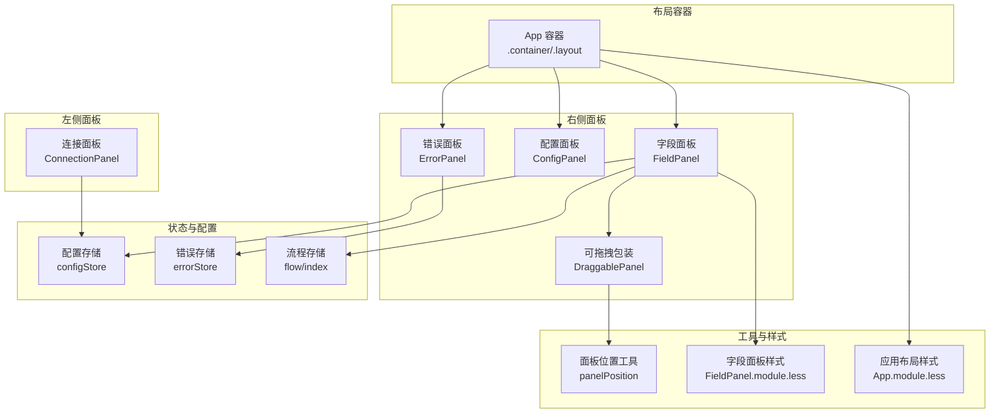
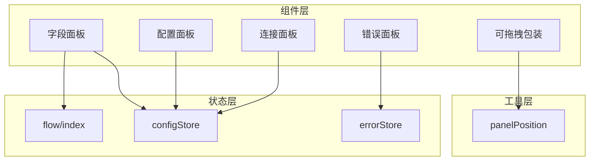
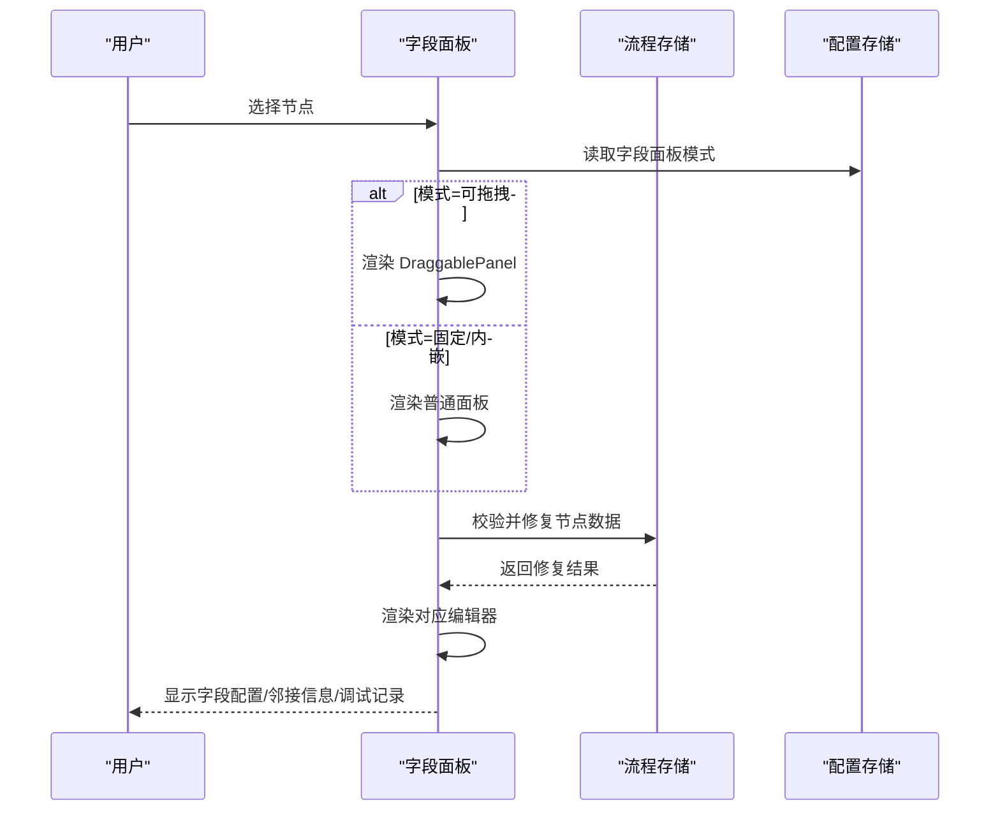
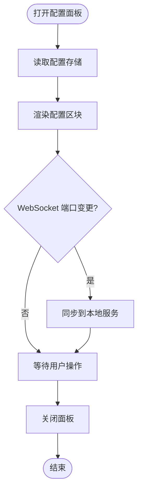
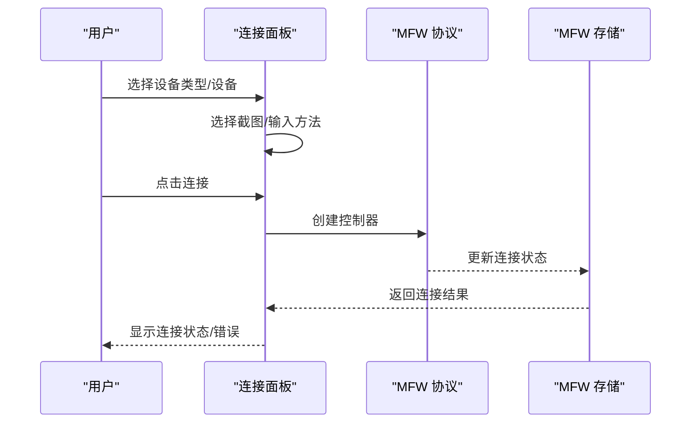
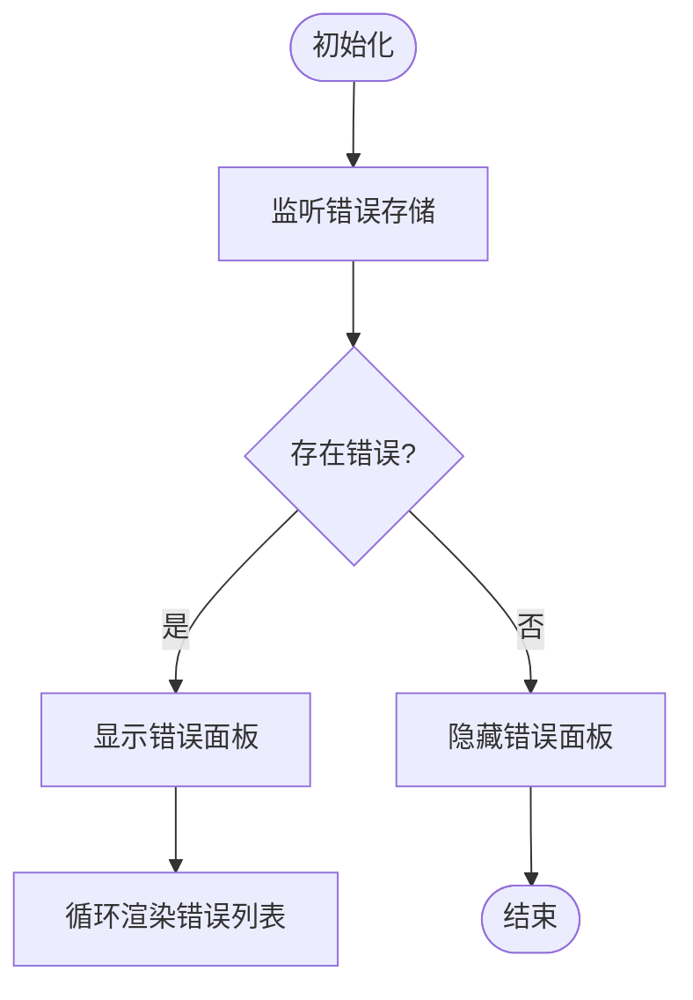
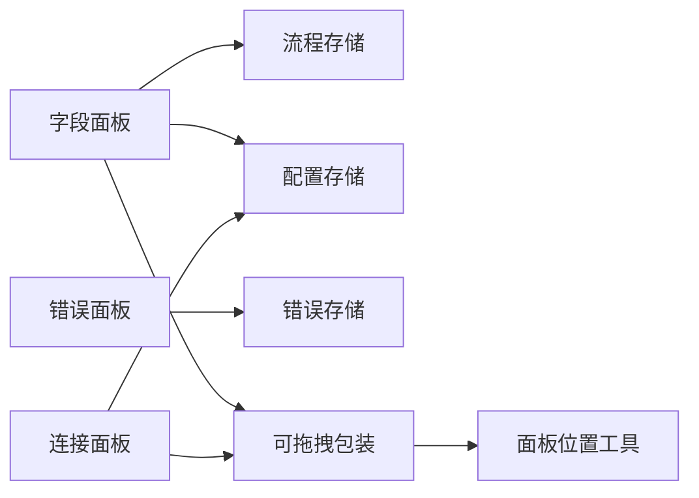

# 面板系统

<cite>
**本文引用的文件**
- [FieldPanel.tsx](file://src/components/panels/main/FieldPanel.tsx)
- [ConfigPanel.tsx](file://src/components/panels/main/ConfigPanel.tsx)
- [ConnectionPanel.tsx](file://src/components/panels/main/ConnectionPanel.tsx)
- [ErrorPanel.tsx](file://src/components/panels/main/ErrorPanel.tsx)
- [DraggablePanel.tsx](file://src/components/panels/common/DraggablePanel.tsx)
- [configStore.ts](file://src/stores/configStore.ts)
- [errorStore.ts](file://src/stores/errorStore.ts)
- [flow/index.ts](file://src/stores/flow/index.ts)
- [FieldPanel.module.less](file://src/styles/FieldPanel.module.less)
- [App.module.less](file://src/styles/App.module.less)
- [panelPosition.ts](file://src/utils/panelPosition.ts)
</cite>

## 目录
1. [简介](#简介)
2. [项目结构](#项目结构)
3. [核心组件](#核心组件)
4. [架构总览](#架构总览)
5. [详细组件分析](#详细组件分析)
6. [依赖分析](#依赖分析)
7. [性能考虑](#性能考虑)
8. [故障排查指南](#故障排查指南)
9. [结论](#结论)
10. [附录](#附录)

## 简介
本文件系统性阐述 MaaPipelineEditor 的面板系统，重点覆盖以下方面：
- 面板架构与设计理念：以“可拖拽面板”为核心，结合固定/内嵌/可拖拽三种模式，满足不同场景下的交互需求。
- 主要面板职责：
  - 字段面板：节点参数配置与数据校验修复，支持多种节点类型的专用编辑器。
  - 配置面板：全局设置与本地服务配置入口。
  - 连接面板：设备与控制器连接管理，支持 ADB、Win32、PlayCover、Gamepad 多类设备。
  - 错误面板：集中展示与处理错误信息。
- 布局管理：面板的打开/关闭、位置调整、大小调节、内嵌跟随等能力。
- 面板间依赖与数据流：字段面板依赖节点选择状态；连接面板依赖设备发现与控制器协议；错误面板依赖全局错误状态。
- 响应式与移动端适配：基于断点与坐标变换工具，保证在不同分辨率与视口下的可用性。
- 定制化开发指南：如何创建自定义面板与扩展字段面板。
- 性能优化与内存管理最佳实践。

## 项目结构
面板系统由多个独立面板组成，并通过统一的布局容器与样式模块协同工作。核心文件组织如下：
- 面板组件：位于 src/components/panels/main 与 src/components/panels/common
- 配置与状态：位于 src/stores 与 src/styles
- 布局与工具：位于 src/styles 与 src/utils

**图表来源**
- [FieldPanel.tsx:185-521](file://src/components/panels/main/FieldPanel.tsx#L185-L521)
- [ConfigPanel.tsx:17-78](file://src/components/panels/main/ConfigPanel.tsx#L17-L78)
- [ConnectionPanel.tsx:39-1007](file://src/components/panels/main/ConnectionPanel.tsx#L39-L1007)
- [ErrorPanel.tsx:8-38](file://src/components/panels/main/ErrorPanel.tsx#L8-L38)
- [DraggablePanel.tsx:37-175](file://src/components/panels/common/DraggablePanel.tsx#L37-L175)
- [configStore.ts:163-267](file://src/stores/configStore.ts#L163-L267)
- [errorStore.ts:24-39](file://src/stores/errorStore.ts#L24-L39)
- [flow/index.ts:16-24](file://src/stores/flow/index.ts#L16-L24)
- [panelPosition.ts:15-231](file://src/utils/panelPosition.ts#L15-L231)
- [FieldPanel.module.less:4-35](file://src/styles/FieldPanel.module.less#L4-L35)
- [App.module.less:1-32](file://src/styles/App.module.less#L1-L32)

**章节来源**
- [FieldPanel.tsx:185-521](file://src/components/panels/main/FieldPanel.tsx#L185-L521)
- [ConfigPanel.tsx:17-78](file://src/components/panels/main/ConfigPanel.tsx#L17-L78)
- [ConnectionPanel.tsx:39-1007](file://src/components/panels/main/ConnectionPanel.tsx#L39-L1007)
- [ErrorPanel.tsx:8-38](file://src/components/panels/main/ErrorPanel.tsx#L8-L38)
- [DraggablePanel.tsx:37-175](file://src/components/panels/common/DraggablePanel.tsx#L37-L175)
- [configStore.ts:163-267](file://src/stores/configStore.ts#L163-L267)
- [errorStore.ts:24-39](file://src/stores/errorStore.ts#L24-L39)
- [flow/index.ts:16-24](file://src/stores/flow/index.ts#L16-L24)
- [FieldPanel.module.less:4-35](file://src/styles/FieldPanel.module.less#L4-L35)
- [App.module.less:1-32](file://src/styles/App.module.less#L1-L32)
- [panelPosition.ts:15-231](file://src/utils/panelPosition.ts#L15-L231)

## 核心组件
- 字段面板（FieldPanel）：根据当前选中节点动态渲染对应编辑器，内置数据校验与修复机制，支持遮罩层进度反馈与标签页分组。
- 配置面板（ConfigPanel）：集中展示文件、管道、面板、本地服务、AI 等配置项，支持后端配置弹窗。
- 连接面板（ConnectionPanel）：设备与控制器连接管理，支持 ADB、Win32、PlayCover、Gamepad，提供方法选择、连接状态与错误提示。
- 错误面板（ErrorPanel）：展示全局错误列表，按条件自动显示。
- 可拖拽面板（DraggablePanel）：为字段/连接面板提供拖拽定位与位置持久化能力。

**章节来源**
- [FieldPanel.tsx:185-521](file://src/components/panels/main/FieldPanel.tsx#L185-L521)
- [ConfigPanel.tsx:17-78](file://src/components/panels/main/ConfigPanel.tsx#L17-L78)
- [ConnectionPanel.tsx:39-1007](file://src/components/panels/main/ConnectionPanel.tsx#L39-L1007)
- [ErrorPanel.tsx:8-38](file://src/components/panels/main/ErrorPanel.tsx#L8-L38)
- [DraggablePanel.tsx:37-175](file://src/components/panels/common/DraggablePanel.tsx#L37-L175)

## 架构总览
面板系统采用“组件-状态-工具”三层协作：
- 组件层：各面板组件负责 UI 渲染与用户交互。
- 状态层：Zustand 存储提供配置、错误、流程等状态读写。
- 工具层：坐标转换、位置约束、嵌入跟随等工具保障布局一致性与可用性。

**图表来源**
- [FieldPanel.tsx:185-521](file://src/components/panels/main/FieldPanel.tsx#L185-L521)
- [ConfigPanel.tsx:17-78](file://src/components/panels/main/ConfigPanel.tsx#L17-L78)
- [ConnectionPanel.tsx:39-1007](file://src/components/panels/main/ConnectionPanel.tsx#L39-L1007)
- [ErrorPanel.tsx:8-38](file://src/components/panels/main/ErrorPanel.tsx#L8-L38)
- [DraggablePanel.tsx:37-175](file://src/components/panels/common/DraggablePanel.tsx#L37-L175)
- [configStore.ts:163-267](file://src/stores/configStore.ts#L163-L267)
- [errorStore.ts:24-39](file://src/stores/errorStore.ts#L24-L39)
- [flow/index.ts:16-24](file://src/stores/flow/index.ts#L16-L24)
- [panelPosition.ts:15-231](file://src/utils/panelPosition.ts#L15-L231)

## 详细组件分析

### 字段面板（FieldPanel）
- 功能要点
  - 依据当前节点类型动态渲染专用编辑器（Pipeline、External、Anchor、Sticker、Group）。
  - 内置节点数据校验与自动修复，修复后即时更新流程存储。
  - 支持遮罩层进度反馈，避免编辑器长时间加载导致的卡顿。
  - 提供标签页：字段配置、邻接信息、调试记录（调试模式下）。
  - 面板模式：固定、可拖拽、内嵌三种模式，通过配置存储控制。
- 关键实现路径
  - 面板渲染与模式判断：[FieldPanel.tsx:502-521](file://src/components/panels/main/FieldPanel.tsx#L502-L521)
  - 数据校验与修复：[FieldPanel.tsx:41-119](file://src/components/panels/main/FieldPanel.tsx#L41-L119)
  - 编辑器错误边界：[FieldPanel.tsx:122-182](file://src/components/panels/main/FieldPanel.tsx#L122-L182)
  - 标签页与调试记录：[FieldPanel.tsx:445-497](file://src/components/panels/main/FieldPanel.tsx#L445-L497)
  - 面板样式与尺寸：[FieldPanel.module.less:4-35](file://src/styles/FieldPanel.module.less#L4-L35)

**图表来源**
- [FieldPanel.tsx:185-521](file://src/components/panels/main/FieldPanel.tsx#L185-L521)
- [configStore.ts:163-267](file://src/stores/configStore.ts#L163-L267)
- [flow/index.ts:16-24](file://src/stores/flow/index.ts#L16-L24)

**章节来源**
- [FieldPanel.tsx:185-521](file://src/components/panels/main/FieldPanel.tsx#L185-L521)
- [FieldPanel.module.less:4-35](file://src/styles/FieldPanel.module.less#L4-L35)

### 配置面板（ConfigPanel）
- 功能要点
  - 展示文件、管道、面板、本地服务、AI、配置管理等配置区块。
  - WebSocket 端口变更同步至本地服务。
  - 支持后端配置弹窗。
- 关键实现路径
  - 面板开关与样式：[ConfigPanel.tsx:34-42](file://src/components/panels/main/ConfigPanel.tsx#L34-L42)
  - 配置区块渲染：[ConfigPanel.tsx:58-67](file://src/components/panels/main/ConfigPanel.tsx#L58-L67)
  - 端口同步：[ConfigPanel.tsx:28-31](file://src/components/panels/main/ConfigPanel.tsx#L28-L31)

**图表来源**
- [ConfigPanel.tsx:17-78](file://src/components/panels/main/ConfigPanel.tsx#L17-L78)
- [configStore.ts:163-267](file://src/stores/configStore.ts#L163-L267)

**章节来源**
- [ConfigPanel.tsx:17-78](file://src/components/panels/main/ConfigPanel.tsx#L17-L78)

### 连接面板（ConnectionPanel）
- 功能要点
  - 设备与控制器连接管理，支持 ADB、Win32、PlayCover、Gamepad。
  - 设备列表自动刷新、方法选择（截图/输入）、连接/断开、新设备连接。
  - 连接状态徽章、错误提示与权限提示。
- 关键实现路径
  - 设备与方法选择：[ConnectionPanel.tsx:81-114](file://src/components/panels/main/ConnectionPanel.tsx#L81-L114)
  - 设备切换与默认值：[ConnectionPanel.tsx:117-165](file://src/components/panels/main/ConnectionPanel.tsx#L117-L165)
  - 连接/断开逻辑：[ConnectionPanel.tsx:242-332](file://src/components/panels/main/ConnectionPanel.tsx#L242-L332)
  - 设备列表渲染：[ConnectionPanel.tsx:440-569](file://src/components/panels/main/ConnectionPanel.tsx#L440-L569)

**图表来源**
- [ConnectionPanel.tsx:39-1007](file://src/components/panels/main/ConnectionPanel.tsx#L39-L1007)

**章节来源**
- [ConnectionPanel.tsx:39-1007](file://src/components/panels/main/ConnectionPanel.tsx#L39-L1007)

### 错误面板（ErrorPanel）
- 功能要点
  - 展示全局错误列表，按条件自动显示。
  - 错误类型与消息统一管理。
- 关键实现路径
  - 错误列表渲染：[ErrorPanel.tsx:20-34](file://src/components/panels/main/ErrorPanel.tsx#L20-L34)
  - 错误状态管理：[errorStore.ts:24-39](file://src/stores/errorStore.ts#L24-L39)

**图表来源**
- [ErrorPanel.tsx:8-38](file://src/components/panels/main/ErrorPanel.tsx#L8-L38)
- [errorStore.ts:24-39](file://src/stores/errorStore.ts#L24-L39)

**章节来源**
- [ErrorPanel.tsx:8-38](file://src/components/panels/main/ErrorPanel.tsx#L8-L38)
- [errorStore.ts:24-39](file://src/stores/errorStore.ts#L24-L39)

### 可拖拽面板（DraggablePanel）
- 功能要点
  - 通过标题栏拖动，支持边界限制与位置持久化。
  - 位置状态通过 zustand store 共享，支持字段/连接面板复用。
- 关键实现路径
  - 位置存储与默认位置：[DraggablePanel.tsx:19-81](file://src/components/panels/common/DraggablePanel.tsx#L19-L81)
  - 拖动事件与边界限制：[DraggablePanel.tsx:83-146](file://src/components/panels/common/DraggablePanel.tsx#L83-L146)
  - 位置样式应用：[DraggablePanel.tsx:148-159](file://src/components/panels/common/DraggablePanel.tsx#L148-L159)

**图表来源**
- [DraggablePanel.tsx:37-175](file://src/components/panels/common/DraggablePanel.tsx#L37-L175)

**章节来源**
- [DraggablePanel.tsx:37-175](file://src/components/panels/common/DraggablePanel.tsx#L37-L175)

## 依赖分析
- 面板与状态
  - 字段面板依赖流程存储（节点选择、更新）与配置存储（面板模式）。
  - 连接面板依赖 MFW 协议与 MFW 存储（设备列表、连接状态）。
  - 错误面板依赖错误存储（错误列表）。
- 面板与工具
  - 字段面板与连接面板可复用可拖拽包装组件。
  - 嵌入位置计算依赖坐标转换与位置约束工具。
- 配置与行为
  - 配置存储统一管理面板模式、导出策略、主题与实时预览等。

**图表来源**
- [FieldPanel.tsx:185-521](file://src/components/panels/main/FieldPanel.tsx#L185-L521)
- [ConnectionPanel.tsx:39-1007](file://src/components/panels/main/ConnectionPanel.tsx#L39-L1007)
- [ErrorPanel.tsx:8-38](file://src/components/panels/main/ErrorPanel.tsx#L8-L38)
- [DraggablePanel.tsx:37-175](file://src/components/panels/common/DraggablePanel.tsx#L37-L175)
- [configStore.ts:163-267](file://src/stores/configStore.ts#L163-L267)
- [errorStore.ts:24-39](file://src/stores/errorStore.ts#L24-L39)
- [flow/index.ts:16-24](file://src/stores/flow/index.ts#L16-L24)
- [panelPosition.ts:15-231](file://src/utils/panelPosition.ts#L15-L231)

**章节来源**
- [configStore.ts:163-267](file://src/stores/configStore.ts#L163-L267)
- [errorStore.ts:24-39](file://src/stores/errorStore.ts#L24-L39)
- [flow/index.ts:16-24](file://src/stores/flow/index.ts#L16-L24)
- [panelPosition.ts:15-231](file://src/utils/panelPosition.ts#L15-L231)

## 性能考虑
- 面板渲染优化
  - 字段面板在编辑器加载期间使用遮罩层与进度提示，避免长时间白屏。
  - 使用 useMemo/useCallback 缓存渲染结果与回调，减少不必要的重渲染。
- 位置计算与布局
  - 使用坐标转换工具（画布/屏幕坐标互转）与位置约束，降低布局抖动。
  - 嵌入跟随模式下，优先右侧显示，超出边界时回退到左侧或强制约束，保证面板始终可见。
- 存储与同步
  - 配置存储内部对相关配置进行联动同步（如导出配置与处理模式），减少外部耦合。
- 资源与内存
  - 错误面板仅在存在错误时显示，避免常驻内存。
  - 可拖拽面板的位置状态通过 store 共享，避免重复计算。

**章节来源**
- [FieldPanel.tsx:325-370](file://src/components/panels/main/FieldPanel.tsx#L325-L370)
- [panelPosition.ts:15-231](file://src/utils/panelPosition.ts#L15-L231)
- [configStore.ts:212-225](file://src/stores/configStore.ts#L212-L225)

## 故障排查指南
- 字段面板渲染失败
  - 现象：编辑器区域出现错误提示，建议尝试修复节点。
  - 排查：检查节点数据结构完整性；若修复无效，建议删除节点并重新创建。
  - 参考：[FieldPanel.tsx:122-182](file://src/components/panels/main/FieldPanel.tsx#L122-L182)
- 连接面板无法连接设备
  - 现象：连接按钮不可用或连接失败。
  - 排查：确认设备已选择且方法有效；检查权限提示（Win32 需管理员权限）；尝试刷新设备列表。
  - 参考：[ConnectionPanel.tsx:393-424](file://src/components/panels/main/ConnectionPanel.tsx#L393-L424)
- 错误面板无显示
  - 现象：错误列表为空。
  - 排查：确认错误存储中是否存在错误；检查错误类型与过滤逻辑。
  - 参考：[ErrorPanel.tsx:20-34](file://src/components/panels/main/ErrorPanel.tsx#L20-L34)

**章节来源**
- [FieldPanel.tsx:122-182](file://src/components/panels/main/FieldPanel.tsx#L122-L182)
- [ConnectionPanel.tsx:393-424](file://src/components/panels/main/ConnectionPanel.tsx#L393-L424)
- [ErrorPanel.tsx:20-34](file://src/components/panels/main/ErrorPanel.tsx#L20-L34)

## 结论
MaaPipelineEditor 的面板系统以“可拖拽面板”为核心，结合多种布局模式与完善的工具链，实现了高可用、可扩展的可视化配置体验。通过状态与工具层的清晰分离，系统在复杂交互场景下仍能保持良好的性能与稳定性。未来可在以下方向持续演进：
- 面板间联动与数据共享机制的标准化。
- 更丰富的响应式断点与移动端手势支持。
- 面板插件化与自定义面板的扩展框架。

## 附录

### 面板布局管理与响应式设计
- 布局容器
  - 应用根容器采用 Flex 布局，内容区占满剩余空间，保证面板与画布的协调。
  - 参考：[App.module.less:1-32](file://src/styles/App.module.less#L1-L32)
- 字段面板尺寸与滚动
  - 固定宽度与最大高度，配合滚动条与标签页，适配不同内容长度。
  - 参考：[FieldPanel.module.less:4-35](file://src/styles/FieldPanel.module.less#L4-L35)
- 响应式与坐标转换
  - 使用坐标转换工具在画布与屏幕坐标间切换，确保面板位置在缩放与平移后仍准确。
  - 参考：[panelPosition.ts:15-42](file://src/utils/panelPosition.ts#L15-L42)

**章节来源**
- [App.module.less:1-32](file://src/styles/App.module.less#L1-L32)
- [FieldPanel.module.less:4-35](file://src/styles/FieldPanel.module.less#L4-L35)
- [panelPosition.ts:15-42](file://src/utils/panelPosition.ts#L15-L42)

### 面板定制化开发指南
- 创建自定义面板
  - 步骤
    - 在 src/components/panels/main 新建组件文件，参考现有面板的结构与样式命名。
    - 若需拖拽定位，使用 DraggablePanel 包装并注册面板位置状态。
    - 通过配置存储控制面板的显示/隐藏与模式切换。
    - 如需与流程/设备等状态交互，引入相应 store 并订阅状态变化。
  - 参考
    - [DraggablePanel.tsx:37-175](file://src/components/panels/common/DraggablePanel.tsx#L37-L175)
    - [configStore.ts:163-267](file://src/stores/configStore.ts#L163-L267)
- 扩展字段面板
  - 在字段面板中新增字段类型或编辑器时，遵循字段工厂与类型系统，确保校验与渲染一致。
  - 参考
    - [FieldPanel.tsx:269-323](file://src/components/panels/main/FieldPanel.tsx#L269-L323)

**章节来源**
- [DraggablePanel.tsx:37-175](file://src/components/panels/common/DraggablePanel.tsx#L37-L175)
- [configStore.ts:163-267](file://src/stores/configStore.ts#L163-L267)
- [FieldPanel.tsx:269-323](file://src/components/panels/main/FieldPanel.tsx#L269-L323)