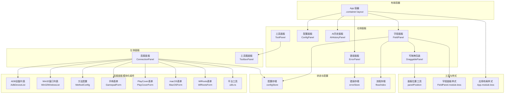
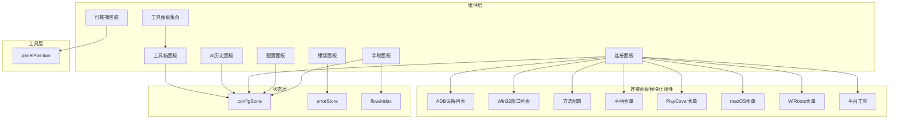
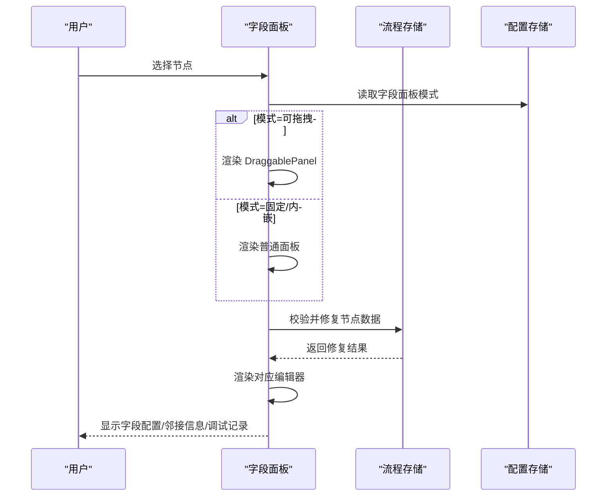
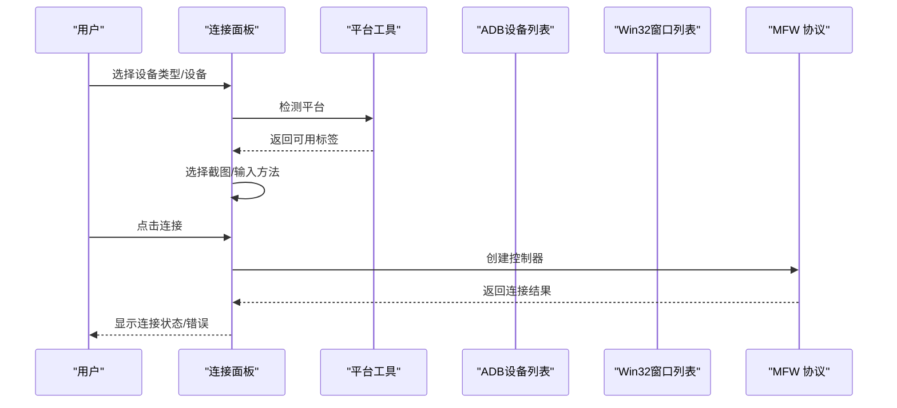
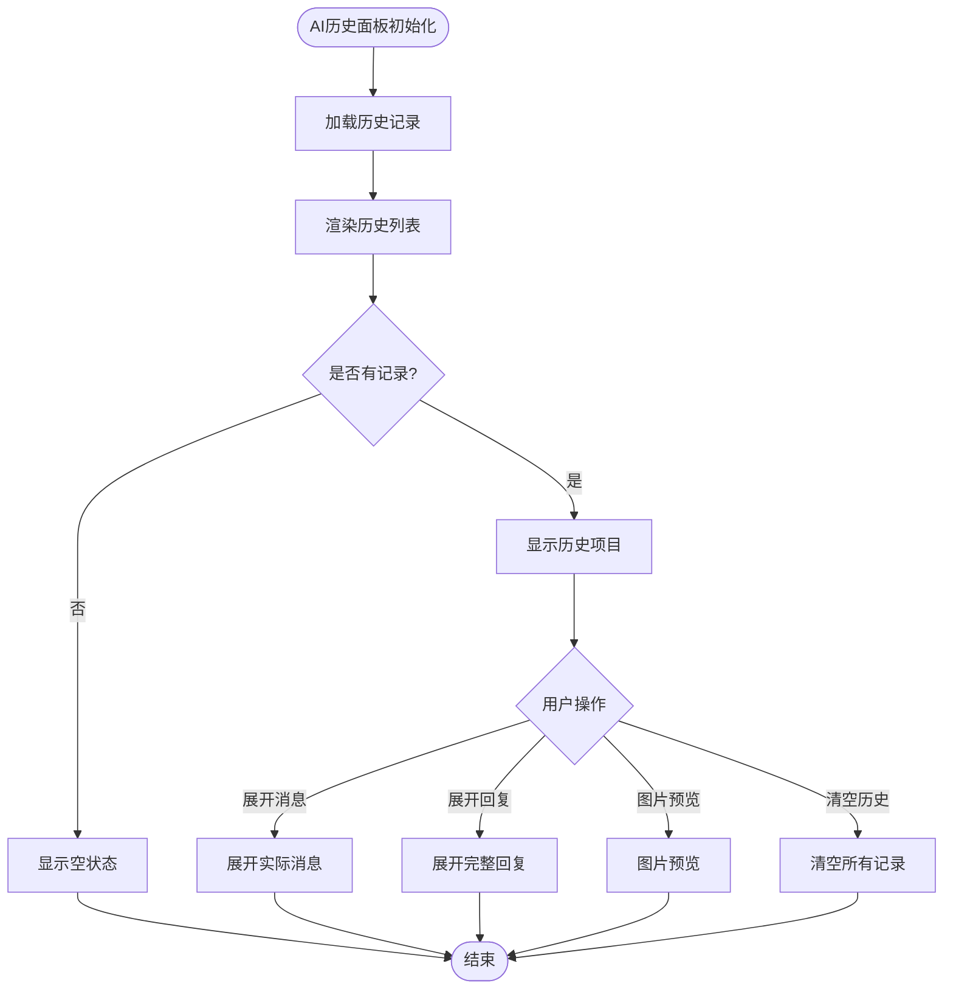
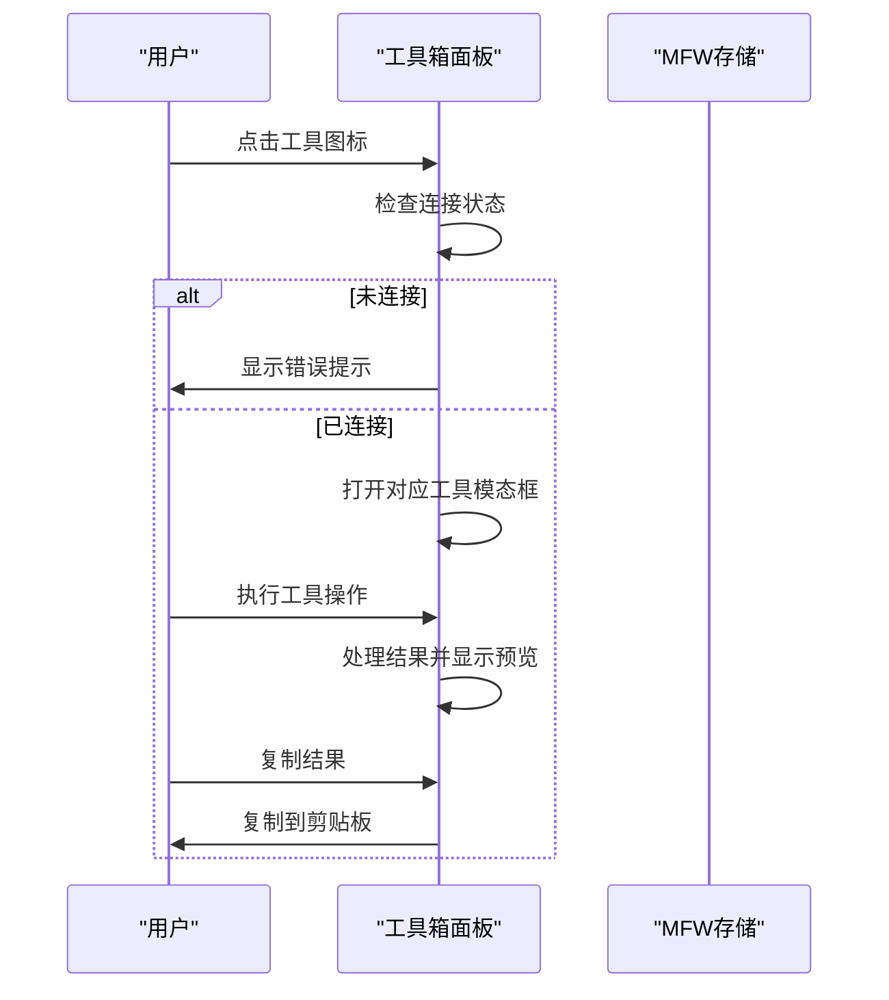
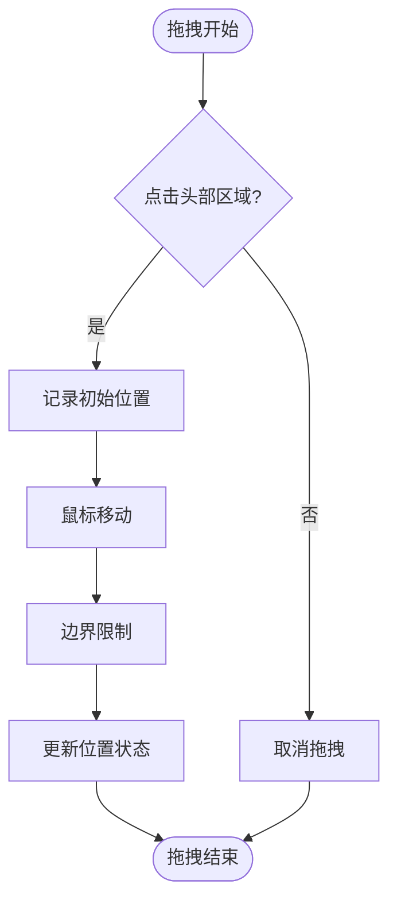
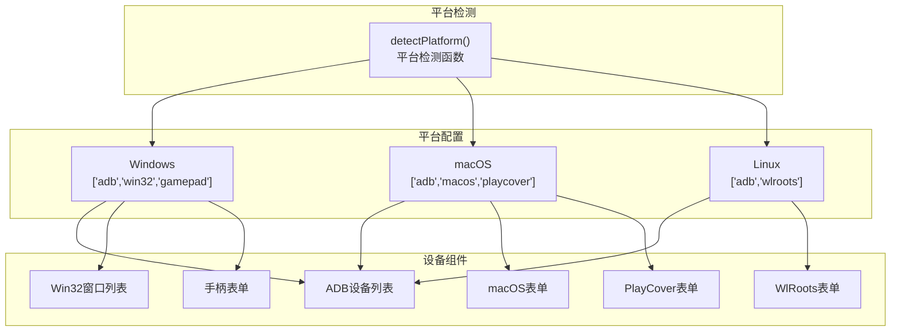
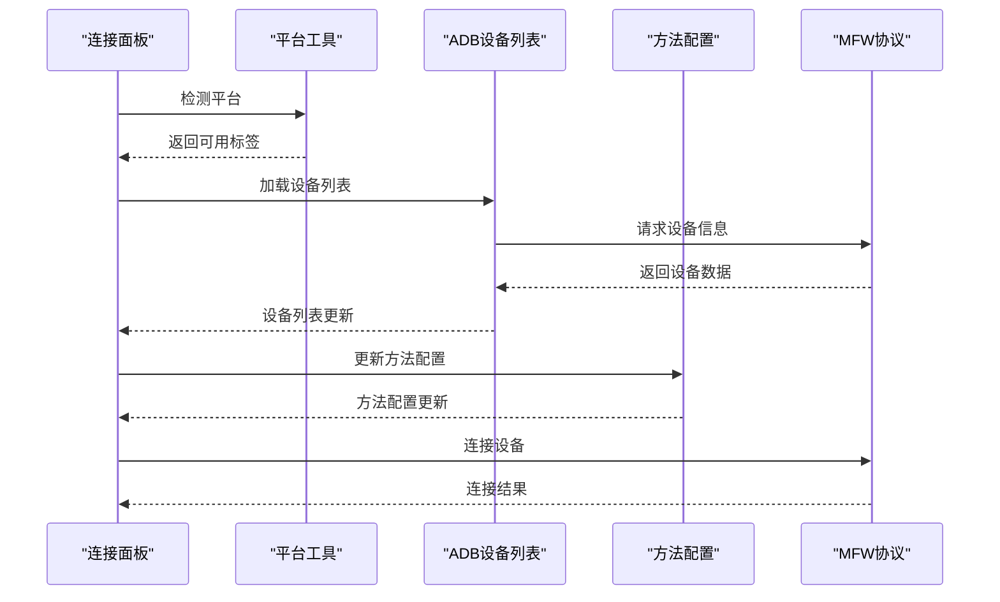
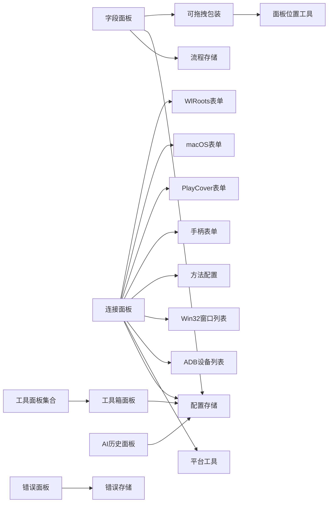

# 面板系统

<cite>
**本文引用的文件**
- [FieldPanel.tsx](file://src/components/panels/main/FieldPanel.tsx)
- [ConfigPanel.tsx](file://src/components/panels/main/ConfigPanel.tsx)
- [ConnectionPanel.tsx](file://src/components/panels/main/ConnectionPanel.tsx)
- [ErrorPanel.tsx](file://src/components/panels/main/ErrorPanel.tsx)
- [AIHistoryPanel.tsx](file://src/components/panels/main/AIHistoryPanel.tsx)
- [ToolboxPanel.tsx](file://src/components/panels/tools/ToolboxPanel.tsx)
- [ToolPanel.tsx](file://src/components/panels/tools/ToolPanel.tsx)
- [DraggablePanel.tsx](file://src/components/panels/common/DraggablePanel.tsx)
- [AdbDeviceList.tsx](file://src/components/panels/main/connection/AdbDeviceList.tsx)
- [Win32WindowList.tsx](file://src/components/panels/main/connection/Win32WindowList.tsx)
- [MethodConfig.tsx](file://src/components/panels/main/connection/MethodConfig.tsx)
- [GamepadForm.tsx](file://src/components/panels/main/connection/GamepadForm.tsx)
- [PlayCoverForm.tsx](file://src/components/panels/main/connection/PlayCoverForm.tsx)
- [MacOSForm.tsx](file://src/components/panels/main/connection/MacOSForm.tsx)
- [WlRootsForm.tsx](file://src/components/panels/main/connection/WlRootsForm.tsx)
- [utils.ts](file://src/components/panels/main/connection/utils.ts)
- [configStore.ts](file://src/stores/configStore.ts)
- [errorStore.ts](file://src/stores/errorStore.ts)
- [flow/index.ts](file://src/stores/flow/index.ts)
- [FieldPanel.module.less](file://src/styles/FieldPanel.module.less)
- [App.module.less](file://src/styles/App.module.less)
- [panelPosition.ts](file://src/utils/panelPosition.ts)
</cite>

## 更新摘要
**所做更改**
- 更新连接面板部分，反映重构为模块化组件架构
- 新增设备列表组件、表单组件和配置组件的详细说明
- 完善模块化组件的职责分工和数据流转
- 增强跨平台支持和平台特定功能的说明
- 更新面板间依赖关系和数据流转的说明

## 目录
1. [简介](#简介)
2. [项目结构](#项目结构)
3. [核心组件](#核心组件)
4. [架构总览](#架构总览)
5. [详细组件分析](#详细组件分析)
6. [模块化连接面板架构](#模块化连接面板架构)
7. [依赖分析](#依赖分析)
8. [性能考虑](#性能考虑)
9. [故障排查指南](#故障排查指南)
10. [结论](#结论)
11. [附录](#附录)

## 简介
本文件系统性阐述 MaaPipelineEditor 的面板系统，重点覆盖以下方面：
- 面板架构与设计理念：以"可拖拽面板"为核心，结合固定/内嵌/可拖拽三种模式，满足不同场景下的交互需求。
- 主要面板职责：
  - 字段面板：节点参数配置与数据校验修复，支持多种节点类型的专用编辑器。
  - 配置面板：全局设置与本地服务配置入口，采用全新的UI设计。
  - 连接面板：设备与控制器连接管理，重构为模块化组件架构，支持 ADB、Win32、PlayCover、Gamepad、WlRoots、macOS 多类设备。
  - 错误面板：集中展示与处理错误信息。
  - AI历史面板：AI对话历史记录与管理，提供详细的Token使用统计和图片预览功能。
  - 工具面板：集成多种实用工具，包括OCR识别、模板截图、颜色取点、区域选择等。
- 布局管理：面板的打开/关闭、位置调整、大小调节、内嵌跟随等能力。
- 面板间依赖与数据流：字段面板依赖节点选择状态；连接面板依赖设备发现与控制器协议；错误面板依赖全局错误状态；AI历史面板依赖AI历史管理器。
- 响应式与移动端适配：基于断点与坐标变换工具，保证在不同分辨率与视口下的可用性。
- 定制化开发指南：如何创建自定义面板与扩展字段面板。
- 性能优化与内存管理最佳实践。

## 项目结构
面板系统由多个独立面板组成，并通过统一的布局容器与样式模块协同工作。核心文件组织如下：
- 面板组件：位于 src/components/panels/main、src/components/panels/tools 和 src/components/panels/common
- 连接面板模块化组件：位于 src/components/panels/main/connection
- 配置与状态：位于 src/stores 与 src/styles
- 布局与工具：位于 src/styles 与 src/utils

**图表来源**
- [ConnectionPanel.tsx:30-40](file://src/components/panels/main/ConnectionPanel.tsx#L30-L40)
- [AdbDeviceList.tsx:15-76](file://src/components/panels/main/connection/AdbDeviceList.tsx#L15-L76)
- [Win32WindowList.tsx:15-85](file://src/components/panels/main/connection/Win32WindowList.tsx#L15-L85)
- [MethodConfig.tsx:19-153](file://src/components/panels/main/connection/MethodConfig.tsx#L19-L153)
- [GamepadForm.tsx:15-109](file://src/components/panels/main/connection/GamepadForm.tsx#L15-L109)
- [PlayCoverForm.tsx:16-117](file://src/components/panels/main/connection/PlayCoverForm.tsx#L16-L117)
- [MacOSForm.tsx:18-164](file://src/components/panels/main/connection/MacOSForm.tsx#L18-L164)
- [WlRootsForm.tsx:12-47](file://src/components/panels/main/connection/WlRootsForm.tsx#L12-L47)
- [utils.ts:12-26](file://src/components/panels/main/connection/utils.ts#L12-L26)

**章节来源**
- [ConnectionPanel.tsx:30-40](file://src/components/panels/main/ConnectionPanel.tsx#L30-L40)
- [AdbDeviceList.tsx:15-76](file://src/components/panels/main/connection/AdbDeviceList.tsx#L15-L76)
- [Win32WindowList.tsx:15-85](file://src/components/panels/main/connection/Win32WindowList.tsx#L15-L85)
- [MethodConfig.tsx:19-153](file://src/components/panels/main/connection/MethodConfig.tsx#L19-L153)
- [GamepadForm.tsx:15-109](file://src/components/panels/main/connection/GamepadForm.tsx#L15-L109)
- [PlayCoverForm.tsx:16-117](file://src/components/panels/main/connection/PlayCoverForm.tsx#L16-L117)
- [MacOSForm.tsx:18-164](file://src/components/panels/main/connection/MacOSForm.tsx#L18-L164)
- [WlRootsForm.tsx:12-47](file://src/components/panels/main/connection/WlRootsForm.tsx#L12-L47)
- [utils.ts:12-26](file://src/components/panels/main/connection/utils.ts#L12-L26)

## 核心组件
- 字段面板（FieldPanel）：根据当前选中节点动态渲染对应编辑器，内置数据校验与修复机制，支持遮罩层进度反馈与标签页分组。
- 配置面板（ConfigPanel）：采用全新UI设计，集中展示文件、管道、面板、本地服务、AI、配置管理等配置项，支持后端配置弹窗。
- 连接面板（ConnectionPanel）：重构为模块化组件架构，设备与控制器连接管理，支持 ADB、Win32、PlayCover、Gamepad、WlRoots、macOS 多类设备，提供方法选择、连接状态与错误提示。
- 错误面板（ErrorPanel）：展示全局错误列表，按条件自动显示。
- AI历史面板（AIHistoryPanel）：AI对话历史记录管理，提供详细的Token使用统计、图片预览、消息展开/折叠功能。
- 工具箱面板（ToolboxPanel）：集成多种实用工具，包括OCR识别、模板截图、颜色取点、区域选择、偏移测量、位移差值等，支持结果复制和键值对格式。
- 可拖拽面板（DraggablePanel）：为字段/连接面板提供拖拽定位与位置持久化能力。

**章节来源**
- [FieldPanel.tsx:185-521](file://src/components/panels/main/FieldPanel.tsx#L185-L521)
- [ConfigPanel.tsx:17-78](file://src/components/panels/main/ConfigPanel.tsx#L17-L78)
- [ConnectionPanel.tsx:49-793](file://src/components/panels/main/ConnectionPanel.tsx#L49-L793)
- [ErrorPanel.tsx:8-38](file://src/components/panels/main/ErrorPanel.tsx#L8-L38)
- [AIHistoryPanel.tsx:173-256](file://src/components/panels/main/AIHistoryPanel.tsx#L173-L256)
- [ToolboxPanel.tsx:87-475](file://src/components/panels/tools/ToolboxPanel.tsx#L87-L475)
- [DraggablePanel.tsx:37-175](file://src/components/panels/common/DraggablePanel.tsx#L37-L175)

## 架构总览
面板系统采用"组件-状态-工具"三层协作：
- 组件层：各面板组件负责 UI 渲染与用户交互。
- 状态层：Zustand 存储提供配置、错误、流程等状态读写。
- 工具层：坐标转换、位置约束、嵌入跟随等工具保障布局一致性与可用性。

**图表来源**
- [ConnectionPanel.tsx:30-40](file://src/components/panels/main/ConnectionPanel.tsx#L30-L40)
- [utils.ts:12-26](file://src/components/panels/main/connection/utils.ts#L12-L26)

## 详细组件分析

### 字段面板（FieldPanel）
- 功能要点
  - 依据当前节点类型动态渲染专用编辑器（Pipeline、External、Anchor、Sticker、Group）。
  - 内置节点数据校验与自动修复，修复后即时更新流程存储。
  - 支持遮罩层进度反馈，避免编辑器长时间加载导致的卡顿。
  - 提供标签页：字段配置、邻接信息、调试记录（调试模式下）。
  - 面板模式：固定、可拖拽、内嵌三种模式，通过配置存储控制。
- 关键实现路径
  - 面板渲染与模式判断：[FieldPanel.tsx:502-521](file://src/components/panels/main/FieldPanel.tsx#L502-L521)
  - 数据校验与修复：[FieldPanel.tsx:41-119](file://src/components/panels/main/FieldPanel.tsx#L41-L119)
  - 编辑器错误边界：[FieldPanel.tsx:122-182](file://src/components/panels/main/FieldPanel.tsx#L122-L182)
  - 标签页与调试记录：[FieldPanel.tsx:445-497](file://src/components/panels/main/FieldPanel.tsx#L445-L497)
  - 面板样式与尺寸：[FieldPanel.module.less:4-35](file://src/styles/FieldPanel.module.less#L4-L35)

**图表来源**
- [FieldPanel.tsx:185-521](file://src/components/panels/main/FieldPanel.tsx#L185-L521)
- [configStore.ts:163-267](file://src/stores/configStore.ts#L163-L267)
- [flow/index.ts:16-24](file://src/stores/flow/index.ts#L16-L24)

**章节来源**
- [FieldPanel.tsx:185-521](file://src/components/panels/main/FieldPanel.tsx#L185-L521)
- [FieldPanel.module.less:4-35](file://src/styles/FieldPanel.module.less#L4-L35)

### 配置面板（ConfigPanel）
- 功能要点
  - 采用全新UI设计，展示文件、管道、面板、本地服务、AI、配置管理等配置区块。
  - WebSocket 端口变更同步至本地服务。
  - 支持后端配置弹窗。
  - 面板标题采用简洁设计，右侧提供关闭按钮。
- 关键实现路径
  - 面板开关与样式：[ConfigPanel.tsx:34-42](file://src/components/panels/main/ConfigPanel.tsx#L34-L42)
  - 配置区块渲染：[ConfigPanel.tsx:58-67](file://src/components/panels/main/ConfigPanel.tsx#L58-L67)
  - 端口同步：[ConfigPanel.tsx:28-31](file://src/components/panels/main/ConfigPanel.tsx#L28-L31)
  - 后端配置弹窗：[ConfigPanel.tsx:68-73](file://src/components/panels/main/ConfigPanel.tsx#L68-L73)

**图表来源**
- [ConfigPanel.tsx:17-78](file://src/components/panels/main/ConfigPanel.tsx#L17-L78)
- [configStore.ts:163-267](file://src/stores/configStore.ts#L163-L267)

**章节来源**
- [ConfigPanel.tsx:17-78](file://src/components/panels/main/ConfigPanel.tsx#L17-L78)

### 连接面板（ConnectionPanel）
- 功能要点
  - 重构为模块化组件架构，设备与控制器连接管理，支持 ADB、Win32、PlayCover、Gamepad、WlRoots、macOS 多类设备。
  - 设备列表自动刷新、方法选择（截图/输入）、连接/断开、新设备连接。
  - 连接状态徽章、错误提示与权限提示。
  - 跨平台支持，根据平台动态显示可用的连接类型。
- 关键实现路径
  - 模块化组件集成：[ConnectionPanel.tsx:30-40](file://src/components/panels/main/ConnectionPanel.tsx#L30-L40)
  - 平台检测与可用标签：[ConnectionPanel.tsx:62-67](file://src/components/panels/main/ConnectionPanel.tsx#L62-L67)
  - 设备与方法选择：[ConnectionPanel.tsx:81-114](file://src/components/panels/main/ConnectionPanel.tsx#L81-L114)
  - 设备切换与默认值：[ConnectionPanel.tsx:117-165](file://src/components/panels/main/ConnectionPanel.tsx#L117-L165)
  - 连接/断开逻辑：[ConnectionPanel.tsx:260-380](file://src/components/panels/main/ConnectionPanel.tsx#L260-L380)
  - 设备列表渲染：[ConnectionPanel.tsx:736-787](file://src/components/panels/main/ConnectionPanel.tsx#L736-L787)

**图表来源**
- [ConnectionPanel.tsx:30-40](file://src/components/panels/main/ConnectionPanel.tsx#L30-L40)
- [utils.ts:12-26](file://src/components/panels/main/connection/utils.ts#L12-L26)

**章节来源**
- [ConnectionPanel.tsx:49-793](file://src/components/panels/main/ConnectionPanel.tsx#L49-L793)
- [utils.ts:12-26](file://src/components/panels/main/connection/utils.ts#L12-L26)

### 错误面板（ErrorPanel）
- 功能要点
  - 展示全局错误列表，按条件自动显示。
  - 错误类型与消息统一管理。
- 关键实现路径
  - 错误列表渲染：[ErrorPanel.tsx:20-34](file://src/components/panels/main/ErrorPanel.tsx#L20-L34)
  - 错误状态管理：[errorStore.ts:24-39](file://src/stores/errorStore.ts#L24-L39)

**图表来源**
- [ErrorPanel.tsx:8-38](file://src/components/panels/main/ErrorPanel.tsx#L8-L38)
- [errorStore.ts:24-39](file://src/stores/errorStore.ts#L24-L39)

**章节来源**
- [ErrorPanel.tsx:8-38](file://src/components/panels/main/ErrorPanel.tsx#L8-L38)
- [errorStore.ts:24-39](file://src/stores/errorStore.ts#L24-L39)

### AI历史面板（AIHistoryPanel）
- 功能要点
  - AI对话历史记录管理，支持历史记录的查看、展开/折叠和清空功能。
  - 详细的Token使用统计，包括输入、输出和总计tokens数量。
  - 图片预览功能，支持截图和实际消息中的图片查看。
  - 消息展开/折叠，支持长文本的截断显示和完整查看。
  - 成功/失败状态标识，便于快速识别对话结果。
- 关键实现路径
  - 历史记录渲染：[AIHistoryPanel.tsx:24-170](file://src/components/panels/main/AIHistoryPanel.tsx#L24-L170)
  - Token统计显示：[AIHistoryPanel.tsx:44-63](file://src/components/panels/main/AIHistoryPanel.tsx#L44-L63)
  - 图片预览功能：[AIHistoryPanel.tsx:95-167](file://src/components/panels/main/AIHistoryPanel.tsx#L95-L167)
  - 消息展开/折叠：[AIHistoryPanel.tsx:24-170](file://src/components/panels/main/AIHistoryPanel.tsx#L24-L170)
  - 历史记录管理：[AIHistoryPanel.tsx:183-201](file://src/components/panels/main/AIHistoryPanel.tsx#L183-L201)

**图表来源**
- [AIHistoryPanel.tsx:173-256](file://src/components/panels/main/AIHistoryPanel.tsx#L173-L256)
- [AIHistoryPanel.tsx:24-170](file://src/components/panels/main/AIHistoryPanel.tsx#L24-L170)

**章节来源**
- [AIHistoryPanel.tsx:173-256](file://src/components/panels/main/AIHistoryPanel.tsx#L173-L256)

### 工具箱面板（ToolboxPanel）
- 功能要点
  - 集成多种实用工具，包括OCR文字识别、模板截图、颜色取点、区域选择、偏移测量、位移差值等。
  - 工具图标采用统一设计风格，支持悬停提示和点击操作。
  - 结果预览区显示最近一次工具执行的结果，支持复制值和复制键值对两种格式。
  - 连接状态检查，确保在连接本地服务和设备后才能使用工具。
  - 支持多种颜色模式（GRAY、RGB、HSV）和不同的ROI格式。
- 关键实现路径
  - 工具配置列表：[ToolboxPanel.tsx:27-70](file://src/components/panels/tools/ToolboxPanel.tsx#L27-L70)
  - 工具打开逻辑：[ToolboxPanel.tsx:110-137](file://src/components/panels/tools/ToolboxPanel.tsx#L110-L137)
  - 结果复制功能：[ToolboxPanel.tsx:194-293](file://src/components/panels/tools/ToolboxPanel.tsx#L194-L293)
  - 结果预览渲染：[ToolboxPanel.tsx:295-414](file://src/components/panels/tools/ToolboxPanel.tsx#L295-L414)
  - 工具模态框：[ToolboxPanel.tsx:438-470](file://src/components/panels/tools/ToolboxPanel.tsx#L438-L470)

**图表来源**
- [ToolboxPanel.tsx:87-475](file://src/components/panels/tools/ToolboxPanel.tsx#L87-L475)
- [ToolboxPanel.tsx:110-137](file://src/components/panels/tools/ToolboxPanel.tsx#L110-L137)
- [ToolboxPanel.tsx:194-293](file://src/components/panels/tools/ToolboxPanel.tsx#L194-L293)

**章节来源**
- [ToolboxPanel.tsx:87-475](file://src/components/panels/tools/ToolboxPanel.tsx#L87-L475)

### 可拖拽面板（DraggablePanel）
- 功能要点
  - 通过标题栏拖动，支持边界限制与位置持久化。
  - 位置状态通过 zustand store 共享，支持字段/连接面板复用。
- 关键实现路径
  - 位置存储与默认位置：[DraggablePanel.tsx:19-81](file://src/components/panels/common/DraggablePanel.tsx#L19-L81)
  - 拖动事件与边界限制：[DraggablePanel.tsx:83-146](file://src/components/panels/common/DraggablePanel.tsx#L83-L146)
  - 位置样式应用：[DraggablePanel.tsx:148-159](file://src/components/panels/common/DraggablePanel.tsx#L148-L159)

**图表来源**
- [DraggablePanel.tsx:37-175](file://src/components/panels/common/DraggablePanel.tsx#L37-L175)

**章节来源**
- [DraggablePanel.tsx:37-175](file://src/components/panels/common/DraggablePanel.tsx#L37-L175)

## 模块化连接面板架构

### 模块化组件设计
连接面板已重构为模块化组件架构，将不同功能拆分为独立的组件，提高代码的可维护性和可扩展性：

- **设备列表组件**：专门处理设备发现和选择
  - ADB设备列表：[AdbDeviceList.tsx:15-76](file://src/components/panels/main/connection/AdbDeviceList.tsx#L15-L76)
  - Win32窗口列表：[Win32WindowList.tsx:15-85](file://src/components/panels/main/connection/Win32WindowList.tsx#L15-L85)

- **表单组件**：处理特定设备类型的配置表单
  - 手柄表单：[GamepadForm.tsx:15-109](file://src/components/panels/main/connection/GamepadForm.tsx#L15-L109)
  - PlayCover表单：[PlayCoverForm.tsx:16-117](file://src/components/panels/main/connection/PlayCoverForm.tsx#L16-L117)
  - macOS表单：[MacOSForm.tsx:18-164](file://src/components/panels/main/connection/MacOSForm.tsx#L18-L164)
  - WlRoots表单：[WlRootsForm.tsx:12-47](file://src/components/panels/main/connection/WlRootsForm.tsx#L12-L47)

- **配置组件**：处理通用的截图和输入方法配置
  - 方法配置：[MethodConfig.tsx:19-153](file://src/components/panels/main/connection/MethodConfig.tsx#L19-L153)

- **工具函数**：提供平台检测和配置
  - 平台工具：[utils.ts:12-26](file://src/components/panels/main/connection/utils.ts#L12-L26)

### 跨平台支持架构
模块化架构支持不同平台的特定功能：

**图表来源**
- [utils.ts:12-26](file://src/components/panels/main/connection/utils.ts#L12-L26)
- [ConnectionPanel.tsx:62-67](file://src/components/panels/main/ConnectionPanel.tsx#L62-L67)

### 数据流与状态管理
模块化组件间的数据流：

**图表来源**
- [ConnectionPanel.tsx:247-380](file://src/components/panels/main/ConnectionPanel.tsx#L247-L380)
- [utils.ts:12-26](file://src/components/panels/main/connection/utils.ts#L12-L26)

**章节来源**
- [AdbDeviceList.tsx:15-76](file://src/components/panels/main/connection/AdbDeviceList.tsx#L15-L76)
- [Win32WindowList.tsx:15-85](file://src/components/panels/main/connection/Win32WindowList.tsx#L15-L85)
- [MethodConfig.tsx:19-153](file://src/components/panels/main/connection/MethodConfig.tsx#L19-L153)
- [GamepadForm.tsx:15-109](file://src/components/panels/main/connection/GamepadForm.tsx#L15-L109)
- [PlayCoverForm.tsx:16-117](file://src/components/panels/main/connection/PlayCoverForm.tsx#L16-L117)
- [MacOSForm.tsx:18-164](file://src/components/panels/main/connection/MacOSForm.tsx#L18-L164)
- [WlRootsForm.tsx:12-47](file://src/components/panels/main/connection/WlRootsForm.tsx#L12-L47)
- [utils.ts:12-26](file://src/components/panels/main/connection/utils.ts#L12-L26)

## 依赖分析
- 面板与状态
  - 字段面板依赖流程存储（节点选择、更新）与配置存储（面板模式）。
  - 连接面板依赖 MFW 协议与 MFW 存储（设备列表、连接状态）。
  - 错误面板依赖错误存储（错误列表）。
  - AI历史面板依赖AI历史管理器和配置存储。
  - 工具箱面板依赖MFW存储和各种工具模态框。
- 面板与工具
  - 字段面板与连接面板可复用可拖拽包装组件。
  - 嵌入位置计算依赖坐标转换与位置约束工具。
- 配置与行为
  - 配置存储统一管理面板模式、导出策略、主题与实时预览等。
- 模块化连接面板依赖
  - 连接面板依赖平台工具函数进行平台检测。
  - 各模块化组件通过props传递数据和回调函数。
  - 设备列表组件依赖MFW协议获取设备信息。

**图表来源**
- [ConnectionPanel.tsx:30-40](file://src/components/panels/main/ConnectionPanel.tsx#L30-L40)
- [utils.ts:12-26](file://src/components/panels/main/connection/utils.ts#L12-L26)

**章节来源**
- [configStore.ts:163-267](file://src/stores/configStore.ts#L163-L267)
- [errorStore.ts:24-39](file://src/stores/errorStore.ts#L24-L39)
- [flow/index.ts:16-24](file://src/stores/flow/index.ts#L16-L24)
- [panelPosition.ts:15-231](file://src/utils/panelPosition.ts#L15-L231)

## 性能考虑
- 面板渲染优化
  - 字段面板在编辑器加载期间使用遮罩层与进度提示，避免长时间白屏。
  - 使用 useMemo/useCallback 缓存渲染结果与回调，减少不必要的重渲染。
  - AI历史面板使用memo优化，避免频繁重渲染大量历史记录。
  - 工具箱面板使用memo优化工具项渲染。
  - 连接面板模块化组件使用memo优化，避免重复渲染。
- 位置计算与布局
  - 使用坐标转换工具（画布/屏幕坐标互转）与位置约束，降低布局抖动。
  - 嵌入跟随模式下，优先右侧显示，超出边界时回退到左侧或强制约束，保证面板始终可见。
- 存储与同步
  - 配置存储内部对相关配置进行联动同步（如导出配置与处理模式），减少外部耦合。
  - AI历史管理器使用订阅模式，只在数据变化时更新面板。
  - 连接面板使用useMemo缓存平台检测结果，避免重复计算。
- 资源与内存
  - 错误面板仅在存在错误时显示，避免常驻内存。
  - 可拖拽面板的位置状态通过 store 共享，避免重复计算。
  - 工具箱面板的模态框采用按需加载，减少内存占用。
  - 模块化组件使用React.memo，减少不必要的重渲染。

**章节来源**
- [FieldPanel.tsx:325-370](file://src/components/panels/main/FieldPanel.tsx#L325-L370)
- [AIHistoryPanel.tsx:24-170](file://src/components/panels/main/AIHistoryPanel.tsx#L24-L170)
- [ToolboxPanel.tsx:87-475](file://src/components/panels/tools/ToolboxPanel.tsx#L87-L475)
- [panelPosition.ts:15-231](file://src/utils/panelPosition.ts#L15-L231)
- [ConnectionPanel.tsx:62-67](file://src/components/panels/main/ConnectionPanel.tsx#L62-L67)
- [utils.ts:12-26](file://src/components/panels/main/connection/utils.ts#L12-L26)

## 故障排查指南
- 字段面板渲染失败
  - 现象：编辑器区域出现错误提示，建议尝试修复节点。
  - 排查：检查节点数据结构完整性；若修复无效，建议删除节点并重新创建。
  - 参考：[FieldPanel.tsx:122-182](file://src/components/panels/main/FieldPanel.tsx#L122-L182)
- 连接面板无法连接设备
  - 现象：连接按钮不可用或连接失败。
  - 排查：确认设备已选择且方法有效；检查权限提示（Win32 需管理员权限）；尝试刷新设备列表；检查平台兼容性。
  - 参考：[ConnectionPanel.tsx:393-424](file://src/components/panels/main/ConnectionPanel.tsx#L393-L424)
- 连接面板模块化组件问题
  - 现象：特定设备类型无法显示或功能异常。
  - 排查：检查平台检测结果；确认设备列表组件是否正确加载；验证表单组件的输入验证。
  - 参考：[utils.ts:12-26](file://src/components/panels/main/connection/utils.ts#L12-L26)
- 错误面板无显示
  - 现象：错误列表为空。
  - 排查：确认错误存储中是否存在错误；检查错误类型与过滤逻辑。
  - 参考：[ErrorPanel.tsx:20-34](file://src/components/panels/main/ErrorPanel.tsx#L20-L34)
- AI历史面板无记录显示
  - 现象：AI历史面板显示空状态。
  - 排查：确认AI历史管理器中是否有记录；检查AI对话是否成功；验证Token统计功能。
  - 参考：[AIHistoryPanel.tsx:238-249](file://src/components/panels/main/AIHistoryPanel.tsx#L238-L249)
- 工具箱面板工具无法使用
  - 现象：点击工具图标无反应或显示错误。
  - 排查：确认已连接本地服务和设备；检查工具模态框是否正确打开；验证结果复制功能。
  - 参考：[ToolboxPanel.tsx:101-108](file://src/components/panels/tools/ToolboxPanel.tsx#L101-L108)

**章节来源**
- [FieldPanel.tsx:122-182](file://src/components/panels/main/FieldPanel.tsx#L122-L182)
- [ConnectionPanel.tsx:393-424](file://src/components/panels/main/ConnectionPanel.tsx#L393-L424)
- [utils.ts:12-26](file://src/components/panels/main/connection/utils.ts#L12-L26)
- [ErrorPanel.tsx:20-34](file://src/components/panels/main/ErrorPanel.tsx#L20-L34)
- [AIHistoryPanel.tsx:238-249](file://src/components/panels/main/AIHistoryPanel.tsx#L238-L249)
- [ToolboxPanel.tsx:101-108](file://src/components/panels/tools/ToolboxPanel.tsx#L101-L108)

## 结论
MaaPipelineEditor 的面板系统以"可拖拽面板"为核心，结合多种布局模式与完善的工具链，实现了高可用、可扩展的可视化配置体验。通过状态与工具层的清晰分离，系统在复杂交互场景下仍能保持良好的性能与稳定性。最新的模块化重构包括：

- **连接面板架构重构**：从单一组件重构为模块化组件架构，提高了代码的可维护性和可扩展性。
- **跨平台支持增强**：通过平台检测工具函数，动态显示可用的连接类型，支持Windows、macOS、Linux三平台。
- **设备管理专业化**：将不同设备类型的管理拆分为独立组件，如ADB设备列表、Win32窗口列表、各种表单组件等。
- **配置管理模块化**：方法配置组件专门处理截图和输入方法的选择，提供更好的用户体验。
- **性能优化提升**：模块化组件使用React.memo优化渲染性能，减少不必要的重渲染。

未来可在以下方向持续演进：
- 面板间联动与数据共享机制的标准化。
- 更丰富的响应式断点与移动端手势支持。
- 面板插件化与自定义面板的扩展框架。
- 模块化组件的进一步抽象和复用。

## 附录

### 面板布局管理与响应式设计
- 布局容器
  - 应用根容器采用 Flex 布局，内容区占满剩余空间，保证面板与画布的协调。
  - 参考：[App.module.less:1-32](file://src/styles/App.module.less#L1-L32)
- 字段面板尺寸与滚动
  - 固定宽度与最大高度，配合滚动条与标签页，适配不同内容长度。
  - 参考：[FieldPanel.module.less:4-35](file://src/styles/FieldPanel.module.less#L4-L35)
- 响应式与坐标转换
  - 使用坐标转换工具在画布与屏幕坐标间切换，确保面板位置在缩放与平移后仍准确。
  - 参考：[panelPosition.ts:15-42](file://src/utils/panelPosition.ts#L15-L42)

**章节来源**
- [App.module.less:1-32](file://src/styles/App.module.less#L1-L32)
- [FieldPanel.module.less:4-35](file://src/styles/FieldPanel.module.less#L4-L35)
- [panelPosition.ts:15-42](file://src/utils/panelPosition.ts#L15-L42)

### 面板定制化开发指南
- 创建自定义面板
  - 步骤
    - 在 src/components/panels/main 或 src/components/panels/tools 新建组件文件，参考现有面板的结构与样式命名。
    - 若需拖拽定位，使用 DraggablePanel 包装并注册面板位置状态。
    - 通过配置存储控制面板的显示/隐藏与模式切换。
    - 如需与流程/设备等状态交互，引入相应 store 并订阅状态变化。
    - 参考工具箱面板的工具配置模式，可以创建类似的工具集合。
  - 参考
    - [DraggablePanel.tsx:37-175](file://src/components/panels/common/DraggablePanel.tsx#L37-L175)
    - [configStore.ts:163-267](file://src/stores/configStore.ts#L163-L267)
    - [ToolboxPanel.tsx:27-70](file://src/components/panels/tools/ToolboxPanel.tsx#L27-L70)
- 扩展字段面板
  - 在字段面板中新增字段类型或编辑器时，遵循字段工厂与类型系统，确保校验与渲染一致。
  - 参考
    - [FieldPanel.tsx:269-323](file://src/components/panels/main/FieldPanel.tsx#L269-L323)
- 创建模块化连接面板组件
  - 步骤
    - 在 src/components/panels/main/connection 目录下创建新的组件文件。
    - 导出组件并添加到 ConnectionPanel.tsx 的导入列表。
    - 在 ConnectionPanel.tsx 中集成新组件，处理相应的状态和回调。
    - 添加平台检测逻辑，确保组件在正确的平台上显示。
    - 参考现有的模块化组件结构，如 AdbDeviceList、MethodConfig 等。
  - 参考
    - [ConnectionPanel.tsx:30-40](file://src/components/panels/main/ConnectionPanel.tsx#L30-L40)
    - [utils.ts:12-26](file://src/components/panels/main/connection/utils.ts#L12-L26)

**章节来源**
- [DraggablePanel.tsx:37-175](file://src/components/panels/common/DraggablePanel.tsx#L37-L175)
- [configStore.ts:163-267](file://src/stores/configStore.ts#L163-L267)
- [FieldPanel.tsx:269-323](file://src/components/panels/main/FieldPanel.tsx#L269-L323)
- [ConnectionPanel.tsx:30-40](file://src/components/panels/main/ConnectionPanel.tsx#L30-L40)
- [utils.ts:12-26](file://src/components/panels/main/connection/utils.ts#L12-L26)