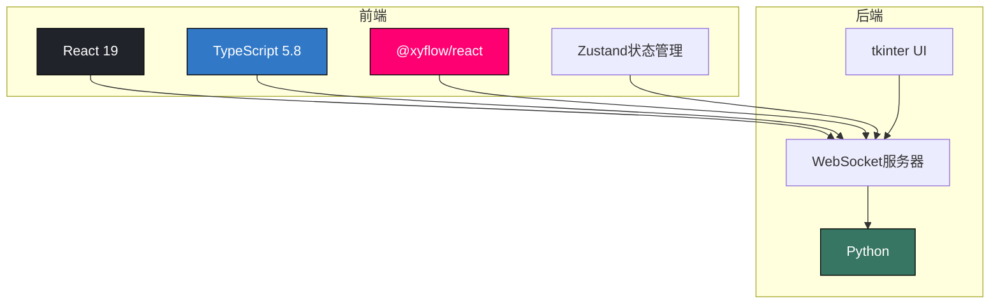
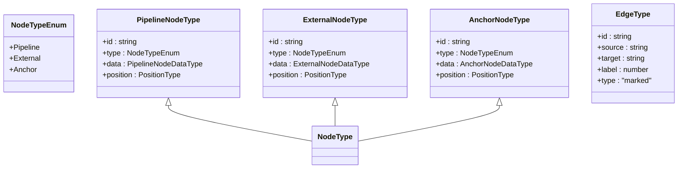
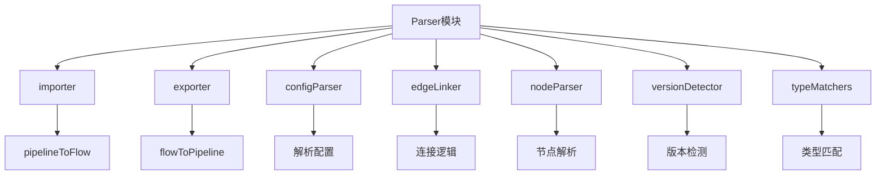
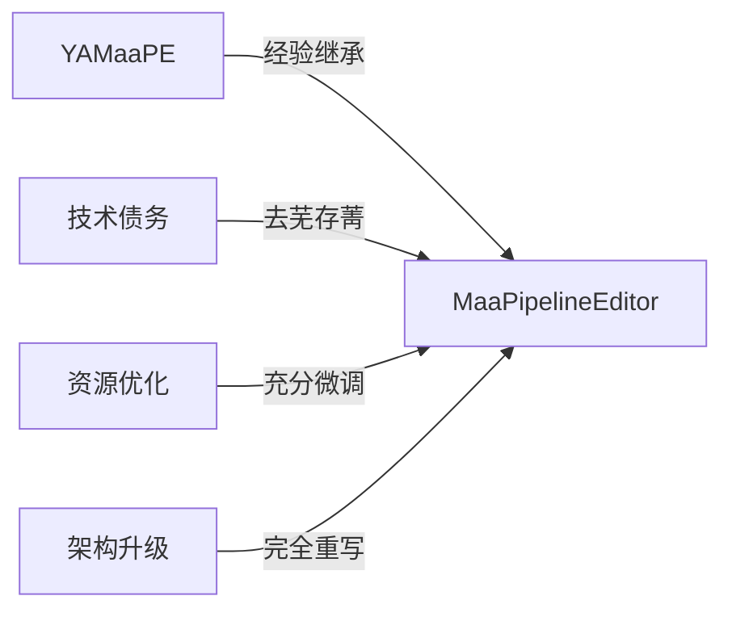
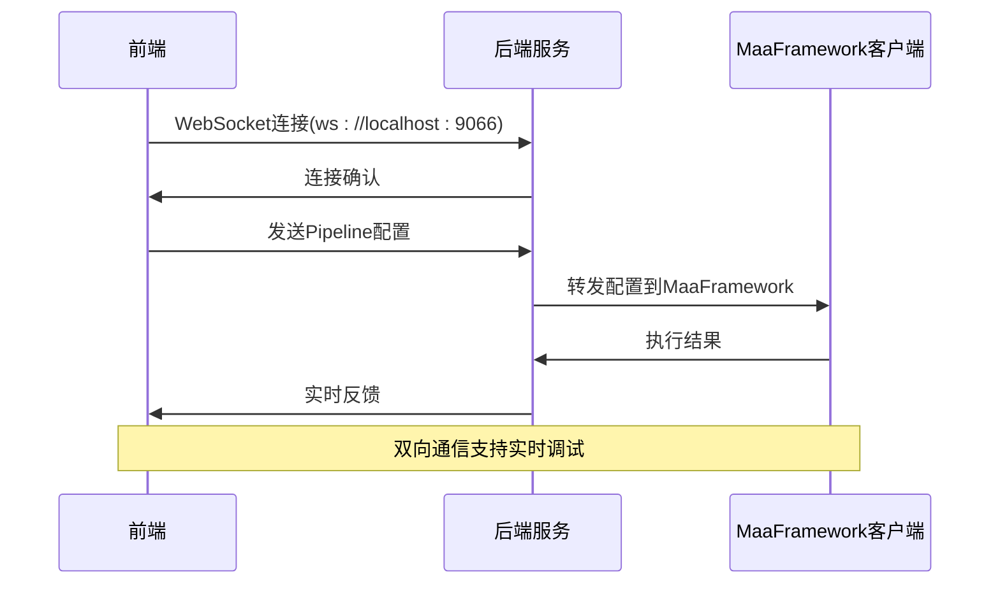

# 系统概述

<cite>
**本文档引用文件**  
- [README.md](file://README.md)
- [package.json](file://package.json)
- [server/main.py](file://server/main.py)
- [src/App.tsx](file://src/App.tsx)
- [src/core/parser/index.ts](file://src/core/parser/index.ts)
- [src/core/parser/importer.ts](file://src/core/parser/importer.ts)
- [src/core/parser/exporter.ts](file://src/core/parser/exporter.ts)
- [src/components/Flow.tsx](file://src/components/Flow.tsx)
- [src/components/flow/nodes/index.ts](file://src/components/flow/nodes/index.ts)
- [src/stores/flow/types.ts](file://src/stores/flow/types.ts)
- [src/services/server.ts](file://src/services/server.ts)
- [docsite/docs/01.指南/02.核心概念/10.概述.md](file://docsite/docs/01.指南/02.核心概念/10.概述.md)
- [docsite/docs/01.指南/04.迁移/02.从 YAMaaPE 迁移.md](file://docsite/docs/01.指南/04.迁移/02.从 YAMaaPE 迁移.md)
- [TODO.md](file://TODO.md)
</cite>

## 目录
1. [项目简介](#项目简介)
2. [设计目标与用户价值](#设计目标与用户价值)
3. [全栈架构分析](#全栈架构分析)
4. [核心功能模块](#核心功能模块)
5. [与YAMaaPE的历史渊源](#与yamaape的历史渊源)
6. [典型应用场景](#典型应用场景)
7. [系统边界与集成能力](#系统边界与集成能力)
8. [未来发展方向](#未来发展方向)

## 项目简介

MaaPipelineEditor（简称MPE）是一款基于Web前端技术栈的MaaFramework Pipeline协议工作流式可视化编辑器。该项目通过图形化界面显著降低了编写复杂JSON配置的技术门槛，使用户能够以拖拽方式构建自动化流程，极大提升了开发效率与配置可读性。

MPE基于React 19 + TypeScript 5.8 + @xyflow/react技术栈构建，采用现代化前端工程化方案，支持在线使用和本地部署。项目通过WebSocket与后端Python服务通信，实现了前后端分离的全栈架构。MPE不仅继承了前代项目YAMaaPE的开发经验，还进行了全面重构和优化，致力于实现“精细化重定位”的战略目标。

**Section sources**
- [README.md](file://README.md#L30-L43)
- [package.json](file://package.json#L1-L59)

## 设计目标与用户价值

MaaPipelineEditor的设计目标是为MaaFramework用户提供一个直观、高效、可靠的可视化工作流编辑环境。其核心价值体现在三个方面：

首先，MPE通过图形化界面解决了传统JSON配置文件难以维护的问题。用户无需记忆复杂的字段结构和嵌套关系，只需通过拖拽节点、连接端口即可完成流程构建，大大降低了技术门槛。

其次，MPE提升了自动化流程的可读性和可维护性。可视化的工作流图直观展示了各个节点之间的逻辑关系，使得流程结构一目了然，便于团队协作和后期维护。

最后，MPE通过智能解析和自动布局功能进一步提升了用户体验。系统能够自动识别节点类型、解析连接关系，并提供合理的布局建议，减少了手动调整的工作量。

**Section sources**
- [README.md](file://README.md#L30-L36)
- [docsite/docs/01.指南/02.核心概念/10.概述.md](file://docsite/docs/01.指南/02.核心概念/10.概述.md#L16-L48)

## 全栈架构分析

MaaPipelineEditor采用前后端分离的全栈架构设计，前端基于React 19 + TypeScript 5.8构建，后端基于Python WebSocket服务提供通信支持。

**Diagram sources**
- [package.json](file://package.json#L32-L34)
- [server/main.py](file://server/main.py#L1-L23)

前端技术栈以React 19为核心，采用TypeScript 5.8提供类型安全，使用@xyflow/react实现可视化工作流编辑功能。状态管理采用Zustand，通过模块化的store设计实现了高效的状态管理。项目构建工具采用Vite，提供了快速的开发服务器和高效的生产构建。

后端服务采用Python实现，通过WebSocket协议与前端进行实时通信。服务端不仅提供通信桥梁功能，还配备了基于tkinter的桌面UI界面，方便用户监控服务器状态、管理Pipeline文件和查看日志信息。

**Section sources**
- [package.json](file://package.json#L16-L35)
- [server/main.py](file://server/main.py#L1-L23)
- [server/ui/server_ui.py](file://server/ui/server_ui.py#L1-L539)

## 核心功能模块

MaaPipelineEditor的核心功能围绕可视化工作流编辑展开，主要包括节点管理、连接管理、解析器和状态管理等模块。

### 节点与连接系统

MPE支持三种主要节点类型：Pipeline节点、External节点和Anchor节点。这些节点通过@xyflow/react提供的可视化能力进行渲染和交互。

**Diagram sources**
- [src/components/flow/nodes/index.ts](file://src/components/flow/nodes/index.ts#L1-L14)
- [src/stores/flow/types.ts](file://src/stores/flow/types.ts#L132-L174)

### 解析器模块

解析器是MPE的核心功能模块，负责在可视化Flow格式与MaaFramework Pipeline JSON格式之间进行双向转换。该模块被重构为多个子模块以提高可维护性：

**Diagram sources**
- [src/core/parser/index.ts](file://src/core/parser/index.ts#L1-L73)
- [src/core/parser/importer.ts](file://src/core/parser/importer.ts#L125-L295)
- [src/core/parser/exporter.ts](file://src/core/parser/exporter.ts#L28-L137)

`pipelineToFlow`函数负责将Pipeline JSON格式解析为可视化编辑器的Flow格式，而`flowToPipeline`函数则完成相反的转换。这两个函数构成了MPE的核心编译能力。

**Section sources**
- [src/core/parser/index.ts](file://src/core/parser/index.ts#L19-L21)
- [src/core/parser/importer.ts](file://src/core/parser/importer.ts#L125-L295)
- [src/core/parser/exporter.ts](file://src/core/parser/exporter.ts#L28-L137)

## 与YAMaaPE的历史渊源

MaaPipelineEditor是在YAMaaPE项目基础上进行重构和优化的新一代可视化编辑器。根据项目README，MPE是"运用YAMaaPE开发经验去芜存菁、经过资源开发者充分微调、完全重写的MaaFramework Pipeline工作流式可视化编辑器"。

MPE保留了YAMaaPE的特殊字段兼容性，确保了旧有配置文件的平滑迁移。同时，项目对架构进行了全面升级，采用了更现代化的技术栈和更合理的代码组织方式。这种重构不仅提升了系统的性能和稳定性，也为未来的功能扩展奠定了坚实基础。

**Diagram sources**
- [README.md](file://README.md#L32-L33)
- [docsite/docs/01.指南/04.迁移/02.从 YAMaaPE 迁移.md](file://docsite/docs/01.指南/04.迁移/02.从 YAMaaPE 迁移.md#L1-L17)

**Section sources**
- [README.md](file://README.md#L32-L33)
- [docsite/docs/01.指南/04.迁移/02.从 YAMaaPE 迁移.md](file://docsite/docs/01.指南/04.迁移/02.从 YAMaaPE 迁移.md#L1-L17)

## 典型应用场景

MaaPipelineEditor的典型应用场景是构建复杂的自动化流程，如游戏日常任务自动化。项目README中展示的MNMA-清体力.json就是一个典型案例，该配置文件长达1996行，通过可视化编辑器可以直观地构建和维护。

用户可以通过MPE轻松创建包含识别、动作、条件判断等复杂逻辑的自动化流程。系统支持节点复制、粘贴、撤销/重做等操作，提供了丰富的快捷键支持，极大地提升了编辑效率。同时，MPE支持文件拖拽导入，方便用户快速加载和修改现有配置。

**Section sources**
- [README.md](file://README.md#L38-L42)

## 系统边界与集成能力

MaaPipelineEditor通过WebSocket与外部系统进行通信，实现了良好的集成能力。前端通过`LocalWebSocketServer`类与后端Python服务建立连接，支持端口配置和连接状态监控。

**Diagram sources**
- [src/services/server.ts](file://src/services/server.ts#L4-L215)
- [server/ui/server_ui.py](file://server/ui/server_ui.py#L1-L539)

系统边界清晰，前端负责可视化编辑和用户交互，后端服务负责通信中转和状态管理。这种分离设计使得MPE既可以作为独立的编辑工具使用，也可以集成到更大的自动化平台中。

**Section sources**
- [src/services/server.ts](file://src/services/server.ts#L4-L215)
- [server/ui/server_ui.py](file://server/ui/server_ui.py#L1-L539)

## 未来发展方向

根据项目TODO.md文件，MaaPipelineEditor的未来发展方向包括性能优化、Web功能增强和本地桥接服务扩展。

在性能方面，计划实现独立的JSON面板，提升大型配置文件的处理能力。在Web功能方面，将增加自定义节点模板、便签贴纸、可重复的外部/重定向节点等高级功能。在本地服务方面，将开发文件管理、流程化调试、ADB工具和AI辅助生成等实用功能。

这些规划体现了项目"精细化重定位"的战略目标，即通过持续优化和功能扩展，为用户提供更加细分和专业的业务需求解决方案。

**Section sources**
- [TODO.md](file://TODO.md#L1-L27)