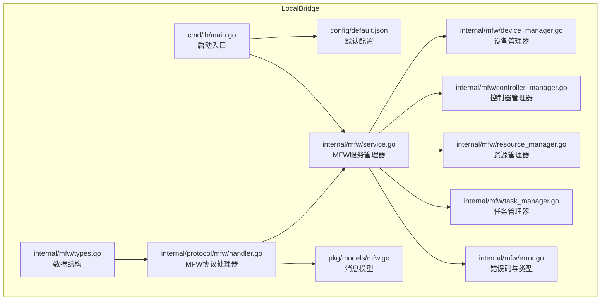
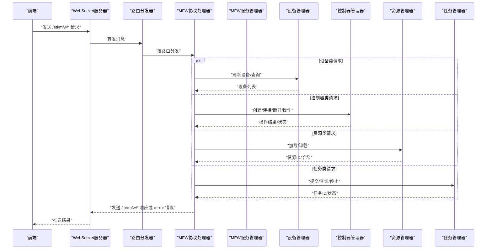

# MaaFramework 集成

<cite>
**本文引用的文件**
- [LocalBridge/README.md](file://LocalBridge/README.md)
- [LocalBridge/go.mod](file://LocalBridge/go.mod)
- [LocalBridge/cmd/lb/main.go](file://LocalBridge/cmd/lb/main.go)
- [LocalBridge/config/default.json](file://LocalBridge/config/default.json)
- [LocalBridge/internal/mfw/service.go](file://LocalBridge/internal/mfw/service.go)
- [LocalBridge/internal/mfw/types.go](file://LocalBridge/internal/mfw/types.go)
- [LocalBridge/internal/mfw/device_manager.go](file://LocalBridge/internal/mfw/device_manager.go)
- [LocalBridge/internal/mfw/controller_manager.go](file://LocalBridge/internal/mfw/controller_manager.go)
- [LocalBridge/internal/mfw/resource_manager.go](file://LocalBridge/internal/mfw/resource_manager.go)
- [LocalBridge/internal/mfw/task_manager.go](file://LocalBridge/internal/mfw/task_manager.go)
- [LocalBridge/internal/mfw/error.go](file://LocalBridge/internal/mfw/error.go)
- [LocalBridge/internal/protocol/mfw/handler.go](file://LocalBridge/internal/protocol/mfw/handler.go)
- [LocalBridge/pkg/models/mfw.go](file://LocalBridge/pkg/models/mfw.go)
- [instructions/maafw-golang/API参考/框架初始化.md](file://instructions/maafw-golang/API参考/框架初始化.md)
- [instructions/maafw-golang/核心概念/核心概念.md](file://instructions/maafw-golang/核心概念/核心概念.md)
</cite>

## 目录
1. [简介](#简介)
2. [项目结构](#项目结构)
3. [核心组件](#核心组件)
4. [架构总览](#架构总览)
5. [详细组件分析](#详细组件分析)
6. [依赖关系分析](#依赖关系分析)
7. [性能考量](#性能考量)
8. [故障排查指南](#故障排查指南)
9. [结论](#结论)
10. [附录](#附录)

## 简介
本文件面向在 MaaPipelineEditor 中集成 MaaFramework 的开发者，系统性说明 LocalBridge 如何通过 Go 侧的 MFW 子系统对接 MaaFramework 的设备控制、资源加载与任务执行能力，并通过 WebSocket 协议向前端提供统一的 MFW 协议接口。当前仓库实现了 MFW 协议处理器与管理器骨架，MaaFramework 的实际调用仍处于占位实现阶段，需在启用时接入 maa-framework-go 的真实 API。

## 项目结构
LocalBridge 的 MFW 集成位于 LocalBridge/internal/mfw 与 LocalBridge/internal/protocol/mfw，配合 cmd/lb/main.go 的服务启动流程，形成“配置加载 → 服务初始化 → 协议注册 → WebSocket 分发”的闭环。

图表来源
- [LocalBridge/cmd/lb/main.go](file://LocalBridge/cmd/lb/main.go#L54-L147)
- [LocalBridge/config/default.json](file://LocalBridge/config/default.json#L1-L29)
- [LocalBridge/internal/mfw/service.go](file://LocalBridge/internal/mfw/service.go#L1-L105)
- [LocalBridge/internal/mfw/device_manager.go](file://LocalBridge/internal/mfw/device_manager.go#L1-L74)
- [LocalBridge/internal/mfw/controller_manager.go](file://LocalBridge/internal/mfw/controller_manager.go#L1-L344)
- [LocalBridge/internal/mfw/resource_manager.go](file://LocalBridge/internal/mfw/resource_manager.go#L1-L79)
- [LocalBridge/internal/mfw/task_manager.go](file://LocalBridge/internal/mfw/task_manager.go#L1-L86)
- [LocalBridge/internal/mfw/error.go](file://LocalBridge/internal/mfw/error.go#L1-L49)
- [LocalBridge/internal/protocol/mfw/handler.go](file://LocalBridge/internal/protocol/mfw/handler.go#L1-L536)
- [LocalBridge/pkg/models/mfw.go](file://LocalBridge/pkg/models/mfw.go#L1-L169)

章节来源
- [LocalBridge/README.md](file://LocalBridge/README.md#L282-L385)
- [LocalBridge/cmd/lb/main.go](file://LocalBridge/cmd/lb/main.go#L54-L147)
- [LocalBridge/config/default.json](file://LocalBridge/config/default.json#L1-L29)

## 核心组件
- MFW 服务管理器：聚合设备、控制器、资源、任务四大管理器，负责初始化与生命周期管理。
- 设备管理器：提供 ADB 设备与 Win32 窗体的刷新与查询能力（占位实现）。
- 控制器管理器：负责控制器创建、连接、断开、点击/滑动/输入/启停应用、截图等操作（占位实现）。
- 资源管理器：负责资源加载与卸载（占位实现）。
- 任务管理器：负责任务提交、状态查询、停止（占位实现）。
- MFW 协议处理器：将前端 WebSocket 消息路由到对应管理器，并返回统一的响应或错误消息。
- 消息模型：定义 MFW 协议的消息结构，包括控制器、任务、资源、设备等数据结构。

章节来源
- [LocalBridge/internal/mfw/service.go](file://LocalBridge/internal/mfw/service.go#L1-L105)
- [LocalBridge/internal/mfw/device_manager.go](file://LocalBridge/internal/mfw/device_manager.go#L1-L74)
- [LocalBridge/internal/mfw/controller_manager.go](file://LocalBridge/internal/mfw/controller_manager.go#L1-L344)
- [LocalBridge/internal/mfw/resource_manager.go](file://LocalBridge/internal/mfw/resource_manager.go#L1-L79)
- [LocalBridge/internal/mfw/task_manager.go](file://LocalBridge/internal/mfw/task_manager.go#L1-L86)
- [LocalBridge/internal/protocol/mfw/handler.go](file://LocalBridge/internal/protocol/mfw/handler.go#L1-L536)
- [LocalBridge/pkg/models/mfw.go](file://LocalBridge/pkg/models/mfw.go#L1-L169)

## 架构总览
MFW 协议通过 WebSocket 与前端通信，消息路由由协议处理器分发到对应的管理器，管理器内部维持状态并返回统一响应。初始化流程中，主程序加载配置、创建事件总线、启动文件服务与 WebSocket 服务器，并注册 MFW 协议处理器。

图表来源
- [LocalBridge/internal/protocol/mfw/handler.go](file://LocalBridge/internal/protocol/mfw/handler.go#L23-L83)
- [LocalBridge/internal/mfw/service.go](file://LocalBridge/internal/mfw/service.go#L1-L105)
- [LocalBridge/cmd/lb/main.go](file://LocalBridge/cmd/lb/main.go#L105-L120)

章节来源
- [LocalBridge/cmd/lb/main.go](file://LocalBridge/cmd/lb/main.go#L54-L147)
- [LocalBridge/internal/protocol/mfw/handler.go](file://LocalBridge/internal/protocol/mfw/handler.go#L23-L83)

## 详细组件分析

### MFW 服务管理器（Service）
- 职责：聚合四大管理器，提供初始化与关闭能力，保护内部状态的并发访问。
- 初始化：记录初始化标志，预留调用 maa.Init() 的位置，便于后续接入真实框架。
- 关闭：清理资源，重置初始化标志。

章节来源
- [LocalBridge/internal/mfw/service.go](file://LocalBridge/internal/mfw/service.go#L1-L105)

### 设备管理器（DeviceManager）
- 职责：维护 ADB 设备与 Win32 窗体列表，提供刷新与查询接口。
- 当前实现：占位返回空列表，待对接 maa-framework-go 的 FindAdbDevices/FindWin32Windows。

章节来源
- [LocalBridge/internal/mfw/device_manager.go](file://LocalBridge/internal/mfw/device_manager.go#L1-L74)

### 控制器管理器（ControllerManager）
- 职责：控制器生命周期管理（创建/连接/断开），设备操作（点击/滑动/输入/启停应用/截图），状态查询与清理。
- 当前实现：占位创建控制器并维护状态，设备操作与截图均以占位实现替代。

章节来源
- [LocalBridge/internal/mfw/controller_manager.go](file://LocalBridge/internal/mfw/controller_manager.go#L1-L344)

### 资源管理器（ResourceManager）
- 职责：资源加载与卸载，返回资源ID与哈希。
- 当前实现：占位加载并返回资源ID，哈希待实现。

章节来源
- [LocalBridge/internal/mfw/resource_manager.go](file://LocalBridge/internal/mfw/resource_manager.go#L1-L79)

### 任务管理器（TaskManager）
- 职责：任务提交、状态查询、停止。
- 当前实现：占位提交并返回任务ID，状态查询与停止为占位实现。

章节来源
- [LocalBridge/internal/mfw/task_manager.go](file://LocalBridge/internal/mfw/task_manager.go#L1-L86)

### MFW 协议处理器（MFWHandler）
- 职责：注册 /etl/mfw/* 路由，解析前端请求，调用对应管理器，组装响应或错误消息。
- 路由覆盖：设备刷新、控制器创建/断开/操作、截图、任务提交/查询/停止、资源加载、自定义识别/动作注册（占位）。

章节来源
- [LocalBridge/internal/protocol/mfw/handler.go](file://LocalBridge/internal/protocol/mfw/handler.go#L23-L83)
- [LocalBridge/internal/protocol/mfw/handler.go](file://LocalBridge/internal/protocol/mfw/handler.go#L85-L536)

### 消息模型（pkg/models/mfw.go）
- 职责：定义 MFW 协议的消息结构，包括控制器、任务、资源、设备等请求与响应模型。

章节来源
- [LocalBridge/pkg/models/mfw.go](file://LocalBridge/pkg/models/mfw.go#L1-L169)

### 类关系图（代码级）

图表来源
- [LocalBridge/internal/mfw/service.go](file://LocalBridge/internal/mfw/service.go#L1-L105)
- [LocalBridge/internal/mfw/device_manager.go](file://LocalBridge/internal/mfw/device_manager.go#L1-L74)
- [LocalBridge/internal/mfw/controller_manager.go](file://LocalBridge/internal/mfw/controller_manager.go#L1-L344)
- [LocalBridge/internal/mfw/resource_manager.go](file://LocalBridge/internal/mfw/resource_manager.go#L1-L79)
- [LocalBridge/internal/mfw/task_manager.go](file://LocalBridge/internal/mfw/task_manager.go#L1-L86)

## 依赖关系分析
- 外部依赖：LocalBridge/go.mod 显式引入 maa-framework-go，为后续接入真实 API 提供基础。
- 启动流程：main.go 中加载配置、初始化日志、创建事件总线、启动文件服务与 WebSocket 服务器，并注册 MFW 协议处理器。
- 协议路由：MFWHandler 通过路由前缀 /etl/mfw/* 与前端交互，内部调用各管理器完成业务处理。

图表来源
- [LocalBridge/go.mod](file://LocalBridge/go.mod#L1-L37)
- [LocalBridge/cmd/lb/main.go](file://LocalBridge/cmd/lb/main.go#L54-L147)

章节来源
- [LocalBridge/go.mod](file://LocalBridge/go.mod#L1-L37)
- [LocalBridge/cmd/lb/main.go](file://LocalBridge/cmd/lb/main.go#L54-L147)

## 性能考量
- 占位实现阶段：当前所有设备操作与截图均为占位实现，不会产生实际 IO 或 CPU 开销，但也不会产生真实效果。
- 并发安全：各管理器使用互斥锁保护内部状态，避免竞态。
- 日志级别：通过配置文件控制日志级别与推送策略，避免在生产环境产生过多日志输出。
- 资源清理：控制器非活跃清理与资源卸载接口预留，建议在接入真实 API 后完善清理逻辑，避免资源泄露。

章节来源
- [LocalBridge/internal/mfw/controller_manager.go](file://LocalBridge/internal/mfw/controller_manager.go#L330-L344)
- [LocalBridge/config/default.json](file://LocalBridge/config/default.json#L1-L29)

## 故障排查指南
- 初始化失败：检查配置文件中的 maafw.enabled 与 lib_dir 设置，确认 maa-framework-go 的运行时库路径正确。
- 控制器操作失败：确认控制器已连接，检查占位实现是否被替换为真实 API。
- 任务状态异常：确认任务提交成功并返回任务ID，查询状态前确保任务已进入运行状态。
- 错误码与错误类型：使用统一的 MFW 错误码与错误类型，便于前端统一处理。

章节来源
- [LocalBridge/internal/mfw/error.go](file://LocalBridge/internal/mfw/error.go#L1-L49)
- [LocalBridge/internal/protocol/mfw/handler.go](file://LocalBridge/internal/protocol/mfw/handler.go#L478-L488)
- [LocalBridge/config/default.json](file://LocalBridge/config/default.json#L24-L29)

## 结论
LocalBridge 的 MFW 集成已完成协议层与管理器骨架，为接入 maa-framework-go 提供了清晰的扩展点。当前实现以占位为主，建议在启用 MFW 功能时逐步替换占位逻辑，接入真实 API，并完善错误处理与资源清理，确保在生产环境中的稳定性与性能。

## 附录

### 启用 MFW 的步骤指引
- 配置启用：在配置文件中将 maafw.enabled 设为 true，并设置 lib_dir 指向 maa-framework-go 的运行时库目录。
- 初始化接入：在 Service.Initialize 中调用 maa.Init()，并根据需要设置日志目录、插件路径等选项。
- 占位替换：将各管理器中的 TODO 注释替换为真实 API 调用，确保控制器、资源、任务与截图等功能正常工作。
- 协议完善：根据前端需求完善 /lte/mfw/* 响应与 /error 错误消息格式。

章节来源
- [LocalBridge/config/default.json](file://LocalBridge/config/default.json#L24-L29)
- [LocalBridge/internal/mfw/service.go](file://LocalBridge/internal/mfw/service.go#L30-L54)
- [instructions/maafw-golang/API参考/框架初始化.md](file://instructions/maafw-golang/API参考/框架初始化.md#L1-L278)
- [instructions/maafw-golang/核心概念/核心概念.md](file://instructions/maafw-golang/核心概念/核心概念.md#L1-L501)