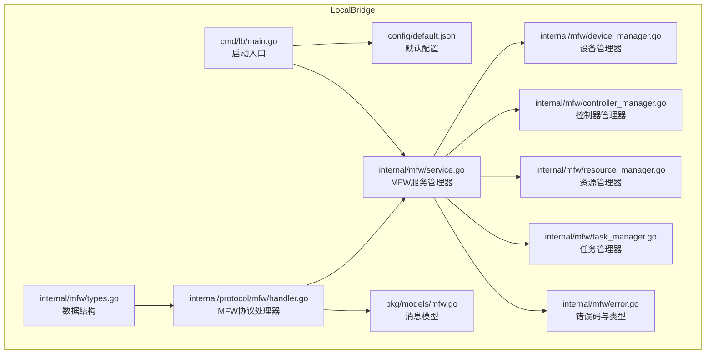
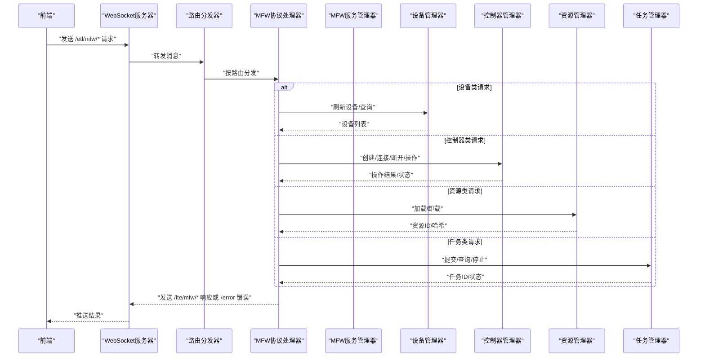
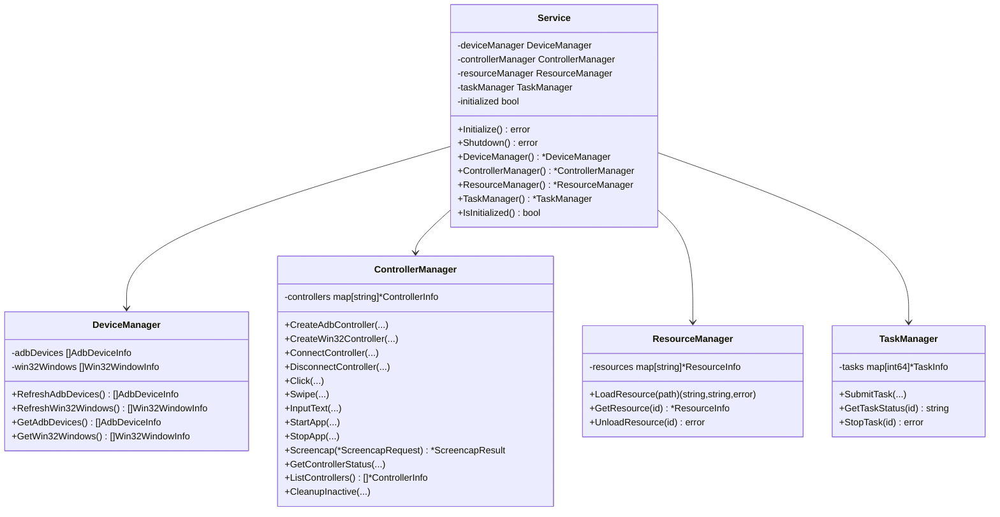
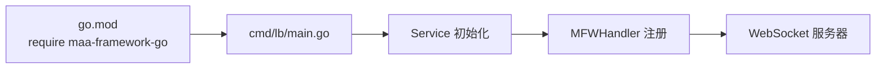

# MaaFramework 集成

<cite>
**本文引用的文件**
- [LocalBridge/README.md](file://LocalBridge/README.md)
- [LocalBridge/go.mod](file://LocalBridge/go.mod)
- [LocalBridge/cmd/lb/main.go](file://LocalBridge/cmd/lb/main.go)
- [LocalBridge/config/default.json](file://LocalBridge/config/default.json)
- [LocalBridge/internal/mfw/service.go](file://LocalBridge/internal/mfw/service.go)
- [LocalBridge/internal/mfw/types.go](file://LocalBridge/internal/mfw/types.go)
- [LocalBridge/internal/mfw/device_manager.go](file://LocalBridge/internal/mfw/device_manager.go)
- [LocalBridge/internal/mfw/controller_manager.go](file://LocalBridge/internal/mfw/controller_manager.go)
- [LocalBridge/internal/mfw/resource_manager.go](file://LocalBridge/internal/mfw/resource_manager.go)
- [LocalBridge/internal/mfw/task_manager.go](file://LocalBridge/internal/mfw/task_manager.go)
- [LocalBridge/internal/mfw/error.go](file://LocalBridge/internal/mfw/error.go)
- [LocalBridge/internal/protocol/mfw/handler.go](file://LocalBridge/internal/protocol/mfw/handler.go)
- [LocalBridge/pkg/models/mfw.go](file://LocalBridge/pkg/models/mfw.go)
- [instructions/maafw-golang/API参考/框架初始化.md](file://instructions/maafw-golang/API参考/框架初始化.md)
- [instructions/maafw-golang/核心概念/核心概念.md](file://instructions/maafw-golang/核心概念/核心概念.md)
- [instructions/maafw-guide/2.1-集成文档.md](file://instructions/maafw-guide/2.1-集成文档.md)
- [instructions/maafw-guide/2.2-集成接口一览.md](file://instructions/maafw-guide/2.2-集成接口一览.md)
- [instructions/maafw-guide/2.3-回调协议.md](file://instructions/maafw-guide/2.3-回调协议.md)
- [instructions/maafw-guide/2.4-控制方式说明.md](file://instructions/maafw-guide/2.4-控制方式说明.md)
</cite>

## 更新摘要
**已更新内容**
- 在"简介"部分新增了对maafw-guide中集成文档、回调协议和控制方式说明的引用
- 新增"集成文档概览"章节，整合了各语言绑定的集成情况，包括新增的Rust语言支持和更新的Java状态
- 新增"回调协议"章节，详细说明了MaaFramework的事件回调机制
- 新增"控制方式说明"章节，详细说明了Adb、Win32和PlayCover控制器的控制方式
- 更新了"附录"中的启用MFW步骤指引，增加了对回调协议和控制方式的参考

## 目录
1. [简介](#简介)
2. [项目结构](#项目结构)
3. [核心组件](#核心组件)
4. [架构总览](#架构总览)
5. [详细组件分析](#详细组件分析)
6. [依赖关系分析](#依赖关系分析)
7. [性能考量](#性能考量)
8. [故障排查指南](#故障排查指南)
9. [结论](#结论)
10. [附录](#附录)
11. [集成文档概览](#集成文档概览)
12. [回调协议](#回调协议)
13. [控制方式说明](#控制方式说明)

## 简介
本文件面向在 MaaPipelineEditor 中集成 MaaFramework 的开发者，系统性说明 LocalBridge 如何通过 Go 侧的 MFW 子系统对接 MaaFramework 的设备控制、资源加载与任务执行能力，并通过 WebSocket 协议向前端提供统一的 MFW 协议接口。当前仓库实现了 MFW 协议处理器与管理器骨架，MaaFramework 的实际调用仍处于占位实现阶段，需在启用时接入 maa-framework-go 的真实 API。本文档已更新以包含maafw-guide中的新集成指南、回调协议和控制方式说明。

## 项目结构
LocalBridge 的 MFW 集成位于 LocalBridge/internal/mfw 与 LocalBridge/internal/protocol/mfw，配合 cmd/lb/main.go 的服务启动流程，形成"配置加载 → 服务初始化 → 协议注册 → WebSocket 分发"的闭环。



**图表来源**
- [LocalBridge/cmd/lb/main.go](file://LocalBridge/cmd/lb/main.go#L54-L147)
- [LocalBridge/config/default.json](file://LocalBridge/config/default.json#L1-L29)
- [LocalBridge/internal/mfw/service.go](file://LocalBridge/internal/mfw/service.go#L1-L105)
- [LocalBridge/internal/mfw/device_manager.go](file://LocalBridge/internal/mfw/device_manager.go#L1-L74)
- [LocalBridge/internal/mfw/controller_manager.go](file://LocalBridge/internal/mfw/controller_manager.go#L1-L344)
- [LocalBridge/internal/mfw/resource_manager.go](file://LocalBridge/internal/mfw/resource_manager.go#L1-L79)
- [LocalBridge/internal/mfw/task_manager.go](file://LocalBridge/internal/mfw/task_manager.go#L1-L86)
- [LocalBridge/internal/mfw/error.go](file://LocalBridge/internal/mfw/error.go#L1-L49)
- [LocalBridge/internal/protocol/mfw/handler.go](file://LocalBridge/internal/protocol/mfw/handler.go#L1-L536)
- [LocalBridge/pkg/models/mfw.go](file://LocalBridge/pkg/models/mfw.go#L1-L169)

**章节来源**
- [LocalBridge/README.md](file://LocalBridge/README.md#L282-L385)
- [LocalBridge/cmd/lb/main.go](file://LocalBridge/cmd/lb/main.go#L54-L147)
- [LocalBridge/config/default.json](file://LocalBridge/config/default.json#L1-L29)

## 核心组件
- MFW 服务管理器：聚合设备、控制器、资源、任务四大管理器，负责初始化与生命周期管理。
- 设备管理器：提供 ADB 设备与 Win32 窗体的刷新与查询能力（占位实现）。
- 控制器管理器：负责控制器创建、连接、断开、点击/滑动/输入/启停应用、截图等操作（占位实现）。
- 资源管理器：负责资源加载与卸载（占位实现）。
- 任务管理器：负责任务提交、状态查询、停止（占位实现）。
- MFW 协议处理器：将前端 WebSocket 消息路由到对应管理器，并返回统一的响应或错误消息。
- 消息模型：定义 MFW 协议的消息结构，包括控制器、任务、资源、设备等数据结构。

**章节来源**
- [LocalBridge/internal/mfw/service.go](file://LocalBridge/internal/mfw/service.go#L1-L105)
- [LocalBridge/internal/mfw/device_manager.go](file://LocalBridge/internal/mfw/device_manager.go#L1-L74)
- [LocalBridge/internal/mfw/controller_manager.go](file://LocalBridge/internal/mfw/controller_manager.go#L1-L344)
- [LocalBridge/internal/mfw/resource_manager.go](file://LocalBridge/internal/mfw/resource_manager.go#L1-L79)
- [LocalBridge/internal/mfw/task_manager.go](file://LocalBridge/internal/mfw/task_manager.go#L1-L86)
- [LocalBridge/internal/protocol/mfw/handler.go](file://LocalBridge/internal/protocol/mfw/handler.go#L1-L536)
- [LocalBridge/pkg/models/mfw.go](file://LocalBridge/pkg/models/mfw.go#L1-L169)

## 架构总览
MFW 协议通过 WebSocket 与前端通信，消息路由由协议处理器分发到对应的管理器，管理器内部维持状态并返回统一响应。初始化流程中，主程序加载配置、创建事件总线、启动文件服务与 WebSocket 服务器，并注册 MFW 协议处理器。



**图表来源**
- [LocalBridge/internal/protocol/mfw/handler.go](file://LocalBridge/internal/protocol/mfw/handler.go#L23-L83)
- [LocalBridge/internal/mfw/service.go](file://LocalBridge/internal/mfw/service.go#L1-L105)
- [LocalBridge/cmd/lb/main.go](file://LocalBridge/cmd/lb/main.go#L105-L120)

**章节来源**
- [LocalBridge/cmd/lb/main.go](file://LocalBridge/cmd/lb/main.go#L54-L147)
- [LocalBridge/internal/protocol/mfw/handler.go](file://LocalBridge/internal/protocol/mfw/handler.go#L23-L83)

## 详细组件分析

### MFW 服务管理器（Service）
- 职责：聚合四大管理器，提供初始化与关闭能力，保护内部状态的并发访问。
- 初始化：记录初始化标志，预留调用 maa.Init() 的位置，便于后续接入真实框架。
- 关闭：清理资源，重置初始化标志。

**章节来源**
- [LocalBridge/internal/mfw/service.go](file://LocalBridge/internal/mfw/service.go#L1-L105)

### 设备管理器（DeviceManager）
- 职责：维护 ADB 设备与 Win32 窗体列表，提供刷新与查询接口。
- 当前实现：占位返回空列表，待对接 maa-framework-go 的 FindAdbDevices/FindWin32Windows。

**章节来源**
- [LocalBridge/internal/mfw/device_manager.go](file://LocalBridge/internal/mfw/device_manager.go#L1-L74)

### 控制器管理器（ControllerManager）
- 职责：控制器生命周期管理（创建/连接/断开），设备操作（点击/滑动/输入/启停应用/截图），状态查询与清理。
- 当前实现：占位创建控制器并维护状态，设备操作与截图均以占位实现替代。

**章节来源**
- [LocalBridge/internal/mfw/controller_manager.go](file://LocalBridge/internal/mfw/controller_manager.go#L1-L344)

### 资源管理器（ResourceManager）
- 职责：资源加载与卸载，返回资源ID与哈希。
- 当前实现：占位加载并返回资源ID，哈希待实现。

**章节来源**
- [LocalBridge/internal/mfw/resource_manager.go](file://LocalBridge/internal/mfw/resource_manager.go#L1-L79)

### 任务管理器（TaskManager）
- 职责：任务提交、状态查询、停止。
- 当前实现：占位提交并返回任务ID，状态查询与停止为占位实现。

**章节来源**
- [LocalBridge/internal/mfw/task_manager.go](file://LocalBridge/internal/mfw/task_manager.go#L1-L86)

### MFW 协议处理器（MFWHandler）
- 职责：注册 /etl/mfw/* 路由，解析前端请求，调用对应管理器，组装响应或错误消息。
- 路由覆盖：设备刷新、控制器创建/断开/操作、截图、任务提交/查询/停止、资源加载、自定义识别/动作注册（占位）。

**章节来源**
- [LocalBridge/internal/protocol/mfw/handler.go](file://LocalBridge/internal/protocol/mfw/handler.go#L23-L83)
- [LocalBridge/internal/protocol/mfw/handler.go](file://LocalBridge/internal/protocol/mfw/handler.go#L85-L536)

### 消息模型（pkg/models/mfw.go）
- 职责：定义 MFW 协议的消息结构，包括控制器、任务、资源、设备等请求与响应模型。

**章节来源**
- [LocalBridge/pkg/models/mfw.go](file://LocalBridge/pkg/models/mfw.go#L1-L169)

### 类关系图（代码级）


**图表来源**
- [LocalBridge/internal/mfw/service.go](file://LocalBridge/internal/mfw/service.go#L1-L105)
- [LocalBridge/internal/mfw/device_manager.go](file://LocalBridge/internal/mfw/device_manager.go#L1-L74)
- [LocalBridge/internal/mfw/controller_manager.go](file://LocalBridge/internal/mfw/controller_manager.go#L1-L344)
- [LocalBridge/internal/mfw/resource_manager.go](file://LocalBridge/internal/mfw/resource_manager.go#L1-L79)
- [LocalBridge/internal/mfw/task_manager.go](file://LocalBridge/internal/mfw/task_manager.go#L1-L86)

## 依赖关系分析
- 外部依赖：LocalBridge/go.mod 显式引入 maa-framework-go，为后续接入真实 API 提供基础。
- 启动流程：main.go 中加载配置、初始化日志、创建事件总线、启动文件服务与 WebSocket 服务器，并注册 MFW 协议处理器。
- 协议路由：MFWHandler 通过路由前缀 /etl/mfw/* 与前端交互，内部调用各管理器完成业务处理。



**图表来源**
- [LocalBridge/go.mod](file://LocalBridge/go.mod#L1-L37)
- [LocalBridge/cmd/lb/main.go](file://LocalBridge/cmd/lb/main.go#L54-L147)

**章节来源**
- [LocalBridge/go.mod](file://LocalBridge/go.mod#L1-L37)
- [LocalBridge/cmd/lb/main.go](file://LocalBridge/cmd/lb/main.go#L54-L147)

## 性能考量
- 占位实现阶段：当前所有设备操作与截图均为占位实现，不会产生实际 IO 或 CPU 开销，但也不会产生真实效果。
- 并发安全：各管理器使用互斥锁保护内部状态，避免竞态。
- 日志级别：通过配置文件控制日志级别与推送策略，避免在生产环境产生过多日志输出。
- 资源清理：控制器非活跃清理与资源卸载接口预留，建议在接入真实 API 后完善清理逻辑，避免资源泄露。

**章节来源**
- [LocalBridge/internal/mfw/controller_manager.go](file://LocalBridge/internal/mfw/controller_manager.go#L330-L344)
- [LocalBridge/config/default.json](file://LocalBridge/config/default.json#L1-L29)

## 故障排查指南
- 初始化失败：检查配置文件中的 maafw.enabled 与 lib_dir 设置，确认 maa-framework-go 的运行时库路径正确。
- 控制器操作失败：确认控制器已连接，检查占位实现是否被替换为真实 API。
- 任务状态异常：确认任务提交成功并返回任务ID，查询状态前确保任务已进入运行状态。
- 错误码与错误类型：使用统一的 MFW 错误码与错误类型，便于前端统一处理。

**章节来源**
- [LocalBridge/internal/mfw/error.go](file://LocalBridge/internal/mfw/error.go#L1-L49)
- [LocalBridge/internal/protocol/mfw/handler.go](file://LocalBridge/internal/protocol/mfw/handler.go#L478-L488)
- [LocalBridge/config/default.json](file://LocalBridge/config/default.json#L24-L29)

## 结论
LocalBridge 的 MFW 集成已完成协议层与管理器骨架，为接入 maa-framework-go 提供了清晰的扩展点。当前实现以占位为主，建议在启用 MFW 功能时逐步替换占位逻辑，接入真实 API，并完善错误处理与资源清理，确保在生产环境中的稳定性与性能。

## 附录

### 启用 MFW 的步骤指引
- 配置启用：在配置文件中将 maafw.enabled 设为 true，并设置 lib_dir 指向 maa-framework-go 的运行时库目录。
- 初始化接入：在 Service.Initialize 中调用 maa.Init()，并根据需要设置日志目录、插件路径等选项。
- 占位替换：将各管理器中的 TODO 注释替换为真实 API 调用，确保控制器、资源、任务与截图等功能正常工作。
- 协议完善：根据前端需求完善 /lte/mfw/* 响应与 /error 错误消息格式。
- 回调协议：参考[回调协议](#回调协议)文档，实现事件回调处理。
- 控制方式：参考[控制方式说明](#控制方式说明)文档，正确配置控制器的输入和截图方式。

**章节来源**
- [LocalBridge/config/default.json](file://LocalBridge/config/default.json#L24-L29)
- [LocalBridge/internal/mfw/service.go](file://LocalBridge/internal/mfw/service.go#L30-L54)
- [instructions/maafw-golang/API参考/框架初始化.md](file://instructions/maafw-golang/API参考/框架初始化.md#L1-L278)
- [instructions/maafw-golang/核心概念/核心概念.md](file://instructions/maafw-golang/核心概念/核心概念.md#L1-L501)

## 集成文档概览
本章节整合了maafw-guide/2.1-集成文档.md中的内容，提供了MaaFramework各语言绑定的集成情况概览。

### C++
- 接口情况：
  - 原生接口 ✔️
  - 全功能可用 ✔️
  - 提供 sample ✔️
  - CI 单元测试 ✔️
  - 标准化接口 ❌
  - 协议解析封装 ❌
- [接口源码](https://github.com/MaaXYZ/MaaFramework/tree/main/include)
- [下载地址](https://github.com/MaaXYZ/MaaFramework/releases)
- [集成示例](https://github.com/MaaXYZ/MaaFramework/blob/main/sample/cpp)
- [单元测试](https://github.com/MaaXYZ/MaaFramework/tree/main/test)

### Python
- 接口情况：
  - 官方支持，已适配最新版本 ✔️
  - 提供 sample ✔️
  - CI 单元测试 ✔️
  - 标准化接口 ✔️
  - 协议解析封装 ✔️
- [接口源码](https://github.com/MaaXYZ/MaaFramework/tree/main/source/binding/Python)
- [下载地址](https://pypi.org/project/MaaFw/)
- [集成示例](https://github.com/MaaXYZ/MaaFramework/tree/main/sample/python)
- [单元测试](https://github.com/MaaXYZ/MaaFramework/tree/main/test/python)

### NodeJS
- 接口情况：
  - 官方支持，已适配最新版本 ✔️
  - 全功能可用 ✔️
  - 提供 sample ✔️
  - CI 单元测试 ✔️
  - 标准化接口 ✔️
  - 协议解析封装 ✔️
- [接口源码](https://github.com/MaaXYZ/MaaFramework/tree/main/source/binding/NodeJS)
- [文档](./NodeJS/J1.1-快速开始.md)
- [下载地址](https://npmjs.com/@maaxyz/maa-node)
- [集成示例](https://github.com/MaaXYZ/MaaFramework/tree/main/sample/nodejs)
- [单元测试](https://github.com/MaaXYZ/MaaFramework/tree/main/test/nodejs)

### CSharp
- 接口情况：
  - 官方支持，已适配最新版本 ✔️
  - 全功能可用 ✔️
  - 提供 sample ✔️
  - CI 单元测试 ✔️
  - 标准化接口 ✔️
    - 回调封装：NotificationCallback 包装为 Callback 事件，其他包装为接口
  - 协议解析封装 ❓
    - 通过 Binding.Extensions 库部分支持
- [仓库地址](https://github.com/MaaXYZ/MaaFramework.Binding.CSharp)
- [下载地址](https://www.nuget.org/packages/Maa.Framework)
- [集成示例](https://github.com/MaaXYZ/MaaFramework.Binding.CSharp/tree/main/sample)
- [单元测试](https://github.com/MaaXYZ/MaaFramework.Binding.CSharp/tree/main/src/MaaFramework.Binding.UnitTests)

### Golang
- 接口情况：
  - 官方支持，已适配最新版本 ✔️
  - 提供 sample ✔️
  - CI 单元测试 ✔️
  - 标准化接口 ✔️
  - 协议解析封装 ✔️
- [仓库地址](https://github.com/MaaXYZ/maa-framework-go)
- [集成示例](https://github.com/MaaXYZ/maa-framework-go/tree/main/examples)
- [单元测试](https://github.com/MaaXYZ/maa-framework-go/tree/main/test)

### Java
- 接口情况：
  - 仅适配到 v3 版本，已经过时 🙁
  - 提供 sample ✔️
  - CI 单元测试 ✔️
  - 标准化接口 ✔️
  - 协议解析封装 ❌
- [仓库地址](https://github.com/hanhuoer/maa-framework-java)
- [下载地址](https://central.sonatype.com/namespace/io.github.hanhuoer)
- [集成示例](https://github.com/hanhuoer/maa-framework-java/blob/main/maa-sample/README.md)
- [单元测试](https://github.com/hanhuoer/maa-framework-java/blob/main/maa-core/src/test)

### Rust
- 接口情况：
  - 官方支持，已适配最新版本 ✔️
  - 全功能可用 ✔️
  - 提供 sample ✔️
  - CI 单元测试 ✔️
  - 标准化接口 ✔️
  - 协议解析封装 ✔️
- [仓库地址](https://github.com/MaaXYZ/maa-framework-rs)
- [下载地址](https://crates.io/crates/maa-framework)
- [集成示例](https://github.com/MaaXYZ/maa-framework-rs/tree/main/examples)
- [单元测试](https://github.com/MaaXYZ/maa-framework-rs/tree/main/tests)

### 更多语言
各语言支持离不开协作者的贡献！若您也想为 MaaFramework 新增某一门语言的接口，请参考 [标准化接口设计](4.2-标准化接口设计.md)，并向我们提出 PR！

**章节来源**
- [instructions/maafw-guide/2.1-集成文档.md](file://instructions/maafw-guide/2.1-集成文档.md)

## 回调协议
本章节详细说明了MaaFramework的事件回调机制，内容来自maafw-guide/2.3-回调协议.md。

### 消息格式
MaaFramework 通过 `MaaEventCallback` 回调函数向上层应用发送各种状态通知和事件消息。所有回调消息都采用统一的格式：消息类型（message）+ 详细数据（details）。

```cpp
typedef void(MAA_CALL* MaaEventCallback)(void* handle, const char* message, const char* details_json, void* trans_arg);
```

- **handle**: 相关对象的句柄
  - MaaTasker* for MaaTasker event
  - MaaResource* for MaaResource event
  - MaaController* for MaaController event
  - MaaContext* for MaaContext event
- **message**: 消息类型字符串，标识事件类型
- **details_json**: JSON 格式的详细数据，包含具体的事件信息
- **callback_arg**: 用户自定义的回调参数

### 消息类型

#### 资源加载消息
用于通知资源加载的状态变化。

##### `Resource.Loading.Starting`
资源开始加载时发送。

**details_json 结构：**
```json
{
    "res_id": 12345,
    "path": "/path/to/resource",
    "type": "Bundle",
    "hash": "abc123def456"
}
```

- `res_id`: 资源 ID（数字）
- `path`: 资源路径（字符串）
- `type`: 加载类型（字符串）
  - `"Bundle"`: 完整资源目录（通过 `post_bundle` 加载）
  - `"OcrModel"`: OCR 模型目录（通过 `post_ocr_model` 加载）
  - `"Pipeline"`: Pipeline 目录或单个 json/jsonc 文件（通过 `post_pipeline` 加载）
  - `"Image"`: 图片目录或单个图片文件（通过 `post_image` 加载）
- `hash`: 资源哈希值（字符串）

##### `Resource.Loading.Succeeded`
资源加载成功时发送。数据结构同上。

##### `Resource.Loading.Failed`
资源加载失败时发送。数据结构同上。

#### 控制器动作消息
用于通知控制器执行动作的状态。

##### `Controller.Action.Starting`
控制器开始执行动作时发送。

**details_json 结构：**
```json
{
    "ctrl_id": 12345,
    "uuid": "550e8400-e29b-41d4-a716-446655440000",
    "action": "Click",
    "param": {
        "x": 100,
        "y": 200
    }
}
```

- `ctrl_id`: 控制器 ID（数字）
- `uuid`: 唯一标识符（字符串）
- `action`: 动作类型（字符串）
- `param`: 动作参数（对象）

##### `Controller.Action.Succeeded`
控制器动作执行成功时发送。数据结构同上。

##### `Controller.Action.Failed`
控制器动作执行失败时发送。数据结构同上。

#### 任务消息
用于通知任务执行的状态。

##### `Tasker.Task.Starting`
任务开始执行时发送。

**details_json 结构：**
```json
{
    "task_id": 12345,
    "entry": "MyTask",
    "uuid": "550e8400-e29b-41d4-a716-446655440000",
    "hash": "abc123def456"
}
```

- `task_id`: 任务 ID（数字）
- `entry`: 入口任务名称（字符串）
- `uuid`: 唯一标识符（字符串）
- `hash`: 任务哈希值（字符串）

##### `Tasker.Task.Succeeded`
任务执行成功时发送。数据结构同上。

##### `Tasker.Task.Failed`
任务执行失败时发送。数据结构同上。

#### 节点下一步列表消息
用于通知节点识别下一步节点列表。

##### `Node.NextList.Starting`
节点开始识别下一步节点列表时发送。

**details_json 结构：**
```jsonc
{
    "task_id": 12345,
    "name": "NodeA",
    "list": [
        {
            "name": "NodeB",
            "jump_back": false,
            "anchor": false
        },
        {
            "name": "NodeC",
            "jump_back": true,
            "anchor": false
        },
        {
            "name": "LastHandler",
            "jump_back": false,
            "anchor": true
        }
    ],
    "focus": any,
}
```

- `task_id`: 任务 ID（数字）
- `name`: 节点名称（字符串）
- `list`: 下一步节点列表（对象数组）
  - `name`: 节点名称或锚点名称（字符串）
  - `jump_back`: 是否回跳（布尔值）
  - `anchor`: 是否为锚点引用（布尔值），若为 true 则 name 为锚点名称
- `focus`: 焦点相关数据（任意类型）

##### `Node.NextList.Succeeded`
节点成功识别下一步节点列表时发送。数据结构同上。

##### `Node.NextList.Failed`
节点识别下一步节点列表失败时发送。数据结构同上。

#### 节点识别消息
用于通知节点识别过程的状态。

##### `Node.Recognition.Starting`
节点开始识别时发送。

**details_json 结构：**
```jsonc
{
    "task_id": 12345,
    "reco_id": 67890,
    "name": "NodeA",
    "focus": any,
}
```

- `task_id`: 任务 ID（数字）
- `reco_id`: 识别 ID（数字）
- `name`: 节点名称（字符串）
- `focus`: 焦点相关数据（任意类型）

##### `Node.Recognition.Succeeded`
节点识别成功时发送。数据结构同上。

##### `Node.Recognition.Failed`
节点识别失败时发送。数据结构同上。

#### 节点动作消息
用于通知节点执行动作的状态。

##### `Node.Action.Starting`
节点开始执行动作时发送。

**details_json 结构：**
```jsonc
{
    "task_id": 12345,
    "node_id": 67890,
    "action_id": 11111,
    "name": "NodeA",
    "focus": any,
}
```

- `task_id`: 任务 ID（数字）
- `action_id`: 操作 ID（数字）
- `name`: 节点名称（字符串）
- `focus`: 焦点相关数据（任意类型）

##### `Node.Action.Succeeded`
节点动作执行成功时发送。数据结构同上。

##### `Node.Action.Failed`
节点动作执行失败时发送。数据结构同上。

#### 流水线节点消息
用于通知流水线节点执行的状态。流水线节点消息在通过 `post_task` 或 `run_task` 执行完整流水线任务时发送。

##### `Node.PipelineNode.Starting`
流水线节点开始执行时发送。

**details_json 结构：**
```jsonc
{
    "task_id": 12345,
    "node_id": 67890,
    "name": "NodeA",
    "focus": any,
}
```

- `task_id`: 任务 ID（数字）
- `node_id`: 节点 ID（数字）
- `name`: 节点名称（字符串）
- `focus`: 焦点相关数据（任意类型）

##### `Node.PipelineNode.Succeeded`
流水线节点执行成功时发送。数据结构同上。

##### `Node.PipelineNode.Failed`
流水线节点执行失败时发送。数据结构同上。

#### 识别节点消息
用于通知识别节点执行的状态。识别节点消息仅在通过 `run_recognition` 执行仅识别任务时发送。

##### `Node.RecognitionNode.Starting`
识别节点开始执行时发送。

**details_json 结构：**
```jsonc
{
    "task_id": 12345,
    "node_id": 67890,
    "name": "NodeA",
    "focus": any,
}
```

- `task_id`: 任务 ID（数字）
- `node_id`: 节点 ID（数字）
- `name`: 节点名称（字符串）
- `focus`: 焦点相关数据（任意类型）

##### `Node.RecognitionNode.Succeeded`
识别节点执行成功时发送。数据结构同上。

##### `Node.RecognitionNode.Failed`
识别节点执行失败时发送。数据结构同上。

#### 动作节点消息
用于通知动作节点执行的状态。动作节点消息仅在通过 `run_action` 执行仅动作任务时发送。

##### `Node.ActionNode.Starting`
动作节点开始执行时发送。

**details_json 结构：**
```jsonc
{
    "task_id": 12345,
    "node_id": 67890,
    "name": "NodeA",
    "focus": any,
}
```

- `task_id`: 任务 ID（数字）
- `node_id`: 节点 ID（数字）
- `name`: 节点名称（字符串）
- `focus`: 焦点相关数据（任意类型）

##### `Node.ActionNode.Succeeded`
动作节点执行成功时发送。数据结构同上。

##### `Node.ActionNode.Failed`
动作节点执行失败时发送。数据结构同上。

### 使用示例
```cpp
void MyCallback(void* handle, const char* message, const char* details_json, void* callback_arg)
{
    // 解析消息类型
    if (strcmp(message, "Tasker.Task.Starting") == 0) {
        // 解析 JSON 获取任务详情
        // 更新 UI 显示任务开始状态
    }
    else if (strcmp(message, "Node.Recognition.Succeeded") == 0) {
        // 处理识别成功事件
        // 更新识别结果显示
    }
    // ... 处理其他消息类型
}

// 设置回调
MaaTaskerAddSink(tasker, MyCallback, nullptr);
MaaTaskerAddNodeSink(tasker, MyCallback, nullptr);
```

### 注意事项
1. **JSON 解析**: `details_json` 参数始终为有效的 JSON 字符串，建议使用成熟的 JSON 库进行解析
2. **线程安全**: 回调函数可能在不同线程中被调用，需要注意线程安全
3. **性能考虑**: 回调函数应尽快返回，避免阻塞框架的执行流程
4. **错误处理**: 建议在回调函数中添加异常处理，防止回调函数异常影响框架运行

**章节来源**
- [instructions/maafw-guide/2.3-回调协议.md](file://instructions/maafw-guide/2.3-回调协议.md)

## 控制方式说明
本章节详细说明了MaaFramework中Screencap（截图）和Input（控制）的各种方式及其配置，内容来自maafw-guide/2.4-控制方式说明.md。

> [!TIP]
>
> - 对于 API ，screencap/input 使用 `int` 类型（按位或组合）；对于 [ProjectInterface V2](3.3-ProjectInterfaceV2协议.md)，使用 `string` 类型（直接使用名称）。
> - [ProjectInterface V2](3.3-ProjectInterfaceV2协议.md) 仅支持配置 Win32 控制器的 screencap/mouse/keyboard 方式。Adb 控制器的 screencap/input 使用 `MaaToolkitAdbDeviceFind` 自动检测和选择最优方式，无需手动配置。

### Adb

#### Adb Input
> 参考 [MaaDef.h](https://github.com/MaaXYZ/MaaFramework/blob/main/include/MaaFramework/MaaDef.h#L227-L240)

将下面选择的方式 **按位或** 合并为一个值提供。MaaFramework 将会按照固定优先级顺序尝试所有提供的方式，选择首个可用方式。

默认尝试除 EmulatorExtras 外所有方式。

> 优先级: EmulatorExtras > Maatouch > MinitouchAndAdbKey > AdbShell

| 名称 | API 值 | 速度 | 兼容性 | 说明 |
| --- | --- | --- | --- | --- |
| AdbShell | `1` | 慢 | 高 |  |
| MinitouchAndAdbKey | `2` | 快 | 中 | 按键仍使用 AdbShell |
| Maatouch | `4` | 快 | 中 |  |
| EmulatorExtras | `8` | 快 | 低 | 仅支持模拟器：MuMu 12 |

#### Adb Screencap
> 参考 [MaaDef.h](https://github.com/MaaXYZ/MaaFramework/blob/main/include/MaaFramework/MaaDef.h#L208-L225)

将下面选择的方式 **按位或** 合并为一个值提供。MaaFramework 将会尝试所有提供的方式，选择最快的可用方式。

默认尝试除 `RawByNetcat`，`MinicapDirect`，`MinicapStream` 外所有方式。

`MinicapDirect` 和 `MinicapStream` 由于会编码为 jpg，为有损编码，将显著降低模板匹配的效果，不建议使用。

| 名称 | API 值 | 速度 | 兼容性 | 编码 | 说明 |
| --- | --- | --- | --- | --- | --- |
| EncodeToFileAndPull | `1` | 慢 | 高 | 无损 |  |
| Encode | `2` | 慢 | 高 | 无损 |  |
| RawWithGzip | `4` | 中 | 高 | 无损 |  |
| RawByNetcat | `8` | 快 | 低 | 无损 |  |
| MinicapDirect | `16` | 快 | 低 | 有损 |  |
| MinicapStream | `32` | 极快 | 低 | 有损 |  |
| EmulatorExtras | `64` | 极快 | 低 | 无损 | 仅支持模拟器：MuMu 12、雷电 9 |

### Win32

#### Win32 Input
> 参考 [MaaDef.h](https://github.com/MaaXYZ/MaaFramework/blob/main/include/MaaFramework/MaaDef.h#L252-L259)

选择下面的值提供。

无默认值。Client 可以选择一个作为默认值。

Win32 下不同程序处理输入的方法不同，不存在一个通用方式。

| 名称 | API 值 | 兼容性 | 需管理员权限 | 抢占鼠标 | 支持后台 | 说明 |
| --- | --- | --- | --- | --- | --- | --- |
| Seize | `1` | 高 | 否 | 是 | 否 |  |
| SendMessage | `2` | 中 | 可能 | 否 | 是 |  |
| PostMessage | `4` | 中 | 可能 | 否 | 是 |  |
| LegacyEvent | `8` | 低 | 否 | 是 | 否 |  |
| PostThreadMessage | `16` | 低 | 可能 | 否 | 是 |  |
| SendMessageWithCursorPos | `32` | 中 | 可能 | 短暂 | 是 | 专为原神等检测实际鼠标位置的游戏设计 |
| PostMessageWithCursorPos | `64` | 中 | 可能 | 短暂 | 是 | 专为原神等检测实际鼠标位置的游戏设计 |

> [!NOTE]
>
> - 管理员权限主要取决于目标程序的权限级别，若目标程序为管理员权限，则需以管理员权限运行以保证兼容性。
> - `WithCursorPos` 系列方式会短暂移动光标到目标位置，发送完消息后会将光标移回原位置，因此会"短暂"抢占鼠标，但不会阻止用户操作。

#### Win32 Screencap
> 参考 [MaaDef.h](https://github.com/MaaXYZ/MaaFramework/blob/main/include/MaaFramework/MaaDef.h#L242-L250)

选择下面的值提供。

无默认值。Client 可以选择一个作为默认值。

Win32 下不同程序处理绘制的方法不同，不存在一个通用方式。

| 名称 | API 值 | 速度 | 兼容性 | 需管理员权限 | 支持后台 | 说明 |
| --- | --- | --- | --- | --- | --- | --- |
| GDI | `1` | 快 | 中 | 否 | 否 |  |
| FramePool | `2` | 极快 | 中 | 否 | 是 | Windows 10 1903+ 可用 |
| DXGI_DesktopDup | `4` | 极快 | 低 | 否 | 否 | 桌面复制（全屏输出复制） |
| DXGI_DesktopDup_Window | `8` | 极快 | 低 | 否 | 否 | 桌面复制后裁剪 |
| PrintWindow | `16` | 中 | 中 | 否 | 是 |  |
| ScreenDC | `32` | 快 | 高 | 否 | 否 |  |

> [!NOTE]
>
> Windows 在窗口最小化后会停止绘制该窗口内容，所有截图方式均无法获取有效内容，请避免窗口最小化。

### PlayCover (macOS)
PlayCover 控制器用于在 macOS 上控制通过 [fork版PlayCover](https://github.com/hguandl/PlayCover/releases) 运行的 iOS 应用程序。

#### 使用方式
```cpp
// C API
auto controller = MaaPlayCoverControllerCreate("127.0.0.1:1717", "com.example.app");
```

```python
// Python
from maa.controller import PlayCoverController
controller = PlayCoverController("127.0.0.1:1717", "com.example.app")
```

```typescript
// NodeJS
const controller = new maa.PlayCoverController("127.0.0.1:1717", "com.example.app")
```

#### 参数说明
| 参数 | 说明 |
| --- | --- |
| address | PlayTools 服务监听地址，格式为 `host:port`，如 `127.0.0.1:1717` |
| uuid | 目标应用的 Bundle Identifier，如 `com.hypergryph.arknights` |

#### 支持的功能
| 功能 | 支持 | 说明 |
| --- | --- | --- |
| 截图 (screencap) | ✓ | 通过 PlayTools 协议获取 RGBA 原始数据 |
| 点击 (click) | ✓ | 使用 touch_down + touch_up 实现 |
| 滑动 (swipe) | ✓ | 使用三次样条插值实现平滑轨迹 |
| 触摸 (touch_down/move/up) | ✓ | 仅支持单点触摸 (contact=0) |
| 停止应用 (stop_app) | ✓ | 发送终止命令 |
| 启动应用 (start_app) | ✗ | PlayCover 不支持通过协议启动应用 |
| 按键 (click_key/key_down/key_up) | ✗ | PlayTools 协议不支持 |
| 文本输入 (input_text) | ✗ | PlayTools 协议不支持 |
| 滚动 (scroll) | ✗ | PlayTools 协议不支持 |

#### 前置要求
1. 在 macOS 上安装 [fork版PlayCover](https://github.com/hguandl/PlayCover/releases)
2. 目标 iOS 应用需要在playcover中启用 MaaTools 功能

> [!NOTE]
>
> PlayCover 控制器的特性标志为 `MaaControllerFeature_UseMouseDownAndUpInsteadOfClick`，表示框架会使用 touch_down + touch_up 代替 click 操作。

**章节来源**
- [instructions/maafw-guide/2.4-控制方式说明.md](file://instructions/maafw-guide/2.4-控制方式说明.md)