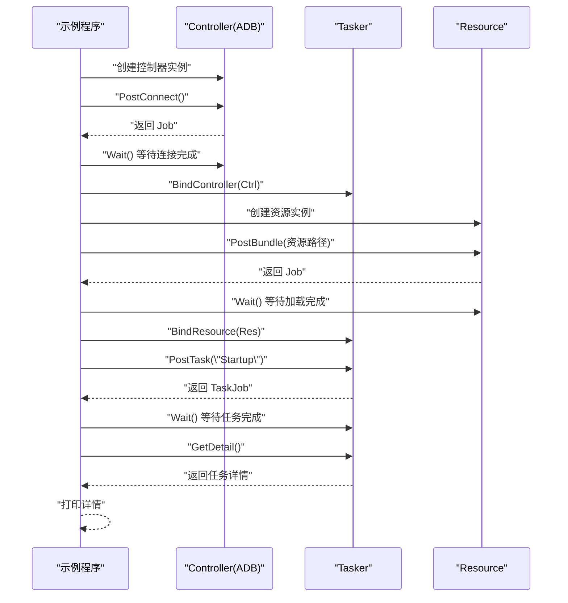
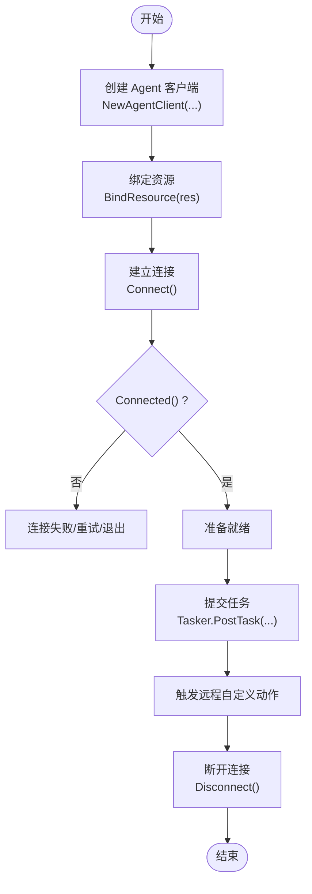
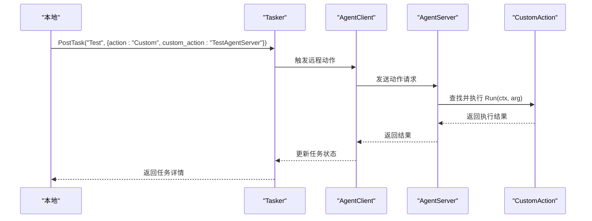
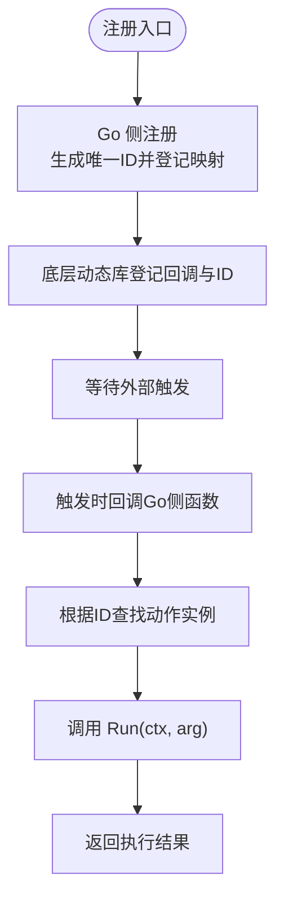

# maafw-golang 示例与用例

<cite>
**本文档中引用的文件**
- [示例与用例.md](file://instructions/maafw-golang-binding/示例与用例/示例与用例.md)
- [快速开始示例.md](file://instructions/maafw-golang-binding/示例与用例/快速开始示例.md)
- [Agent客户端示例.md](file://instructions/maafw-golang-binding/示例与用例/Agent客户端示例.md)
- [Agent服务器示例.md](file://instructions/maafw-golang-binding/示例与用例/Agent服务器示例.md)
- [自定义动作示例.md](file://instructions/maafw-golang-binding/示例与用例/自定义动作示例.md)
- [自定义识别示例.md](file://instructions/maafw-golang-binding/示例与用例/自定义识别示例.md)
- [quick-start/main.go](file://examples/quick-start/main.go)
- [quick-start/resource/pipeline/pipeline.json](file://examples/quick-start/resource/pipeline/pipeline.json)
- [custom-action/main.go](file://examples/custom-action/main.go)
- [custom-action/resource/pipeline/pipeline.json](file://examples/custom-action/resource/pipeline/pipeline.json)
- [custom-recognition/main.go](file://examples/custom-recognition/main.go)
- [custom-recognition/resource/pipeline/pipeline.json](file://examples/custom-recognition/resource/pipeline/pipeline.json)
- [agent-client/main.go](file://examples/agent-client/main.go)
- [agent-server/main.go](file://examples/agent-server/main.go)
- [maa.go](file://maa.go)
- [context.go](file://context.go)
- [custom_action.go](file://custom_action.go)
- [custom_recognition.go](file://custom_recognition.go)
- [agent_client.go](file://agent_client.go)
- [agent_server.go](file://agent_server.go)
</cite>

## 更新摘要
**所做更改**
- 更新了快速开始示例文档，反映框架版本升级至 v5.7.0-alpha.2
- 扩展了示例与用例文档结构，增加了详细的组件分析和架构说明
- 新增了 Agent 客户端与服务器示例的深入技术分析
- 增强了自定义动作与识别示例的技术深度
- 完善了故障排查指南和最佳实践建议

## 目录
1. [简介](#简介)
2. [快速入门示例](#快速入门示例)
3. [自定义动作示例](#自定义动作示例)
4. [自定义识别示例](#自定义识别示例)
5. [Agent 客户端与服务端示例](#agent-客户端与服务端示例)
6. [实际应用场景扩展](#实际应用场景扩展)
7. [最佳实践与建议](#最佳实践与建议)
8. [结论](#结论)

## 简介
本文档旨在深入解析 `maa-framework-go` 项目中 `examples` 目录下的五个核心示例：`quick-start`、`custom-action`、`custom-recognition`、`agent-client` 和 `agent-server`。通过对每个示例的逐行代码逻辑分析，揭示其设计目的与实现机制，并将其扩展为实用的开发教程和真实用例。文档不仅说明"如何做"，更解释"为什么这样做"，帮助开发者理解框架的核心概念，如任务调度、资源绑定、自定义动作与识别、分布式通信等，从而将这些模式灵活应用于自己的自动化项目中。

**更新** 文档已根据最新的框架版本 v5.7.0-alpha.2 进行更新，包版本从 v3 升级到 v4，提供了更稳定的 API 和更好的性能表现。

## 快速入门示例

该示例展示了如何使用 MAA 框架快速启动一个基本的自动化流程。代码从初始化框架开始，创建任务器（Tasker），连接 ADB 设备，加载资源，并执行一个名为 "Startup" 的预定义任务。

其核心流程包括：调用 `maa.Init()` 初始化框架，使用 `NewTasker()` 创建任务管理器，通过 `FindAdbDevices()` 发现设备并创建 `AdbController` 进行设备控制，加载本地资源包（Resource Bundle），最后通过 `PostTask("Startup")` 异步提交任务并等待执行结果。资源文件 `pipeline.json` 定义了 "Startup" 任务的具体行为为 `StartApp`，即启动应用。

此示例是所有更复杂应用的基础，它确立了框架使用的基本模板：初始化 -> 创建控制器 -> 创建资源 -> 绑定 -> 执行任务。

**更新** 版本信息已更新至 v5.7.0-alpha.2，包版本从 v3 升级到 v4。

**章节来源**
- [快速开始示例.md](file://instructions/maafw-golang-binding/示例与用例/快速开始示例.md#L38-L48)
- [quick-start/main.go](file://examples/quick-start/main.go#L1-L65)
- [quick-start/resource/pipeline/pipeline.json](file://examples/quick-start/resource/pipeline/pipeline.json#L1-L5)
- [maa.go](file://maa.go#L122-L171)

### 核心组件详解

#### 框架初始化与全局选项
- **初始化入口**：在示例中，先调用初始化函数加载底层库并注册函数，随后设置初始化选项（日志目录、保存绘图、标准输出级别、调试模式、插件路径等），最后标记框架已初始化。
- **初始化选项函数**：提供多种选项函数用于设置库目录、日志目录、是否保存绘图、标准输出日志级别、调试模式、插件路径等。
- **全局选项设置**：将选项值传递给底层全局选项接口，确保后续行为符合预期。

**更新** 版本升级至 v5.7.0-alpha.2，对应包版本 v4。

#### Tasker 的创建与绑定
- **创建 Tasker**：通过工厂函数创建 Tasker 实例，并在内部维护回调映射表，便于事件回调的注册与注销。
- **绑定 Controller 与 Resource**：Tasker 需要绑定已初始化的 Controller 与 Resource 才能正常工作；绑定后可执行任务并获取任务详情。
- **初始化状态检查**：在提交任务前检查 Tasker 是否已初始化，避免未绑定导致的失败。

#### ADB 控制器的创建与异步连接
- **设备发现**：使用工具函数查找可用的 ADB 设备，返回包含 ADB 路径、地址、截图与输入方法、配置等信息的设备列表。
- **创建 ADB 控制器**：通过构造函数传入设备信息与代理二进制路径，创建控制器实例。
- **异步连接**：调用异步连接方法返回 Job，通过 Wait 阻塞直到连接完成；连接成功后可进行截图、输入、应用控制等操作。
- **输入/截图方法**：控制器提供点击、滑动、按键、文本输入、启动/停止应用、触控、滚动、截图等操作，均以异步方式返回 Job。

**章节来源**
- [快速开始示例.md](file://instructions/maafw-golang-binding/示例与用例/快速开始示例.md#L143-L185)

### 关键流程时序图：异步连接与任务提交

**图表来源**
- [controller.go](file://controller.go#L275-L279)
- [resource.go](file://resource.go#L292-L297)
- [tasker.go](file://tasker.go#L106-L109)
- [job.go](file://job.go#L161-L169)
- [examples/quick-start/main.go](file://examples/quick-start/main.go#L1-L65)

## 自定义动作示例

此示例在快速入门的基础上，演示了如何向框架注册一个自定义的动作（Custom Action）。开发者可以实现 `CustomAction` 接口，定义自己的业务逻辑。

代码中定义了一个名为 `MyAct` 的结构体，并实现了 `Run` 方法。在 `main` 函数中，通过 `res.RegisterCustomAction("MyAct", &MyAct{})` 将其实例注册到资源中，注册名称为 "MyAct"。随后，`pipeline.json` 文件将 "Startup" 任务的动作类型设置为 `Custom`，并指定 `custom_action` 为 "MyAct"。当任务执行到此步骤时，框架会回调 `MyAct.Run` 方法。

`Run` 方法接收一个 `*Context` 和 `*CustomActionArg` 参数，允许开发者访问当前执行上下文和任务详情。此机制提供了极大的灵活性，使开发者可以在自动化流程中插入任意的 Go 代码，如数据处理、外部 API 调用或复杂的条件判断。

**更新** 增加了详细的组件分析和架构说明。

**章节来源**
- [自定义动作示例.md](file://instructions/maafw-golang-binding/示例与用例/自定义动作示例.md#L27-L34)
- [custom-action/main.go](file://examples/custom-action/main.go#L1-L49)
- [custom-action/resource/pipeline/pipeline.json](file://examples/custom-action/resource/pipeline/pipeline.json#L1-L6)
- [custom_action.go](file://custom_action.go#L46-L48)
- [context.go](file://context.go#L205-L208)

### 自定义动作接口与回调代理

#### 接口定义与回调代理
- **接口定义**：CustomAction 定义 Run(ctx, arg) bool，要求实现者在 Run 中完成具体动作逻辑并返回是否成功。
- **回调代理**：_MaaCustomActionCallbackAgent 负责从底层回调中提取参数，构造 Context 与 CustomActionArg，然后调用用户实现的 Run，并将布尔结果转回底层。
- **注册与注销**：registerCustomAction 生成唯一ID并保存到全局映射；unregisterCustomAction 用于清理。

#### 资源注册与回调桥接
- **Resource.RegisterCustomAction**：
  - 调用 registerCustomAction 获取唯一ID；
  - 更新资源存储映射（ResStore），将名称映射到ID；
  - 调用底层注册函数，传入代理函数与ID（以指针形式传递ID）。
- **资源存储映射**：
  - ResStoreValue 中维护 CustomActionsCallbackID，确保同一名称的覆盖与清理。
- **反注册与清空**：
  - UnregisterCustomAction 与 ClearCustomAction 对应清理逻辑。

**章节来源**
- [自定义动作示例.md](file://instructions/maafw-golang-binding/示例与用例/自定义动作示例.md#L126-L222)

### 示例主程序与调用时机

#### 主程序初始化流程
- **主程序初始化框架、控制器、资源与任务执行器**；
- **通过 Resource.RegisterCustomAction 注册名为 "MyAct" 的自定义动作**；
- **通过 Tasker.PostTask 触发任务，任务配置中指定 action 为 "Custom"，custom_action 为 "MyAct"**；
- **任务执行过程中，当遇到自定义动作节点时，底层会回调代理函数，最终调用 MyAct.Run 并返回结果**；
- **最终通过 TaskJob.Wait().GetDetail() 获取任务详情并输出**。

**章节来源**
- [自定义动作示例.md](file://instructions/maafw-golang-binding/示例与用例/自定义动作示例.md#L223-L255)

## 自定义识别示例

此示例展示了如何实现一个自定义的识别逻辑（Custom Recognition），用于处理标准识别方式（如模板匹配、OCR）无法满足的场景。

代码中定义了 `MyRec` 结构体并实现了 `CustomRecognition` 接口的 `Run` 方法。该方法接收图像（`arg.Img`）和感兴趣区域（ROI）等参数，并返回一个包含识别结果（矩形框和详情）的 `*CustomRecognitionResult`。

示例中的 `Run` 方法展示了 `Context` 的强大功能：
- **嵌套识别**：通过 `ctx.RunRecognition` 调用框架内置的 "MyCustomOCR" 识别器。
- **动态覆盖**：使用 `ctx.OverridePipeline` 动态修改识别流程的参数，如 ROI。
- **上下文克隆**：通过 `ctx.Clone()` 创建新的上下文实例，避免影响主流程。
- **执行任务**：使用 `newContext.RunTask` 在新上下文中执行其他任务。
- **控制流程**：调用 `ctx.OverrideNext` 动态修改后续任务的执行顺序。
- **设备交互**：通过 `ctx.GetTasker().GetController().PostClick` 发送点击指令。

`pipeline.json` 文件将 "Startup" 任务的识别方式设置为 `Custom`，并指向 "MyRec"，从而触发自定义识别逻辑。

**更新** 增加了详细的组件分析和架构说明。

**章节来源**
- [自定义识别示例.md](file://instructions/maafw-golang-binding/示例与用例/自定义识别示例.md#L25-L34)
- [custom-recognition/main.go](file://examples/custom-recognition/main.go#L1-L77)
- [custom-recognition/resource/pipeline/pipeline.json](file://examples/custom-recognition/resource/pipeline/pipeline.json#L1-L12)
- [custom_recognition.go](file://custom_recognition.go#L52-L54)

### 自定义识别接口与回调代理

#### CustomRecognition 接口
- **接口签名**：Run(ctx *Context, arg *CustomRecognitionArg) (*CustomRecognitionResult, bool)
- **返回值**：包含识别框与详情字符串，布尔值表示是否成功。
- **回调代理**：_MaaCustomRecognitionCallbackAgent 将原生传入的上下文句柄、任务信息、图像与 ROI 包装为 Go 层对象后调用用户实现的 Run，并回写结果。

#### 上下文 API 深度解析
- **RunRecognition**：在当前上下文中运行指定识别节点，支持通过 override 参数临时覆盖节点配置（如 roi）。
- **OverridePipeline**：以 JSON 或可序列化对象形式覆盖节点配置，常用于动态调整 ROI、阈值等参数。
- **Clone**：复制当前上下文，生成可独立操作的新上下文，适合多分支或并行处理。
- **OverrideNext**：将当前任务的后续节点列表替换为自定义顺序，实现灵活的任务流控制。
- **GetTasker / GetNodeData**：获取 Tasker 实例与节点数据，便于进一步操作或读取节点配置。

**章节来源**
- [自定义识别示例.md](file://instructions/maafw-golang-binding/示例与用例/自定义识别示例.md#L131-L205)

### 设备控制 API

#### PostClick(x, y)
- **作用**：向设备发送点击事件，常用于自定义识别后的自动化操作。
- **使用**：通过 `ctx.GetTasker().GetController()` 获取控制器实例后调用。

#### 其他常用控制
- **PostSwipe、PostStartApp、PostStopApp、PostInputText、PostClickKey** 等，均以类似模式提供。

**章节来源**
- [自定义识别示例.md](file://instructions/maafw-golang-binding/示例与用例/自定义识别示例.md#L206-L215)

## Agent 客户端与服务端示例

这两个示例共同演示了 MAA 框架的分布式能力。`agent-server` 运行在远程设备上，提供自定义动作的执行能力；`agent-client` 运行在主控端，负责任务的调度和协调。

在 `agent-server` 示例中，程序通过 `os.Args[1]` 接收一个 socket ID，调用 `AgentServerRegisterCustomAction` 注册名为 "TestAgentServer" 的自定义动作，并通过 `AgentServerStartUp` 启动服务。服务启动后，它会进入等待状态（`AgentServerJoin`），直到收到客户端的请求。

在 `agent-client` 示例中，程序创建一个 `AgentClient` 实例，连接到指定的 socket ID。它不直接创建控制器或资源，而是通过 `client.BindResource(res)` 将资源绑定到客户端。当客户端提交一个任务，且该任务的动作是 `Custom` 并指向远程注册的动作名（如 "TestAgentServer"）时，框架会自动将执行请求转发给 `agent-server`。服务端执行完自定义动作后，将结果返回给客户端。

这种架构实现了计算与控制的分离，适用于需要在多台设备上集中管理自动化任务的场景。

**更新** 增加了详细的组件分析和架构说明。

**章节来源**
- [Agent客户端示例.md](file://instructions/maafw-golang-binding/示例与用例/Agent客户端示例.md#L32-L40)
- [Agent服务器示例.md](file://instructions/maafw-golang-binding/示例与用例/Agent服务器示例.md#L31-L40)
- [agent-client/main.go](file://examples/agent-client/main.go#L1-L56)
- [agent-server/main.go](file://examples/agent-server/main.go#L1-L37)
- [agent_client.go](file://agent_client.go#L1-L112)
- [agent_server.go](file://agent_server.go#L1-L102)

### Agent 客户端创建与连接流程

#### NewAgentClient(identifier)
- **创建 Agent 客户端实例**：内部通过 native 层动态加载对应平台的库并注册符号，返回 Go 封装对象。
- **BindResource(res)**：将本地 Resource 绑定到 Agent 客户端，使远端可共享资源信息。
- **Connect()**：发起连接，底层通过 purego 注册的函数与服务器建立通道。
- **Connected()/Alive()**：查询连接状态与服务器存活。
- **SetTimeout(dur)**：设置超时时间，dur<0 将被拒绝。
- **GetCustomActionList()/GetCustomRecognitionList()**：获取远端可用的自定义动作与识别名称列表。

**图表来源**
- [agent_client.go](file://agent_client.go#L1-L112)
- [examples/agent-client/main.go](file://examples/agent-client/main.go#L1-L56)

**章节来源**
- [Agent客户端示例.md](file://instructions/maafw-golang-binding/示例与用例/Agent客户端示例.md#L152-L182)

### 任务提交与远程自定义动作执行

#### Tasker.PostTask(entry, override...)
- **提交任务**：override 可为 JSON 字符串或可序列化对象，内部会进行序列化失败兜底。
- **任务详情查询**：Tasker.getTaskDetail()/getNodeDetail()/getRecognitionDetail()/getActionDetail() 查询任务链路节点、识别与动作详情。
- **自定义动作参数**：在示例中通过 TaskDetail 的 action 字段指定为 Custom，并传入 custom_action 名称，服务器侧据此路由到已注册的动作实现。

**图表来源**
- [examples/agent-client/main.go](file://examples/agent-client/main.go#L1-L56)
- [tasker.go](file://tasker.go#L1-L433)
- [custom_action.go](file://custom_action.go#L1-L92)
- [examples/agent-server/main.go](file://examples/agent-server/main.go#L1-L37)

**章节来源**
- [Agent客户端示例.md](file://instructions/maafw-golang-binding/示例与用例/Agent客户端示例.md#L183-L215)

### AgentServerRegisterCustomAction：注册名为 "TestAgentServer" 的动作处理器

#### 步骤概览
- **注册过程**：在示例中，通过 AgentServerRegisterCustomAction(name, action) 完成注册。name 为 "TestAgentServer"，action 为自定义实现。
- **Go 侧处理**：Go 侧会将传入的 CustomAction 实例包装为全局映射表中的唯一 ID，并将该 ID 作为"透传参数"传递给底层动态库。
- **底层存储**：底层动态库保存回调指针与该 ID，后续触发时再回传给 Go 侧回调函数。
- **关键要点**：注册名必须与流水线配置一致，否则无法匹配到目标动作。回调函数内部会从映射表中取出对应实例并执行 Run(ctx, arg)，然后返回状态码。

**图表来源**
- [agent_server.go](file://agent_server.go#L22-L33)
- [custom_action.go](file://custom_action.go#L16-L24)
- [custom_action.go](file://custom_action.go#L50-L92)
- [examples/agent-server/main.go](file://examples/agent-server/main.go#L13-L21)

**章节来源**
- [Agent服务器示例.md](file://instructions/maafw-golang-binding/示例与用例/Agent服务器示例.md#L131-L163)

## 实际应用场景扩展

### 如何实现一个简单的游戏自动化脚本
基于 `quick-start` 示例，可以轻松构建游戏自动化脚本。首先，通过 ADB 连接手机，确保游戏应用的包名和活动名已知。在 `pipeline.json` 中定义一系列任务，如 `Login`（登录）、`DailyCheckIn`（每日签到）、`FarmResources`（资源采集）。每个任务可以配置为 `Click` 动作，指定屏幕坐标，或使用 `TemplateMatch` 进行图像识别。通过 `PostTask` 按顺序执行这些任务，即可实现全自动的日常任务处理。

### 如何集成OCR进行文本识别
`custom-recognition` 示例为此提供了基础。开发者可以集成第三方 OCR 库（如 Tesseract 或 PaddleOCR）。在 `CustomRecognition.Run` 方法中，接收框架传入的图像，调用 OCR 库进行识别，将结果与预期文本（如 `arg.CustomRecognitionParam`）进行比对。如果匹配，则返回识别到的矩形区域，框架将在此区域执行后续动作（如点击）。这使得脚本能够根据屏幕上的动态文本做出决策。

### 如何构建一个分布式的自动化系统
`agent-client` 和 `agent-server` 示例是构建分布式系统的核心。设想一个场景：一台中央服务器（运行 `agent-client`）管理着多台手机（每台运行 `agent-server`）。中央服务器可以：
1. 维护一个全局的任务队列。
2. 根据每台手机的状态（空闲/忙碌）动态分配任务。
3. 将需要特定设备能力（如特定型号手机）的任务定向发送。
4. 收集所有设备的执行日志进行统一分析。
通过这种方式，可以实现大规模、高可用的自动化集群。

**更新** 增加了更详细的场景描述和实施建议。

## 最佳实践与建议

### 版本管理与兼容性
- **框架版本升级**：从 v5.6.0 升级到 v5.7.0-alpha.2，包版本从 v3 升级到 v4，提供更稳定的 API 和更好的性能表现。
- **包版本兼容**：注意包版本从 v3 升级到 v4 后的 API 变化，确保代码兼容性。

### 资源管理
- **资源管理**：始终使用 `defer resource.Destroy()` 确保资源被正确释放，避免内存泄漏。
- **控制器管理**：使用 `defer ctrl.Destroy()` 确保控制器资源正确释放。
- **Tasker 生命周期**：在程序退出时确保 Tasker 正确销毁。

### 错误处理
- **初始化检查**：在生产环境中，应检查 `Initialized()` 和各种 `Post` 操作的返回值，实现健壮的错误处理和重试机制。
- **连接状态监控**：使用 `Connected()` 和 `Alive()` 检查 Agent 连接状态。
- **任务状态查询**：通过 `TaskJob.Wait().GetDetail()` 获取详细的任务执行状态。

### 配置初始化
- **全局选项设置**：利用 `maa.Init` 的 `InitOption` 函数式选项，可以精确控制日志目录、日志级别和调试模式，便于问题排查。
- **日志配置**：合理设置日志目录与标准输出级别，避免在生产环境输出过多日志。
- **调试模式**：调试模式会增加额外开销，仅在开发阶段启用。

### 自定义动作的幂等性
- **幂等性设计**：设计自定义动作时，尽量使其具有幂等性，即多次执行不会产生副作用，这有助于在任务失败时安全地重试。
- **状态检查**：在自定义动作中加入状态检查，避免重复执行相同的操作。

### 性能考量
- **异步作业模型**：PostTask/PostConnect 等均返回 Job，通过 Wait() 阻塞等待，避免忙轮询。
- **缓冲区复用**：ImageBuffer/StringBuffer/列表缓冲在本地与远端间传递原始数据，减少不必要的拷贝与格式转换。
- **超时控制**：SetTimeout 可限制远端动作执行时间，防止阻塞影响整体吞吐。
- **频繁操作优化**：频繁的 `OverridePipeline` 和 `Clone` 操作可能带来性能开销，应在必要时使用，并进行性能测试。

**更新** 增加了版本管理和性能优化的具体建议。

## 结论
通过对 `maa-framework-go` 中五个核心示例的深入分析，我们不仅掌握了框架的基本使用方法，还理解了其扩展机制和分布式架构的设计精髓。从简单的任务执行到复杂的自定义逻辑，再到跨设备的协同工作，MAA 框架为开发者提供了一套强大而灵活的工具。

**更新** 文档已根据最新的框架版本 v5.7.0-alpha.2 进行更新，包版本从 v3 升级到 v4，提供了更稳定的 API 和更好的性能表现。开发者应基于这些基础示例，结合自身需求，不断探索和实践，以构建出高效、可靠的自动化解决方案。

随着框架版本的持续演进，建议开发者关注以下方面：
- **版本升级**：定期更新到最新版本，享受性能改进和新功能。
- **API 兼容性**：关注包版本升级带来的 API 变化，及时更新代码。
- **最佳实践**：遵循文档中的最佳实践建议，确保应用的稳定性和性能。
- **故障排查**：利用文档提供的故障排查指南，快速定位和解决问题。

通过持续学习和实践，开发者可以充分利用 MAA 框架的强大功能，构建出更加智能化和自动化的应用系统。