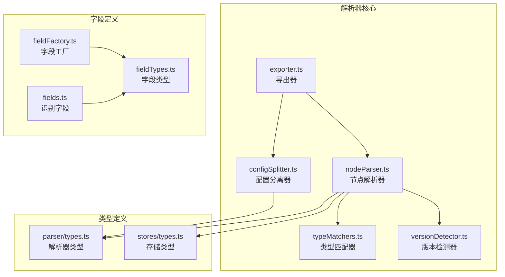
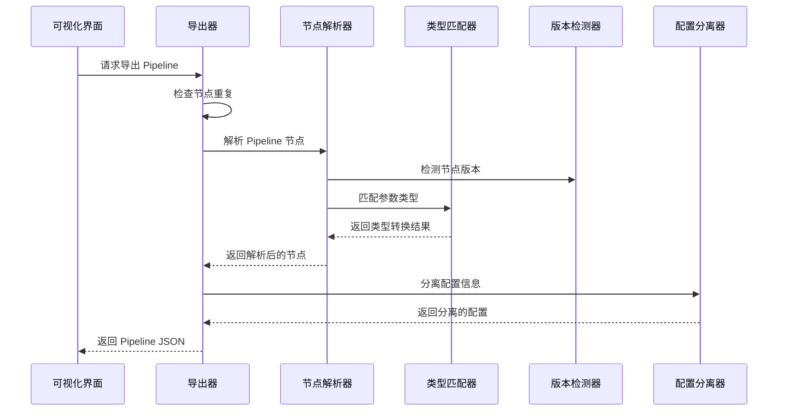
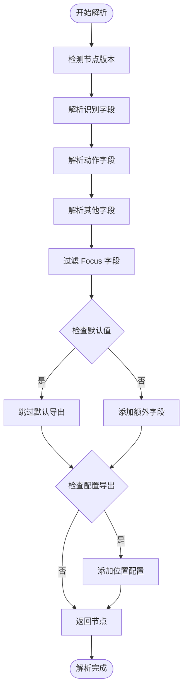
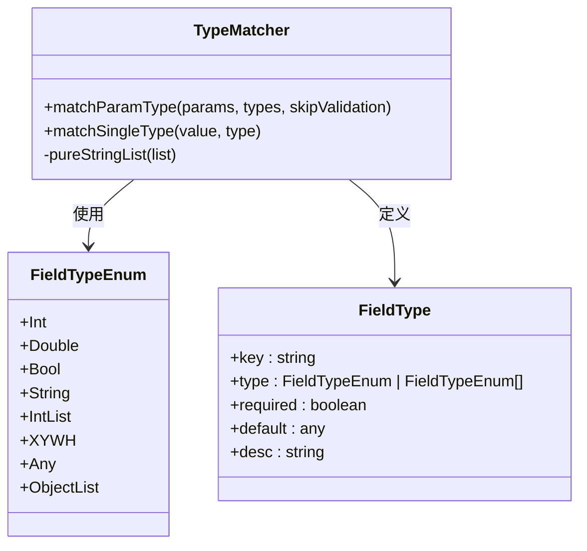
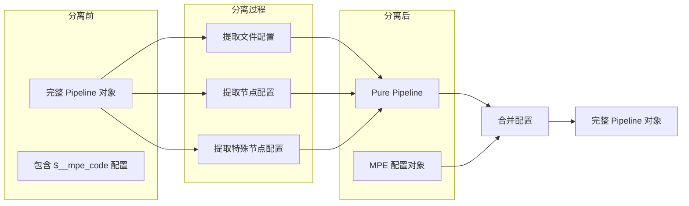

# 节点解析器系统

<cite>
**本文档引用的文件**
- [nodeParser.ts](file://src/core/parser/nodeParser.ts)
- [types.ts](file://src/core/parser/types.ts)
- [typeMatchers.ts](file://src/core/parser/typeMatchers.ts)
- [versionDetector.ts](file://src/core/parser/versionDetector.ts)
- [exporter.ts](file://src/core/parser/exporter.ts)
- [configSplitter.ts](file://src/core/parser/configSplitter.ts)
- [index.ts](file://src/core/parser/index.ts)
- [fieldFactory.ts](file://src/core/fields/fieldFactory.ts)
- [fieldTypes.ts](file://src/core/fields/fieldTypes.ts)
- [types.ts](file://src/core/fields/types.ts)
- [fields.ts](file://src/core/fields/recognition/fields.ts)
- [PipelineNode/index.tsx](file://src/components/flow/nodes/PipelineNode/index.tsx)
- [flow/types.ts](file://src/stores/flow/types.ts)
- [graphSlice.ts](file://src/stores/flow/slices/graphSlice.ts)
</cite>

## 目录
1. [简介](#简介)
2. [项目结构](#项目结构)
3. [核心组件](#核心组件)
4. [架构总览](#架构总览)
5. [详细组件分析](#详细组件分析)
6. [依赖关系分析](#依赖关系分析)
7. [性能考虑](#性能考虑)
8. [故障排除指南](#故障排除指南)
9. [结论](#结论)

## 简介

节点解析器系统是 MaaPipelineEditor 的核心模块，负责将可视化编辑器中的 Flow 格式节点转换为标准的 Pipeline JSON 格式，并提供反向转换能力。该系统采用模块化设计，通过类型匹配、版本检测、配置分离等机制，确保不同版本和类型的节点能够正确解析和导出。

系统主要处理五种节点类型：Pipeline 节点、External 节点、Anchor 节点、Sticker 便签节点和 Group 分组节点。每个节点类型都有专门的解析器和配置管理机制。

## 项目结构

节点解析器系统位于 `src/core/parser` 目录下，采用分层模块化架构：



**图表来源**
- [nodeParser.ts:1-468](file://src/core/parser/nodeParser.ts#L1-L468)
- [typeMatchers.ts:1-340](file://src/core/parser/typeMatchers.ts#L1-L340)
- [versionDetector.ts:1-149](file://src/core/parser/versionDetector.ts#L1-L149)
- [exporter.ts:1-256](file://src/core/parser/exporter.ts#L1-L256)
- [configSplitter.ts:1-486](file://src/core/parser/configSplitter.ts#L1-L486)

**章节来源**
- [index.ts:1-54](file://src/core/parser/index.ts#L1-L54)

## 核心组件

### 节点解析器 (NodeParser)

节点解析器是系统的核心组件，负责将 Flow 节点转换为 Pipeline 格式。它包含五个主要解析函数：

1. **Pipeline 节点解析**：处理识别算法、动作类型、其他参数的转换
2. **External 节点解析**：处理外部节点的位置信息
3. **Anchor 节点解析**：处理重定向节点的位置信息
4. **Sticker 便签解析**：处理便签节点的内容、颜色、尺寸
5. **Group 分组解析**：处理分组节点的子节点信息

### 类型匹配器 (TypeMatcher)

类型匹配器负责将输入参数按照预定义的字段类型进行转换和验证。支持多种数据类型包括整数、浮点数、布尔值、字符串、数组等。

### 版本检测器 (VersionDetector)

版本检测器自动识别节点的版本信息，支持 v1 和 v2 两种版本格式的兼容处理。

### 导出器 (Exporter)

导出器协调整个导出流程，包括节点排序、类型转换、配置分离等功能。

**章节来源**
- [nodeParser.ts:30-156](file://src/core/parser/nodeParser.ts#L30-L156)
- [typeMatchers.ts:292-339](file://src/core/parser/typeMatchers.ts#L292-L339)
- [versionDetector.ts:23-32](file://src/core/parser/versionDetector.ts#L23-L32)
- [exporter.ts:42-210](file://src/core/parser/exporter.ts#L42-L210)

## 架构总览

节点解析器系统采用分层架构设计，各层职责明确：



**图表来源**
- [exporter.ts:42-210](file://src/core/parser/exporter.ts#L42-L210)
- [nodeParser.ts:30-156](file://src/core/parser/nodeParser.ts#L30-L156)
- [typeMatchers.ts:292-339](file://src/core/parser/typeMatchers.ts#L292-L339)
- [versionDetector.ts:23-32](file://src/core/parser/versionDetector.ts#L23-L32)
- [configSplitter.ts:21-141](file://src/core/parser/configSplitter.ts#L21-L141)

## 详细组件分析

### 节点解析流程



**图表来源**
- [nodeParser.ts:30-156](file://src/core/parser/nodeParser.ts#L30-L156)

### 类型匹配机制

类型匹配器采用多类型尝试策略，支持以下数据类型：



**图表来源**
- [typeMatchers.ts:24-283](file://src/core/parser/typeMatchers.ts#L24-L283)
- [fieldTypes.ts:4-26](file://src/core/fields/fieldTypes.ts#L4-L26)
- [types.ts:6-16](file://src/core/fields/types.ts#L6-L16)

### 配置分离与合并

配置分离器负责将节点的视觉配置与业务逻辑分离：



**图表来源**
- [configSplitter.ts:21-141](file://src/core/parser/configSplitter.ts#L21-L141)
- [configSplitter.ts:151-448](file://src/core/parser/configSplitter.ts#L151-L448)

**章节来源**
- [nodeParser.ts:270-380](file://src/core/parser/nodeParser.ts#L270-L380)
- [typeMatchers.ts:1-340](file://src/core/parser/typeMatchers.ts#L1-L340)
- [configSplitter.ts:1-486](file://src/core/parser/configSplitter.ts#L1-L486)

### 字段类型系统

系统采用统一的字段类型定义机制：

| 字段类型 | 描述 | 示例 |
|---------|------|------|
| Int | 整数类型 | 42, -10 |
| Double | 浮点数类型 | 3.14, -2.5 |
| Bool | 布尔类型 | true, false |
| String | 字符串类型 | "hello" |
| IntList | 整数数组 | [1,2,3] |
| XYWH | 坐标数组 | [100,200,300,400] |
| Any | 任意类型 | 对象或字符串 |

**章节来源**
- [fieldTypes.ts:1-27](file://src/core/fields/fieldTypes.ts#L1-L27)
- [types.ts:1-34](file://src/core/fields/types.ts#L1-L34)

## 依赖关系分析

节点解析器系统具有清晰的依赖层次结构：

```mermaid
graph TB
subgraph "外部依赖"
RF[@xyflow/react]
LZ[lodash]
AH[antd]
end
subgraph "核心模块"
NP[nodeParser]
TM[typeMatchers]
VD[versionDetector]
EX[exporter]
CS[configSplitter]
end
subgraph "工具模块"
FH[JsonHelper]
NU[nodeUtils]
VU[viewportUtils]
end
subgraph "存储模块"
FS[flow/store]
CS2[config/store]
ES[error/store]
end
RF --> NP
LZ --> TM
AH --> EX
NP --> TM
NP --> VD
EX --> NP
EX --> CS
EX --> FS
EX --> CS2
EX --> ES
CS --> CS2
CS --> FS
TM --> FH
NP --> NU
NP --> VU
```

**图表来源**
- [nodeParser.ts:1-25](file://src/core/parser/nodeParser.ts#L1-L25)
- [exporter.ts:1-36](file://src/core/parser/exporter.ts#L1-L36)
- [configSplitter.ts:6-14](file://src/core/parser/configSplitter.ts#L6-L14)

**章节来源**
- [index.ts:1-54](file://src/core/parser/index.ts#L1-L54)

## 性能考虑

节点解析器系统在设计时充分考虑了性能优化：

1. **惰性加载**：字段定义采用延迟初始化，避免不必要的内存占用
2. **类型缓存**：类型匹配结果进行缓存，减少重复计算
3. **批量处理**：支持批量节点解析，提高处理效率
4. **内存优化**：使用浅拷贝和对象池技术，减少内存分配
5. **异步处理**：大型导出操作采用异步执行，避免界面阻塞

## 故障排除指南

### 常见问题及解决方案

**问题1：节点类型转换失败**
- 检查字段类型定义是否正确
- 验证输入数据格式是否符合要求
- 查看控制台错误信息获取详细提示

**问题2：版本兼容性问题**
- 确认节点版本检测结果
- 检查 v1 和 v2 格式差异
- 使用版本转换工具进行升级

**问题3：配置导出异常**
- 检查配置分离逻辑
- 验证节点位置信息完整性
- 确认特殊节点处理正确性

**章节来源**
- [typeMatchers.ts:324-335](file://src/core/parser/typeMatchers.ts#L324-L335)
- [exporter.ts:44-55](file://src/core/parser/exporter.ts#L44-L55)

## 结论

节点解析器系统通过模块化设计和清晰的职责分工，实现了高效的节点格式转换功能。系统支持多种节点类型、丰富的字段类型和灵活的配置管理，为 MaaPipelineEditor 提供了强大的解析能力。

系统的架构设计具有良好的扩展性和维护性，未来可以轻松添加新的节点类型和字段类型，满足不断增长的功能需求。同时，完善的错误处理和性能优化机制确保了系统的稳定性和可靠性。